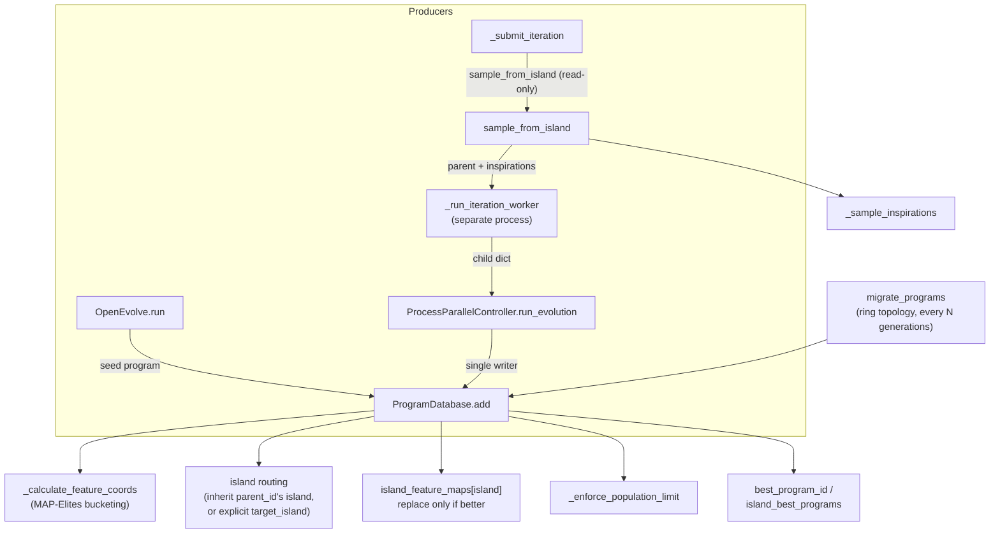

# The program database — MAP-Elites × island model for evolutionary code search

<!-- connect:up:begin -->
> **Cross-repo concept:** part of [evolutionary-algorithm-discovery](../../../concepts/evolutionary-algorithm-discovery.md) across this wiki's repos.
<!-- connect:up:end -->
## Overview
`ProgramDatabase` is the third pillar of the open-source AlphaEvolve recipe — the LLM proposes diffs, the
evaluator scores them, and this database decides **which scored candidates get to be tomorrow's parents**.
Every evaluated candidate is stored as an immutable-once-written [`Program`](../catalog/openevolve/database.md#Program)
record; the database's job is not to remember everything (it actively forgets), but to keep a *diverse,
improving* working set by combining two ideas: several isolated sub-populations ("islands") that evolve
independently, and, **inside each island**, a MAP-Elites feature grid that keeps at most one occupant per
behavioral cell. [`add`](../catalog/openevolve/database.md#ProgramDatabase.add) is where all of this
machinery — feature bucketing, island routing, elitism, population eviction — actually fires; everything
else in the class exists to feed it or to sample from what it has kept.

## Diagram

## Design rationale (why it's built this way)
**MAP-Elites is per-island, not global.** [`island_feature_maps`](../catalog/openevolve/database.md#ProgramDatabase.island_feature_maps)
is a *list* of grids, one per island, and [`islands`](../catalog/openevolve/database.md#ProgramDatabase.islands)
is a list of disjoint id sets — so an island doesn't compete for grid cells with its neighbors. Each island
runs its own elitism (a cell's occupant is only replaced by a strictly better program mapped to the same
coordinates), which is what actually produces the diversity the island model is meant for: five islands with
`num_islands=5` can independently occupy the *same* feature cell with five different solutions, instead of
one global grid collapsing them to one.

> [!inferred] The database deliberately keeps "where a program lives on the grid" (its
> [`feature_dimensions`](../catalog/openevolve/config.md#DatabaseConfig.feature_dimensions), e.g. code
> complexity or diversity) separate from "how good it is" (fitness, which prefers `combined_score` and
> otherwise averages metrics *excluding* the feature dimensions). If fitness weren't computed this way, a
> program could win a MAP-Elites cell partly because a feature *happened* to correlate with the fitness
> average — the code explicitly guards against that when comparing programs for replacement and for
> best-program tracking.

**Migration learned its shape the hard way.** [`migrate_programs`](../catalog/openevolve/database.md#ProgramDatabase.migrate_programs)
moves each island's top `migration_rate` fraction to its two ring-adjacent islands. A code comment at the
call site records the bug this guards against: unrestricted re-migration let one program spawn *183*
descendant copies by iteration 850, because identical code always maps to the identical MAP-Elites cell —
each re-migrated copy just displaced the last, wasting evaluation budget and shrinking real diversity. The
fix is a one-way ratchet: a migrant is stamped `metadata["migrant"] = True` and is skipped when
`migrate_programs` runs again, and a migrant copy is never even created if the target island already
contains a program with byte-identical code. Both checks are enforced *before* the copy is built, not after
— cheaper than relying on [`add`](../catalog/openevolve/database.md#ProgramDatabase.add)'s novelty/elitism
gates to clean it up downstream. [`test_migration_prevents_re_migration`](../catalog/tests/test_database.md#TestProgramDatabase.test_migration_prevents_re_migration)
and [`test_migration_uses_map_elites_deduplication`](../catalog/tests/test_migration_no_duplicates.md#TestMigrationNoDuplicates.test_migration_uses_map_elites_deduplication)
pin this behavior down.

**The best program is tracked outside the grid.** `best_program_id` and `island_best_programs` are plain
scalars updated on every [`add`](../catalog/openevolve/database.md#ProgramDatabase.add) call, independent of
MAP-Elites cell occupancy or archive membership. [`_enforce_population_limit`](../catalog/openevolve/database.md#ProgramDatabase._enforce_population_limit)
explicitly protects `best_program_id` (and the program currently being inserted) from eviction — so the best
solution found so far can never be silently deleted just because a MAP-Elites cell lost, or the population
cap was hit.

> [!inferred] [`run_iteration_with_shared_db`](../catalog/openevolve/iteration.md#run_iteration_with_shared_db)
> reads as an earlier or alternate execution strategy — its docstring says "optimized for use with persistent
> worker processes," implying a design where a single long-lived worker holds a real (in-memory, not
> pickled) reference to the shared `ProgramDatabase`. At the pinned commit, though, nothing in the codebase
> imports or calls it: the actual path (`OpenEvolve.run` → `ProcessParallelController.run_evolution` →
> `_submit_iteration` → `_run_iteration_worker`) instead snapshots the database into a plain dict and hands it
> to a fresh `ProcessPoolExecutor` worker per iteration. This function appears to be vestigial relative to
> that path — see Open questions.

## Entry points
- [`run`](../catalog/openevolve/controller.md#OpenEvolve.run) — the top-level call a user makes; on a fresh
  run it evaluates and [`add`](../catalog/openevolve/database.md#ProgramDatabase.add)s the seed program
  before handing off to parallel evolution, and on resume it reads `database.last_iteration` to pick up where
  a checkpoint left off.
- [`run_evolution`](../catalog/openevolve/process_parallel.md#ProcessParallelController.run_evolution) — the
  loop that owns the database as a **single writer**: it is the only place `add` is called once evolution is
  underway, always fed by completed worker results.
- [`_submit_iteration`](../catalog/openevolve/process_parallel.md#ProcessParallelController._submit_iteration) —
  where a not-yet-evaluated iteration first touches the database, via a read-only
  [`sample_from_island`](../catalog/openevolve/database.md#ProgramDatabase.sample_from_island) call, before
  the work is handed to a subprocess.
- [`migrate_programs`](../catalog/openevolve/database.md#ProgramDatabase.migrate_programs) — invoked
  periodically by `run_evolution` (gated on generation counters, not iteration counts) rather than by any
  external caller driving it directly.
- [`save`](../catalog/openevolve/database.md#ProgramDatabase.save) /
  [`load`](../catalog/openevolve/database.md#ProgramDatabase.load) — checkpoint entry points, called from
  [`_save_checkpoint`](../catalog/openevolve/controller.md#OpenEvolve._save_checkpoint) and from
  `ProgramDatabase.__init__` respectively.

## Mechanism (step-by-step)
1. **Seeding.** [`run`](../catalog/openevolve/controller.md#OpenEvolve.run) evaluates the user's initial
   program and calls [`add`](../catalog/openevolve/database.md#ProgramDatabase.add) once, with no
   `parent_id`, so it lands on [`current_island`](../catalog/openevolve/database.md#ProgramDatabase.current_island)
   (island 0 by default).
2. **Sampling a parent, off the write path.** For each new iteration,
   [`_submit_iteration`](../catalog/openevolve/process_parallel.md#ProcessParallelController._submit_iteration)
   calls [`sample_from_island`](../catalog/openevolve/database.md#ProgramDatabase.sample_from_island) for a
   specific island id, *not* the mutating `sample()`/[`current_island`](../catalog/openevolve/database.md#ProgramDatabase.current_island)
   path a single-process caller would use
   — this method reads the island's population and its config's `exploration_ratio` /
   `exploitation_ratio` to pick one of three parent-selection modes (uniform-random from the island,
   fitness-weighted from the island, or drawn from the global elite archive) without touching any shared
   mutable state, so concurrent workers sampling different islands can never race each other.
3. **Off-process mutation.** The parent, its inspirations, and a serialized snapshot of the relevant
   database state are handed to [`_run_iteration_worker`](../catalog/openevolve/process_parallel.md#_run_iteration_worker),
   which runs in its own OS process. The worker prompts the LLM, evaluates the resulting child, and returns a
   picklable result — it never mutates the real `ProgramDatabase`, because it doesn't have one; it only has a
   dict.
4. **The one and only writer.** Back in the main process,
   [`run_evolution`](../catalog/openevolve/process_parallel.md#ProcessParallelController.run_evolution)
   reconstructs a [`Program`](../catalog/openevolve/database.md#Program) from the worker's result dict and is
   the sole caller of [`add`](../catalog/openevolve/database.md#ProgramDatabase.add) once evolution is
   running — this single-writer discipline is what makes the process-parallel design safe without locks
   around the database itself.
5. **`add`'s own logic.** Inside [`add`](../catalog/openevolve/database.md#ProgramDatabase.add): the program
   is stored in [`programs`](../catalog/openevolve/database.md#ProgramDatabase.programs) by its
   [`id`](../catalog/openevolve/database.md#Program.id); its MAP-Elites coordinates are computed by
   [`_calculate_feature_coords`](../catalog/openevolve/database.md#ProgramDatabase._calculate_feature_coords);
   its island is resolved (explicit `target_island` wins, otherwise a child inherits its
   [`parent_id`](../catalog/openevolve/database.md#Program.parent_id)'s recorded island so a lineage never
   crosses islands invisibly, otherwise it falls back to `current_island`); a novelty check may reject it
   outright; then it either claims an empty MAP-Elites cell or replaces the current occupant only if strictly
   fitter, is added to its island's id set, and updates the archive.
6. **Enforcing scale, then best-program tracking.** Still inside `add`, immediately after the archive update
   and *before* best-program tracking runs,
   [`_enforce_population_limit`](../catalog/openevolve/database.md#ProgramDatabase._enforce_population_limit)
   evicts the globally worst-fitness programs if `programs` has grown past `config.population_size`,
   explicitly sparing `best_program_id` and the program just inserted. Only after eviction does `add` update
   the global best and per-island best trackers — a code comment at the call site is explicit that population
   enforcement must run *before* best-program tracking, "to ensure newly added programs aren't immediately
   removed" by their own eviction pass.
7. **Migration, recursively through `add`.** When `run_evolution`'s periodic check finds island generation
   counters have advanced `migration_interval` steps since the last migration,
   [`migrate_programs`](../catalog/openevolve/database.md#ProgramDatabase.migrate_programs) selects each
   island's top performers, copies each (with a fresh id and `metadata["migrant"]=True`) into its two
   ring-neighbor islands, and inserts each copy via the *same* [`add`](../catalog/openevolve/database.md#ProgramDatabase.add)
   call an organically-bred child would use — migrants are not special-cased into the grid, they compete for
   cells exactly like anything else.

## Key data structures
- [`programs`](../catalog/openevolve/database.md#ProgramDatabase.programs) — `id -> Program`, the single
  source of truth; every other structure below stores only ids into this dict.
- [`islands`](../catalog/openevolve/database.md#ProgramDatabase.islands) — `list[Set[str]]`, one disjoint id
  set per island; a program belongs to exactly one, tracked redundantly on the program itself via
  [`metadata`](../catalog/openevolve/database.md#Program.metadata)`["island"]`.
- [`island_feature_maps`](../catalog/openevolve/database.md#ProgramDatabase.island_feature_maps) —
  `list[Dict[str, str]]`, one MAP-Elites grid per island, keyed by a stringified bin-coordinate tuple and
  valued by the occupant's id.
- `archive` — a bounded global set of elite ids (size `config.archive_size`) used for exploitation-mode
  sampling, independent of the per-island grids.
- `best_program_id` / `island_best_programs` — scalars tracking the single best program overall and per
  island, exempt from population-limit eviction.
- [`Program`](../catalog/openevolve/database.md#Program) — the record itself:
  [`id`](../catalog/openevolve/database.md#Program.id),
  [`code`](../catalog/openevolve/database.md#Program.code),
  [`parent_id`](../catalog/openevolve/database.md#Program.parent_id) (lineage),
  [`metrics`](../catalog/openevolve/database.md#Program.metrics) (the evaluator's raw scores, which feed both
  fitness and, for `feature_dimensions` named after a metric, MAP-Elites bucketing directly), and
  [`metadata`](../catalog/openevolve/database.md#Program.metadata) (carries `island`, and — for migrants —
  `migrant: True`).
- [`config`](../catalog/openevolve/database.md#ProgramDatabase.config) (`DatabaseConfig`) — holds
  [`feature_dimensions`](../catalog/openevolve/config.md#DatabaseConfig.feature_dimensions) (which axes define
  the grid; defaults to `["complexity", "diversity"]`), plus `num_islands` (default 5), `population_size`
  (default 1000), `migration_interval`/`migration_rate` (default every 50 generations, 10% of an island).

## Dynamics (design intent)
The database is designed to be touched by many readers but exactly one writer at a time.
[`sample_from_island`](../catalog/openevolve/database.md#ProgramDatabase.sample_from_island) is the
concurrency-safe read path — its docstring is explicit that it exists so "multiple workers sampling from
different islands concurrently" don't race, in contrast to the single-process `sample()`/`current_island`
path. Mutation (`add`, `migrate_programs`, population eviction) all happens back in
[`run_evolution`](../catalog/openevolve/process_parallel.md#ProcessParallelController.run_evolution) on the
main process, after a worker's future resolves — never inside
[`_run_iteration_worker`](../catalog/openevolve/process_parallel.md#_run_iteration_worker) itself, which only
sees a point-in-time dict snapshot. Island isolation under concurrent submission is exercised directly by
[`test_island_distribution_in_batch`](../catalog/tests/test_island_isolation.md#TestIslandIsolation.test_island_distribution_in_batch)
(initial iterations are round-robin-distributed so every island gets submissions) and by
[`test_no_program_assigned_to_multiple_islands`](../catalog/tests/test_database.md#TestProgramDatabase.test_no_program_assigned_to_multiple_islands)
and [`test_parent_child_island_consistency`](../catalog/tests/test_island_parent_consistency.md#TestIslandParentConsistency.test_parent_child_island_consistency),
which assert the invariant that a child is only ever placed in its parent's island (or an explicit
`target_island`), never silently drawn into whichever island happened to be `current_island` at submission
time.

## Edge cases
- **Empty island sampled for exploration.** [`_sample_exploration_parent`](../catalog/openevolve/database.md#ProgramDatabase._sample_exploration_parent)
  doesn't reuse the global best program's id when an island has nothing in it — it clones the best program
  under a brand-new uuid and adds *that copy* to the empty island, so the same id is never a member of two
  islands at once. [`test_empty_island_initialization_creates_copies`](../catalog/tests/test_database.md#TestProgramDatabase.test_empty_island_initialization_creates_copies)
  pins this down.
- **Feature dimension not resolvable.** [`_calculate_feature_coords`](../catalog/openevolve/database.md#ProgramDatabase._calculate_feature_coords)
  raises `ValueError` if a configured [`feature_dimensions`](../catalog/openevolve/config.md#DatabaseConfig.feature_dimensions)
  entry is neither a key in the program's [`metrics`](../catalog/openevolve/database.md#Program.metrics) nor
  one of the three built-ins (`complexity`, `diversity`, `score`) — a fail-fast check rather than silently
  defaulting a bin index.
- **Stale references everywhere are tolerated, not fatal.** Feature-map occupants, archive members, and
  island-best ids can all point at a program id that
  [`_enforce_population_limit`](../catalog/openevolve/database.md#ProgramDatabase._enforce_population_limit)
  or a reload has since removed; `add`, sampling, and load all re-check `pid in self.programs` and repair or
  drop the stale entry rather than raising.
- **Custom metrics silently override the built-in feature calculation.** If `metrics` already contains a key
  matching a `feature_dimensions` entry (e.g. an evaluator-supplied `complexity`), that value is used
  directly for bucketing instead of the built-in code-length/diversity heuristic — deliberate, but easy to
  miss if you expect `"complexity"` to always mean code length.

## Open questions
- Whether [`run_iteration_with_shared_db`](../catalog/openevolve/iteration.md#run_iteration_with_shared_db)
  is genuinely dead code at this commit, or reserved for an embedding/library use case not exercised by the
  CLI or test suite in this packet's subgraph, isn't settled by the code alone — nothing in the subgraph
  imports it outside its own definition.
- The exact fitness function that both cell-replacement and best-program comparisons depend on
  (`combined_score`-first, falling back to a `feature_dimensions`-excluded metric average) lives in a helper
  outside this packet's subgraph, so its precise tie-breaking behavior is described here only from reading
  the call sites, not cited directly.
- The feature-value scaling/normalization that turns a raw metric into a bin index (min-max tracking across
  observed values, per `feature_stats`) is only touched at the edges here
  ([`test_feature_ranges_preserved_across_checkpoints`](../catalog/tests/test_grid_stability.md#TestGridStability.test_feature_ranges_preserved_across_checkpoints)
  in the packet) and would deserve its own pass if grid-stability behavior across long runs or checkpoint
  resumes becomes the question being asked.

## See also
- [`openevolve-controller.md`](openevolve-controller.md) — the orchestrator that owns `run`/`run_evolution`
  and is the database's single writer.
- [`openevolve-evaluator.md`](openevolve-evaluator.md) — produces the `metrics` this page's fitness and
  MAP-Elites bucketing both depend on.
- [`openevolve-llm-ensemble.md`](openevolve-llm-ensemble.md) — the mutation operator whose output becomes the
  `Program` this page stores.
- [`../../../sources/alphaevolve.md`](../../../sources/alphaevolve.md) — the DeepMind paper this repo
  reimplements; its population/database design is the direct model for `ProgramDatabase`.
- [`../../../concepts/evolutionary-algorithm-discovery.md`](../../../concepts/evolutionary-algorithm-discovery.md) —
  the cross-repo concept this page is the openevolve-side instance of.
