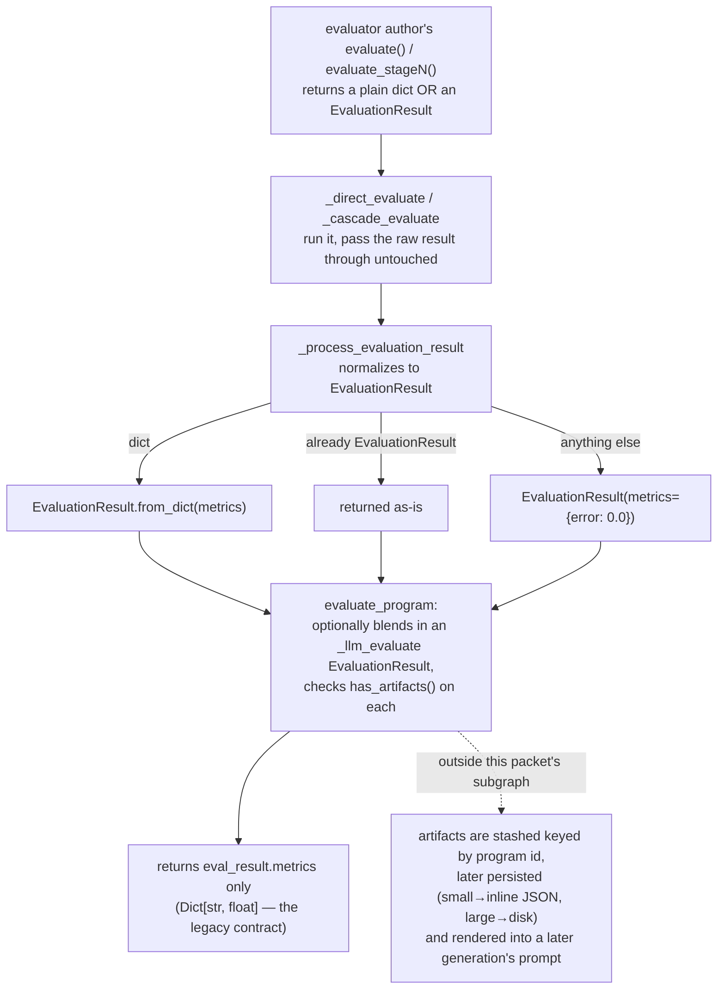

# EvaluationResult — the metrics-plus-artifacts evaluation contract

## Overview

In the AlphaEvolve recipe, "scoring a candidate" is the step that turns an LLM-mutated program into a
number the program database can rank it by. OpenEvolve's answer to "what does scoring produce" is the
[`EvaluationResult`](../catalog/openevolve/evaluation_result.md#EvaluationResult) dataclass: a mandatory
[`metrics`](../catalog/openevolve/evaluation_result.md#EvaluationResult.metrics) dict (the fitness signal
MAP-Elites bins on) plus an optional
[`artifacts`](../catalog/openevolve/evaluation_result.md#EvaluationResult.artifacts) dict — arbitrary
strings or bytes (stderr, a stack trace, a rendered plot, profiler output) that never touch the fitness
score but still get carried forward.

The class's own docstring frames it precisely:

> "Result of program evaluation containing both metrics and optional artifacts. This maintains backward
> compatibility with the existing dict[str, float] contract while adding a side-channel for arbitrary
> artifacts (text or binary data)."

That "backward compatibility" framing is the key design fact: a bare `evaluate(program_path) -> dict`
function — the original AlphaEvolve-style contract — still works unmodified. `EvaluationResult` is an
*additive* upgrade path, not a breaking replacement, and every layer that consumes it
([`_process_evaluation_result`](../catalog/openevolve/evaluator.md#Evaluator._process_evaluation_result),
[`evaluate_program`](../catalog/openevolve/evaluator.md#Evaluator.evaluate_program)) is written to accept
either shape.

The artifacts side-channel is what lets a failing or borderline candidate explain *why* it scored the way
it did — a syntax error's stderr, a shape-mismatch message, a timeout marker — so that the next prompt
built for that lineage can show the LLM the failure, not just a `0.0`. That prompt-injection step is what
turns evaluation from a one-way score into a two-way conversation between evaluator and mutator; this page
covers the data contract itself, not the injection machinery (see Open questions and See also for where
that lives).

## Diagram

## Design rationale (why it's built this way)

- **Two-tier contract, one field split.** `metrics: Dict[str, float]` is mandatory; `artifacts:
  Dict[str, Union[str, bytes]]` defaults to `{}` via `field(default_factory=dict)`. Keeping them as
  separate fields (rather than, say, one blob with a reserved key) means the database only ever binds
  MAP-Elites features to `metrics`, and the docstring is explicit that those values must be **raw
  continuous scores**, not pre-computed bin indices — the class's own example block
  (`✅ {"combined_score": 0.85, "prompt_length": 1247, ...}` vs. `❌` a pre-binned `7`) exists specifically
  to head off a misuse that would silently break the database's own binning.
- **Backward compatibility over redesign.**
  [`from_dict`](../catalog/openevolve/evaluation_result.md#EvaluationResult.from_dict) and
  [`to_dict`](../catalog/openevolve/evaluation_result.md#EvaluationResult.to_dict) exist purely so that
  the hundreds of pre-existing example evaluators that `return {"score": ...}` never had to be rewritten —
  [`_process_evaluation_result`](../catalog/openevolve/evaluator.md#Evaluator._process_evaluation_result)
  auto-wraps a dict on the way in, and
  [`evaluate_program`](../catalog/openevolve/evaluator.md#Evaluator.evaluate_program) unwraps back to a
  dict on the way out. `EvaluationResult` is optional to *adopt*, not optional to *support*.
- **Self-measuring, not self-limiting.**
  [`get_artifact_size`](../catalog/openevolve/evaluation_result.md#EvaluationResult.get_artifact_size) and
  [`get_total_artifact_size`](../catalog/openevolve/evaluation_result.md#EvaluationResult.get_total_artifact_size)
  give callers a byte count (UTF-8 length for `str`, raw length for `bytes`, `str()`-then-encode for
  anything else) but the class itself never truncates or rejects anything. Sizing policy — what counts as
  "too big to inline" — is deliberately left to whoever stores the artifacts, not baked into the data
  class.
- **The return-value lies a little, on purpose.**
  [`evaluate_program`](../catalog/openevolve/evaluator.md#Evaluator.evaluate_program)'s own signature still
  promises `Dict[str, float]`, and that is *exactly* what it returns even when the underlying evaluator
  produced artifacts — it checks
  [`has_artifacts`](../catalog/openevolve/evaluation_result.md#EvaluationResult.has_artifacts) on the
  result (and on a separate LLM-judge result) but never returns the artifacts to its own caller. They are
  captured out-of-band as a side effect instead. This is the single most surprising thing about the
  contract: `EvaluationResult` looks like a return-value upgrade, but in practice it's a *smuggling
  mechanism* — the metrics travel the front door (the return value) while the artifacts travel out the
  back (evaluator-internal bookkeeping), and only the metrics half honors the type signature.

## Entry points

1. An evaluator author's `evaluate()` (or a cascade stage `evaluate_stageN()`) constructs an
   `EvaluationResult` directly to pair a validation failure with an explanation — e.g.
   [`evaluate`](../catalog/examples/function_minimization/evaluator.md#evaluate) and
   [`evaluate_stage1`](../catalog/examples/function_minimization/evaluator.md#evaluate_stage1) in
   `function_minimization`, [`evaluate`](../catalog/examples/circle_packing_with_artifacts/evaluator.md#evaluate)
   and [`evaluate_stage1`](../catalog/examples/circle_packing_with_artifacts/evaluator.md#evaluate_stage1)
   in `circle_packing_with_artifacts`, [`evaluate`](../catalog/examples/arc_benchmark/evaluator.md#evaluate)
   in `arc_benchmark`, and the same
   [`evaluate_stage1`](../catalog/examples/algotune/affine_transform_2d/evaluator.md#evaluate_stage1) shape
   repeated across the AlgoTune task suite (e.g.
   [`evaluate_stage1`](../catalog/examples/algotune/lu_factorization/evaluator.md#evaluate_stage1)).
2. Cross-language evaluators construct one at the end of a whole run, not just on failure — e.g.
   [`evaluate`](../catalog/examples/r_robust_regression/evaluator.md#evaluate) (R subprocess) and
   [`_evaluate`](../catalog/examples/rust_adaptive_sort/evaluator.md#_evaluate) /
   [`evaluate`](../catalog/examples/rust_adaptive_sort/evaluator.md#evaluate) (Rust via Cargo), both
   surfacing subprocess `stderr` as an artifact when compilation fails.
3. [`_process_evaluation_result`](../catalog/openevolve/evaluator.md#Evaluator._process_evaluation_result)
   receiving a plain dict and calling `EvaluationResult`'s
   [`from_dict`](../catalog/openevolve/evaluation_result.md#EvaluationResult.from_dict) —
   the legacy-compatibility on-ramp for evaluators that never adopted the new contract.
4. [`_cascade_evaluate`](../catalog/openevolve/evaluator.md#Evaluator._cascade_evaluate)
   synthesizing one itself on a stage timeout or exception, with descriptive `artifacts` (`stderr`,
   `traceback`, `failure_stage`) that the evaluator author never had to write.
5. Test code constructing one directly to exercise the contract, e.g.
   [`mock_evaluate`](../catalog/tests/test_cascade_validation.md#TestCascadeValidation.mock_evaluate),
   [`test_evaluation_result_with_artifacts`](../catalog/tests/test_artifacts.md#TestEvaluationResult.test_evaluation_result_with_artifacts),
   and
   [`test_from_dict_compatibility`](../catalog/tests/test_artifacts.md#TestEvaluationResult.test_from_dict_compatibility).

## Mechanism (step-by-step)

1. The evaluation module loaded from the user's `evaluator.py` exposes `evaluate` (and optionally
   `evaluate_stage1`/`2`/`3`), free to return either a plain `dict` or an
   [`EvaluationResult`](../catalog/openevolve/evaluation_result.md#EvaluationResult) — see the example
   evaluators cited under Entry points.
2. [`_direct_evaluate`](../catalog/openevolve/evaluator.md#Evaluator._direct_evaluate) or
   [`_cascade_evaluate`](../catalog/openevolve/evaluator.md#Evaluator._cascade_evaluate) runs that function
   under a timeout and returns whatever it produced completely unopened — neither function inspects the
   shape.
3. [`_process_evaluation_result`](../catalog/openevolve/evaluator.md#Evaluator._process_evaluation_result)
   is the single normalization point: a `dict` becomes `EvaluationResult`'s
   [`from_dict`](../catalog/openevolve/evaluation_result.md#EvaluationResult.from_dict),
   an existing `EvaluationResult` passes through untouched, and any other type becomes a synthetic
   `EvaluationResult(metrics={"error": 0.0})` with a logged warning — confirmed for both branches by
   [`test_process_evaluation_result_with_dict`](../catalog/tests/test_cascade_validation.md#TestCascadeValidation.test_process_evaluation_result_with_dict)
   and
   [`test_process_evaluation_result_with_artifacts`](../catalog/tests/test_cascade_validation.md#TestCascadeValidation.test_process_evaluation_result_with_artifacts).
4. Inside cascade evaluation, each stage's `EvaluationResult` is merged into the next: numeric
   [`metrics`](../catalog/openevolve/evaluation_result.md#EvaluationResult.metrics) are folded together
   stage by stage, and [`artifacts`](../catalog/openevolve/evaluation_result.md#EvaluationResult.artifacts)
   dicts are merged (not replaced) so a later stage's failure doesn't erase an earlier stage's evidence —
   see [`_cascade_evaluate`](../catalog/openevolve/evaluator.md#Evaluator._cascade_evaluate).
5. [`evaluate_program`](../catalog/openevolve/evaluator.md#Evaluator.evaluate_program) is the outward
   seam: it drives step 2–4, optionally blends in a second `EvaluationResult` from
   [`_llm_evaluate`](../catalog/openevolve/evaluator.md#Evaluator._llm_evaluate) (an LLM-as-judge score),
   checks [`has_artifacts`](../catalog/openevolve/evaluation_result.md#EvaluationResult.has_artifacts) on
   both results, and finally returns only `eval_result.metrics` — a bare `Dict[str, float]` — to whatever
   called it, per its own backward-compatible signature.
6. The full round trip is pinned end to end by tests:
   [`test_direct_evaluate_supports_evaluation_result`](../catalog/tests/test_cascade_validation.md#TestCascadeValidation.test_direct_evaluate_supports_evaluation_result)
   confirms `_direct_evaluate` hands an `EvaluationResult` through unchanged, and
   [`run_test`](../catalog/tests/test_artifacts_integration.md#TestArtifactsIntegration.run_test) confirms
   that a program which fails to compile still yields recoverable `stderr`/`failure_stage` artifacts via
   [`evaluate_program`](../catalog/openevolve/evaluator.md#Evaluator.evaluate_program).

## Key data structures

- [`EvaluationResult`](../catalog/openevolve/evaluation_result.md#EvaluationResult) — a `@dataclass` with
  two fields:
  - [`metrics`](../catalog/openevolve/evaluation_result.md#EvaluationResult.metrics):
    `Dict[str, float]`, mandatory — "the existing contract," per the inline comment in the source.
  - [`artifacts`](../catalog/openevolve/evaluation_result.md#EvaluationResult.artifacts):
    `Dict[str, Union[str, bytes]]`, defaulting to empty — "optional side-channel."
- Read helpers, all defined on the class itself, each doing exactly one small thing:
  - [`has_artifacts`](../catalog/openevolve/evaluation_result.md#EvaluationResult.has_artifacts) —
    `bool(self.artifacts)`, i.e. "any at all," not "any non-trivial."
  - [`get_artifact_keys`](../catalog/openevolve/evaluation_result.md#EvaluationResult.get_artifact_keys) —
    `list(self.artifacts.keys())`.
  - [`get_artifact_size`](../catalog/openevolve/evaluation_result.md#EvaluationResult.get_artifact_size) —
    byte length of one artifact (UTF-8 encode for `str`, raw `len` for `bytes`, `str()`-then-encode as a
    fallback for anything else).
  - [`get_total_artifact_size`](../catalog/openevolve/evaluation_result.md#EvaluationResult.get_total_artifact_size)
    — sum of `get_artifact_size` over every key.
  - [`from_dict`](../catalog/openevolve/evaluation_result.md#EvaluationResult.from_dict) /
    [`to_dict`](../catalog/openevolve/evaluation_result.md#EvaluationResult.to_dict) — the legacy-contract
    adapters described above.

## Dynamics (design intent)

- The dict round trip is a hard guarantee, not an accident:
  [`test_from_dict_compatibility`](../catalog/tests/test_artifacts.md#TestEvaluationResult.test_from_dict_compatibility)
  asserts `EvaluationResult.from_dict(d).to_dict() == d` exactly, and that `artifacts` is `{}` when a bare
  dict is the only thing an evaluator ever produced.
- [`test_evaluation_result_with_artifacts`](../catalog/tests/test_artifacts.md#TestEvaluationResult.test_evaluation_result_with_artifacts)
  asserts `has_artifacts()` and `get_artifact_keys()` reflect exactly the artifacts dict the evaluator
  supplied — no filtering, no key transformation.
- [`test_artifact_size_calculation`](../catalog/tests/test_artifacts.md#TestEvaluationResult.test_artifact_size_calculation)
  pins the size semantics precisely: a `str` artifact is measured by its UTF-8-encoded byte length (not
  `len(str)`, which would undercount multi-byte characters), a `bytes` artifact by its raw length, and the
  total is the plain sum — this is the measurement the storage layer downstream is expected to use to
  decide what's "small."
- [`test_process_evaluation_result_dict`](../catalog/tests/test_artifacts.md#TestEvaluatorArtifacts.test_process_evaluation_result_dict)
  and
  [`test_process_evaluation_result_evaluation_result`](../catalog/tests/test_artifacts.md#TestEvaluatorArtifacts.test_process_evaluation_result_evaluation_result)
  together pin both branches of the normalization: a dict gets wrapped with empty `artifacts`; an
  `EvaluationResult` passed in comes back out identical (`self.assertEqual(result, original)`).
- [`test_cascade_evaluation_with_artifacts`](../catalog/tests/test_artifacts_integration.md#TestArtifactsIntegration.test_cascade_evaluation_with_artifacts)
  documents the intent that a cascade failure at stage 1 still surfaces `stderr` in `artifacts` alongside
  the zeroed `stage1_passed` metric — the artifact is meant to explain the metric, not just accompany it.

## Edge cases

- **Unrecognized return type.** If an evaluator returns something that is neither a `dict` nor an
  `EvaluationResult` (e.g. `None`, a tuple, an exception object it forgot to raise),
  [`_process_evaluation_result`](../catalog/openevolve/evaluator.md#Evaluator._process_evaluation_result)
  logs a warning and silently substitutes `EvaluationResult(metrics={"error": 0.0})` — whatever the
  evaluator actually returned is discarded, not surfaced as an artifact.
- **Non-string/bytes artifact values.** Nothing in the dataclass enforces that `artifacts` values are
  actually `str`/`bytes` — [`test_process_evaluation_result_with_artifacts`](../catalog/tests/test_cascade_validation.md#TestCascadeValidation.test_process_evaluation_result_with_artifacts)
  exercises `artifacts={"log": "test log", "data": [1, 2, 3]}`, a plain list, and
  [`get_artifact_size`](../catalog/openevolve/evaluation_result.md#EvaluationResult.get_artifact_size)
  handles it via a `str(value)`-then-encode fallback rather than raising.
- **Cascade stage failure doesn't discard earlier evidence.** A stage-2 timeout or exception updates the
  stage-1 `EvaluationResult`'s `artifacts` in place (adding `stage2_timeout`/`stage2_stderr` etc.) rather
  than replacing it, so a program that got partway through cascade evaluation keeps whatever the earlier,
  successful stage already captured — see
  [`_cascade_evaluate`](../catalog/openevolve/evaluator.md#Evaluator._cascade_evaluate).
- **`evaluate_program`'s artifacts are structurally invisible to its own caller.**
  [`evaluate_program`](../catalog/openevolve/evaluator.md#Evaluator.evaluate_program) returns only
  `eval_result.metrics`; a caller that only reads the return value would never know
  [`has_artifacts`](../catalog/openevolve/evaluation_result.md#EvaluationResult.has_artifacts) was `True`
  for that evaluation.

## Open questions

- The consumer side of the side-channel — where drained artifacts actually get persisted (a size-based
  split between something inline and something on disk) and how a *parent* program's artifacts later
  reappear inside a *child* generation's prompt — is implemented in code that sits outside this packet's
  subgraph (the evaluator's own per-program bookkeeping, and the database/prompt-rendering layers). See the
  sibling concept pages below for that half of the loop.
- `EvaluationResult` exposes size-measurement helpers but no size *limit* — is truncation or rejection of
  oversized artifacts a caller responsibility everywhere, or could an evaluator author unknowingly emit an
  artifact large enough to blow out prompt context before any downstream layer would catch it?
- When both the code evaluator and the LLM-judge evaluator
  ([`_llm_evaluate`](../catalog/openevolve/evaluator.md#Evaluator._llm_evaluate)) return artifacts under
  the same key, is there a defined precedence, or does one silently overwrite the other? Nothing in this
  subgraph specifies a merge order for that case.

## See also

- [openevolve-evaluator.md](openevolve-evaluator.md) — the cascade/direct/LLM evaluation orchestration
  that produces, merges, and normalizes `EvaluationResult` values.
- [openevolve-database.md](openevolve-database.md) — where drained artifacts are persisted (inline JSON
  vs. on-disk files) and retrieved for the next prompt.
- [openevolve-process_parallel.md](openevolve-process_parallel.md) — the per-iteration worker that wires
  an evaluator's pending artifacts into the program database.
- [openevolve-prompt-sampler.md](openevolve-prompt-sampler.md) — renders a parent program's stored
  artifacts into the next generation's prompt, closing the loop this page's data contract opens.
- [../../../sources/alphaevolve.md](../../../sources/alphaevolve.md) — the AlphaEvolve paper this
  open-source recipe reimplements.
