# Evolution trace logging — recording lineage beside the live database

## Overview
`evolution_trace.py` is a self-contained observability layer, not a component of the evolutionary
mechanism itself. The live `ProgramDatabase` (see `openevolve-database.md`) only needs to know the
*current* population — which programs occupy which MAP-Elites cell in which island right now — so it
freely evicts programs once `population_size` is exceeded. Nothing about the evolutionary algorithm
requires remembering what used to be there. This module exists to answer a different question:
*what actually happened, in order, over the course of a run* — which program produced which child, with
what prompt, what LLM response, and what score change — for reproducibility, debugging, and (per the
module's own docstring) as training data.

The module docstring is explicit about the intended downstream use: "This module provides functionality
to log detailed traces of program evolution, capturing state-action-reward transitions for RL training
and analysis." That framing — parent program as state, LLM prompt/diff as action, metric delta as reward,
child program as next state — is the real reason the schema exists in this exact shape, not merely "a
debug log."

There are two independent ways an [`EvolutionTrace`](../catalog/openevolve/evolution_trace.md#EvolutionTrace)
record gets produced, and they are not equivalent:

1. **Live, incremental, opt-in** — [`log_trace`](../catalog/openevolve/evolution_trace.md#EvolutionTracer.log_trace)
   is called once per accepted child, in the main process, immediately after that child has already been
   merged into the live database.
2. **Offline, reconstructed, best-effort** — [`extract_evolution_trace_from_checkpoint`](../catalog/openevolve/evolution_trace.md#extract_evolution_trace_from_checkpoint)
   rebuilds the same parent/child records after the fact, purely by diffing the JSON program files a
   checkpoint happens to still contain.

Path 2 is not a superset or complement of path 1 that a reader can substitute freely — it is fundamentally
constrained by what path 1 does not lose: eviction. That distinction is the crux of this page.

## Diagram

```mermaid
flowchart TB
    subgraph Live["Live run (process_parallel.py, per accepted child)"]
        A["child_program merged into\nProgramDatabase.add()"] --> B["parent_program re-fetched\nvia database.get(parent_id)"]
        B --> C["EvolutionTracer.log_trace()"]
        C --> D["EvolutionTrace built:\nmetrics, code, changes_description,\nprompt, llm_response, artifacts"]
        D --> E["_update_stats() — running\nimprovement_count / best / worst"]
        D --> F["buffer.append()"]
        F -->|"len(buffer) >= buffer_size"| G["flush()"]
        G -->|"jsonl"| H["append_trace_jsonl\n(one line per trace, streamed)"]
        G -->|"json / hdf5"| I["kept in buffer/json_traces,\nnothing written yet"]
        J["controller.run() finishes\nor errors"] --> K["EvolutionTracer.close()"]
        K --> I
        I --> L["export_traces_json /\nexport_traces_hdf5\n(whole file, once)"]
    end

    subgraph Offline["Post-hoc, from a checkpoint directory (no tracer needed)"]
        M["checkpoint_dir/programs/*.json\n(ProgramDatabase.save snapshot)"] --> N["extract_evolution_trace_from_checkpoint"]
        N --> O{"parent_id present\nAND parent still in\nprograms dict?"}
        O -->|"no"| P["edge silently dropped\n(evicted / seed program)"]
        O -->|"yes"| Q["EvolutionTrace built from\nraw dict fields — no stats,\nno prompt unless saved on program"]
    end

    style P fill:#833,stroke:#faa
```

## Design rationale (why it's built this way)
- **Decoupled from the database on purpose.** `EvolutionTracer` has no reference into
  `ProgramDatabase` internals and no hook inside `ProgramDatabase.add()`. It is driven externally, from
  `process_parallel.py`, *after* the add has already
  happened — the caller re-fetches the parent with `database.get()` and only logs if that parent is
  still resolvable. This keeps the database's own hot path (island placement, MAP-Elites replacement,
  population-limit eviction) free of any tracing concern; tracing can be turned off entirely
  (`evolution_trace.enabled: false` is the config default) with zero code-path change in the database.
- **Buffered, but only for one format.** `jsonl` is the one format actually designed to survive a crash:
  each [`flush`](../catalog/openevolve/evolution_trace.md#EvolutionTracer.flush) call appends completed
  lines via [`append_trace_jsonl`](../catalog/openevolve/utils/trace_export_utils.md#append_trace_jsonl)
  and clears the buffer. `json` and `hdf5` do the opposite: `flush()` for those formats is a documented
  no-op ("Traces already added to json_traces" / "we'll keep accumulating until close"), and the entire
  file is written once, in [`close`](../catalog/openevolve/evolution_trace.md#EvolutionTracer.close). The
  `buffer_size` knob therefore only controls write cadence for `jsonl`; for the other two formats it's
  irrelevant to durability.
- **Two schemas collapse into one dataclass.** The live path constructs
  [`EvolutionTrace`](../catalog/openevolve/evolution_trace.md#EvolutionTrace) from live `Program` objects
  (attribute access: `.id`, `.metrics`, `.code`, `.generation`), while the offline path constructs the
  same dataclass from raw JSON dicts (`.get("parent_id")`, `.get("metrics", {})`) loaded straight off
  disk. Both converge on the same `EvolutionTrace` shape so any downstream consumer (an analysis
  notebook, an RL-training data loader) doesn't need to know which path produced a given record.

## Entry points
1. [`log_trace`](../catalog/openevolve/evolution_trace.md#EvolutionTracer.log_trace) — called once per
   accepted child from `process_parallel.py`'s result-processing loop, right after
   `database.add(child_program, ...)`; this is the only place trace entries get created during a live run.
2. [`extract_evolution_trace_from_checkpoint`](../catalog/openevolve/evolution_trace.md#extract_evolution_trace_from_checkpoint) —
   called standalone, any time, against a `checkpoint_dir` that already exists on disk; it needs no
   `EvolutionTracer` instance and works even for runs where tracing was never enabled, because it derives
   everything from the program JSON the checkpoint already saves.
3. [`close`](../catalog/openevolve/evolution_trace.md#EvolutionTracer.close) — invoked once, at the end of
   [`run`](../catalog/openevolve/controller.md#OpenEvolve.run) (in a `finally`-style cleanup in the
   controller), or automatically via [`__exit__`](../catalog/openevolve/evolution_trace.md#EvolutionTracer.__exit__)
   if `EvolutionTracer` is used as a context manager; this is the only point at which `json`/`hdf5` output
   is actually written and where final [`stats`](../catalog/openevolve/evolution_trace.md#EvolutionTracer.stats)
   are logged.

## Mechanism (step-by-step)

**Live path:**
1. After a child is merged into the database, the caller looks up its parent and calls
   [`log_trace`](../catalog/openevolve/evolution_trace.md#EvolutionTracer.log_trace) with the iteration
   number, parent/child `Program` objects, the prompt/LLM response pair, any artifacts, and the island id.
2. `log_trace` builds an [`EvolutionTrace`](../catalog/openevolve/evolution_trace.md#EvolutionTrace) —
   always capturing `parent_metrics`/`child_metrics` and identifiers; `parent_code`/`child_code` and
   `prompt`/`llm_response` are attached only if `include_code`/`include_prompts` are set, keeping the
   default trace small.
3. [`calculate_improvement`](../catalog/openevolve/evolution_trace.md#EvolutionTrace.calculate_improvement)
   is called on the trace to compute a per-metric child-minus-parent delta, stored as `improvement_delta`.
4. [`_update_stats`](../catalog/openevolve/evolution_trace.md#EvolutionTracer._update_stats) folds that
   delta into the tracer's running [`stats`](../catalog/openevolve/evolution_trace.md#EvolutionTracer.stats)
   dict — total trace count, how many traces improved `combined_score`, and running best/worst deltas
   per metric.
5. The trace is appended to [`buffer`](../catalog/openevolve/evolution_trace.md#EvolutionTracer.buffer);
   once `len(buffer) >= buffer_size`, [`flush`](../catalog/openevolve/evolution_trace.md#EvolutionTracer.flush)
   is called, which streams completed traces to disk for `jsonl` and does nothing for `json`/`hdf5`.
6. At [`close`](../catalog/openevolve/evolution_trace.md#EvolutionTracer.close), any remaining buffer is
   flushed, the full in-memory trace list is written out for `json`/`hdf5` via
   [`export_traces`](../catalog/openevolve/utils/trace_export_utils.md#export_traces) /
   [`export_traces_json`](../catalog/openevolve/utils/trace_export_utils.md#export_traces_json), and
   [`get_statistics`](../catalog/openevolve/evolution_trace.md#EvolutionTracer.get_statistics) is logged.

**Offline / checkpoint-reconstruction path:**
1. [`extract_evolution_trace_from_checkpoint`](../catalog/openevolve/evolution_trace.md#extract_evolution_trace_from_checkpoint)
   loads every `*.json` file under `checkpoint_dir/programs/` into an in-memory `{id: dict}` map,
   tolerating individual corrupt files by skipping and logging a warning rather than aborting.
2. For each loaded program,
   [`extract_evolution_trace_from_checkpoint`](../catalog/openevolve/evolution_trace.md#extract_evolution_trace_from_checkpoint)
   looks up `parent_id`; if that parent is missing or was never in this checkpoint's `programs/` snapshot,
   the program is skipped entirely — it contributes no trace edge.
3. For the remaining pairs, it builds an [`EvolutionTrace`](../catalog/openevolve/evolution_trace.md#EvolutionTrace)
   directly from the saved dicts (`iteration_found`, `generation`, `metrics`, `metadata["island"]`,
   `changes_description` with a metadata fallback), optionally attaching saved `code` and any `prompts`
   the program JSON happened to retain.
4. [`calculate_improvement`](../catalog/openevolve/evolution_trace.md#EvolutionTrace.calculate_improvement)
   runs per trace exactly as in the live path, but there is no tracer instance here, so no aggregate
   `stats` are ever populated for this path.
5. Traces are sorted by `(iteration, timestamp)`, and if `output_path` was given, written out through
   [`export_traces`](../catalog/openevolve/utils/trace_export_utils.md#export_traces) — the same dispatcher
   the live path's [`close`](../catalog/openevolve/evolution_trace.md#EvolutionTracer.close) uses for its
   `hdf5` output. (For `json`, the live path instead calls
   [`export_traces_json`](../catalog/openevolve/utils/trace_export_utils.md#export_traces_json) directly,
   bypassing `export_traces` — so `json` output is not actually routed through a shared function between
   the two paths, only `hdf5`/`jsonl` are.)

## Key data structures
- [`EvolutionTrace`](../catalog/openevolve/evolution_trace.md#EvolutionTrace) — the unit record: parent/child
  ids and metrics, optional code and prompt/response, `improvement_delta`, `island_id`, `generation`,
  `artifacts`, `metadata`. `to_dict()` drops `None` fields before serialization, so a minimal trace
  (tracing disabled for code/prompts) serializes to a small JSON object rather than a sparse one full of
  nulls.
- `EvolutionTracer.`[`stats`](../catalog/openevolve/evolution_trace.md#EvolutionTracer.stats) — an
  in-process running aggregate (`total_traces`, `improvement_count`, `total_improvement`,
  `best_improvement`, `worst_decline`, all keyed per metric). This only exists on a live tracer instance;
  it has no equivalent in the checkpoint-reconstruction path.
- `EvolutionTracer.`[`buffer`](../catalog/openevolve/evolution_trace.md#EvolutionTracer.buffer) /
  [`json_traces`](../catalog/openevolve/evolution_trace.md#EvolutionTracer.json_traces) — two separate
  in-memory lists. `buffer` is drained on every `jsonl` flush, but for `json`/`hdf5` it is never cleared,
  so it silently keeps accumulating every trace too. `json_traces` is a second, redundant list that only
  gets created (in `__init__`) when `format == "json"`, and it's what `close` actually exports for that
  format; for `hdf5`, `json_traces` is never created at all, so the
  `getattr(self, "json_traces", self.buffer)` fallback in `close` isn't "reusing" `json_traces` — it falls
  straight through to the still-growing `buffer` instead.
- `checkpoint_dir/programs/*.json` — not owned by this module at all; it is the `ProgramDatabase`'s own
  checkpoint format (each file a serialized `Program`). This module treats it as a read-only external
  input, which is exactly why the reconstruction path can run without any `EvolutionTracer` and against
  runs that never enabled tracing.

## Dynamics (design intent)
The test suite documents each format's contract precisely rather than leaving it to be inferred:
[`test_buffer_flushing`](../catalog/tests/test_evolution_trace.md#TestEvolutionTracer.test_buffer_flushing)
asserts the output file does not exist after one `log_trace` call with `buffer_size=2` and does exist
after the second — i.e. `jsonl` writes are genuinely deferred, not just conceptually buffered.
[`test_context_manager`](../catalog/tests/test_evolution_trace.md#TestEvolutionTracer.test_context_manager)
documents that `close()` is the operation that guarantees durability when using `EvolutionTracer` as a
`with` block, matching the "author intent" docstring on [`close`](../catalog/openevolve/evolution_trace.md#EvolutionTracer.close):
"Close the tracer and flush remaining data."

For the offline path, [`test_extract_with_missing_parent`](../catalog/tests/test_evolution_trace.md#TestCheckpointExtraction.test_extract_with_missing_parent)
and [`test_extract_from_empty_checkpoint`](../catalog/tests/test_evolution_trace.md#TestCheckpointExtraction.test_extract_from_empty_checkpoint)
both assert `len(traces) == 0` for the respective cases — codifying, as a test, that a program without a
resolvable parent in the current snapshot yields *no* trace record, silently. Author intent per the
function's own docstring is "Extract evolution traces from an **existing checkpoint directory**" — scoped
explicitly to what that checkpoint currently holds, not to the run's full history.
[`test_extract_with_corrupted_file`](../catalog/tests/test_evolution_trace.md#TestCheckpointExtraction.test_extract_with_corrupted_file)
and [`test_extract_without_code`](../catalog/tests/test_evolution_trace.md#TestCheckpointExtraction.test_extract_without_code) /
[`test_extract_with_code_inclusion`](../catalog/tests/test_evolution_trace.md#TestCheckpointExtraction.test_extract_with_code_inclusion)
document that malformed input degrades gracefully (skip + warn) and that code inclusion is a genuine
on/off toggle on the extracted `EvolutionTrace.parent_code`/`child_code` fields.

## Edge cases
- **Evicted lineage is unrecoverable from a checkpoint alone.** `ProgramDatabase` enforces
  `population_size` by deleting programs from `self.programs` once the limit is exceeded (its
  population-limit enforcement runs on every add). Any such deletion happens *before* the next
  checkpoint save, so `checkpoint_dir/programs/` genuinely does not contain that program. If a still-present
  child's parent was among the evicted, [`extract_evolution_trace_from_checkpoint`](../catalog/openevolve/evolution_trace.md#extract_evolution_trace_from_checkpoint)
  drops that edge — confirmed by [`test_extract_with_missing_parent`](../catalog/tests/test_evolution_trace.md#TestCheckpointExtraction.test_extract_with_missing_parent).
  The live path ([`log_trace`](../catalog/openevolve/evolution_trace.md#EvolutionTracer.log_trace)) captures
  far more of a run's lineage than checkpoint reconstruction can, since it fires once per accepted child
  rather than only for programs still present at save time — but it is not a guaranteed-complete audit log
  either: population-limit eviction runs *inside* the same `add()` call that inserts the child, before the
  caller re-fetches the parent, so if that very eviction happens to remove the child's own parent,
  `log_trace` finds no resolvable parent and silently skips that edge too (the same "only logs if that
  parent is still resolvable" caveat noted under Design rationale above). Checkpoint reconstruction remains
  the more severely bounded of the two — bounded by whatever the snapshot still holds at save time — but
  neither path is a full audit log.
- **`json`/`hdf5` durability is all-or-nothing.** Because `flush()` is a no-op for those two formats, a
  crash (or a killed process) before [`close`](../catalog/openevolve/evolution_trace.md#EvolutionTracer.close)
  runs loses every trace recorded during that run, not just the unflushed tail — unlike `jsonl`, where
  everything up to the last full buffer is already durable on disk.
- **A disabled tracer is a true no-op, not a discard-after-work stub.** With `enabled=False`,
  [`log_trace`](../catalog/openevolve/evolution_trace.md#EvolutionTracer.log_trace) returns before
  constructing an `EvolutionTrace` at all — confirmed by
  [`test_tracer_disabled`](../catalog/tests/test_evolution_trace.md#TestEvolutionTracer.test_tracer_disabled),
  which checks `get_statistics()["total_traces"] == 0` afterward. There is no hidden per-call construction
  cost when tracing is off (the config default).
- **Prompt/response recovery from a checkpoint is opportunistic, not guaranteed.** The offline path only
  attaches `prompt`/`llm_response` if the saved program JSON happens to contain a `prompts` key; whether
  that key is present depends on the `ProgramDatabase`'s own prompt-logging configuration at save time,
  not on anything this module controls.

## Open questions
> [!inferred]
> The same module (`openevolve/evolution_trace.py`) also defines a full-ancestor-chain lineage extractor
> alongside `extract_evolution_trace_from_checkpoint`, walking each program back through every ancestor
> rather than only its immediate parent. It is not part of this packet's subgraph, so it is not analyzed
> here — but it is the natural next read for anyone who needs a program's entire evolutionary history
> rather than one parent/child edge at a time.
>
> It is not clear from this subgraph alone how often `close()` is guaranteed to run on abnormal
> termination of [`run`](../catalog/openevolve/controller.md#OpenEvolve.run) (e.g. an unhandled exception
> mid-loop) — if the controller's cleanup path can be bypassed, the `json`/`hdf5` all-or-nothing loss
> described above would apply.

## See also
- `openevolve-database.md` — the live `ProgramDatabase`: its `population_size` eviction — not MAP-Elites
  cell replacement, which only re-targets a feature-map slot and leaves the displaced program in
  `self.programs` — is what actually makes checkpoint-derived lineage incomplete in the first place.
- `openevolve-controller.md` — owns the `EvolutionTracer` instance for the duration of a
  [`run`](../catalog/openevolve/controller.md#OpenEvolve.run) and calls
  [`close`](../catalog/openevolve/evolution_trace.md#EvolutionTracer.close) when it finishes.
- `openevolve-process_parallel.md` — the actual call site of
  [`log_trace`](../catalog/openevolve/evolution_trace.md#EvolutionTracer.log_trace), immediately after a
  child is merged into the database.
- `../../../sources/alphaevolve.md` — the AlphaEvolve paper this repo reimplements; trace logging is an
  OpenEvolve-specific addition for reproducibility/analysis, not a mechanism described in the original.
