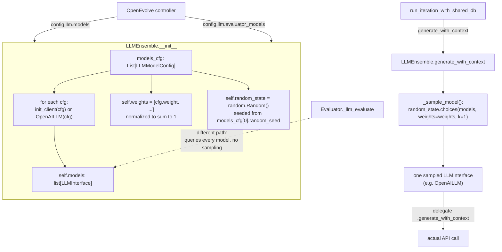

# LLM Ensemble — weighted model sampling as the mutation operator

<!-- connect:up:begin -->
> **Cross-repo concept:** part of [evolutionary-algorithm-discovery](../../../concepts/evolutionary-algorithm-discovery.md) across this wiki's repos.
<!-- connect:up:end -->
## Overview
`LLMEnsemble` is the component that turns "call an LLM" into "call *one of several* LLMs, chosen by
a weighted lottery." It is OpenEvolve's direct analogue of AlphaEvolve's practice of mixing a cheap,
fast model with a slower, more capable one so that most evolutionary proposals are cheap and only a
minority are expensive. The class itself is deliberately thin: it owns four pieces of state — the raw
list of model configs it was built from, a list of model clients, a list of normalized weights, and a
private random-number generator — and one decision procedure, `_sample_model`, that turns those into a
single chosen model per call. It does
not batch, does not fan out, and does not remember what happened last time; every `generate` or
`generate_with_context` call is an independent weighted coin flip that hands the whole prompt to
exactly one model, which then does the real work of talking to an API.

The same class is instantiated (at least) twice in the controller process — once as the
mutation-proposal ensemble
([`llm_ensemble`](../catalog/openevolve/controller.md#OpenEvolve.llm_ensemble)) and once as the
LLM-feedback ensemble
([`llm_evaluator_ensemble`](../catalog/openevolve/controller.md#OpenEvolve.llm_evaluator_ensemble)))
— but that's not the whole count: OpenEvolve's default execution path runs iterations across a pool of
worker processes, and each worker lazily builds its own fresh pair of `LLMEnsemble` instances on first
use (see Entry point 3), so the class is actually instantiated many more times over the course of a run.
Regardless of instance count, only the mutation-proposal role actually goes through the sampling path
described here; the evaluator role calls a different ensemble method that queries every model instead
(see Edge cases).

## Diagram

## Design rationale (why it's built this way)
The whole point of the class is to let a config author trade cost against quality without touching any
code: list several models under [`weight`](../catalog/openevolve/config.md#LLMModelConfig.weight), and
the ensemble does the rest. The shipped default config (`configs/default_config.yaml`) puts
`gemini-2.0-flash-lite` at weight `0.8` and `gemini-2.0-flash` at weight `0.2` for both the mutation
and evaluator ensembles — i.e. four out of five proposals come from the cheap/fast model and one in
five from the more capable one. That is exactly AlphaEvolve's Flash+Pro mixing strategy, reproduced as
a two-line YAML list rather than a bespoke dispatcher.

Keeping [`LLMEnsemble`](../catalog/openevolve/llm/ensemble.md#LLMEnsemble) backend-agnostic is a second
deliberate choice: it never constructs an `OpenAILLM` unconditionally. Each
[`LLMModelConfig`](../catalog/openevolve/config.md#LLMModelConfig.init_client) can carry an
[`init_client`](../catalog/openevolve/config.md#LLMModelConfig.init_client) factory callable, and the
ensemble defers to it when present, falling back to
[`OpenAILLM`](../catalog/openevolve/llm/openai.md#OpenAILLM) only otherwise. Every element of
[`models`](../catalog/openevolve/llm/ensemble.md#LLMEnsemble.models) is therefore only known to satisfy
the abstract [`LLMInterface`](../catalog/openevolve/llm/base.md#LLMInterface) contract
(`generate`/`generate_with_context`) — the sampling logic never needs to know whether it drew a real
OpenAI-compatible client or a test double.

Finally, the ensemble intentionally owns its **own** [`random_state`](../catalog/openevolve/llm/ensemble.md#LLMEnsemble.random_state)
(`random.Random()`) rather than calling the module-level `random` functions. That keeps model-selection
randomness local to one ensemble instance — a prerequisite for the reproducibility story elsewhere in
OpenEvolve (checkpoints, per-run seeds), since two ensembles (or two worker processes) with independent
`Random()` instances don't perturb each other's draw sequences.

## Entry points
1. [`llm_ensemble`](../catalog/openevolve/controller.md#OpenEvolve.llm_ensemble) — the controller
   constructs one `LLMEnsemble` from `config.llm.models` at startup; this is the ensemble that proposes
   code mutations.
2. [`llm_evaluator_ensemble`](../catalog/openevolve/controller.md#OpenEvolve.llm_evaluator_ensemble) —
   a second, independently-weighted `LLMEnsemble` built from `config.llm.evaluator_models`, used for
   LLM-based fitness feedback rather than mutation.
3. [`_lazy_init_worker_components`](../catalog/openevolve/process_parallel.md#_lazy_init_worker_components) —
   in the parallel-evaluation path, each worker process builds its *own* fresh
   [`LLMEnsemble`](../catalog/openevolve/llm/ensemble.md#LLMEnsemble) instances (for both mutation and
   evaluator roles) lazily, on first use in that process.
4. [`run_iteration_with_shared_db`](../catalog/openevolve/iteration.md#run_iteration_with_shared_db) —
   the per-iteration worker that calls the mutation ensemble to obtain a code diff/rewrite for the
   sampled parent program.
5. [`_llm_evaluate`](../catalog/openevolve/evaluator.md#Evaluator._llm_evaluate) — the evaluator's
   LLM-feedback path, which uses the evaluator ensemble but through a different, non-sampling call (see
   Edge cases).
6. [`generate`](../catalog/openevolve/llm/ensemble.md#LLMEnsemble.generate) and
   [`generate_with_context`](../catalog/openevolve/llm/ensemble.md#LLMEnsemble.generate_with_context) —
   the two public methods where a sampling decision is actually made, one per call.

## Mechanism (step-by-step)
1. [`LLMEnsemble`](../catalog/openevolve/llm/ensemble.md#LLMEnsemble)`.__init__` builds
   [`models`](../catalog/openevolve/llm/ensemble.md#LLMEnsemble.models): for every `LLMModelConfig` it
   calls that config's [`init_client`](../catalog/openevolve/config.md#LLMModelConfig.init_client)
   factory if one is set, otherwise wraps the config in an
   [`OpenAILLM`](../catalog/openevolve/llm/openai.md#OpenAILLM).
2. It reads each model's raw [`weight`](../catalog/openevolve/config.md#LLMModelConfig.weight), sums
   them, and divides every entry by that sum, so [`weights`](../catalog/openevolve/llm/ensemble.md#LLMEnsemble.weights)
   always ends up a normalized probability vector regardless of what units the config author used.
3. It creates a private [`random_state`](../catalog/openevolve/llm/ensemble.md#LLMEnsemble.random_state)
   (`random.Random()`), and seeds it — but only if
   [`random_seed`](../catalog/openevolve/config.md#LLMModelConfig.random_seed) is set on the **first**
   model in the list — for deterministic model selection across a run.
4. Every call to [`generate`](../catalog/openevolve/llm/ensemble.md#LLMEnsemble.generate) or
   [`generate_with_context`](../catalog/openevolve/llm/ensemble.md#LLMEnsemble.generate_with_context)
   invokes [`_sample_model`](../catalog/openevolve/llm/ensemble.md#LLMEnsemble._sample_model), which
   draws exactly one index via `random_state.choices(range(len(models)), weights=weights, k=1)` — a
   single weighted draw, independent of any previous draw.
5. The one sampled model — some concrete [`LLMInterface`](../catalog/openevolve/llm/base.md#LLMInterface)
   such as [`OpenAILLM`](../catalog/openevolve/llm/openai.md#OpenAILLM) — receives the full
   prompt/messages and performs the actual generation; `LLMEnsemble` itself never talks to any API and
   never sees the response's content beyond passing it through.

## Key data structures
- `models: list[LLMInterface]` — one client per configured model, in the same order as `models_cfg`;
  see [`models`](../catalog/openevolve/llm/ensemble.md#LLMEnsemble.models). Each element is either an
  [`OpenAILLM`](../catalog/openevolve/llm/openai.md#OpenAILLM) or whatever a custom
  [`init_client`](../catalog/openevolve/config.md#LLMModelConfig.init_client) hook returned.
- `weights: list[float]` — parallel array to `models`, normalized to sum to 1; see
  [`weights`](../catalog/openevolve/llm/ensemble.md#LLMEnsemble.weights) and the underlying per-model
  [`weight`](../catalog/openevolve/config.md#LLMModelConfig.weight) field.
- `random_state: random.Random` — the ensemble's private PRNG instance (not the global `random`
  module); see [`random_state`](../catalog/openevolve/llm/ensemble.md#LLMEnsemble.random_state) and its
  seed source [`random_seed`](../catalog/openevolve/config.md#LLMModelConfig.random_seed).
- [`LLMInterface`](../catalog/openevolve/llm/base.md#LLMInterface) — the abstract contract
  (`generate`, `generate_with_context`) every entry in `models` must satisfy; this is what lets
  [`OpenAILLM`](../catalog/openevolve/llm/openai.md#OpenAILLM) and a test double like
  [`MyCustomLLM`](../catalog/tests/test_llm_ensemble.md#TestEnsembleInit.MyCustomLLM) sit side by side
  in the same list.

## Dynamics (design intent)
The author's own docstrings state the intent plainly:
[`_sample_model`](../catalog/openevolve/llm/ensemble.md#LLMEnsemble._sample_model) is documented as
"Sample a model from the ensemble based on weights", and
[`generate`](../catalog/openevolve/llm/ensemble.md#LLMEnsemble.generate) as "Generate text using a
randomly selected model based on weights" — every call is framed as an independent weighted draw, not
a round-robin or a stateful policy.

[`test_weighted_sampling`](../catalog/tests/test_llm_ensemble.md#TestLLMEnsemble.test_weighted_sampling)
exercises exactly this contract: with weights `0.0`/`1.0` on two models, ten calls to
[`_sample_model`](../catalog/openevolve/llm/ensemble.md#LLMEnsemble._sample_model) always return the
weight-`1.0` model; with three models all at weight `0.3`, the test keeps sampling until it has seen
every model at least once (bounded at 1000 draws), confirming that roughly-equal weights make every
model reachable rather than one dominating by construction.

[`test_ensemble_initialization`](../catalog/tests/test_llm_ensemble.md#TestEnsembleInit.test_ensemble_initialization)
exercises the backend-agnostic construction path: one model uses the default
[`OpenAILLM`](../catalog/openevolve/llm/openai.md#OpenAILLM), the other supplies a custom
[`init_client`](../catalog/openevolve/config.md#LLMModelConfig.init_client) that returns a
[`MyCustomLLM`](../catalog/tests/test_llm_ensemble.md#TestEnsembleInit.MyCustomLLM); the resulting
[`models`](../catalog/openevolve/llm/ensemble.md#LLMEnsemble.models) list mixes both kinds of
[`LLMInterface`](../catalog/openevolve/llm/base.md#LLMInterface) client transparently.

## Edge cases
- **Seed scope is narrower than it looks.** The constructor only checks
  [`random_seed`](../catalog/openevolve/config.md#LLMModelConfig.random_seed) on `models_cfg[0]` — the
  *first* model in the list. Setting `random_seed` on a second or third model has no effect on which
  model gets sampled; only the first entry's seed reaches
  [`random_state`](../catalog/openevolve/llm/ensemble.md#LLMEnsemble.random_state).
- **Zero-sum weights are unguarded.** [`weights`](../catalog/openevolve/llm/ensemble.md#LLMEnsemble.weights)
  is computed as each raw `weight` divided by the sum of all weights; if every configured
  [`weight`](../catalog/openevolve/config.md#LLMModelConfig.weight) were `0.0`, that division has no
  guard in the constructor.
- **A single-model ensemble degenerates to deterministic dispatch.** With one entry in `models_cfg`,
  normalization always yields `weights == [1.0]`, so
  [`_sample_model`](../catalog/openevolve/llm/ensemble.md#LLMEnsemble._sample_model) has nothing to
  choose between — a common case for the simplest configs.
- **The evaluator ensemble doesn't go through this sampling path at all.** [`_llm_evaluate`](../catalog/openevolve/evaluator.md#Evaluator._llm_evaluate)
  awaits a different `LLMEnsemble` method (visible in its own source, outside this packet's cited
  subgraph) that iterates every configured model and collects a response from each, rather than
  delegating to [`_sample_model`](../catalog/openevolve/llm/ensemble.md#LLMEnsemble._sample_model).
  So the same `LLMEnsemble` class does two different jobs depending on caller: stochastic single-model
  dispatch for mutation proposals, exhaustive multi-model querying for LLM-based scoring.

> [!inferred]
> Reading `openevolve/database.py` directly turns up no field on a `Program` record that attributes it
> to the model that generated it, and `_sample_model` itself carries no memory of prior draws. Put
> together, this suggests the ensemble's weighting is purely static and configured up front — nothing
> in the evolutionary loop appears to reweight the ensemble based on which model's proposals turned out
> fitter (no bandit/UCB-style adaptation), unlike some more elaborate LLM-ensemble designs. This is
> inferred from the absence of such wiring rather than from a symbol proving it doesn't exist.

## Open questions
- The all-models aggregation method that [`_llm_evaluate`](../catalog/openevolve/evaluator.md#Evaluator._llm_evaluate)
  calls on the evaluator ensemble sits outside this packet's subgraph; it deserves its own treatment to
  explain how responses from multiple models get reconciled into one evaluation score.
- Why is the ensemble-selection seed tied to `models_cfg[0]`'s
  [`random_seed`](../catalog/openevolve/config.md#LLMModelConfig.random_seed) specifically, rather than
  a dedicated ensemble-level seed field — is this an intentional "first model is primary" convention or
  an artifact of how per-model seeding (also used by `OpenAILLM` for its own API `seed` parameter) was
  bolted on?
- [`test_weighted_sampling`](../catalog/tests/test_llm_ensemble.md#TestLLMEnsemble.test_weighted_sampling)
  only checks reachability within 1000 draws for a three-way equal split; it doesn't pin down how
  quickly a low-weight model becomes reachable in a short run, which matters for how often the
  "expensive" model actually gets exercised in practice.

## See also
- [OpenAILLM — the concrete API client an ensemble entry delegates to](openevolve-llm-openai.md)
- [Prompt sampler — builds the prompt each sampled model receives](openevolve-prompt-sampler.md)
- [Controller — constructs both ensembles and wires them into the evolutionary loop](openevolve-controller.md)
- [Evolutionary algorithm discovery (cross-repo concept)](../../../concepts/evolutionary-algorithm-discovery.md)
- [AlphaEvolve (source paper this repo reimplements)](../../../sources/alphaevolve.md)
