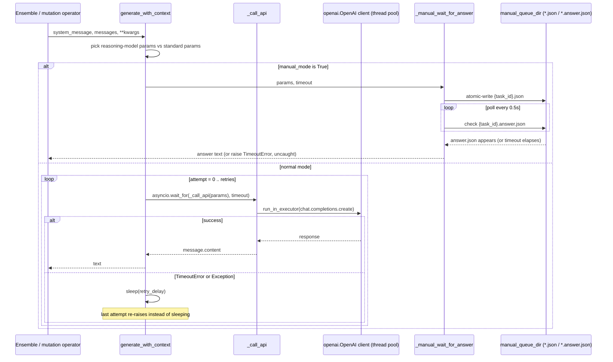

# The OpenAI-compatible LLM client — single-model request/retry substrate

## Overview
`OpenAILLM` is the lowest layer every mutation-operator LLM call rides on: one instance wraps
one configured model (a name, a `base_url`, an API key, sampling params) and exposes the two
methods (`generate`, `generate_with_context`) that `LLMInterface` requires. Everything above it
— the ensemble that, for the mutation operator, picks one of several weighted models per prompt
(it can also fan a prompt out to every configured model for evaluation feedback), and above that
the prompt sampler that turns a parent program + inspirations into a diff request — never talks
to an SDK directly; it calls `generate_with_context` and gets back a string or an exception. This page is
about what happens inside that one call: building an OpenAI-shaped request that works across
wildly different backends (OpenAI itself, Azure, OpenRouter, a local `gpt-oss` server, Google's
OpenAI-compatible endpoint), running it with retries and a timeout, and — a genuinely distinct
second mode — running it with *no SDK at all* by handing the request to a human via a file-based
queue instead of an HTTP call.

The class is intentionally "dumb": no exponential backoff math, no circuit breaker, no
capability-negotiation API. It leans on string-prefix matching, a fixed retry delay, and a
polling loop, because those are usually just as effective as the more elaborate versions when
the caller (the evolutionary loop) already tolerates individual iteration failures.

## Diagram

## Design rationale (why it's built this way)
- **One request-builder, two very different backend shapes.** OpenAI's own "reasoning" model
  families (o1/o3/o4, gpt-5, gpt-oss) reject `temperature`/`top_p` and rename the token budget to
  `max_completion_tokens`. Rather than a config flag per model, [`generate_with_context`](../catalog/openevolve/llm/openai.md#OpenAILLM.generate_with_context)
  pattern-matches the model *name string* against a hardcoded prefix tuple — a cheap heuristic
  standing in for a capability-discovery API, chosen specifically because it "works for all
  endpoints (OpenAI, Azure, OptiLLM, OpenRouter, etc.)" without per-provider branching.
- **Async coroutine over a synchronous SDK, so a blocking call can still be timed out.** The
  `openai` Python client is blocking, and `generate_with_context` wraps each attempt in
  `asyncio.wait_for(..., timeout)` — which can only preempt a coroutine that actually yields to
  the event loop. [`_call_api`](../catalog/openevolve/llm/openai.md#OpenAILLM._call_api) resolves that with
  `loop.run_in_executor(None, ...)` — punting the blocking HTTP call to the default thread pool so
  the `wait_for` timeout has something to enforce — rather than depending on an async OpenAI
  client variant. (Iteration-level parallelism itself comes from a pool of worker *processes*,
  each running one iteration's call to completion via a plain `asyncio.run(...)`, not from many
  LLM calls awaited concurrently inside one event loop.)
- **Manual mode reuses almost the exact same request-building path.** [`_manual_wait_for_answer`](../catalog/openevolve/llm/openai.md#OpenAILLM._manual_wait_for_answer)
  is handed nearly the *same* `params` dict that would otherwise go to `chat.completions.create` —
  it just serializes it to a task file instead; the one deliberate divergence is `seed`, which
  `generate_with_context` never adds when `manual_mode` is set ("Seed only makes sense for actual
  API calls"). That means a human can be slotted in as an "LLM" for
  debugging or curated runs without the ensemble, prompt sampler, or controller knowing the
  difference; only [`client`](../catalog/openevolve/llm/openai.md#OpenAILLM.client) and [`manual_mode`](../catalog/openevolve/llm/openai.md#OpenAILLM.manual_mode)
  change at construction time.
- **Retry is deliberately simple.** A flat `retry_delay` sleep between attempts (not exponential
  backoff), and the same `retries` count is reused as `openai.OpenAI(max_retries=...)` for the
  SDK's own internal retry policy — see Edge cases for why that double-counts.

## Entry points
1. [`generate`](../catalog/openevolve/llm/openai.md#OpenAILLM.generate) — single-prompt convenience wrapper; wraps the prompt as one user
   message and the instance's configured `system_message`, then delegates to `generate_with_context`.
2. [`generate_with_context`](../catalog/openevolve/llm/openai.md#OpenAILLM.generate_with_context) — the real entry point; satisfies the abstract
   [`generate_with_context`](../catalog/openevolve/llm/base.md#LLMInterface.generate_with_context) contract from `LLMInterface`, and is what
   [`generate_all_with_context`](../catalog/openevolve/llm/ensemble.md#LLMEnsemble.generate_all_with_context) calls once per model when the
   ensemble fans a single prompt out to every configured model.
3. Test entry point: [`test_reasoning_effort_passed_to_api_params`](../catalog/tests/test_reasoning_effort_config.md#TestReasoningEffortConfig.test_reasoning_effort_passed_to_api_params)
   exercises [`_call_api`](../catalog/openevolve/llm/openai.md#OpenAILLM._call_api) and [`client`](../catalog/openevolve/llm/openai.md#OpenAILLM.client) directly with a mocked
   SDK client, bypassing `generate_with_context`'s retry loop.

## Mechanism (step-by-step)
1. Construction reads a `model_cfg` object field-by-field into plain instance attributes —
   [`model`](../catalog/openevolve/llm/openai.md#OpenAILLM.model), [`temperature`](../catalog/openevolve/llm/openai.md#OpenAILLM.temperature),
   [`top_p`](../catalog/openevolve/llm/openai.md#OpenAILLM.top_p), [`max_tokens`](../catalog/openevolve/llm/openai.md#OpenAILLM.max_tokens),
   [`timeout`](../catalog/openevolve/llm/openai.md#OpenAILLM.timeout), [`retries`](../catalog/openevolve/llm/openai.md#OpenAILLM.retries),
   [`retry_delay`](../catalog/openevolve/llm/openai.md#OpenAILLM.retry_delay), [`api_base`](../catalog/openevolve/llm/openai.md#OpenAILLM.api_base),
   [`api_key`](../catalog/openevolve/llm/openai.md#OpenAILLM.api_key), [`random_seed`](../catalog/openevolve/llm/openai.md#OpenAILLM.random_seed),
   [`reasoning_effort`](../catalog/openevolve/llm/openai.md#OpenAILLM.reasoning_effort) — plus [`manual_mode`](../catalog/openevolve/llm/openai.md#OpenAILLM.manual_mode).
   If manual mode is off it builds a synchronous `openai.OpenAI` client and stores it as
   [`client`](../catalog/openevolve/llm/openai.md#OpenAILLM.client); if on, `client` stays `None` and a
   [`manual_queue_dir`](../catalog/openevolve/llm/openai.md#OpenAILLM.manual_queue_dir) is created on disk instead.
2. [`generate_with_context`](../catalog/openevolve/llm/openai.md#OpenAILLM.generate_with_context) formats the system message plus conversational
   `messages`, then checks whether `self.model`'s name starts with a known reasoning-model prefix
   to decide between a `max_completion_tokens`/`reasoning_effort` request shape and a
   `temperature`/`top_p`/`max_tokens` request shape; it also folds in a `seed` for reproducibility,
   but only for non-manual-mode calls, and even then not when the configured `api_base` is
   Google's AI Studio endpoint (which rejects it).
3. If [`manual_mode`](../catalog/openevolve/llm/openai.md#OpenAILLM.manual_mode) is set, `generate_with_context` hands the assembled
   `params` straight to [`_manual_wait_for_answer`](../catalog/openevolve/llm/openai.md#OpenAILLM._manual_wait_for_answer) and returns
   whatever it produces — **the retry loop below is never entered on this path**.
4. Otherwise it loops for `retries + 1` attempts, each time awaiting
   [`_call_api`](../catalog/openevolve/llm/openai.md#OpenAILLM._call_api) under `asyncio.wait_for(timeout)`; a caught
   `asyncio.TimeoutError` or any other `Exception` logs a warning via [`logger`](../catalog/openevolve/llm/openai.md#logger)
   and sleeps `retry_delay` seconds before the next attempt, except on the last attempt, which
   logs an error and re-raises instead.
5. [`_call_api`](../catalog/openevolve/llm/openai.md#OpenAILLM._call_api) runs `self.`[`client`](../catalog/openevolve/llm/openai.md#OpenAILLM.client)`.chat.completions.create(**params)`
   — a blocking SDK call — inside `loop.run_in_executor`, then extracts `response.choices[0].message.content`
   and logs both the request params and the raw response text via [`logger`](../catalog/openevolve/llm/openai.md#logger) at debug level.
6. [`_manual_wait_for_answer`](../catalog/openevolve/llm/openai.md#OpenAILLM._manual_wait_for_answer) builds a task record (id, timestamp via
   [`_iso_now`](../catalog/openevolve/llm/openai.md#_iso_now), a human-readable rendering via [`_build_display_prompt`](../catalog/openevolve/llm/openai.md#_build_display_prompt)),
   writes it atomically with [`_atomic_write_json`](../catalog/openevolve/llm/openai.md#_atomic_write_json) into
   [`manual_queue_dir`](../catalog/openevolve/llm/openai.md#OpenAILLM.manual_queue_dir), then polls every 0.5s for a matching
   `*.answer.json`, returning its `answer` field once present or raising `asyncio.TimeoutError`
   if a caller-supplied timeout elapses first (an unset timeout waits indefinitely).

## Key data structures
- **`params: Dict[str, Any]`** — the single OpenAI-wire-format request dict built once per call in
  [`generate_with_context`](../catalog/openevolve/llm/openai.md#OpenAILLM.generate_with_context). It does double duty: in normal mode it is
  passed verbatim to `chat.completions.create(**params)`; in manual mode nearly the *same dict*
  (minus `seed`, which the builder never adds when `manual_mode` is set) is what gets serialized
  into the task JSON file, so the two modes share almost all of "what does this request contain"
  and diverge mainly on "how is it answered."
- **The task/answer file pair** (`{task_id}.json`, `{task_id}.answer.json}`) in
  [`manual_queue_dir`](../catalog/openevolve/llm/openai.md#OpenAILLM.manual_queue_dir) — a minimal filesystem-as-queue protocol: a UUID names
  both halves, [`_atomic_write_json`](../catalog/openevolve/llm/openai.md#_atomic_write_json) writes via temp-file-then-`rename` so a
  concurrently polling reader (whatever produces the answer file — a human UI, out of this
  packet's scope) never observes a half-written task.
- **The flat instance-attribute config bag** — `model`, `temperature`, `top_p`, `max_tokens`,
  `timeout`, `retries`, `retry_delay`, `api_base`, `api_key`, `random_seed`, `reasoning_effort`,
  `manual_mode` — every one of these can also be overridden per-call via `**kwargs` in
  `generate_with_context` (e.g. `kwargs.get("temperature", self.temperature)`), so the instance
  attributes are really just the defaults for one configured model.

## Dynamics (design intent)
The author's own docstrings frame the two code paths plainly: `generate_with_context` is meant to
"Generate text using a system message and conversational context," while `_manual_wait_for_answer`
exists to let a human stand in — its docstring is explicit: "Manual mode: write a task JSON file
and poll for `*.answer.json`. If timeout is provided, we respect it; otherwise we wait
indefinitely." The module docstring frames this as a deliberate feature, not a debugging hack:
"a 'manual mode' (human-in-the-loop) where prompts are written to a task queue directory and the
system waits for a corresponding `*.answer.json` file."

[`test_reasoning_effort_passed_to_api_params`](../catalog/tests/test_reasoning_effort_config.md#TestReasoningEffortConfig.test_reasoning_effort_passed_to_api_params)
mocks the `openai.OpenAI` client and asserts `chat.completions.create` is invoked with a
`reasoning_effort`-bearing params dict for a `gpt-oss-120b` model — confirming intent that
reasoning-parameter handling is meant to extend past OpenAI's own o-series to open-source
reasoning models served through the same OpenAI-compatible surface.

> [!inferred] The reasoning-model prefix list (o1/o3/o4, gpt-5, gpt-oss) reads as an
> allowlist the authors update as new reasoning-style models ship; nothing in this packet shows
> an automated or config-driven way to extend it besides editing the source tuple.

## Edge cases
- **Retry is effectively two-layered for the same config value.** The constructor passes
  `self.`[`retries`](../catalog/openevolve/llm/openai.md#OpenAILLM.retries) into `openai.OpenAI(max_retries=...)`, giving the SDK
  its own internal retry policy for transient HTTP errors — completely separate from, and
  invisible to, the outer `for attempt in range(retries + 1)` loop in `generate_with_context`
  that retries on `asyncio.TimeoutError`/`Exception` with a flat `retry_delay` sleep. The same
  number configures both layers, so a single logical "generate" call can issue up to
  `(retries + 1) × (SDK's internal retries + 1)` HTTP attempts in the worst case, with two
  different (and non-obvious) retry/backoff strategies stacked on top of each other.
- **Manual mode has no retry at all.** Because `generate_with_context` returns from
  [`_manual_wait_for_answer`](../catalog/openevolve/llm/openai.md#OpenAILLM._manual_wait_for_answer) before reaching the retry loop, a manual-mode
  timeout propagates as an uncaught `asyncio.TimeoutError` straight to the caller — asymmetric
  with the API path, where the same exception type is caught and retried.
- **`_call_api`'s `client is None` guard is defense-in-depth, not a reachable path** under normal
  control flow: [`client`](../catalog/openevolve/llm/openai.md#OpenAILLM.client) is only `None` when
  [`manual_mode`](../catalog/openevolve/llm/openai.md#OpenAILLM.manual_mode) is `True`, and `generate_with_context` never calls
  [`_call_api`](../catalog/openevolve/llm/openai.md#OpenAILLM._call_api) on that path — the check only fires if the two flags
  somehow disagree.
- **Endpoint detection by literal string equality.** The Google AI Studio seed-skip checks
  `self.api_base == "https://generativelanguage.googleapis.com/v1beta/openai/"` exactly; any
  trailing-slash or version variant of that URL would silently re-enable the unsupported `seed`
  parameter.
- **Logger-as-global-state.** The one-time "Initialized OpenAI LLM with model: ..." log line is
  deduplicated by stashing an `_initialized_models` set as a dynamic attribute on the shared
  module-level [`logger`](../catalog/openevolve/llm/openai.md#logger) object — global, process-wide state living on a
  logging object rather than a class-level structure.

## Open questions
- Nothing in this packet shows what produces the `*.answer.json` file — presumably an external
  UI or script that reads the task JSON and writes an answer — so the human side of manual mode
  is out of scope here.
- Whether the outer retry loop's `timeout` budget is meant to bound the SDK's own internal
  retries, or whether the two are expected to compose additively as described in Edge cases,
  isn't stated anywhere in the docstrings or tests seen.
- No symbol in this subgraph shows whether stale task/answer files in `manual_queue_dir` are ever
  cleaned up.

## See also
- [The LLM ensemble](openevolve-llm-ensemble.md) — the layer above this one: which models get
  called, with what weights, and how per-model responses are combined; this page is the single-model
  substrate it calls once per configured model.
- [AlphaEvolve](../../../sources/alphaevolve.md) — the source paper this repo reimplements; the
  mutation operator described there is, at this layer, just a caller of `generate_with_context`.
