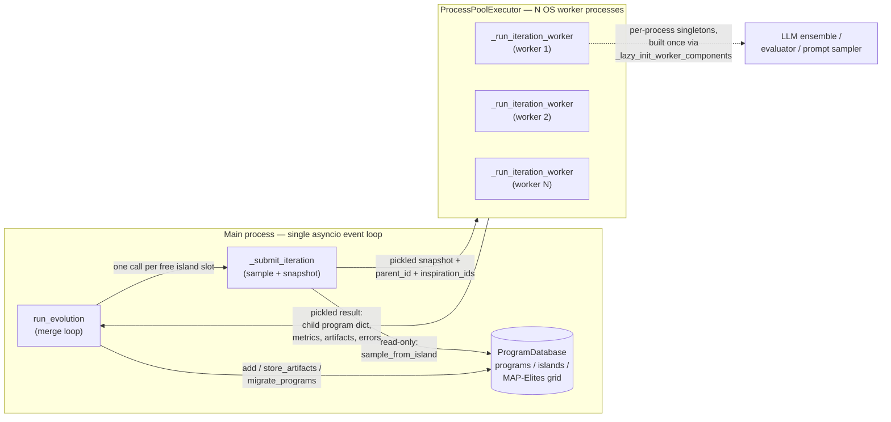

# Process-based parallel evolution (ProcessParallelController)

<!-- connect:up:begin -->
> **Cross-repo concept:** part of [evolutionary-algorithm-discovery](../../../concepts/evolutionary-algorithm-discovery.md) across this wiki's repos.
<!-- connect:up:end -->
## Overview

openevolve runs many evolutionary iterations at once, but it does **not** give worker processes a
handle onto a shared, mutable program database. There is no lock, no shared-memory segment, no
manager process holding the population. Instead the design is "snapshot out, merge back, single
writer": every iteration, the main process takes an immutable, picklable copy of whatever the
population currently looks like, ships it to a worker that runs entirely blind to the live
database, and only the main process's own event loop is ever allowed to mutate the real
[`database`](../catalog/openevolve/process_parallel.md#ProcessParallelController.database) — a
[`ProgramDatabase`](../catalog/openevolve/database.md#ProgramDatabase.config)-typed island/MAP-Elites
population. [`_run_iteration_worker`](../catalog/openevolve/process_parallel.md#_run_iteration_worker)
does the expensive, parallelizable work — "Run a single iteration in a worker process" — and returns
a small pickled result; [`run_evolution`](../catalog/openevolve/process_parallel.md#ProcessParallelController.run_evolution)
("Run evolution with process-based parallelism") is the single place that reconciles those results
into the canonical database. This is the piece of openevolve that turns the AlphaEvolve-style
evolutionary loop — LLM proposes a diff, an evaluator scores it, a population database decides who
survives — from a strictly sequential recipe into something that keeps N CPU cores (and N concurrent
LLM calls) busy at once, without needing any cross-process locking primitive at all.

## Diagram

No arrow ever goes from a worker process back into `DB` directly — workers hand results to
`run_evolution`, and only `run_evolution` (running on the main process) is allowed to call
[`add`](../catalog/openevolve/database.md#ProgramDatabase.add).

## Design rationale (why it's built this way)

Two constraints shape everything here. First, Python's GIL means thread-based concurrency wouldn't
actually parallelize the expensive parts of an iteration — running the LLM call's client code and,
especially, executing and scoring the candidate program via
[`evaluate_program`](../catalog/openevolve/evaluator.md#Evaluator.evaluate_program) (which itself may
shell out to run untrusted, CPU-bound user code). Real OS processes are needed. Second, once you have
separate processes, sharing one mutable `ProgramDatabase` object across them would require either a
multiprocessing manager (which serializes every access behind IPC and a lock) or genuine shared memory
with hand-rolled synchronization — both of which reintroduce the very serialization the parallelism
was supposed to remove, and both are easy to get subtly wrong for a structure as stateful as an
island-partitioned MAP-Elites archive.

openevolve sidesteps this by making the *read* and *write* sides asymmetric: sampling a parent and
building a database snapshot happens in the main process before a worker ever starts (`sample_from_island`
is documented as "thread-safe and doesn't modify shared state, avoiding race conditions when multiple
workers sample from different islands concurrently" — a fix for a documented race, GitHub issue #246,
where sampling used to mutate `current_island`). The worker then operates purely on that frozen copy —
it has no way to touch the real database even if it wanted to, because it was never given a reference
to it. All the state that *does* change (adding the child, storing its artifacts, bumping island
generation counters, triggering migration) happens serially inside `run_evolution`'s own loop, which is
single-threaded. There is exactly one writer, so there is nothing to lock.

## Entry points

1. [`start`](../catalog/openevolve/process_parallel.md#ProcessParallelController.start) — "Start the
   process pool." Builds a picklable config dict via
   [`_serialize_config`](../catalog/openevolve/process_parallel.md#ProcessParallelController._serialize_config)
   and creates the `ProcessPoolExecutor`, with a per-process initializer that reconstructs a
   [`Config`](../catalog/openevolve/config.md#Config) object inside each new worker.
2. [`run_evolution`](../catalog/openevolve/process_parallel.md#ProcessParallelController.run_evolution) —
   the outer async driver, invoked from
   [`_run_evolution_with_checkpoints`](../catalog/openevolve/controller.md#OpenEvolve._run_evolution_with_checkpoints)
   in the controller. Owns the submit/collect/merge loop described below.
3. [`_submit_iteration`](../catalog/openevolve/process_parallel.md#ProcessParallelController._submit_iteration) —
   "Submit an iteration to the process pool, optionally pinned to a specific island." The one place
   that samples from the live database and hands work to the pool.
4. [`_run_iteration_worker`](../catalog/openevolve/process_parallel.md#_run_iteration_worker) — the
   function that actually executes *inside* the worker process; everything it touches is local state
   or the snapshot it was handed.

## Mechanism (step-by-step)

1. **Config crosses the process boundary as a plain dict, not a live object.**
   [`_serialize_config`](../catalog/openevolve/process_parallel.md#ProcessParallelController._serialize_config)
   ("Serialize config object to a dictionary that can be pickled") walks
   [`Config`](../catalog/openevolve/config.md#Config) and its nested [`llm`](../catalog/openevolve/config.md#Config.llm),
   [`prompt`](../catalog/openevolve/config.md#Config.prompt), [`database`](../catalog/openevolve/config.md#Config.database),
   and [`evaluator`](../catalog/openevolve/config.md#Config.evaluator) sub-configs by hand, `asdict()`-ing
   each piece separately rather than the whole `Config` at once. The comment in the source explains why:
   a plain `asdict(config)` would recurse into a live LLM client object embedded in the database config
   and try (and fail) to pickle it, so that field is nulled out first. Each worker process reconstructs
   its own [`Config`](../catalog/openevolve/config.md#Config) from this dict on startup — every worker
   ends up with an equal, independent copy, never a reference to the controller's original.
2. **Each worker builds its own LLM ensemble, prompt sampler, and evaluator exactly once, lazily.**
   [`_lazy_init_worker_components`](../catalog/openevolve/process_parallel.md#_lazy_init_worker_components)
   ("Lazily initialize expensive components on first use") is called at the top of every iteration but
   only actually constructs anything the first time a given worker process runs it; a worker's evaluator
   is built with `database=None` — the worker's evaluator has no database reference of its own either.
3. **The controller — never the worker — decides who reproduces.**
   [`_submit_iteration`](../catalog/openevolve/process_parallel.md#ProcessParallelController._submit_iteration)
   calls [`sample_from_island`](../catalog/openevolve/database.md#ProgramDatabase.sample_from_island)
   ("Sample a program and inspirations from a specific island without modifying current_island") to pick a
   parent plus inspiration programs from one target island, then assembles a fresh, fully self-contained
   snapshot of the database (every [`Program`](../catalog/openevolve/database.md#Program) as a plain
   dict, [`islands`](../catalog/openevolve/database.md#ProgramDatabase.islands) as lists, the current
   [`feature_dimensions`](../catalog/openevolve/config.md#DatabaseConfig.feature_dimensions)) before
   submitting to the pool — the snapshot is rebuilt from scratch on every single submission, so a worker
   always sees the population as of the moment it was dispatched, not a live view.
4. **The worker rebuilds its own tiny in-memory copy of the population, only to score one child.**
   [`_run_iteration_worker`](../catalog/openevolve/process_parallel.md#_run_iteration_worker)
   reconstructs [`Program`](../catalog/openevolve/database.md#Program) objects from the snapshot's dicts,
   finds its assigned parent by [`id`](../catalog/openevolve/database.md#Program.id), and gathers the
   other programs on that same island (again purely from the snapshot) to rank by
   [`metrics`](../catalog/openevolve/database.md#Program.metrics) and feed into
   [`build_prompt`](../catalog/openevolve/prompt/sampler.md#PromptSampler.build_prompt). This
   reconstruction happens fresh every iteration and is thrown away when the worker returns.
5. **The LLM proposes a diff against that parent's [`code`](../catalog/openevolve/database.md#Program.code),
   the worker applies it locally, and evaluates the result with its own evaluator.**
   [`evaluate_program`](../catalog/openevolve/evaluator.md#Evaluator.evaluate_program) — which may run
   [`_cascade_evaluate`](../catalog/openevolve/evaluator.md#Evaluator._cascade_evaluate) or
   [`_llm_evaluate`](../catalog/openevolve/evaluator.md#Evaluator._llm_evaluate) — is invoked with a
   synchronous `asyncio.run(...)` wrapper (the worker has no outer event loop of its own to await into).
   On success, a new [`Program`](../catalog/openevolve/database.md#Program) is built locally with a
   fresh child id, [`generation`](../catalog/openevolve/database.md#Program.generation) bumped from the
   parent's, and its [`metrics`](../catalog/openevolve/database.md#Program.metrics) and
   [`metadata`](../catalog/openevolve/database.md#Program.metadata) (including which island it belongs
   to) set — but this `Program` only ever exists inside the worker's memory; it is serialized straight
   back into the result payload, never inserted into any database from within the worker.
6. **Only [`run_evolution`](../catalog/openevolve/process_parallel.md#ProcessParallelController.run_evolution)
   is allowed to write.** As each pending future completes, `run_evolution` reconstructs the child
   [`Program`](../catalog/openevolve/database.md#Program) from the result and calls
   [`add`](../catalog/openevolve/database.md#ProgramDatabase.add) ("Add a program to the database") —
   which in turn recomputes MAP-Elites bucket placement via
   [`_calculate_feature_coords`](../catalog/openevolve/database.md#ProgramDatabase._calculate_feature_coords)
   and may evict the population's worst member via
   [`_enforce_population_limit`](../catalog/openevolve/database.md#ProgramDatabase._enforce_population_limit) —
   then calls [`store_artifacts`](../catalog/openevolve/database.md#ProgramDatabase.store_artifacts) and,
   periodically, [`migrate_programs`](../catalog/openevolve/database.md#ProgramDatabase.migrate_programs)
   ("Perform migration between islands"). Every one of these calls happens inside the same single
   `run_evolution` loop iteration — there is no concurrent writer to race against.
7. **Island balance is maintained by resubmitting, not by pre-scheduling a fixed grid.**
   `run_evolution` tracks how many iterations are in flight per island and, each time one completes,
   submits exactly one replacement for whichever island is under its share via
   [`_submit_iteration`](../catalog/openevolve/process_parallel.md#ProcessParallelController._submit_iteration) —
   keeping all islands fed roughly evenly across the whole run rather than assuming a static schedule.
   A dedicated test, [`test_island_distribution_in_batch`](../catalog/tests/test_island_isolation.md#TestIslandIsolation.test_island_distribution_in_batch),
   asserts the initial batch is spread round-robin across islands this way.

## Key data structures

- [`Program`](../catalog/openevolve/database.md#Program) — the unit that crosses the process boundary
  in both directions. Because it is a plain `@dataclass` of primitives ([`id`](../catalog/openevolve/database.md#Program.id),
  [`code`](../catalog/openevolve/database.md#Program.code), [`language`](../catalog/openevolve/database.md#Program.language),
  [`parent_id`](../catalog/openevolve/database.md#Program.parent_id),
  [`generation`](../catalog/openevolve/database.md#Program.generation),
  [`metrics`](../catalog/openevolve/database.md#Program.metrics),
  [`metadata`](../catalog/openevolve/database.md#Program.metadata)), it round-trips through `pickle`
  (via `to_dict`/reconstruction) without any custom serialization logic beyond dataclass field access.
- [`ProgramDatabase`](../catalog/openevolve/database.md#ProgramDatabase.config) — exists in exactly one
  place, the main process. Its [`programs`](../catalog/openevolve/database.md#ProgramDatabase.programs)
  dict, [`islands`](../catalog/openevolve/database.md#ProgramDatabase.islands) (per-island id sets),
  [`island_feature_maps`](../catalog/openevolve/database.md#ProgramDatabase.island_feature_maps),
  [`island_generations`](../catalog/openevolve/database.md#ProgramDatabase.island_generations),
  [`island_best_programs`](../catalog/openevolve/database.md#ProgramDatabase.island_best_programs), and
  [`best_program_id`](../catalog/openevolve/database.md#ProgramDatabase.best_program_id) are the MAP-Elites
  + island-model state the whole loop exists to evolve; none of it is ever copied into a worker in live
  form, only flattened into the snapshot dict.
- The config split — [`Config`](../catalog/openevolve/config.md#Config) →
  [`DatabaseConfig`](../catalog/openevolve/config.md#DatabaseConfig) (with
  [`num_islands`](../catalog/openevolve/config.md#DatabaseConfig.num_islands) and
  [`feature_dimensions`](../catalog/openevolve/config.md#DatabaseConfig.feature_dimensions)) and
  [`LLMModelConfig`](../catalog/openevolve/config.md#LLMModelConfig) (with
  [`api_key`](../catalog/openevolve/config.md#LLMModelConfig.api_key)) and `LLMConfig` (with
  [`models`](../catalog/openevolve/config.md#LLMConfig.models)) — is what
  [`_serialize_config`](../catalog/openevolve/process_parallel.md#ProcessParallelController._serialize_config)
  has to flatten by hand for pickling.

## Dynamics (design intent)

The population is durable and centralized even though the compute around it is ephemeral and scattered:
every worker process is stateless from one iteration to the next as far as the *population* is
concerned — it only ever knows one parent, its inspirations, and the snapshot it was handed — while the
[`ProgramDatabase`](../catalog/openevolve/database.md#ProgramDatabase.config) in the main process is the
one piece of long-lived state that accumulates the whole run's history:
[`generation`](../catalog/openevolve/database.md#Program.generation) counts climb, island populations
grow and get trimmed by [`_enforce_population_limit`](../catalog/openevolve/database.md#ProgramDatabase._enforce_population_limit),
and [`migrate_programs`](../catalog/openevolve/database.md#ProgramDatabase.migrate_programs) periodically
moves elites between islands. This is the same island/MAP-Elites machinery a single-process run would use
— parallelism here is purely a way to keep several LLM-and-evaluation round-trips in flight at once, not
a different evolutionary algorithm. [`_warned_about_combined_score`](../catalog/openevolve/process_parallel.md#ProcessParallelController._warned_about_combined_score)
is a small piece of the same "protect the single writer's bookkeeping" philosophy: it is set lazily
(`if not hasattr(self, "_warned_about_combined_score")`) rather than in `__init__`, and flips to `True`
the first time a completed child lacks a `combined_score` metric — so the user is nudged once, in the
main process's log, that evolution is falling back to an average of whatever numeric metrics the
evaluator did return, rather than being warned on every single iteration for the rest of the run.

## Edge cases

- **A failed generation or evaluation inside a worker never crashes the run.**
  [`_run_iteration_worker`](../catalog/openevolve/process_parallel.md#_run_iteration_worker) catches
  exceptions and returns an error string plus the iteration number instead of raising; back in
  [`run_evolution`](../catalog/openevolve/process_parallel.md#ProcessParallelController.run_evolution),
  an error result is just logged as a warning and the loop moves on to submit another iteration for that
  island's slot.
- **Slow iterations are bounded by the evaluator's own [`timeout`](../catalog/openevolve/config.md#EvaluatorConfig.timeout)
  plus a fixed buffer**, not by a separate parallel-controller setting — waiting on a future beyond that
  combined budget logs and cancels it rather than blocking the whole merge loop indefinitely.
- **Child island placement is decided by the controller, not inherited from the parent's live metadata**:
  the completed result carries back which island it was sampled *for*, and
  [`add`](../catalog/openevolve/database.md#ProgramDatabase.add) is called with that island pinned
  explicitly — because [`sample_from_island`](../catalog/openevolve/database.md#ProgramDatabase.sample_from_island)
  falls back to sampling from the whole population whenever the requested island happens to be empty, so
  the parent it hands back can itself already belong to a different island than the one the worker was
  dispatched for; trusting the parent's own island metadata at merge time in that case could silently
  misfile the child (the source ties this fix directly to GitHub issue #391).

> [!inferred] Cancelling a future whose worker has already started running (past the timeout) does not
> necessarily terminate the underlying OS process — `concurrent.futures` cancellation only reliably stops
> futures that have not yet begun executing. A worker stuck inside a very slow evaluator call may keep
> running in the background even after its future is cancelled and its slot is resubmitted elsewhere,
> which is a plausible source of unaccounted-for CPU/LLM usage on a timeout-heavy run. This is not
> something the source in this packet's subgraph confirms or denies either way.

## Open questions

- How large can a single database snapshot get in practice (the packet doesn't include the code path
  that caps the artifacts folded into each snapshot), and at what population size does re-pickling the
  full [`programs`](../catalog/openevolve/database.md#ProgramDatabase.programs) dict on every
  [`_submit_iteration`](../catalog/openevolve/process_parallel.md#ProcessParallelController._submit_iteration)
  call start to dominate iteration latency rather than the LLM call itself?
- Two nearly-identical `test_process_parallel*.py` files exist in the test tree, including
  [`run_test`](../catalog/tests/test_process_parallel.md#TestProcessParallel.run_test), which drives
  [`run_evolution`](../catalog/openevolve/process_parallel.md#ProcessParallelController.run_evolution)
  end-to-end — worth checking whether both are still exercised in CI or one is a superseded fix-verification
  script left in place.
- What actually happens on the OS-process level when a worker is mid-evaluation and the pool is torn down
  during a graceful shutdown request — whether in-flight child processes are given a chance to exit or are
  left running until the interpreter itself tears them down.

## See also

- [openevolve-controller.md](openevolve-controller.md) — the single-process `OpenEvolve` orchestrator
  that owns the checkpoint loop and hands control to this parallel controller.
- [openevolve-database.md](openevolve-database.md) — the island/MAP-Elites `ProgramDatabase` this
  controller is the sole in-process writer of.
- [../../../sources/alphaevolve.md](../../../sources/alphaevolve.md) — the DeepMind paper whose
  evolutionary loop (LLM mutation operator + programmatic evaluator + population database) this module
  is a parallelized, open-source implementation of.
- [../../../concepts/evolutionary-algorithm-discovery.md](../../../concepts/evolutionary-algorithm-discovery.md) —
  the cross-repo concept this page instantiates: candidate = code, mutation = LLM diff, selection =
  programmatic evaluation + population database, here executed concurrently across OS processes.
