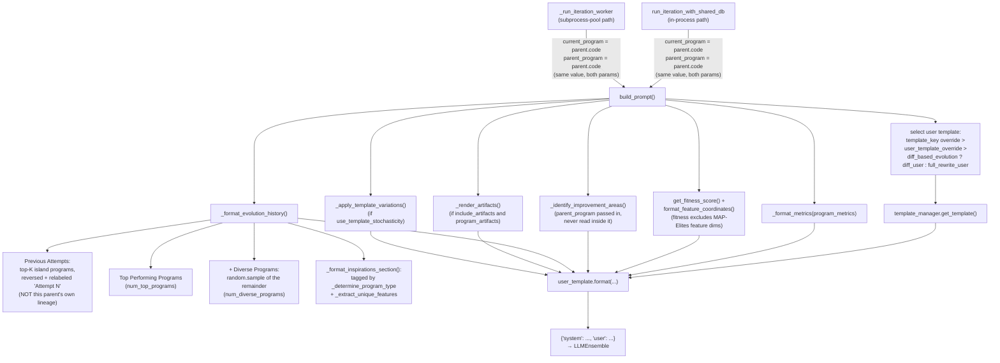

# Prompt sampler — assembling what the LLM mutation operator sees

<!-- connect:up:begin -->
> **Cross-repo concept:** part of [evolutionary-algorithm-discovery](../../../concepts/evolutionary-algorithm-discovery.md) across this wiki's repos.
<!-- connect:up:end -->
## Overview
[`build_prompt`](../catalog/openevolve/prompt/sampler.md#PromptSampler.build_prompt) is the single choke
point where every piece of evolutionary state — the parent's code, its metrics, the island's current
population, a handful of "diverse" alternates, a separate set of inspiration programs, and the last
evaluator run's stdout/stderr — gets serialized into two plain strings, `{"system": ..., "user": ...}`,
and handed to the LLM. In the lens of this repo's AlphaEvolve recipe (LLM-as-mutation-operator +
programmatic evaluator + MAP-Elites/island program database), this class is the *only* translation layer
between the database's selection machinery and the model's actual input. The LLM itself is a stateless,
out-of-process oracle invoked fresh on every iteration — it carries no memory of previous calls — so
everything it "knows" about the trajectory of the search has to be re-derived from `Program` records and
re-typeset into natural language by this code, every single time.

The author's own docstring on `build_prompt` is worth quoting because it already encodes a distinction
that matters for the rest of this page: `top_programs` are documented as "top-performing programs (best by
fitness)" while `inspirations` are "diverse/creative examples" — two different selection criteria feeding
two differently-labeled sections of the same prompt, not one list split arbitrarily in half.

`build_prompt` has three real callers in this subgraph:
[`run_iteration_with_shared_db`](../catalog/openevolve/iteration.md#run_iteration_with_shared_db) (the
in-process controller path) and [`_run_iteration_worker`](../catalog/openevolve/process_parallel.md#_run_iteration_worker)
(the `ProcessPoolExecutor` subprocess path) both call it to build the *mutation* prompt for the next child.
[`_llm_evaluate`](../catalog/openevolve/evaluator.md#Evaluator._llm_evaluate) is a fourth, unrelated caller
that reuses the same method with `template_key="evaluation"` to have an LLM *judge* code quality — a
lookalike use of the same machinery, not part of the evolutionary loop this page is about.

## Diagram

## Design rationale (why it's built this way)
- **One serialization point for a stateless caller.** Because the LLM has no memory across calls, every
  helper method on `PromptSampler` exists to re-derive, in text, some piece of state the database already
  holds structurally. `_format_metrics`, `_identify_improvement_areas`, and
  [`_format_evolution_history`](../catalog/openevolve/prompt/sampler.md#PromptSampler._format_evolution_history)
  are all doing the same kind of work: turning `Program` records into narrative English the model can
  condition on.
- **The MAP-Elites objective is narrated, not just computed.** `build_prompt` calls
  [`get_fitness_score`](../catalog/openevolve/utils/metrics_utils.md#get_fitness_score) and
  [`format_feature_coordinates`](../catalog/openevolve/utils/metrics_utils.md#format_feature_coordinates)
  to deliberately strip MAP-Elites feature dimensions out of the scalar fitness number, then puts the
  feature-dimension *names* and *coordinates* back into the rendered template text (the shipped
  `diff_user` template literally says "The system maintains diversity across these dimensions:
  `{feature_dimensions}`"). The archive/grid logic itself lives entirely in the database, outside this
  subgraph — this class is the only place that objective gets phrased as an instruction the model can act
  on, rather than staying an internal bookkeeping detail.
- **Two distinct "extra context" channels, not one.** `top_programs` (plus the "diverse programs" drawn
  from the tail of that same list) and `inspirations` are rendered by different code paths —
  [`_format_evolution_history`](../catalog/openevolve/prompt/sampler.md#PromptSampler._format_evolution_history)
  versus [`_format_inspirations_section`](../catalog/openevolve/prompt/sampler.md#PromptSampler._format_inspirations_section)
  — and inspirations get their own classification
  ([`_determine_program_type`](../catalog/openevolve/prompt/sampler.md#PromptSampler._determine_program_type))
  and heuristic feature extraction
  ([`_extract_unique_features`](../catalog/openevolve/prompt/sampler.md#PromptSampler._extract_unique_features))
  instead of just a score. The intent is to give the model both an exploitative signal ("here is what's
  scoring well") and an explorative one ("here is something different worth noticing"), kept visibly
  separate in the prompt rather than merged into a single ranked list.
- **A two-tier template system for customization without touching Python.**
  [`TemplateManager`](../catalog/openevolve/prompt/templates.md#TemplateManager) separates whole structural
  templates (loaded as `.txt` files, retrieved via
  [`get_template`](../catalog/openevolve/prompt/templates.md#TemplateManager.get_template)) from short,
  single-sentence phrases (loaded from `fragments.json`, retrieved via
  [`get_fragment`](../catalog/openevolve/prompt/templates.md#TemplateManager.get_fragment)). Both cascade:
  [`default_dir`](../catalog/openevolve/prompt/templates.md#TemplateManager.default_dir) loads first via
  [`_load_from_directory`](../catalog/openevolve/prompt/templates.md#TemplateManager._load_from_directory),
  then an optional [`custom_dir`](../catalog/openevolve/prompt/templates.md#TemplateManager.custom_dir)
  (from [`template_dir`](../catalog/openevolve/config.md#PromptConfig.template_dir) in config) overrides
  individual keys on top — a deployment can restyle prompt wording per-run without a code change.
- **A separate serialization strategy for large codebases.** When
  [`programs_as_changes_description`](../catalog/openevolve/config.md#PromptConfig.programs_as_changes_description)
  is set, every program shown in history/inspirations is represented by its natural-language
  `changes_description` instead of its literal code, and the emitted user message is wrapped with an
  explicit contract (backed by
  [`system_message_changes_description`](../catalog/openevolve/config.md#PromptConfig.system_message_changes_description))
  telling the model it must keep that description updated or its edit will be discarded. This trades code
  fidelity for token budget when the evolving program is too large to keep re-embedding in full.
- **Artifacts are the feedback loop between "evaluator scores" and "next mutation."** The evaluator's
  cascade stages can attach stderr/stdout/tracebacks as artifacts; `build_prompt` renders them
  ([`_render_artifacts`](../catalog/openevolve/prompt/sampler.md#PromptSampler._render_artifacts)) so the
  LLM sees *why* the parent behaved the way it did, not just its score — but bounded by
  [`max_artifact_bytes`](../catalog/openevolve/config.md#PromptConfig.max_artifact_bytes) and passed through
  a security filter, since this text can otherwise carry arbitrary program output verbatim into the prompt.

## Entry points
1. [`build_prompt`](../catalog/openevolve/prompt/sampler.md#PromptSampler.build_prompt) — the assembly
   entry point, called once per evolutionary iteration to build the mutation prompt; also reused, with a
   different `template_key`, by the unrelated LLM-judge evaluation path.
2. [`run_iteration_with_shared_db`](../catalog/openevolve/iteration.md#run_iteration_with_shared_db) — the
   in-process iteration loop: samples a parent and inspirations from the shared database, fetches
   island-scoped top/previous programs, and calls `build_prompt` with `current_program` and
   `parent_program` both set to the same `parent.code`.
3. [`_run_iteration_worker`](../catalog/openevolve/process_parallel.md#_run_iteration_worker) — the
   `ProcessPoolExecutor` worker's version of the same iteration: it reconstructs `Program` objects from a
   pickled `db_snapshot`, sorts the island's programs itself, and calls `build_prompt` with the same
   `current_program == parent_program == parent.code` pattern.
4. [`_llm_evaluate`](../catalog/openevolve/evaluator.md#Evaluator._llm_evaluate) — a separate, orthogonal
   entry point into the same `build_prompt` method, used only for LLM-based code-quality scoring
   (`template_key="evaluation"`), not for producing a mutation.

## Mechanism (step-by-step)
1. **Template selection.** `template_key` argument, if given, wins outright; otherwise a per-sampler
   [`user_template_override`](../catalog/openevolve/prompt/sampler.md#PromptSampler.user_template_override)
   wins; otherwise the template is `"diff_user"` or `"full_rewrite_user"` depending on
   `diff_based_evolution`. The chosen name is resolved through
   [`template_manager`](../catalog/openevolve/prompt/sampler.md#PromptSampler.template_manager) /
   [`get_template`](../catalog/openevolve/prompt/templates.md#TemplateManager.get_template) inside
   [`build_prompt`](../catalog/openevolve/prompt/sampler.md#PromptSampler.build_prompt).
2. **System message assembly.** Normally
   [`system_message`](../catalog/openevolve/config.md#PromptConfig.system_message) (itself possibly a
   template name resolved a second time), unless a per-sampler
   [`system_template_override`](../catalog/openevolve/prompt/sampler.md#PromptSampler.system_template_override)
   is set, in which case that template is looked up instead. Either way, if
   [`programs_as_changes_description`](../catalog/openevolve/config.md#PromptConfig.programs_as_changes_description)
   is on, whatever system message was just resolved (override or not) is then stitched together with
   [`system_message_changes_description`](../catalog/openevolve/config.md#PromptConfig.system_message_changes_description)
   — `system_template_override` only replaces the base lookup, it does not skip this stitching step.
3. **Metrics and fitness are formatted separately from each other.**
   [`_format_metrics`](../catalog/openevolve/prompt/sampler.md#PromptSampler._format_metrics) renders the
   raw metrics dict as a bullet list; independently,
   [`get_fitness_score`](../catalog/openevolve/utils/metrics_utils.md#get_fitness_score) and
   [`format_feature_coordinates`](../catalog/openevolve/utils/metrics_utils.md#format_feature_coordinates)
   compute a single scalar fitness and a feature-coordinate string with the MAP-Elites dimensions excluded
   from the former and shown only in the latter.
4. **Improvement areas are identified.**
   [`_identify_improvement_areas`](../catalog/openevolve/prompt/sampler.md#PromptSampler._identify_improvement_areas)
   compares the current fitness only against the single most recent entry in `previous_programs`, notes
   which feature region is being explored, and flags oversized code — but the `parent_program` argument
   `build_prompt` passes into it is never read inside its body (see Edge cases).
5. **Evolution history is formatted.**
   [`_format_evolution_history`](../catalog/openevolve/prompt/sampler.md#PromptSampler._format_evolution_history)
   builds the "Previous Attempts" section (bounded to the last 3 entries, reversed and renumbered as
   "Attempt N"), the "Top Performing Programs" section (bounded by
   [`num_top_programs`](../catalog/openevolve/config.md#PromptConfig.num_top_programs)), and, if the
   incoming `top_programs` list has more entries than `num_top_programs`, a random sample of
   [`num_diverse_programs`](../catalog/openevolve/config.md#PromptConfig.num_diverse_programs) more from
   the remainder, labeled "Diverse Programs."
6. **Inspirations are rendered as a distinct section.**
   [`_format_inspirations_section`](../catalog/openevolve/prompt/sampler.md#PromptSampler._format_inspirations_section)
   labels each inspiration with a type from
   [`_determine_program_type`](../catalog/openevolve/prompt/sampler.md#PromptSampler._determine_program_type)
   (metadata-driven `diverse`/`migrant`/`random` tags, else a score bucket) and a description from
   [`_extract_unique_features`](../catalog/openevolve/prompt/sampler.md#PromptSampler._extract_unique_features)
   (simple heuristics over the program's own code text and metrics, not just its score).
7. **Artifacts are optionally rendered.** If
   [`include_artifacts`](../catalog/openevolve/config.md#PromptConfig.include_artifacts) is on and artifacts
   were supplied,
   [`_render_artifacts`](../catalog/openevolve/prompt/sampler.md#PromptSampler._render_artifacts) decodes
   each value via
   [`_safe_decode_artifact`](../catalog/openevolve/prompt/sampler.md#PromptSampler._safe_decode_artifact),
   filters it via
   [`_apply_security_filter`](../catalog/openevolve/prompt/sampler.md#PromptSampler._apply_security_filter)
   if [`artifact_security_filter`](../catalog/openevolve/config.md#PromptConfig.artifact_security_filter) is
   on, and truncates at
   [`max_artifact_bytes`](../catalog/openevolve/config.md#PromptConfig.max_artifact_bytes).
8. **Stochastic template variation, then final render.** If
   [`use_template_stochasticity`](../catalog/openevolve/config.md#PromptConfig.use_template_stochasticity)
   is on, [`_apply_template_variations`](../catalog/openevolve/prompt/sampler.md#PromptSampler._apply_template_variations)
   substitutes any matching key from
   [`template_variations`](../catalog/openevolve/config.md#PromptConfig.template_variations) before the
   template's own `.format(...)` call assembles the final user message inside
   [`build_prompt`](../catalog/openevolve/prompt/sampler.md#PromptSampler.build_prompt).
9. **Changes-description wrapping (optional).** If
   [`programs_as_changes_description`](../catalog/openevolve/config.md#PromptConfig.programs_as_changes_description)
   is on, the rendered user message is wrapped a second time to append the "must update this description"
   contract, inside `build_prompt`.
10. **Result.** [`build_prompt`](../catalog/openevolve/prompt/sampler.md#PromptSampler.build_prompt)
    returns `{"system": ..., "user": ...}` — the entire contract the rest of the system (the LLM
    ensemble) depends on.

## Key data structures
- **The "program dict" convention.** Every entry in `previous_programs`, `top_programs`, and
  `inspirations` is a plain `Dict[str, Any]` (via `Program.to_dict()`, so it also carries an `id` key,
  among others, that these formatting methods never read) with `code`/`metrics`/`metadata` accessed
  defensively with `.get(...)` throughout
  [`_format_evolution_history`](../catalog/openevolve/prompt/sampler.md#PromptSampler._format_evolution_history),
  [`_format_inspirations_section`](../catalog/openevolve/prompt/sampler.md#PromptSampler._format_inspirations_section),
  [`_determine_program_type`](../catalog/openevolve/prompt/sampler.md#PromptSampler._determine_program_type),
  and [`_extract_unique_features`](../catalog/openevolve/prompt/sampler.md#PromptSampler._extract_unique_features).
  This is what lets both real call sites — one from live `Program` objects, one from a pickled snapshot —
  feed the exact same formatting code.
- **[`config`](../catalog/openevolve/prompt/sampler.md#PromptSampler.config)** — the `PromptConfig`
  instance threaded through nearly every helper. Notable knobs:
  [`num_top_programs`](../catalog/openevolve/config.md#PromptConfig.num_top_programs) (3),
  [`num_diverse_programs`](../catalog/openevolve/config.md#PromptConfig.num_diverse_programs) (2),
  [`max_artifact_bytes`](../catalog/openevolve/config.md#PromptConfig.max_artifact_bytes) (20 KB),
  [`suggest_simplification_after_chars`](../catalog/openevolve/config.md#PromptConfig.suggest_simplification_after_chars)
  with a deprecated alias in
  [`code_length_threshold`](../catalog/openevolve/config.md#PromptConfig.code_length_threshold), and the
  code-shape thresholds
  [`concise_implementation_max_lines`](../catalog/openevolve/config.md#PromptConfig.concise_implementation_max_lines) /
  [`comprehensive_implementation_min_lines`](../catalog/openevolve/config.md#PromptConfig.comprehensive_implementation_min_lines) /
  [`include_changes_under_chars`](../catalog/openevolve/config.md#PromptConfig.include_changes_under_chars)
  used only inside `_extract_unique_features`'s heuristics.
- **[`template_manager`](../catalog/openevolve/prompt/sampler.md#PromptSampler.template_manager)** — a
  [`TemplateManager`](../catalog/openevolve/prompt/templates.md#TemplateManager) holding two separate
  dicts: [`templates`](../catalog/openevolve/prompt/templates.md#TemplateManager.templates) (whole
  structural `.txt` templates) and
  [`fragments`](../catalog/openevolve/prompt/templates.md#TemplateManager.fragments) (single-sentence
  strings from `fragments.json`), both populated by cascading
  [`default_dir`](../catalog/openevolve/prompt/templates.md#TemplateManager.default_dir) then
  [`custom_dir`](../catalog/openevolve/prompt/templates.md#TemplateManager.custom_dir) through
  [`_load_from_directory`](../catalog/openevolve/prompt/templates.md#TemplateManager._load_from_directory).
- **The return contract.** `Dict[str, str]` with exactly `"system"` and `"user"` keys — the entire surface
  [`build_prompt`](../catalog/openevolve/prompt/sampler.md#PromptSampler.build_prompt) exposes to its
  callers.

## Dynamics (design intent)
[`test_build_prompt`](../catalog/tests/test_prompt_sampler.md#TestPromptSampler.test_build_prompt) asserts
that the literal `current_program` text and a metric value both land verbatim in `prompt["user"]`.
[`test_fitness_calculation_consistency`](../catalog/tests/test_prompt_sampler_comprehensive.md#TestPromptSamplerComprehensive.test_fitness_calculation_consistency)
supplies metrics with two feature-dimension keys alongside `combined_score` and asserts `"0.8000"` (the
`combined_score`, not an average blended with the feature metrics) appears in the rendered prompt —
codifying end-to-end, not just internally, that
[`get_fitness_score`](../catalog/openevolve/utils/metrics_utils.md#get_fitness_score)'s feature-exclusion is
visible to the model.
[`test_feature_coordinates_formatting_in_prompt`](../catalog/tests/test_prompt_sampler_comprehensive.md#TestPromptSamplerComprehensive.test_feature_coordinates_formatting_in_prompt)
separately asserts each feature-dimension *name* appears in the text, confirming both halves of the
fitness/feature split actually reach the model.
[`test_build_prompt_with_inspirations`](../catalog/tests/test_prompt_sampler_comprehensive.md#TestPromptSamplerComprehensive.test_build_prompt_with_inspirations)
and
[`test_build_prompt_with_all_optional_parameters`](../catalog/tests/test_prompt_sampler_comprehensive.md#TestPromptSamplerComprehensive.test_build_prompt_with_all_optional_parameters)
both assert that inspiration program code reaches `prompt["user"]` alongside the parent and top-program
code, while
[`test_empty_inspirations_list`](../catalog/tests/test_prompt_sampler_comprehensive.md#TestPromptSamplerComprehensive.test_empty_inspirations_list)
documents an empty `inspirations` list as a fully supported, non-error input — matching
[`_format_inspirations_section`](../catalog/openevolve/prompt/sampler.md#PromptSampler._format_inspirations_section)'s
early return for a falsy list.
[`test_build_prompt_with_artifacts`](../catalog/tests/test_artifacts.md#TestPromptArtifacts.test_build_prompt_with_artifacts)
and
[`test_build_prompt_without_artifacts`](../catalog/tests/test_artifacts.md#TestPromptArtifacts.test_build_prompt_without_artifacts)
together document that `program_artifacts` is optional in both directions: supplied, its content (e.g.
"compilation error") appears in `prompt["user"]`; omitted, `build_prompt` still returns a well-formed
`{"system", "user"}` pair.

## Edge cases
- **Empty history/inspirations are supported, not just tolerated.**
  [`test_empty_inspirations_list`](../catalog/tests/test_prompt_sampler_comprehensive.md#TestPromptSamplerComprehensive.test_empty_inspirations_list)
  and the early `if not inspirations: return ""` inside
  [`_format_inspirations_section`](../catalog/openevolve/prompt/sampler.md#PromptSampler._format_inspirations_section)
  confirm a zero-length inspirations list produces no section at all rather than an error or an empty
  header.
- **`build_prompt`'s `parent_program` parameter is vestigial.** It is threaded into
  [`_identify_improvement_areas`](../catalog/openevolve/prompt/sampler.md#PromptSampler._identify_improvement_areas)
  by [`build_prompt`](../catalog/openevolve/prompt/sampler.md#PromptSampler.build_prompt), but nothing
  inside `_identify_improvement_areas`'s body reads it — today it has no effect on the emitted prompt.
  Both real call sites also pass the identical value for `current_program` and `parent_program` (both
  `parent.code`), so this has no observable consequence in current usage, but it means the two-parameter
  signature currently promises a distinction the implementation doesn't act on.
- **"Previous Attempts" is not this parent's own lineage.** Both
  [`run_iteration_with_shared_db`](../catalog/openevolve/iteration.md#run_iteration_with_shared_db) and
  [`_run_iteration_worker`](../catalog/openevolve/process_parallel.md#_run_iteration_worker) populate the
  `previous_programs` argument from the island's current top-scoring programs (the same population
  `top_programs` is drawn from, just a smaller slice), not from a walk back through this specific parent's
  ancestors.
  [`_format_evolution_history`](../catalog/openevolve/prompt/sampler.md#PromptSampler._format_evolution_history)
  then reverses that already-score-sorted slice and labels the entries "Attempt 1," "Attempt 2," …,
  producing a narrative shape without a corresponding chronological reality.
- **Diverse-program sampling and template variation both make output nondeterministic given identical
  inputs.** [`_format_evolution_history`](../catalog/openevolve/prompt/sampler.md#PromptSampler._format_evolution_history)
  draws its "Diverse Programs" via `random.sample` from whatever remains beyond
  [`num_top_programs`](../catalog/openevolve/config.md#PromptConfig.num_top_programs), and
  [`_apply_template_variations`](../catalog/openevolve/prompt/sampler.md#PromptSampler._apply_template_variations)
  draws via `random.choice` from
  [`template_variations`](../catalog/openevolve/config.md#PromptConfig.template_variations) — two calls to
  `build_prompt` with byte-identical arguments are not guaranteed to produce byte-identical prompts.
- **Template stochasticity is a no-op with the shipped defaults.**
  [`use_template_stochasticity`](../catalog/openevolve/config.md#PromptConfig.use_template_stochasticity)
  defaults to on, but
  [`_apply_template_variations`](../catalog/openevolve/prompt/sampler.md#PromptSampler._apply_template_variations)
  only substitutes a key from
  [`template_variations`](../catalog/openevolve/config.md#PromptConfig.template_variations) if the active
  template text actually contains a matching `{key}` placeholder — none of the on-disk default templates
  do, so this only has an effect once a user supplies both a custom template with such a placeholder and a
  matching `template_variations` entry.
- **`get_template` fails hard, `get_fragment` fails soft.**
  [`get_template`](../catalog/openevolve/prompt/templates.md#TemplateManager.get_template) raises
  `ValueError` for an unregistered name, while
  [`get_fragment`](../catalog/openevolve/prompt/templates.md#TemplateManager.get_fragment) inserts a
  literal `"[Missing fragment: name]"` or `"[Fragment formatting error: ...]"` placeholder string directly
  into what the model sees, instead of raising.
- **Artifact truncation and filtering are bounded, not exhaustive.**
  [`_render_artifacts`](../catalog/openevolve/prompt/sampler.md#PromptSampler._render_artifacts) truncates
  at [`max_artifact_bytes`](../catalog/openevolve/config.md#PromptConfig.max_artifact_bytes) with a literal
  `"... (truncated)"` marker, and
  [`_apply_security_filter`](../catalog/openevolve/prompt/sampler.md#PromptSampler._apply_security_filter)
  (gated by [`artifact_security_filter`](../catalog/openevolve/config.md#PromptConfig.artifact_security_filter))
  only redacts a fixed, small pattern set (long alphanumeric tokens, `sk-`-prefixed keys,
  `password=`/`token=` assignments, ANSI escapes) — anything else in evaluator stdout/stderr passes through
  as-is.
- **A missing custom template directory degrades silently to defaults-only**, logged as a warning inside
  [`TemplateManager`](../catalog/openevolve/prompt/templates.md#TemplateManager)'s constructor rather than
  raised.

## Open questions
> [!inferred]
> How `inspirations` are actually selected — and where the `diverse`/`migrant`/`random` metadata flags that
> [`_determine_program_type`](../catalog/openevolve/prompt/sampler.md#PromptSampler._determine_program_type)
> checks get attached to a program in the first place — lives in the database's sampling logic, which is
> outside this packet's subgraph. The natural next read is `openevolve-database.md`.
>
> `openevolve/prompt/templates.py` also defines a set of hard-coded default template strings at module
> scope (not part of this packet's cited subgraph). Every one of those same keys also exists as its own
> `.txt` file in the on-disk defaults directory that `TemplateManager` always loads on construction, so in
> the shipped package the on-disk versions appear to take precedence in practice; this isn't analyzed
> further here since the module-level dict isn't a cited symbol.
>
> Whether the two nondeterministic `random` calls noted in Edge cases are ever seeded for
> reproducible/resumable runs isn't visible from this subgraph.

## See also
- `openevolve-controller.md` — owns the overall run loop that `run_iteration_with_shared_db` executes
  inside; the source of the `iteration`/config wiring this page's entry points depend on.
- `openevolve-prompt-templates.md` — a closer look at `TemplateManager`, the cascading `.txt`/`fragments.json`
  loading this page treats as a supporting mechanism.
- `openevolve-llm-ensemble.md` — the consumer of this page's `{"system", "user"}` output: what happens to
  the prompt once it leaves `build_prompt`.
- `openevolve-database.md` — the MAP-Elites/island program database whose selection decisions (which
  parent, which inspirations, which top programs) this page's inputs come from, and whose objective
  (feature dimensions) this page is responsible for narrating into the prompt text.
- `openevolve-evolution_trace.md` — the module that persists this page's exact `prompt`/`llm_response`
  output per iteration, when tracing is enabled.
- `../../../sources/alphaevolve.md` — the AlphaEvolve paper this repo reimplements; rich natural-language
  context (evolution history, inspirations, execution feedback) around the mutation prompt is one of its
  central recipe ingredients, which this page shows concretely realized in open-source code.
- `../../../concepts/evolutionary-algorithm-discovery.md` — the cross-repo concept this page instantiates:
  "mutation = LLM diff... informed by prior high-scoring programs, their scores, and natural-language
  problem context" is exactly what `build_prompt` constructs.
