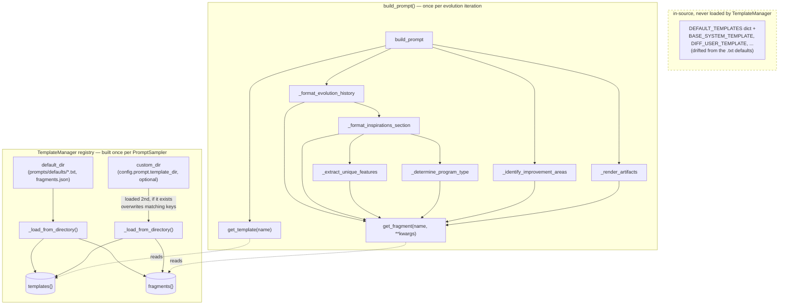

# Prompt templates and fragments — the text scaffolding behind LLM-as-mutation-operator

## Overview
Every time OpenEvolve asks an LLM to propose a mutation, the text it sends isn't hand-assembled in
Python string literals scattered through the sampler — it's looked up from a small two-tier registry
that `PromptSampler` treats as a pluggable resource, not inline code. The registry is `TemplateManager`,
and it separates two kinds of English text:

- **templates** — whole prompt bodies keyed by name (`system_message`, `diff_user`,
  `full_rewrite_user`, `evolution_history`, `top_program`, `inspirations_section`, ...), fetched with
  [`get_template`](../catalog/openevolve/prompt/templates.md#TemplateManager.get_template);
- **fragments** — short, parameterized phrases keyed by name (`fitness_improved`,
  `inspiration_type_diverse`, `artifact_title`, ...), fetched with
  [`get_fragment`](../catalog/openevolve/prompt/templates.md#TemplateManager.get_fragment).

The interesting design decision here isn't the lookup itself — it's *where the text actually lives*.
The module `openevolve/prompt/templates.py` defines a set of Python string constants
([`BASE_SYSTEM_TEMPLATE`](../catalog/openevolve/prompt/templates.md#BASE_SYSTEM_TEMPLATE),
[`DIFF_USER_TEMPLATE`](../catalog/openevolve/prompt/templates.md#DIFF_USER_TEMPLATE),
[`FULL_REWRITE_USER_TEMPLATE`](../catalog/openevolve/prompt/templates.md#FULL_REWRITE_USER_TEMPLATE),
[`EVOLUTION_HISTORY_TEMPLATE`](../catalog/openevolve/prompt/templates.md#EVOLUTION_HISTORY_TEMPLATE),
[`PREVIOUS_ATTEMPT_TEMPLATE`](../catalog/openevolve/prompt/templates.md#PREVIOUS_ATTEMPT_TEMPLATE),
[`TOP_PROGRAM_TEMPLATE`](../catalog/openevolve/prompt/templates.md#TOP_PROGRAM_TEMPLATE),
[`INSPIRATIONS_SECTION_TEMPLATE`](../catalog/openevolve/prompt/templates.md#INSPIRATIONS_SECTION_TEMPLATE),
[`INSPIRATION_PROGRAM_TEMPLATE`](../catalog/openevolve/prompt/templates.md#INSPIRATION_PROGRAM_TEMPLATE),
[`BASE_EVALUATOR_SYSTEM_TEMPLATE`](../catalog/openevolve/prompt/templates.md#BASE_EVALUATOR_SYSTEM_TEMPLATE),
[`EVALUATION_TEMPLATE`](../catalog/openevolve/prompt/templates.md#EVALUATION_TEMPLATE)) rolled up into a
[`DEFAULT_TEMPLATES`](../catalog/openevolve/prompt/templates.md#DEFAULT_TEMPLATES) dict that *looks* like
the source of truth for defaults. It is not. `TemplateManager` never reads `DEFAULT_TEMPLATES` — it
reads `.txt` files (and one `fragments.json`) from a directory on disk at
[`default_dir`](../catalog/openevolve/prompt/templates.md#TemplateManager.default_dir),
via [`_load_from_directory`](../catalog/openevolve/prompt/templates.md#TemplateManager._load_from_directory).
Reading both sides confirms they've drifted: `DIFF_USER_TEMPLATE` still formats `{metrics}`, while the
file actually loaded at runtime (`openevolve/prompts/defaults/diff_user.txt`) has moved on to
`{fitness_score}`, `{feature_coords}`, and `{feature_dimensions}` — the newer MAP-Elites fitness/feature
split. The in-source constants are effectively dead weight; the `.txt`/`.json` files under
`openevolve/prompts/defaults/` are the real defaults a user is editing when they customize a prompt.

## Diagram

## Design rationale (why it's built this way)
- **Templates vs. fragments is a granularity split, not an arbitrary taxonomy.** Templates are large,
  assembled-once-per-prompt documents (a whole system message, a whole SEARCH/REPLACE instruction
  block). Fragments are single-sentence classifications computed *inside loops* — once per previous
  attempt (in
  [`_format_evolution_history`](../catalog/openevolve/prompt/sampler.md#PromptSampler._format_evolution_history)'s
  history loop, which compares each recent attempt to its parent), once per metric within a candidate
  program (in
  [`_extract_unique_features`](../catalog/openevolve/prompt/sampler.md#PromptSampler._extract_unique_features)'s
  loop over `metrics.items()`), and once per inspiration program (
  [`_determine_program_type`](../catalog/openevolve/prompt/sampler.md#PromptSampler._determine_program_type)
  and `_extract_unique_features` are each invoked once per candidate by the caller's loop). Splitting
  fragments from templates means a user who wants to change one word of vocabulary (e.g. rename
  "High-Performer" to something else, or translate fragments) never has to touch — or resynchronize —
  the large structural templates that embed them.
- **`get_template` raises; `get_fragment` degrades.** [`get_template`](../catalog/openevolve/prompt/templates.md#TemplateManager.get_template)'s
  docstring is literally "Get a template by name" and it raises `ValueError` on a miss — a missing
  template means the whole prompt can't be assembled, so failing loudly is correct.
  [`get_fragment`](../catalog/openevolve/prompt/templates.md#TemplateManager.get_fragment) ("Get and
  format a fragment") instead returns `f"[Missing fragment: {name}]"` or a formatting-error string
  inline. A fragment is decorative annotation sprinkled through generated history/inspiration text; one
  missing entry shouldn't abort building an otherwise-fine prompt, it should just leave a visible,
  debuggable marker in the output.
- **Cascading directories, not one editable dict.** [`_load_from_directory`](../catalog/openevolve/prompt/templates.md#TemplateManager._load_from_directory)'s
  docstring is "Load all templates and fragments from a directory" — it's called twice, once against
  [`default_dir`](../catalog/openevolve/prompt/templates.md#TemplateManager.default_dir) (bundled with
  the package) and, if configured, again against
  [`custom_dir`](../catalog/openevolve/prompt/templates.md#TemplateManager.custom_dir) (a project-local
  folder set via `config.prompt.template_dir`). Because both loads write into the same
  [`templates`](../catalog/openevolve/prompt/templates.md#TemplateManager.templates) /
  [`fragments`](../catalog/openevolve/prompt/templates.md#TemplateManager.fragments) dicts, a user only
  needs to drop a same-named `.txt` file (or a `fragments.json` with a subset of keys) to override just
  the pieces they care about — everything else keeps falling back to the shipped default. Keeping prompt
  text in `.txt`/`.json` files rather than only in Python constants also lets a non-Python prompt
  engineer edit wording without touching the package.
- **The SEARCH/REPLACE diff format is taught in plain English, in the template text itself.**
  `DIFF_USER_TEMPLATE`/`diff_user.txt` doesn't describe a JSON schema or tool call for edits — it embeds
  the literal `<<<<<<< SEARCH` / `=======` / `>>>>>>> REPLACE` marker syntax plus a fully worked example
  (a loop-reordering diff) directly in the instructions the LLM reads, so the format is taught by
  demonstration inside the prompt rather than enforced by any structured output feature.

## Entry points
- Building a `PromptSampler` constructs its `TemplateManager`, which on `__init__` sets
  [`default_dir`](../catalog/openevolve/prompt/templates.md#TemplateManager.default_dir) and
  [`custom_dir`](../catalog/openevolve/prompt/templates.md#TemplateManager.custom_dir), starts empty
  [`templates`](../catalog/openevolve/prompt/templates.md#TemplateManager.templates) /
  [`fragments`](../catalog/openevolve/prompt/templates.md#TemplateManager.fragments) dicts, and populates
  them via [`_load_from_directory`](../catalog/openevolve/prompt/templates.md#TemplateManager._load_from_directory).
- [`build_prompt`](../catalog/openevolve/prompt/sampler.md#PromptSampler.build_prompt) — the per-iteration
  call that assembles the full `{"system": ..., "user": ...}` prompt dict handed to the LLM; it resolves
  a named user-turn template and fetches it via
  [`get_template`](../catalog/openevolve/prompt/templates.md#TemplateManager.get_template).
- [`_format_evolution_history`](../catalog/openevolve/prompt/sampler.md#PromptSampler._format_evolution_history)
  and [`_format_inspirations_section`](../catalog/openevolve/prompt/sampler.md#PromptSampler._format_inspirations_section)
  — assemble the "Previous Attempts / Top Programs / Inspiration Programs" sub-sections, each pulling its
  own named templates via `get_template` and short phrases via
  [`get_fragment`](../catalog/openevolve/prompt/templates.md#TemplateManager.get_fragment).

## Mechanism (step-by-step)
1. On construction, [`default_dir`](../catalog/openevolve/prompt/templates.md#TemplateManager.default_dir)
   is fixed to the package-bundled `openevolve/prompts/defaults/` folder and
   [`custom_dir`](../catalog/openevolve/prompt/templates.md#TemplateManager.custom_dir) to an optional
   user-supplied path; [`templates`](../catalog/openevolve/prompt/templates.md#TemplateManager.templates)
   and [`fragments`](../catalog/openevolve/prompt/templates.md#TemplateManager.fragments) start as empty
   dicts.
2. [`_load_from_directory`](../catalog/openevolve/prompt/templates.md#TemplateManager._load_from_directory)
   runs first against `default_dir`: every `*.txt` file becomes a template entry keyed by its filename
   stem, and a single `fragments.json`, if present, is merged wholesale into `fragments`.
3. If a `custom_dir` was supplied, `_load_from_directory` runs a *second* time against it; because both
   the `.txt` loop and the `fragments.json` merge write into the same
   [`templates`](../catalog/openevolve/prompt/templates.md#TemplateManager.templates) /
   [`fragments`](../catalog/openevolve/prompt/templates.md#TemplateManager.fragments) dicts, any name that
   also exists in the defaults is silently overwritten — a cascade, not a wholesale swap.
4. [`get_template`](../catalog/openevolve/prompt/templates.md#TemplateManager.get_template) does a hard
   dict lookup against `templates` and raises `ValueError` for an unrecognized name — templates are
   required, structural pieces.
5. [`get_fragment`](../catalog/openevolve/prompt/templates.md#TemplateManager.get_fragment) does a soft
   lookup against `fragments`: a missing name, or a missing key at `.format()` time, produces an inline
   bracketed placeholder string instead of raising.
6. Formatting helpers —
   [`_identify_improvement_areas`](../catalog/openevolve/prompt/sampler.md#PromptSampler._identify_improvement_areas),
   [`_determine_program_type`](../catalog/openevolve/prompt/sampler.md#PromptSampler._determine_program_type),
   [`_extract_unique_features`](../catalog/openevolve/prompt/sampler.md#PromptSampler._extract_unique_features),
   [`_render_artifacts`](../catalog/openevolve/prompt/sampler.md#PromptSampler._render_artifacts) — call
   `get_fragment` many times per prompt (once per metric, once per candidate program) to build
   short classificatory phrases that get spliced into the larger sections assembled by
   [`_format_evolution_history`](../catalog/openevolve/prompt/sampler.md#PromptSampler._format_evolution_history)
   and [`_format_inspirations_section`](../catalog/openevolve/prompt/sampler.md#PromptSampler._format_inspirations_section);
   `_render_artifacts` itself calls `get_fragment` only once per prompt, for the artifacts-section
   header, not once per individual artifact.
7. [`build_prompt`](../catalog/openevolve/prompt/sampler.md#PromptSampler.build_prompt) picks the
   user-turn template name (diff-based vs. full-rewrite, or an explicit override), resolves it via
   `get_template`, and issues one `.format(...)` call that carries both the legacy `metrics` key and the
   current `fitness_score`/`feature_coords`/`feature_dimensions` keys — so a single call satisfies
   whichever placeholder vocabulary the resolved template text actually contains, old or new.
8. [`add_fragment`](../catalog/openevolve/prompt/templates.md#TemplateManager.add_fragment) lets calling
   code register or override a single fragment programmatically, independent of the file-loading path.

## Key data structures
- [`templates`](../catalog/openevolve/prompt/templates.md#TemplateManager.templates) — `dict[str, str]`,
  full prompt bodies keyed by name (`system_message`, `diff_user`, `full_rewrite_user`,
  `evolution_history`, `previous_attempt`, `top_program`, `inspirations_section`, `inspiration_program`,
  plus, per `sampler.py`, `system_message_changes_description` / `system_message_with_changes_description`
  / `user_message_with_changes_description` for the "programs as changes description" mode). Populated
  purely from `.txt` files on disk — the filename stem is the key.
- [`fragments`](../catalog/openevolve/prompt/templates.md#TemplateManager.fragments) — `dict[str, str]`,
  short phrase templates keyed by name (e.g. `fitness_improved`, `fitness_declined`,
  `inspiration_type_diverse`, `inspiration_code_with_numpy`, `artifact_title`). Populated from a single
  `fragments.json`, and mutable at runtime via
  [`add_fragment`](../catalog/openevolve/prompt/templates.md#TemplateManager.add_fragment).
- [`default_dir`](../catalog/openevolve/prompt/templates.md#TemplateManager.default_dir) /
  [`custom_dir`](../catalog/openevolve/prompt/templates.md#TemplateManager.custom_dir) — `Path` /
  `Path | None`, recording where each tier's content was (or would be) loaded from; used only during
  `__init__`, not consulted again afterward.
- [`DEFAULT_TEMPLATES`](../catalog/openevolve/prompt/templates.md#DEFAULT_TEMPLATES) — a module-level
  `dict` built from the `BASE_*`/`*_TEMPLATE` string constants
  ([`BASE_SYSTEM_TEMPLATE`](../catalog/openevolve/prompt/templates.md#BASE_SYSTEM_TEMPLATE),
  [`BASE_EVALUATOR_SYSTEM_TEMPLATE`](../catalog/openevolve/prompt/templates.md#BASE_EVALUATOR_SYSTEM_TEMPLATE),
  [`DIFF_USER_TEMPLATE`](../catalog/openevolve/prompt/templates.md#DIFF_USER_TEMPLATE),
  [`FULL_REWRITE_USER_TEMPLATE`](../catalog/openevolve/prompt/templates.md#FULL_REWRITE_USER_TEMPLATE),
  [`EVOLUTION_HISTORY_TEMPLATE`](../catalog/openevolve/prompt/templates.md#EVOLUTION_HISTORY_TEMPLATE),
  [`PREVIOUS_ATTEMPT_TEMPLATE`](../catalog/openevolve/prompt/templates.md#PREVIOUS_ATTEMPT_TEMPLATE),
  [`TOP_PROGRAM_TEMPLATE`](../catalog/openevolve/prompt/templates.md#TOP_PROGRAM_TEMPLATE),
  [`INSPIRATIONS_SECTION_TEMPLATE`](../catalog/openevolve/prompt/templates.md#INSPIRATIONS_SECTION_TEMPLATE),
  [`INSPIRATION_PROGRAM_TEMPLATE`](../catalog/openevolve/prompt/templates.md#INSPIRATION_PROGRAM_TEMPLATE),
  [`EVALUATION_TEMPLATE`](../catalog/openevolve/prompt/templates.md#EVALUATION_TEMPLATE)). Shaped exactly
  like `templates`, but disconnected from it: no symbol in this module or in `sampler.py` reads
  `DEFAULT_TEMPLATES`, and a repo-wide search turns up no other reference to it either — it is defined
  and never consumed.
- [`logger`](../catalog/openevolve/prompt/templates.md#logger) — module logger; used only to warn once,
  at construction, when a configured `custom_dir` doesn't exist on disk.

## Dynamics (design intent)
The Evidence table available for this packet exercises `build_prompt` and its downstream formatting
helpers (`_render_artifacts`, `_format_inspirations_section`, `_determine_program_type`,
`_extract_unique_features`) extensively — `tests/test_prompt_sampler.py`,
`tests/test_prompt_sampler_comprehensive.py`, and `tests/test_artifacts*.py` all assert on the *output*
of prompt assembly (e.g. `test_build_prompt_with_inspirations`, `test_feature_coordinates_formatting_in_prompt`,
`test_render_artifacts_truncation`). That coverage exercises `get_template`/`get_fragment` transitively
through every one of those calls, since every formatting helper is a wrapper around one or the other.

> [!inferred]
> No test in the available evidence names `TemplateManager`, `_load_from_directory`, `custom_dir`, or
> `add_fragment` directly — the cascading-override behavior (custom directory shadowing defaults,
> the warning on a missing `custom_dir`) reads as intentional from the docstrings and control flow, but
> whether it has dedicated unit coverage elsewhere in the test suite is not established by this packet's
> evidence.

## Edge cases
- Unknown template name → [`get_template`](../catalog/openevolve/prompt/templates.md#TemplateManager.get_template)
  raises `ValueError`, which propagates out of `build_prompt` uncaught — a bad `template_key` override or
  a typo'd custom `.txt` filename fails the whole iteration rather than degrading.
- Unknown fragment name, or a fragment whose `.format(**kwargs)` call is missing a required key →
  [`get_fragment`](../catalog/openevolve/prompt/templates.md#TemplateManager.get_fragment) catches the
  `KeyError` and returns a bracketed diagnostic string in place of the phrase, so the prompt still gets
  built (just with a visible `[Missing fragment: ...]` or `[Fragment formatting error: ...]` marker).
- `custom_dir` configured but absent on disk → construction logs a warning via
  [`logger`](../catalog/openevolve/prompt/templates.md#logger) and proceeds with only the defaults; it is
  not an exception.
- Because [`_load_from_directory`](../catalog/openevolve/prompt/templates.md#TemplateManager._load_from_directory)
  handles `.txt` templates and `fragments.json` independently, a custom directory can override just one
  tier (e.g. only supply `fragments.json` to retint vocabulary) without touching the other.
- The in-source [`DEFAULT_TEMPLATES`](../catalog/openevolve/prompt/templates.md#DEFAULT_TEMPLATES) dict
  and its constituent `BASE_SYSTEM_TEMPLATE`/`DIFF_USER_TEMPLATE`/etc. constants are a latent maintenance
  hazard: editing them has no runtime effect (confirmed by reading `_load_from_directory`, which only
  reads files, and by their absence from every other reference in the repo), so a contributor patching
  prompt wording in the wrong place would ship a change nobody sees.

## Open questions
- Why does `templates.py` carry a fully-formed, unused `DEFAULT_TEMPLATES` dict alongside the file-based
  defaults that have since drifted from it (e.g. `{metrics}` vs. `{fitness_score}`/`{feature_coords}`)?
  Nothing in this packet's subgraph shows a code path that ever falls back to it — it may be a
  since-superseded first implementation kept around as documentation/reference, but that is not
  established by the symbols cited here.
- The `evaluation`/`evaluator_system_message` templates
  ([`EVALUATION_TEMPLATE`](../catalog/openevolve/prompt/templates.md#EVALUATION_TEMPLATE),
  [`BASE_EVALUATOR_SYSTEM_TEMPLATE`](../catalog/openevolve/prompt/templates.md#BASE_EVALUATOR_SYSTEM_TEMPLATE))
  are defined here but no consumer of them appears in this packet's subgraph — presumably an LLM-based
  evaluator elsewhere in the repo reads them; that call site is out of scope for this page.

## See also
- [`openevolve-prompt-sampler.md`](openevolve-prompt-sampler.md) — `PromptSampler.build_prompt` and the
  per-iteration substitution logic (metrics formatting, evolution-history assembly, inspirations) that
  consumes the templates and fragments described here.
- [`../../../sources/alphaevolve.md`](../../../sources/alphaevolve.md) — the AlphaEvolve paper this
  open-source recipe reimplements; the diff-format-by-demonstration and evaluator-feedback-in-prompt
  patterns here are OpenEvolve's concrete instantiation of that design.
