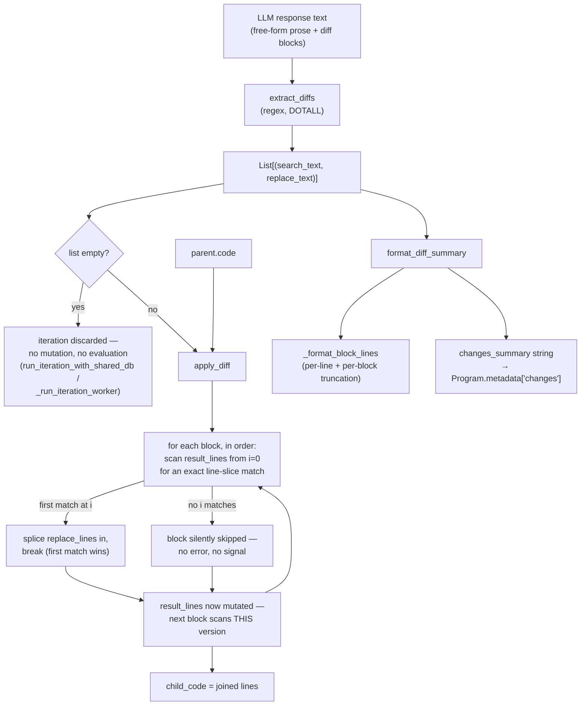

# SEARCH/REPLACE diffs — turning an LLM's text output into a child program

<!-- connect:up:begin -->
> **Cross-repo concept:** part of [evolutionary-algorithm-discovery](../../../concepts/evolutionary-algorithm-discovery.md) across this wiki's repos.
<!-- connect:up:end -->
## Overview
`openevolve/utils/code_utils.py` is where the LLM-as-mutation-operator idea stops being a metaphor and
becomes four small, purely textual functions. The LLM never touches an AST, never calls a tool, never
edits a file directly — it emits free-form text, and this module is the entire boundary between that text
and a new candidate program. [`extract_diffs`](../catalog/openevolve/utils/code_utils.md#extract_diffs)
pulls `<<<<<<< SEARCH … ======= … >>>>>>> REPLACE` blocks out of the raw response with one regex;
[`apply_diff`](../catalog/openevolve/utils/code_utils.md#apply_diff) then walks the parent program's
source line-by-line looking for an **exact, contiguous, whitespace-sensitive** match of each block's SEARCH
lines and splices in the REPLACE lines. [`format_diff_summary`](../catalog/openevolve/utils/code_utils.md#format_diff_summary)
(backed by [`_format_block_lines`](../catalog/openevolve/utils/code_utils.md#_format_block_lines)) is a
side channel, not part of the mutation itself — it renders the same `(search, replace)` tuples into a
bounded, human-readable string that ends up in the child `Program`'s metadata for logging and prompt
history, never as a gate on whether the child is accepted.

The whole module is stateless string/list manipulation — no classes, no dependency on the `Program` model
or the database. It has exactly one job: **text in, text out**, and it does that job with the simplest
possible matching rule (Python list-slice equality), not a diff/patch library or a fuzzy matcher.

## Diagram

## Design rationale (why it's built this way)
- **The delimiter format is a config knob, not a hardwired protocol.** `diff_pattern` is a default
  *parameter* on both [`apply_diff`](../catalog/openevolve/utils/code_utils.md#apply_diff) and
  [`extract_diffs`](../catalog/openevolve/utils/code_utils.md#extract_diffs) (`r"<<<<<<< SEARCH\n(.*?)=======\n(.*?)>>>>>>> REPLACE"`),
  and both [`run_iteration_with_shared_db`](../catalog/openevolve/iteration.md#run_iteration_with_shared_db)
  and [`_run_iteration_worker`](../catalog/openevolve/process_parallel.md#_run_iteration_worker) thread
  `config.diff_pattern` through explicitly rather than relying on the default — so the exact marker tokens
  the prompt asks the LLM to use can be changed per deployment without touching this module.
- **Exact match, not fuzzy.** [`apply_diff`](../catalog/openevolve/utils/code_utils.md#apply_diff) compares
  a slice of lines with plain `==`. There is no edit-distance tolerance, no whitespace normalization, no
  "close enough" scoring at this layer — a SEARCH block either reproduces the parent's lines byte-for-byte
  or it does nothing. That keeps the mutation step trivially cheap and unambiguous, at the cost of pushing
  all the burden of exact reproduction onto the LLM's output (and onto the prompt that shows it the current
  code).
- **Multiple diffs in one response, but applied as a sequence, not a batch.** [`extract_diffs`](../catalog/openevolve/utils/code_utils.md#extract_diffs)'s
  non-greedy `(.*?)` group lets a single LLM response carry many independent SEARCH/REPLACE blocks (each
  one terminates at its own nearest `=======`/`>>>>>>> REPLACE`, not the last one in the response — a
  greedy pattern would swallow everything between the first `SEARCH` and the final `REPLACE`).
  [`apply_diff`](../catalog/openevolve/utils/code_utils.md#apply_diff) then applies each block in order
  against the **same, progressively-mutated** line list — a later block's SEARCH text must still be found
  in a source that may already contain an earlier block's edits, not in the pristine parent. This is a real
  ordering dependency baked into the design, not an incidental implementation detail.
- **Rendering the diff is deliberately decoupled from applying it.** [`format_diff_summary`](../catalog/openevolve/utils/code_utils.md#format_diff_summary)
  and [`_format_block_lines`](../catalog/openevolve/utils/code_utils.md#_format_block_lines) take the exact
  same `(search, replace)` tuples [`apply_diff`](../catalog/openevolve/utils/code_utils.md#apply_diff)
  consumes, but only ever produce a bounded string (`max_line_len=100`, `max_lines=30` by default) — capping
  how much of a diff a single change can inject into logs or into the next prompt's evolution history,
  regardless of how large the actual SEARCH/REPLACE text was.

> [!inferred] The 100-char/30-line truncation defaults read as a prompt-budget guard: this summary is
> stored on the child `Program` and openevolve's prompt-building code elsewhere in the repo folds prior
> programs' descriptions into the next prompt, so an unbounded diff-of-everything would grow every
> subsequent prompt. That downstream prompt-assembly code is outside this packet's subgraph, so this is
> read from the shape of the truncation parameters, not cited directly.

## Entry points
- [`run_iteration_with_shared_db`](../catalog/openevolve/iteration.md#run_iteration_with_shared_db) — the
  single-process iteration path ("optimized for use with persistent worker processes," per its own
  docstring). After sampling a parent and building a prompt, it always calls
  [`extract_diffs`](../catalog/openevolve/utils/code_utils.md#extract_diffs) on the LLM's raw response and
  abandons the iteration if it comes back empty; only when `config.prompt.programs_as_changes_description`
  is off (the default) does it go on to call [`apply_diff`](../catalog/openevolve/utils/code_utils.md#apply_diff)
  to produce `child_code`, then [`format_diff_summary`](../catalog/openevolve/utils/code_utils.md#format_diff_summary)
  on that same block list for the metadata string stored alongside the new `Program` — when that flag is
  on, it routes the extracted blocks through `split_diffs_by_target`/`apply_diff_blocks` instead (outside
  this packet's subgraph; see Open questions).
- [`_run_iteration_worker`](../catalog/openevolve/process_parallel.md#_run_iteration_worker) — the actual
  production path: each iteration runs in its own `ProcessPoolExecutor` worker, and — on the same
  `config.prompt.programs_as_changes_description`-off default path as above — calls the identical
  three-function sequence — [`extract_diffs`](../catalog/openevolve/utils/code_utils.md#extract_diffs),
  [`apply_diff`](../catalog/openevolve/utils/code_utils.md#apply_diff),
  [`format_diff_summary`](../catalog/openevolve/utils/code_utils.md#format_diff_summary) — on its own copy
  of the parent's code, entirely inside the worker process.

## Mechanism (step-by-step)
1. The LLM emits a free-form text response that may interleave prose with one or more SEARCH/REPLACE
   blocks. [`extract_diffs`](../catalog/openevolve/utils/code_utils.md#extract_diffs) runs one
   `re.findall` with `re.DOTALL` (so `.` matches newlines) against the whole response and returns every
   `(search_text, replace_text)` pair it finds, in the order they appear.
2. Each captured group is `.rstrip()`-ed — trailing whitespace/blank lines at the very end of the block are
   removed — but **not** `.lstrip()`-ed, and interior lines are untouched: the exact indentation of every
   line inside a block survives, because reproducing that whitespace precisely is exactly what
   [`apply_diff`](../catalog/openevolve/utils/code_utils.md#apply_diff) will require next.
3. Both entry points check the result immediately: if
   [`extract_diffs`](../catalog/openevolve/utils/code_utils.md#extract_diffs) returns an empty list (the
   regex matched nothing at all — the LLM didn't use the expected format), the whole iteration is abandoned
   before any mutation or evaluation is attempted. The LLM call is wasted, but no corrupt or empty child
   program is ever created from a response with zero valid diffs.
4. [`apply_diff`](../catalog/openevolve/utils/code_utils.md#apply_diff) splits `original_code` into a plain
   `List[str]` and, internally, calls [`extract_diffs`](../catalog/openevolve/utils/code_utils.md#extract_diffs)
   a second time on the raw `diff_text` (with the same `diff_pattern`) to get its own list of blocks — it
   does not reuse a list a caller may have already extracted.
5. For each block, in order, [`apply_diff`](../catalog/openevolve/utils/code_utils.md#apply_diff) scans
   the current line list from index 0 upward, testing
   `result_lines[i:i+len(search_lines)] == search_lines` — a plain, ordered, whitespace-sensitive Python
   list-slice equality check, not a fuzzy or context-based diff/patch algorithm.
6. On the **first** index that matches, [`apply_diff`](../catalog/openevolve/utils/code_utils.md#apply_diff)
   splices in `replace_lines` at that position and `break`s out of the scan — so if identical SEARCH text
   occurs more than once in the source, only the earliest occurrence is ever touched; the disambiguation is
   purely positional and silent.
7. Inside [`apply_diff`](../catalog/openevolve/utils/code_utils.md#apply_diff), `result_lines` is the *same*
   list object across the whole loop over blocks, so block *N+1*'s scan sees block *N*'s already-spliced-in
   replacement — sequential dependence, not independent parallel patches.
8. If no index satisfies the equality check for a given block, the inner loop exhausts without a `break`:
   [`apply_diff`](../catalog/openevolve/utils/code_utils.md#apply_diff) raises nothing, logs nothing, and
   returns no signal that the block was skipped — it simply moves to the next block, and that region of the
   source is left exactly as it was. A non-matching SEARCH block is a **silent no-op**, not a hard failure;
   the only hard failure in this module is the upstream "zero blocks extracted" check in step 3.
9. [`format_diff_summary`](../catalog/openevolve/utils/code_utils.md#format_diff_summary), given the same
   list of tuples, renders each one either as a single inline line (`Change N: 'x' to 'y'`, when both the
   stripped search and replace text are exactly one line) or as a full `Replace:\n…\nwith:\n…` block via
   [`_format_block_lines`](../catalog/openevolve/utils/code_utils.md#_format_block_lines); the joined result
   is what both entry points store as the child `Program`'s `metadata["changes"]`.
10. [`_format_block_lines`](../catalog/openevolve/utils/code_utils.md#_format_block_lines) truncates each
    individual line to `max_line_len` characters (default 100, appending `"..."`), caps the number of
    rendered lines at `max_lines` (default 30, appending an `"(N more lines)"` marker), and renders an empty
    input as the literal string `"(empty)"`.

## Key data structures
- **`List[Tuple[str, str]]`** — the one shared exchange format between all three real functions: produced
  once by [`extract_diffs`](../catalog/openevolve/utils/code_utils.md#extract_diffs), consumed by
  [`apply_diff`](../catalog/openevolve/utils/code_utils.md#apply_diff) (which re-derives its own copy
  internally) and by [`format_diff_summary`](../catalog/openevolve/utils/code_utils.md#format_diff_summary).
  Neither element is ever parsed further — a `search_text`/`replace_text` pair stays a plain string end to
  end.
- **`diff_pattern`** — a plain regex string, not a precompiled pattern object; both
  [`apply_diff`](../catalog/openevolve/utils/code_utils.md#apply_diff) and
  [`extract_diffs`](../catalog/openevolve/utils/code_utils.md#extract_diffs) call `re.findall` on it fresh
  every invocation. It is a default parameter, overridden per call by `config.diff_pattern` at both entry
  points.
- There is no dedicated "diff" object or class anywhere in this module — the entire mutation protocol is
  two parallel lists of strings and a line index. The `Program` record that eventually wraps `child_code`
  lives entirely outside this module (in the database layer).

## Dynamics (design intent)
The author's own docstrings state the intent plainly: `extract_diffs` "Extract diff blocks from the diff
text," `apply_diff` "Apply a diff to the original code," `format_diff_summary` "Create a human-readable
summary of the diff." The test suite pins down the two paths this page cares about most precisely:
[`test_extract_diffs`](../catalog/tests/test_code_utils.md#TestCodeUtils.test_extract_diffs) confirms a
response with two blocks *and* interleaved prose ("Let's improve this code:", "Another change:") extracts
exactly two `(search, replace)` tuples in order, ignoring the prose entirely.
[`test_apply_diff`](../catalog/tests/test_code_utils.md#TestCodeUtils.test_apply_diff) confirms two
non-overlapping blocks both apply correctly in a single call — but because its two SEARCH targets don't
overlap or depend on each other, it does not exercise the cumulative-mutation ordering dependency described
in Mechanism step 7.

On the summary side, [`test_single_line_changes`](../catalog/tests/test_code_utils.md#TestFormatDiffSummary.test_single_line_changes)
and [`test_multi_line_changes_show_actual_content`](../catalog/tests/test_code_utils.md#TestFormatDiffSummary.test_multi_line_changes_show_actual_content)
together pin down the inline-vs-block branch (the multi-line test explicitly asserts the summary contains
the real code and *not* a generic "2 lines" placeholder), and
[`test_multiple_diff_blocks`](../catalog/tests/test_code_utils.md#TestFormatDiffSummary.test_multiple_diff_blocks)
confirms blocks are numbered `Change 1:`, `Change 2:`, … in order.
[`test_configurable_max_line_len`](../catalog/tests/test_code_utils.md#TestFormatDiffSummary.test_configurable_max_line_len)
and [`test_configurable_max_lines`](../catalog/tests/test_code_utils.md#TestFormatDiffSummary.test_configurable_max_lines)
exercise the two truncation knobs at the `format_diff_summary` level, and
[`test_block_lines_basic_formatting`](../catalog/tests/test_code_utils.md#TestFormatDiffSummary.test_block_lines_basic_formatting),
[`test_block_lines_long_line_truncation`](../catalog/tests/test_code_utils.md#TestFormatDiffSummary.test_block_lines_long_line_truncation),
[`test_block_lines_many_lines_truncation`](../catalog/tests/test_code_utils.md#TestFormatDiffSummary.test_block_lines_many_lines_truncation),
and [`test_block_lines_empty_input`](../catalog/tests/test_code_utils.md#TestFormatDiffSummary.test_block_lines_empty_input)
pin the same behavior directly at the `_format_block_lines` level (2-space indent, `"..."` truncation past
100 chars, an `"(N more lines)"` marker past 30 lines, and `"(empty)"` for no input).

## Edge cases
- **A SEARCH block that doesn't match anything is a silent no-op**, grounded directly in
  [`apply_diff`](../catalog/openevolve/utils/code_utils.md#apply_diff)'s scan-and-`break` structure (step 8
  above) — no exception, no return value indicating partial failure. Nothing in this packet's Evidence
  table exercises this specific path (both diff-related tests use SEARCH text that matches), so this is
  read from the source, not confirmed by a test.
- **Duplicate SEARCH text resolves to the earliest occurrence only** — position, not content, breaks the
  tie (Mechanism step 6).
- **Zero diff blocks extracted discards the entire iteration** before any code mutation happens — the one
  case in this module's call sites that *is* treated as a hard failure, checked identically in both
  [`run_iteration_with_shared_db`](../catalog/openevolve/iteration.md#run_iteration_with_shared_db) and
  [`_run_iteration_worker`](../catalog/openevolve/process_parallel.md#_run_iteration_worker).
- **Only the outer edges of a captured block are trimmed.** [`extract_diffs`](../catalog/openevolve/utils/code_utils.md#extract_diffs)'s
  `.rstrip()` removes trailing whitespace from the *whole* captured string, not from each interior line —
  so trailing whitespace on an interior line of a SEARCH block still has to match the parent's line
  byte-for-byte for [`apply_diff`](../catalog/openevolve/utils/code_utils.md#apply_diff) to find it.
- **Applying diffs is order-sensitive, not batch-commutative** — see Mechanism step 7; a response whose
  blocks are logically independent still gets applied through a shared, mutating line list.

## Open questions
- This packet's subgraph does not include `parse_full_rewrite` — a sibling function in the same module used
  when `diff_based_evolution` is off, which extracts a whole replacement program from a fenced code block
  instead of a SEARCH/REPLACE diff. Whether/how that full-rewrite mode maps onto the "short programs use
  full rewrites" detail described in the AlphaEvolve paper isn't answered by this page.
- The subgraph also does not include `apply_diff_blocks` (a line-wise apply that returns an applied-block
  count) or `split_diffs_by_target` (which routes SEARCH blocks to either the code or a separate
  "changes description" text). Reading the call sites shows these exist as an alternate application path
  used when `config.prompt.programs_as_changes_description` is set — a second, count-returning variant of
  the same matching idea this page describes for [`apply_diff`](../catalog/openevolve/utils/code_utils.md#apply_diff),
  worth its own pass if that path becomes the question being asked.
- No test in this packet's Evidence table exercises a SEARCH block that fails to match — whether the
  silent-skip behavior (Edge cases, above) is a deliberate design choice or simply an unexamined gap isn't
  settled by the tests alone.

## See also
- [`openevolve-controller.md`](openevolve-controller.md) — the orchestrator whose evolution loop this
  module's output (`child_code`) ultimately feeds into for evaluation.
- [`openevolve-llm-ensemble.md`](openevolve-llm-ensemble.md) — produces the raw response text this module
  parses; this page is the other half of the same mutation operator.
- [`openevolve-database.md`](openevolve-database.md) — stores the resulting `Program`, including the
  `metadata["changes"]` string [`format_diff_summary`](../catalog/openevolve/utils/code_utils.md#format_diff_summary)
  produces.
- [`../../../sources/alphaevolve.md`](../../../sources/alphaevolve.md) — the DeepMind paper whose
  SEARCH/REPLACE-diff mutation convention this module reimplements.
- [`../../../concepts/evolutionary-algorithm-discovery.md`](../../../concepts/evolutionary-algorithm-discovery.md) —
  the cross-repo concept this page is the openevolve-side "mutation, output-parsing half" instance of.
