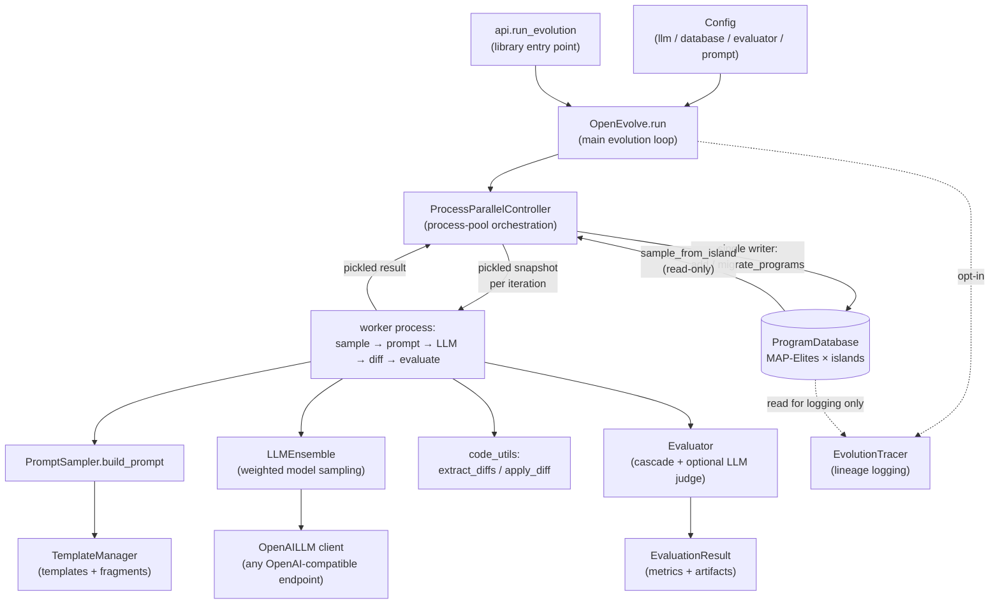
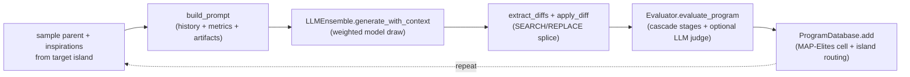

# openevolve — what it is and how it fits together

## In one paragraph

[openevolve](https://github.com/codelion/openevolve) is an open-source, provider-agnostic
reimplementation of DeepMind's AlphaEvolve recipe (see [`sources/alphaevolve.md`](../../sources/alphaevolve.md)):
given a seed program and a user-supplied scoring function, it runs an asynchronous evolutionary loop
where an **LLM ensemble** proposes SEARCH/REPLACE text diffs against existing candidates, a **cascade
evaluator** scores each resulting child program (with an optional LLM-judged qualitative pass folded
back into the same numeric score), and a **MAP-Elites × island-model population database** decides
which scored candidates get to be tomorrow's parents. The entire per-iteration workload — sampling a
parent, building a prompt, calling the LLM, applying its diff, and evaluating the child — runs inside
an OS **process pool**, with a strict single-writer design (only the main process ever mutates the
database), so many islands' iterations stay in flight concurrently without any cross-process lock.

## Core architecture

A second, narrower view — one iteration end to end, the spine every generation repeats:

## Main concepts

- **The evolution loop.** [`OpenEvolve.run`](concepts/openevolve-controller.md) is mostly setup/teardown
  around a pipelined process pool: it keeps a bounded number of futures in flight per island and
  resubmits the instant one resolves, rather than running lockstep generations. It tracks the
  best-ever program in a side-channel independent of the MAP-Elites grid, since the grid is a diversity
  mechanism that can legitimately evict the best program from its own cell.
- **Configuration.** [`Config`](concepts/openevolve-config.md) is a nested-dataclass "recipe file" — one
  sub-config per subsystem (`llm`, `database`, `evaluator`, `prompt`) — with no mechanism of its own
  beyond YAML ingestion and a two-tier default-broadcast from the ensemble-wide `llm:` block down to
  individual models.
- **The population database.** [`ProgramDatabase`](concepts/openevolve-database.md) is the third pillar
  of the recipe: several independent islands, each running its own MAP-Elites feature grid so five
  islands can hold five different solutions in the same behavioral cell instead of one global grid
  collapsing them. A hard-learned one-way migration ratchet prevents re-migration blowup (a real
  incident let one program spawn 183 descendant copies).
- **Process-based parallelism.** [`ProcessParallelController`](concepts/openevolve-process_parallel.md)
  is a "snapshot out, merge back, single writer" design — no shared memory, no lock. Workers reason
  over a frozen, pickled copy of the population; only the main process's event loop ever calls
  `database.add`.
- **The LLM-as-mutation-operator.** [`LLMEnsemble`](concepts/openevolve-llm-ensemble.md) reduces
  AlphaEvolve's cheap/fast + expensive/capable mixing to a weighted random draw per call (the shipped
  default: 80% `gemini-2.0-flash-lite`, 20% `gemini-2.0-flash`); each sampled model delegates to
  [`OpenAILLM`](concepts/openevolve-llm-openai.md), a thin, provider-agnostic client with a flat retry
  loop and an optional file-queue human-in-the-loop mode.
- **Prompt assembly.** [`PromptSampler.build_prompt`](concepts/openevolve-prompt-sampler.md) is the sole
  translation layer between the database's structured state and the LLM's natural-language input — it
  narrates the MAP-Elites objective, evolution history, and evaluator artifacts into text, since the LLM
  is stateless and remembers nothing between calls. Its structural text and short phrases are pulled
  from [`TemplateManager`](concepts/openevolve-prompt-templates.md), a two-tier, file-backed registry
  users can override without touching Python.
- **Turning text back into code.** [`code_utils`](concepts/openevolve-utils-code_utils.md) is where the
  metaphor "LLM edits code" becomes four stateless string functions: `extract_diffs` regexes out
  SEARCH/REPLACE blocks, and `apply_diff` splices them into the parent source via exact, sequential
  line-slice matching — no AST, no fuzzy matching, no batch application.
- **The programmatic evaluator.** [`Evaluator`](concepts/openevolve-evaluator.md) runs a **cascade** of
  increasingly expensive, timeout-bounded stages that can bail out early on a bad candidate, plus an
  optional LLM-judged pass whose qualitative verdict is flattened back into the same numeric
  `combined_score`. The scoring contract itself —
  [`EvaluationResult`](concepts/openevolve-evaluation_result.md) — smuggles failure context (stderr,
  tracebacks) out via a side-channel `artifacts` dict that never travels through the `Dict[str, float]`
  return value evaluators still return for backward compatibility.
- **Observability.** [`EvolutionTracer`](concepts/openevolve-evolution_trace.md) is a decoupled logging
  layer with no hook into the database's hot path; its live, incremental trace is the only complete
  lineage record for a run with population eviction, since offline reconstruction from a checkpoint
  silently loses any edge whose parent was already evicted.
- **The library entry point.** [`api.run_evolution`](concepts/openevolve-api.md) is a thin,
  input-coercing sync facade over the async controller — it accepts a code string, a file path, or a
  bare callable, and always drives evolution through the process-pool path (there is no single-process
  code path in `OpenEvolve.run` at all).

## How a request flows

`api.run_evolution` (or a direct `OpenEvolve` construction) resolves a `Config`, seeds or resumes a
`ProgramDatabase`, and hands off to `ProcessParallelController.run_evolution`. Each iteration: the main
process samples a parent + inspirations from an island (read-only), ships an immutable snapshot to a
worker; the worker calls `PromptSampler.build_prompt`, draws one model via `LLMEnsemble`, applies the
returned diff via `code_utils.apply_diff`, and scores the child via `Evaluator.evaluate_program`; the
result comes back to the main process, which is the only place `ProgramDatabase.add` is ever called —
placing the child in a MAP-Elites cell, routing it to an island, and (periodically) migrating top
performers across islands. The loop repeats until `max_iterations`, a `target_score`, or an
early-stopping condition fires, then the tracked `best_program_id` is saved.

## Map of the wiki

- **"How does the whole loop work end to end?"** → [`openevolve-controller.md`](concepts/openevolve-controller.md).
- **"What decides which candidates survive?"** → [`openevolve-database.md`](concepts/openevolve-database.md).
- **"How is it actually parallelized — locks? shared memory?"** → [`openevolve-process_parallel.md`](concepts/openevolve-process_parallel.md).
- **"What does the LLM see, and how does it pick a model?"** → [`openevolve-prompt-sampler.md`](concepts/openevolve-prompt-sampler.md)
  + [`openevolve-llm-ensemble.md`](concepts/openevolve-llm-ensemble.md).
- **"How does an LLM's text response become a new program?"** → [`openevolve-utils-code_utils.md`](concepts/openevolve-utils-code_utils.md).
- **"How is a candidate scored, and how are broken candidates handled cheaply?"** → [`openevolve-evaluator.md`](concepts/openevolve-evaluator.md)
  + [`openevolve-evaluation_result.md`](concepts/openevolve-evaluation_result.md).
- **"What's configurable?"** → [`openevolve-config.md`](concepts/openevolve-config.md).
- **"What's the simplest way to call this as a library?"** → [`openevolve-api.md`](concepts/openevolve-api.md).
- **For the exhaustive per-module/per-symbol index** → `catalog/` (generated by `wikify finalize`).
- **For the concept table and cross-repo links** → [`index.md`](index.md) (this silo) and the host
  [`wiki/index.md`](../../index.md).
- **For the AlphaEvolve paper this repo reimplements** → [`sources/alphaevolve.md`](../../sources/alphaevolve.md).
- **For the shared cross-repo concept this repo's evolutionary loop instantiates** →
  [`concepts/evolutionary-algorithm-discovery.md`](../../concepts/evolutionary-algorithm-discovery.md).
