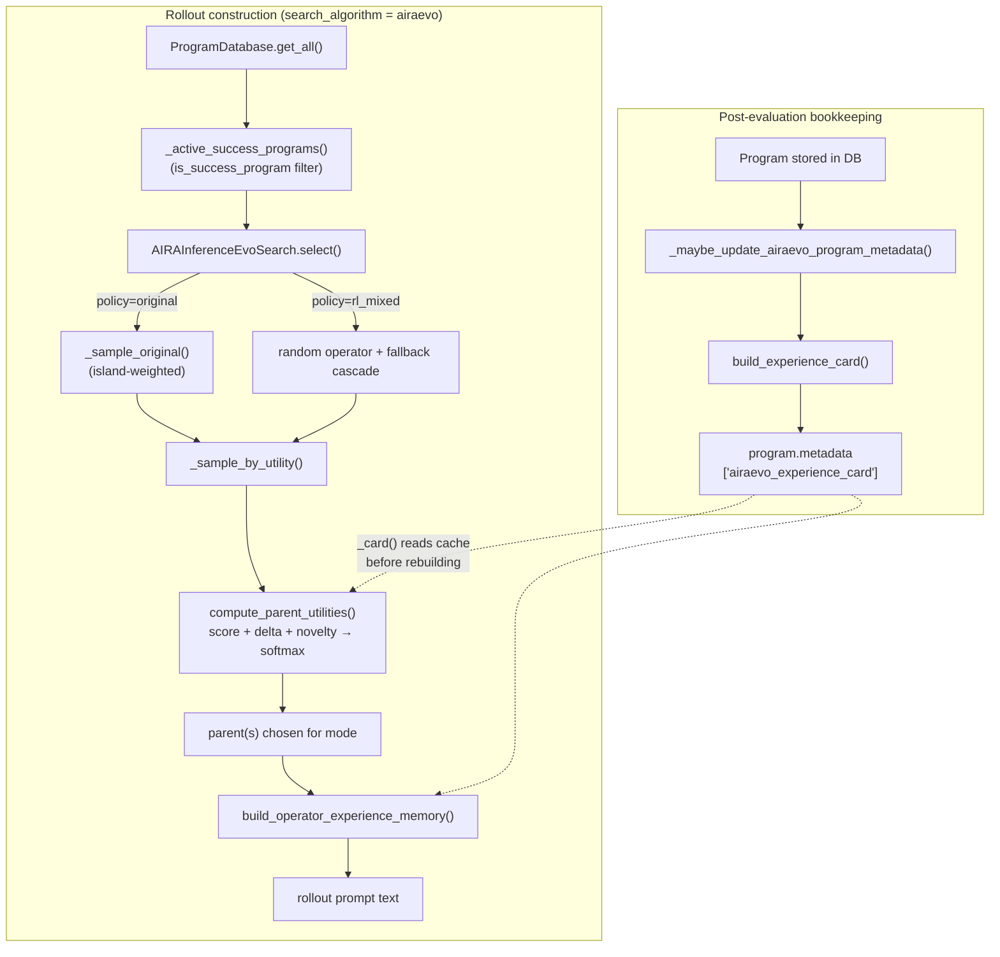

# airaevo_experience.py — the original-AIRA-Evo selection/memory adapter for RL rollouts

<!-- connect:up:begin -->
> **Cross-repo concept:** part of [evolutionary-algorithm-discovery](../../../concepts/evolutionary-algorithm-discovery.md), [program-evolution-operators](../../../concepts/program-evolution-operators.md), [retrieval-augmented-prompt-synthesis](../../../concepts/retrieval-augmented-prompt-synthesis.md) across this wiki's repos.
<!-- connect:up:end -->
## Overview

`OpenMLE-ERL/RL/airaevo_experience.py` reimplements the *original* AIRA-Evo population-search
algorithm's parent-selection and prompt-memory logic on top of OpenMLE-ERL's own RL infrastructure —
a SQLite-backed `ProgramDatabase` of duck-typed `Program` rows — instead of the Dojo Node/Journal
objects the upstream, vendored AIRA-Evo implementation expects. It backs `AIRAInferenceEvoSearch`, one
of the RL loop's selectable rollout-construction strategies: given every program evaluated so far for a
task, it decides which operator (Draft/Improve/Debug/Crossover) and which parent program(s) the next
generation should condition on, weighting candidate parents by a three-term score/progress/novelty
utility, then renders a free-form text memory block tailored to whichever operator was chosen. A second,
independent entry point runs *after* a program is scored: it builds a structured "experience card"
(fitness, heuristic method family, delta-vs-parent, novelty, error signature) and caches it on the
program's own metadata so later selection rounds can read it back instead of recomputing it. Per the
paper this repo accompanies, this is precisely the free-form-memory, eagerly-synthesized,
scalar-fitness-first scheme that OpenMLE-Evo's search redesign departs from
([Frontis-MA1](../../../sources/frontis-ma1.md), §5) — this module is the concrete implementation of
that baseline inside the RL harness, not the redesign itself.

## Diagram

## Design rationale (why it's built this way)

- **A parallel re-implementation, not a wrapper.** The module docstring states the constraint directly:
  "The original AIRA-Evo implementation stores state in Dojo Node/Journal objects. The RL loop stores
  evaluated programs in SQLite, so this module keeps the same selection and prompt-memory signals while
  operating on Program-like objects." That is why almost every function in the file takes `program: Any`
  and reads fields defensively with `getattr`/dict lookups instead of a fixed type —
  [`_metadata`](../catalog/OpenMLE-ERL/RL/airaevo_experience.md#_metadata),
  [`_program_id`](../catalog/OpenMLE-ERL/RL/airaevo_experience.md#_program_id),
  [`parent_ids`](../catalog/OpenMLE-ERL/RL/airaevo_experience.md#parent_ids), and
  [`is_success_program`](../catalog/OpenMLE-ERL/RL/airaevo_experience.md#is_success_program) all treat
  `program` as a loosely-typed record so the same logic works whether the caller hands it a live
  `Program` row or a bare object with the right attributes.
- **Fitness for selection is deliberately not the RL training reward.** RL rollouts can carry a shaped
  training reward with operator-specific bonuses baked in; the search's own fitness signal is meant to
  reflect actual task performance instead. That intent is spelled out in
  [`program_selection_score`](../catalog/OpenMLE-ERL/RL/airaevo_experience.md#program_selection_score)'s
  own docstring — "Return the test-reward fitness signal used by RL AIRA-Evo selection" — and its body
  backs that up: it walks a preference list of *metadata* keys (`metric_static_base_reward`,
  `static_base_reward`, `base_reward`, `dynamic_base_reward`, `reward`) before ever falling back to the
  program object's own `base_reward`/`reward` attributes, so a more specific, less-shaped signal wins
  whenever one is present.
- **One class, two selection schedules.** `AIRAInferenceEvoSearch.`[`select`](../catalog/OpenMLE-ERL/RL/program_database.md#AIRAInferenceEvoSearch.select)
  branches on a `policy` flag: `"original"` reproduces AIRA-Evo's own generation-gated, island-weighted
  schedule (draft only at generation 0 or with no active population, crossover unlocked only after a
  configured generation and drawn probabilistically thereafter, sampling routed through
  [`_sample_original`](../catalog/OpenMLE-ERL/RL/program_database.md#AIRAInferenceEvoSearch._sample_original));
  `"rl_mixed"` (the default) instead draws an operator at fixed weights up front and falls back down a
  chain if the population can't support it. Keeping both behind the same `select` entry point lets the
  harness reproduce the original AIRA-Evo baseline for comparison while also having a mode tuned for
  producing more evenly-distributed RL training episodes across all four operators.
- **Experience cards are computed once and cached, not recomputed per read.** [`_card`](../catalog/OpenMLE-ERL/RL/airaevo_experience.md#_card)
  always checks `program`'s own metadata for a previously-built `airaevo_experience_card` before calling
  [`build_experience_card`](../catalog/OpenMLE-ERL/RL/airaevo_experience.md#build_experience_card) again.
  [`build_operator_experience_memory`](../catalog/OpenMLE-ERL/RL/airaevo_experience.md#build_operator_experience_memory)
  walks the whole population's cards (via `build_strategy_board`) on every non-evaluation `select` call
  regardless of which operator was chosen, while
  [`compute_parent_utilities`](../catalog/OpenMLE-ERL/RL/airaevo_experience.md#compute_parent_utilities)
  does the same for every program only when `select` actually samples a parent — i.e. whenever the
  resolved mode isn't `draft`; a call that bottoms out in `draft` never reaches it. Between the two, this
  cache is what keeps repeated selection rounds over a growing population affordable.

## Entry points

- [`select`](../catalog/OpenMLE-ERL/RL/program_database.md#AIRAInferenceEvoSearch.select) — the method
  the RL rollout loop calls once per generation step when the configured search algorithm is AIRA-Evo.
  It reads the task's programs, decides an operator and parent(s), and returns the assembled prompt
  alongside the parent program(s) and the chosen mode; a plain evaluation call (`evaluation=True`) skips
  all of this and returns the bare public prompt with a draft operator recorded.
- [`_maybe_update_airaevo_program_metadata`](../catalog/OpenMLE-ERL/RL/generate_mle.md#_maybe_update_airaevo_program_metadata) —
  called right after a freshly-evaluated program is persisted to the database. It is the entry point for
  turning that program into a cached [`build_experience_card`](../catalog/OpenMLE-ERL/RL/airaevo_experience.md#build_experience_card)
  record, optionally enriched with an LLM-written natural-language summary.
- [`build_experience_card`](../catalog/OpenMLE-ERL/RL/airaevo_experience.md#build_experience_card) and
  [`build_operator_experience_memory`](../catalog/OpenMLE-ERL/RL/airaevo_experience.md#build_operator_experience_memory) —
  both are plain functions with no dependency on the `AIRAInferenceEvoSearch` instance, so they are also
  directly callable by any other code in the RL loop that wants a program's experience card or an
  operator-specific memory block without going through `select`.

## Mechanism (step-by-step)

1. **Population triage.** On every call other than a plain `evaluation=True` call (which returns before
   this point — see Entry points above), [`select`](../catalog/OpenMLE-ERL/RL/program_database.md#AIRAInferenceEvoSearch.select)
   pulls all stored programs for the task and narrows them to an "active" pool via
   [`_active_success_programs`](../catalog/OpenMLE-ERL/RL/program_database.md#AIRAInferenceEvoSearch._active_success_programs),
   which filters through [`is_success_program`](../catalog/OpenMLE-ERL/RL/airaevo_experience.md#is_success_program)
   and ranks survivors by [`program_selection_score`](../catalog/OpenMLE-ERL/RL/airaevo_experience.md#program_selection_score)
   before capping the pool to the configured island size. `is_success_program` is a conjunction of four
   checks (no hack flag, HTTP-style status 200, a non-failure status text via
   [`_status_text`](../catalog/OpenMLE-ERL/RL/airaevo_experience.md#_status_text)/[`status_is_failure`](../catalog/OpenMLE-ERL/RL/airaevo_experience.md#status_is_failure),
   not generation-aborted) *and* a resolvable score — so a program can execute cleanly and still be
   excluded from "active" if none of `program_selection_score`'s candidate reward fields are populated.
2. **Operator and parent selection.** Depending on `policy`, `select` either walks
   [`_sample_original`](../catalog/OpenMLE-ERL/RL/program_database.md#AIRAInferenceEvoSearch._sample_original)'s
   island-partitioned, score-weighted island pick, or draws an operator directly and falls back through
   progressively less-demanding operators if the population can't support the request. Either path
   bottoms out in [`_sample_by_utility`](../catalog/OpenMLE-ERL/RL/program_database.md#AIRAInferenceEvoSearch._sample_by_utility),
   which calls [`compute_parent_utilities`](../catalog/OpenMLE-ERL/RL/airaevo_experience.md#compute_parent_utilities)
   and then draws candidates weighted by the returned probabilities — so the same utility-weighted
   sampling machinery serves both the "reproduce original AIRA-Evo" and "RL-friendly" schedules.
3. **Turning fitness into a selection probability.** [`compute_parent_utilities`](../catalog/OpenMLE-ERL/RL/airaevo_experience.md#compute_parent_utilities)
   combines three normalized components per candidate — raw fitness via
   [`_normalize_values`](../catalog/OpenMLE-ERL/RL/airaevo_experience.md#_normalize_values), positive
   improvement over the candidate's best parent via
   [`_positive_delta`](../catalog/OpenMLE-ERL/RL/airaevo_experience.md#_positive_delta) and
   [`_normalize_positive`](../catalog/OpenMLE-ERL/RL/airaevo_experience.md#_normalize_positive), and a
   method-family novelty term (`1/sqrt(1+family_count)`) — weighted by
   [`DEFAULT_PARENT_UTILITY_WEIGHTS`](../catalog/OpenMLE-ERL/RL/airaevo_experience.md#DEFAULT_PARENT_UTILITY_WEIGHTS)
   (`score=1.0, delta=0.4, novelty=0.25`) and turned into a probability distribution with
   [`softmax`](../catalog/OpenMLE-ERL/RL/airaevo_experience.md#softmax). This is the module's answer to
   "select parents primarily by scalar fitness" — fitness dominates the weighting, but progress and
   novelty are folded in rather than ignored.
4. **Rendering the operator's memory block.** Once parent(s) are chosen, [`build_operator_experience_memory`](../catalog/OpenMLE-ERL/RL/airaevo_experience.md#build_operator_experience_memory)
   branches on the operator name and assembles a different — but structurally similar — plain-text
   context: `draft` shows board-wide stats from [`build_strategy_board`](../catalog/OpenMLE-ERL/RL/airaevo_experience.md#build_strategy_board)
   plus best/recent cards; `improve` shows the parent, its vertical ancestor chain
   ([`_recent_ancestors`](../catalog/OpenMLE-ERL/RL/airaevo_experience.md#_recent_ancestors)), and
   horizontal siblings ([`_children_of`](../catalog/OpenMLE-ERL/RL/airaevo_experience.md#_children_of));
   `crossover` shows both parents plus each one's ancestors and a family-complementarity hint; `debug`
   surfaces prior attempts sharing the same [`error_signature`](../catalog/OpenMLE-ERL/RL/airaevo_experience.md#error_signature).
   Every branch renders its programs through the same
   [`_card`](../catalog/OpenMLE-ERL/RL/airaevo_experience.md#_card) →
   [`_memory_node_lines`](../catalog/OpenMLE-ERL/RL/airaevo_experience.md#_memory_node_lines) →
   [`_append_section`](../catalog/OpenMLE-ERL/RL/airaevo_experience.md#_append_section) pipeline, which
   is exactly the "supplies different operators with broadly similar histories" property the paper
   attributes to original AIRA-Evo: the *selection* of which cards to include differs sharply by
   operator, but the *card format* shown to the model does not.
5. **Caching an experience card after evaluation.** Independently of rollout construction,
   [`_maybe_update_airaevo_program_metadata`](../catalog/OpenMLE-ERL/RL/generate_mle.md#_maybe_update_airaevo_program_metadata)
   runs once a program is saved: it calls [`build_experience_card`](../catalog/OpenMLE-ERL/RL/airaevo_experience.md#build_experience_card),
   which classifies the program's code into a heuristic method family via
   [`detect_method_family`](../catalog/OpenMLE-ERL/RL/airaevo_experience.md#detect_method_family) over
   imports parsed by [`extract_imports`](../catalog/OpenMLE-ERL/RL/airaevo_experience.md#extract_imports),
   counts how many earlier programs already used that family via
   [`_family_count_before`](../catalog/OpenMLE-ERL/RL/airaevo_experience.md#_family_count_before), and
   records the program's fitness delta against its best parent. The card is written into the program's own
   metadata, so it is eagerly computed for *every* stored program — including ones that will never be
   selected as a parent again — mirroring the paper's "synthesizes it eagerly" characterization of
   original AIRA-Evo.

## Key data structures

- **The experience card** ([`build_experience_card`](../catalog/OpenMLE-ERL/RL/airaevo_experience.md#build_experience_card)) —
  a per-program dict: identity (`node_id`, `step_id`, `operator`, `parents`/`parent_node_ids`,
  `generation_id`), fitness (`score`, `fitness`, `reward`, `base_reward`), outcome (`status`,
  `status_code`, `is_buggy`), resource use (`sandbox_time_used`), the heuristic classification
  (`imports`, `method_family_auto`, `family_count_before`, `is_new_direction`, `novelty_score`), progress
  (`delta_vs_parent`), diagnosis (`error_signature`), free text (`plan`, `analysis`), and an optional
  LLM-written `rich_summary`. Three fields — `rank`, `current_best`, `selection_utility` — are always set
  to `None` by this function; nothing in this subgraph populates them.
- **The strategy board** ([`build_strategy_board`](../catalog/OpenMLE-ERL/RL/airaevo_experience.md#build_strategy_board)) —
  a population-wide summary built from every program's card: the current best node/score/family,
  per-family counts, the bottom-3 least-explored families, and a signature→count map of repeated errors.
  It is recomputed fresh on every call to [`build_operator_experience_memory`](../catalog/OpenMLE-ERL/RL/airaevo_experience.md#build_operator_experience_memory).
- **The utility record** ([`compute_parent_utilities`](../catalog/OpenMLE-ERL/RL/airaevo_experience.md#compute_parent_utilities)) —
  one dict per candidate parent: `fitness`, the three normalized components (`score_component`,
  `delta_component`, `novelty_component`), the combined `utility`, and the final softmax `probability`
  used for weighted sampling.
- [`DEFAULT_PARENT_UTILITY_WEIGHTS`](../catalog/OpenMLE-ERL/RL/airaevo_experience.md#DEFAULT_PARENT_UTILITY_WEIGHTS) —
  the `{score: 1.0, delta: 0.4, novelty: 0.25}` weighting applied inside
  [`compute_parent_utilities`](../catalog/OpenMLE-ERL/RL/airaevo_experience.md#compute_parent_utilities);
  callers may override it, but nothing else in this subgraph does.

## Dynamics (design intent)

The selection machinery is stateless per call except for two pieces of instance state on
`AIRAInferenceEvoSearch` that `select` reads and mutates: a per-task generation counter and a
`last_selection_metadata` dict recording the operator, temperature, and selection trace of the most
recent call. Both single calls into `select` are synchronous and self-contained — the interesting
sequencing is across the two entry points rather than within one: rollout construction
([`select`](../catalog/OpenMLE-ERL/RL/program_database.md#AIRAInferenceEvoSearch.select)) always runs
before a program exists to score, and card caching
([`_maybe_update_airaevo_program_metadata`](../catalog/OpenMLE-ERL/RL/generate_mle.md#_maybe_update_airaevo_program_metadata))
always runs after, so a program's own card is never available to the very `select` call that chose its
parent — only to selection rounds for *later* programs, once
[`_card`](../catalog/OpenMLE-ERL/RL/airaevo_experience.md#_card) can find it cached in metadata.

> [!inferred]
> `select`'s task-generation counter and `last_selection_metadata` are plain instance attributes on a
> `dict`/object with no lock visible in this subgraph. If the surrounding RL loop ever issues concurrent
> `select` calls for the *same* task from multiple coroutines or threads, the generation counter and the
> selection-trace metadata could interleave; nothing in the cited code guards against that, but this
> subgraph doesn't show whether the caller ever does invoke `select` that way.

## Edge cases

- **A cleanly-executed program can still be inactive.** [`is_success_program`](../catalog/OpenMLE-ERL/RL/airaevo_experience.md#is_success_program)
  requires `status_code == 200` *and* a non-failure status text *and* a resolvable
  [`program_selection_score`](../catalog/OpenMLE-ERL/RL/airaevo_experience.md#program_selection_score);
  a program that ran successfully but never populated any of the reward fields that function checks is
  silently excluded from the active/parent-eligible pool rather than raising.
- **Missing parent scores degrade to zero contribution, not an error.** When
  [`compute_parent_utilities`](../catalog/OpenMLE-ERL/RL/airaevo_experience.md#compute_parent_utilities)
  can't find a candidate's parent in the population index, or the parent has no score,
  [`_positive_delta`](../catalog/OpenMLE-ERL/RL/airaevo_experience.md#_positive_delta) returns `None` for
  it, and [`_normalize_positive`](../catalog/OpenMLE-ERL/RL/airaevo_experience.md#_normalize_positive)
  maps that to a `0.0` delta component — the candidate simply gets no progress credit rather than being
  dropped.
- **A single candidate (or a tie) neutralizes the fitness term.** [`_normalize_values`](../catalog/OpenMLE-ERL/RL/airaevo_experience.md#_normalize_values)
  returns `0.5` for every non-`None` value when `min_value == max_value` (one candidate, or several with
  identical scores) instead of dividing by a zero range.
- **`build_operator_experience_memory` can silently return an empty string.** If the requested operator
  is `improve` or `crossover` but `parent_programs` doesn't actually satisfy that operator's arity, or the
  operator string doesn't match any recognized branch, [`build_operator_experience_memory`](../catalog/OpenMLE-ERL/RL/airaevo_experience.md#build_operator_experience_memory)
  falls through every `if`/`elif` and returns `""` with no error — a caller that mismatches operator and
  parent list gets a prompt with no memory context and no signal that anything went wrong.
- **Cached cards go stale.** [`_card`](../catalog/OpenMLE-ERL/RL/airaevo_experience.md#_card) returns
  whatever `airaevo_experience_card` is already stored in a program's metadata without checking whether
  the population has grown since that card was built via
  [`build_experience_card`](../catalog/OpenMLE-ERL/RL/airaevo_experience.md#build_experience_card) — so
  `family_count_before`/`is_new_direction`/`delta_vs_parent` on an older program's cached card reflect the
  population *at the time it was first scored*, not the population as of the current selection round.
- **Method-family detection is a keyword sniff over raw code text, not just imports.** [`detect_method_family`](../catalog/OpenMLE-ERL/RL/airaevo_experience.md#detect_method_family)
  checks [`extract_imports`](../catalog/OpenMLE-ERL/RL/airaevo_experience.md#extract_imports)'s parsed
  import list, but also substring-matches lowercased source text (e.g. `"xgb" in text`) — so a comment,
  string literal, or identifier that happens to contain one of the ~10 hardcoded library tokens can tag a
  program with a method family it doesn't actually use, and code using a framework outside that fixed
  list always collapses to the single `"general_ml"` bucket.
- **Debug memory matches errors by exact string equality only.** [`build_operator_experience_memory`](../catalog/OpenMLE-ERL/RL/airaevo_experience.md#build_operator_experience_memory)'s
  `debug` branch groups candidates against the focus program's
  [`error_signature`](../catalog/OpenMLE-ERL/RL/airaevo_experience.md#error_signature) with plain `==`;
  two failures that are really the same underlying bug but produce slightly different compacted-text
  signatures (different values, line numbers, or truncation points) are treated as unrelated.
- **Vertical ancestry after a crossover follows only the first parent.** [`_recent_ancestors`](../catalog/OpenMLE-ERL/RL/airaevo_experience.md#_recent_ancestors)
  always walks `parent_ids(current)[0]`; for a program created by `crossover` (which records two parent
  ids via [`parent_ids`](../catalog/OpenMLE-ERL/RL/airaevo_experience.md#parent_ids)), only the first
  parent's lineage is traced back, and the second parent's ancestry is never surfaced by this helper.

## Open questions

- The final prompt template that consumes the `memory` string `select` builds
  (`build_airaevo_prompt` in `prompt_builder.py`) is outside this packet's subgraph, so how the memory
  block is positioned relative to the task description, data description, and execution-limit fields in
  the actual prompt text isn't verifiable here.
- This subgraph doesn't show whether rollouts produced under the `airaevo`-policy `select` path are used
  to compute policy-gradient updates (i.e., AIRA-Evo-style selection actually shapes what the model is
  *trained* on) or are run only to reproduce the "original AIRA-Evo" comparison point against which
  OpenMLE-Evo is benchmarked. Both are plausible given what's visible here, and the two aren't mutually
  exclusive.
- The private helper `select` calls to turn a per-task generation id into a sampling temperature is not
  part of this subgraph, so its exact interpolation behavior between an initial and final temperature
  (both configurable on `AIRAInferenceEvoSearch`) can't be confirmed from these symbols alone.

## See also

- [../../../sources/frontis-ma1.md](../../../sources/frontis-ma1.md) — the Frontis-MA1 paper; §5 names
  "free-form memory," "eager synthesis," "scalar fitness," and "broadly similar histories across
  operators" as the four properties of original AIRA-Evo that this module implements and that OpenMLE-Evo
  redesigns.
