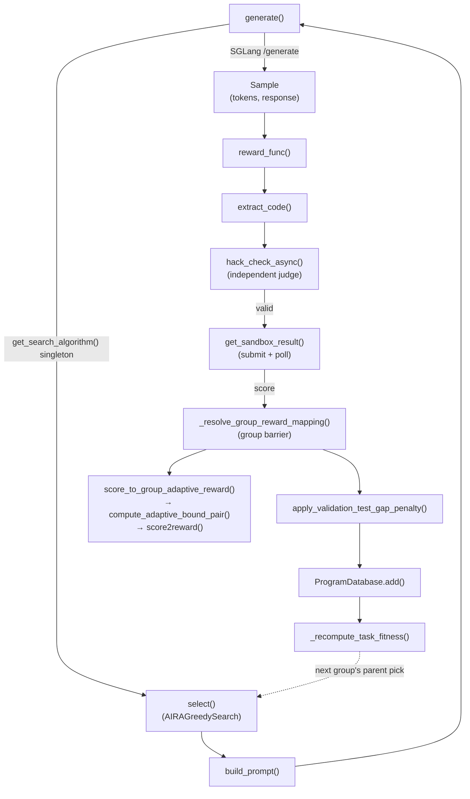

# The RL rollout — operator-conditioned generation and reward computation

<!-- connect:up:begin -->
> **Cross-repo concept:** part of [closed-loop-experiment-design](../../../concepts/closed-loop-experiment-design.md), [evolutionary-algorithm-discovery](../../../concepts/evolutionary-algorithm-discovery.md), [program-evolution-operators](../../../concepts/program-evolution-operators.md), [verification-independence](../../../concepts/verification-independence.md) across this wiki's repos.
<!-- connect:up:end -->
## Overview
This module is where the paper's abstract loop — pick an operator `a_t`, build context `c_t` from parent
programs and feedback, sample `p_t ~ g_θ(·|τ,a_t,c_t)`, score it with `s_t = R_τ(E(p_t,τ))` — becomes two
concrete async functions that SLIME's rollout engine calls once per sample:
[`generate`](../catalog/OpenMLE-ERL/RL/generate_mle.md#generate) turns an (operator, parent-program) choice
into a sampled program, and [`reward_func`](../catalog/OpenMLE-ERL/RL/generate_mle.md#reward_func) executes
that program in a remote sandbox and turns the result into a training reward. The two functions never call
each other directly — they are stitched together only through shared, process-global state: a
[`ProgramDatabase`](../catalog/OpenMLE-ERL/RL/program_database.md#ProgramDatabase) (what `generate` reads
parents from, what `reward_func` writes results to) and a handful of in-memory caches keyed by
`group_index` that let the `n_samples_per_prompt` completions of one rollout group share a single parent
choice and a single reward calibration. The file's central, non-obvious idea is that **a sample's reward
cannot be computed alone** — it depends on the score distribution of the whole rollout group and the task's
history — so `reward_func` defers the score→reward mapping through a group-level barrier
([`_resolve_group_reward_mapping`](../catalog/OpenMLE-ERL/RL/generate_mle.md#_resolve_group_reward_mapping))
before it ever touches the program database.

## Diagram

## Design rationale (why it's built this way)
**Reward mapping is deferred, not computed per-sample, because the paper's adaptive bound is a group/task
property, not a sample property.** When `reward_func` gets a sandbox score back it does *not* immediately
map it to a reward; it stores `base_reward = 0.0` as a placeholder and logs "deferring score2reward until
group-level adaptive bound is resolved," then calls
[`_resolve_group_reward_mapping`](../catalog/OpenMLE-ERL/RL/generate_mle.md#_resolve_group_reward_mapping).
That function computes `[best_signed, worst_signed]` from
[`get_program_database`](../catalog/OpenMLE-ERL/RL/generate_mle.md#get_program_database)'s historical
per-task scores plus the *current* rollout group's scores via
[`compute_adaptive_bound_pair`](../catalog/OpenMLE-ERL/RL/adaptive_reward_advantage_utils.md#compute_adaptive_bound_pair)
(modes: top-1-vs-top-8/top-16/mean/median of the observed score frontier, selected by
[`ADAPTIVE_REWARD_BOUND_MODE`](../catalog/OpenMLE-ERL/RL/generate_mle.md#ADAPTIVE_REWARD_BOUND_MODE)) — this
is the paper's "reward bounds derived from the task's historical on-policy score frontier" mechanism, and it
is why a single sample's reward can only be finalized after enough of the group has reported its score.

**A synchronization barrier, not a queue, is the mechanism for group-relative rewards.** Because
`n_samples_per_prompt` samples in one group execute as independent coroutines (independent sandbox calls,
unpredictable completion order), `_resolve_group_reward_mapping` implements a manual barrier: each arriving
coroutine registers its score under a `sample_key` in a shared dict guarded by a dedicated per-task-key
`asyncio.Lock` obtained from an internal lock registry (`_get_dynamic_bound_task_lock`, keyed by task, not in
this packet's subgraph), and only the coroutine whose arrival makes `seen_count >= expected_count` actually
computes the shared bound and resolves every other member's `asyncio.Future` — everyone else just `await`s
their own future.
[`_get_loop_lock`](../catalog/OpenMLE-ERL/RL/generate_mle.md#_get_loop_lock) is *not* the lock held while the
barrier's shared dict is read and written — it is only used, once, under the fixed name
`"dynamic_score_bound_registry"`, to guard the lazy creation of that per-task lock inside the registry. This
buys embarrassingly-parallel sandbox execution while still guaranteeing every sample in a group is scored
against the *same* bound.

**Verification runs before the expensive step, not after.** `reward_func` calls
[`hack_check_async`](../catalog/OpenMLE-ERL/RL/reward_func_utils.md#hack_check_async) — an independent judge
model, not the policy being trained — before it ever calls
[`get_sandbox_result`](../catalog/OpenMLE-ERL/RL/reward_func_utils.md#get_sandbox_result). The docstring
frames it as "async concurrent hack_check for rollout," capped by a semaphore inside
[`_get_async_hack_check_runtime`](../catalog/OpenMLE-ERL/RL/reward_func_utils.md#_get_async_hack_check_runtime).
Ordering it first means a program that fabricates a validation-score print (rather than genuinely computing
one) never reaches the sandbox at all — cheaper, and it keeps the party that decides "this score is real"
structurally separate from the party that produced the score.

**Reward shaping is operator-aware, and grounded in the parent's reward, not just the child's.** For
`improve`/`debug`/`crossover` samples, the code compares the child's `effective_base_reward` against the
parent's *base* reward (preferring
[`_get_program_reward_views`](../catalog/OpenMLE-ERL/RL/generate_mle.md#_get_program_reward_views)'s
`dynamic_base_reward` over the raw `reward`), and adds an improvement bonus proportional to the positive
delta — so an `improve` sample that reaches the same absolute score as a `draft` sample is not rewarded the
same; the training signal is shaped to reward *genuine improvement over what was already known*, matching
the paper's context-conditioning on parent programs plus execution feedback rather than a single global
target score. (Read directly from the `compute_mode_rewards` function in the same file; that function itself
is outside this packet's subgraph, so this claim is grounded via the
[`reward`](../catalog/OpenMLE-ERL/RL/program_database.md#Program.reward),
[`code`](../catalog/OpenMLE-ERL/RL/program_database.md#Program.code), and
[`parent_id`](../catalog/OpenMLE-ERL/RL/program_database.md#Program.parent_id) fields it reads off `Program`
and `sample.metadata`.)

**Fitness for the next round's parent choice is a full task-level recompute, not an incremental update.**
[`add`](../catalog/OpenMLE-ERL/RL/program_database.md#ProgramDatabase.add) calls
[`_recompute_task_fitness`](../catalog/OpenMLE-ERL/RL/program_database.md#ProgramDatabase._recompute_task_fitness)
on every insertion, which re-derives all three fitness terms for *every* program under that task (not just
the new one): an exploit term (the program's own `base_reward`), an explore term (the sample variance of its
children's `base_reward` once it has ≥2 children; exactly `0.0` for a program with a single child; `None` —
which the min-max normalizer maps to a neutral `0.5` — only for a program with zero children), and a cooling
term (`1 − visits/max_visits`, so
heavily-reused parents cool down). Recomputing globally is more expensive than an incremental update but
sidesteps having to reason about which other programs' fitness a single insertion could invalidate — every
new child changes its parent's explore/cooling terms, and a min/max-normalized term can shift for the whole
task when any one value changes.

> [!inferred] The three-term fitness combination (`exploit + explore + cooling`, each independently
> min-max-normalized to `[0,1]` before summing) reads as the paper's "three-term parent-fitness sampling":
> reward-driven exploitation, reward-*variance*-driven exploration (does this program's lineage still teach
> the model something), and visit-count cooling (don't keep re-selecting the same parent). This is inferred
> from the shape of `_recompute_task_fitness`'s computation, not from a paper citation in the code.

## Entry points
- [`generate`](../catalog/OpenMLE-ERL/RL/generate_mle.md#generate) — called once per sample by the rollout
  engine before any tokens are produced. Docstring: "Single-turn generation with draft/improve mode support
  ... Samples with the same group_index share the same parent selection result." It resolves the
  process-global [`get_program_database`](../catalog/OpenMLE-ERL/RL/generate_mle.md#get_program_database)
  and [`get_search_algorithm`](../catalog/OpenMLE-ERL/RL/generate_mle.md#get_search_algorithm) singletons,
  drives [`select`](../catalog/OpenMLE-ERL/RL/program_database.md#AIRAGreedySearch.select), and posts the
  built prompt to the SGLang router.
- [`reward_func`](../catalog/OpenMLE-ERL/RL/generate_mle.md#reward_func) — called once per sample after
  generation completes, with the raw model response attached to `sample`. Docstring: "For draft mode: reward
  is calculated from score as before. For improve mode: reward is the difference between current reward and
  parent reward." It is the only place a program is written to
  [`ProgramDatabase`](../catalog/OpenMLE-ERL/RL/program_database.md#ProgramDatabase) via
  [`add`](../catalog/OpenMLE-ERL/RL/program_database.md#ProgramDatabase.add), and the only place that calls
  [`log_sample`](../catalog/OpenMLE-ERL/RL/logging_utils.md#TrainingLogger.log_sample).
- [`get_program_database`](../catalog/OpenMLE-ERL/RL/generate_mle.md#get_program_database) /
  [`get_search_algorithm`](../catalog/OpenMLE-ERL/RL/generate_mle.md#get_search_algorithm) — lazily construct
  the module's two process-global singletons the first time either `generate` or `reward_func` needs them.
  Only `get_program_database` (an `async def`) is actually synchronized against concurrent callers — via
  [`_get_loop_lock`](../catalog/OpenMLE-ERL/RL/generate_mle.md#_get_loop_lock)`("database")` guarding a
  double-checked `if _program_database is None:`. `get_search_algorithm` is a plain synchronous function with
  a single, unguarded `if _search_algorithm is None:` check and no lock at all.

## Mechanism (step-by-step)
1. **Operator + parent selection.** [`generate`](../catalog/OpenMLE-ERL/RL/generate_mle.md#generate) fetches
   the database/search-algorithm singletons and calls
   [`select`](../catalog/OpenMLE-ERL/RL/program_database.md#AIRAGreedySearch.select), which samples an
   operator from `draft_prob`/`debug_prob`/(remaining `improve`), then picks a parent —
   [`_best_scored_parent`](../catalog/OpenMLE-ERL/RL/program_database.md#AIRAGreedySearch._best_scored_parent)
   (highest-fitness program with positive reward) for `improve`, a random non-positive-reward program for
   `debug`. If the chosen operator has no eligible parent, `select` falls back along a fixed chain
   (`improve→debug→draft`, `debug→improve→draft`) instead of stalling. A group cache keyed by
   `group_index` (guarded by [`_get_loop_lock`](../catalog/OpenMLE-ERL/RL/generate_mle.md#_get_loop_lock))
   means only the *first* of the group's `n_samples_per_prompt` calls actually invokes `select`; the rest
   read the cached `(prompt, parent_program, mode)` tuple, so one rollout group always trains on one
   consistent operator/parent choice.
2. **Prompt construction.** `select` hands the operator and parent to
   [`build_prompt`](../catalog/OpenMLE-ERL/RL/prompt_builder.md#build_prompt), whose docstring is "Build
   prompt based on mode." — it dispatches to draft/improve/debug/crossover template builders, raising if
   `improve`/`debug` is missing a parent or `crossover` is missing either parent.
   [`_safe_text`](../catalog/OpenMLE-ERL/RL/prompt_builder.md#_safe_text) normalizes optional text fields
   (parent code, task description) fed into those templates.
3. **Sampling.** [`generate`](../catalog/OpenMLE-ERL/RL/generate_mle.md#generate) posts the rendered prompt to
   SGLang's `/generate` endpoint and fills in the
   returned `Sample`'s tokens, `loss_mask`, and log-probs. An `abort` finish reason during evaluation is
   retried up to a bounded count; during training it is instead let through so
   `reward_func` still runs and the group barrier below isn't starved of a member — this is the file's own
   comment: returning early here would leave the other group members "wait forever ... and permanently
   occupy an active_tasks slot."
4. **Verification before execution.** [`reward_func`](../catalog/OpenMLE-ERL/RL/generate_mle.md#reward_func)
   pulls code out of the raw response with
   [`extract_code`](../catalog/OpenMLE-ERL/RL/reward_func_utils.md#extract_code) ("Extract python code blocks
   from the text"), then — for non-empty code — runs
   [`hack_check_async`](../catalog/OpenMLE-ERL/RL/reward_func_utils.md#hack_check_async) *before* any sandbox
   call. This is the verification-independence gate: an independent judge model checks for score-faking
   before the (much more expensive) execution step is ever reached.
5. **Execution.** Code that passes verification is run by
   [`get_sandbox_result`](../catalog/OpenMLE-ERL/RL/reward_func_utils.md#get_sandbox_result), which submits a
   job and polls its status (`poll_interval` seconds apart, up to `wait_timeout`) rather than blocking on a
   single synchronous call — this is the step whose latency dominates the whole rollout, since it waits on
   remote GPU/CPU program execution rather than token generation.
6. **Group-adaptive score→reward mapping.** The raw `score` from the sandbox is not turned into a reward
   directly; [`_resolve_group_reward_mapping`](../catalog/OpenMLE-ERL/RL/generate_mle.md#_resolve_group_reward_mapping)
   gathers the group's scores plus [`get_program_database`](../catalog/OpenMLE-ERL/RL/generate_mle.md#get_program_database)'s
   historical scores for the task, computes bounds via
   [`score_to_group_adaptive_reward`](../catalog/OpenMLE-ERL/RL/adaptive_reward_advantage_utils.md#score_to_group_adaptive_reward)
   →
   [`compute_adaptive_bound_pair`](../catalog/OpenMLE-ERL/RL/adaptive_reward_advantage_utils.md#compute_adaptive_bound_pair),
   and maps the score into a reward through
   [`score2reward`](../catalog/OpenMLE-ERL/RL/reward_func_utils.md#score2reward). The resolved bound is also
   recorded via [`_build_adaptive_bound_metadata_context`](../catalog/OpenMLE-ERL/RL/generate_mle.md#_build_adaptive_bound_metadata_context)
   for logging/debugging.
7. **Anti-overfitting penalty.** [`apply_validation_test_gap_penalty`](../catalog/OpenMLE-ERL/RL/reward_func_utils.md#apply_validation_test_gap_penalty)
   ("Penalize positive rewards by validation/test relative gap") shrinks a positive reward when the code's
   self-reported validation score diverges from its actual held-out test score, using
   [`VALIDATION_TEST_GAP_PENALTY_COEF`](../catalog/OpenMLE-ERL/RL/reward_func_utils.md#VALIDATION_TEST_GAP_PENALTY_COEF),
   [`VALIDATION_TEST_GAP_PENALTY_HIGH_COEF`](../catalog/OpenMLE-ERL/RL/reward_func_utils.md#VALIDATION_TEST_GAP_PENALTY_HIGH_COEF),
   and [`VALIDATION_TEST_GAP_PENALTY_TOLERANCE`](../catalog/OpenMLE-ERL/RL/reward_func_utils.md#VALIDATION_TEST_GAP_PENALTY_TOLERANCE)
   — a second, independent check against a model that games its own reported metric.
8. **A parallel "static" reward view is computed but not trained on.** Alongside the adaptive/dynamic reward,
   `reward_func` also computes a fixed-bound reward via
   [`compute_static_score_reward`](../catalog/OpenMLE-ERL/RL/generate_mle.md#compute_static_score_reward) and
   [`compute_metric_static_base_reward`](../catalog/OpenMLE-ERL/RL/generate_mle.md#compute_metric_static_base_reward),
   both gated by [`has_static_bounds_with_priority`](../catalog/OpenMLE-ERL/RL/reward_func_utils.md#has_static_bounds_with_priority)
   and mapped by [`score2reward_with_static_priority`](../catalog/OpenMLE-ERL/RL/reward_func_utils.md#score2reward_with_static_priority).
   Both views are logged and stored in `Program.metadata`, but only the dynamic view feeds the operator-aware
   shaping in step 9 — the static view exists purely as a comparison baseline.
9. **Task-best frontier bookkeeping.** [`_compute_task_reward_frontier`](../catalog/OpenMLE-ERL/RL/generate_mle.md#_compute_task_reward_frontier)
   scans every prior [`Program`](../catalog/OpenMLE-ERL/RL/program_database.md#Program) for the task (via
   [`get_all`](../catalog/OpenMLE-ERL/RL/program_database.md#ProgramDatabase.get_all)) to record whether this
   sample just set a new best-dynamic/best-static/best-metric-static score for the task, before the current
   sample is itself inserted.
10. **Persisting the result.** A [`Program`](../catalog/OpenMLE-ERL/RL/program_database.md#Program) is built
    from the sandbox outcome and inserted via
    [`add`](../catalog/OpenMLE-ERL/RL/program_database.md#ProgramDatabase.add), which immediately calls
    [`_recompute_task_fitness`](../catalog/OpenMLE-ERL/RL/program_database.md#ProgramDatabase._recompute_task_fitness)
    so the *next* `generate` call for this task sees updated fitness. Only sandbox-successful runs, or
    invalid-but-diagnostically-interesting categories (`hack`, `no_verify`, `hack_verify`), are stored;
    connection failures and empty code are not.
11. **AIRAEvo memory (conditional).** If the process is running the `airaevo` search algorithm,
    [`_maybe_update_airaevo_program_metadata`](../catalog/OpenMLE-ERL/RL/generate_mle.md#_maybe_update_airaevo_program_metadata)
    builds an experience card via [`build_experience_card`](../catalog/OpenMLE-ERL/RL/airaevo_experience.md#build_experience_card)
    and, if rich memory is enabled, asks an LLM to summarize the node versus its parent via
    [`build_airaevo_rich_memory_summary_prompt`](../catalog/OpenMLE-ERL/RL/prompt_builder.md#build_airaevo_rich_memory_summary_prompt)
    — the summary is written back into the stored program's metadata for future prompts to retrieve.
12. **Group-buffered logging.** [`log_sample`](../catalog/OpenMLE-ERL/RL/logging_utils.md#TrainingLogger.log_sample)
    ("Collect sample information and write to CSV when a group is complete") buffers this sample under its
    `group_index` and only flushes a CSV row for the whole group once all `n_samples_per_prompt` members have
    reported — the same "buffer per group, act on the last arrival" pattern as step 6's reward barrier, reused
    for accounting rather than reward computation. `reward_func` returns `final_reward`, the value SLIME's
    trainer actually uses.

## Key data structures
- [`Program`](../catalog/OpenMLE-ERL/RL/program_database.md#Program) — one row per sandbox-evaluated
  candidate: [`code`](../catalog/OpenMLE-ERL/RL/program_database.md#Program.code),
  [`reward`](../catalog/OpenMLE-ERL/RL/program_database.md#Program.reward) (training reward, includes any
  improve bonus), `base_reward` (pre-bonus), `fitness`/`exploit_coefficient`/`explore_coefficient`/
  `cooling_coefficient` (written by `_recompute_task_fitness`),
  [`parent_id`](../catalog/OpenMLE-ERL/RL/program_database.md#Program.parent_id), `generation_mode`
  (`draft`/`improve`/`debug`/`crossover`), and
  [`metadata`](../catalog/OpenMLE-ERL/RL/program_database.md#Program.metadata), which is where every
  dynamic/static reward view, validation-gap diagnostics, and (for airaevo) the experience card all end up.
- [`ProgramDatabase`](../catalog/OpenMLE-ERL/RL/program_database.md#ProgramDatabase) — SQLite-backed, one
  thread-local connection per thread via [`_get_connection`](../catalog/OpenMLE-ERL/RL/program_database.md#ProgramDatabase._get_connection),
  keeping only the top `max_per_task` programs per task by fitness once that limit is set.
- [`MLE_CONFIGS`](../catalog/OpenMLE-ERL/RL/generate_mle.md#MLE_CONFIGS) — a module-level dict, populated once
  at import time from environment variables: operator probabilities (`draft_probability`,
  `improve_probability`, `debug_probability`, `crossover_probability`), `search_algorithm` choice
  (`greedy`/`evo`/`airaevo`), and `sandbox_concurrency` — this file's entire tuning surface is env vars, not
  function arguments.
- `_parent_selection_cache` / `_adaptive_group_reward_cache` — process-global, in-memory dicts (not part of
  the cited subgraph) keyed by `group_index` or `reward_group_id`. The former holds one cached
  `(prompt, parent_program, mode)` tuple per group plus an access counter that self-deletes the entry once
  every group member has read it; the latter holds the barrier state (`asyncio.Future` per waiting sample)
  described in step 6.

## Dynamics (design intent)
[`generate`](../catalog/OpenMLE-ERL/RL/generate_mle.md#generate) and
[`reward_func`](../catalog/OpenMLE-ERL/RL/generate_mle.md#reward_func) are both `async def` and are invoked
independently, once per sample, by a rollout engine outside this packet's subgraph — many samples' sandbox
calls are in flight concurrently. All shared mutable state in this file is therefore guarded by
per-event-loop primitives obtained through
[`_get_loop_lock`](../catalog/OpenMLE-ERL/RL/generate_mle.md#_get_loop_lock) rather than plain module-level
`asyncio.Lock()` instances — a comment at the top of the file explains why: "SLIME uses separate loops for
train rollout and eval rollout in the same process, so keep these primitives loop-local." The group barrier
in [`_resolve_group_reward_mapping`](../catalog/OpenMLE-ERL/RL/generate_mle.md#_resolve_group_reward_mapping)
is the sharpest expression of this: it is explicitly built to tolerate the sandbox calls for one rollout
group finishing in any order, converging every member on one shared reward bound only once the last one
reports in. [`get_sandbox_result`](../catalog/OpenMLE-ERL/RL/reward_func_utils.md#get_sandbox_result)'s own
submit-then-poll loop is written the same way — it never blocks the event loop on the sandbox job, it
re-polls on an interval and lets other coroutines run in between — consistent with an architecture whose
throughput bottleneck is program execution wall-clock time, not token sampling.

> [!inferred] The actual decoupling of "how fast samples get generated" from "how fast the trainer consumes
> completed groups" (the paper's asynchronous-rollout description) appears to live in a sibling module
> (`fully_async_rollout.py`, which imports SLIME's `generate_and_rm_group` and runs it from a queue-backed
> worker thread) that is not part of this packet's subgraph — this file supplies the `generate`/`reward_func`
> pair that worker calls per sample, but the queue/worker orchestration itself isn't grounded here.

## Edge cases
- **Aborted generation must not starve the group barrier.** If SGLang reports `finish_reason == "abort"`
  during training (not eval), `generate` does *not* return early with an empty sample — it still emits a
  `Sample` so `reward_func` runs and calls
  [`_resolve_group_reward_mapping`](../catalog/OpenMLE-ERL/RL/generate_mle.md#_resolve_group_reward_mapping)
  with `score=None`, `base_reward=-1.0`, precisely so the other `n_samples_per_prompt - 1` group members
  waiting on their `asyncio.Future` are still released.
- **Invalid code still needs a reward mapping call.** `empty`/`no_verify`/`hack`/`hack_verify` code
  categories skip the sandbox entirely and use a fixed negative reward (`-1`, `-0.5`, `-0.5`, `-0.5`
  respectively), but the code still calls `_resolve_group_reward_mapping` for these samples afterward — the
  group barrier is never skipped just because a sample failed verification.
- **No eligible parent for the sampled operator.** [`_best_scored_parent`](../catalog/OpenMLE-ERL/RL/program_database.md#AIRAGreedySearch._best_scored_parent)
  requires `reward > 0`; if none exists yet for a task (e.g. before any success), `improve` falls back to
  `debug`, and if *that* also has no candidate, falls back to `draft` — `select` never raises for a
  currently-unsatisfiable operator.
- **A duplicate `sample_key` arriving at the barrier reuses the existing waiter** rather than creating a
  second one — logged as a warning; this can happen on retried samples within the same group.
- **`should_store_program` deliberately excludes connection/runtime failures and empty code** from the
  database even though `reward_func` still computes a reward and logs a sample for them — so
  `ProgramDatabase` only ever holds programs a future `select` call could plausibly want as a parent or
  debug target.

## Open questions
- The **entropic-advantage transform** the paper describes (an exponential-tilt group-advantage
  transform) is implemented as `compute_ttt_entropic_advantages`/`_solve_entropic_beta` in the *same file* as
  [`compute_adaptive_bound_pair`](../catalog/OpenMLE-ERL/RL/adaptive_reward_advantage_utils.md#compute_adaptive_bound_pair)
  (`adaptive_reward_advantage_utils.py`), but neither symbol is in this packet's subgraph, and reading the
  source directly shows it is called only from `ttt_reward_postprocess.py`, not from `generate` or
  `reward_func`. This packet's file computes the *reward* each sample gets; the entropic-advantage transform
  that turns a group's rewards into training advantages is a separate, later stage this page cannot ground.
- `get_search_algorithm` can also construct `AIRAEvoSearch` or `AIRAInferenceEvoSearch` (selected by
  `MLE_CONFIGS["search_algorithm"]`, default `"evo"` per the code, not `"greedy"`), but neither class's
  `select` is in this packet's subgraph — only
  [`AIRAGreedySearch.select`](../catalog/OpenMLE-ERL/RL/program_database.md#AIRAGreedySearch.select) is cited
  here, so the parent-selection mechanism described in this page is the `greedy` algorithm specifically, not
  necessarily what a default `evo`/`airaevo` run uses.
- The queue/worker layer that actually schedules concurrent `generate`/`reward_func` calls across many
  samples (referenced in Dynamics as `fully_async_rollout.py`) is outside this packet's subgraph, so this
  page cannot cite how "the trainer consumes completed groups from a queue" is implemented, only that this
  file's functions are shaped (async, lock-per-loop, poll-don't-block) to be called that way.

## See also
- [`OpenMLE-ERL-RL-program_database.md`](OpenMLE-ERL-RL-program_database.md) — the `ProgramDatabase` and
  search-algorithm classes this page's `select`/`add`/`_recompute_task_fitness` calls live in.
- [`OpenMLE-ERL-RL-reward_func_utils.md`](OpenMLE-ERL-RL-reward_func_utils.md) — `score2reward`,
  `hack_check_async`, `get_sandbox_result`, and the validation-gap penalty this page's reward pipeline is
  built from.
- [`../../../concepts/program-evolution-operators.md`](../../../concepts/program-evolution-operators.md) —
  the cross-repo Draft/Improve/Debug/Crossover vocabulary this file's `generation_mode` implements.
- [`../../../concepts/verification-independence.md`](../../../concepts/verification-independence.md) — the
  `hack_check_async` judge-before-sandbox pattern is this repo's instance of that concept.
- [`../../../concepts/evolutionary-algorithm-discovery.md`](../../../concepts/evolutionary-algorithm-discovery.md) —
  the population-database-plus-LLM-mutation paradigm `ProgramDatabase`/`select` instantiate here.
- [`../../../sources/frontis-ma1.md`](../../../sources/frontis-ma1.md) — the paper this repo implements;
  §4 (OpenMLE-ERL) describes the operator-conditioned policy, adaptive reward bounds, entropic advantage, and
  asynchronous rollouts this page grounds against code.
