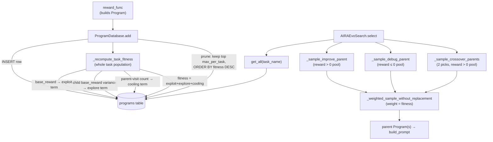

# Program database — three-term fitness and operator-conditioned parent sampling

<!-- connect:up:begin -->
> **Cross-repo concept:** part of [evolutionary-algorithm-discovery](../../../concepts/evolutionary-algorithm-discovery.md), [program-evolution-operators](../../../concepts/program-evolution-operators.md) across this wiki's repos.
<!-- connect:up:end -->
## Overview
[`ProgramDatabase`](../catalog/OpenMLE-ERL/RL/program_database.md#ProgramDatabase) is the RL rollout loop's
single source of truth for every program the sandbox has scored for a task — a SQLite-backed table of
[`Program`](../catalog/OpenMLE-ERL/RL/program_database.md#Program) rows. Its job is deciding which of those
programs get to be tomorrow's parents: `Draft` needs no parent, but `Improve`/`Debug`/`Crossover` all do, and
neither "always the best" (kills diversity) nor "uniform" (wastes rollout budget on exhausted regions) is a
good answer. So [`add`](../catalog/OpenMLE-ERL/RL/program_database.md#ProgramDatabase.add) recomputes, after
every insertion and across the *whole* task population, a three-term fitness —
[`_recompute_task_fitness`](../catalog/OpenMLE-ERL/RL/program_database.md#ProgramDatabase._recompute_task_fitness) —
that blends how good a program is, how much its children still disagree about it, and how recently it has
been leaned on as a parent. The persisted [`fitness`](../catalog/OpenMLE-ERL/RL/program_database.md#Program.fitness)
field this produces is what the `AIRAEvoSearch` variant of
[`select`](../catalog/OpenMLE-ERL/RL/program_database.md#AIRAEvoSearch.select) samples from when it needs a
parent for a non-`Draft` operator.

## Diagram

## Design rationale (why it's built this way)
**Three unweighted, independently-normalized terms, summed.**
[`_recompute_task_fitness`](../catalog/OpenMLE-ERL/RL/program_database.md#ProgramDatabase._recompute_task_fitness)
computes exploit, explore, and cooling as three separate [0,1] components and adds them —
`fitness = exploit_coefficient + explore_coefficient + cooling_coefficient` — with no learned or
configurable weights. That's a deliberate contrast with the *other* multi-term selector living in the same
codebase: [`compute_parent_utilities`](../catalog/OpenMLE-ERL/RL/airaevo_experience.md#compute_parent_utilities)
(quality/progress/novelty, each with a tunable weight, combined via softmax at a temperature) is what the
`AIRAInferenceEvoSearch` variant of
[`select`](../catalog/OpenMLE-ERL/RL/program_database.md#AIRAInferenceEvoSearch.select) calls through
[`_sample_by_utility`](../catalog/OpenMLE-ERL/RL/program_database.md#AIRAInferenceEvoSearch._sample_by_utility)
when [`policy`](../catalog/OpenMLE-ERL/RL/program_database.md#AIRAInferenceEvoSearch.policy) is set to the
OpenMLE-Evo-style scheme. `Program.fitness` is the simpler of the two: a fixed, unweighted sum used directly
as a non-negative sampling weight, not a softmax distribution.

**Normalization is population-relative and recomputed on every insert, not cached against a fixed scale.**
Because [`_recompute_task_fitness`](../catalog/OpenMLE-ERL/RL/program_database.md#ProgramDatabase._recompute_task_fitness)
re-reads every row for the task and min-max-normalizes across whatever is currently stored, a program's
`fitness` is a moving target: inserting one new program can shift every other program's exploit/explore/
cooling numbers in the same transaction, since the recompute always runs over the full
`SELECT * FROM programs WHERE task_name = ?` result before [`add`](../catalog/OpenMLE-ERL/RL/program_database.md#ProgramDatabase.add)
commits.

**A no-children program and a one-child, zero-variance program are deliberately not the same.** The explore
term comes from the variance of a program's children's `base_reward` values, but
[`_recompute_task_fitness`](../catalog/OpenMLE-ERL/RL/program_database.md#ProgramDatabase._recompute_task_fitness)
leaves this `None` when a program has zero linked children, and only sets it to `0.0` once there is exactly
one child (a real, if degenerate, variance). The normalizer treats `None` as neutral (0.5) rather than
folding it into the same min/max range as a genuine zero — so "nobody has tried building on this yet" and
"one attempt built on this and landed exactly where the parent did" don't collapse into the same signal at
either extreme.

**Cooling is normalized twice, which converts it from an absolute count into a population-relative rank.**
The raw cooling value is `1 - visits/max_visits` (visits being how many stored children currently link back
to a program as parent, via `parent_id` or a crossover parent list in `metadata`) — already bounded to
[0,1] — but [`_recompute_task_fitness`](../catalog/OpenMLE-ERL/RL/program_database.md#ProgramDatabase._recompute_task_fitness)
then min-max-normalizes *that* value again across the task. The second pass means the least-visited program
in the task always gets `cooling_coefficient` near 1 and the most-visited always gets it near 0, regardless
of whether the population's actual visit counts top out at 5 or 500 — cooling measures relative staleness,
not an absolute decay curve.

**Eviction is keyed on `fitness`, not the reward the docstring names.**
[`add`](../catalog/OpenMLE-ERL/RL/program_database.md#ProgramDatabase.add)'s own doc says "Add a program to
the database, maintaining top k per task by reward," but the prune step inside it deletes everything not in
`SELECT id FROM programs WHERE task_name = ? ORDER BY fitness DESC LIMIT ?`. That distinction is exactly
what keeps the retained population usable for `AIRAEvoSearch`: pruning by raw reward would eventually leave
only near-duplicates of the current best; pruning by the three-term `fitness` protects programs that are
merely still-informative or under-visited, even if their reward is not the highest in the task.

**A hard reward-sign gate decides *which* pool a parent comes from; `fitness` only decides *who within it*.**
[`_sample_improve_parent`](../catalog/OpenMLE-ERL/RL/program_database.md#AIRAEvoSearch._sample_improve_parent)
and [`_sample_crossover_parents`](../catalog/OpenMLE-ERL/RL/program_database.md#AIRAEvoSearch._sample_crossover_parents)
restrict candidates to `reward > 0`, while
[`_sample_debug_parent`](../catalog/OpenMLE-ERL/RL/program_database.md#AIRAEvoSearch._sample_debug_parent)
restricts to `reward ≤ 0` — and that field is `Program`'s
[`reward`](../catalog/OpenMLE-ERL/RL/program_database.md#Program.reward), the *final*, possibly
operator-shaped training reward the [`reward_func`](../catalog/OpenMLE-ERL/RL/generate_mle.md#reward_func)
attaches to the `Program` it builds — not the `base_reward` that feeds the exploit term inside `fitness`.
So "did this count as a success worth building on" (the pool gate, on shaped `reward`) and "how attractive is
it relative to its peers" (the sampling weight, on `fitness`, itself derived from unshaped `base_reward`)
are deliberately measured on two different views of the same evaluated program.

> [!inferred] This file hosts two independently-designed parent-selection mechanisms side by side, selected
> by a config value: `AIRAEvoSearch` (the persisted, population-normalized `fitness` this page centers on)
> and `AIRAInferenceEvoSearch` (which reuses
> [`compute_parent_utilities`](../catalog/OpenMLE-ERL/RL/airaevo_experience.md#compute_parent_utilities) and
> [`is_success_program`](../catalog/OpenMLE-ERL/RL/airaevo_experience.md#is_success_program) from the same
> `airaevo_experience` helper module that OpenMLE-Evo's own inference-time search is built on). Because both
> live in the RL rollout path, the RL trainer can be configured to generate its on-policy rollouts using the
> *same* experience-driven selection distribution the model will face at inference — the code doesn't say
> this is the intent, but it is the natural reading of why an inference-time selection scheme was ported into
> the training-time database module rather than kept separate.

## Entry points
- [`add`](../catalog/OpenMLE-ERL/RL/program_database.md#ProgramDatabase.add) — the write path. Called from
  [`reward_func`](../catalog/OpenMLE-ERL/RL/generate_mle.md#reward_func) once a sandbox-scored
  [`Program`](../catalog/OpenMLE-ERL/RL/program_database.md#Program) is built; this is the only place
  `fitness` gets (re)computed and the only place the per-task population gets pruned.
- [`select`](../catalog/OpenMLE-ERL/RL/program_database.md#AIRAEvoSearch.select) on `AIRAEvoSearch` — the
  read path this page is about: buckets the task's programs by
  [`reward`](../catalog/OpenMLE-ERL/RL/program_database.md#Program.reward) sign, then samples a parent (or
  two, for crossover) weighted by [`fitness`](../catalog/OpenMLE-ERL/RL/program_database.md#Program.fitness).
- [`sample_by_fitness`](../catalog/OpenMLE-ERL/RL/program_database.md#ProgramDatabase.sample_by_fitness) — a
  general-purpose direct entry point on `ProgramDatabase` itself for fitness-weighted sampling without going
  through a `SearchAlgorithm` at all; it draws `sample_size` programs without replacement using the same
  "clamp weight at 0, fall back to uniform if the pool sums to 0" pattern as `AIRAEvoSearch`.
- [`select`](../catalog/OpenMLE-ERL/RL/program_database.md#AIRAInferenceEvoSearch.select) on
  `AIRAInferenceEvoSearch` — the alternate entry point for the same rollout-generation call site, active
  when [`policy`](../catalog/OpenMLE-ERL/RL/program_database.md#AIRAInferenceEvoSearch.policy) selects the
  OpenMLE-Evo-style scheme instead; it never reads `Program.fitness` at all, computing its own utility via
  [`_active_success_programs`](../catalog/OpenMLE-ERL/RL/program_database.md#AIRAInferenceEvoSearch._active_success_programs)
  and [`_sample_by_utility`](../catalog/OpenMLE-ERL/RL/program_database.md#AIRAInferenceEvoSearch._sample_by_utility).
- [`select`](../catalog/OpenMLE-ERL/RL/program_database.md#AIRAGreedySearch.select) on `AIRAGreedySearch` and
  [`select`](../catalog/OpenMLE-ERL/RL/program_database.md#GreedySearch.select) on `GreedySearch` — the two
  simplest configurations, which ignore the three-term `fitness` entirely and pick a parent by
  [`_best_scored_parent`](../catalog/OpenMLE-ERL/RL/program_database.md#AIRAGreedySearch._best_scored_parent)
  (max over `fitness`, so `fitness` is read but never sampled from) or by
  [`_select_parent`](../catalog/OpenMLE-ERL/RL/program_database.md#GreedySearch._select_parent) (a raw SQL
  `ORDER BY reward DESC LIMIT 1`, bypassing `fitness` altogether).

## Mechanism (step-by-step)
1. **A program is scored and handed to the database.**
   [`reward_func`](../catalog/OpenMLE-ERL/RL/generate_mle.md#reward_func) constructs a
   [`Program`](../catalog/OpenMLE-ERL/RL/program_database.md#Program) after the sandbox returns, setting
   [`reward`](../catalog/OpenMLE-ERL/RL/program_database.md#Program.reward) to the final training reward
   (which may include an operator-specific shaping bonus) and `base_reward` to the pre-shaping value, then
   calls [`add`](../catalog/OpenMLE-ERL/RL/program_database.md#ProgramDatabase.add) — but only for programs
   that executed cleanly or were explicitly flagged for analysis; connection failures and empty code are
   skipped and never enter the population at all.
2. **Insertion, then an immediate whole-task recompute.**
   [`add`](../catalog/OpenMLE-ERL/RL/program_database.md#ProgramDatabase.add) inserts the row (with
   [`code`](../catalog/OpenMLE-ERL/RL/program_database.md#Program.code),
   [`payload`](../catalog/OpenMLE-ERL/RL/program_database.md#Program.payload),
   [`status_code`](../catalog/OpenMLE-ERL/RL/program_database.md#Program.status_code) and friends coerced to
   SQLite-safe values), then immediately calls
   [`_recompute_task_fitness`](../catalog/OpenMLE-ERL/RL/program_database.md#ProgramDatabase._recompute_task_fitness)
   for the whole task, not just the new row — every program's `fitness` is recomputed together every time,
   because the min-max normalization each term uses is only meaningful relative to the current population.
3. **Exploit term.** Within `_recompute_task_fitness`, each program's own `base_reward` is min-max-normalized
   across the task's current rows into `exploit_coefficient` — the "is this a good program" component of
   `fitness`, computed from the pre-shaping reward rather than the training-time `reward` that
   [`reward_func`](../catalog/OpenMLE-ERL/RL/generate_mle.md#reward_func) attaches.
4. **Explore term.** The same pass links every program to its children — via
   [`parent_id`](../catalog/OpenMLE-ERL/RL/program_database.md#Program.parent_id) for `Improve`/`Debug`, or
   via a crossover-parent list carried in
   [`metadata`](../catalog/OpenMLE-ERL/RL/program_database.md#Program.metadata) for `Crossover` — and takes
   the variance of those children's `base_reward` values, normalized into `explore_coefficient`: high when a
   program's descendants still disagree about how good that branch is, i.e. the region is still
   "informative" to sample from again.
5. **Cooling term.** The same [`_recompute_task_fitness`](../catalog/OpenMLE-ERL/RL/program_database.md#ProgramDatabase._recompute_task_fitness)
   pass counts, for each program, how many times it is the linked parent of
   another row (the "visit count"), turns that into `1 - count/max_count`, and normalizes it a second time
   into `cooling_coefficient` — high for programs that haven't been leaned on as a parent recently, low for
   the current incumbent that keeps getting picked.
6. **Sum, persist, prune.** `fitness = exploit_coefficient + explore_coefficient + cooling_coefficient` is
   written back for every row in one pass of `UPDATE` statements inside
   [`_recompute_task_fitness`](../catalog/OpenMLE-ERL/RL/program_database.md#ProgramDatabase._recompute_task_fitness).
   Back in [`add`](../catalog/OpenMLE-ERL/RL/program_database.md#ProgramDatabase.add), once the row count for
   the task exceeds `max_per_task`, the database deletes every row *not* in the top-`max_per_task` by that
   same `fitness`, so eviction and the sampling weight downstream are governed by the identical score.
7. **Reading the population back for parent sampling.** When `AIRAEvoSearch`'s
   [`select`](../catalog/OpenMLE-ERL/RL/program_database.md#AIRAEvoSearch.select) runs, it
   calls [`get_all`](../catalog/OpenMLE-ERL/RL/program_database.md#ProgramDatabase.get_all) to fetch every
   surviving program for the task, then splits it by
   [`reward`](../catalog/OpenMLE-ERL/RL/program_database.md#Program.reward) sign into an improve/crossover
   pool (`reward > 0`, via
   [`_sample_improve_parent`](../catalog/OpenMLE-ERL/RL/program_database.md#AIRAEvoSearch._sample_improve_parent)
   and [`_sample_crossover_parents`](../catalog/OpenMLE-ERL/RL/program_database.md#AIRAEvoSearch._sample_crossover_parents))
   and a debug pool (`reward ≤ 0`, via
   [`_sample_debug_parent`](../catalog/OpenMLE-ERL/RL/program_database.md#AIRAEvoSearch._sample_debug_parent)).
8. **Weighted draw, without replacement.** Each of those three samplers hands its candidate pool to
   [`_weighted_sample_without_replacement`](../catalog/OpenMLE-ERL/RL/program_database.md#AIRAEvoSearch._weighted_sample_without_replacement),
   which draws `k` programs (2 for crossover, 1 otherwise) using `max(fitness, 0)` as an unnormalized weight,
   re-normalizing the remaining pool after every pick — so a single high-fitness program cannot be drawn
   twice for the two crossover slots, and the weight distribution genuinely shifts as candidates are removed
   rather than being a fixed top-k cut.
9. **Fallback chains keep a rollout from silently stalling.** If the requested operator's pool is empty (e.g.
   no `reward > 0` programs yet for `improve`), `AIRAEvoSearch`'s
   [`select`](../catalog/OpenMLE-ERL/RL/program_database.md#AIRAEvoSearch.select) falls back along a fixed
   chain (`improve → debug → draft`, `crossover → improve → debug → draft`, `debug → improve → draft`)
   rather than returning no prompt at all.
10. **Whichever parent(s) were chosen feed prompt construction.** The selected parent(s) are handed to
    [`build_prompt`](../catalog/OpenMLE-ERL/RL/prompt_builder.md#build_prompt) (or, for the
    `AIRAInferenceEvoSearch` policy, to
    [`build_airaevo_prompt`](../catalog/OpenMLE-ERL/RL/prompt_builder.md#build_airaevo_prompt) together with
    memory text assembled by
    [`build_operator_experience_memory`](../catalog/OpenMLE-ERL/RL/airaevo_experience.md#build_operator_experience_memory)) —
    the fitness-driven selection in this page is strictly upstream of what the model actually sees; it only
    decides *which* program(s) anchor the next prompt.

## Key data structures
- [`Program`](../catalog/OpenMLE-ERL/RL/program_database.md#Program) — one dataclass row per scored attempt.
  The fields this mechanism reads or writes:
  [`id`](../catalog/OpenMLE-ERL/RL/program_database.md#Program.id),
  [`task_name`](../catalog/OpenMLE-ERL/RL/program_database.md#Program.task_name),
  [`reward`](../catalog/OpenMLE-ERL/RL/program_database.md#Program.reward) (final/shaped, used for pool
  membership), `base_reward` (pre-shaping, feeds the exploit term), the derived
  [`fitness`](../catalog/OpenMLE-ERL/RL/program_database.md#Program.fitness) plus its three named components
  (`exploit_coefficient`, `explore_coefficient`, `cooling_coefficient`), `visit_count` and
  `child_base_reward_variance` (the raw inputs behind cooling/explore),
  [`parent_id`](../catalog/OpenMLE-ERL/RL/program_database.md#Program.parent_id) and
  [`metadata`](../catalog/OpenMLE-ERL/RL/program_database.md#Program.metadata) (crossover parents live here,
  not in `parent_id`), plus
  [`code`](../catalog/OpenMLE-ERL/RL/program_database.md#Program.code),
  [`payload`](../catalog/OpenMLE-ERL/RL/program_database.md#Program.payload),
  [`score`](../catalog/OpenMLE-ERL/RL/program_database.md#Program.score) and
  [`status_code`](../catalog/OpenMLE-ERL/RL/program_database.md#Program.status_code) carried along for
  prompt-building and logging.
  [`to_dict`](../catalog/OpenMLE-ERL/RL/program_database.md#Program.to_dict) is the serialization boundary
  into the SQLite row.
- The `programs` SQLite table, one row per `Program`, indexed on `(task_name, fitness DESC)` among others —
  the index that makes the top-k prune inside
  [`add`](../catalog/OpenMLE-ERL/RL/program_database.md#ProgramDatabase.add) and fitness-weighted reads cheap.
- A thread-local SQLite connection returned by
  [`_get_connection`](../catalog/OpenMLE-ERL/RL/program_database.md#ProgramDatabase._get_connection), plus a
  module-level [`logger`](../catalog/OpenMLE-ERL/RL/program_database.md#logger) that
  `_weighted_sample_without_replacement` uses to record, per draw, the id/fitness/probability of the top-5
  candidates — the only built-in observability into which parent actually got picked and how close the
  alternatives were.

## Dynamics (design intent)
[`ProgramDatabase`](../catalog/OpenMLE-ERL/RL/program_database.md#ProgramDatabase) is written for one process
with many threads sharing one `db_path`: writer methods
([`add`](../catalog/OpenMLE-ERL/RL/program_database.md#ProgramDatabase.add), and metadata/clear/snapshot
methods outside this packet's subgraph) take a class-level lock before touching the connection, so two
threads can never interleave an `add`'s insert-recompute-prune sequence. Read methods —
[`get_all`](../catalog/OpenMLE-ERL/RL/program_database.md#ProgramDatabase.get_all) and
[`get_by_id`](../catalog/OpenMLE-ERL/RL/program_database.md#ProgramDatabase.get_by_id) — do not take that
lock; they only go through
[`_get_connection`](../catalog/OpenMLE-ERL/RL/program_database.md#ProgramDatabase._get_connection), so a
concurrent `select` reading `fitness` values can race an in-flight `add`'s recompute on another thread,
subject to whatever isolation SQLite's default journal mode provides.

> [!inferred] `_get_connection`'s thread-local storage and the write lock are declared as *class* attributes
> on `ProgramDatabase`, not set per-instance in `__init__`. That's invisible as long as the process only ever
> constructs one `ProgramDatabase` (which is how the RL loop uses it), but it means two separate
> `ProgramDatabase` instances pointing at two different `db_path`s, used from the same thread, would silently
> share one connection object — the second instance's first read would return the first instance's database.
> Nothing in this subgraph exercises that path, so it's a latent property of the class rather than an
> observed bug.

No test in the packet's configured test paths references this subgraph (see Evidence), so none of the above
is confirmed by test-observed behavior — it is read directly from `add`,
`_recompute_task_fitness`, `_get_connection`, and the `select` implementations.

## Edge cases
- **`max_per_task <= 0` disables pruning entirely.** The eviction block in
  [`add`](../catalog/OpenMLE-ERL/RL/program_database.md#ProgramDatabase.add) is guarded by
  `self.max_per_task > 0`; with a non-positive limit the task's row count (and the cost of every future
  `_recompute_task_fitness` pass, which re-reads and rewrites every row) grows without bound.
- **A pruned program's orphaned children are silently excluded, not repaired.** If a program with children is
  evicted by the fitness-ordered `DELETE`, its surviving children's
  [`parent_id`](../catalog/OpenMLE-ERL/RL/program_database.md#Program.parent_id) still points at a row that
  no longer exists; the next
  [`_recompute_task_fitness`](../catalog/OpenMLE-ERL/RL/program_database.md#ProgramDatabase._recompute_task_fitness)
  pass simply finds that id absent from `by_id` and drops the link (the child itself is unaffected — its own
  `fitness` only depends on its own `base_reward`, its own children, and its own visit count).
- **Debug candidates can have negative `fitness`-eligible weight.**
  [`_sample_debug_parent`](../catalog/OpenMLE-ERL/RL/program_database.md#AIRAEvoSearch._sample_debug_parent)
  draws from the `reward ≤ 0` pool, but sampling weight still comes from `fitness`
  (`max(fitness, 0)` inside
  [`_weighted_sample_without_replacement`](../catalog/OpenMLE-ERL/RL/program_database.md#AIRAEvoSearch._weighted_sample_without_replacement)) —
  if every candidate in the pool ends up with `fitness <= 0` after normalization, the sampler falls back to a
  uniform draw over that pool rather than raising.
- **Every numeric field is clamped before it ever reaches SQLite.**
  [`_to_sqlite_int`](../catalog/OpenMLE-ERL/RL/program_database.md#ProgramDatabase._to_sqlite_int) and
  [`_to_sqlite_real`](../catalog/OpenMLE-ERL/RL/program_database.md#ProgramDatabase._to_sqlite_real), called
  from inside [`add`](../catalog/OpenMLE-ERL/RL/program_database.md#ProgramDatabase.add), clamp to SQLite's
  int64 range and replace non-finite floats with a signed max — including the `fitness` value inserted before
  the recompute runs, which the code comments describe as "a placeholder value" since
  `_recompute_task_fitness` overwrites it immediately afterward.
- **A `Program` can gain an attribute its dataclass never declared.** The `__post_init__` hook on
  [`Program`](../catalog/OpenMLE-ERL/RL/program_database.md#Program) sets `self.run_log` from
  `metadata["clear_run_log"]` when present — `run_log` is not one of the dataclass's declared fields, is not
  written by [`to_dict`](../catalog/OpenMLE-ERL/RL/program_database.md#Program.to_dict), and is not restored
  by the corresponding `from_dict`, so it only exists on the in-memory object that was just constructed, never
  on one read back from the database.

## Open questions
- Why the three fitness terms are combined by unweighted sum here, while the sibling selector
  ([`compute_parent_utilities`](../catalog/OpenMLE-ERL/RL/airaevo_experience.md#compute_parent_utilities))
  uses named, tunable weights and a temperature-scaled softmax, isn't stated anywhere in this subgraph —
  it may be a deliberate simplicity choice for the base RL policy, or the older of the two designs.
- The double min-max normalization on the cooling term (ratio, then normalized again) makes the *raw*
  visit-count scale irrelevant to the final weight; whether that's an intentional "convert to relative rank"
  choice or an accidental consequence of reusing the same normalization helper as the other two terms is not
  documented.
- `add`'s own docstring ("maintaining top k per task by reward") does not match the `fitness`-ordered eviction
  it implements; nothing in the subgraph indicates whether that's stale documentation from an earlier,
  reward-only version of this database or intentional shorthand.

## See also
- [`program-evolution-operators`](../../../concepts/program-evolution-operators.md) — the Draft/Improve/
  Debug/Crossover vocabulary this database supplies parents for.
- [`evolutionary-algorithm-discovery`](../../../concepts/evolutionary-algorithm-discovery.md) — the broader
  cross-repo pattern (population + fitness-driven parent selection) this page is the OpenMLE-ERL instance of.
- [`../../../sources/frontis-ma1.md`](../../../sources/frontis-ma1.md) — §4.3 (Eq. 3) is the paper source for
  the three-term fitness this page grounds in code; §5.2 (Eq. 4) is the source for the sibling
  `compute_parent_utilities` scheme contrasted above.
