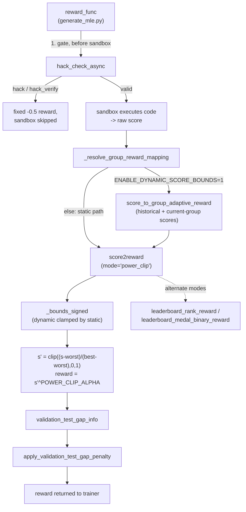

# Reward shaping in OpenMLE-ERL — adaptive score bounds and reward-integrity guards

<!-- connect:up:begin -->
> **Cross-repo concept:** part of [verification-independence](../../../concepts/verification-independence.md) across this wiki's repos.
<!-- connect:up:end -->
## Overview
`reward_func_utils.py` is the score-to-reward shaping layer that sits between OpenMLE-Gym's sandboxed task
execution and the RL trainer's advantage computation in OpenMLE-ERL. It does three distinct jobs, applied in
sequence around every rollout: (1) an independent reward-hacking gate, [`hack_check_async`](../catalog/OpenMLE-ERL/RL/reward_func_utils.md#hack_check_async),
that runs *before* the sandbox even executes, asking an LLM judge whether a candidate program is doing
genuine ML rather than guessing, hard-coding, or faking a metric; (2) the score-to-reward mapping itself,
[`score2reward`](../catalog/OpenMLE-ERL/RL/reward_func_utils.md#score2reward), whose `"power_clip"` mode is
this codebase's implementation of the paper's adaptive-bound reward — a clipped power-law over a
`[worst, best]` interval that, when the adaptive path is enabled, is derived per-task from the policy's own
recent scores rather than fixed leaderboard/theoretical extrema; and (3) a second, independent integrity
check downstream of the score, [`apply_validation_test_gap_penalty`](../catalog/OpenMLE-ERL/RL/reward_func_utils.md#apply_validation_test_gap_penalty),
that discounts reward when a candidate's self-reported validation score doesn't track its held-out test
score. The file is deliberately promiscuous about *how* a raw score becomes a `[0,1]` reward —
[`score2reward`](../catalog/OpenMLE-ERL/RL/reward_func_utils.md#score2reward)'s `mode` argument switches
between six shaping functions — but the two integrity checks are not swappable: they are effectively
always-on guards layered on top of whichever mapping mode is active.

## Diagram

## Design rationale (why it's built this way)
**Adaptive bounds are a one-way ratchet, not a replacement.** [`_bounds_signed`](../catalog/OpenMLE-ERL/RL/reward_func_utils.md#_bounds_signed)
never lets the dynamic (policy-derived) interval *widen* past the static (theoretical/leaderboard) one — it
clamps `dynamic_best = min(dynamic_best, static_best)` and `dynamic_worst = max(dynamic_worst, static_worst)`
before falling back to the static pair entirely if the dynamic side is missing or inverted. That asymmetry is
the actual mechanism behind the paper's claim of deriving "tighter bounds from each task's historical
on-policy score frontier": the frontier can only shrink the reward-mapping interval toward where the policy
currently scores, never expand it beyond the leaderboard/theoretical extremes — so a lucky early outlier
can't blow the bound out and flatten every subsequent reward back toward the collapsed regime the adaptive
mechanism exists to avoid. [`score_to_group_adaptive_reward`](../catalog/OpenMLE-ERL/RL/adaptive_reward_advantage_utils.md#score_to_group_adaptive_reward)
is what supplies that frontier: it takes the task's historical on-policy scores together with the *current*
rollout group's own scores and resolves a `(best_signed, worst_signed)` pair before calling
[`score2reward`](../catalog/OpenMLE-ERL/RL/reward_func_utils.md#score2reward) with them threaded through
`metadata["dynamic_bound_best_signed"/"worst_signed"]`.

> [!inferred] The paper reports the test medal rate rising 24.2±5.7 → 34.8±4.3 on an early-stage harness
> "with adaptive bounds" (see [frontis-ma1](../../../sources/frontis-ma1.md)); this file is the code path
> that produces that mechanism (`power_clip` + the dynamic-bound ratchet above), but the medal-rate number
> itself is a training-run result this static read cannot re-derive or verify.

**Adaptive bounds are opt-in, not the default reward path.** Inside [`_resolve_group_reward_mapping`](../catalog/OpenMLE-ERL/RL/generate_mle.md#_resolve_group_reward_mapping),
the entire adaptive-bound branch — the group-level scoring described below — is gated behind a check that
combines an `ENABLE_DYNAMIC_SCORE_BOUNDS` env flag (default off) with the reward-mapping mode; when that
gate is closed, the function falls straight through to a plain [`score2reward`](../catalog/OpenMLE-ERL/RL/reward_func_utils.md#score2reward)
call with no dynamic bound at all, so `power_clip` silently degrades to a *static*-bounds power-clip unless
the flag is set. A reader tracing "how is the adaptive-bound reward computed" from `reward_func` alone would
not see this fork without opening [`_resolve_group_reward_mapping`](../catalog/OpenMLE-ERL/RL/generate_mle.md#_resolve_group_reward_mapping)
directly.

**A single reward function hides six shaping strategies behind one `mode` string.** [`score2reward`](../catalog/OpenMLE-ERL/RL/reward_func_utils.md#score2reward)
switches on `mode` between `"power_clip"` (the paper's mechanism), `"margin_tanh"` (a `tanh`-shaped margin
around the bound midpoint), `"leaderboard_rank"` / `"leaderboard_medal_binary"` (delegating to
[`leaderboard_rank_reward`](../catalog/OpenMLE-ERL/RL/reward_func_utils.md#leaderboard_rank_reward) /
[`leaderboard_medal_binary_reward`](../catalog/OpenMLE-ERL/RL/reward_func_utils.md#leaderboard_medal_binary_reward)),
`"online_percentile"` (a rolling per-task history), `"linear_sign"` (score returned almost verbatim, with a
hard -100 for near-zero scores), and a legacy default sigmoid used when `mode` matches none of the named
branches. `"power_sigmoid"` is left as a stub that raises `NotImplementedError`, reading as a retired
experiment the authors chose not to delete — a sibling
[`score2reward_with_static_priority`](../catalog/OpenMLE-ERL/RL/reward_func_utils.md#score2reward_with_static_priority)
duplicates the `power_clip`/`margin_tanh` math against [`_preferred_static_bounds_signed`](../catalog/OpenMLE-ERL/RL/reward_func_utils.md#_preferred_static_bounds_signed)
instead of the dynamic-bound-aware [`_bounds_signed`](../catalog/OpenMLE-ERL/RL/reward_func_utils.md#_bounds_signed),
for callers that want a non-adaptive, source-prioritized (`"leaderboard"` vs `"theoretical"`) reward
regardless of which mode the main rollout is using.

**The reward-hacking judge fails open, not closed — except when misconfigured.** [`hack_check_async`](../catalog/OpenMLE-ERL/RL/reward_func_utils.md#hack_check_async)'s
whole body after its two credential checks is wrapped in `try/except Exception`, and every branch inside
that guard — a missing async runtime, an unrecoverable API error, an unparseable judge response via
[`_parse_hack_check_completion`](../catalog/OpenMLE-ERL/RL/reward_func_utils.md#_parse_hack_check_completion) —
returns `(True, "valid", ...)` rather than propagating the failure: a broken judge must never block or crash
RL rollouts, so "I can't tell" degrades to "assume honest." That design choice is visible in the retry policy
too — [`_is_retryable_hack_check_error`](../catalog/OpenMLE-ERL/RL/reward_func_utils.md#_is_retryable_hack_check_error)
recognizes timeouts, connection resets, and TLS/SSL failures as transient and retries with jittered
exponential backoff (up to 5 attempts) before finally giving up and failing open. See Edge cases for the one
place this fail-open posture does *not* hold.

**A second, independent judge catches what the code-review judge structurally cannot.** [`hack_check_async`](../catalog/OpenMLE-ERL/RL/reward_func_utils.md#hack_check_async)
reads the *code* and asks whether it's genuinely doing ML; [`apply_validation_test_gap_penalty`](../catalog/OpenMLE-ERL/RL/reward_func_utils.md#apply_validation_test_gap_penalty)
instead compares two *numbers* the sandboxed run actually produced — the self-reported validation score and
the real held-out test score, via [`validation_test_gap_info`](../catalog/OpenMLE-ERL/RL/reward_func_utils.md#validation_test_gap_info) —
and discounts reward proportional to how far apart they are. This catches a failure mode no static code
judge can: code that is legitimately training a model but overfits (or leaks into) whatever it calls
"validation," so its printed score looks good without generalizing. The two checks are independent evidence
sources by construction, one from reading the program, one from comparing two numbers the environment
produced — the concern the [verification-independence](../../../concepts/verification-independence.md)
concept describes generally.

**The gap denominator adapts to the task's score scale.** [`choose_validation_test_gap_denominator`](../catalog/OpenMLE-ERL/RL/reward_func_utils.md#choose_validation_test_gap_denominator)
doesn't normalize the validation/test gap by a fixed constant: a small theoretical range (≤2, e.g. an
accuracy metric in `[0,1]`) is used directly; otherwise it prefers the leaderboard range, falls back to the
theoretical range, and for very large ranges (>100) or no known range at all, falls back to the observed
`max(|validation|, |test|)` — so a task scored in the millions and a task scored in `[0,1]` both produce a
*relative* gap on a comparable scale before [`apply_validation_test_gap_penalty`](../catalog/OpenMLE-ERL/RL/reward_func_utils.md#apply_validation_test_gap_penalty)
compares it against a fixed tolerance.

**Every bound is computed in "signed" space so higher is always better.** [`_signed`](../catalog/OpenMLE-ERL/RL/reward_func_utils.md#_signed)
(and the `to_signed` closures inside [`_static_bound_limits_signed`](../catalog/OpenMLE-ERL/RL/reward_func_utils.md#_static_bound_limits_signed)
and [`_preferred_static_bounds_signed`](../catalog/OpenMLE-ERL/RL/reward_func_utils.md#_preferred_static_bounds_signed))
negate the raw score whenever `metadata["higher_is_better"]` is `False`, so every downstream bound
computation, clip, and comparison can assume "larger signed score is better" regardless of whether the
underlying metric is a loss (lower-is-better) or an accuracy-like metric (higher-is-better). This is what
lets one `power_clip` formula serve every task type without a parallel lower-is-better code path.

## Entry points
- [`reward_func`](../catalog/OpenMLE-ERL/RL/generate_mle.md#reward_func) — the top-level per-sample reward
  callback the RL trainer invokes for every rollout; it owns the whole sequence (hack-check gate, sandbox
  execution, reward mapping, gap penalty) that the rest of this page walks through.
- [`hack_check_async`](../catalog/OpenMLE-ERL/RL/reward_func_utils.md#hack_check_async) — reached from
  [`reward_func`](../catalog/OpenMLE-ERL/RL/generate_mle.md#reward_func) immediately after code is extracted
  from the model's completion, *before* any sandbox call, so a detected hack short-circuits execution
  entirely.
- [`_resolve_group_reward_mapping`](../catalog/OpenMLE-ERL/RL/generate_mle.md#_resolve_group_reward_mapping) —
  reached once the sandbox returns a score (or on a generation-aborted path with `score=None`); decides
  between the static and adaptive reward-mapping branches.
- [`apply_validation_test_gap_penalty`](../catalog/OpenMLE-ERL/RL/reward_func_utils.md#apply_validation_test_gap_penalty) —
  reached after a base reward has been resolved; it is the last integrity guard *this file* applies, but not
  the last adjustment to the reward overall — [`reward_func`](../catalog/OpenMLE-ERL/RL/generate_mle.md#reward_func)
  still applies its own generation-mode-specific shaping (draft/improve/debug/crossover) afterward before
  storing `final_reward` on the sample.
- [`hack_check`](../catalog/OpenMLE-ERL/RL/reward_func_utils.md#hack_check) — the synchronous sibling of
  [`hack_check_async`](../catalog/OpenMLE-ERL/RL/reward_func_utils.md#hack_check_async); its own docstring
  says to prefer the async path in rollout, marking this as the tool/offline entry point instead.
- [`test_score2reward`](../catalog/OpenMLE-ERL/RL/reward_func_utils.md#test_score2reward) — a standalone
  CLI-style entry point (invoked with a dojo directory) that prints [`score2reward`](../catalog/OpenMLE-ERL/RL/reward_func_utils.md#score2reward)'s
  output at several leaderboard percentiles per task, for offline sanity-checking the shaping curve rather
  than for use inside a rollout.

## Mechanism (step-by-step)
1. **Hack-check gates the sandbox, not just the reward.** [`reward_func`](../catalog/OpenMLE-ERL/RL/generate_mle.md#reward_func)
   calls [`hack_check_async`](../catalog/OpenMLE-ERL/RL/reward_func_utils.md#hack_check_async) on the
   extracted code before ever invoking the sandbox. If the judge classifies the code as `hack` or
   `hack_verify`, the function assigns a fixed `-0.5` reward and returns without spending any sandbox budget
   at all — the check is a cost-saving gate as much as a reward shaper.
2. **The judge is concurrency-bounded and cached per event loop.** [`_get_async_hack_check_runtime`](../catalog/OpenMLE-ERL/RL/reward_func_utils.md#_get_async_hack_check_runtime)
   lazily creates one `AsyncOpenAI` client plus one `asyncio.Semaphore` per running event loop, keyed in a
   `WeakKeyDictionary` ([`_HACK_CHECK_RUNTIMES`](../catalog/OpenMLE-ERL/RL/reward_func_utils.md#_HACK_CHECK_RUNTIMES))
   so it never leaks across loops; [`HACK_CHECK_CONCURRENCY`](../catalog/OpenMLE-ERL/RL/reward_func_utils.md#HACK_CHECK_CONCURRENCY)
   (default 64) bounds how many judge calls can be in flight at once across all the concurrent rollouts
   sharing that loop, so a burst of samples doesn't open unbounded outbound connections to the judge model.
3. **Judge prompts and parsing are shared between the sync and async paths.** [`_build_hack_check_messages`](../catalog/OpenMLE-ERL/RL/reward_func_utils.md#_build_hack_check_messages)
   constructs the same system/user prompt pair for both [`hack_check`](../catalog/OpenMLE-ERL/RL/reward_func_utils.md#hack_check)
   and [`hack_check_async`](../catalog/OpenMLE-ERL/RL/reward_func_utils.md#hack_check_async) — a fixed list
   of cheating patterns (guessing, constants, hard-coded rules, empty output, not training at all), extended
   with two more rules about faking a hold-out validation metric when `require_holdout_validation` is set —
   and [`_parse_hack_check_completion`](../catalog/OpenMLE-ERL/RL/reward_func_utils.md#_parse_hack_check_completion)
   pulls a JSON verdict back out via [`extract_json`](../catalog/OpenMLE-ERL/RL/reward_func_utils.md#extract_json)
   (which strips markdown code fences), defaulting to `is_valid=True` on any parse failure.
4. **A valid score reaches `_resolve_group_reward_mapping`, which branches on whether adaptive bounds are
   enabled.** [`_resolve_group_reward_mapping`](../catalog/OpenMLE-ERL/RL/generate_mle.md#_resolve_group_reward_mapping)
   is called with the sample's score and metadata every time; if the adaptive-bound feature gate is off, it
   calls [`score2reward`](../catalog/OpenMLE-ERL/RL/reward_func_utils.md#score2reward) directly with the
   task's static metadata and returns. If the gate is on and there's no explicit rollout-group id, it queries
   the task's historical scores and calls [`score_to_group_adaptive_reward`](../catalog/OpenMLE-ERL/RL/adaptive_reward_advantage_utils.md#score_to_group_adaptive_reward)
   with those plus the current score.
5. **Grouped rollouts synchronize through an async barrier before any one sample's reward is resolved.**
   When samples carry an explicit `reward_group_id` (or a `group_index`),
   [`_resolve_group_reward_mapping`](../catalog/OpenMLE-ERL/RL/generate_mle.md#_resolve_group_reward_mapping)
   registers each arriving sample's score into a shared per-group cache under a lock keyed to that group (the
   task, or the explicit `reward_group_id` when samples carry one — a different `reward_group_id` gets its own
   lock even within the same task) and hands back a `Future` the caller awaits; only once every expected member of the group has reported in does one
   caller compute the group's shared bounds (via [`score_to_group_adaptive_reward`](../catalog/OpenMLE-ERL/RL/adaptive_reward_advantage_utils.md#score_to_group_adaptive_reward)
   over the whole group's scores at once, not one sample at a time) and resolve every waiting `Future`
   together — so the adaptive bound genuinely reflects the *whole* rollout group's score distribution, at
   the cost of every sample in a group blocking on the slowest sandbox run in that group.
6. **`score2reward`'s `"power_clip"` branch is the paper's Eq. 1 mechanism.** Given signed bounds from
   [`_bounds_signed`](../catalog/OpenMLE-ERL/RL/reward_func_utils.md#_bounds_signed) (or falling back to
   [`_stable_sigmoid`](../catalog/OpenMLE-ERL/RL/reward_func_utils.md#_stable_sigmoid) of the signed score if
   no bound resolves at all), [`score2reward`](../catalog/OpenMLE-ERL/RL/reward_func_utils.md#score2reward)
   computes `s' = clip((s - worst) / max(best - worst, 1e-9), 0, 1)` and returns `s' ** alpha`, where `alpha`
   defaults to [`POWER_CLIP_ALPHA`](../catalog/OpenMLE-ERL/RL/reward_func_utils.md#POWER_CLIP_ALPHA) (env-set,
   default `2.0`) unless a caller-supplied `power_alpha` overrides it — this is literally the clipped
   power-law the paper describes, with `worst`/`best` supplied by whichever bound source was resolved
   upstream.
7. **Bounds themselves are clamped for numerical safety, independent of the adaptive/static question.**
   [`_apply_max_range`](../catalog/OpenMLE-ERL/RL/reward_func_utils.md#_apply_max_range) caps any resolved
   `best - worst` span at `1e6`, falling back to a caller-supplied fallback pair (or, failing that, pulling
   `worst` up to `best - 1e6`) — this runs inside both [`_bounds_signed`](../catalog/OpenMLE-ERL/RL/reward_func_utils.md#_bounds_signed)
   and [`_preferred_static_bounds_signed`](../catalog/OpenMLE-ERL/RL/reward_func_utils.md#_preferred_static_bounds_signed),
   guarding against a corrupted or absurd theoretical bound (e.g. an unset `theoretical_min` sentinel) from
   making the `power_clip` denominator meaningless.
8. **Leaderboard-relative modes replicate Kaggle-style medal tiers rather than a fixed threshold.** When
   `mode` is `"leaderboard_medal_binary"` or `"leaderboard_rank"`, [`score2reward`](../catalog/OpenMLE-ERL/RL/reward_func_utils.md#score2reward)
   delegates to [`leaderboard_medal_binary_reward`](../catalog/OpenMLE-ERL/RL/reward_func_utils.md#leaderboard_medal_binary_reward)
   / [`leaderboard_rank_reward`](../catalog/OpenMLE-ERL/RL/reward_func_utils.md#leaderboard_rank_reward),
   which load a cached CSV via [`_load_public_leaderboard`](../catalog/OpenMLE-ERL/RL/reward_func_utils.md#_load_public_leaderboard)
   and compute gold/silver/bronze cutoffs at [`score_at_position`](../catalog/OpenMLE-ERL/RL/reward_func_utils.md#_leaderboard_medal_for_score.score_at_position)
   using team-count-tiered percentile/rank rules (the thresholds and their team-count breakpoints — `<100`,
   `<250`, `<1000`, `≥1000` — mirror Kaggle's own competition medal formula), so `leaderboard_medal_binary_reward`
   is directly usable as a training-time proxy for the paper's "medal rate" evaluation metric.
9. **The validation/test gap penalty is this file's last integrity guard on the reward, applied only to
   positive reward — but not literally the last shaping of the reward overall.**
   [`apply_validation_test_gap_penalty`](../catalog/OpenMLE-ERL/RL/reward_func_utils.md#apply_validation_test_gap_penalty)
   is a no-op if the incoming reward is already `<= 0` or the relative gap isn't finite; otherwise it
   normalizes the gap by a tolerance (default `0.12`) and multiplies the reward down by `1 - penalty`, with
   an optional piecewise regime that applies a steeper `high_penalty_coef` (default `0.25`, vs. the base
   `0.05`) once the normalized gap exceeds `1.0` — so a candidate can only be penalized for a validation/test
   mismatch, never rewarded extra for a *suspiciously good* match. [`reward_func`](../catalog/OpenMLE-ERL/RL/generate_mle.md#reward_func)'s
   own docstring notes the reward is then still adjusted per generation mode ("For improve mode: reward is
   the difference between current reward and parent reward"), so this penalty is applied to the *base* reward,
   not the final one returned to the trainer for non-draft samples.

## Key data structures
- [`POWER_CLIP_ALPHA`](../catalog/OpenMLE-ERL/RL/reward_func_utils.md#POWER_CLIP_ALPHA) — module-level float
  (env `POWER_CLIP_ALPHA`, default `2.0`), the exponent in `score2reward`'s power-clip formula; sharpens or
  flattens how quickly reward rises as the signed score approaches `best`.
- [`_RECENT`](../catalog/OpenMLE-ERL/RL/reward_func_utils.md#_RECENT) / [`_RECENT_MAXLEN`](../catalog/OpenMLE-ERL/RL/reward_func_utils.md#_RECENT_MAXLEN) —
  a `dict[task_key -> deque]` of the last 20 signed scores per task, used only by `score2reward`'s
  `"online_percentile"` mode to compute a running rank; a module-global, so it persists (and grows) across
  every rollout in the process, not per-episode.
- [`_PUBLIC_LEADERBOARD_CACHE`](../catalog/OpenMLE-ERL/RL/reward_func_utils.md#_PUBLIC_LEADERBOARD_CACHE) —
  `dict[(roots, task_name) -> DataFrame | None]`, memoizes [`_load_public_leaderboard`](../catalog/OpenMLE-ERL/RL/reward_func_utils.md#_load_public_leaderboard)'s
  CSV reads (including negative results) so repeated leaderboard-mode reward calls for the same task don't
  re-hit disk.
- [`_HACK_CHECK_RUNTIME_LOCK`](../catalog/OpenMLE-ERL/RL/reward_func_utils.md#_HACK_CHECK_RUNTIME_LOCK) /
  [`_HACK_CHECK_RUNTIMES`](../catalog/OpenMLE-ERL/RL/reward_func_utils.md#_HACK_CHECK_RUNTIMES) — a
  `threading.Lock` guarding a `WeakKeyDictionary` of `event loop -> (AsyncOpenAI client, Semaphore)`, so
  concurrent coroutines on the same loop share one client and one concurrency cap.
- [`GPT_API_KEY`](../catalog/OpenMLE-ERL/RL/reward_func_utils.md#GPT_API_KEY) / [`GPT_BASE_URL`](../catalog/OpenMLE-ERL/RL/reward_func_utils.md#GPT_BASE_URL) —
  the judge model's connection config, read once at import time from the environment; both are required for
  `hack_check`/`hack_check_async` to make a real call.
- [`logger`](../catalog/OpenMLE-ERL/RL/reward_func_utils.md#logger) / [`console_handler`](../catalog/OpenMLE-ERL/RL/reward_func_utils.md#console_handler) —
  the module's `"mle_agent"` logger, guarded by `if not logger.handlers` at import time so re-importing the
  module (common under multiprocessing rollout workers) doesn't stack duplicate console handlers.

## Dynamics (design intent)
[`hack_check_async`](../catalog/OpenMLE-ERL/RL/reward_func_utils.md#hack_check_async)'s own docstring is
explicit about why it exists alongside the synchronous [`hack_check`](../catalog/OpenMLE-ERL/RL/reward_func_utils.md#hack_check):
"Async concurrent hack_check for rollout. Cap via HACK_CHECK_CONCURRENCY (default 64)." — many rollouts share
one event loop, and a blocking synchronous HTTP call inside that loop would serialize every other
coroutine's progress behind it; the async path yields at the `await client.chat.completions.create(...)`
call so other in-flight rollouts keep making progress while one waits on the judge, with
[`HACK_CHECK_CONCURRENCY`](../catalog/OpenMLE-ERL/RL/reward_func_utils.md#HACK_CHECK_CONCURRENCY) bounding
how many can be waiting on the judge at once. The group-reward barrier inside
[`_resolve_group_reward_mapping`](../catalog/OpenMLE-ERL/RL/generate_mle.md#_resolve_group_reward_mapping)
(step 5 above) is the same "coordinate via `asyncio.Future`, resolve together" pattern applied to a different
problem: it exists because the adaptive bound is a property of the *group's* score distribution, not any one
sample's, so no sample's reward can be finalized until every sample in its group has reported a score (or
been marked aborted) — a design that trades per-sample latency (bounded by the slowest sandbox run in the
group) for a bound that genuinely reflects the group it's used to score.

## Edge cases
- **Missing credentials fail closed; everything else fails open.** [`hack_check_async`](../catalog/OpenMLE-ERL/RL/reward_func_utils.md#hack_check_async)
  raises `RuntimeError` immediately if [`GPT_API_KEY`](../catalog/OpenMLE-ERL/RL/reward_func_utils.md#GPT_API_KEY)
  or [`GPT_BASE_URL`](../catalog/OpenMLE-ERL/RL/reward_func_utils.md#GPT_BASE_URL) is unset — and that check
  runs *before* the function's own `try` block starts, so unlike every other failure mode in this function
  (timeouts, API errors, parse failures, an unavailable async runtime), a misconfigured deployment does not
  fail open to `"valid"`; it propagates an uncaught exception straight out of the reward callback.
- **`power_clip` silently falls back to a plain sigmoid, not an error, when no bound resolves.** If
  [`_bounds_signed`](../catalog/OpenMLE-ERL/RL/reward_func_utils.md#_bounds_signed) returns `(None, None)`
  (no theoretical/leaderboard metadata and no dynamic bound), [`score2reward`](../catalog/OpenMLE-ERL/RL/reward_func_utils.md#score2reward)
  returns [`_stable_sigmoid`](../catalog/OpenMLE-ERL/RL/reward_func_utils.md#_stable_sigmoid)`(s)` instead —
  a task with incomplete metadata degrades to an *unbounded* sigmoid over the raw signed score rather than
  the intended `[0,1]` power-clip curve, with no warning logged at that call site.
- **The static-priority sibling fails differently on the same missing-bounds condition.**
  [`score2reward_with_static_priority`](../catalog/OpenMLE-ERL/RL/reward_func_utils.md#score2reward_with_static_priority)
  returns a flat `0.0` (not a sigmoid) when [`_preferred_static_bounds_signed`](../catalog/OpenMLE-ERL/RL/reward_func_utils.md#_preferred_static_bounds_signed)
  can't resolve a bound — despite the near-identical `power_clip`/`margin_tanh` math, the two functions'
  fallback behavior is not interchangeable.
- **A dynamic bound can be inverted, and the code checks for it.** [`_bounds_signed`](../catalog/OpenMLE-ERL/RL/reward_func_utils.md#_bounds_signed)
  explicitly guards `if dynamic_best > dynamic_worst` after clamping against the static pair — if the clamp
  pushes the dynamic worst above the dynamic best (a degenerate group score distribution), the function
  discards the dynamic pair and falls back to the static bounds rather than handing `score2reward` an
  inverted interval.
- **The gap penalty only ever hurts, never helps.** [`apply_validation_test_gap_penalty`](../catalog/OpenMLE-ERL/RL/reward_func_utils.md#apply_validation_test_gap_penalty)'s
  multiplier is clamped to `max(0.0, 1 - penalty)` — it can zero out a reward but can never exceed `1.0`, so
  there is no way for a suspiciously *small* validation/test gap to earn a bonus.

## Open questions
- The paper's second named mechanism, **entropic advantage** (the exponential-tilt group-advantage
  transform), is not implemented in this file. Reading the sibling module `adaptive_reward_advantage_utils.py`
  directly shows it as a separate advantage-computation step (invoked from a different reward-postprocessing
  module) that consumes whatever reward this file's [`score2reward`](../catalog/OpenMLE-ERL/RL/reward_func_utils.md#score2reward) /
  [`score_to_group_adaptive_reward`](../catalog/OpenMLE-ERL/RL/adaptive_reward_advantage_utils.md#score_to_group_adaptive_reward)
  produce — but its own functions are outside this packet's subgraph, so it isn't grounded here and deserves
  its own page.
- [`score2reward_with_static_priority`](../catalog/OpenMLE-ERL/RL/reward_func_utils.md#score2reward_with_static_priority)
  and [`has_static_bounds_with_priority`](../catalog/OpenMLE-ERL/RL/reward_func_utils.md#has_static_bounds_with_priority)
  show no callers within this packet's subgraph; whether they're wired into an evaluation/analysis script
  elsewhere in the repo, or are a parallel channel not yet exercised by the training path traced here, isn't
  settled by the code in this subgraph alone.
- Why `"power_sigmoid"` is left as a `NotImplementedError` stub in [`score2reward`](../catalog/OpenMLE-ERL/RL/reward_func_utils.md#score2reward)
  while every other named mode is fully implemented has no explanation in a comment or docstring — it reads
  as a deliberately retired experiment, but the source doesn't say why `"margin_tanh"` survived and
  `"power_sigmoid"` didn't.
- [`_resolve_group_reward_mapping`](../catalog/OpenMLE-ERL/RL/generate_mle.md#_resolve_group_reward_mapping)'s
  group-barrier path (step 5) relies on several helper functions for task-key derivation, per-task locking,
  and context-metadata construction that live in `generate_mle.py` but are outside this packet's subgraph;
  this page describes their observed effect from reading the source directly rather than citing them.

## See also
- [`../../../sources/frontis-ma1.md`](../../../sources/frontis-ma1.md) — the paper this repo implements;
  §4.3 describes the adaptive reward bounds and entropic advantage mechanisms this file's `power_clip` path
  partially realizes.
- [`../../../concepts/verification-independence.md`](../../../concepts/verification-independence.md) — the
  cross-repo concept covering `hack_check_async` and the validation/test gap penalty as independent-evidence
  integrity checks on a self-reported result.
- [`../../../concepts/program-evolution-operators.md`](../../../concepts/program-evolution-operators.md) —
  the Draft/Improve/Debug/Crossover vocabulary whose per-sample `generation_mode` metadata this file's caller,
  `reward_func`, reads to decide how a reward relates to its parent's.
