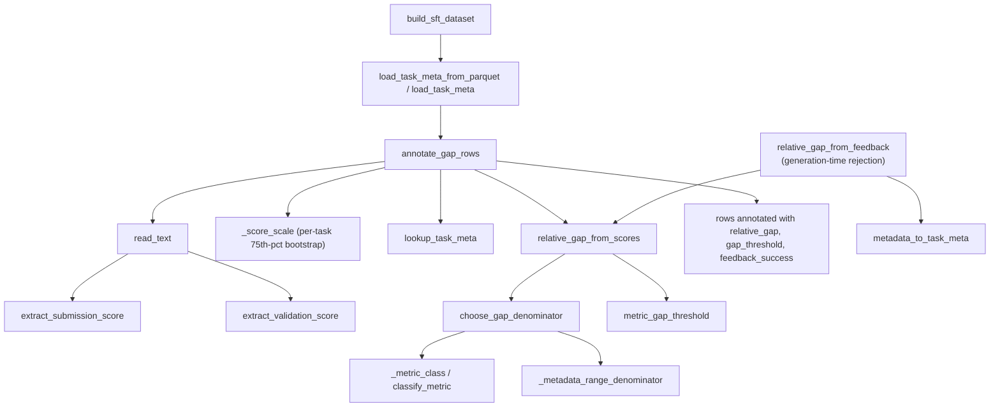

# Validation/test gap filter — the self-report-vs-hidden-evaluator quality gate for SFT rows

<!-- connect:up:begin -->
> **Cross-repo concept:** part of [verification-independence](../../../concepts/verification-independence.md) across this wiki's repos.
<!-- connect:up:end -->
## Overview
`gap_filter.py` is not a data-*volume* gate — despite its name, it has nothing to do with how many rows a
task or operator has collected. It is a data-*trust* gate: for every candidate SFT row it re-derives two
numbers already sitting in that row's feedback log — a self-reported **validation** score and the
**submission/test** score — and measures how far apart they are, normalized into a metric-aware
[`relative_gap`](../catalog/OpenMLE-ERL/SFT/tts_search/data_produce/gap_filter.md#relative_gap_from_scores)
that is comparable across an AUC task and an RMSE task alike. A trajectory whose self-report and true score
disagree by more than a per-metric threshold is flagged so it can be dropped before it ever reaches the SFT
corpus. The underlying worry this guards against is the standard failure mode of training a policy on its
own claims: if a Draft/Improve/Debug/Crossover trajectory that talked itself into believing it had a good
validation score — while the hidden evaluator disagreed — were kept in the corpus unfiltered, imitation
learning would teach Frontis-MA1's policy that an unreliable self-assessment is an acceptable thing to
report. That is exactly the concern this wiki's [verification independence](../../../concepts/verification-independence.md)
page frames generally; this module is its concrete instance at the SFT-data-curation layer.

## Diagram

## Design rationale (why it's built this way)
- **A single absolute threshold can't work across metric families, so the module classifies the metric
  before it normalizes anything.** [`classify_metric`](../catalog/OpenMLE-ERL/SFT/tts_search/data_produce/gap_filter.md#classify_metric)
  buckets a task's metric text into families — bounded 0–1 scores (AUC, accuracy/F1-style), bounded
  [-1, 1] agreement/correlation scores (kappa, MCC, Spearman/R²), unitless lower-is-better losses (RMSLE,
  log loss), and genuinely unbounded target-scale errors (RMSE, MAE, pinball) — purely from string content,
  and [`choose_gap_denominator`](../catalog/OpenMLE-ERL/SFT/tts_search/data_produce/gap_filter.md#choose_gap_denominator)
  picks a different denominator strategy per family. A 0.02 absolute score difference is nothing on an
  RMSE loss in the thousands and is a large miss on a 0–1 AUC; only a metric-aware denominator makes
  `relative_gap` comparable across the whole task pool the SFT corpus draws from.
- **The [-1, 1]-bounded families get a smaller threshold, not a smaller denominator, and the module says
  why in a comment.** For `bounded_agreement_minus1_1` / `bounded_correlation_or_r2` metrics,
  [`choose_gap_denominator`](../catalog/OpenMLE-ERL/SFT/tts_search/data_produce/gap_filter.md#choose_gap_denominator)
  fixes the denominator at 2.0 (the width of `[-1, 1]`), and
  [`metric_gap_threshold`](../catalog/OpenMLE-ERL/SFT/tts_search/data_produce/gap_filter.md#metric_gap_threshold)
  halves [`max_relative_gap`](../catalog/OpenMLE-ERL/SFT/tts_search/data_produce/gap_filter.md#GapFilterConfig.max_relative_gap)
  for exactly those two classes; the source comment spells out the arithmetic: *"With a `[-1, 1]`
  denominator of 2, this keeps the raw difference bound at roughly 0.12 instead of allowing a 0.24 score
  swing."* Without the compensating halved threshold, a correlation metric would silently tolerate twice
  the raw score disagreement of a 0–1-bounded metric at the same nominal `max_relative_gap`.
- **Unitless losses get a denominator floor, not just a scale.** For `log_target_error_lower_better` /
  `probabilistic_loss_lower_better` classes (RMSLE, log loss),
  [`choose_gap_denominator`](../catalog/OpenMLE-ERL/SFT/tts_search/data_produce/gap_filter.md#choose_gap_denominator)
  uses `max(row_scale, `[`unitless_loss_floor`](../catalog/OpenMLE-ERL/SFT/tts_search/data_produce/gap_filter.md#GapFilterConfig.unitless_loss_floor)`)`
  rather than the raw row scale alone.
  > [!inferred] Reading the arithmetic: without the floor, a near-perfect trajectory (validation and test
  > losses both close to 0) would divide by a denominator close to 0, which can blow a small absolute
  > difference into an arbitrarily large relative gap. The floor of `1.0` prevents high-performing,
  > low-loss rows from being spuriously rejected purely because their own scores are too small to serve as
  > a stable denominator.
- **The legacy range-based denominator is kept, not deleted, behind a flag.**
  [`choose_gap_denominator`](../catalog/OpenMLE-ERL/SFT/tts_search/data_produce/gap_filter.md#choose_gap_denominator)'s
  own docstring says: *"The previous range-based method is preserved in `choose_legacy_gap_denominator`.
  This function is the default for both data production and generation-time rejection."* — i.e. this is a
  point-in-time swap of the default normalization strategy
  ([`use_metric_aware_denominator`](../catalog/OpenMLE-ERL/SFT/tts_search/data_produce/gap_filter.md#GapFilterConfig.use_metric_aware_denominator)
  defaults `True`) while
  [`choose_legacy_gap_denominator`](../catalog/OpenMLE-ERL/SFT/tts_search/data_produce/gap_filter.md#choose_legacy_gap_denominator),
  which only ever consults
  [`_metadata_range_denominator`](../catalog/OpenMLE-ERL/SFT/tts_search/data_produce/gap_filter.md#_metadata_range_denominator)
  and raw score magnitude, stays reachable for reproducing older data-production runs.
- **The task-level score-scale bootstrap turns a data-quality filter into a self-calibrating one.**
  [`annotate_gap_rows`](../catalog/OpenMLE-ERL/SFT/tts_search/data_produce/gap_filter.md#annotate_gap_rows)
  makes a first pass over every row in the batch to compute, per task, the 75th percentile of
  [`_score_scale`](../catalog/OpenMLE-ERL/SFT/tts_search/data_produce/gap_filter.md#_score_scale) across
  that task's own rows, and threads the result into
  [`choose_gap_denominator`](../catalog/OpenMLE-ERL/SFT/tts_search/data_produce/gap_filter.md#choose_gap_denominator)
  as `task_score_scale` — a fallback denominator for unbounded target-scale metrics that have no
  theoretical/leaderboard range in [`TaskMeta`](../catalog/OpenMLE-ERL/SFT/tts_search/data_produce/gap_filter.md#TaskMeta).
  Rather than requiring every task to ship curated score-range metadata up front, the corpus being filtered
  supplies its own calibration data.
- **The self-validation provenance is mostly carried through as data — but one field of it is dropped
  after use.** `TaskMeta`
  carries [`validation_strategy`](../catalog/OpenMLE-ERL/SFT/tts_search/data_produce/gap_filter.md#TaskMeta.validation_strategy),
  [`metric_source`](../catalog/OpenMLE-ERL/SFT/tts_search/data_produce/gap_filter.md#TaskMeta.metric_source),
  and [`matched_text`](../catalog/OpenMLE-ERL/SFT/tts_search/data_produce/gap_filter.md#TaskMeta.matched_text)
  fields that [`_metric_fields_from_metadata`](../catalog/OpenMLE-ERL/SFT/tts_search/data_produce/gap_filter.md#_metric_fields_from_metadata)
  populates by parsing a `self_valid_protocol` dict off each row's metadata via
  [`_parse_self_valid_protocol`](../catalog/OpenMLE-ERL/SFT/tts_search/data_produce/gap_filter.md#_parse_self_valid_protocol).
  The literal field name `self_valid_protocol` is the strongest piece of evidence in this subgraph that the
  "validation" half of the gap is a *self*-reported number the module treats as needing independent
  corroboration — matching the "hidden evaluator" split this wiki's
  [`OpenMLE-Gym-builder_core-utils-nodes`](OpenMLE-Gym-builder_core-utils-nodes.md) page documents for the
  public/private task-data boundary. `annotate_gap_rows`'s output-row update copies `validation_strategy`
  and `metric_source` (alongside `metric_label`, `metric_name`, `metric_class`, `metric_direction`) onto
  each annotated row for downstream auditing — but **not** `matched_text`: that field is populated on the
  resolved `TaskMeta`/`meta` but is absent from `annotate_gap_rows`'s row-update dict, so it never reaches
  the output row and is, in that sense, discarded after classification rather than carried through.

## Entry points
- [`build_sft_dataset`](../catalog/OpenMLE-ERL/SFT/tts_search/data_produce/pipeline.md#build_sft_dataset) —
  the batch pipeline entry, reached once per SFT-corpus build. Its own docstring names the five stages
  *"collect -> token filter -> gap filter -> top-k -> write dataset"* — this module is the third stage,
  running on every row that survived the collection and token-length filters and shrinking the pool before
  the per-task top-k selection that follows it.
- [`annotate_gap_rows`](../catalog/OpenMLE-ERL/SFT/tts_search/data_produce/gap_filter.md#annotate_gap_rows) —
  the batch entry `build_sft_dataset` calls directly; control reaches it with the full candidate-row list
  for the run and a `task_meta` lookup table already built.
- [`relative_gap_from_feedback`](../catalog/OpenMLE-ERL/SFT/tts_search/data_produce/gap_filter.md#relative_gap_from_feedback) —
  a second, single-row entry point that computes the same relative gap directly from one feedback string and
  a raw metadata dict via [`metadata_to_task_meta`](../catalog/OpenMLE-ERL/SFT/tts_search/data_produce/gap_filter.md#metadata_to_task_meta),
  independent of the batch pipeline. Per `choose_gap_denominator`'s docstring this is *"the default for
  both data production and generation-time rejection"* — i.e. this is the entry point reached when a single
  trajectory is being judged as it is produced, rather than when a whole collected corpus is being filtered.

## Mechanism (step-by-step)
1. **Task metadata is loaded once per run, keyed by UUID with a name fallback.** `build_sft_dataset` builds
   a `dict[str, TaskMeta]` via
   [`load_task_meta_from_parquet`](../catalog/OpenMLE-ERL/SFT/tts_search/data_produce/gap_filter.md#load_task_meta_from_parquet)
   (reading a source parquet's metadata column, keyed primarily by task UUID) or the legacy
   [`load_task_meta`](../catalog/OpenMLE-ERL/SFT/tts_search/data_produce/gap_filter.md#load_task_meta)
   (a CSV manifest), and optionally enriches it from a sibling `*_metricprompt/train.parquet` that
   [`infer_metricprompt_parquet`](../catalog/OpenMLE-ERL/SFT/tts_search/data_produce/gap_filter.md#infer_metricprompt_parquet)
   locates and [`_load_metric_fields_from_parquet`](../catalog/OpenMLE-ERL/SFT/tts_search/data_produce/gap_filter.md#_load_metric_fields_from_parquet)
   parses — so a task's score bounds and its metric identity can come from two different files.
2. **Every row's feedback log is re-parsed for two independent numbers.**
   [`annotate_gap_rows`](../catalog/OpenMLE-ERL/SFT/tts_search/data_produce/gap_filter.md#annotate_gap_rows)
   reads each row's `feedback_path` via [`read_text`](../catalog/OpenMLE-ERL/SFT/tts_search/data_produce/common.md#read_text)
   and extracts a submission/test score with
   [`extract_submission_score`](../catalog/OpenMLE-ERL/SFT/tts_search/data_produce/gap_filter.md#extract_submission_score)
   (tries `**Score**:`, then `Final Score:`, then `##SCORE##`, first match wins) and a self-reported
   validation score with
   [`extract_validation_score`](../catalog/OpenMLE-ERL/SFT/tts_search/data_produce/gap_filter.md#extract_validation_score)
   (`Final Validation Score:`). It separately checks
   [`feedback_is_success`](../catalog/OpenMLE-ERL/SFT/tts_search/data_produce/gap_filter.md#feedback_is_success)
   — status in `{completed, success}` **and** result `== success` — which is an orthogonal signal from the
   scores themselves.
3. **Before any single row's gap is computed, the whole batch is used to build a per-task scale prior.**
   In its first pass, `annotate_gap_rows` collects every row's
   [`_score_scale`](../catalog/OpenMLE-ERL/SFT/tts_search/data_produce/gap_filter.md#_score_scale) (the max
   absolute value of whichever of validation/test score is present) grouped by task, then takes
   approximately the 75th-percentile value per task as a `task_score_scale` fallback — a corpus-bootstrapped
   estimate of "how big do scores on this task normally run," used later only when a task has no metadata
   range to fall back on.
4. **The metric is classified into a normalization family before a denominator is chosen.**
   [`classify_metric`](../catalog/OpenMLE-ERL/SFT/tts_search/data_produce/gap_filter.md#classify_metric)
   (reached through [`_metric_class`](../catalog/OpenMLE-ERL/SFT/tts_search/data_produce/gap_filter.md#_metric_class),
   which prefers an already-resolved [`metric_class`](../catalog/OpenMLE-ERL/SFT/tts_search/data_produce/gap_filter.md#TaskMeta.metric_class)
   on `TaskMeta` when one exists) does pure keyword matching over `metric_label`/`metric_name` text —
   `"auc"` → bounded 0–1 probabilistic, `"kappa"`/`"mcc"` → bounded [-1, 1] agreement, `"rmsle"` → unitless
   log-target error, `"rmse"`/`"mae"` → unbounded target-scale error, and so on down a fixed priority chain,
   falling through to `unknown_or_unbounded` if nothing matches.
5. **`choose_gap_denominator` dispatches on that class to pick a scale-appropriate denominator.** Bounded
   0–1 and SMAPE-style metrics get denominator `1.0` or `100.0` depending on whether
   [`_score_looks_percent_scale`](../catalog/OpenMLE-ERL/SFT/tts_search/data_produce/gap_filter.md#_score_looks_percent_scale)
   (a magnitude-only heuristic: scale `> 2.0` reads as percent) says the scores look like percentages;
   [-1, 1]-bounded metrics get a fixed `2.0`; unitless losses get `max(row_scale, unitless_loss_floor)`; and
   genuinely unbounded target-scale errors fall through a cascade —
   [`_metadata_range_denominator`](../catalog/OpenMLE-ERL/SFT/tts_search/data_produce/gap_filter.md#_metadata_range_denominator)
   (built from [`theoretical_min`](../catalog/OpenMLE-ERL/SFT/tts_search/data_produce/gap_filter.md#TaskMeta.theoretical_min)/[`theoretical_max`](../catalog/OpenMLE-ERL/SFT/tts_search/data_produce/gap_filter.md#TaskMeta.theoretical_max)
   or [`leaderboard_min`](../catalog/OpenMLE-ERL/SFT/tts_search/data_produce/gap_filter.md#TaskMeta.leaderboard_min)/[`leaderboard_max`](../catalog/OpenMLE-ERL/SFT/tts_search/data_produce/gap_filter.md#TaskMeta.leaderboard_max),
   gated by [`theoretical_small_range_max`](../catalog/OpenMLE-ERL/SFT/tts_search/data_produce/gap_filter.md#GapFilterConfig.theoretical_small_range_max)
   and [`big_range_threshold`](../catalog/OpenMLE-ERL/SFT/tts_search/data_produce/gap_filter.md#GapFilterConfig.big_range_threshold))
   first, then the batch-bootstrapped `task_score_scale` from step 3, then the row's own
   `_score_scale` unconditionally — the target-scale-error cascade's final fallback has no
   [`no_range_is_big`](../catalog/OpenMLE-ERL/SFT/tts_search/data_produce/gap_filter.md#GapFilterConfig.no_range_is_big)
   gate; that flag only guards the row-scale fallback in the separate catch-all branch reached when the
   metric class matches none of the named buckets (and in `choose_legacy_gap_denominator`).
   When [`use_metric_aware_denominator`](../catalog/OpenMLE-ERL/SFT/tts_search/data_produce/gap_filter.md#GapFilterConfig.use_metric_aware_denominator)
   is off, the whole dispatch is bypassed in favor of
   [`choose_legacy_gap_denominator`](../catalog/OpenMLE-ERL/SFT/tts_search/data_produce/gap_filter.md#choose_legacy_gap_denominator).
6. **`relative_gap_from_scores` turns the two scores and a denominator into a normalized gap and its
   threshold.** [`relative_gap_from_scores`](../catalog/OpenMLE-ERL/SFT/tts_search/data_produce/gap_filter.md#relative_gap_from_scores)
   computes `abs_gap = |test_score - validation_score|` only when both scores parsed successfully, divides
   by the chosen denominator to get `relative_gap`, and separately resolves the per-metric acceptance
   threshold via [`metric_gap_threshold`](../catalog/OpenMLE-ERL/SFT/tts_search/data_produce/gap_filter.md#metric_gap_threshold)
   (defaulting to [`max_relative_gap`](../catalog/OpenMLE-ERL/SFT/tts_search/data_produce/gap_filter.md#GapFilterConfig.max_relative_gap),
   halved for the [-1, 1]-bounded classes) — so a row carries both "how big is the gap" and "how big a gap
   is tolerated for this metric" as separate, independently inspectable numbers.
7. **Every row is stamped with the resolved metadata and gap fields, not just a pass/fail bit.** Back in
   `annotate_gap_rows`'s second pass, each row's task metadata is resolved through
   [`lookup_task_meta`](../catalog/OpenMLE-ERL/SFT/tts_search/data_produce/gap_filter.md#lookup_task_meta)
   (preferring [`task_id`](../catalog/OpenMLE-ERL/SFT/tts_search/data_produce/gap_filter.md#TaskMeta.task_id),
   falling back to [`task_name`](../catalog/OpenMLE-ERL/SFT/tts_search/data_produce/gap_filter.md#TaskMeta.task_name)
   and then to that name with a trailing `@N` version suffix stripped), and the output row gains
   `validation_score`, `test_score`, `abs_gap`, `relative_gap`, `gap_denominator`, a human-readable
   `gap_denominator_source` string, `gap_threshold`, `task_score_scale`, and copies of
   [`higher_is_better`](../catalog/OpenMLE-ERL/SFT/tts_search/data_produce/gap_filter.md#TaskMeta.higher_is_better),
   [`metric_direction`](../catalog/OpenMLE-ERL/SFT/tts_search/data_produce/gap_filter.md#TaskMeta.metric_direction),
   and [`metric_name`](../catalog/OpenMLE-ERL/SFT/tts_search/data_produce/gap_filter.md#TaskMeta.metric_name)
   from the resolved metadata — an annotation pass, not yet a filter.

> [!inferred] The actual accept/reject predicate that consumes these annotated fields
> (`filter_by_relative_gap`, in the same `gap_filter.py` file) is outside this packet's subgraph, so it
> cannot be cited here. Reading it directly: it keeps a row only if `relative_gap` is defined, feedback was
> a success, and `relative_gap <= gap_threshold`, tracking each of those three conditions as an independent
> gate — but that logic itself is not grounded by an in-subgraph citation on this page.

## Key data structures
- [`TaskMeta`](../catalog/OpenMLE-ERL/SFT/tts_search/data_produce/gap_filter.md#TaskMeta) — a frozen
  dataclass combining score-range bounds
  ([`theoretical_min`](../catalog/OpenMLE-ERL/SFT/tts_search/data_produce/gap_filter.md#TaskMeta.theoretical_min)/[`theoretical_max`](../catalog/OpenMLE-ERL/SFT/tts_search/data_produce/gap_filter.md#TaskMeta.theoretical_max),
  [`leaderboard_min`](../catalog/OpenMLE-ERL/SFT/tts_search/data_produce/gap_filter.md#TaskMeta.leaderboard_min)/[`leaderboard_max`](../catalog/OpenMLE-ERL/SFT/tts_search/data_produce/gap_filter.md#TaskMeta.leaderboard_max))
  with metric identity ([`metric_label`](../catalog/OpenMLE-ERL/SFT/tts_search/data_produce/gap_filter.md#TaskMeta.metric_label),
  [`metric_name`](../catalog/OpenMLE-ERL/SFT/tts_search/data_produce/gap_filter.md#TaskMeta.metric_name),
  [`metric_class`](../catalog/OpenMLE-ERL/SFT/tts_search/data_produce/gap_filter.md#TaskMeta.metric_class))
  and self-validation provenance
  ([`validation_strategy`](../catalog/OpenMLE-ERL/SFT/tts_search/data_produce/gap_filter.md#TaskMeta.validation_strategy),
  [`metric_source`](../catalog/OpenMLE-ERL/SFT/tts_search/data_produce/gap_filter.md#TaskMeta.metric_source),
  [`matched_text`](../catalog/OpenMLE-ERL/SFT/tts_search/data_produce/gap_filter.md#TaskMeta.matched_text)).
  Its own docstring notes the `metric_*` fields are *"usually populated from the sibling
  `*_metricprompt` parquet"* rather than the primary source parquet.
- [`GapFilterConfig`](../catalog/OpenMLE-ERL/SFT/tts_search/data_produce/gap_filter.md#GapFilterConfig) — a
  frozen dataclass of tunables:
  [`max_relative_gap`](../catalog/OpenMLE-ERL/SFT/tts_search/data_produce/gap_filter.md#GapFilterConfig.max_relative_gap)
  defaults `0.12`; [`theoretical_small_range_max`](../catalog/OpenMLE-ERL/SFT/tts_search/data_produce/gap_filter.md#GapFilterConfig.theoretical_small_range_max)
  (`2.0`) and [`big_range_threshold`](../catalog/OpenMLE-ERL/SFT/tts_search/data_produce/gap_filter.md#GapFilterConfig.big_range_threshold)
  (`100.0`) bound when a theoretical/leaderboard range is trusted as a denominator;
  [`no_range_is_big`](../catalog/OpenMLE-ERL/SFT/tts_search/data_produce/gap_filter.md#GapFilterConfig.no_range_is_big)
  and [`unitless_loss_floor`](../catalog/OpenMLE-ERL/SFT/tts_search/data_produce/gap_filter.md#GapFilterConfig.unitless_loss_floor)
  (`1.0`) control the fallback cascade; and
  [`use_metric_aware_denominator`](../catalog/OpenMLE-ERL/SFT/tts_search/data_produce/gap_filter.md#GapFilterConfig.use_metric_aware_denominator)
  toggles the whole metric-aware path versus the legacy one. Its docstring also documents two boolean gates
  without their own citable anchors — `require_comparable` ("Drop rows where relative gap cannot be
  computed") and `require_feedback_success` ("Drop rows without successful feedback") — both read directly
  as part of this dataclass's definition.
- **`denom_source` strings** — every denominator function returns a tagged string alongside the number
  (e.g. `"metric_aware:bounded_score_0_1_or_percent:unit_range_1"`,
  `"theoretical_range_le_small_threshold"`) rather than just the float, produced by
  [`choose_gap_denominator`](../catalog/OpenMLE-ERL/SFT/tts_search/data_produce/gap_filter.md#choose_gap_denominator),
  [`_metadata_range_denominator`](../catalog/OpenMLE-ERL/SFT/tts_search/data_produce/gap_filter.md#_metadata_range_denominator),
  and [`choose_legacy_gap_denominator`](../catalog/OpenMLE-ERL/SFT/tts_search/data_produce/gap_filter.md#choose_legacy_gap_denominator)
  — an audit trail carried onto every annotated row as `gap_denominator_source`.

## Dynamics (design intent)
This packet's Evidence has no tests exercising this subgraph, so the following is read from source only,
not confirmed by test behavior.

[`annotate_gap_rows`](../catalog/OpenMLE-ERL/SFT/tts_search/data_produce/gap_filter.md#annotate_gap_rows)
is a two-pass, whole-batch operation, not a per-row-independent one: its first pass must see every row for
a task before the second pass can use that task's bootstrapped `task_score_scale`
([`_score_scale`](../catalog/OpenMLE-ERL/SFT/tts_search/data_produce/gap_filter.md#_score_scale) computed
across the group). This is why the function's signature takes the whole `rows: list[dict[str, Any]]`
rather than one row at a time — the corpus-level statistic is only correct if the whole task's candidate
pool is visible when it's computed. By contrast,
[`relative_gap_from_feedback`](../catalog/OpenMLE-ERL/SFT/tts_search/data_produce/gap_filter.md#relative_gap_from_feedback)
takes an explicit, optional `task_score_scale` parameter that defaults to `None` — so at its
"generation-time rejection" call site, a target-scale-error-class row without metadata-derived range
metadata can only fall back to its own single-row
[`_score_scale`](../catalog/OpenMLE-ERL/SFT/tts_search/data_produce/gap_filter.md#_score_scale) inside
[`choose_gap_denominator`](../catalog/OpenMLE-ERL/SFT/tts_search/data_produce/gap_filter.md#choose_gap_denominator),
never the corpus-bootstrapped estimate the batch path gets for free. The two entry points share every
denominator/threshold rule but differ in how good their fallback denominator can be, purely because of
where in the run each is called.

Both `TaskMeta` and `GapFilterConfig` are frozen dataclasses; `build_sft_dataset` constructs a fresh
[`GapFilterConfig`](../catalog/OpenMLE-ERL/SFT/tts_search/data_produce/gap_filter.md#GapFilterConfig) inline
from its own config's `relative_gap_limit` on each call, so there is no shared mutable filter state across
runs.

## Edge cases
- **A missing score short-circuits comparability.** If either
  [`extract_submission_score`](../catalog/OpenMLE-ERL/SFT/tts_search/data_produce/gap_filter.md#extract_submission_score)
  or [`extract_validation_score`](../catalog/OpenMLE-ERL/SFT/tts_search/data_produce/gap_filter.md#extract_validation_score)
  fails to match, [`relative_gap_from_scores`](../catalog/OpenMLE-ERL/SFT/tts_search/data_produce/gap_filter.md#relative_gap_from_scores)
  leaves `abs_gap` (and therefore `relative_gap`) as `None` — exactly the case `GapFilterConfig`'s
  `require_comparable` field exists to police downstream.
- **A row can have a perfect score match and still fail on feedback status alone.**
  [`feedback_is_success`](../catalog/OpenMLE-ERL/SFT/tts_search/data_produce/gap_filter.md#feedback_is_success)
  requires status in `{completed, success}` **and** result `== success`; a sandbox that reports, say,
  `status: completed` but `result: timeout` fails this check independent of how close the two scores were —
  score agreement and execution success are checked as unrelated conditions.
- **Score-pattern priority is fixed, not "most recent."**
  [`extract_submission_score`](../catalog/OpenMLE-ERL/SFT/tts_search/data_produce/gap_filter.md#extract_submission_score)
  tries [`SCORE_RE`](../catalog/OpenMLE-ERL/SFT/tts_search/data_produce/gap_filter.md#SCORE_RE), then
  [`FINAL_SCORE_RE`](../catalog/OpenMLE-ERL/SFT/tts_search/data_produce/gap_filter.md#FINAL_SCORE_RE), then
  [`PREFIX_SCORE_RE`](../catalog/OpenMLE-ERL/SFT/tts_search/data_produce/gap_filter.md#PREFIX_SCORE_RE), and
  each `re.Pattern.search` call returns the **first** match in the text, not the last.
  > [!inferred] If a feedback log ever contains more than one `**Score**:`-formatted line (for example
  > from an intermediate step, before a final summary), this extraction would take the first one rather
  > than a genuinely final score. Nothing in this subgraph confirms whether feedback logs are structured
  > to guarantee a single occurrence.
- **Missing task metadata degrades to the weakest fallback, not an error.** When
  [`lookup_task_meta`](../catalog/OpenMLE-ERL/SFT/tts_search/data_produce/gap_filter.md#lookup_task_meta)
  returns `None`, [`_metric_class`](../catalog/OpenMLE-ERL/SFT/tts_search/data_produce/gap_filter.md#_metric_class)
  reports `"unknown_or_unbounded"` and
  [`choose_gap_denominator`](../catalog/OpenMLE-ERL/SFT/tts_search/data_produce/gap_filter.md#choose_gap_denominator)
  falls all the way to the batch-bootstrapped `task_score_scale` or single-row
  [`_score_scale`](../catalog/OpenMLE-ERL/SFT/tts_search/data_produce/gap_filter.md#_score_scale), gated by
  [`no_range_is_big`](../catalog/OpenMLE-ERL/SFT/tts_search/data_produce/gap_filter.md#GapFilterConfig.no_range_is_big)
  — a task absent from both the manifest and the metricprompt parquet is silently normalized using only
  the scores present in its own rows, never rejected outright at this stage.
- **Task names can carry a version suffix the metadata table doesn't.**
  [`lookup_task_meta`](../catalog/OpenMLE-ERL/SFT/tts_search/data_produce/gap_filter.md#lookup_task_meta)'s
  third fallback strips a trailing `@\d+` from `task_name` before a final lookup — implying some upstream
  producer emits task identifiers like `task@3` that this module has to normalize back to a base name to
  find metadata.
- **The percent-scale heuristic is magnitude-only, with a single fixed cutoff.**
  [`_score_looks_percent_scale`](../catalog/OpenMLE-ERL/SFT/tts_search/data_produce/gap_filter.md#_score_looks_percent_scale)
  decides "looks like 0–100" purely from whether
  [`_score_scale`](../catalog/OpenMLE-ERL/SFT/tts_search/data_produce/gap_filter.md#_score_scale) exceeds
  `2.0` — it has no access to the metric's true declared range, so a bounded 0–1 metric that happens to be
  logged as, say, `2.3` by an unrelated bug would be classified as percent-scale rather than flagged as
  anomalous.

## Open questions
- Where do the `**Score**:` / `Final Score:` / `##SCORE##` / `Final Validation Score:` lines this module's
  regexes target actually get written into `feedback_path`, and is the validation number genuinely computed
  by the submitted program's own self-validation code (consistent with the `self_valid_protocol` field name)
  as opposed to a separate harness step? That logic lives in OpenMLE-Gym / the sandbox execution path,
  outside this packet's subgraph.
- The actual accept/reject predicate over these annotations (`filter_by_relative_gap`, in the same file) is
  outside this packet's subgraph and therefore not citable here even though it is the function that gives
  `annotate_gap_rows`'s output any consequence — see the inferred note in Mechanism step 7.
- Who calls [`relative_gap_from_feedback`](../catalog/OpenMLE-ERL/SFT/tts_search/data_produce/gap_filter.md#relative_gap_from_feedback)
  for "generation-time rejection" — i.e. whether it gates rollouts during OpenMLE-ERL's RL sampling, or some
  other live path — is not visible in this subgraph.

## See also
- [`OpenMLE-ERL-SFT-tts_search-services-scheduler.md`](OpenMLE-ERL-SFT-tts_search-services-scheduler.md) —
  produces the parallel-path Draft rows and evolutionary-path Improve/Debug/Crossover rows that eventually
  become this module's input.
- [`OpenMLE-ERL-SFT-tts_search-services-evaluator.md`](OpenMLE-ERL-SFT-tts_search-services-evaluator.md) —
  the sandbox-execution side that produces the feedback text this module's regexes parse.
- [`OpenMLE-Gym-builder_core-utils-nodes.md`](OpenMLE-Gym-builder_core-utils-nodes.md) — documents the
  `public_dir`/`private_dir` hidden-evaluator split this page's self-report-vs-test framing depends on.
- [`../../../concepts/verification-independence.md`](../../../concepts/verification-independence.md) — the
  cross-repo concept this module is a concrete, data-curation-stage instance of.
