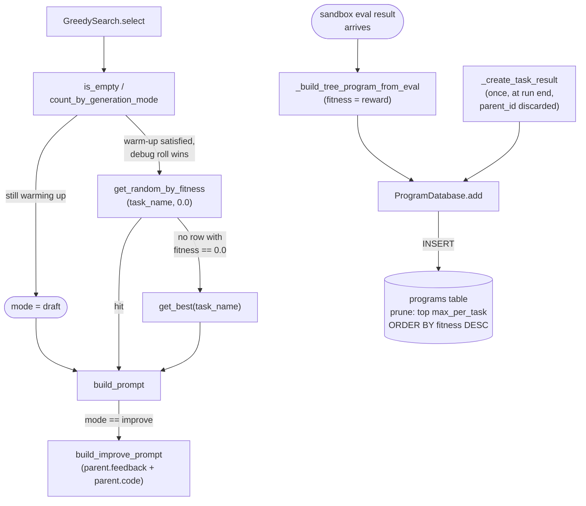

# Program database — reward-as-fitness store behind SFT's greedy draft/improve search

<!-- connect:up:begin -->
> **Cross-repo concept:** part of [evolutionary-algorithm-discovery](../../../concepts/evolutionary-algorithm-discovery.md), [program-evolution-operators](../../../concepts/program-evolution-operators.md) across this wiki's repos.
<!-- connect:up:end -->
## Overview
`ProgramDatabase` is the per-task SQLite store the SFT data-collection scheduler writes every
sandbox-evaluated [`Program`](../catalog/OpenMLE-ERL/SFT/tts_search/program_database.md#Program) into, and
the store `GreedySearch`'s
[`select`](../catalog/OpenMLE-ERL/SFT/tts_search/greedy.md#GreedySearch.select) reads from to pick a parent
for the next generation step. It shares a class name, a schema shape, and a top-k-by-fitness pruning rule
with the RL trainer's own `OpenMLE-ERL/RL/program_database.py`, but the resemblance stops at the surface:
there is no derived, population-relative fitness computation here at all.
[`fitness`](../catalog/OpenMLE-ERL/SFT/tts_search/program_database.md#Program.fitness) is just whatever value
the caller stamped onto the `Program` when building it, and every call site in this module sets it equal to
the sandbox reward — so `fitness` and `reward` are, in practice, the same number wearing two names. The
search strategy this database serves is correspondingly narrow: a single concrete `SearchAlgorithm`
implementation ([`select`](../catalog/OpenMLE-ERL/SFT/tts_search/program_database.md#SearchAlgorithm.select))
that only ever needs "the current best program"
([`get_best`](../catalog/OpenMLE-ERL/SFT/tts_search/program_database.md#ProgramDatabase.get_best)) or "a
program whose reward happens to be exactly zero"
([`get_random_by_fitness`](../catalog/OpenMLE-ERL/SFT/tts_search/program_database.md#ProgramDatabase.get_random_by_fitness)),
not the RL sibling's fitness-weighted, without-replacement sampling over draft/improve/debug/crossover pools.

## Diagram

## Design rationale (why it's built this way)
**Fitness is a pass-through, not a computed signal.** `Program.__post_init__` only defaults
[`fitness`](../catalog/OpenMLE-ERL/SFT/tts_search/program_database.md#Program.fitness) to
[`reward`](../catalog/OpenMLE-ERL/SFT/tts_search/program_database.md#Program.reward) "when not provided," but
every constructor call this module makes —
[`_build_tree_program_from_eval`](../catalog/OpenMLE-ERL/SFT/tts_search/services/scheduler.md#Scheduler._build_tree_program_from_eval),
[`_create_task_result`](../catalog/OpenMLE-ERL/SFT/tts_search/services/scheduler.md#Scheduler._create_task_result)
(both its evaluated and unevaluated branches), and
[`_preload_tree_database_from_checkpoint`](../catalog/OpenMLE-ERL/SFT/tts_search/services/scheduler.md#Scheduler._preload_tree_database_from_checkpoint)
— passes `fitness=` explicitly, always set equal to the sandbox reward. The default branch never fires for
any `Program` this subsystem writes.
[`add`](../catalog/OpenMLE-ERL/SFT/tts_search/program_database.md#ProgramDatabase.add) itself only inserts
the row and prunes by count; unlike the RL sibling's insert path, nothing here recomputes `fitness` for the
rest of the population after an insert.

**"Debug" never becomes its own generation mode — it only changes which parent gets picked.**
[`build_prompt`](../catalog/OpenMLE-ERL/SFT/tts_search/prompt_builder.md#build_prompt) branches on exactly two
string values, `'draft'` and `'improve'` (anything else raises), and
[`select`](../catalog/OpenMLE-ERL/SFT/tts_search/greedy.md#GreedySearch.select) never assigns `mode =
"debug"` — the `debug_selected` flag only decides whether the *parent* comes from
[`get_random_by_fitness`](../catalog/OpenMLE-ERL/SFT/tts_search/program_database.md#ProgramDatabase.get_random_by_fitness)`(task_name,
0.0)` (a currently-zero-reward program) instead of
[`get_best`](../catalog/OpenMLE-ERL/SFT/tts_search/program_database.md#ProgramDatabase.get_best). Either way
the generated request is stamped `generation_mode="improve"` and built by
[`build_improve_prompt`](../catalog/OpenMLE-ERL/SFT/tts_search/prompt_builder.md#build_improve_prompt), which
formats the same
[`feedback`](../catalog/OpenMLE-ERL/SFT/tts_search/program_database.md#Program.feedback)-plus-`code`
template regardless of which parent was chosen. So this data-collection search only ever emits two
first-class operators on disk, Draft and Improve; "debugging a broken node" here is an *internal
parent-selection heuristic* inside Improve, not a fourth operator with its own prompt shape the way the
paper-level Draft/Improve/Debug/Crossover vocabulary implies for the RL/Evo layers.

**The debug-parent lookup is an exact float match, not a range query — and its miss path is silent.**
[`get_random_by_fitness`](../catalog/OpenMLE-ERL/SFT/tts_search/program_database.md#ProgramDatabase.get_random_by_fitness)'s
SQL is `WHERE task_name = ? AND fitness = ?`, called with the literal `0.0`. Because `fitness` is just
`reward` here, this only surfaces programs whose reward is bit-for-bit `0.0` — not "reward is low" or "reward
is non-positive." If the reward computation a task uses never lands on exact `0.0` for a failing run (a small
negative penalty, for instance), the call returns `None` every time, and
[`select`](../catalog/OpenMLE-ERL/SFT/tts_search/greedy.md#GreedySearch.select)'s own null-check falls
straight through to `get_best` — the same code path as ordinary Improve, with no distinct log line marking
that a debug attempt was requested and quietly downgraded.

**One random draw decides a three-way split when `draft_prob` drives the schedule; a deterministic count
check plus at most one random draw decide it when a draft-count threshold drives the schedule.** When
[`select`](../catalog/OpenMLE-ERL/SFT/tts_search/greedy.md#GreedySearch.select)'s configured draft
probability is positive, a single `random.random()` sample is compared against cumulative bins —
`[0, draft_prob)` draft, `[draft_prob, draft_prob+debug_prob)` debug-flavored improve, the rest plain
improve — so draft/debug/improve are mutually exclusive outcomes of one coin flip. When draft probability is
zero (the module's own default), draft vs. improve is decided by comparing
[`count_by_generation_mode`](../catalog/OpenMLE-ERL/SFT/tts_search/program_database.md#ProgramDatabase.count_by_generation_mode)`(task_name,
"draft")` against a fixed target — no randomness enters that comparison — and *then*, only in the improve
branch, one `random.random()` call decides `debug_selected`. Both paths reach the same three-way outcome
space, but the first ties debug-vs-plain-improve to the same draw that ruled out draft, while the second
decides draft-vs-improve deterministically (no `random.random()` call at all) and debug-vs-plain-improve by
a single, separate coin flip.

**Per-instance thread-local storage, with an explicit fix-up comment.**
[`_local`](../catalog/OpenMLE-ERL/SFT/tts_search/program_database.md#ProgramDatabase._local) is set inside
`__init__` — `self._local = threading.local()  # Per-instance connections to avoid epoch cross-talk.` — which
means two `ProgramDatabase` instances pointing at two different `db_path`s never share a connection object
even when constructed on the same thread.

> [!inferred] The RL sibling database declares its `threading.local()` and its write lock as *class*
> attributes instead of instance attributes, which is a latent hazard if that module is ever asked to run two
> databases from one process. Nothing in either subgraph states that this file's per-instance `_local` was
> written to correct that specific hazard, but the comment ("avoid epoch cross-talk") and the choice both
> point at the same concern, and this module is the one that gets it right.

> [!inferred] Reading `_create_task_result` and `_on_eval_result` together suggests every generation that
> receives a sandbox eval result may be written into the database *twice* when tree search is enabled — see
> Edge cases. Nothing in the source states whether this is intended; it reads as a straightforward
> consequence of two independently-written call sites both guarded only by "is `self._database` set,"
> not as a documented feature.

## Entry points
- [`select`](../catalog/OpenMLE-ERL/SFT/tts_search/greedy.md#GreedySearch.select) on `GreedySearch` — the
  only concrete `SearchAlgorithm`
  ([`select`](../catalog/OpenMLE-ERL/SFT/tts_search/program_database.md#SearchAlgorithm.select))
  this module ships. The scheduler calls it once per new generation request while tree search is enabled,
  handing it the shared `ProgramDatabase`
  and getting back a prompt, an optional parent [`Program`](../catalog/OpenMLE-ERL/SFT/tts_search/program_database.md#Program),
  and the chosen mode.
- [`add`](../catalog/OpenMLE-ERL/SFT/tts_search/program_database.md#ProgramDatabase.add) — the write path,
  reached from three independent call sites: once per completed sandbox evaluation (building the `Program`
  via
  [`_build_tree_program_from_eval`](../catalog/OpenMLE-ERL/SFT/tts_search/services/scheduler.md#Scheduler._build_tree_program_from_eval)),
  once more, in bulk, per task at the very end of the whole run (via
  [`_create_task_result`](../catalog/OpenMLE-ERL/SFT/tts_search/services/scheduler.md#Scheduler._create_task_result)),
  and once per replayed row when a run resumes from a checkpoint (via
  [`_preload_tree_database_from_checkpoint`](../catalog/OpenMLE-ERL/SFT/tts_search/services/scheduler.md#Scheduler._preload_tree_database_from_checkpoint)
  — see the next bullet).
- [`_preload_tree_database_from_checkpoint`](../catalog/OpenMLE-ERL/SFT/tts_search/services/scheduler.md#Scheduler._preload_tree_database_from_checkpoint)
  — the resume path: control reaches it when a run restarts from a checkpoint, and it replays every
  previously-recorded evaluation back through
  [`add`](../catalog/OpenMLE-ERL/SFT/tts_search/program_database.md#ProgramDatabase.add) in step order so the
  freshly-created (and freshly-numbered) database ends up with the same population
  [`select`](../catalog/OpenMLE-ERL/SFT/tts_search/greedy.md#GreedySearch.select) would have seen had the
  process never stopped.

## Mechanism (step-by-step)
1. **A generation request needs a parent.** Before the scheduler asks the model for a new attempt at a task,
   it calls [`select`](../catalog/OpenMLE-ERL/SFT/tts_search/greedy.md#GreedySearch.select), which first asks
   the database whether the task is still in its warm-up window — via
   [`count_by_generation_mode`](../catalog/OpenMLE-ERL/SFT/tts_search/program_database.md#ProgramDatabase.count_by_generation_mode)`(task_name,
   "draft")` compared against a configured draft target (or, if a nonzero draft probability is configured
   instead, a single random draw covering draft/debug/improve at once — see Design rationale). While the task
   has no programs yet at all, the database's own
   [`is_empty`](../catalog/OpenMLE-ERL/SFT/tts_search/program_database.md#ProgramDatabase.is_empty) short-circuits
   straight to draft mode, guaranteeing the very first attempt at any task can never be an Improve with
   nothing to improve on.
2. **Picking a parent for Improve.** Once warm-up is over, `select` tries, with a configured probability, to
   find a "buggy" node to fix: it calls
   [`get_random_by_fitness`](../catalog/OpenMLE-ERL/SFT/tts_search/program_database.md#ProgramDatabase.get_random_by_fitness)`(task_name,
   0.0)`, an exact-match SQL lookup (not a threshold), and only if that returns nothing — or the debug roll
   wasn't taken — falls back to
   [`get_best`](../catalog/OpenMLE-ERL/SFT/tts_search/program_database.md#ProgramDatabase.get_best), a plain
   `ORDER BY fitness DESC LIMIT 1`. Since `fitness` here is always the stored reward, this is, in effect,
   "the single highest-reward program seen so far for this task" — there is no sampling, no weighting by how
   informative a branch has been, and no notion of population diversity.
3. **Building the prompt from whichever parent was chosen.**
   [`build_prompt`](../catalog/OpenMLE-ERL/SFT/tts_search/prompt_builder.md#build_prompt) dispatches on the
   `mode` string; for Improve it calls
   [`build_improve_prompt`](../catalog/OpenMLE-ERL/SFT/tts_search/prompt_builder.md#build_improve_prompt),
   which reads the parent's
   [`feedback`](../catalog/OpenMLE-ERL/SFT/tts_search/program_database.md#Program.feedback) and
   [`code`](../catalog/OpenMLE-ERL/SFT/tts_search/program_database.md#Program.code) straight off the `Program`
   object `select` returned — the database round-trip for parent selection and the prompt-construction step
   are two separate reads of the same in-memory object, not two separate queries.
4. **The sandbox scores the attempt, and the result is written back.** When an evaluation completes, the
   scheduler builds a fresh
   [`Program`](../catalog/OpenMLE-ERL/SFT/tts_search/program_database.md#Program) via
   [`_build_tree_program_from_eval`](../catalog/OpenMLE-ERL/SFT/tts_search/services/scheduler.md#Scheduler._build_tree_program_from_eval),
   which recovers the *specific* parent this attempt was generated against from the search metadata the
   generation request carried (`parent_id`, `parent_code`,
   [`generation_mode`](../catalog/OpenMLE-ERL/SFT/tts_search/program_database.md#Program.generation_mode)),
   sets [`reward`](../catalog/OpenMLE-ERL/SFT/tts_search/program_database.md#Program.reward),
   [`base_reward`](../catalog/OpenMLE-ERL/SFT/tts_search/program_database.md#Program.base_reward), and
   [`fitness`](../catalog/OpenMLE-ERL/SFT/tts_search/program_database.md#Program.fitness) to the same sandbox
   reward value, and passes the result to
   [`add`](../catalog/OpenMLE-ERL/SFT/tts_search/program_database.md#ProgramDatabase.add).
5. **Insertion and pruning happen under a lock, without any recompute.**
   [`add`](../catalog/OpenMLE-ERL/SFT/tts_search/program_database.md#ProgramDatabase.add) takes
   [`_lock`](../catalog/OpenMLE-ERL/SFT/tts_search/program_database.md#ProgramDatabase._lock), inserts the row
   through [`_get_connection`](../catalog/OpenMLE-ERL/SFT/tts_search/program_database.md#ProgramDatabase._get_connection),
   counts the task's current rows, and — only if that count now exceeds
   [`max_per_task`](../catalog/OpenMLE-ERL/SFT/tts_search/program_database.md#ProgramDatabase.max_per_task) —
   deletes every row not in the top-`max_per_task` by `fitness DESC`. No other field on any surviving row is
   touched, unlike the RL sibling's insert path.
6. **A second write path exists for the same evaluated programs.** Independently of step 4–5,
   [`_create_task_result`](../catalog/OpenMLE-ERL/SFT/tts_search/services/scheduler.md#Scheduler._create_task_result)
   runs once per task after the entire run's generation and evaluation queues have drained, rebuilds a
   [`Program`](../catalog/OpenMLE-ERL/SFT/tts_search/program_database.md#Program) for every
   generation-result/eval-result pair it has collected for that task (setting
   [`fitness`](../catalog/OpenMLE-ERL/SFT/tts_search/program_database.md#Program.fitness) to
   [`reward`](../catalog/OpenMLE-ERL/SFT/tts_search/program_database.md#Program.reward) again, but
   `parent_id=None` and `generation_mode="draft"` unconditionally, discarding whatever the real search step
   recorded), and calls
   [`add`](../catalog/OpenMLE-ERL/SFT/tts_search/program_database.md#ProgramDatabase.add) on each — see Edge
   cases for what this means when tree search was actually in use.
7. **Resuming from a checkpoint replays history through the same write path.**
   [`_preload_tree_database_from_checkpoint`](../catalog/OpenMLE-ERL/SFT/tts_search/services/scheduler.md#Scheduler._preload_tree_database_from_checkpoint)
   sorts prior evaluation rows by step index, remaps each row's recorded parent id to the *new* database id
   its parent received on replay (because a fresh `ProgramDatabase` hands out
   its own autoincrementing ids), and calls
   [`add`](../catalog/OpenMLE-ERL/SFT/tts_search/program_database.md#ProgramDatabase.add) for each — so
   `select`'s subsequent warm-up check
   ([`count_by_generation_mode`](../catalog/OpenMLE-ERL/SFT/tts_search/program_database.md#ProgramDatabase.count_by_generation_mode))
   and parent lookups see the resumed task's true prior history, not an empty database.

## Key data structures
- [`Program`](../catalog/OpenMLE-ERL/SFT/tts_search/program_database.md#Program) — one dataclass row per
  attempt. The fields this mechanism actually reads or writes:
  [`id`](../catalog/OpenMLE-ERL/SFT/tts_search/program_database.md#Program.id),
  [`task_id`](../catalog/OpenMLE-ERL/SFT/tts_search/program_database.md#Program.task_id) and
  [`task_name`](../catalog/OpenMLE-ERL/SFT/tts_search/program_database.md#Program.task_name),
  [`code`](../catalog/OpenMLE-ERL/SFT/tts_search/program_database.md#Program.code) and
  [`raw_text`](../catalog/OpenMLE-ERL/SFT/tts_search/program_database.md#Program.raw_text),
  [`score`](../catalog/OpenMLE-ERL/SFT/tts_search/program_database.md#Program.score),
  [`reward`](../catalog/OpenMLE-ERL/SFT/tts_search/program_database.md#Program.reward),
  [`base_reward`](../catalog/OpenMLE-ERL/SFT/tts_search/program_database.md#Program.base_reward), and
  [`fitness`](../catalog/OpenMLE-ERL/SFT/tts_search/program_database.md#Program.fitness) (the latter two
  always set equal to `reward` by every writer this subgraph exercises),
  [`run_log`](../catalog/OpenMLE-ERL/SFT/tts_search/program_database.md#Program.run_log) and
  [`feedback`](../catalog/OpenMLE-ERL/SFT/tts_search/program_database.md#Program.feedback) (what
  [`build_improve_prompt`](../catalog/OpenMLE-ERL/SFT/tts_search/prompt_builder.md#build_improve_prompt) shows
  the model),
  [`parent_id`](../catalog/OpenMLE-ERL/SFT/tts_search/program_database.md#Program.parent_id) and
  [`parent_code`](../catalog/OpenMLE-ERL/SFT/tts_search/program_database.md#Program.parent_code),
  [`generation_mode`](../catalog/OpenMLE-ERL/SFT/tts_search/program_database.md#Program.generation_mode)
  (only ever `"draft"` or `"improve"` in this module, per Design rationale), and
  [`metadata`](../catalog/OpenMLE-ERL/SFT/tts_search/program_database.md#Program.metadata), a free-form dict
  that carries request/response bookkeeping (tokens, cost, sandbox status) and, for tree-search rows, the
  search step's own metadata.
  [`to_dict`](../catalog/OpenMLE-ERL/SFT/tts_search/program_database.md#Program.to_dict) is the serialization
  boundary into the SQLite row; `metadata` is JSON-encoded there and decoded back by
  [`from_dict`](../catalog/OpenMLE-ERL/SFT/tts_search/program_database.md#Program.from_dict).
- The `programs` SQLite table built by
  [`_init_db`](../catalog/OpenMLE-ERL/SFT/tts_search/program_database.md#ProgramDatabase._init_db) — one row
  per `Program`, with an index on `(task_name, fitness DESC)` that backs both
  [`get_best`](../catalog/OpenMLE-ERL/SFT/tts_search/program_database.md#ProgramDatabase.get_best) and the
  top-k prune in [`add`](../catalog/OpenMLE-ERL/SFT/tts_search/program_database.md#ProgramDatabase.add). The
  same method also runs incremental `ALTER TABLE` migrations (adding `fitness`, `feedback`, `created_at` to
  older on-disk databases that predate those columns), so an existing `db_path` from an older run can be
  reopened without a schema mismatch.
- A thread-local SQLite connection returned by
  [`_get_connection`](../catalog/OpenMLE-ERL/SFT/tts_search/program_database.md#ProgramDatabase._get_connection),
  backed by [`_local`](../catalog/OpenMLE-ERL/SFT/tts_search/program_database.md#ProgramDatabase._local), and
  a write [`_lock`](../catalog/OpenMLE-ERL/SFT/tts_search/program_database.md#ProgramDatabase._lock) — both
  set per-instance in `__init__`, not shared across `ProgramDatabase` objects.
- [`db_path`](../catalog/OpenMLE-ERL/SFT/tts_search/program_database.md#ProgramDatabase.db_path) and
  [`max_per_task`](../catalog/OpenMLE-ERL/SFT/tts_search/program_database.md#ProgramDatabase.max_per_task) —
  the two constructor knobs; `max_per_task=None` disables pruning entirely (the RL sibling instead treats
  `<= 0` as "no pruning").
- `TaskResult`'s [`samples`](../catalog/OpenMLE-ERL/SFT/tts_search/services/scheduler.md#TaskResult.samples) and
  [`best_program`](../catalog/OpenMLE-ERL/SFT/tts_search/services/scheduler.md#TaskResult.best_program)
  fields — the run-level summary
  [`_create_task_result`](../catalog/OpenMLE-ERL/SFT/tts_search/services/scheduler.md#Scheduler._create_task_result)
  returns; `best_program` is chosen by `max(programs, key=lambda p: p.reward)`, reading `reward` directly
  rather than going back through the database's `fitness`-ordered `get_best`.

## Dynamics (design intent)
Write access to a single `ProgramDatabase`
is serialized by its own [`_lock`](../catalog/OpenMLE-ERL/SFT/tts_search/program_database.md#ProgramDatabase._lock)
(a plain `threading.Lock`, taken inside both
[`add`](../catalog/OpenMLE-ERL/SFT/tts_search/program_database.md#ProgramDatabase.add) and
[`clear`](../catalog/OpenMLE-ERL/SFT/tts_search/program_database.md#ProgramDatabase.clear)), so two
threads can never interleave one insert-then-prune sequence with another. Read methods —
[`get_best`](../catalog/OpenMLE-ERL/SFT/tts_search/program_database.md#ProgramDatabase.get_best),
[`get_random_by_fitness`](../catalog/OpenMLE-ERL/SFT/tts_search/program_database.md#ProgramDatabase.get_random_by_fitness),
[`get_by_id`](../catalog/OpenMLE-ERL/SFT/tts_search/program_database.md#ProgramDatabase.get_by_id),
[`list_by_task`](../catalog/OpenMLE-ERL/SFT/tts_search/program_database.md#ProgramDatabase.list_by_task) —
take no lock and only go through
[`_get_connection`](../catalog/OpenMLE-ERL/SFT/tts_search/program_database.md#ProgramDatabase._get_connection),
so a `select` call reading `fitness` can race an in-flight `add` on another thread, subject to whatever
isolation SQLite's default journal mode provides. Above the database's own locking, the scheduler serializes
its own bookkeeping (deciding how many new generations a task still needs, and writing the tree-search event
this program corresponds to) with a separate asyncio-level lock around task state — a different
synchronization primitive from the database's `threading.Lock`, coordinating a different piece of shared
state (in-memory task progress counters, not the SQLite rows).

No test in the packet's configured test paths references this subgraph (see Evidence), so none of the above
is confirmed by test-observed behavior — it is read directly from `add`, `_get_connection`, `select`, and the
scheduler methods that call them.

## Edge cases
- **A tree-search-enabled run appears to double-write every evaluated program.**
  [`_on_eval_result`](../catalog/OpenMLE-ERL/SFT/tts_search/services/scheduler.md#Scheduler._on_eval_result)
  calls [`add`](../catalog/OpenMLE-ERL/SFT/tts_search/program_database.md#ProgramDatabase.add) as each
  sandbox result streams in, and
  [`_create_task_result`](../catalog/OpenMLE-ERL/SFT/tts_search/services/scheduler.md#Scheduler._create_task_result)
  calls `add` again for the same evaluated results, once per task, after the whole run finishes — guarded
  only by "is the database set," which is true for the whole run whenever tree search is enabled. The second
  copy of each program has `parent_id=None` and `generation_mode="draft"` regardless of what the search
  actually did, so it both duplicates rows in the `programs` table and pollutes them with worse lineage data
  than the first copy already recorded. Whether this is intentional (e.g. a deliberate "flatten the tree into
  a draft-only training corpus" step) or an oversight is not stated anywhere in this subgraph.
- **`max_per_task=None` disables pruning entirely**, unlike the RL sibling where `<= 0` does the same job —
  the two databases use different sentinel conventions for "keep everything," so config written for one is
  not directly portable to the other.
- **The debug-parent path only ever matches an exact `0.0`.** As covered in Design rationale, any reward
  scheme that never produces a literal `0.0` for a failing run makes
  [`get_random_by_fitness`](../catalog/OpenMLE-ERL/SFT/tts_search/program_database.md#ProgramDatabase.get_random_by_fitness)`(task_name,
  0.0)` permanently return `None`, silently collapsing the debug branch into plain Improve.
- **`select_best`, `get_by_id`, and the abstract `SearchAlgorithm.select`/`select_best` contract are present
  but have no caller inside this subgraph.**
  [`select_best`](../catalog/OpenMLE-ERL/SFT/tts_search/greedy.md#GreedySearch.select_best) is a one-line
  wrapper over [`get_best`](../catalog/OpenMLE-ERL/SFT/tts_search/program_database.md#ProgramDatabase.get_best),
  and [`get_by_id`](../catalog/OpenMLE-ERL/SFT/tts_search/program_database.md#ProgramDatabase.get_by_id) is a
  plain id lookup, but nothing in the subgraph's `called by` lists shows either being invoked from the
  scheduler — they read as API surface kept for callers outside this packet (or outside the currently-used
  code paths) rather than dead code proven unreachable.
- **`fitness` can legitimately be non-`None` on an object whose `run_log` was never explicitly set**, because
  `Program.__post_init__` also reaches into `metadata["clear_run_log"]` and overwrites `run_log` from it when
  present — a second post-construction mutation happening in the same hook that (in principle, if ever hit)
  would default `fitness`.

## Open questions
- Whether the apparent double-insert in `_create_task_result` (see Edge cases) is a deliberate flattening
  step for building an SFT training corpus, or simply two write paths that were never reconciled after tree
  search was added — nothing in this subgraph's docstrings or comments says which.
- Why `get_random_by_fitness` was written as an exact-equality lookup instead of a `<= 0` (or `< threshold`)
  range query, given that a range query is what the analogous "find a broken node" selection would need to be
  robust to reward functions that don't emit literal `0.0` for failures.
- Whether any caller outside this packet's subgraph reaches
  [`select_best`](../catalog/OpenMLE-ERL/SFT/tts_search/greedy.md#GreedySearch.select_best) or
  [`get_by_id`](../catalog/OpenMLE-ERL/SFT/tts_search/program_database.md#ProgramDatabase.get_by_id) — the
  packet shows no call site for either.

## See also
- [`OpenMLE-ERL-RL-program_database.md`](OpenMLE-ERL-RL-program_database.md) — the RL trainer's own,
  same-named `ProgramDatabase`. It is a materially different mechanism, not just a renamed copy: its `add`
  recomputes a three-term, population-normalized `fitness` (exploit + child-reward-variance +
  visit-cooling, Eq. 3) for the *entire* task's rows on every insert, and its richest search variant samples
  parents by fitness-weighted draw without replacement across four operators (Draft/Improve/Debug/Crossover).
  This SFT-side database never recomputes anything — `fitness` is just a copy of `reward` set once at
  construction — and its one search strategy only ever asks for "the best" or "an exact-zero-reward" row, and
  never emits `"debug"` or `"crossover"` as a generation mode at all. Both databases share the same top-k-by-
  `fitness` pruning idiom and the same SQLite-with-thread-local-connections plumbing, but this module fixes
  (or never introduced) the class-level thread-local/lock pattern the RL sibling page flags as a latent
  cross-instance hazard.
- [`program-evolution-operators`](../../../concepts/program-evolution-operators.md) — the Draft/Improve/
  Debug/Crossover vocabulary; this module is a narrower instance, implementing only Draft and Improve as
  distinct prompt-building modes, with "debug" folded into Improve as a parent-selection heuristic and
  Crossover entirely absent.
- [`evolutionary-algorithm-discovery`](../../../concepts/evolutionary-algorithm-discovery.md) — the broader
  cross-repo pattern (population database + evaluator-scored candidates + fitness-driven survivor selection)
  this page is a minimal instance of.
- [`../../../sources/frontis-ma1.md`](../../../sources/frontis-ma1.md) — §4 describes OpenMLE-ERL's SFT stage
  as the data-collection search that seeds supervised fine-tuning before the RL stage this page's sibling
  page grounds Eq. 3 against.
