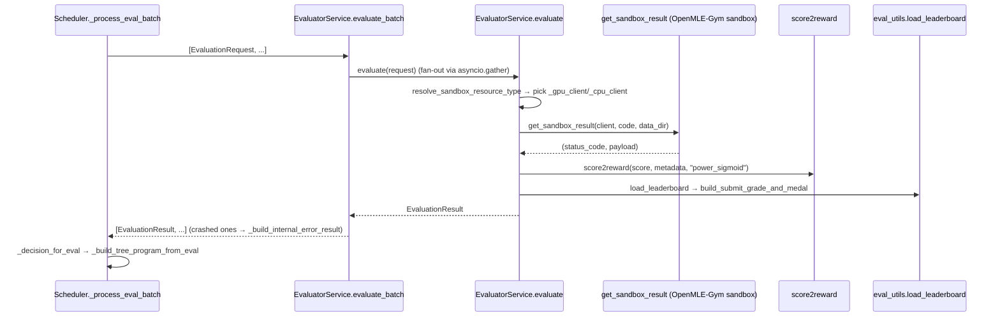

# EvaluatorService — turning a sandbox run into a scored trajectory step

<!-- connect:up:begin -->
> **Cross-repo concept:** part of [closed-loop-experiment-design](../../../concepts/closed-loop-experiment-design.md), [verification-independence](../../../concepts/verification-independence.md) across this wiki's repos.
<!-- connect:up:end -->
## Overview
`EvaluatorService` is the boundary between tts_search's evolutionary search and the OpenMLE-Gym sandbox: it
never runs a candidate program itself, it ships `code` + `data_dir` to a remote sandbox HTTP API, polls
until the job finishes, and turns whatever the sandbox reports into one flat, always-populated
[`EvaluationResult`](../catalog/OpenMLE-ERL/SFT/tts_search/services/evaluator.md#EvaluationResult) — score,
normalized reward, medal, human-readable feedback, and both the raw and cleaned execution log. The key
design idea is that [`evaluate`](../catalog/OpenMLE-ERL/SFT/tts_search/services/evaluator.md#EvaluatorService.evaluate)
does **not** branch on *which* of the sandbox's outcome modes occurred; every failure — a runtime error, a
missing submission, a scoring failure, a timeout, an infra hiccup before the job even started — collapses
to the same `score=None` / `reward=0.0` path. What is preserved, verbatim, is the sandbox's own outcome
label and log text, carried through in
[`status`](../catalog/OpenMLE-ERL/SFT/tts_search/services/evaluator.md#EvaluationResult.status) and
[`feedback`](../catalog/OpenMLE-ERL/SFT/tts_search/services/evaluator.md#EvaluationResult.feedback) so that
whichever operator (Draft/Improve/Debug/Crossover) consumes this trajectory step next can read *why* it
failed, even though the evaluator's own control flow never inspects that "why."

## Diagram

## Design rationale (why it's built this way)
- **One score/no-score branch, not six.** `evaluate` reduces the sandbox's outcome to
  `status = result_payload.get("result") or "unknown"` and a single condition,
  `if status_code != 200 or score_value is None: score = None`
  ([`evaluate`](../catalog/OpenMLE-ERL/SFT/tts_search/services/evaluator.md#EvaluatorService.evaluate)). Every
  downstream consumer that actually needs a decision — [`score2reward`](../catalog/OpenMLE-ERL/SFT/tts_search/reward_func_utils.md#score2reward)
  for shaping, the rejection policy reached through
  [`_decision_for_eval`](../catalog/OpenMLE-ERL/SFT/tts_search/services/scheduler.md#Scheduler._decision_for_eval) for
  filtering — only needs "is there a usable number," not "which of the sandbox's failure modes fired." The
  fine-grained reason is not discarded, though: it survives as text in
  [`status`](../catalog/OpenMLE-ERL/SFT/tts_search/services/evaluator.md#EvaluationResult.status) and in the
  feedback string built by
  [`format_sandbox_feedback`](../catalog/OpenMLE-ERL/SFT/tts_search/reward_func_utils.md#format_sandbox_feedback),
  which is what actually reaches the model on the next Improve/Debug/Crossover turn.
  > [!inferred] The paper's OpenMLE-Gym description names six such labels — success, runtime error, missing
  > code, missing submission, scoring failure, timeout (`wiki/sources/frontis-ma1.md`, §"Layer 1"). This
  > file only ever sees that label as an opaque string inside `result_payload.get("result")`; the code that
  > actually emits those six specific values lives in OpenMLE-Gym, outside this packet's subgraph, so the
  > exact wire strings can't be confirmed from here.
- **Two pre-built HTTP clients instead of one client + a per-call flag.** `__aenter__` builds
  [`_gpu_client`](../catalog/OpenMLE-ERL/SFT/tts_search/services/evaluator.md#EvaluatorService._gpu_client) and
  [`_cpu_client`](../catalog/OpenMLE-ERL/SFT/tts_search/services/evaluator.md#EvaluatorService._cpu_client) up
  front (aliasing the CPU client to the GPU client when the two base URLs are equal) so that connection
  pooling/keepalive is set up once per sandbox endpoint rather than per job; `evaluate` then just *selects*
  between the two based on
  [`resolve_sandbox_resource_type`](../catalog/OpenMLE-ERL/SFT/tts_search/reward_func_utils.md#resolve_sandbox_resource_type).
  This lets cheaper tasks run on a CPU sandbox pool without contending with GPU-bound jobs for the same
  connection limits.
- **A global `_resource_type_override` can override every task's own preference.** Resource routing is
  resolved per request from `request.metadata`, but a single service-level
  [`_resource_type_override`](../catalog/OpenMLE-ERL/SFT/tts_search/services/evaluator.md#EvaluatorService._resource_type_override)
  — normalized once via
  [`normalize_sandbox_resource_type`](../catalog/OpenMLE-ERL/SFT/tts_search/reward_func_utils.md#normalize_sandbox_resource_type)
  at construction — can force *all* evaluations in a run onto one resource type regardless of what
  individual tasks ask for. That is an operational knob (force everything onto GPU capacity, or off it)
  rather than a per-task decision.
- **Leaderboard grading is best-effort, score computation is not.** Reward shaping via
  [`score2reward`](../catalog/OpenMLE-ERL/SFT/tts_search/reward_func_utils.md#score2reward) happens once a
  score exists **and** the request's `use_score2reward` flag is true (the default on `EvaluationRequest`);
  when a caller sets `use_score2reward=False`, `evaluate` uses the raw `score` as `reward` directly instead
  of calling `score2reward` at all — so shaping is conditional on that flag, not automatic. Medal/grade
  computation via
  [`load_leaderboard`](../catalog/OpenMLE-ERL/SFT/tts_search/eval_utils.md#load_leaderboard) and
  [`build_submit_grade_and_medal`](../catalog/OpenMLE-ERL/SFT/tts_search/eval_utils.md#build_submit_grade_and_medal)
  is wrapped in its own `try/except` in the source, so a missing or malformed leaderboard CSV degrades to
  `submit_medal="N/A"` instead of failing the whole evaluation — medals are a reporting/filtering nicety
  layered on top of the reward, not part of the reward path itself.
- **A batch of evaluations can never lose a request to one bad exception.** `evaluate_batch` runs every
  request through `asyncio.gather(..., return_exceptions=True)` and converts any exception into a normal
  (failed) result via
  [`_build_internal_error_result`](../catalog/OpenMLE-ERL/SFT/tts_search/services/evaluator.md#EvaluatorService._build_internal_error_result)
  rather than letting one crashed evaluation take down the batch or desynchronize its length from the
  request list.

## Entry points
- [`evaluate`](../catalog/OpenMLE-ERL/SFT/tts_search/services/evaluator.md#EvaluatorService.evaluate) — the
  per-program call; reached once per generated candidate whenever
  [`_process_eval_batch`](../catalog/OpenMLE-ERL/SFT/tts_search/services/scheduler.md#Scheduler._process_eval_batch)
  (via `evaluate_batch`) has a batch of generation results ready to score.
- [`evaluate_batch`](../catalog/OpenMLE-ERL/SFT/tts_search/services/evaluator.md#EvaluatorService.evaluate_batch) —
  the concurrent fan-out entry point the scheduler actually calls; it is what
  [`_process_eval_batch`](../catalog/OpenMLE-ERL/SFT/tts_search/services/scheduler.md#Scheduler._process_eval_batch)
  invokes for every batch pulled off the eval queue.
- [`_process_eval_batch`](../catalog/OpenMLE-ERL/SFT/tts_search/services/scheduler.md#Scheduler._process_eval_batch) —
  the scheduler-side call site; builds one `EvaluationRequest` per generated program, calls
  `evaluate_batch`, then persists results and fires the eval hooks.
- [`_run_eval_loop`](../catalog/OpenMLE-ERL/SFT/tts_search/services/scheduler.md#Scheduler._run_eval_loop),
  [`_run_looping_tasks`](../catalog/OpenMLE-ERL/SFT/tts_search/services/scheduler.md#Scheduler._run_looping_tasks),
  and [`run_evaluation_only`](../catalog/OpenMLE-ERL/SFT/tts_search/services/scheduler.md#Scheduler.run_evaluation_only)
  — the three scheduler-level driving loops (fire-and-forget streaming, per-task success/target looping, and
  eval-only resume) that all ultimately fan out through the same `evaluate_batch`-backed path and consume
  its `list[EvaluationResult]` contract.

## Mechanism (step-by-step)
1. **Request assembly.** For every generated program in a batch,
   [`_process_eval_batch`](../catalog/OpenMLE-ERL/SFT/tts_search/services/scheduler.md#Scheduler._process_eval_batch)
   builds an `EvaluationRequest` carrying
   [`code`](../catalog/OpenMLE-ERL/SFT/tts_search/services/evaluator.md#EvaluationRequest.code),
   [`data_dir`](../catalog/OpenMLE-ERL/SFT/tts_search/services/evaluator.md#EvaluationRequest.data_dir),
   [`metadata`](../catalog/OpenMLE-ERL/SFT/tts_search/services/evaluator.md#EvaluationRequest.metadata), a
   task-namespaced (not step-namespaced)
   [`output_dir`](../catalog/OpenMLE-ERL/SFT/tts_search/services/evaluator.md#EvaluationRequest.output_dir)
   built from `task_name`/`task_id` and shared by every step of that task, and the request's own
   [`step_index`](../catalog/OpenMLE-ERL/SFT/tts_search/services/evaluator.md#EvaluationRequest.step_index)
   — it is `evaluate` itself, not `_process_eval_batch`, that combines the two into the actual
   `step_{step_index}` subdirectory when it writes artifacts (step 8 below), so the sandbox artifacts this
   evaluation produces land in a predictable, per-task location before the network call is ever made.
2. **Resource routing.**
   [`evaluate`](../catalog/OpenMLE-ERL/SFT/tts_search/services/evaluator.md#EvaluatorService.evaluate) resolves
   the effective sandbox resource type from the request's metadata (or the service-wide override) and picks
   between the two pre-built clients — this is the only place `_gpu_client`/
   [`_cpu_client`](../catalog/OpenMLE-ERL/SFT/tts_search/services/evaluator.md#EvaluatorService._cpu_client)
   selection happens, and it happens fresh on every call since different requests can carry different
   `cpu_gpu` metadata.
3. **Bounded submit-and-poll.** The actual sandbox round trip is wrapped in `async with self._semaphore` and
   fully delegated to
   [`get_sandbox_result`](../catalog/OpenMLE-ERL/SFT/tts_search/reward_func_utils.md#get_sandbox_result),
   which posts the job, then polls until it reaches a finished status or the wait timeout expires — this is
   the semaphore that actually caps how many sandbox jobs this service has in flight at once, independent of
   how many `evaluate` coroutines are outstanding.
4. **Score/no-score collapse.** Back in `evaluate`, the returned `(status_code, payload)` is reduced to a
   single boolean question — is there a numeric score — and either a `float`
   [`score`](../catalog/OpenMLE-ERL/SFT/tts_search/services/evaluator.md#EvaluationResult.score) or `None`
   is set; every other detail of *why* there is no score is left for the text fields, not this branch.
5. **Reward shaping.** If a score exists **and** the request's `use_score2reward` flag is true (the
   default), it is passed through
   [`score2reward`](../catalog/OpenMLE-ERL/SFT/tts_search/reward_func_utils.md#score2reward) (called with
   `mode="power_sigmoid"`) to produce the normalized
   [`reward`](../catalog/OpenMLE-ERL/SFT/tts_search/services/evaluator.md#EvaluationResult.reward) that the
   rest of the search — rejection filtering, program fitness — actually optimizes against, not the raw task
   metric. When `use_score2reward` is false, `reward` is set to the raw `score` value instead, bypassing
   `score2reward` entirely.
6. **Leaderboard grading.** Independently of the reward, `evaluate` tries to compute a Kaggle-style
   percentile grade and medal via
   [`load_leaderboard`](../catalog/OpenMLE-ERL/SFT/tts_search/eval_utils.md#load_leaderboard) and
   [`build_submit_grade_and_medal`](../catalog/OpenMLE-ERL/SFT/tts_search/eval_utils.md#build_submit_grade_and_medal),
   writing `submit_medal` and defaulting to `"N/A"` on any failure so a leaderboard-lookup problem never
   blocks the evaluation itself.
7. **Log cleanup and feedback text.** The raw sandbox log is stripped of heartbeat noise via
   [`get_clear_log`](../catalog/OpenMLE-ERL/SFT/tts_search/reward_func_utils.md#get_clear_log) into
   [`clear_run_log`](../catalog/OpenMLE-ERL/SFT/tts_search/services/evaluator.md#EvaluationResult.clear_run_log),
   and a separate human/model-facing summary is built by
   [`format_sandbox_feedback`](../catalog/OpenMLE-ERL/SFT/tts_search/reward_func_utils.md#format_sandbox_feedback)
   into
   [`feedback`](../catalog/OpenMLE-ERL/SFT/tts_search/services/evaluator.md#EvaluationResult.feedback) — this
   is the text that actually carries the sandbox's specific outcome forward to the next operator's prompt.
8. **Artifact persistence and bookkeeping.** When an
   [`output_dir`](../catalog/OpenMLE-ERL/SFT/tts_search/services/evaluator.md#EvaluationResult.output_dir) is
   set, the raw log, cleaned log, and feedback text are each written to
   `output_dir/step_{step_index}/*.txt`, and the service's running
   [`_status_counts`](../catalog/OpenMLE-ERL/SFT/tts_search/services/evaluator.md#EvaluatorService._status_counts)
   / `_successful_evaluations` counters are updated — the on-disk trail is what lets later stages
   reconstruct a step's artifacts without holding the in-memory `EvaluationResult`.
9. **Crash-isolated batching.**
   [`evaluate_batch`](../catalog/OpenMLE-ERL/SFT/tts_search/services/evaluator.md#EvaluatorService.evaluate_batch)
   gathers all per-request `evaluate` coroutines with `return_exceptions=True`; any exception is converted
   through
   [`_build_internal_error_result`](../catalog/OpenMLE-ERL/SFT/tts_search/services/evaluator.md#EvaluatorService._build_internal_error_result)
   into a normal `status="internal_error"` result rather than propagating, so the batch's output list always
   has exactly one `EvaluationResult` per input request, in order.
10. **Downstream fan-in.** Back in the scheduler,
    [`_process_eval_batch`](../catalog/OpenMLE-ERL/SFT/tts_search/services/scheduler.md#Scheduler._process_eval_batch)
    stores each result, and — in tree-search mode —
    [`_decision_for_eval`](../catalog/OpenMLE-ERL/SFT/tts_search/services/scheduler.md#Scheduler._decision_for_eval)
    runs the rejection policy over the `EvaluationResult` before
    [`_build_tree_program_from_eval`](../catalog/OpenMLE-ERL/SFT/tts_search/services/scheduler.md#Scheduler._build_tree_program_from_eval)
    folds `score`/`reward`/`clear_run_log`/`feedback` directly into a `Program`'s fitness and stored
    metadata — the evaluator's output *is* the unit the program database and rejection sampler operate on.

## Key data structures
- [`EvaluationRequest`](../catalog/OpenMLE-ERL/SFT/tts_search/services/evaluator.md#EvaluationRequest) — the
  input contract: `request_id`/`task_id`/`task_name` for identity,
  [`code`](../catalog/OpenMLE-ERL/SFT/tts_search/services/evaluator.md#EvaluationRequest.code) and
  [`data_dir`](../catalog/OpenMLE-ERL/SFT/tts_search/services/evaluator.md#EvaluationRequest.data_dir) as the
  actual payload shipped to the sandbox, and
  [`metadata`](../catalog/OpenMLE-ERL/SFT/tts_search/services/evaluator.md#EvaluationRequest.metadata) as the
  task-level context (reward bounds, `cpu_gpu` preference, leaderboard location) `evaluate` reads to make
  every downstream decision.
- [`EvaluationResult`](../catalog/OpenMLE-ERL/SFT/tts_search/services/evaluator.md#EvaluationResult) — the
  single output shape every scheduler path converges on: HTTP-layer
  [`status_code`](../catalog/OpenMLE-ERL/SFT/tts_search/services/evaluator.md#EvaluationResult.status_code)
  plus a sandbox-layer
  [`status`](../catalog/OpenMLE-ERL/SFT/tts_search/services/evaluator.md#EvaluationResult.status) string keep
  the two failure axes (transport vs. execution) separately inspectable even though the
  [`score`](../catalog/OpenMLE-ERL/SFT/tts_search/services/evaluator.md#EvaluationResult.score)/
  [`reward`](../catalog/OpenMLE-ERL/SFT/tts_search/services/evaluator.md#EvaluationResult.reward) fields
  treat every non-200/no-score case identically. Timing
  ([`queue_time`](../catalog/OpenMLE-ERL/SFT/tts_search/services/evaluator.md#EvaluationResult.queue_time),
  [`run_time`](../catalog/OpenMLE-ERL/SFT/tts_search/services/evaluator.md#EvaluationResult.run_time)),
  identity
  ([`job_id`](../catalog/OpenMLE-ERL/SFT/tts_search/services/evaluator.md#EvaluationResult.job_id)), grading
  ([`submit_grade`](../catalog/OpenMLE-ERL/SFT/tts_search/services/evaluator.md#EvaluationResult.submit_grade),
  [`submit_medal`](../catalog/OpenMLE-ERL/SFT/tts_search/services/evaluator.md#EvaluationResult.submit_medal)),
  and both log forms
  ([`raw_run_log`](../catalog/OpenMLE-ERL/SFT/tts_search/services/evaluator.md#EvaluationResult.raw_run_log),
  [`clear_run_log`](../catalog/OpenMLE-ERL/SFT/tts_search/services/evaluator.md#EvaluationResult.clear_run_log))
  round out the record so nothing about the run needs to be re-derived later.
- `_gpu_client` / [`_cpu_client`](../catalog/OpenMLE-ERL/SFT/tts_search/services/evaluator.md#EvaluatorService._cpu_client) —
  the two lazily-created `httpx.AsyncClient` instances that gate whether `evaluate` can run at all (both must
  be non-`None`, i.e. the service must have been entered as an async context manager).
- [`_status_counts`](../catalog/OpenMLE-ERL/SFT/tts_search/services/evaluator.md#EvaluatorService._status_counts) /
  [`_successful_evaluations`](../catalog/OpenMLE-ERL/SFT/tts_search/services/evaluator.md#EvaluatorService._successful_evaluations) —
  running per-instance tallies keyed by the sandbox's own `status` label, used for service-level reporting
  rather than any per-request decision.

## Dynamics (design intent)
Two independent concurrency caps exist stacked on top of each other: the instance-level
`asyncio.Semaphore(concurrency)` inside
[`evaluate`](../catalog/OpenMLE-ERL/SFT/tts_search/services/evaluator.md#EvaluatorService.evaluate) bounds
how many sandbox submit/poll round trips this `EvaluatorService` has outstanding at once, while
[`evaluate_batch`](../catalog/OpenMLE-ERL/SFT/tts_search/services/evaluator.md#EvaluatorService.evaluate_batch)
launches one coroutine per request in the batch it is given via `asyncio.gather` — the batch size itself is
controlled entirely by the caller. Because
[`_build_internal_error_result`](../catalog/OpenMLE-ERL/SFT/tts_search/services/evaluator.md#EvaluatorService._build_internal_error_result)
absorbs any exception into a normal result, `evaluate_batch`'s `zip(requests, raw_results, strict=True)`
pairing is guaranteed to succeed — the ordering and cardinality contract (`len(output) == len(input)`, same
order) holds even when individual evaluations crash. All three scheduler-level driving loops —
[`_run_eval_loop`](../catalog/OpenMLE-ERL/SFT/tts_search/services/scheduler.md#Scheduler._run_eval_loop),
[`_run_looping_tasks`](../catalog/OpenMLE-ERL/SFT/tts_search/services/scheduler.md#Scheduler._run_looping_tasks),
and [`run_evaluation_only`](../catalog/OpenMLE-ERL/SFT/tts_search/services/scheduler.md#Scheduler.run_evaluation_only) —
converge on this same `evaluate`/`evaluate_batch` path, so streaming fire-and-forget evaluation, per-task
success-target looping, and eval-only resume all share one evaluation contract rather than three separate
ones.

## Edge cases
- **Infra failure looks like execution failure.**
  [`get_sandbox_result`](../catalog/OpenMLE-ERL/SFT/tts_search/reward_func_utils.md#get_sandbox_result) can
  itself return a non-200 `status_code` for reasons that have nothing to do with the submitted program — a
  connection failure, a missing `job_id` in the submit response, or the poll loop exceeding its wait
  timeout. From `evaluate`'s point of view these are indistinguishable from a Gym-side execution failure:
  both take the same `score=None` branch. Only the
  [`status`](../catalog/OpenMLE-ERL/SFT/tts_search/services/evaluator.md#EvaluationResult.status)/
  [`feedback`](../catalog/OpenMLE-ERL/SFT/tts_search/services/evaluator.md#EvaluationResult.feedback) text
  (built from the raw payload by
  [`format_sandbox_feedback`](../catalog/OpenMLE-ERL/SFT/tts_search/reward_func_utils.md#format_sandbox_feedback))
  distinguishes "the sandbox never ran your code" from "your code ran and failed."
- **CPU/GPU client identity check in cleanup is ineffective — `_cpu_client` gets closed twice when aliased.**
  `__aexit__` sets
  [`_gpu_client`](../catalog/OpenMLE-ERL/SFT/tts_search/services/evaluator.md#EvaluatorService._gpu_client) to
  `None` immediately after closing it, and only *then* checks
  `self._cpu_client and self._cpu_client != self._gpu_client` before closing
  [`_cpu_client`](../catalog/OpenMLE-ERL/SFT/tts_search/services/evaluator.md#EvaluatorService._cpu_client).
  Because `_gpu_client` is already `None` by that point, the comparison is really `_cpu_client != None`,
  which is true whenever `_cpu_client` is truthy — regardless of whether it was aliased to `_gpu_client`.
  So in a single-endpoint deployment, where `__aenter__` aliases `_cpu_client` to `_gpu_client`, `__aexit__`
  calls `.aclose()` on that same underlying `httpx.AsyncClient` object twice (once as `_gpu_client`, once as
  `_cpu_client`) instead of skipping the second close as the identity check appears to intend.
  > [!inferred] This reads as an ordering bug in the source rather than intentional design — the guard would
  > only work as documented if the `_gpu_client` reset were moved after the `_cpu_client` comparison.
- **Timing fields are only trustworthy when `status_code == 200`.**
  [`queue_time`](../catalog/OpenMLE-ERL/SFT/tts_search/services/evaluator.md#EvaluationResult.queue_time) and
  [`run_time`](../catalog/OpenMLE-ERL/SFT/tts_search/services/evaluator.md#EvaluationResult.run_time) are
  computed from the sandbox payload's `started_at`/`completed_at`/`created_at` timestamps and are left
  `None` for every non-200 result — even one where the sandbox queued or ran for a while before ultimately
  erroring.
- **Leaderboard grading failing never fails the evaluation.** Any exception from
  [`load_leaderboard`](../catalog/OpenMLE-ERL/SFT/tts_search/eval_utils.md#load_leaderboard) or
  [`build_submit_grade_and_medal`](../catalog/OpenMLE-ERL/SFT/tts_search/eval_utils.md#build_submit_grade_and_medal)
  is caught and logged, leaving
  [`submit_medal`](../catalog/OpenMLE-ERL/SFT/tts_search/services/evaluator.md#EvaluationResult.submit_medal)
  at `"N/A"` — the score and reward computed via
  [`score2reward`](../catalog/OpenMLE-ERL/SFT/tts_search/reward_func_utils.md#score2reward) are unaffected.
- **`evaluate` raises before ever touching the network if the service was never entered.** Both
  `_gpu_client`/[`_cpu_client`](../catalog/OpenMLE-ERL/SFT/tts_search/services/evaluator.md#EvaluatorService._cpu_client)
  must be non-`None`, which only happens inside the async-context-manager lifecycle — calling `evaluate`
  outside a `async with EvaluatorService(...)` block is a `RuntimeError`, not a silent no-op.

## Open questions
- The six labeled outcome modes this packet's lens attributes to the OpenMLE-Gym contract (success, runtime
  error, missing code, missing submission, scoring failure, timeout) are read here only as an opaque
  `result_payload.get("result")` string; the OpenMLE-Gym-side code that actually produces those specific
  values is outside this packet's subgraph, so this page cannot confirm the exact wire strings or whether
  all six are in fact distinguishable in `status` versus collapsing further upstream.
- [`score2reward`](../catalog/OpenMLE-ERL/SFT/tts_search/reward_func_utils.md#score2reward) supports several
  modes (`power_sigmoid`, `margin_tanh`, `online_percentile`, `linear_sign`), but `evaluate` always calls it
  with the mode hard-coded to `"power_sigmoid"`; nothing in this subgraph shows where or whether another
  mode is ever selected for this evaluator.
- `EvaluationRequest`/`EvaluationResult` also carry generation-token-count fields not covered by this
  packet's subgraph; their downstream consumer (presumably an SFT/RL token-accounting path) is out of scope
  here.

## See also
- [`OpenMLE-ERL-SFT-tts_search-services-scheduler`](OpenMLE-ERL-SFT-tts_search-services-scheduler.md) — the
  caller that builds `EvaluationRequest`s, drives the three evaluation loops, and folds `EvaluationResult`
  into the tree-search program database.
- [`OpenMLE-ERL-SFT-tts_search-services-rejection`](OpenMLE-ERL-SFT-tts_search-services-rejection.md) — the
  policy `_decision_for_eval` consults to accept/reject each `EvaluationResult`.
- [`OpenMLE-ERL-SFT-tts_search-services-generator`](OpenMLE-ERL-SFT-tts_search-services-generator.md) — the
  producer side; `GenerationResult` is what each `EvaluationRequest` is built from.
- [`OpenMLE-ERL-SFT-tts_search-program_database`](OpenMLE-ERL-SFT-tts_search-program_database.md) — where
  the `Program` built from an `EvaluationResult` ultimately lives.
