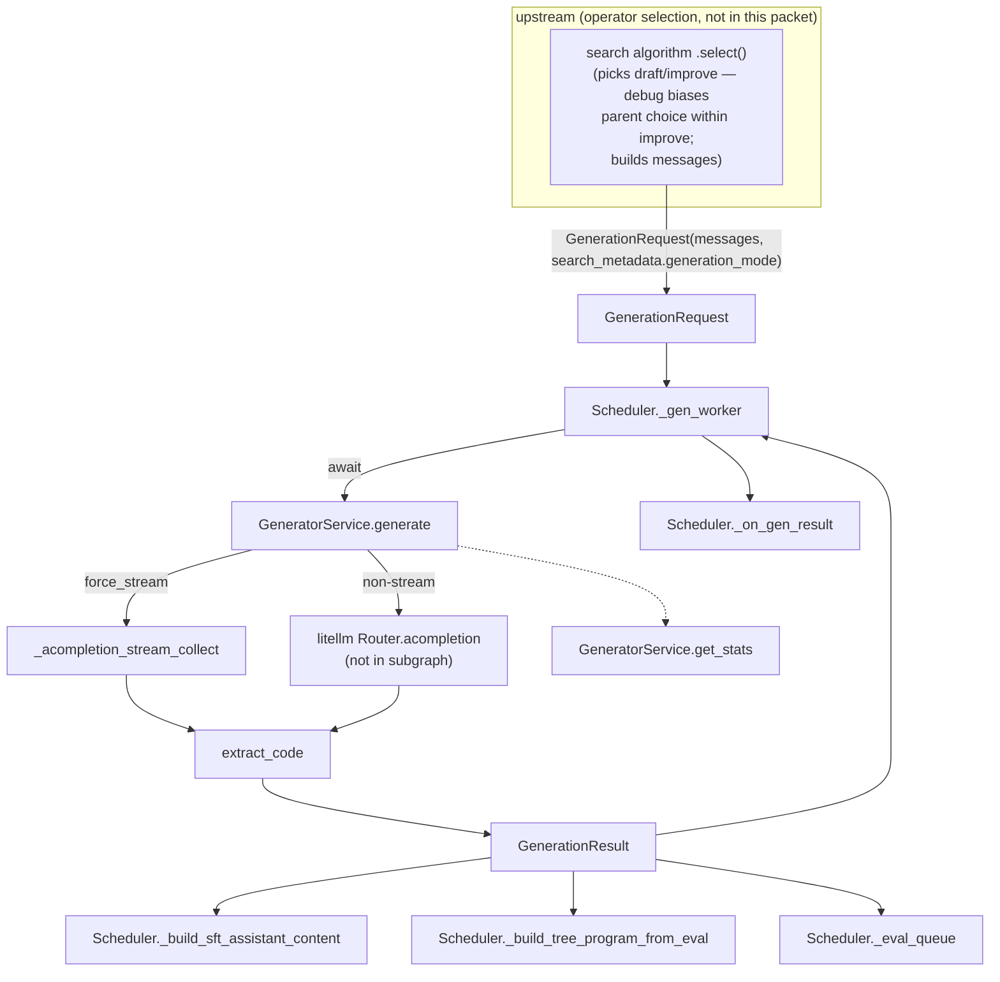

# GeneratorService — the operator-agnostic LLM caller behind tts_search's SFT trajectory collection

<!-- connect:up:begin -->
> **Cross-repo concept:** part of [evolutionary-algorithm-discovery](../../../concepts/evolutionary-algorithm-discovery.md), [program-evolution-operators](../../../concepts/program-evolution-operators.md) across this wiki's repos.
<!-- connect:up:end -->
## Overview
`tts_search` is the harness that collects Frontis-MA1's SFT corpus for an operator-conditioned policy —
both the *parallel path* (independent Draft samples, no search) and the *tree-search path* (Improve steps
over already-executed programs, chosen by `GreedySearch.select()`) run through it. The paper's broader
Draft/Improve/Debug/Crossover vocabulary is not all implemented in this module's code path: `greedy.py`'s
`select()` only ever returns `mode` `"draft"` or `"improve"` — its `debug_prob` merely biases which parent
`improve` picks (toward a buggy program via `get_random_by_fitness`), it does not produce a distinct
`"debug"` mode — and `prompt_builder.build_prompt` raises `ValueError` on any mode besides
`'draft'`/`'improve'`, so there is no `"crossover"` code path here.
`GeneratorService` is the one place every one of those requests actually talks to an LLM. The key design
idea is a strict separation of concerns: `GeneratorService` knows **nothing** about which operator produced
the chat messages it is asked to complete — it just executes a chat completion robustly (streaming or not,
retried across half a dozen provider failure modes) and hands back a self-contained result. Operator
selection and operator-conditioned prompt construction happen upstream, in the scheduler's request-building
closure; turning the result into a labeled SFT training example happens downstream, in the scheduler's
result-processing methods. `GeneratorService` is the narrow, reusable waist in between — the same `generate`
call executes a Draft request and an Improve request (including a debug-biased one) identically.

## Diagram

## Design rationale (why it's built this way)
- **The dataclasses carry the operator label; the code that fills them doesn't read it.**
  [`GenerationRequest`](../catalog/OpenMLE-ERL/SFT/tts_search/services/generator.md#GenerationRequest) and
  [`GenerationResult`](../catalog/OpenMLE-ERL/SFT/tts_search/services/generator.md#GenerationResult) both
  carry a
  [`search_metadata`](../catalog/OpenMLE-ERL/SFT/tts_search/services/generator.md#GenerationRequest.search_metadata)
  dict (whatever operator/parent bookkeeping the caller attached), and
  [`generate`](../catalog/OpenMLE-ERL/SFT/tts_search/services/generator.md#GeneratorService.generate)
  copies it straight from request to result (`search_metadata=dict(request.search_metadata or {})`) without
  ever branching on its contents. Reading the caller — `Scheduler`'s `_create_requests` closure inside
  [`_run_looping_tasks`](../catalog/OpenMLE-ERL/SFT/tts_search/services/scheduler.md#Scheduler._run_looping_tasks)
  — confirms where the actual operator decision is made: it calls a search algorithm's `select()` (in
  `greedy.py`, outside this packet's subgraph) to pick `draft` or `improve` — `greedy.py`'s `debug_prob`
  only biases which parent program `improve` selects (toward a buggy one via `get_random_by_fitness`); it
  never yields a distinct `"debug"` mode, and `prompt_builder.py`'s `build_prompt` (also outside this
  packet) raises on anything besides `'draft'`/`'improve'`, so there's no `"crossover"` mode either — and to
  build the operator-specific prompt text via `prompt_builder.py`, then packs the result into
  `request_messages` before constructing the
  [`GenerationRequest`](../catalog/OpenMLE-ERL/SFT/tts_search/services/generator.md#GenerationRequest).
  `GeneratorService` never imports or references either module — the intended reader of this page should
  not expect to find the Draft-vs-Improve prompt logic (or the debug-biased parent selection) here; it
  lives one layer up, and this module has no code path for the paper's Crossover operator at all.
- **Both `raw_text` *and* `reasoning_content` are required for the retry loop to exit successfully.**
  Inside [`generate`](../catalog/OpenMLE-ERL/SFT/tts_search/services/generator.md#GeneratorService.generate)
  the `while raw_text is None or reasoning_content is None:` loop only stops once a
  [`reasoning_content`](../catalog/OpenMLE-ERL/SFT/tts_search/services/generator.md#GenerationResult.reasoning_content)
  string has actually been recovered from the response — an empty completion with no extractable reasoning
  trace is treated as a retryable failure, not a success. A large block of now-commented-out code at the end
  of the method (the old `if raw_text is None: return GenerationResult(..., error=error_msg)` path) shows
  this was a deliberate tightening from an earlier version that was satisfied by `raw_text` alone. This
  matters directly for the lens: the SFT target format
  ([`_build_sft_assistant_content`](../catalog/OpenMLE-ERL/SFT/tts_search/services/scheduler.md#Scheduler._build_sft_assistant_content))
  wraps the reasoning trace in `<think>…</think>` ahead of the code block, so a result with no reasoning
  trace would produce a malformed training example — the retry loop appears designed to guarantee the
  reasoning field is populated before a result is accepted at all.
- **Streaming is a per-model config decision, not a per-request one.**
  [`_get_streaming_config`](../catalog/OpenMLE-ERL/SFT/tts_search/services/generator.md#GeneratorService._get_streaming_config)
  looks up `stream`/`include_usage` from the litellm router's model list via
  [`_get_model_litellm_params`](../catalog/OpenMLE-ERL/SFT/tts_search/services/generator.md#GeneratorService._get_model_litellm_params),
  keyed on
  [`model_name`](../catalog/OpenMLE-ERL/SFT/tts_search/services/generator.md#GenerationRequest.model_name).
  `generate` still has a runtime escape hatch on top of that static choice: a `BadRequestError` whose message
  says "Please switch to streaming mode" (or "generation timed out") flips `force_stream = True` mid-call and
  retries via
  [`_acompletion_stream_collect`](../catalog/OpenMLE-ERL/SFT/tts_search/services/generator.md#GeneratorService._acompletion_stream_collect)
  even for a model configured non-streaming — i.e. the static per-model config is a default, not a hard
  contract.
- **Stats are tracked twice, at two granularities, for a reason.**
  `GeneratorService` accumulates its own totals
  ([`_total_cost`](../catalog/OpenMLE-ERL/SFT/tts_search/services/generator.md#GeneratorService._total_cost),
  [`_total_tokens`](../catalog/OpenMLE-ERL/SFT/tts_search/services/generator.md#GeneratorService._total_tokens),
  [`_total_prompt_tokens`](../catalog/OpenMLE-ERL/SFT/tts_search/services/generator.md#GeneratorService._total_prompt_tokens),
  [`_total_completion_tokens`](../catalog/OpenMLE-ERL/SFT/tts_search/services/generator.md#GeneratorService._total_completion_tokens),
  [`_total_prompt_cost`](../catalog/OpenMLE-ERL/SFT/tts_search/services/generator.md#GeneratorService._total_prompt_cost),
  [`_total_response_cost`](../catalog/OpenMLE-ERL/SFT/tts_search/services/generator.md#GeneratorService._total_response_cost),
  [`_failed_requests`](../catalog/OpenMLE-ERL/SFT/tts_search/services/generator.md#GeneratorService._failed_requests))
  independently of the per-request
  [`cost`](../catalog/OpenMLE-ERL/SFT/tts_search/services/generator.md#GenerationResult.cost)/[`prompt_tokens`](../catalog/OpenMLE-ERL/SFT/tts_search/services/generator.md#GenerationResult.prompt_tokens)/[`completion_tokens`](../catalog/OpenMLE-ERL/SFT/tts_search/services/generator.md#GenerationResult.completion_tokens)/[`total_tokens`](../catalog/OpenMLE-ERL/SFT/tts_search/services/generator.md#GenerationResult.total_tokens)
  fields it stamps onto every
  [`GenerationResult`](../catalog/OpenMLE-ERL/SFT/tts_search/services/generator.md#GenerationResult) — the
  service-level totals feed
  [`get_stats`](../catalog/OpenMLE-ERL/SFT/tts_search/services/generator.md#GeneratorService.get_stats)'s
  live cost-per-token dashboard, while the per-result fields are what get persisted into checkpoint/output
  artifacts and later folded into a `Program`'s metadata by
  [`_create_task_result`](../catalog/OpenMLE-ERL/SFT/tts_search/services/scheduler.md#Scheduler._create_task_result)
  and
  [`_build_tree_program_from_eval`](../catalog/OpenMLE-ERL/SFT/tts_search/services/scheduler.md#Scheduler._build_tree_program_from_eval).

## Entry points
- [`generate`](../catalog/OpenMLE-ERL/SFT/tts_search/services/generator.md#GeneratorService.generate) — the
  only way to run one generation; every collection path (parallel-Draft or tree-search Improve, including
  its debug-biased parent selection) reaches it identically. It is invoked directly, per request, from
  [`_gen_worker`](../catalog/OpenMLE-ERL/SFT/tts_search/services/scheduler.md#Scheduler._gen_worker)'s
  `await self._generator.generate(req)` — the scheduler runs several of these workers pulling off a shared
  queue, so `generate` is hit concurrently, not just repeatedly.
- [`generate_batch`](../catalog/OpenMLE-ERL/SFT/tts_search/services/generator.md#GeneratorService.generate_batch) —
  a thin `asyncio.gather` fan-out over
  [`generate`](../catalog/OpenMLE-ERL/SFT/tts_search/services/generator.md#GeneratorService.generate) for
  callers that want a whole batch awaited at once instead of going through the scheduler's queue-based
  pipeline.
- [`get_stats`](../catalog/OpenMLE-ERL/SFT/tts_search/services/generator.md#GeneratorService.get_stats)
  (generator) — a read-only snapshot of cumulative cost/token counters, reached whenever the scheduler's own
  [`get_stats`](../catalog/OpenMLE-ERL/SFT/tts_search/services/scheduler.md#Scheduler.get_stats) is polled
  for progress reporting.

## Mechanism (step-by-step)
1. **Resolve how to talk to this model before making any call.**
   [`generate`](../catalog/OpenMLE-ERL/SFT/tts_search/services/generator.md#GeneratorService.generate) opens
   by calling
   [`_get_streaming_config`](../catalog/OpenMLE-ERL/SFT/tts_search/services/generator.md#GeneratorService._get_streaming_config)
   on `request.`[`model_name`](../catalog/OpenMLE-ERL/SFT/tts_search/services/generator.md#GenerationRequest.model_name),
   which looks up the litellm router's `litellm_params` for that model entry via
   [`_get_model_litellm_params`](../catalog/OpenMLE-ERL/SFT/tts_search/services/generator.md#GeneratorService._get_model_litellm_params)
   to decide `force_stream`/`include_usage` once, up front, for the whole call.
2. **Retry loop: request the completion, with the concurrency cap and per-error backoff living inside the
   loop body.** A `while raw_text is None or reasoning_content is None:` loop (bounded by `_max_retries`,
   default 10) makes the actual call — streamed via
   [`_acompletion_stream_collect`](../catalog/OpenMLE-ERL/SFT/tts_search/services/generator.md#GeneratorService._acompletion_stream_collect)
   or non-streamed via the litellm router directly. `RateLimitError`, `ServiceUnavailableError`,
   `APIConnectionError`, a mid-stream fallback error, and 502/503/504 `HTTPStatusError`s are all caught and
   retried with linear backoff (`sleep(1.0 * retry_count)`); a `BadRequestError` whose message names a
   streaming-mode requirement flips the call to streaming for the remaining attempts. When the retry cap
   (`_max_retries`, default 10) is exhausted,
   [`generate`](../catalog/OpenMLE-ERL/SFT/tts_search/services/generator.md#GeneratorService.generate)
   force-exits the loop with an empty
   [`raw_text`](../catalog/OpenMLE-ERL/SFT/tts_search/services/generator.md#GenerationResult.raw_text) and an
   explanatory `error_msg` rather than raising.
3. **Normalize reasoning content across provider conventions.** For a non-streaming response,
   [`generate`](../catalog/OpenMLE-ERL/SFT/tts_search/services/generator.md#GeneratorService.generate) first
   checks for Anthropic-style content blocks (splitting `thinking` vs `text` blocks in `message.content`),
   then falls back through OpenAI/LiteLLM-style separate fields in priority order —
   `reasoning_content`/`reasoning`/`thinking` attributes, then `reasoning_details[0]["text"]`, then
   `provider_specific_fields["reasoning_details"]` — concatenating every block found. This multi-provider
   fallback chain is what feeds
   [`reasoning_content`](../catalog/OpenMLE-ERL/SFT/tts_search/services/generator.md#GenerationResult.reasoning_content),
   which step 2's loop condition treats as mandatory.
4. **Extract the code candidate from raw text.** `extract_code` runs unconditionally right after the
   `while` loop exits — including via the retries-exhausted break in step 2, where `raw_text` is forced to
   `""` and `reasoning_content` stays `None` rather than both fields having resolved. Whatever `raw_text`
   holds at that point (real completion or empty string) is handed to
   [`extract_code`](../catalog/OpenMLE-ERL/SFT/tts_search/reward_func_utils.md#extract_code), which pulls
   fenced Python code blocks (or treats the whole response as code if no fence is found), validates each
   candidate as parseable Python, and formats the result — this becomes
   [`GenerationResult.code`](../catalog/OpenMLE-ERL/SFT/tts_search/services/generator.md#GenerationResult.code).
5. **Price the call.** Token counts come off `usage` (from the streaming collector or the router response);
   cost is taken from the response's `_hidden_params["response_cost"]` when present, else computed with
   litellm's `cost_per_token` — landing in
   [`GenerationResult.cost`](../catalog/OpenMLE-ERL/SFT/tts_search/services/generator.md#GenerationResult.cost),
   [`prompt_tokens`](../catalog/OpenMLE-ERL/SFT/tts_search/services/generator.md#GenerationResult.prompt_tokens),
   [`completion_tokens`](../catalog/OpenMLE-ERL/SFT/tts_search/services/generator.md#GenerationResult.completion_tokens),
   and
   [`total_tokens`](../catalog/OpenMLE-ERL/SFT/tts_search/services/generator.md#GenerationResult.total_tokens),
   and simultaneously accumulated into the service-level totals surfaced by
   [`get_stats`](../catalog/OpenMLE-ERL/SFT/tts_search/services/generator.md#GeneratorService.get_stats).
6. **Persist per-step artifacts, if an output directory was supplied.** When
   [`request.output_dir`](../catalog/OpenMLE-ERL/SFT/tts_search/services/generator.md#GenerationRequest.output_dir)
   is set, `generate` writes `step_{`[`step_index`](../catalog/OpenMLE-ERL/SFT/tts_search/services/generator.md#GenerationRequest.step_index)`}/`
   `user_prompt.md`, `response.md`, `response.json`, `valid_code.py`, and (if present) `reasoning.md` under
   it — a durable, human-inspectable trace of exactly what was sent and returned for that step, independent
   of whatever in-memory bookkeeping the scheduler does.
7. **Return a self-contained `GenerationResult`, carrying the caller's operator metadata through
   untouched.** The final
   [`GenerationResult`](../catalog/OpenMLE-ERL/SFT/tts_search/services/generator.md#GenerationResult) copies
   [`request_id`](../catalog/OpenMLE-ERL/SFT/tts_search/services/generator.md#GenerationRequest.request_id),
   [`task_id`](../catalog/OpenMLE-ERL/SFT/tts_search/services/generator.md#GenerationRequest.task_id),
   [`task_name`](../catalog/OpenMLE-ERL/SFT/tts_search/services/generator.md#GenerationRequest.task_name),
   [`messages`](../catalog/OpenMLE-ERL/SFT/tts_search/services/generator.md#GenerationRequest.messages),
   [`data_dir`](../catalog/OpenMLE-ERL/SFT/tts_search/services/generator.md#GenerationRequest.data_dir), and
   [`search_metadata`](../catalog/OpenMLE-ERL/SFT/tts_search/services/generator.md#GenerationRequest.search_metadata)
   straight from the request alongside the newly computed `code`/`raw_text`/`reasoning_content`/token/cost
   fields — this is the object that flows back to
   [`_gen_worker`](../catalog/OpenMLE-ERL/SFT/tts_search/services/scheduler.md#Scheduler._gen_worker) and on
   into
   [`_on_gen_result`](../catalog/OpenMLE-ERL/SFT/tts_search/services/scheduler.md#Scheduler._on_gen_result),
   [`_build_sft_assistant_content`](../catalog/OpenMLE-ERL/SFT/tts_search/services/scheduler.md#Scheduler._build_sft_assistant_content),
   and
   [`_build_tree_program_from_eval`](../catalog/OpenMLE-ERL/SFT/tts_search/services/scheduler.md#Scheduler._build_tree_program_from_eval).

## Key data structures
- [`GenerationRequest`](../catalog/OpenMLE-ERL/SFT/tts_search/services/generator.md#GenerationRequest) — the
  fully-formed unit of work: pre-built
  [`messages`](../catalog/OpenMLE-ERL/SFT/tts_search/services/generator.md#GenerationRequest.messages) (the
  operator-conditioned chat prompt, opaque to this module),
  [`model_name`](../catalog/OpenMLE-ERL/SFT/tts_search/services/generator.md#GenerationRequest.model_name),
  identifiers (
  [`request_id`](../catalog/OpenMLE-ERL/SFT/tts_search/services/generator.md#GenerationRequest.request_id),
  [`task_id`](../catalog/OpenMLE-ERL/SFT/tts_search/services/generator.md#GenerationRequest.task_id),
  [`task_name`](../catalog/OpenMLE-ERL/SFT/tts_search/services/generator.md#GenerationRequest.task_name)), an
  optional
  [`output_dir`](../catalog/OpenMLE-ERL/SFT/tts_search/services/generator.md#GenerationRequest.output_dir)
  for artifact persistence, and a free-form
  [`search_metadata`](../catalog/OpenMLE-ERL/SFT/tts_search/services/generator.md#GenerationRequest.search_metadata)
  dict that (per the caller code read for this page) is where the operator name, parent program id, and
  search-algorithm bookkeeping actually live — `GeneratorService` treats it as an opaque payload to pass
  through, not a field it reads.
- [`GenerationResult`](../catalog/OpenMLE-ERL/SFT/tts_search/services/generator.md#GenerationResult) — a
  superset of the request (same identifiers,
  [`data_dir`](../catalog/OpenMLE-ERL/SFT/tts_search/services/generator.md#GenerationResult.data_dir),
  [`output_dir`](../catalog/OpenMLE-ERL/SFT/tts_search/services/generator.md#GenerationResult.output_dir),
  [`search_metadata`](../catalog/OpenMLE-ERL/SFT/tts_search/services/generator.md#GenerationResult.search_metadata))
  plus the outcome:
  [`code`](../catalog/OpenMLE-ERL/SFT/tts_search/services/generator.md#GenerationResult.code),
  [`raw_text`](../catalog/OpenMLE-ERL/SFT/tts_search/services/generator.md#GenerationResult.raw_text),
  [`reasoning_content`](../catalog/OpenMLE-ERL/SFT/tts_search/services/generator.md#GenerationResult.reasoning_content),
  token/cost accounting, and an
  [`error`](../catalog/OpenMLE-ERL/SFT/tts_search/services/generator.md#GenerationResult.error) field. Its
  `success` property (`error is None and code != ""`, part of the class body read from source) is the only
  boolean signal callers use to decide whether to retry at the scheduler level or keep the result.
- `GeneratorService`'s instance counters — six running totals
  ([`_total_tokens`](../catalog/OpenMLE-ERL/SFT/tts_search/services/generator.md#GeneratorService._total_tokens),
  [`_total_prompt_tokens`](../catalog/OpenMLE-ERL/SFT/tts_search/services/generator.md#GeneratorService._total_prompt_tokens),
  [`_total_completion_tokens`](../catalog/OpenMLE-ERL/SFT/tts_search/services/generator.md#GeneratorService._total_completion_tokens),
  [`_total_cost`](../catalog/OpenMLE-ERL/SFT/tts_search/services/generator.md#GeneratorService._total_cost),
  [`_total_prompt_cost`](../catalog/OpenMLE-ERL/SFT/tts_search/services/generator.md#GeneratorService._total_prompt_cost),
  [`_total_response_cost`](../catalog/OpenMLE-ERL/SFT/tts_search/services/generator.md#GeneratorService._total_response_cost))
  plus
  [`_failed_requests`](../catalog/OpenMLE-ERL/SFT/tts_search/services/generator.md#GeneratorService._failed_requests) —
  updated once per completed `generate` call regardless of caller, and read back out by
  [`get_stats`](../catalog/OpenMLE-ERL/SFT/tts_search/services/generator.md#GeneratorService.get_stats).

## Dynamics (design intent)
Concurrency inside `generate` itself is bounded only by an `asyncio.Semaphore` guarding the actual LLM call
(not part of this packet's cited subgraph, but visible immediately around the router call in
[`generate`](../catalog/OpenMLE-ERL/SFT/tts_search/services/generator.md#GeneratorService.generate)'s
source) — `GeneratorService` has no queue-based worker pool of its own that a caller has to feed. All of the
actual scheduling — how many generations run at once, how completed results are drained into evaluation —
is owned by `Scheduler`:
[`_gen_worker`](../catalog/OpenMLE-ERL/SFT/tts_search/services/scheduler.md#Scheduler._gen_worker) instances
pull `GenerationRequest`s off a shared queue and call
[`generate`](../catalog/OpenMLE-ERL/SFT/tts_search/services/generator.md#GeneratorService.generate) directly
(no batching through
[`generate_batch`](../catalog/OpenMLE-ERL/SFT/tts_search/services/generator.md#GeneratorService.generate_batch)
in this path), then push completed results toward
[`_eval_queue`](../catalog/OpenMLE-ERL/SFT/tts_search/services/scheduler.md#Scheduler._eval_queue), which
[`_run_eval_loop`](../catalog/OpenMLE-ERL/SFT/tts_search/services/scheduler.md#Scheduler._run_eval_loop)
drains with its own fire-and-forget concurrency — generation and evaluation are two independently-paced
async stages connected only by that queue and by the persisted
[`_gen_results`](../catalog/OpenMLE-ERL/SFT/tts_search/services/scheduler.md#Scheduler._gen_results) map.
Failure is handled at two separate levels with different scopes: transient provider errors are retried
*inside* a single `generate` call (step 2 above, invisible to the scheduler), while a `generate` call that
returns a failed
[`GenerationResult`](../catalog/OpenMLE-ERL/SFT/tts_search/services/generator.md#GenerationResult) (`success`
is `False`) is retried by
[`_gen_worker`](../catalog/OpenMLE-ERL/SFT/tts_search/services/scheduler.md#Scheduler._gen_worker)
re-constructing and re-enqueuing an entirely new `GenerationRequest` with a per-request retry counter capped
separately from `_max_retries`.
[`run_evaluation_only`](../catalog/OpenMLE-ERL/SFT/tts_search/services/scheduler.md#Scheduler.run_evaluation_only)
and
[`_process_eval_batch`](../catalog/OpenMLE-ERL/SFT/tts_search/services/scheduler.md#Scheduler._process_eval_batch)
confirm generation results are meant to be durable and resumable independent of evaluation — evaluation can
be re-run later against previously generated, persisted results.

## Edge cases
- **A model that never emits a reasoning field cannot succeed cheaply.** Because the retry loop in
  [`generate`](../catalog/OpenMLE-ERL/SFT/tts_search/services/generator.md#GeneratorService.generate)
  requires
  [`reasoning_content`](../catalog/OpenMLE-ERL/SFT/tts_search/services/generator.md#GenerationResult.reasoning_content)
  to be non-`None`, a provider/model that simply doesn't populate any of the reasoning-field conventions
  checked in step 3 will burn all `_max_retries` attempts — full LLM calls, full cost — before falling back
  to an empty result with
  [`error`](../catalog/OpenMLE-ERL/SFT/tts_search/services/generator.md#GenerationResult.error) set, even if
  every one of those attempts produced a perfectly usable code answer.
- **`extract_code` "succeeding" is not the same as finding code.** [`extract_code`](../catalog/OpenMLE-ERL/SFT/tts_search/reward_func_utils.md#extract_code)
  never raises on a response with no fenced or valid-Python content — it returns whatever the fallback regex
  and validation produce, which can be an empty string. `generate` does not special-case this; the only way
  a caller detects it is via `GenerationResult.success` (`code != ""`), so a response that superficially
  "generated" is not the same as one that produced a usable
  [`code`](../catalog/OpenMLE-ERL/SFT/tts_search/services/generator.md#GenerationResult.code) field.
- **Artifact persistence is opportunistic, not guaranteed.** All of the `step_dir` writes in step 6 are
  gated on
  [`output_dir`](../catalog/OpenMLE-ERL/SFT/tts_search/services/generator.md#GenerationRequest.output_dir)
  being set; a request built without one produces a
  [`GenerationResult`](../catalog/OpenMLE-ERL/SFT/tts_search/services/generator.md#GenerationResult) with no
  on-disk trace at all beyond whatever the caller does with the returned object itself.
- **`_result_queue` is dead code.** `GeneratorService.__init__` declares a
  [`_result_queue`](../catalog/OpenMLE-ERL/SFT/tts_search/services/generator.md#GeneratorService._result_queue)
  (along with an unlisted `_request_queue`, `_running` flag, and `_workers` list visible in the same
  constructor) that is never read or written anywhere else in the file — vestiges of what looks like an
  earlier, self-contained worker-pool design that the current architecture (Scheduler owns the queue and
  calls `generate` directly) superseded without removing the fields. A reader should not expect
  `GeneratorService` to run its own background workers despite what the constructor's field list suggests.

## Open questions
- The actual operator-conditioning — how a Draft prompt differs from an Improve prompt, and how a parent
  program is selected (including the debug-biased case) — lives in `greedy.py`'s search algorithm
  (`select()`) and in prompt-construction helpers in `prompt_builder.py`, both outside this packet's
  subgraph, so this page cannot cite the mechanism directly (only that it exists and that
  `GeneratorService` never touches it). Note that in this module `select()`/`build_prompt` only implement
  `draft`/`improve` — there is no `"debug"` mode value or `"crossover"` code path here, despite the paper's
  broader four-operator vocabulary; a page grounded in those files would be the natural complement to this
  one for confirming exactly how far that vocabulary extends into code.
- Why the retry loop requires `reasoning_content` specifically (not just a non-empty `raw_text`) to accept a
  result is not explained in a docstring or comment — only inferable from the commented-out earlier version
  of the same method, which was satisfied by `raw_text` alone. Whether this is a deliberate reasoning-trace
  quality gate for the SFT corpus or a latent bug for non-reasoning models is not settled by the source.
- No caller of `GeneratorService.__init__` appears in this packet's subgraph, so the values actually used
  for `concurrency` and `max_retries` in the SFT collection runs (as opposed to their code defaults of 64
  and 10) are not visible here.

## See also
- [`../../../concepts/program-evolution-operators.md`](../../../concepts/program-evolution-operators.md) —
  the Draft/Improve/Debug/Crossover vocabulary; this module's code only executes Draft/Improve (with a
  debug-biased parent-selection variant) without inspecting the operator label (see Overview and Design
  rationale above).
- [`../../../concepts/evolutionary-algorithm-discovery.md`](../../../concepts/evolutionary-algorithm-discovery.md) —
  the "mutation = LLM diff" mechanism this module instantiates as a generic, operator-blind executor.
- [`../../../concepts/meta-evolution.md`](../../../concepts/meta-evolution.md) — why these operators are
  trained rather than only prompted, and what this collection harness is ultimately gathering data for.
- [`../../../sources/frontis-ma1.md`](../../../sources/frontis-ma1.md) — the paper section (§4.2) this
  harness implements: this module's code covers the parallel-Draft and tree-search Improve collection
  paths only (see the Overview's note on the paper's fuller Debug/Crossover vocabulary).
