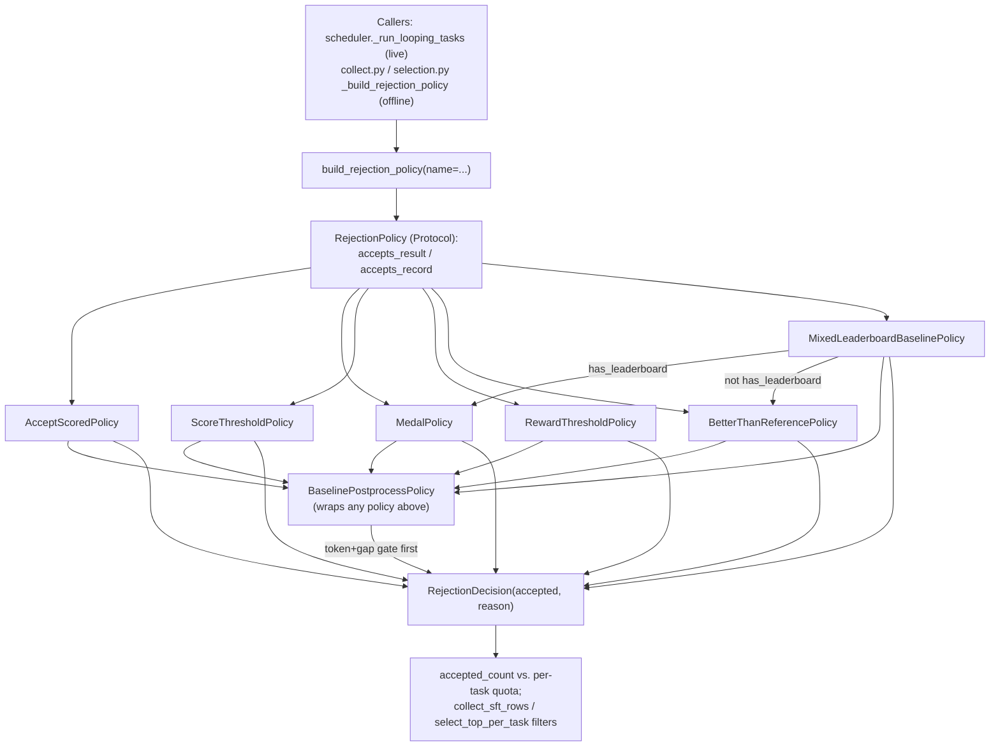

# Rejection policies — the SFT accept/reject quality gate (tts_search.services.rejection)

<!-- connect:up:begin -->
> **Cross-repo concept:** part of [closed-loop-experiment-design](../../../concepts/closed-loop-experiment-design.md), [verification-independence](../../../concepts/verification-independence.md) across this wiki's repos.
<!-- connect:up:end -->
## Overview
This module answers exactly one question for every evaluated candidate program the SFT collection
pipeline produces: *does this evaluated sample get kept for the dataset?* Its own module docstring states
the motivation directly — "Keeping that decision behind a policy makes it easy to swap filtering methods
without changing generation or sandbox evaluation code." The module has no notion of *which operator*
produced a candidate: it never inspects `generation_mode`, `parent_id`, or anything Draft/Improve/Debug/
Crossover-specific — it only ever looks at the candidate's *outcome* (score, reward, medal, token count,
validation/test gap). That is the load-bearing design fact for this repo's SFT layer: the same
[`build_rejection_policy`](../catalog/OpenMLE-ERL/SFT/tts_search/services/rejection.md#build_rejection_policy)
factory and the same handful of strategy classes are the quality gate for *both* collection paths the
paper describes — the parallel path of independently sampled Draft solutions and the evolutionary path of
Improve/Debug steps over already-scored programs — with the *quota* logic that decides how many attempts
each path gets living one layer up, in the scheduler.

## Diagram

## Design rationale (why it's built this way)
The [`RejectionPolicy`](../catalog/OpenMLE-ERL/SFT/tts_search/services/rejection.md#RejectionPolicy)
`typing.Protocol` exists so the exact same acceptance rule can be evaluated twice, under two different data
shapes, without duplicating the decision logic. Every concrete class implements both
[`accepts_result`](../catalog/OpenMLE-ERL/SFT/tts_search/services/rejection.md#RejectionPolicy.accepts_result)
(reads attributes off a live `EvaluationResult`-like object with `getattr`) and
[`accepts_record`](../catalog/OpenMLE-ERL/SFT/tts_search/services/rejection.md#RejectionPolicy.accepts_record)
(reads keys off a `Mapping` — a deserialized `eval_results.jsonl` row — with `.get`). The docstrings name
the intent precisely: `accepts_result` is for "an `EvaluationResult`-like object" during a live run;
`accepts_record` is for "a serialized `eval_results.jsonl` record" during offline replay or dataset
construction. This is what lets the identical policy object drive acceptance both while the scheduler is
still generating and evaluating (`_run_looping_tasks`) and, unchanged, when
[`rebuild_task_states_from_results`](../catalog/OpenMLE-ERL/SFT/tts_search/services/scheduler.md#rebuild_task_states_from_results)
replays already-written JSONL logs to resume a crashed run, or when the standalone dataset scripts
([`_build_rejection_policy`](../catalog/OpenMLE-ERL/SFT/tts_search/data_produce/collect.md#_build_rejection_policy)
in `collect.py`,
[`_build_rejection_policy`](../catalog/OpenMLE-ERL/SFT/tts_search/data_produce/selection.md#_build_rejection_policy)
in `selection.py`) post-process a finished run's logs into training rows.

The strategy family behind
[`build_rejection_policy`](../catalog/OpenMLE-ERL/SFT/tts_search/services/rejection.md#build_rejection_policy)
is a flat name→class table, not a strictness hierarchy: `"accept_scored"` (the default) only checks a
numeric score exists; `"medal"` checks a discrete Kaggle-style medal label against
[`MEDAL_LABELS`](../catalog/OpenMLE-ERL/SFT/tts_search/services/rejection.md#MEDAL_LABELS); `"score_threshold"`
/`"reward_threshold"` are fixed numeric cutoffs; `"better_than_reference"` requires beating an externally
supplied per-task reference score; and `"mixed"` (backed by
[`MixedLeaderboardBaselinePolicy`](../catalog/OpenMLE-ERL/SFT/tts_search/services/rejection.md#MixedLeaderboardBaselinePolicy))
picks between the medal check and the reference check *per task*, because not every OpenMLE-Gym task ships
a public leaderboard to earn a medal against. This mirrors the two feedback shapes OpenMLE-Gym tasks can
have (see [`wiki/sources/frontis-ma1.md`](../../../sources/frontis-ma1.md)): leaderboard-backed Kaggle
tasks get a medal-tier acceptance bar, everything else falls back to "did you beat a known reference
solution."

`"score_threshold"`, `"reward_threshold"` and `"better_than_reference"` all funnel through a private
`_decide` method per class rather than inlining the comparison in `accepts_result`/`accepts_record` —
[`_decide`](../catalog/OpenMLE-ERL/SFT/tts_search/services/rejection.md#BetterThanReferencePolicy._decide)
for `BetterThanReferencePolicy`,
[`_decide`](../catalog/OpenMLE-ERL/SFT/tts_search/services/rejection.md#RewardThresholdPolicy._decide) for
`RewardThresholdPolicy`,
[`_decide`](../catalog/OpenMLE-ERL/SFT/tts_search/services/rejection.md#ScoreThresholdPolicy._decide) for
`ScoreThresholdPolicy` — a small but consistent pattern that keeps the two public methods to a one-line
field-extraction difference and puts the actual comparison logic in exactly one place per class.

`BaselinePostprocessPolicy` is a decorator, not a seventh named strategy in the dispatch table. Its
docstring calls it "GLM-4.7-style token and valid-test gap filters" applied *before* a policy —
`build_rejection_policy`'s `apply_baseline_filters` flag wraps whichever policy the `name` argument selected
in
[`BaselinePostprocessPolicy`](../catalog/OpenMLE-ERL/SFT/tts_search/services/rejection.md#BaselinePostprocessPolicy),
so the token-length cap and the validation/test relative-gap check apply uniformly on top of any acceptance
rule instead of being reimplemented per strategy.

> [!inferred] The 2-vs-4 asymmetry in `mixed_leaderboard_target`/`mixed_no_leaderboard_target` (the default
> per-task accepted-example quotas `build_rejection_policy` bakes into a `MixedLeaderboardBaselinePolicy`)
> is not explained by any docstring or comment in this subgraph. A plausible reading is that earning *any*
> medal on a leaderboard task is an easier bar than beating a fixed reference score, so fewer accepted
> examples are needed to reach a comparable quality floor — but this is a guess, not a stated rationale.

## Entry points
- [`build_rejection_policy`](../catalog/OpenMLE-ERL/SFT/tts_search/services/rejection.md#build_rejection_policy) —
  the universal factory. Every caller in this subgraph reaches this module through it: it maps a config
  `name` string (`"all"`, `"accept_scored"`, `"medal"`, `"score_threshold"`, `"reward_threshold"`,
  `"better_than_reference"`, `"mixed"`) plus threshold/reference/medal/baseline-filter parameters onto one
  concrete `RejectionPolicy` instance, raising `ValueError` for missing thresholds or an unknown name.
- [`_run_looping_tasks`](../catalog/OpenMLE-ERL/SFT/tts_search/services/scheduler.md#Scheduler._run_looping_tasks) —
  the live entry point. Control reaches this module once per collection run, before any generation starts:
  the scheduler builds one `build_rejection_policy` instance from `SchedulerConfig` and reuses it for every
  subsequent `accepts_result` call as generations are evaluated.
- [`rebuild_task_states_from_results`](../catalog/OpenMLE-ERL/SFT/tts_search/services/scheduler.md#rebuild_task_states_from_results) —
  the resume entry point. When a `progress.json` snapshot is missing or untrustworthy, this function
  replays every historical `gen_results.jsonl` record to update per-task `generated_count`/`completed_count`
  bookkeeping, then separately replays every historical `eval_results.jsonl` record through
  [`accepts_record`](../catalog/OpenMLE-ERL/SFT/tts_search/services/rejection.md#RejectionPolicy.accepts_record)
  (building a fresh policy via `build_rejection_policy` if none is passed in) so a crashed run's per-task
  accepted counts can be recomputed exactly as if it had never stopped. Only the `eval_results.jsonl` pass
  calls `accepts_record` — the `gen_results.jsonl` pass never does.
- [`_build_rejection_policy`](../catalog/OpenMLE-ERL/SFT/tts_search/data_produce/collect.md#_build_rejection_policy)
  (in `collect.py`) and
  [`_build_rejection_policy`](../catalog/OpenMLE-ERL/SFT/tts_search/data_produce/selection.md#_build_rejection_policy)
  (in `selection.py`) — the two offline dataset-construction entry points, structurally identical: both are
  thin, lazily-importing wrappers around `build_rejection_policy` whose own docstrings state the reason —
  "avoid package import cycles" — because `data_produce` and `services` would otherwise import each other.
  `collect.py`'s caller gates every `eval_results.jsonl` row with the resulting policy's
  [`accepts_record`](../catalog/OpenMLE-ERL/SFT/tts_search/services/rejection.md#RejectionPolicy.accepts_record)
  before it is turned into an SFT training row.
- [`main`](../catalog/OpenMLE-ERL/SFT/third_party/aira-evo/examples/mle_bench/single_task_runner.md#main) —
  a third, independent integration point in the vendored AIRA-Dojo example harness
  (`third_party/aira-evo/examples/mle_bench/single_task_runner.py`), which also calls
  `build_rejection_policy` directly, showing this quality gate is reused outside the primary `tts_search`
  scheduler as well.

## Mechanism (step-by-step)
1. **Build once, reuse for the whole run.**
   [`build_rejection_policy`](../catalog/OpenMLE-ERL/SFT/tts_search/services/rejection.md#build_rejection_policy)
   is called exactly once per collection run — from
   [`_run_looping_tasks`](../catalog/OpenMLE-ERL/SFT/tts_search/services/scheduler.md#Scheduler._run_looping_tasks)
   before any task is dispatched, and again from
   [`main`](../catalog/OpenMLE-ERL/SFT/third_party/aira-evo/examples/mle_bench/single_task_runner.md#main)
   for the standalone harness. The returned object is immutable configuration plus pure decision logic, so
   every later accept/reject in that run is judged by the identical instance, not recomputed from raw
   config each time.
2. **A `RejectionDecision` is the uniform output no matter which strategy decided.**
   [`RejectionDecision`](../catalog/OpenMLE-ERL/SFT/tts_search/services/rejection.md#RejectionDecision) is a
   frozen two-field dataclass — `accepted: bool`, `reason: str` — and every policy, from the trivial
   `AcceptAllPolicy` to the composed `BaselinePostprocessPolicy`, returns one. The `reason` string always
   encodes *why* (e.g. `"score>=0.5"`, `"medal:gold"`, `"missing_reference_score"`), which is what lets a
   caller log a human-readable rejection reason instead of a bare boolean.
3. **`build_rejection_policy` dispatches on a name string to one of six strategy families**, each
   comparing a different signal: a numeric score
   ([`ScoreThresholdPolicy`](../catalog/OpenMLE-ERL/SFT/tts_search/services/rejection.md#ScoreThresholdPolicy)'s
   [`_decide`](../catalog/OpenMLE-ERL/SFT/tts_search/services/rejection.md#ScoreThresholdPolicy._decide)), a
   reward
   ([`RewardThresholdPolicy`](../catalog/OpenMLE-ERL/SFT/tts_search/services/rejection.md#RewardThresholdPolicy)'s
   [`_decide`](../catalog/OpenMLE-ERL/SFT/tts_search/services/rejection.md#RewardThresholdPolicy._decide)), a
   discrete medal label
   ([`MedalPolicy`](../catalog/OpenMLE-ERL/SFT/tts_search/services/rejection.md#MedalPolicy) against
   [`MEDAL_LABELS`](../catalog/OpenMLE-ERL/SFT/tts_search/services/rejection.md#MEDAL_LABELS)), or a score
   relative to an external reference
   ([`BetterThanReferencePolicy`](../catalog/OpenMLE-ERL/SFT/tts_search/services/rejection.md#BetterThanReferencePolicy)).
   `"accept_scored"` is the fallback default when no `name` is given at all.
4. **`MixedLeaderboardBaselinePolicy` routes each candidate to one of two inner policies per task,**
   deciding with
   [`has_leaderboard`](../catalog/OpenMLE-ERL/SFT/tts_search/services/rejection.md#MixedLeaderboardBaselinePolicy.has_leaderboard)
   (which delegates to
   [`_metadata_has_leaderboard`](../catalog/OpenMLE-ERL/SFT/tts_search/services/rejection.md#_metadata_has_leaderboard)):
   tasks with leaderboard signal go to an internally held
   [`_medal_policy`](../catalog/OpenMLE-ERL/SFT/tts_search/services/rejection.md#MixedLeaderboardBaselinePolicy._medal_policy),
   everything else to an internally held
   [`_reference_policy`](../catalog/OpenMLE-ERL/SFT/tts_search/services/rejection.md#MixedLeaderboardBaselinePolicy._reference_policy).
   Its own
   [`accepts_result`](../catalog/OpenMLE-ERL/SFT/tts_search/services/rejection.md#MixedLeaderboardBaselinePolicy.accepts_result)
   /
   [`accepts_record`](../catalog/OpenMLE-ERL/SFT/tts_search/services/rejection.md#MixedLeaderboardBaselinePolicy.accepts_record)
   both re-derive `has_leaderboard` per call rather than caching it, so the routing is recomputed for every
   candidate even within the same task.
5. **`_metadata_has_leaderboard` works from two unrelated signal sources**, whichever is present: an
   in-memory numeric range (`leaderboard_min`/`leaderboard_max`, sized by
   [`_range_size`](../catalog/OpenMLE-ERL/SFT/tts_search/services/rejection.md#_range_size)), or a
   filesystem probe for a `public_leaderboard.csv` under a `leaderboard_dir`/task name or a `data_dir`.
   This dual mode is what keeps the check working whether `metadata` came from a live generation (which can
   carry the numeric range) or from a replayed serialized record (which typically only carries directory
   paths).
6. **`BetterThanReferencePolicy` needs an external reference score per task**, loaded once at construction
   by
   [`load_reference_scores`](../catalog/OpenMLE-ERL/SFT/tts_search/services/rejection.md#load_reference_scores)
   (JSON dict, JSON list of records, or JSONL — all normalized into one
   [`_reference_scores`](../catalog/OpenMLE-ERL/SFT/tts_search/services/rejection.md#BetterThanReferencePolicy._reference_scores)
   dict keyed by stringified task id/name). Its
   [`_decide`](../catalog/OpenMLE-ERL/SFT/tts_search/services/rejection.md#BetterThanReferencePolicy._decide)
   looks up the reference by `task_id` first, `task_name` second, then compares direction-aware via
   [`_score_beats_reference`](../catalog/OpenMLE-ERL/SFT/tts_search/services/rejection.md#_score_beats_reference)
   and
   [`_lower_is_better`](../catalog/OpenMLE-ERL/SFT/tts_search/services/rejection.md#_lower_is_better) — so
   the same class correctly accepts either "higher score is better" or "lower loss is better" tasks purely
   from a `higher_is_better` metadata flag, with no separate policy class needed per metric direction.
7. **`BaselinePostprocessPolicy` gates on a hard token/gap check before ever consulting the wrapped
   policy.** Its
   [`_baseline_decision`](../catalog/OpenMLE-ERL/SFT/tts_search/services/rejection.md#BaselinePostprocessPolicy._baseline_decision)
   evaluates the candidate against an immutable
   [`_baseline_config`](../catalog/OpenMLE-ERL/SFT/tts_search/services/rejection.md#BaselinePostprocessPolicy._baseline_config)
   (a
   [`BaselineTokenGapConfig`](../catalog/OpenMLE-ERL/SFT/tts_search/data_produce/baseline_filter.md#BaselineTokenGapConfig)
   built from
   [`max_total_tokens`](../catalog/OpenMLE-ERL/SFT/tts_search/data_produce/baseline_filter.md#BaselineTokenGapConfig.max_total_tokens)
   and a nested
   [`gap_config`](../catalog/OpenMLE-ERL/SFT/tts_search/data_produce/baseline_filter.md#BaselineTokenGapConfig.gap_config)
   — a
   [`GapFilterConfig`](../catalog/OpenMLE-ERL/SFT/tts_search/data_produce/gap_filter.md#GapFilterConfig)
   whose
   [`max_relative_gap`](../catalog/OpenMLE-ERL/SFT/tts_search/data_produce/gap_filter.md#GapFilterConfig.max_relative_gap)
   and
   [`require_comparable`](../catalog/OpenMLE-ERL/SFT/tts_search/data_produce/gap_filter.md#GapFilterConfig.require_comparable)
   fields control it). Both
   [`accepts_result`](../catalog/OpenMLE-ERL/SFT/tts_search/services/rejection.md#BaselinePostprocessPolicy.accepts_result)
   and
   [`accepts_record`](../catalog/OpenMLE-ERL/SFT/tts_search/services/rejection.md#BaselinePostprocessPolicy.accepts_record)
   call `_baseline_decision` first and return its rejection immediately (`if not baseline.accepted: return
   baseline`) without ever invoking the inner policy — the token/gap filter is a hard prerequisite, not one
   vote among several.

## Key data structures
- [`RejectionDecision`](../catalog/OpenMLE-ERL/SFT/tts_search/services/rejection.md#RejectionDecision) — the
  one output shape (`accepted: bool`, `reason: str`) every policy converges on, regardless of which signal
  it inspected.
- [`RejectionPolicy`](../catalog/OpenMLE-ERL/SFT/tts_search/services/rejection.md#RejectionPolicy) — a
  `typing.Protocol` (structural, not a base class every implementation inherits from) requiring a `name`
  attribute plus `accepts_result`/`accepts_record`.
- [`MEDAL_LABELS`](../catalog/OpenMLE-ERL/SFT/tts_search/services/rejection.md#MEDAL_LABELS) — the frozen
  `{"gold", "silver", "bronze"}` vocabulary `MedalPolicy` and `MixedLeaderboardBaselinePolicy` check
  `submit_medal`/`medal` against.
- [`BaselineTokenGapConfig`](../catalog/OpenMLE-ERL/SFT/tts_search/data_produce/baseline_filter.md#BaselineTokenGapConfig)
  /
  [`GapFilterConfig`](../catalog/OpenMLE-ERL/SFT/tts_search/data_produce/gap_filter.md#GapFilterConfig) —
  the two frozen config dataclasses `BaselinePostprocessPolicy` composes into its
  [`_baseline_config`](../catalog/OpenMLE-ERL/SFT/tts_search/services/rejection.md#BaselinePostprocessPolicy._baseline_config):
  a token-count ceiling (default 32768) and a metric-aware validation/test relative-gap ceiling (default
  0.12, `require_comparable=True` by default so rows where the gap can't even be computed are dropped).
- Per-instance caches:
  [`_reference_scores`](../catalog/OpenMLE-ERL/SFT/tts_search/services/rejection.md#BetterThanReferencePolicy._reference_scores)
  (task→score dict, built once from disk),
  [`_accepted_medals`](../catalog/OpenMLE-ERL/SFT/tts_search/services/rejection.md#MedalPolicy._accepted_medals)
  (lower-cased medal set, defaults to all of `MEDAL_LABELS`), and
  [`_medal_policy`](../catalog/OpenMLE-ERL/SFT/tts_search/services/rejection.md#MixedLeaderboardBaselinePolicy._medal_policy)
  /
  [`_reference_policy`](../catalog/OpenMLE-ERL/SFT/tts_search/services/rejection.md#MixedLeaderboardBaselinePolicy._reference_policy)
  (the two inner policies `MixedLeaderboardBaselinePolicy` composes rather than subclasses).

## Dynamics (design intent)
Nothing in this subgraph is concurrent or has its own scheduling behavior — it is entirely synchronous,
side-effect-free decision logic (the only I/O is
[`load_reference_scores`](../catalog/OpenMLE-ERL/SFT/tts_search/services/rejection.md#load_reference_scores)
reading a reference file once at policy-construction time, and
[`_metadata_has_leaderboard`](../catalog/OpenMLE-ERL/SFT/tts_search/services/rejection.md#_metadata_has_leaderboard)'s
per-call filesystem existence checks). All concurrency and ordering belongs to the callers: the async
generation/evaluation loop lives in
[`_run_looping_tasks`](../catalog/OpenMLE-ERL/SFT/tts_search/services/scheduler.md#Scheduler._run_looping_tasks)'s
scheduler, not here. The "build once, call many times" pattern in
[`build_rejection_policy`](../catalog/OpenMLE-ERL/SFT/tts_search/services/rejection.md#build_rejection_policy)
means every policy instance is safe to share across concurrent callers precisely because its state
(`_reference_scores`, `_accepted_medals`, `_baseline_config`, …) is set once at construction and never
mutated afterward — a frozen-dataclass and set/dict-of-primitives design that requires no locking.

> [!inferred] The packet's own Evidence line notes that no tests in the configured test paths reference
> this subgraph, so the dynamics above are grounded in source structure (immutability, absence of `async`
> or shared mutable state) rather than in any observed or asserted test behavior.

## Edge cases
- **`apply_baseline_filters` is silently overridden for `"all"`/`"accept_all"`/`"none"` policies.** In
  [`_run_looping_tasks`](../catalog/OpenMLE-ERL/SFT/tts_search/services/scheduler.md#Scheduler._run_looping_tasks),
  the flag passed to
  [`build_rejection_policy`](../catalog/OpenMLE-ERL/SFT/tts_search/services/rejection.md#build_rejection_policy)
  is computed as `self._config.rejection_apply_baseline_filters and rejection_policy_name not in {"all",
  "accept_all", "none"}` — a config that requests baseline filtering *and* an accept-everything policy
  silently gets no baseline filtering at all, with no warning.
- **`reward_threshold` quietly falls back to `score_threshold`.**
  [`build_rejection_policy`](../catalog/OpenMLE-ERL/SFT/tts_search/services/rejection.md#build_rejection_policy)'s
  `"reward_threshold"` branch uses `reward_threshold if reward_threshold is not None else score_threshold` —
  passing only `score_threshold` for a reward-threshold policy works without error, mixing units silently
  unless the caller notices.
- **Direction defaults to "higher is better" when metadata says nothing.**
  [`_lower_is_better`](../catalog/OpenMLE-ERL/SFT/tts_search/services/rejection.md#_lower_is_better) returns
  `False` (higher-is-better) unless `metadata["higher_is_better"]` is explicitly `False` or a falsey string
  (`"false"`/`"0"`/`"no"`) — a loss-style metric whose metadata omits `higher_is_better` entirely will be
  compared in the wrong direction by
  [`BetterThanReferencePolicy`](../catalog/OpenMLE-ERL/SFT/tts_search/services/rejection.md#BetterThanReferencePolicy).
- **Reference lookup is an exact string match, never fuzzy.**
  [`_decide`](../catalog/OpenMLE-ERL/SFT/tts_search/services/rejection.md#BetterThanReferencePolicy._decide)
  tries `str(task_id)` then `str(task_name)` as dict keys into
  [`_reference_scores`](../catalog/OpenMLE-ERL/SFT/tts_search/services/rejection.md#BetterThanReferencePolicy._reference_scores)
  — any mismatch between the SFT run's task identifiers and the reference-scores file's keys rejects with
  `"missing_reference_score"` rather than erroring, which can look like every sample from a task is simply
  low quality when it is actually an ID-format mismatch.
- **`BaselinePostprocessPolicy`'s per-task quota forwarding is duck-typed and can silently disappear.**
  The composed `_medal_policy`/`_reference_policy` pair inside
  [`MixedLeaderboardBaselinePolicy`](../catalog/OpenMLE-ERL/SFT/tts_search/services/rejection.md#MixedLeaderboardBaselinePolicy)
  is what supplies a per-task quota target; wrapping any *other* policy (which has no such method) in
  [`BaselinePostprocessPolicy`](../catalog/OpenMLE-ERL/SFT/tts_search/services/rejection.md#BaselinePostprocessPolicy)
  silently loses the per-task quota differentiation and falls back to the loop's single flat target — there
  is no error, just a different quota behavior depending on which policy name was wrapped.

## Open questions
- The paper's parallel-path description is "threshold-filtered on score," but this module's *default*
  strategy (`"accept_scored"`, used whenever no `name` is configured) accepts every sample with *any*
  numeric score — not a threshold in the ordinary sense. Nothing in this subgraph pins down which named
  strategy (`ScoreThresholdPolicy`, `MixedLeaderboardBaselinePolicy`, or a `BaselinePostprocessPolicy`-
  wrapped variant) the released 17,245/9,014-example corpus was actually collected with; that choice lives
  in a run config outside this packet.
- A sibling analysis of `scheduler.py`'s wired search algorithm found that `GreedySearch` only ever labels
  generations `"draft"` or `"improve"` — "Debug" is a parent-selection heuristic inside the improve branch,
  and "Crossover" never appears. This module is consistent with that finding in one specific sense: it
  never reads `generation_mode` at all, so it could not special-case a Crossover step even if one existed.
  Whether any Crossover-labeled example ever reaches this quality gate elsewhere in the repo is not
  resolved by this subgraph.
- No test in the configured test paths references any symbol in this subgraph (per the packet's Evidence
  line), so none of the edge cases above have an executable regression guarding them.

## See also
- [`OpenMLE-ERL-SFT-tts_search-services-scheduler.md`](OpenMLE-ERL-SFT-tts_search-services-scheduler.md) —
  the orchestrator that builds one policy from this module per collection run and checks `accepted_count`
  against quota after every `accepts_result` call.
- [`../../../concepts/verification-independence.md`](../../../concepts/verification-independence.md) — this
  module's `MedalPolicy`/`BetterThanReferencePolicy`/gap-filter checks are how the SFT pipeline avoids
  taking a candidate's self-reported score at face value.
- [`../../../concepts/closed-loop-experiment-design.md`](../../../concepts/closed-loop-experiment-design.md) —
  the `RejectionDecision` this module returns is the feedback signal the collection loop's per-task quota
  state closes around.
- [`../../../sources/frontis-ma1.md`](../../../sources/frontis-ma1.md) — the paper section (§4.2) this
  module's threshold-filtering and per-task quota/execution-budget stopping rule implement.
