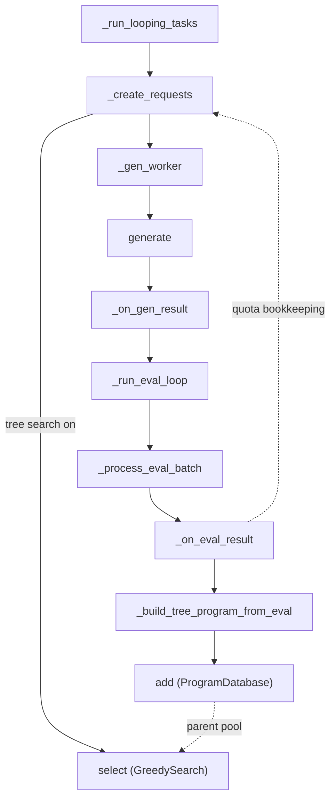

# Scheduler — the tts_search orchestrator behind the SFT evolutionary path

<!-- connect:up:begin -->
> **Cross-repo concept:** part of [closed-loop-experiment-design](../../../concepts/closed-loop-experiment-design.md), [evolutionary-algorithm-discovery](../../../concepts/evolutionary-algorithm-discovery.md), [program-evolution-operators](../../../concepts/program-evolution-operators.md), [verification-independence](../../../concepts/verification-independence.md) across this wiki's repos.
<!-- connect:up:end -->
## Overview
`Scheduler` is the top-level control loop that turns a list of OpenMLE-Gym tasks into the two kinds of
SFT training data Frontis-MA1's paper describes: independently sampled Draft solutions (the "parallel
path") and Improve/Debug trajectory steps built on top of already-executed programs (the "evolutionary
path"). It is one class with two personalities toggled by a single config flag
([`_tree_search_enabled`](../catalog/OpenMLE-ERL/SFT/tts_search/services/scheduler.md#Scheduler._tree_search_enabled)):
with tree search off, every request is a parentless Draft; with it on, each request's parent is chosen by
a `ProgramDatabase`-backed search algorithm (cited below) before generation. Both personalities share the
same decoupled producer/consumer machinery — one asyncio queue feeds LLM generation
([`_gen_worker`](../catalog/OpenMLE-ERL/SFT/tts_search/services/scheduler.md#Scheduler._gen_worker) calling
[`generate`](../catalog/OpenMLE-ERL/SFT/tts_search/services/generator.md#GeneratorService.generate)), a
second feeds sandbox evaluation
([`_run_eval_loop`](../catalog/OpenMLE-ERL/SFT/tts_search/services/scheduler.md#Scheduler._run_eval_loop)
calling
[`evaluate_batch`](../catalog/OpenMLE-ERL/SFT/tts_search/services/evaluator.md#EvaluatorService.evaluate_batch))
— and the same per-task quota bookkeeping decides, after every completed generation or evaluation, whether
that task needs another batch of attempts or is done.

## Diagram

## Design rationale (why it's built this way)
The whole class is built around a decoupling the module docstring states outright: "Generation runs
independently without waiting for evaluation" and "Evaluation is optional and consumes from async queue."
Sandbox execution is the slow, expensive leg (`sandbox_concurrency`, `job_timeout` up to an hour,
`wait_timeout` up to a day in `SchedulerConfig`), so
[`_gen_worker`](../catalog/OpenMLE-ERL/SFT/tts_search/services/scheduler.md#Scheduler._gen_worker) never
blocks on it — it hands a successful
[`generate`](../catalog/OpenMLE-ERL/SFT/tts_search/services/generator.md#GeneratorService.generate) result
to `_eval_queue` and immediately pulls the next generation request. On the consumer side,
[`_run_eval_loop`](../catalog/OpenMLE-ERL/SFT/tts_search/services/scheduler.md#Scheduler._run_eval_loop)'s
own docstring calls this a "fire-and-forget pattern": it keeps up to `sandbox_concurrency`
[`_process_eval_batch`](../catalog/OpenMLE-ERL/SFT/tts_search/services/scheduler.md#Scheduler._process_eval_batch)
tasks in flight and submits the next queued item the instant any one finishes, rather than waiting for a
full batch — a code comment directly below the docstring states the goal explicitly: "keep sandbox
concurrency saturated."

The quota logic is deliberately *not* "sample k, stop." Each task's target grows in increments
([`TaskLoopState.target_count`](../catalog/OpenMLE-ERL/SFT/tts_search/services/scheduler.md#TaskLoopState.target_count))
until either an accepted-example count is reached or a ceiling is hit — this is what lets easy tasks
terminate after one small batch while tasks whose samples keep getting rejected keep sampling, batch by
batch, until `loop_max_target` caps the spend. Crucially, what "accepted" means is a *pluggable* rejection
policy ([`build_rejection_policy`](../catalog/OpenMLE-ERL/SFT/tts_search/services/rejection.md#build_rejection_policy)),
decoupled from whether the sandbox run merely "succeeded" — a task can rack up many successful sandbox runs
that all fail a score/medal threshold and still keep sampling, because it is `accepted_count`, not
`success_count`, that the loop controller checks against the target.

The most surprising fact this module's source reveals: at the code level there are only **two**
`generation_mode` labels, `"draft"` and `"improve"` — never `"debug"` or `"crossover"`. Reading
[`select`](../catalog/OpenMLE-ERL/SFT/tts_search/greedy.md#GreedySearch.select) in full shows that "Debug"
is not a third mode; it is a parent-selection *heuristic* inside the `"improve"` branch — when a coin flip
picks debugging, the parent is drawn from `database.get_random_by_fitness(task_name, 0.0)` (a program with
non-positive fitness, i.e. a buggy one) instead of `database.get_best(task_name)`, but the `mode` string
handed to the prompt builder is still `"improve"` either way. "Crossover" (two parents) does not appear
anywhere in `select`'s control flow — `parent_program` is always a single `Program` or `None`. So this
scheduler's only wired search algorithm realizes Draft and Improve/Debug, but not Crossover; see Open
questions.

The scheduler also enforces a hard v1 restriction at two separate points — the constructor and, again,
inside
[`_run_looping_tasks`](../catalog/OpenMLE-ERL/SFT/tts_search/services/scheduler.md#Scheduler._run_looping_tasks)
itself both raise the identical `ValueError("tree_search_max_pending_per_task must be 1 in the v1
scheduler")` when tree search is on and `tree_search_max_pending_per_task != 1` — that only one node per
task may be in flight at a time when tree search is on, forcing `loop_increment` to `1` regardless of the
configured `loop_target_increment`. (The constructor enforces a second, distinct v1 restriction right next
to it — `tree_search_algorithm` must equal `"greedy"` before `self._search_algorithm = GreedySearch(...)`
is ever assigned — but that check gates *which algorithm* runs, not how many nodes may be in flight.) A
task's evolutionary chain is therefore strictly sequential: the next Improve/Debug parent can only be
selected once the previous node has been scored and written into `ProgramDatabase`.

## Entry points
- [`run_tasks`](../catalog/OpenMLE-ERL/SFT/tts_search/services/scheduler.md#Scheduler.run_tasks) — the
  public API a caller invokes with a task list and model name; it is a thin dispatcher that raises
  `ValueError("Loop is not enabled")` unless `SchedulerConfig.loop_enabled` is set, in which case it
  delegates everything to
  [`_run_looping_tasks`](../catalog/OpenMLE-ERL/SFT/tts_search/services/scheduler.md#Scheduler._run_looping_tasks).
  This confirms the looping/quota-driven mode is the only mode this module's collection pipeline actually
  supports.
- [`_run_looping_tasks`](../catalog/OpenMLE-ERL/SFT/tts_search/services/scheduler.md#Scheduler._run_looping_tasks) —
  where control lands for the entire run: it builds the rejection policy, resumes or rebuilds per-task
  `TaskLoopState`, opens the evaluator context manager, wires the `_on_gen_result`/`_on_eval_result` hooks,
  seeds the initial generation requests, and blocks on `done_event` until every task's state reaches
  `done`.
- [`_gen_worker`](../catalog/OpenMLE-ERL/SFT/tts_search/services/scheduler.md#Scheduler._gen_worker) — the
  coroutine body run `llm_concurrency` times concurrently; control reaches it once per queued
  `GenerationRequest`, and it is where an LLM call, a bounded retry loop, and hand-off to the eval queue
  all live.
- [`_run_eval_loop`](../catalog/OpenMLE-ERL/SFT/tts_search/services/scheduler.md#Scheduler._run_eval_loop) —
  the single coroutine (not one-per-worker, unlike generation) that control reaches once `_gen_worker`
  starts pushing onto `_eval_queue`; it owns the fire-and-forget submission of
  [`_process_eval_batch`](../catalog/OpenMLE-ERL/SFT/tts_search/services/scheduler.md#Scheduler._process_eval_batch)
  tasks against the sandbox.

## Mechanism (step-by-step)
1. **Configure the round's stopping rule before touching any task.**
   [`_run_looping_tasks`](../catalog/OpenMLE-ERL/SFT/tts_search/services/scheduler.md#Scheduler._run_looping_tasks)
   reads [`_config`](../catalog/OpenMLE-ERL/SFT/tts_search/services/scheduler.md#Scheduler._config) once to
   derive `loop_increment` (forced to `1` under tree search), the target accept count, and a
   [`build_rejection_policy`](../catalog/OpenMLE-ERL/SFT/tts_search/services/rejection.md#build_rejection_policy)
   instance — every later accept/reject and every quota advance in this run is judged by that one policy
   object, not recomputed per sample.
2. **Resume state before generating anything new.** Per-task
   [`TaskLoopState`](../catalog/OpenMLE-ERL/SFT/tts_search/services/scheduler.md#TaskLoopState) is either
   restored from a `progress.json` snapshot via
   [`build_task_states_from_progress`](../catalog/OpenMLE-ERL/SFT/tts_search/services/scheduler.md#build_task_states_from_progress)
   or, if that snapshot is missing/untrustworthy (tree search resume, or medal-metric snapshots lacking
   medal counts), rebuilt from the raw `gen_results.jsonl`/`eval_results.jsonl` records via
   [`rebuild_task_states_from_results`](../catalog/OpenMLE-ERL/SFT/tts_search/services/scheduler.md#rebuild_task_states_from_results),
   which replays every historical record through the same rejection policy to recompute
   [`target_count`](../catalog/OpenMLE-ERL/SFT/tts_search/services/scheduler.md#TaskLoopState.target_count)
   and [`done`](../catalog/OpenMLE-ERL/SFT/tts_search/services/scheduler.md#TaskLoopState.done) as if the
   run had never stopped.
3. **Turn quota into a concrete generation request, optionally with a parent.**
   [`_create_requests`](../catalog/OpenMLE-ERL/SFT/tts_search/services/scheduler.md#Scheduler._create_requests)
   is the only place a `step_index`/`request_id` is minted; it clamps the requested count to
   `target_count - generated_count - pending_gen` under a lock so two callers can never double-count the
   same slot. When tree search is enabled it calls
   [`select`](../catalog/OpenMLE-ERL/SFT/tts_search/greedy.md#GreedySearch.select) against the live
   [`_database`](../catalog/OpenMLE-ERL/SFT/tts_search/services/scheduler.md#Scheduler._database) to pick
   Draft/Improve(/Debug) and a parent
   [`Program`](../catalog/OpenMLE-ERL/SFT/tts_search/program_database.md#Program), then folds
   `parent_id`/`generation_mode` into the request's `search_metadata` so the lineage survives all the way to
   the eventual database row.
4. **Generate, with bounded silent retry.**
   [`_gen_worker`](../catalog/OpenMLE-ERL/SFT/tts_search/services/scheduler.md#Scheduler._gen_worker) calls
   [`generate`](../catalog/OpenMLE-ERL/SFT/tts_search/services/generator.md#GeneratorService.generate); on
   failure it re-enqueues the *same* `request_id` (up to `gen_retry_max` times) without ever calling
   `_on_gen_result` or writing a `gen_results.jsonl` record for the failed attempt — a transient LLM error
   is invisible to the quota bookkeeping, it only ever sees the final outcome per logical step.
5. **A finished generation both records progress and may immediately ask for more.**
   [`_on_gen_result`](../catalog/OpenMLE-ERL/SFT/tts_search/services/scheduler.md#Scheduler._on_gen_result)
   increments `generated_count`/decrements `pending_gen` on the task's
   [`TaskLoopState`](../catalog/OpenMLE-ERL/SFT/tts_search/services/scheduler.md#TaskLoopState), then calls
   [`advance_after_completion`](../catalog/OpenMLE-ERL/SFT/tts_search/services/generation_loop.md#GenerationLoopController.advance_after_completion)
   — the return value is literally "how many more generations to queue right now," so a failed/unevaluated
   generation under `enable_sandbox_eval=False` can trigger the very next request synchronously, in the
   same coroutine.
6. **Evaluation is a single always-on consumer, not one per generation worker.**
   [`_run_eval_loop`](../catalog/OpenMLE-ERL/SFT/tts_search/services/scheduler.md#Scheduler._run_eval_loop)
   drains `_eval_queue` and submits generation results to
   [`_process_eval_batch`](../catalog/OpenMLE-ERL/SFT/tts_search/services/scheduler.md#Scheduler._process_eval_batch)
   one at a time, which in turn calls
   [`evaluate`](../catalog/OpenMLE-ERL/SFT/tts_search/services/evaluator.md#EvaluatorService.evaluate) /
   [`evaluate_batch`](../catalog/OpenMLE-ERL/SFT/tts_search/services/evaluator.md#EvaluatorService.evaluate_batch)
   against a sandbox process the LLM never talks to directly; a crashing evaluation is converted into a
   normal failed
   [`EvaluationResult`](../catalog/OpenMLE-ERL/SFT/tts_search/services/evaluator.md#EvaluationResult) by
   [`_build_internal_error_result`](../catalog/OpenMLE-ERL/SFT/tts_search/services/evaluator.md#EvaluatorService._build_internal_error_result)
   rather than aborting the batch.
7. **A finished evaluation decides acceptance, writes the population, and re-arms the quota.**
   [`_on_eval_result`](../catalog/OpenMLE-ERL/SFT/tts_search/services/scheduler.md#Scheduler._on_eval_result)
   calls the memoized rejection check, then — only under tree search — builds a
   [`Program`](../catalog/OpenMLE-ERL/SFT/tts_search/program_database.md#Program) via
   [`_build_tree_program_from_eval`](../catalog/OpenMLE-ERL/SFT/tts_search/services/scheduler.md#Scheduler._build_tree_program_from_eval)
   and inserts it with
   [`add`](../catalog/OpenMLE-ERL/SFT/tts_search/program_database.md#ProgramDatabase.add) — this is the
   moment a node becomes eligible to be sampled as a future parent. It then calls
   [`advance_after_completion`](../catalog/OpenMLE-ERL/SFT/tts_search/services/generation_loop.md#GenerationLoopController.advance_after_completion)
   again, this time against `completed_count`/`accepted_count`, which is what actually flips a task's
   [`done`](../catalog/OpenMLE-ERL/SFT/tts_search/services/scheduler.md#TaskLoopState.done) flag or grows
   its target for another round.
8. **The evolving tree is written to disk, not just kept in memory.**
   [`_write_tree_search_state`](../catalog/OpenMLE-ERL/SFT/tts_search/services/scheduler.md#Scheduler._write_tree_search_state)
   snapshots every `Program` currently in `_database` for the task (id, score, fitness, parent, code path)
   after each accepted/rejected evaluation, and
   [`_eval_record_search_metadata`](../catalog/OpenMLE-ERL/SFT/tts_search/services/scheduler.md#Scheduler._eval_record_search_metadata)
   attaches the same lineage (`parent_ids`, `generation_mode`, `fitness`, acceptance decision) directly onto
   the `eval_results.jsonl` record — its return dict is merged straight into `_process_eval_batch`'s
   `eval_record` before that record is written, with no
   [`SearchEvent`](../catalog/OpenMLE-ERL/SFT/tts_search/services/tree_search_state.md#SearchEvent)
   involved. A `SearchEvent` carrying the same lineage fields *is* built, but as a separate append-only
   artifact — `_on_gen_result`/`_on_eval_result` write it to a different file, `search_events.jsonl`, via
   `append_search_event` — so a crashed run can be resumed (step 2) with the exact same parent pool it had
   before the crash, whether from the `eval_results.jsonl` records or from `search_events.jsonl`.
9. **The run ends and results are assembled per task, independent of the live event stream.**
   Once every `TaskLoopState.done` is true the worker pool and eval loop are drained, and
   [`_create_task_result`](../catalog/OpenMLE-ERL/SFT/tts_search/services/scheduler.md#Scheduler._create_task_result)
   re-derives each task's `TaskResult` — best program by
   [`reward`](../catalog/OpenMLE-ERL/SFT/tts_search/services/evaluator.md#EvaluationResult.reward), medal
   counts, total cost — from the accumulated `all_gen_results`/`all_eval_results` lists rather than from
   `TaskLoopState`, so this final pass is a pure re-derivation, not a second source of truth for whether a
   task stopped.

## Key data structures
- [`TaskLoopState`](../catalog/OpenMLE-ERL/SFT/tts_search/services/scheduler.md#TaskLoopState) — the entire
  per-task quota state machine: `target_count`/`generated_count`/`pending_gen` gate how many new requests
  [`_create_requests`](../catalog/OpenMLE-ERL/SFT/tts_search/services/scheduler.md#Scheduler._create_requests)
  may mint; `completed_count`/`accepted_count` (checked against `accepted_target`) are what
  [`advance_after_completion`](../catalog/OpenMLE-ERL/SFT/tts_search/services/generation_loop.md#GenerationLoopController.advance_after_completion)
  reads to decide whether the task grows its target or sets
  [`done`](../catalog/OpenMLE-ERL/SFT/tts_search/services/scheduler.md#TaskLoopState.done).
- [`Program`](../catalog/OpenMLE-ERL/SFT/tts_search/program_database.md#Program) — the durable unit the
  evolutionary path produces: `code`, `reward`/`base_reward`,
  [`fitness`](../catalog/OpenMLE-ERL/SFT/tts_search/program_database.md#Program.fitness) (defaults to
  `reward` if unset), `parent_id`/`parent_code`, `generation_mode`, and a free-form
  [`metadata`](../catalog/OpenMLE-ERL/SFT/tts_search/program_database.md#Program.metadata) dict that
  [`_build_tree_program_from_eval`](../catalog/OpenMLE-ERL/SFT/tts_search/services/scheduler.md#Scheduler._build_tree_program_from_eval)
  stuffs with everything needed to reconstruct the SFT training turn later (`request_messages`,
  `reasoning_content`, `accepted_by_rejection_policy`, `rejection_reason`, `code_path`).
- [`GenerationResult`](../catalog/OpenMLE-ERL/SFT/tts_search/services/generator.md#GenerationResult) /
  [`EvaluationResult`](../catalog/OpenMLE-ERL/SFT/tts_search/services/evaluator.md#EvaluationResult) — the
  two per-attempt records correlated purely by
  [`request_id`](../catalog/OpenMLE-ERL/SFT/tts_search/services/generator.md#GenerationResult.request_id).
  `GenerationResult`'s own
  [`success`](../catalog/OpenMLE-ERL/SFT/tts_search/services/generator.md#GenerationResult.success) property
  (`error is None and code != ""`) is only a *generation*-level check — it says nothing about whether the
  sandbox scored the code well enough to be accepted, which
  [`_decision_for_eval`](../catalog/OpenMLE-ERL/SFT/tts_search/services/scheduler.md#Scheduler._decision_for_eval)
  (Mechanism step 7) checks separately against the `EvaluationResult`.
- `_gen_progress` / `_eval_progress`
  ([`_gen_progress`](../catalog/OpenMLE-ERL/SFT/tts_search/services/scheduler.md#Scheduler._gen_progress),
  [`_eval_progress`](../catalog/OpenMLE-ERL/SFT/tts_search/services/scheduler.md#Scheduler._eval_progress))
  — two independent counters (not one shared "progress"), consistent with the module doctring's claim that
  generation and evaluation are tracked separately; both are mutated only while holding
  [`_progress_lock`](../catalog/OpenMLE-ERL/SFT/tts_search/services/scheduler.md#Scheduler._progress_lock).

## Dynamics (design intent)
Everything in this module is single-process `asyncio`, not multi-process: concurrency comes from
`llm_concurrency`
copies of [`_gen_worker`](../catalog/OpenMLE-ERL/SFT/tts_search/services/scheduler.md#Scheduler._gen_worker)
racing to pull off one shared `gen_queue`, plus up to `sandbox_concurrency` in-flight
[`_process_eval_batch`](../catalog/OpenMLE-ERL/SFT/tts_search/services/scheduler.md#Scheduler._process_eval_batch)
tasks managed by the single
[`_run_eval_loop`](../catalog/OpenMLE-ERL/SFT/tts_search/services/scheduler.md#Scheduler._run_eval_loop)
coroutine. Every mutation of shared counters or task state acquires
[`_progress_lock`](../catalog/OpenMLE-ERL/SFT/tts_search/services/scheduler.md#Scheduler._progress_lock) (a
plain `asyncio.Lock`, so this provides ordering within one event loop, not cross-process safety) — and
[`_gen_worker`](../catalog/OpenMLE-ERL/SFT/tts_search/services/scheduler.md#Scheduler._gen_worker) wraps
every acquire in a 5-second `asyncio.wait_for` and only logs an error on timeout rather than deadlocking,
which means a starved lock degrades progress-counter accuracy rather than halting the pipeline. Tree-search
generation is throttled to exactly one in-flight node per task
(`tree_search_max_pending_per_task == 1`, enforced as noted above), so within a single task the
Draft→Improve/Debug chain is a strict sequence even though many *different* tasks' chains advance
concurrently through the same worker pool.

## Edge cases
- **"Debug" is opportunistic, not guaranteed.** In
  [`select`](../catalog/OpenMLE-ERL/SFT/tts_search/greedy.md#GreedySearch.select), even when the debug coin
  flip succeeds, `database.get_random_by_fitness(task_name, 0.0)` can return `None` (no program with
  non-positive fitness yet exists) — the code falls straight through to `database.get_best(task_name)`, so
  a "debug-selected" step silently becomes a normal Improve step with the best-scoring parent.
- **A generation that never gets evaluated can still be terminal for its task.** When
  `enable_sandbox_eval` is `False`, or a generation itself fails,
  [`_on_gen_result`](../catalog/OpenMLE-ERL/SFT/tts_search/services/scheduler.md#Scheduler._on_gen_result)
  increments `completed_count` directly (never routing through `_eval_queue`/`_on_eval_result` at all) —
  the two code paths that can mark a task's completion overlap but are not identical, and a reader tracing
  only the eval-side hooks will miss this route.
- **Retries never touch `step_index` bookkeeping.** Because a retried
  [`_gen_worker`](../catalog/OpenMLE-ERL/SFT/tts_search/services/scheduler.md#Scheduler._gen_worker) attempt
  reuses the original `request_id`/`step_index` and skips `_on_gen_result`, `gen_retry_max=None` (infinite
  retries, the module's own default note) means a persistently-failing generation for one step can loop
  forever without ever advancing `generated_count` — nothing in this subgraph bounds that case besides the
  configured max.
- **[`_decision_for_eval`](../catalog/OpenMLE-ERL/SFT/tts_search/services/scheduler.md#Scheduler._decision_for_eval)
  caches per `request_id`, so the token-count side effect runs once.** Both
  [`_on_eval_result`](../catalog/OpenMLE-ERL/SFT/tts_search/services/scheduler.md#Scheduler._on_eval_result)
  and
  [`_eval_record_search_metadata`](../catalog/OpenMLE-ERL/SFT/tts_search/services/scheduler.md#Scheduler._eval_record_search_metadata)
  call the same acceptance check for the same result; the second call is a cache hit and
  [`_attach_slime_message_token_count`](../catalog/OpenMLE-ERL/SFT/tts_search/services/scheduler.md#Scheduler._attach_slime_message_token_count)'s
  own `getattr(..., None) is not None: return` guard means the (potentially expensive) tokenizer call never
  runs twice for one evaluation.

## Open questions
- Where does the paper's "Crossover" operator (two parents) get produced, if anywhere? Reading
  [`select`](../catalog/OpenMLE-ERL/SFT/tts_search/greedy.md#GreedySearch.select) in full shows only
  single-parent Draft/Improve(/Debug) selection, and this repo has exactly one `SearchAlgorithm`
  implementation wired into the scheduler (`GreedySearch`, enforced by a `ValueError` on construction if
  `tree_search_algorithm != "greedy"`). Either Crossover is produced by a component entirely outside this
  subgraph, or the 9,014-example "evolutionary path" the paper describes only realizes three of its four
  named operators through this scheduler.
- This subgraph shows *where* `Program`/`TaskResult` records get written (`gen_results.jsonl`,
  `eval_results.jsonl`, the `ProgramDatabase`), but not the downstream step that filters/formats them into
  the paper's reported 17,245 (parallel) / 9,014 (evolutionary) SFT example counts — that logic is not part
  of this packet.
- `SchedulerConfig.tree_search_algorithm` is a free-form string field, but the constructor only ever
  accepts `"greedy"`. Whether this is a stable v1 restriction or scaffolding for an unimplemented
  alternative search algorithm isn't settled by anything in this subgraph.

## See also
- [`OpenMLE-ERL-SFT-tts_search-services-evaluator.md`](OpenMLE-ERL-SFT-tts_search-services-evaluator.md) —
  `EvaluatorService`, the sandbox-execution side this module's `_process_eval_batch` drives.
- [`OpenMLE-ERL-SFT-tts_search-services-generator.md`](OpenMLE-ERL-SFT-tts_search-services-generator.md) —
  `GeneratorService`, the LLM-call side `_gen_worker` drives.
- [`OpenMLE-ERL-SFT-tts_search-services-generation_loop.md`](OpenMLE-ERL-SFT-tts_search-services-generation_loop.md) —
  `GenerationLoopController`, the quota-advance policy this page's mechanism calls at every completion.
- [`OpenMLE-ERL-SFT-tts_search-services-rejection.md`](OpenMLE-ERL-SFT-tts_search-services-rejection.md) —
  the pluggable accept/reject policies `build_rejection_policy` selects among.
- [`OpenMLE-ERL-SFT-tts_search-greedy.md`](OpenMLE-ERL-SFT-tts_search-greedy.md) — `GreedySearch`, the only
  wired parent-selection algorithm for the evolutionary path.
- [`OpenMLE-ERL-SFT-tts_search-program_database.md`](OpenMLE-ERL-SFT-tts_search-program_database.md) — the
  `ProgramDatabase` population store this module reads parents from and writes accepted programs into.
- [`../../../concepts/evolutionary-algorithm-discovery.md`](../../../concepts/evolutionary-algorithm-discovery.md),
  [`../../../concepts/program-evolution-operators.md`](../../../concepts/program-evolution-operators.md),
  [`../../../concepts/closed-loop-experiment-design.md`](../../../concepts/closed-loop-experiment-design.md),
  [`../../../concepts/verification-independence.md`](../../../concepts/verification-independence.md) — the
  cross-repo concepts this scheduler instantiates.
