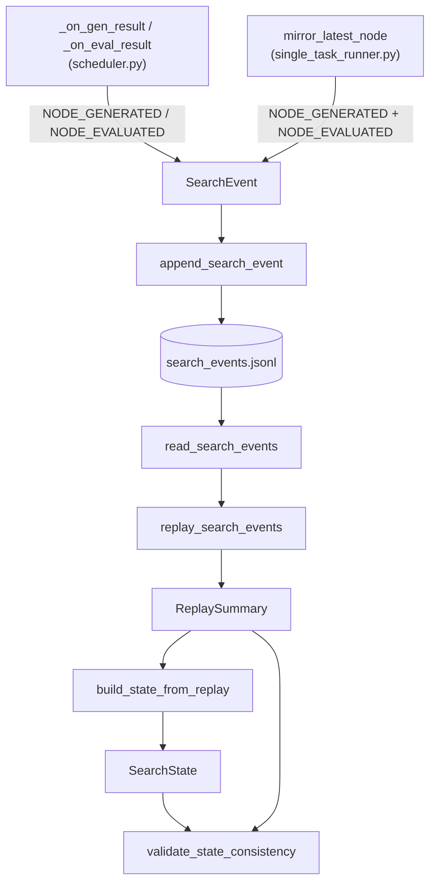

# Tree-search state — the append-only event log and resumable snapshot behind SFT collection

<!-- connect:up:begin -->
> **Cross-repo concept:** part of [agentic-tree-search](../../../concepts/agentic-tree-search.md), [program-evolution-operators](../../../concepts/program-evolution-operators.md) across this wiki's repos.
<!-- connect:up:end -->
## Overview
`tree_search_state.py` is the shared persistence substrate underneath tts_search's tree-shaped SFT-collection
runs: one node is one generated-and-optionally-evaluated program, identified by `program_id`, and one edge is
that program's `parent_ids` tagged with the `generation_mode` that produced it. The module doesn't run search
itself — it defines one immutable per-node fact
([`SearchEvent`](../catalog/OpenMLE-ERL/SFT/tts_search/services/tree_search_state.md#SearchEvent)), one
mutable resumable snapshot
([`SearchState`](../catalog/OpenMLE-ERL/SFT/tts_search/services/tree_search_state.md#SearchState)), and a
replay path that turns a log of the former into a fresh copy of the latter
([`replay_search_events`](../catalog/OpenMLE-ERL/SFT/tts_search/services/tree_search_state.md#replay_search_events),
[`build_state_from_replay`](../catalog/OpenMLE-ERL/SFT/tts_search/services/tree_search_state.md#build_state_from_replay)).
Two independent search engines write into it — the async `GreedySearch` loop in `scheduler.py`, and the
third-party AIRA-Dojo `Evolutionary` solver wrapped by `single_task_runner.py` — but only one of them reads it
back the way the module intends. `scheduler.py` calls
[`append_search_event`](../catalog/OpenMLE-ERL/SFT/tts_search/services/tree_search_state.md#append_search_event)
after every completed generation and evaluation, yet never calls
[`read_search_events`](../catalog/OpenMLE-ERL/SFT/tts_search/services/tree_search_state.md#read_search_events)
or
[`replay_search_events`](../catalog/OpenMLE-ERL/SFT/tts_search/services/tree_search_state.md#replay_search_events)
anywhere in the file: its own resume path rebuilds the program database from a separate
`gen_results.jsonl`/`eval_results.jsonl` log, and the `SearchState` it persists is assembled directly from
that live database, not replayed from this module's event log (see Edge cases). Only `single_task_runner.py`'s
AIRA-Dojo integration actually reads this module's log back, via
[`read_search_events`](../catalog/OpenMLE-ERL/SFT/tts_search/services/tree_search_state.md#read_search_events)/[`replay_search_events`](../catalog/OpenMLE-ERL/SFT/tts_search/services/tree_search_state.md#replay_search_events).
Because every event carries `parent_ids` and `generation_mode`, and because replay reconstructs a full
`parent_map`/`generation_modes` index keyed by `program_id`, this module is exactly the graph a downstream
process would need to walk to trace a Debug-repair chain back to its last non-Debug ancestor — though, as the
Open questions section below shows from reading the actual downstream script, the shipped SFT-selection code
does that walk over a *different*, independently rebuilt index, not this one.

## Diagram

## Design rationale (why it's built this way)
The module splits state into an append-only fact log and a derived, overwritable rollup — a small
event-sourcing pattern rather than a database. `SearchEvent`'s own docstring calls it "[a]ppend-only event for
one generated or evaluated tree-search node," while
[`SearchState`](../catalog/OpenMLE-ERL/SFT/tts_search/services/tree_search_state.md#SearchState)'s docstring
calls it "[c]urrent resumable state for one task's tree-search run" — one is a fact that, once written, is
never revisited; the other is a single mutable point-in-time summary a process reads back to know where to
pick up. This buys crash-resume without a real database: as long as the JSONL log is intact, the "current"
state can always be rederived.

That rederivation is deliberately idempotent.
[`replay_search_events`](../catalog/OpenMLE-ERL/SFT/tts_search/services/tree_search_state.md#replay_search_events)'s
docstring says it plainly — "Replay events with idempotent counters keyed by
[`program_id`](../catalog/OpenMLE-ERL/SFT/tts_search/services/tree_search_state.md#SearchEvent.program_id)" —
and the source backs it up: the ordered
[`program_ids`](../catalog/OpenMLE-ERL/SFT/tts_search/services/tree_search_state.md#ReplaySummary.program_ids)
list is built via a dedup set, `next_search_step` is a running `max`, `stop_requested` is an OR-reduction, and
[`parent_map`](../catalog/OpenMLE-ERL/SFT/tts_search/services/tree_search_state.md#ReplaySummary.parent_map)/
[`generation_modes`](../catalog/OpenMLE-ERL/SFT/tts_search/services/tree_search_state.md#ReplaySummary.generation_modes)/
`program_code_paths` are overwritten per `program_id` only when the new event actually carries a truthy value.
Replaying the same log twice, or a log where one `program_id` was logged more than once, produces the same
[`ReplaySummary`](../catalog/OpenMLE-ERL/SFT/tts_search/services/tree_search_state.md#ReplaySummary) either
way — which matters because, as the Mechanism section shows, one of the two producers actually *does* replay
the whole log from scratch after every single node.

Durability is `append_search_event`'s job, not `SearchEvent`'s: the record type only validates shape
(`event_type` must be `NODE_GENERATED`/`NODE_EVALUATED`, `search_step` must be non-negative, `program_id` must
be non-empty), while
[`append_search_event`](../catalog/OpenMLE-ERL/SFT/tts_search/services/tree_search_state.md#append_search_event)
itself flushes and `os.fsync`s the file handle before returning, so a process kill immediately afterward still
leaves that event durable on disk for the next replay to pick up.

## Entry points
- [`append_search_event`](../catalog/OpenMLE-ERL/SFT/tts_search/services/tree_search_state.md#append_search_event) —
  the only write path into the log. Control reaches it from
  [`_on_gen_result`](../catalog/OpenMLE-ERL/SFT/tts_search/services/scheduler.md#Scheduler._on_gen_result) and
  [`_on_eval_result`](../catalog/OpenMLE-ERL/SFT/tts_search/services/scheduler.md#Scheduler._on_eval_result) in
  `scheduler.py` — once each, after every completed generation and every completed evaluation — and from
  [`mirror_latest_node`](../catalog/OpenMLE-ERL/SFT/third_party/aira-evo/examples/mle_bench/single_task_runner.md#main.mirror_latest_node)
  in `single_task_runner.py`, which calls it twice back-to-back (a `NODE_GENERATED` event immediately followed
  by a `NODE_EVALUATED` one) for a single finished node.
- [`main`](../catalog/OpenMLE-ERL/SFT/third_party/aira-evo/examples/mle_bench/single_task_runner.md#main) —
  the resume path. At process start it calls
  [`read_search_events`](../catalog/OpenMLE-ERL/SFT/tts_search/services/tree_search_state.md#read_search_events)
  then
  [`replay_search_events`](../catalog/OpenMLE-ERL/SFT/tts_search/services/tree_search_state.md#replay_search_events)
  on whatever `search_events.jsonl` already exists for the task, and seeds its local
  [`accepted_count`](../catalog/OpenMLE-ERL/SFT/tts_search/services/tree_search_state.md#ReplaySummary.accepted_count)/
  [`generated_count`](../catalog/OpenMLE-ERL/SFT/tts_search/services/tree_search_state.md#ReplaySummary.generated_count)/
  [`completed_count`](../catalog/OpenMLE-ERL/SFT/tts_search/services/tree_search_state.md#ReplaySummary.completed_count)
  from it before deciding whether the task's target is already met.
- [`build_state_from_replay`](../catalog/OpenMLE-ERL/SFT/tts_search/services/tree_search_state.md#build_state_from_replay)
  and
  [`validate_state_consistency`](../catalog/OpenMLE-ERL/SFT/tts_search/services/tree_search_state.md#validate_state_consistency) —
  formally the module's reconciliation entry points (turn a replay into a fresh
  [`SearchState`](../catalog/OpenMLE-ERL/SFT/tts_search/services/tree_search_state.md#SearchState); raise if a
  persisted `SearchState`'s counters disagree with a fresh replay). A repo-wide search for callers of either
  name, across both producers and every script in this release, finds none — control is never actually routed
  through them (see Open questions).

## Mechanism (step-by-step)
1. **A finished generation or evaluation becomes one immutable fact.** In `scheduler.py`'s async pipeline this
   happens twice, independently:
   [`_on_gen_result`](../catalog/OpenMLE-ERL/SFT/tts_search/services/scheduler.md#Scheduler._on_gen_result)
   appends a [`SearchEvent`](../catalog/OpenMLE-ERL/SFT/tts_search/services/tree_search_state.md#SearchEvent)
   tagged
   [`NODE_GENERATED`](../catalog/OpenMLE-ERL/SFT/tts_search/services/tree_search_state.md#NODE_GENERATED) the
   moment an LLM call returns code, and — later, once the sandbox has scored it —
   [`_on_eval_result`](../catalog/OpenMLE-ERL/SFT/tts_search/services/scheduler.md#Scheduler._on_eval_result)
   appends a second one tagged
   [`NODE_EVALUATED`](../catalog/OpenMLE-ERL/SFT/tts_search/services/tree_search_state.md#NODE_EVALUATED) for
   the same `program_id`, this time carrying score, fitness, and
   [`accepted_by_rejection_policy`](../catalog/OpenMLE-ERL/SFT/tts_search/services/tree_search_state.md#SearchEvent.accepted_by_rejection_policy).
   [`mirror_latest_node`](../catalog/OpenMLE-ERL/SFT/third_party/aira-evo/examples/mle_bench/single_task_runner.md#main.mirror_latest_node),
   driving the alternate AIRA-Dojo `Evolutionary`-solver integration where generation and evaluation aren't
   decoupled, instead appends both event types for one node the instant it finishes, threading through
   [`parent_ids`](../catalog/OpenMLE-ERL/SFT/tts_search/services/tree_search_state.md#SearchEvent.parent_ids)
   and [`generation_mode`](../catalog/OpenMLE-ERL/SFT/tts_search/services/tree_search_state.md#SearchEvent.generation_mode)
   read straight off the underlying AIRA node's own `operators_used[0]` — the one path in the whole tts_search
   stack where an event's `generation_mode` can genuinely read `"debug"` or `"crossover"`, since the
   `Evolutionary` solver it wraps has real `_draft`/`_improve`/`_debug`/`_crossover` operator methods, unlike
   `scheduler.py`'s `GreedySearch`, which (per the sibling `scheduler.py` page) only ever emits `"draft"` or
   `"improve"`.
2. **Every fact is durable before control returns.**
   [`append_search_event`](../catalog/OpenMLE-ERL/SFT/tts_search/services/tree_search_state.md#append_search_event)
   opens the JSONL log in append mode, writes one line, then flushes and `fsync`s before returning — nothing in
   [`SearchEvent`](../catalog/OpenMLE-ERL/SFT/tts_search/services/tree_search_state.md#SearchEvent) itself
   (whose validation only checks `event_type`,
   [`search_step`](../catalog/OpenMLE-ERL/SFT/tts_search/services/tree_search_state.md#SearchEvent.search_step),
   and [`program_id`](../catalog/OpenMLE-ERL/SFT/tts_search/services/tree_search_state.md#SearchEvent.program_id))
   enforces this; it is entirely this one function's contract.
3. **Reconstructing state is a full-log replay, built to tolerate re-running.**
   [`read_search_events`](../catalog/OpenMLE-ERL/SFT/tts_search/services/tree_search_state.md#read_search_events)
   streams the JSONL back into `SearchEvent` objects — raising with the file and line number on the first
   unparseable line rather than skipping it — and
   [`replay_search_events`](../catalog/OpenMLE-ERL/SFT/tts_search/services/tree_search_state.md#replay_search_events)
   folds them into one
   [`ReplaySummary`](../catalog/OpenMLE-ERL/SFT/tts_search/services/tree_search_state.md#ReplaySummary): dedup
   by first-seen `program_id`, a running max over `search_step`, and last-write-wins-if-truthy updates to
   `parent_map`/`generation_modes`/`program_code_paths`.
4. **Counts are derived, not stored.**
   [`generated_count`](../catalog/OpenMLE-ERL/SFT/tts_search/services/tree_search_state.md#ReplaySummary.generated_count),
   [`completed_count`](../catalog/OpenMLE-ERL/SFT/tts_search/services/tree_search_state.md#ReplaySummary.completed_count),
   and
   [`accepted_count`](../catalog/OpenMLE-ERL/SFT/tts_search/services/tree_search_state.md#ReplaySummary.accepted_count)
   on `ReplaySummary` are each `len()` over a set
   (`generated_program_ids`/`evaluated_program_ids`/`accepted_program_ids`) populated during replay, so they
   can never drift out of sync with the id sets the way a hand-incremented counter could.
5. **`build_state_from_replay` is a pure copy, not a second source of truth.** Reading it end to end, it
   copies every counter and index off a
   [`ReplaySummary`](../catalog/OpenMLE-ERL/SFT/tts_search/services/tree_search_state.md#ReplaySummary) into a
   fresh [`SearchState`](../catalog/OpenMLE-ERL/SFT/tts_search/services/tree_search_state.md#SearchState) and
   layers in only the run-level constants a replay can't derive on its own —
   [`task_id`](../catalog/OpenMLE-ERL/SFT/tts_search/services/tree_search_state.md#SearchState.task_id),
   [`accepted_target`](../catalog/OpenMLE-ERL/SFT/tts_search/services/tree_search_state.md#SearchState.accepted_target),
   [`island_populations`](../catalog/OpenMLE-ERL/SFT/tts_search/services/tree_search_state.md#SearchState.island_populations),
   [`journal_path`](../catalog/OpenMLE-ERL/SFT/tts_search/services/tree_search_state.md#SearchState.journal_path) —
   it synthesizes nothing beyond what replay already computed.
6. **`validate_state_consistency`'s check is deliberately asymmetric.** It raises the moment a persisted
   `SearchState`'s
   [`generated_count`](../catalog/OpenMLE-ERL/SFT/tts_search/services/tree_search_state.md#SearchState.generated_count)/`completed_count`/`accepted_count`
   differ *at all* from a fresh replay's, but for
   [`next_search_step`](../catalog/OpenMLE-ERL/SFT/tts_search/services/tree_search_state.md#SearchState.next_search_step)
   it only raises when the persisted value is *behind* the replayed one — a persisted counter that's ahead is
   tolerated (a `step_index` can legitimately be reserved before its event is durably appended), while one
   that's behind would let a resumed run hand out a `step_index` that collides with one already logged.
7. **The shipped AIRA-Dojo integration re-derives the whole snapshot from scratch on every node, rather than
   calling `build_state_from_replay`.** Inside `single_task_runner.py`, right after
   [`mirror_latest_node`](../catalog/OpenMLE-ERL/SFT/third_party/aira-evo/examples/mle_bench/single_task_runner.md#main.mirror_latest_node)
   appends its pair of events, the surrounding code re-invokes
   [`replay_search_events`](../catalog/OpenMLE-ERL/SFT/tts_search/services/tree_search_state.md#replay_search_events)`(`[`read_search_events`](../catalog/OpenMLE-ERL/SFT/tts_search/services/tree_search_state.md#read_search_events)`(...))`
   and hand-assembles an equivalent
   [`SearchState`](../catalog/OpenMLE-ERL/SFT/tts_search/services/tree_search_state.md#SearchState) inline,
   instead of calling
   [`build_state_from_replay`](../catalog/OpenMLE-ERL/SFT/tts_search/services/tree_search_state.md#build_state_from_replay)
   with the resulting summary — the exact call `build_state_from_replay` exists to make is duplicated at its
   one plausible call site, and the entire event log is re-read and re-parsed from disk after every single
   node rather than updated incrementally.

## Key data structures
- [`SearchEvent`](../catalog/OpenMLE-ERL/SFT/tts_search/services/tree_search_state.md#SearchEvent) — one
  immutable fact about one node: `program_id`,
  [`parent_ids`](../catalog/OpenMLE-ERL/SFT/tts_search/services/tree_search_state.md#SearchEvent.parent_ids)
  (the edges), `generation_mode` (the operator label on those edges),
  [`code_path`](../catalog/OpenMLE-ERL/SFT/tts_search/services/tree_search_state.md#SearchEvent.code_path),
  [`score`](../catalog/OpenMLE-ERL/SFT/tts_search/services/tree_search_state.md#SearchEvent.score)/[`fitness`](../catalog/OpenMLE-ERL/SFT/tts_search/services/tree_search_state.md#SearchEvent.fitness),
  and an `extra` dict that `to_dict`/`from_dict` round-trip so unknown keys survive a schema change without
  being dropped.
- [`SearchState`](../catalog/OpenMLE-ERL/SFT/tts_search/services/tree_search_state.md#SearchState) — the
  resumable snapshot: counters
  ([`generated_count`](../catalog/OpenMLE-ERL/SFT/tts_search/services/tree_search_state.md#SearchState.generated_count)/`completed_count`/`accepted_count`/`next_search_step`)
  plus the reconstructed graph itself —
  [`program_ids`](../catalog/OpenMLE-ERL/SFT/tts_search/services/tree_search_state.md#SearchState.program_ids),
  [`program_scores`](../catalog/OpenMLE-ERL/SFT/tts_search/services/tree_search_state.md#SearchState.program_scores)/[`program_fitness`](../catalog/OpenMLE-ERL/SFT/tts_search/services/tree_search_state.md#SearchState.program_fitness)/[`program_code_paths`](../catalog/OpenMLE-ERL/SFT/tts_search/services/tree_search_state.md#SearchState.program_code_paths),
  and [`parent_map`](../catalog/OpenMLE-ERL/SFT/tts_search/services/tree_search_state.md#SearchState.parent_map)
  paired with
  [`generation_modes`](../catalog/OpenMLE-ERL/SFT/tts_search/services/tree_search_state.md#SearchState.generation_modes)
  — the same `program_id`-keyed adjacency-list-plus-edge-label structure `ReplaySummary` produces, just
  persisted — plus run config a replay can't derive
  ([`max_generated`](../catalog/OpenMLE-ERL/SFT/tts_search/services/tree_search_state.md#SearchState.max_generated),
  [`generation_buffer`](../catalog/OpenMLE-ERL/SFT/tts_search/services/tree_search_state.md#SearchState.generation_buffer),
  `journal_path`).
- [`ReplaySummary`](../catalog/OpenMLE-ERL/SFT/tts_search/services/tree_search_state.md#ReplaySummary) — the
  derived, in-memory-only replay of a log. Its
  [`generated_program_ids`](../catalog/OpenMLE-ERL/SFT/tts_search/services/tree_search_state.md#ReplaySummary.generated_program_ids)/[`evaluated_program_ids`](../catalog/OpenMLE-ERL/SFT/tts_search/services/tree_search_state.md#ReplaySummary.evaluated_program_ids)/[`accepted_program_ids`](../catalog/OpenMLE-ERL/SFT/tts_search/services/tree_search_state.md#ReplaySummary.accepted_program_ids)
  are sets (membership-checkable, not just counted), and
  [`generated_but_not_evaluated`](../catalog/OpenMLE-ERL/SFT/tts_search/services/tree_search_state.md#ReplaySummary.generated_but_not_evaluated)
  is the explicit list of programs whose generation landed but whose evaluation never did — the field a resume
  path would read to know which programs still need (re-)evaluation rather than (re-)generation.

## Dynamics (design intent)
No tests in the repo reference this subgraph, so everything here is read directly from source. The module
itself has no concurrency of its own: every function
([`append_search_event`](../catalog/OpenMLE-ERL/SFT/tts_search/services/tree_search_state.md#append_search_event),
[`read_search_events`](../catalog/OpenMLE-ERL/SFT/tts_search/services/tree_search_state.md#read_search_events),
[`replay_search_events`](../catalog/OpenMLE-ERL/SFT/tts_search/services/tree_search_state.md#replay_search_events),
[`build_state_from_replay`](../catalog/OpenMLE-ERL/SFT/tts_search/services/tree_search_state.md#build_state_from_replay),
[`validate_state_consistency`](../catalog/OpenMLE-ERL/SFT/tts_search/services/tree_search_state.md#validate_state_consistency))
is a synchronous, plain function over its arguments — no locks, no async, no shared mutable module state. All
ordering guarantees are the caller's responsibility. In `scheduler.py`,
[`_on_gen_result`](../catalog/OpenMLE-ERL/SFT/tts_search/services/scheduler.md#Scheduler._on_gen_result) and
[`_on_eval_result`](../catalog/OpenMLE-ERL/SFT/tts_search/services/scheduler.md#Scheduler._on_eval_result) call
[`append_search_event`](../catalog/OpenMLE-ERL/SFT/tts_search/services/tree_search_state.md#append_search_event)
from two different points in an asyncio pipeline for the same `program_id`; nothing in this module enforces
that the `NODE_GENERATED` line for a program precedes its `NODE_EVALUATED` line in the log. That turns out not
to matter for correctness:
[`replay_search_events`](../catalog/OpenMLE-ERL/SFT/tts_search/services/tree_search_state.md#replay_search_events)
only takes a running max over
[`search_step`](../catalog/OpenMLE-ERL/SFT/tts_search/services/tree_search_state.md#SearchEvent.search_step)
and ORs
[`stop_requested`](../catalog/OpenMLE-ERL/SFT/tts_search/services/tree_search_state.md#SearchEvent.stop_requested)
rather than assuming a particular arrival order — it would produce the same summary either way.

## Edge cases
- **A generated-but-never-evaluated program is a normal state, not an error.** A crash between generation and
  evaluation, or evaluation being disabled entirely, leaves a `program_id` with a
  [`NODE_GENERATED`](../catalog/OpenMLE-ERL/SFT/tts_search/services/tree_search_state.md#NODE_GENERATED) event
  and no matching
  [`NODE_EVALUATED`](../catalog/OpenMLE-ERL/SFT/tts_search/services/tree_search_state.md#NODE_EVALUATED) one;
  [`replay_search_events`](../catalog/OpenMLE-ERL/SFT/tts_search/services/tree_search_state.md#replay_search_events)
  routes these into
  [`generated_but_not_evaluated`](../catalog/OpenMLE-ERL/SFT/tts_search/services/tree_search_state.md#ReplaySummary.generated_but_not_evaluated)
  rather than raising, and `SearchEvent`'s own validation never requires score/fitness to be set.
- **One JSON-corrupted line makes the whole log unreadable.**
  [`read_search_events`](../catalog/OpenMLE-ERL/SFT/tts_search/services/tree_search_state.md#read_search_events)
  raises `ValueError` with the offending file and line number on the first line that fails
  [`from_dict`](../catalog/OpenMLE-ERL/SFT/tts_search/services/tree_search_state.md#SearchEvent.from_dict)'s
  `json.loads` rather than skipping it — a single truncated write (a crash mid-`fsync`, for instance) blocks
  every later replay of that task's log until the line is fixed by hand; there's no partial-recovery path in
  this subgraph.
- **`build_state_from_replay` and `validate_state_consistency` are unreachable in this release.** A
  repository-wide search for callers of either name turns up none — both `scheduler.py` (which builds its
  `SearchState` snapshot from a live `ProgramDatabase`, not a replay) and `single_task_runner.py` (which
  hand-assembles its own `SearchState` from a fresh
  [`replay_search_events`](../catalog/OpenMLE-ERL/SFT/tts_search/services/tree_search_state.md#replay_search_events)
  call rather than passing the result to
  [`build_state_from_replay`](../catalog/OpenMLE-ERL/SFT/tts_search/services/tree_search_state.md#build_state_from_replay))
  bypass them entirely. A reader who assumes "state and event log are checked for agreement at runtime" would
  be wrong for this shipped release — the check exists in source but nothing invokes it.

## Open questions
- The paper's documented SFT-collection detail — when a valid endpoint only emerges after repeated Debug
  steps, trace back to the preceding non-Debug operator and keep only the useful steps of that repair trace —
  needs exactly the graph this module maintains:
  [`parent_map`](../catalog/OpenMLE-ERL/SFT/tts_search/services/tree_search_state.md#ReplaySummary.parent_map)
  paired with
  [`generation_modes`](../catalog/OpenMLE-ERL/SFT/tts_search/services/tree_search_state.md#ReplaySummary.generation_modes),
  both keyed by `program_id`. But the one script in this repo that actually implements a Debug-chain
  trace-back — `OpenMLE-ERL/SFT/scripts/sft_data_selection/select_evolutionary.py`, outside this subgraph —
  instead rebuilds its own step-index parent graph directly from each task's `stat.json` file, using each
  recorded step's own parent-step list and operator label, not anything `replay_search_events` or
  `SearchState` produces. Whether that's because the SFT-selection pipeline predates this module, because
  `stat.json` carries per-step fields this module's `SearchEvent` doesn't, or because the two paths were
  simply never wired together, isn't settled by anything in this subgraph.
- [`generation_mode`](../catalog/OpenMLE-ERL/SFT/tts_search/services/tree_search_state.md#SearchEvent.generation_mode)
  is a free-form string, not a validated enum — `SearchEvent`'s own validation checks `event_type`,
  `search_step`, and `program_id`, never `generation_mode` against a closed operator vocabulary. This module
  places no constraint on which strings a given producer is allowed to write there.
- Why is [`build_state_from_replay`](../catalog/OpenMLE-ERL/SFT/tts_search/services/tree_search_state.md#build_state_from_replay)
  exported as a named function at all if nothing in this release calls it — scaffolding for an external/offline
  tool not included here, or a leftover from an earlier version where the scheduler resumed by replay rather
  than from its live `ProgramDatabase`? Nothing in this subgraph resolves it.

## See also
- [`OpenMLE-ERL-SFT-tts_search-services-scheduler.md`](OpenMLE-ERL-SFT-tts_search-services-scheduler.md) —
  `Scheduler`, whose `_on_gen_result`/`_on_eval_result` hooks are this module's async-path producers, and
  whose own page documents why its wired `GreedySearch` only ever emits `"draft"`/`"improve"` generation
  modes.
- [`../../../concepts/agentic-tree-search.md`](../../../concepts/agentic-tree-search.md) — the general
  pattern (nodes = attempts, edges = expansion choices) this module's event/state pair implements as durable
  storage.
- [`../../../concepts/program-evolution-operators.md`](../../../concepts/program-evolution-operators.md) —
  the Draft/Improve/Debug/Crossover vocabulary `generation_mode` records, realized fully only by the
  AIRA-Dojo `Evolutionary`-solver producer this page's Mechanism section traces.
