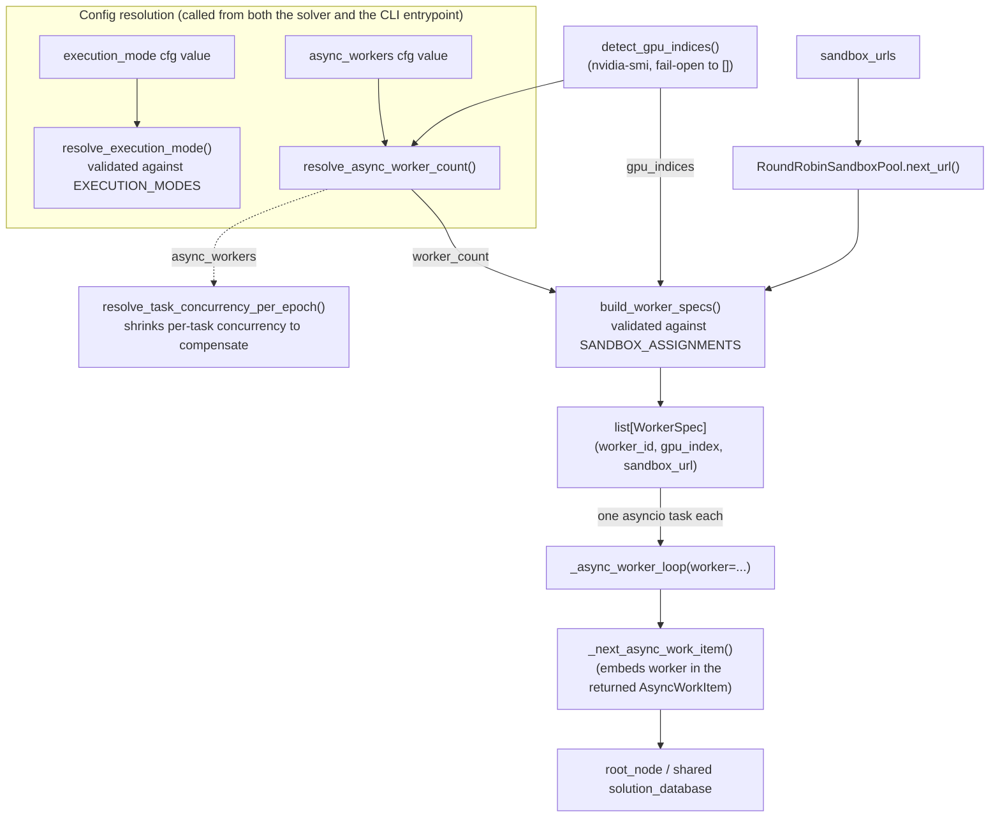

# airaevo_async_resources.py — the worker/GPU/sandbox resource pool behind OpenMLE-Evo-Max's async search

## Overview

`OpenMLE-Evo/tts_search/airaevo_async_resources.py` is OpenMLE's own resource-descriptor layer, living
deliberately *outside* the vendored `third_party/aira-evo` tree even though the vendored `Evolutionary`
solver is its only real consumer. It answers three narrow questions — how many parallel search workers to
run, which GPU (if any) and which sandbox-router URL each one gets, and whether the solver should run at
all in single-worker "generation" mode or multi-worker "async steady state" mode — and hands back a plain,
immutable `WorkerSpec` per worker. Beyond one small async helper used only for pre-search status logging
(a query against each sandbox router before the worker pool starts), it does not spawn worker coroutines or
acquire locks; it is a pure config→resource-plan resolver that the vendored solver's async worker pool (each
worker running [`_async_worker_loop`](../catalog/OpenMLE-Evo/third_party/aira-evo/src/dojo/solvers/evo/evo.md#Evolutionary._async_worker_loop))
then draws from once at search startup. Concretely, this is the mechanism behind the paper's
"asynchronous multi-GPU parallel search" claim for **OpenMLE-Evo-Max**
([Frontis-MA1](../../../sources/frontis-ma1.md), §6.1): `resolve_async_worker_count`'s `"auto"` mode maps
one worker to one detected GPU, and a sibling resolver
([`resolve_task_concurrency_per_epoch`](../catalog/OpenMLE-Evo/tts_search/airaevo_concurrency.md#resolve_task_concurrency_per_epoch))
shrinks the outer task-level concurrency budget in exact proportion to the worker count added here — which
is how the paper can claim more per-task search parallelism "at unchanged total sandbox compute."

## Diagram

## Design rationale (why it's built this way)

- **It lives at `OpenMLE-Evo/tts_search/`, not inside `third_party/aira-evo/`, because two independent
  callers need it before any solver exists.** The vendored `Evolutionary` solver imports it for its own
  `_execution_mode()`/`_async_worker_count()` wrappers, but `runner.py`'s Hydra entrypoint
  ([`main`](../catalog/OpenMLE-Evo/third_party/aira-evo/examples/mle_bench/runner.md#main)) also calls
  [`resolve_execution_mode`](../catalog/OpenMLE-Evo/tts_search/airaevo_async_resources.md#resolve_execution_mode)
  and [`resolve_async_worker_count`](../catalog/OpenMLE-Evo/tts_search/airaevo_async_resources.md#resolve_async_worker_count)
  directly, *before* any per-task solver is constructed, purely to fail fast on a bad
  `execution_mode`/`async_workers` combination and to compute the shared concurrency budget across every
  task. A module the solver's own `third_party` fork doesn't own is what lets both call sites share one
  source of truth without a downward import from the CLI runner into the vendored package.
- **GPU detection is fail-open by construction.**
  [`detect_gpu_indices`](../catalog/OpenMLE-Evo/tts_search/airaevo_async_resources.md#detect_gpu_indices)
  catches `FileNotFoundError` from a missing `nvidia-smi` binary and also treats any non-zero return code
  as "no GPUs" — both paths return `[]` rather than raising. That single fallback is what lets
  [`resolve_async_worker_count`](../catalog/OpenMLE-Evo/tts_search/airaevo_async_resources.md#resolve_async_worker_count)'s
  `"auto"` mode double as a safe default on CPU-only dev machines (`max(1, len([])) == 1`, i.e. falls back
  to the original single-worker path) and as "one worker per visible GPU" on a real multi-GPU host, with
  no code branching required at the call site.
- **`WorkerSpec` is a frozen dataclass because the resource plan is decided once, up front, and never
  renegotiated while the search runs.** [`build_worker_specs`](../catalog/OpenMLE-Evo/tts_search/airaevo_async_resources.md#build_worker_specs)
  is called exactly once per search (before any worker coroutine starts), and every
  [`WorkerSpec`](../catalog/OpenMLE-Evo/tts_search/airaevo_async_resources.md#WorkerSpec) it returns is
  then read-only for the lifetime of that worker's `_async_worker_loop`. Freezing the dataclass makes that
  "assigned once, shared read-only across an async loop" contract enforced by the type itself rather than
  a convention — the only concurrency-sensitive state the async workers actually mutate is the *shared*
  solution database and journal, guarded separately by locks the solver owns, not anything on `WorkerSpec`.
- **GPU assignment and sandbox-URL assignment are two independent round-robins, not one.**
  [`build_worker_specs`](../catalog/OpenMLE-Evo/tts_search/airaevo_async_resources.md#build_worker_specs)
  picks [`gpu_index`](../catalog/OpenMLE-Evo/tts_search/airaevo_async_resources.md#WorkerSpec.gpu_index)
  via `gpu_indices[worker_id % len(gpu_indices)]` and
  [`sandbox_url`](../catalog/OpenMLE-Evo/tts_search/airaevo_async_resources.md#WorkerSpec.sandbox_url) via
  a separate `RoundRobinSandboxPool`
  [`next_url`](../catalog/OpenMLE-Evo/tts_search/airaevo_async_resources.md#RoundRobinSandboxPool.next_url)
  cursor. Nothing requires `worker_count`, the number of detected GPUs, and the number of sandbox URLs to
  match each other — a deployment can run more (or fewer) sandbox routers than GPUs, or vice versa, and
  each resource is cycled independently.
- **The sandbox-assignment strategy is validated against an enum-like frozenset
  ([`SANDBOX_ASSIGNMENTS`](../catalog/OpenMLE-Evo/tts_search/airaevo_async_resources.md#SANDBOX_ASSIGNMENTS))
  even though only `"round_robin"` exists today** — the same pattern as
  [`EXECUTION_MODES`](../catalog/OpenMLE-Evo/tts_search/airaevo_async_resources.md#EXECUTION_MODES) for
  execution mode. Both give a typo or an as-yet-unimplemented strategy name a hard `ValueError` at
  worker-pool-construction time instead of a silent no-op, and both leave room to add a second strategy
  (e.g. load-aware assignment) later without changing `WorkerSpec`'s shape or `build_worker_specs`'s
  signature.

## Entry points

- [`build_worker_specs`](../catalog/OpenMLE-Evo/tts_search/airaevo_async_resources.md#build_worker_specs) —
  called once, from the vendored solver's async search entrypoint, right after the solver resolves
  `execution_mode == "async_steady_state"` — not gated on worker count; the resolved worker count can still
  be 1 (e.g. no GPU detected) and this path still runs. It is the sole place a `list[WorkerSpec]` comes into
  existence for a search run.
- [`resolve_execution_mode`](../catalog/OpenMLE-Evo/tts_search/airaevo_async_resources.md#resolve_execution_mode)
  and [`_execution_mode`](../catalog/OpenMLE-Evo/third_party/aira-evo/src/dojo/solvers/evo/evo.md#Evolutionary._execution_mode) —
  reached both from inside the solver (to pick between the sequential and async search paths) and from
  [`main`](../catalog/OpenMLE-Evo/third_party/aira-evo/examples/mle_bench/runner.md#main) at CLI startup,
  before any per-task solver object exists, purely to validate the configured mode early.
- [`resolve_async_worker_count`](../catalog/OpenMLE-Evo/tts_search/airaevo_async_resources.md#resolve_async_worker_count)
  and [`_async_worker_count`](../catalog/OpenMLE-Evo/third_party/aira-evo/src/dojo/solvers/evo/evo.md#Evolutionary._async_worker_count) —
  the same worker-count resolver reached from both call sites described above; `main` additionally feeds
  its result into [`resolve_task_concurrency_per_epoch`](../catalog/OpenMLE-Evo/tts_search/airaevo_concurrency.md#resolve_task_concurrency_per_epoch)
  to size the outer per-task concurrency budget.
- [`_async_worker_loop`](../catalog/OpenMLE-Evo/third_party/aira-evo/src/dojo/solvers/evo/evo.md#Evolutionary._async_worker_loop) —
  the actual consumer of every `WorkerSpec` this module produces: one instance is scheduled as an
  independent `asyncio` task per worker once `build_worker_specs` returns, and it runs until the shared
  stop condition fires.

## Mechanism (step-by-step)

1. **Two independent call sites resolve the same config before a search starts.** The vendored solver
   consults [`resolve_execution_mode`](../catalog/OpenMLE-Evo/tts_search/airaevo_async_resources.md#resolve_execution_mode)
   and [`resolve_async_worker_count`](../catalog/OpenMLE-Evo/tts_search/airaevo_async_resources.md#resolve_async_worker_count)
   through its own `_execution_mode`/`_async_worker_count` wrappers; the Hydra CLI entrypoint
   ([`main`](../catalog/OpenMLE-Evo/third_party/aira-evo/examples/mle_bench/runner.md#main)) calls the
   same two functions directly, before any solver is built, so a `generation` mode paired with more than
   one worker is rejected with a `ValueError` at process startup rather than deep inside a running search.
2. **`"auto"` worker count is resolved against real hardware, once.**
   [`resolve_async_worker_count`](../catalog/OpenMLE-Evo/tts_search/airaevo_async_resources.md#resolve_async_worker_count)
   treats `None` as 1 worker, an explicit integer as itself (floored at 1), and the string `"auto"` as "one
   worker per GPU `nvidia-smi` reports" via
   [`detect_gpu_indices`](../catalog/OpenMLE-Evo/tts_search/airaevo_async_resources.md#detect_gpu_indices) —
   the `gpu_indices` keyword lets callers (tests, mainly) inject the list directly instead of shelling out.
3. **The worker pool is built once, as a flat list, before any worker runs.**
   [`build_worker_specs`](../catalog/OpenMLE-Evo/tts_search/airaevo_async_resources.md#build_worker_specs)
   first validates the assignment strategy against
   [`SANDBOX_ASSIGNMENTS`](../catalog/OpenMLE-Evo/tts_search/airaevo_async_resources.md#SANDBOX_ASSIGNMENTS)
   and requires a non-empty sandbox-URL list, then for `worker_id` in `range(worker_count)` pairs a
   GPU index (round-robin over whatever
   [`detect_gpu_indices`](../catalog/OpenMLE-Evo/tts_search/airaevo_async_resources.md#detect_gpu_indices)
   found, or `None` if none) with a sandbox URL drawn from `RoundRobinSandboxPool`'s
   [`next_url`](../catalog/OpenMLE-Evo/tts_search/airaevo_async_resources.md#RoundRobinSandboxPool.next_url),
   producing one immutable [`WorkerSpec`](../catalog/OpenMLE-Evo/tts_search/airaevo_async_resources.md#WorkerSpec)
   per worker.
4. **Each `WorkerSpec` is handed to exactly one long-running coroutine.** The solver schedules one
   [`_async_worker_loop`](../catalog/OpenMLE-Evo/third_party/aira-evo/src/dojo/solvers/evo/evo.md#Evolutionary._async_worker_loop)
   `asyncio` task per entry in the `WorkerSpec` list; a worker's `gpu_index`/`sandbox_url` never change for
   the lifetime of that loop, and its
   [`worker`](../catalog/OpenMLE-Evo/third_party/aira-evo/src/dojo/solvers/evo/evo.md#AsyncWorkItem.worker)
   field is threaded through every `AsyncWorkItem` the loop allocates for itself.
5. **Sampling the next attempt is the one place two workers could collide, and it's serialized.**
   [`_next_async_work_item`](../catalog/OpenMLE-Evo/third_party/aira-evo/src/dojo/solvers/evo/evo.md#Evolutionary._next_async_work_item)
   increments the shared generation counter and samples a parent from the shared solution database, and
   the solver only ever calls it while holding a shared `sample_lock` — the resulting `AsyncWorkItem` is
   stamped with the calling
   [`worker`](../catalog/OpenMLE-Evo/third_party/aira-evo/src/dojo/solvers/evo/evo.md#AsyncWorkItem.worker)'s
   own `WorkerSpec` so the rest of that attempt (LLM sampling, sandbox evaluation) is free to run unlocked,
   addressed against that worker's own
   [`sandbox_url`](../catalog/OpenMLE-Evo/tts_search/airaevo_async_resources.md#WorkerSpec.sandbox_url)
   with no further coordination needed.
6. **Adding workers here does not add to total sandbox load system-wide — it's compensated one level up.**
   [`resolve_task_concurrency_per_epoch`](../catalog/OpenMLE-Evo/tts_search/airaevo_concurrency.md#resolve_task_concurrency_per_epoch)
   divides the shared LLM/sandbox concurrency budget by `num_epochs * resolve_async_worker_count(...)`, so
   the same `resolve_async_worker_count` this module exposes is also what shrinks how many *tasks* the
   outer runner lets run concurrently as `async_workers` grows — more per-task parallelism, same aggregate
   concurrency ceiling.

## Key data structures

- [`WorkerSpec`](../catalog/OpenMLE-Evo/tts_search/airaevo_async_resources.md#WorkerSpec) — a
  `@dataclass(frozen=True)` with exactly three fields:
  [`worker_id`](../catalog/OpenMLE-Evo/tts_search/airaevo_async_resources.md#WorkerSpec.worker_id) (its
  index in `range(worker_count)`, used to key round-robin GPU assignment and to label logs/metadata),
  [`gpu_index`](../catalog/OpenMLE-Evo/tts_search/airaevo_async_resources.md#WorkerSpec.gpu_index) (an
  `int | None` — `None` when no GPUs were detected), and
  [`sandbox_url`](../catalog/OpenMLE-Evo/tts_search/airaevo_async_resources.md#WorkerSpec.sandbox_url)
  (the sandbox router endpoint that worker's evaluations are routed through). It carries no mutable state
  and no methods — it is purely a resource-assignment record threaded through `AsyncWorkItem`'s
  [`worker`](../catalog/OpenMLE-Evo/third_party/aira-evo/src/dojo/solvers/evo/evo.md#AsyncWorkItem.worker)
  field and, later, into each evaluated node's `async_work_metadata`.
- [`RoundRobinSandboxPool`](../catalog/OpenMLE-Evo/tts_search/airaevo_async_resources.md#RoundRobinSandboxPool) —
  a tiny stateful cursor: [`urls`](../catalog/OpenMLE-Evo/tts_search/airaevo_async_resources.md#RoundRobinSandboxPool.urls)
  (the fixed list of sandbox URLs) and
  [`_index`](../catalog/OpenMLE-Evo/tts_search/airaevo_async_resources.md#RoundRobinSandboxPool._index)
  (mutated by every call to
  [`next_url`](../catalog/OpenMLE-Evo/tts_search/airaevo_async_resources.md#RoundRobinSandboxPool.next_url)).
  It exists only during [`build_worker_specs`](../catalog/OpenMLE-Evo/tts_search/airaevo_async_resources.md#build_worker_specs)'s
  synchronous, single-threaded construction loop — it is not shared or reused once the `WorkerSpec` list
  is returned, so its internal `_index` mutation is never a concurrency concern.
- [`EXECUTION_MODES`](../catalog/OpenMLE-Evo/tts_search/airaevo_async_resources.md#EXECUTION_MODES) /
  [`SANDBOX_ASSIGNMENTS`](../catalog/OpenMLE-Evo/tts_search/airaevo_async_resources.md#SANDBOX_ASSIGNMENTS) —
  two module-level `frozenset`s (`{"generation", "async_steady_state"}` and `{"round_robin"}`
  respectively) that double as both documentation of the supported values and the validation whitelist
  [`resolve_execution_mode`](../catalog/OpenMLE-Evo/tts_search/airaevo_async_resources.md#resolve_execution_mode)
  and [`build_worker_specs`](../catalog/OpenMLE-Evo/tts_search/airaevo_async_resources.md#build_worker_specs)
  check against.

## Dynamics (design intent)

Everything this module does is synchronous, single-threaded, and runs to completion once, before any
concurrency starts: [`build_worker_specs`](../catalog/OpenMLE-Evo/tts_search/airaevo_async_resources.md#build_worker_specs)
is an ordinary list comprehension, not a coroutine, and neither it nor
[`resolve_async_worker_count`](../catalog/OpenMLE-Evo/tts_search/airaevo_async_resources.md#resolve_async_worker_count)/
[`resolve_execution_mode`](../catalog/OpenMLE-Evo/tts_search/airaevo_async_resources.md#resolve_execution_mode)
awaits anything. The actual asynchrony lives one layer up, in
[`_async_worker_loop`](../catalog/OpenMLE-Evo/third_party/aira-evo/src/dojo/solvers/evo/evo.md#Evolutionary._async_worker_loop) —
this module's job ends the moment it hands back a `list[WorkerSpec]`.
[`test_async_worker_count_auto_uses_visible_gpu_count`](../catalog/OpenMLE-Evo/third_party/aira-evo/tests/test_async_steady_state.md#test_async_worker_count_auto_uses_visible_gpu_count)
pins the "auto = GPU count, empty GPUs = 1 worker" contract directly, and
[`test_async_attempts_map_to_virtual_generations_and_budget`](../catalog/OpenMLE-Evo/third_party/aira-evo/tests/test_async_steady_state.md#test_async_attempts_map_to_virtual_generations_and_budget)
shows the downstream effect: successive `attempt_id`s allocated to a single `WorkerSpec` still map to
strictly increasing `generation_id`s (`individuals_per_generation` attempts per generation), confirming
the per-worker resource assignment doesn't interact with how the shared generation counter advances.
[`test_async_worker_retries_same_attempt_after_transient_failure`](../catalog/OpenMLE-Evo/third_party/aira-evo/tests/test_async_steady_state.md#test_async_worker_retries_same_attempt_after_transient_failure)
and
[`test_async_sampling_honors_fresh_draft_probability`](../catalog/OpenMLE-Evo/third_party/aira-evo/tests/test_async_steady_state.md#test_async_sampling_honors_fresh_draft_probability)
both construct a bare `WorkerSpec` by hand and pass it straight into solver-level methods — further
evidence that, from the solver's point of view, a `WorkerSpec` is an opaque, already-resolved resource
token rather than something the solver needs to interpret or re-derive.

## Edge cases

- **No GPU detected → every worker gets `gpu_index=None`, not an error.**
  [`detect_gpu_indices`](../catalog/OpenMLE-Evo/tts_search/airaevo_async_resources.md#detect_gpu_indices)
  returns `[]` on both a missing `nvidia-smi` binary and a non-zero exit code, and
  [`build_worker_specs`](../catalog/OpenMLE-Evo/tts_search/airaevo_async_resources.md#build_worker_specs)'s
  conditional expression falls back to `None` for every
  [`gpu_index`](../catalog/OpenMLE-Evo/tts_search/airaevo_async_resources.md#WorkerSpec.gpu_index) in that
  case — an `async_steady_state` run is still legal on a CPU-only or GPU-unaware host.
- **More workers than GPUs shares GPUs cyclically, not exclusively.**
  [`build_worker_specs`](../catalog/OpenMLE-Evo/tts_search/airaevo_async_resources.md#build_worker_specs)
  computes `gpu_index` as `gpu_indices[worker_id % len(gpu_indices)]`, so `worker_count > len(gpu_indices)`
  produces multiple `WorkerSpec`s sharing the same `gpu_index` — nothing in this module tracks or limits
  how many workers land on one physical GPU.
- **An unsupported sandbox assignment string is a hard failure at pool-construction time.**
  [`build_worker_specs`](../catalog/OpenMLE-Evo/tts_search/airaevo_async_resources.md#build_worker_specs)
  raises `ValueError` before doing any GPU detection or URL assignment if `assignment` isn't in
  [`SANDBOX_ASSIGNMENTS`](../catalog/OpenMLE-Evo/tts_search/airaevo_async_resources.md#SANDBOX_ASSIGNMENTS)
  — exercised directly by
  [`test_worker_specs_validate_assignment`](../catalog/OpenMLE-Evo/third_party/aira-evo/tests/test_async_steady_state.md#test_worker_specs_validate_assignment).
- **An empty `sandbox_urls` list is also a hard failure**, independent of the assignment-strategy check —
  [`build_worker_specs`](../catalog/OpenMLE-Evo/tts_search/airaevo_async_resources.md#build_worker_specs)
  raises `ValueError` if `sandbox_urls` is falsy, so a misconfigured deployment with zero routers never
  silently produces zero-worker or single-fallback-worker specs.
- **An unsupported `execution_mode` string is likewise a hard failure, not a silent default.**
  [`resolve_execution_mode`](../catalog/OpenMLE-Evo/tts_search/airaevo_async_resources.md#resolve_execution_mode)
  only treats `None`/empty as the `"generation"` default; any other value not in
  [`EXECUTION_MODES`](../catalog/OpenMLE-Evo/tts_search/airaevo_async_resources.md#EXECUTION_MODES) raises,
  as
  [`test_execution_mode_is_explicit_and_validated`](../catalog/OpenMLE-Evo/third_party/aira-evo/tests/test_async_steady_state.md#test_execution_mode_is_explicit_and_validated)
  exercises directly.

## Open questions

- Nothing in this subgraph shows `gpu_index` being turned into an actual device pin (e.g. a
  `CUDA_VISIBLE_DEVICES` assignment or a device argument passed into whatever runs the LLM/sandbox work
  for that attempt) — it is threaded through
  [`worker`](../catalog/OpenMLE-Evo/third_party/aira-evo/src/dojo/solvers/evo/evo.md#AsyncWorkItem.worker)
  and ultimately recorded on the evaluated node's metadata, but whether GPU isolation is enforced by the
  sandbox that `sandbox_url` points at, by out-of-band process placement, or not at all beyond this
  bookkeeping label isn't answerable from these symbols alone.
  > [!inferred]
  > Given `sandbox_url` (not `gpu_index`) is what's actually passed into the evaluation call
  > ([`_next_async_work_item`](../catalog/OpenMLE-Evo/third_party/aira-evo/src/dojo/solvers/evo/evo.md#Evolutionary._next_async_work_item)/`_async_worker_loop`),
  > the most likely reading is that GPU affinity is enforced upstream, by whatever process launched the
  > sandbox router at that URL — `gpu_index` here would then be a provenance label for logs/metadata
  > rather than an executable instruction — but this subgraph cannot confirm that.
- [`resolve_task_concurrency_per_epoch`](../catalog/OpenMLE-Evo/tts_search/airaevo_concurrency.md#resolve_task_concurrency_per_epoch)
  imports [`resolve_async_worker_count`](../catalog/OpenMLE-Evo/tts_search/airaevo_async_resources.md#resolve_async_worker_count)
  locally, inside the function body, rather than at module scope; whether that's to avoid an import-time
  circularity with `airaevo_async_resources` or just a style choice isn't settled by anything visible in
  this subgraph.
- Whether the sandbox-URL/GPU round-robin ever gets rebalanced mid-search if one router turns out to be
  slower or less idle than another isn't addressed here — `build_worker_specs` runs once, before the
  search starts, and this subgraph contains no re-invocation of it during a run.

## See also

- [Frontis-MA1](../../../sources/frontis-ma1.md) — §6.1 names "asynchronous multi-GPU parallel search at
  unchanged total sandbox compute" as one of the two things OpenMLE-Evo-Max adds on top of OpenMLE-Evo;
  this module and `resolve_task_concurrency_per_epoch` are the concrete mechanism behind that claim.
- [airaevo_experience.py](OpenMLE-ERL-RL-airaevo_experience.md) — the RL harness's own adaptation of the
  vendored AIRA-Evo code, one layer over in OpenMLE-ERL; a useful contrast in how differently OpenMLE
  wraps the same upstream algorithm for training-data generation versus inference-time search.
- [Scheduler](OpenMLE-ERL-SFT-tts_search-services-scheduler.md) — a sibling `tts_search` orchestrator that
  solves a related but distinct problem: decoupled producer/consumer concurrency across LLM generation and
  sandbox evaluation, rather than static per-worker GPU/sandbox resource assignment.
