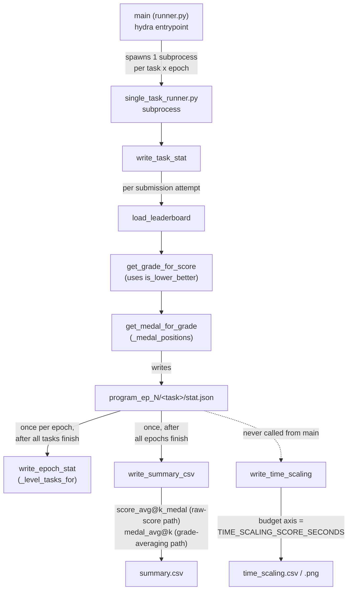

# Grading OpenMLE-Evo runs — leaderboard percentiles, Kaggle-style medals, and multi-epoch summaries

<!-- connect:up:begin -->
> **Cross-repo concept:** part of [verification-independence](../../../concepts/verification-independence.md) across this wiki's repos.
<!-- connect:up:end -->
## Overview
`eval_utils.py` is the scoring/reporting layer that sits downstream of every OpenMLE-Evo sandbox run: it
turns a raw submission score into a Kaggle-style leaderboard percentile ("grade") and medal tier, then rolls
those numbers up two different ways — once per epoch, across all tasks, and once per task, across all
epochs — into the `stat.json`/`summary.csv` files the paper's Table 1/9 numbers are ultimately built from. It
never touches the search or the sandbox; it only reads the `stat.json` breadcrumbs those layers leave behind
and produces the aggregate views a human (or a downstream analysis script) reads. Two design choices carry
the whole module: grading always happens against an external, unmodifiable Kaggle leaderboard CSV rather
than a self-reported score, and the two families of aggregate columns it writes (`score_avg@k` vs.
`grade_avg@k`/`medal_avg@k`) treat a missing or crashed run *differently* — one silently drops it, the other
counts it as the worst possible outcome.

## Diagram

## Design rationale (why it's built this way)
**Grading is structurally independent of the policy being scored.** [`load_leaderboard`](../catalog/OpenMLE-Evo/tts_search/eval_utils.md#load_leaderboard)
reads a Kaggle `public_leaderboard.csv` shipped with the task's data directory — a file the policy never
writes and the reward/search stack never touches — and [`get_grade_for_score`](../catalog/OpenMLE-Evo/tts_search/eval_utils.md#get_grade_for_score)
/ [`get_medal_for_grade`](../catalog/OpenMLE-Evo/tts_search/eval_utils.md#get_medal_for_grade) grade strictly
against the human rows in that file. This is the same "the party that produces a candidate must not be the
party that produces the evidence its verdict cites" pattern the
[verification-independence](../../../concepts/verification-independence.md) concept tracks elsewhere in this
wiki: the paper's headline Medal Average / Human Rank numbers are, by construction, measured against a fixed
external leaderboard rather than anything the model self-reports.

**The status taxonomy mirrors OpenMLE-Gym's six feedback modes, plus one catch-all this module adds.**
[`write_summary_csv`](../catalog/OpenMLE-Evo/tts_search/eval_utils.md#write_summary_csv)'s `fixed_statuses`
list — `code_execution_error`, `code_missing`, `scoring_failed`, `submission_missing`, `success`, `timeout`,
`unknown` — lines up one-to-one with the six paper-level feedback modes (success, runtime error, missing
code, missing submission, scoring failure, timeout) that
[`OpenMLE-Gym-openmle_gym-process_runner`](OpenMLE-Gym-openmle_gym-process_runner.md) already documents,
with `"unknown"` as this module's own addition: any status string it doesn't recognize is folded into
`"unknown"` rather than growing the CSV's column set, and any task with fewer `stat.json` samples than
`num_epochs` has its missing samples counted straight into `"unknown"` too — so the summary's status columns
stay a fixed, stable shape across tasks and runs no matter what the sandbox actually reported.

**Two medal columns answer two different questions, and they can disagree.** `write_summary_csv` computes
`score_avg@k_medal` by averaging *raw* `submit_score` values across the `k` samples for a task and grading
that single averaged score via `get_grade_for_score` — but it computes `medal_avg@k` by averaging the
*per-sample* `submit_grade` values already stored in each `stat.json` (produced upstream by
[`write_task_stat`](../catalog/OpenMLE-Evo/third_party/aira-evo/examples/mle_bench/single_task_runner.md#main.write_task_stat)
via `build_submit_grade_and_medal`'s call to `get_grade_for_score` — *not* `get_medal_for_grade`;
`get_medal_for_grade` is called inside `write_task_stat` too, but only to produce the separate
`submit_medal_avg`/`submit_medal_best` fields, not `submit_grade` itself) and grading *that* average via
`get_medal_for_grade`. Because `grade` is a nonlinear, rank-based function of
`score`, "grade of the mean score" and "mean of the per-sample grades" are not the same number in general —
one column answers "what medal would our average submission earn," the other "what's the average medal tier
across our runs." A reader who assumes they're redundant will occasionally be surprised.

**Missing/crashed samples are handled asymmetrically, and that asymmetry is a real design choice, not a
bug.** In `write_summary_csv`, `valid_scores` (feeding `score_avg@k`) is built only from samples that
actually reported a `submit_score` — a task where 2 of 5 epochs crashed is averaged over the 3 that
survived. But `submit_grades` (feeding `grade_avg@k` / `grade_best@k` / `medal_avg@k` / `medal_best@k`) is
padded with `1.0` — the worst possible grade — for every missing sample via `missing_sample_count`. So the
raw-score family of columns has a silent survivorship bias (a task that only ever succeeds once looks great
on `score_avg@k`), while the grade/medal family penalizes non-completion the same way a genuinely bad
submission would.

**The three-tier task taxonomy exists for the full 75-task MLE-Bench, not just the 22-task Lite split this
paper reports on.** `LOW_TASK_LIST` / `MIDDLE_TASK_LIST` / `HIGH_TASK_LIST` (fed to
[`_level_tasks_for`](../catalog/OpenMLE-Evo/tts_search/eval_utils.md#_level_tasks_for) inside
[`write_epoch_stat`](../catalog/OpenMLE-Evo/tts_search/eval_utils.md#write_epoch_stat)) have 22, 38, and 15
entries respectively — 75 total, and 22 is exactly the paper's MLE-Bench Lite task count. Every task this
paper actually runs falls in the "low" bucket, so for `write_epoch_stat`'s `middle_*`/`high_*` buckets the
task and medal *counts* are always `0` (summing an empty task list, not `None` — nothing guards them), while
the grade-average/std and medal-*rate* fields are `None` (guarded by `if grades`/`if total` checks) for these
results; the code itself makes no distinction between "Lite" and "the low-complexity slice of full
MLE-Bench" — Lite is simply the case where two of the three buckets never populate.

> [!inferred] The paper's headline scalars (Valid Rate *x*/22, Medal Average %, Human Rank) are not literal
> fields anywhere in this subgraph. The closest analogues this file produces are `write_epoch_stat`'s
> `low_any_rate` (fraction of low-tier tasks with a gold/silver/bronze medal, per epoch) and
> `write_summary_csv`'s per-task `medal_avg@k`/`success_rate` columns; assembling those into a single
> cross-task, cross-epoch mean±std almost certainly happens one layer further out (`write_global_stat` and
> whatever analysis script builds Table 1/9), which is outside this packet's subgraph. Likewise, nothing
> here computes "fraction of the leaderboard beaten" under that name — `get_grade_for_score`'s `grade` is a
> Kaggle-style percentile *rank* (near 0 = best, 1 = worst), so "Human Rank" is plausibly `1 - grade` (up to
> the `rank/len(scores)` rounding), but that transform is not present in this file either.

## Entry points
- [`main`](../catalog/OpenMLE-Evo/third_party/aira-evo/examples/mle_bench/runner.md#main) — the Hydra batch
  harness entrypoint. After all `task × epoch` subprocesses return, it calls
  [`write_epoch_stat`](../catalog/OpenMLE-Evo/tts_search/eval_utils.md#write_epoch_stat) once per epoch and
  [`write_summary_csv`](../catalog/OpenMLE-Evo/tts_search/eval_utils.md#write_summary_csv) once for the whole
  run, in that order — these are the two functions from this packet's subgraph that `main` invokes. (`main`
  also calls `write_global_stat` immediately after, but that function lives outside this packet's subgraph,
  so it is *not* the case that these two are "every function in this module `main` reaches.")
- [`write_task_stat`](../catalog/OpenMLE-Evo/third_party/aira-evo/examples/mle_bench/single_task_runner.md#main.write_task_stat) —
  reached once per finished task episode, inside the per-task subprocess `main` spawns; it is the first place
  a raw sandbox score becomes a graded, medaled `stat.json` record, via
  [`load_leaderboard`](../catalog/OpenMLE-Evo/tts_search/eval_utils.md#load_leaderboard) and
  [`get_medal_for_grade`](../catalog/OpenMLE-Evo/tts_search/eval_utils.md#get_medal_for_grade).
- [`write_epoch_stat`](../catalog/OpenMLE-Evo/tts_search/eval_utils.md#write_epoch_stat) — reached once per
  `program_ep_N` directory, after every task in that epoch has produced (or failed to produce) a `stat.json`.
- [`write_summary_csv`](../catalog/OpenMLE-Evo/tts_search/eval_utils.md#write_summary_csv) — reached exactly
  once, after every epoch directory exists, scanning all of them to build the per-task, across-epoch
  `summary.csv`.
- [`write_time_scaling`](../catalog/OpenMLE-Evo/tts_search/eval_utils.md#write_time_scaling) — defined in
  this module but not reached from `main` at all (grep over the repo shows zero call sites); it is an
  offline/manual entry point over the same `program_ep_*` directory tree, producing a time-budget-vs-medal
  curve rather than a per-run summary.

## Mechanism (step-by-step)
1. **A submission attempt is graded against a frozen external leaderboard, not a self-reported score.**
   Inside [`write_task_stat`](../catalog/OpenMLE-Evo/third_party/aira-evo/examples/mle_bench/single_task_runner.md#main.write_task_stat),
   once the sandbox has produced a `submit_score`, [`load_leaderboard`](../catalog/OpenMLE-Evo/tts_search/eval_utils.md#load_leaderboard)
   is called to fetch that task's Kaggle public leaderboard as a `DataFrame`, and every subsequent grade/medal
   computation in this module treats that leaderboard as ground truth.
2. **[`load_leaderboard`](../catalog/OpenMLE-Evo/tts_search/eval_utils.md#load_leaderboard) tries several
   release layouts before giving up.** It first checks
   `data_dir/info/public_leaderboard.csv` (the standard MLE-Bench layout); if a `leaderboard_dir` override is
   given instead, it tries `leaderboard_dir/<task>.csv`, then two nested variants, returning the first file
   that exists and has a `score` column (column names are lower-cased and stripped first). For a
   `naturebench`-flagged task it returns `None` immediately — NatureBench has no Kaggle-style leaderboard, so
   every downstream grade/medal computation for that task is skipped, not attempted-and-failed.
3. **Whether higher or lower is better is inferred from row order, not stated.**
   [`is_lower_better`](../catalog/OpenMLE-Evo/tts_search/eval_utils.md#is_lower_better) compares only the
   first and last score in the leaderboard `DataFrame` (`scores[0] < scores[-1]`) — it assumes the CSV is
   already rank-ordered best-to-worst, and never checks a metric-direction field. `get_grade_for_score` then
   uses that to decide whether "better" means smaller or larger, counts how many leaderboard rows beat the
   candidate, and converts that count to a `rank / len(scores)` percentile.
4. **Medal tiers use one team-count-tiered threshold table for both raw scores and averaged grades.**
   [`_medal_positions`](../catalog/OpenMLE-Evo/tts_search/eval_utils.md#_medal_positions) reproduces Kaggle's
   own competition medal formula — different gold/silver/bronze position rules depending on whether the
   leaderboard has `<100`, `<250`, `<1000`, or `≥1000` teams — and
   [`get_medal_for_grade`](../catalog/OpenMLE-Evo/tts_search/eval_utils.md#get_medal_for_grade) converts those
   positions to percentile cutoffs (`gold_pos / num_teams`, etc.) and compares the candidate's `grade` against
   them directly, so the exact same tiering logic applies whether the input grade came from one submission or
   from averaging several.
5. **`write_epoch_stat` aggregates one epoch across every task, split into low/middle/high difficulty
   buckets.** It walks every task directory under one `program_ep_N`, reads each `stat.json` via
   [`_read_json_file`](../catalog/OpenMLE-Evo/tts_search/eval_utils.md#_read_json_file), and partitions the
   task set with [`_level_tasks_for`](../catalog/OpenMLE-Evo/tts_search/eval_utils.md#_level_tasks_for) (using
   the module-level [`LOW_TASK_LIST`](../catalog/OpenMLE-Evo/tts_search/eval_utils.md#LOW_TASK_LIST.LOW_TASK_LIST) /
   [`MIDDLE_TASK_LIST`](../catalog/OpenMLE-Evo/tts_search/eval_utils.md#MIDDLE_TASK_LIST.MIDDLE_TASK_LIST) /
   [`HIGH_TASK_LIST`](../catalog/OpenMLE-Evo/tts_search/eval_utils.md#HIGH_TASK_LIST.HIGH_TASK_LIST)
   family) before computing per-bucket grade mean/std and medal counts/rates — so one epoch's `stat.json`
   already carries a low/middle/high breakdown, even though every task in this paper's 22-task run falls in
   the "low" bucket.
6. **`write_summary_csv` aggregates the opposite axis — one task across every epoch — and writes two
   independently-derived medal columns per task.** It groups samples by `task_name` across all
   `program_ep_*` directories (ordered by the epoch suffix parsed in its local `epoch_index` helper), then for
   each task computes `score_avg@k`/`score_avg@k_medal` from raw scores and `grade_avg@k`/`medal_avg@k` from
   per-sample grades (see Design rationale for why these can diverge), using
   [`get_grade_for_score`](../catalog/OpenMLE-Evo/tts_search/eval_utils.md#get_grade_for_score) and
   [`get_medal_for_grade`](../catalog/OpenMLE-Evo/tts_search/eval_utils.md#get_medal_for_grade) respectively.
   `expected_task_names`, when supplied, is de-duplicated via
   [`_ordered_unique`](../catalog/OpenMLE-Evo/tts_search/eval_utils.md#_ordered_unique) and used as the row
   order instead of whatever tasks happened to produce output, so a task that produced zero valid samples
   still gets a row (all `N/A`/default values) rather than silently vanishing from `summary.csv`.
7. **`write_time_scaling` re-derives medal rate and grade as a function of a time budget, using the paper's
   own 12-hour cap as one reference point.** It collects every sample's
   [`get_total_sandbox_time`](../catalog/OpenMLE-Evo/tts_search/eval_utils.md#get_total_sandbox_time) and
   [`get_total_model_plus_sandbox_time`](../catalog/OpenMLE-Evo/tts_search/eval_utils.md#get_total_model_plus_sandbox_time)
   across the whole run, builds a sorted list of budget checkpoints that always includes `0.0` and
   [`TIME_SCALING_SCORE_SECONDS`](../catalog/OpenMLE-Evo/tts_search/eval_utils.md#TIME_SCALING_SCORE_SECONDS)
   (12 hours) alongside every observed sample time, and for each checkpoint computes `coverage_rate` as
   covered-sample-count over the full sample count. `medal_rate` and `grade_avg@k`, however, are *not*
   restricted to the covered subset the way `coverage_rate` is: both are still normalized by the *full*
   sample count, with every sample whose time exceeds the budget counted as un-medaled and assigned the
   worst grade (`1.0`) rather than excluded — so these two curves read as "expected performance if the run
   were cut off at this budget," not "performance among only the samples that finished in time." This
   produces the coverage-vs-budget curve the paper's time-scaling figures plot, with the 12 h line drawn
   explicitly on the resulting `matplotlib` figure.

## Key data structures
- **Per-task `stat.json`** (`program_ep_N/<task>/stat.json`) — the atomic unit every aggregate in this file
  reads via [`_read_json_file`](../catalog/OpenMLE-Evo/tts_search/eval_utils.md#_read_json_file). Carries
  `task_name`, `submit_score`/`submit_grade`/`submit_medal`, `status_count` (a dict of status → count for
  that episode), usage fields (`total_cost`, token counts, `total_model_time`, and the values
  [`get_total_model_time`](../catalog/OpenMLE-Evo/tts_search/eval_utils.md#get_total_model_time) /
  [`get_total_sandbox_time`](../catalog/OpenMLE-Evo/tts_search/eval_utils.md#get_total_sandbox_time) /
  [`get_total_model_plus_sandbox_time`](../catalog/OpenMLE-Evo/tts_search/eval_utils.md#get_total_model_plus_sandbox_time)
  read out of), and optional `self_valid_oracle_*` / `method2_oracle_*` fields for alternate scoring
  protocols.
- **Per-epoch `stat.json`** (`program_ep_N/stat.json`), written by
  [`write_epoch_stat`](../catalog/OpenMLE-Evo/tts_search/eval_utils.md#write_epoch_stat) — usage totals plus,
  for each of `low`/`middle`/`high`/`all`, a task count, grade mean/std, and gold/silver/bronze/any medal
  counts and rates.
- **`summary.csv`**, written by
  [`write_summary_csv`](../catalog/OpenMLE-Evo/tts_search/eval_utils.md#write_summary_csv) — one row per
  task, across all epochs: the `score_*`/`grade_*`/`medal_*` column pairs discussed above, oracle variants of
  the same, cost stats, a fixed set of status-count columns, and `success_rate`.
- [`LOW_TASK_LIST`](../catalog/OpenMLE-Evo/tts_search/eval_utils.md#LOW_TASK_LIST.LOW_TASK_LIST) /
  [`MIDDLE_TASK_LIST`](../catalog/OpenMLE-Evo/tts_search/eval_utils.md#MIDDLE_TASK_LIST.MIDDLE_TASK_LIST) /
  [`HIGH_TASK_LIST`](../catalog/OpenMLE-Evo/tts_search/eval_utils.md#HIGH_TASK_LIST.HIGH_TASK_LIST) —
  the 22/38/15-task static partition of MLE-Bench's task names by complexity tier, consumed only through
  [`_level_tasks_for`](../catalog/OpenMLE-Evo/tts_search/eval_utils.md#_level_tasks_for).
- [`TIME_SCALING_SCORE_SECONDS`](../catalog/OpenMLE-Evo/tts_search/eval_utils.md#TIME_SCALING_SCORE_SECONDS) —
  `12 * 60 * 60`; doubles as a normalizing denominator (`sandbox_12h_score` in `write_epoch_stat`) and as a
  fixed checkpoint / plotted reference line in `write_time_scaling`.

## Dynamics (design intent)
This module has no concurrency of its own — every function here is a synchronous, single-pass scan over a
directory tree. The concurrency lives one layer up, in `main`'s `asyncio.gather` over per-task subprocesses;
by the time any function in this file runs, that layer has already finished, so `write_epoch_stat` and
`write_summary_csv` see a static, fully-written set of `stat.json` files. The ordering *within* this module
is strict and sequential, visible directly in `main`'s call sequence: per-epoch stats are written before the
cross-epoch summary, and the summary is written before the (out-of-subgraph) global stat — each stage reads
only outputs earlier stages already committed to disk, never in-memory state passed between them.

## Edge cases
- **A corrupt or unreadable `stat.json` is skipped, not fatal.**
  [`_read_json_file`](../catalog/OpenMLE-Evo/tts_search/eval_utils.md#_read_json_file) catches `OSError` and
  `json.JSONDecodeError`, logs a warning via [`logger`](../catalog/OpenMLE-Evo/tts_search/eval_utils.md#logger),
  and returns `None`; every caller (`write_epoch_stat`, `write_summary_csv`, `write_time_scaling`) treats
  `None` as "skip this file" rather than propagating the error. The test
  [`test_summary_skips_corrupt_task_stat_and_continues`](../catalog/OpenMLE-Evo/tests/test_review_regressions.md#test_summary_skips_corrupt_task_stat_and_continues)
  exercises exactly this against `write_summary_csv`, confirming the run still produces a `Task` row for the
  broken task (defaulted, not dropped) while logging the skip.
- **NatureBench tasks never touch the leaderboard machinery at all.**
  [`load_leaderboard`](../catalog/OpenMLE-Evo/tts_search/eval_utils.md#load_leaderboard) short-circuits to
  `None` the moment `metadata["benchmark"]` is `"naturebench"`, confirmed by
  [`test_naturebench_summary_does_not_require_mle_leaderboard`](../catalog/OpenMLE-Evo/tests/test_naturebench_integration.md#test_naturebench_summary_does_not_require_mle_leaderboard):
  a NatureBench task's `summary.csv` row still gets a real `score_best@k` (the raw submitted score passes
  through untouched) but every grade/medal column is `"N/A"`, since nothing in
  [`write_summary_csv`](../catalog/OpenMLE-Evo/tts_search/eval_utils.md#write_summary_csv) can grade without a
  leaderboard.
- **`is_lower_better` trusts leaderboard row order, with no direction metadata to fall back on.**
  If a leaderboard CSV were ever supplied unsorted (or sorted the other way), the "higher/lower is better"
  inference in [`is_lower_better`](../catalog/OpenMLE-Evo/tts_search/eval_utils.md#is_lower_better) would
  silently flip, and every downstream `get_grade_for_score`/medal computation for that task would be
  systematically wrong without raising anything.
- **`write_time_scaling` is dead code from `main`'s point of view.** It is fully implemented, tested-by-name
  in this packet's Evidence table only indirectly (no test in this subgraph calls it directly), and never
  invoked anywhere in the shipped `runner.py`/`single_task_runner.py` call chain — it exists to be run
  separately over an already-completed output directory.

## Open questions
- The paper's exact Table 1/9 scalars — Valid Rate (*x*/22), Medal Average with a cross-epoch ±σ, and Human
  Rank — are not literally produced anywhere in this subgraph. `get_medal_for_score`,
  `build_submit_grade_and_medal`, and `write_global_stat` all live in this same file but sit outside this
  packet's subgraph, and are the more likely place the final cross-epoch aggregation happens; whether "Human
  Rank" is computed as `1 - grade` or by some other transform is not settled by any function cited on this
  page.
- Whether `LOW_TASK_LIST`'s 22 entries are exactly the official MLE-Bench Lite task list (vs. a similarly-sized
  but distinct subset) is inferred from the matching count and the "low complexity" framing, not confirmed by
  a comment or docstring in this file.
- `write_time_scaling`'s complete lack of callers raises whether it is a leftover from an earlier reporting
  path, a script run by hand for the paper's time-scaling figures (§6.5), or dead code — the source gives no
  indication either way.

## See also
- [`OpenMLE-Gym-openmle_gym-process_runner`](OpenMLE-Gym-openmle_gym-process_runner.md) — the sandbox
  execution primitive whose paper-level six feedback modes this file's `fixed_statuses` taxonomy mirrors.
- [`OpenMLE-ERL-RL-reward_func_utils`](OpenMLE-ERL-RL-reward_func_utils.md) — the training-time counterpart:
  where this file grades a *finished* run against a leaderboard for reporting, that module shapes a *live*
  score into an RL reward, including its own `leaderboard_medal_binary_reward`/`leaderboard_rank_reward`
  paths built on the same Kaggle-style medal-tier idea.
- [`verification-independence`](../../../concepts/verification-independence.md) — the cross-repo concept this
  file's leaderboard-file-as-ground-truth grading is a grounded instance of.
- [Frontis-MA1 source page](../../../sources/frontis-ma1.md) — §6's Valid Rate / Medal Average / Human Rank
  results table and the MLE-Bench Lite (22-task, 3-run, 12 h/task) evaluation setup this module's output
  feeds.
