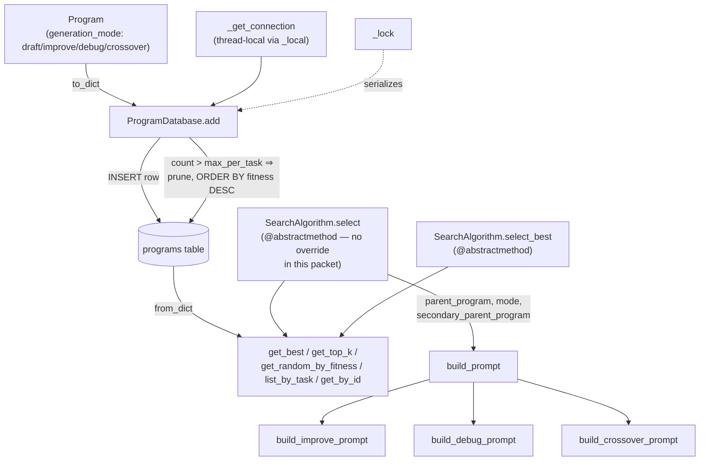

# Program database — the storage substrate, not the selection policy

<!-- connect:up:begin -->
> **Cross-repo concept:** part of [evolutionary-algorithm-discovery](../../../concepts/evolutionary-algorithm-discovery.md), [program-evolution-operators](../../../concepts/program-evolution-operators.md) across this wiki's repos.
<!-- connect:up:end -->
## Overview
`OpenMLE-Evo/tts_search/program_database.py` is the record format and persistence layer every generated
candidate in an inference-time search run passes through: a dataclass, [`Program`](../catalog/OpenMLE-Evo/tts_search/program_database.md#Program),
that captures one candidate's code, its evaluator score/reward/fitness, its parent lineage, and which of
the four program-evolution operators produced it, backed by a SQLite table (`ProgramDatabase`) that
inserts, prunes to a bounded population, and re-hydrates those records. The file deliberately says nothing
about *how* a parent gets chosen for the next Draft/Improve/Debug/Crossover step — that decision is pushed
behind an abstract `SearchAlgorithm` interface ([`select`](../catalog/OpenMLE-Evo/tts_search/program_database.md#SearchAlgorithm.select)/[`select_best`](../catalog/OpenMLE-Evo/tts_search/program_database.md#SearchAlgorithm.select_best))
with no concrete implementation here. Read against the paper's description of OpenMLE-Evo's
redesigned experience-driven search — deterministic experience cards, a three-factor quality/progress/
novelty utility (Eq. 4), deferred memory synthesis, operator-conditioned context — this module is the
*substrate* those mechanisms would sit on top of, not those mechanisms themselves: nothing citable in this
subgraph, including [`build_prompt`](../catalog/OpenMLE-Evo/tts_search/prompt_builder.md#build_prompt) and
its per-operator helpers, computes a multi-term utility, builds a structured experience card, or assembles
ancestor/sibling context beyond a single already-chosen parent. See Open questions for what a broader,
out-of-subgraph read of the repository suggests about where that logic actually lives.

## Diagram

## Design rationale (why it's built this way)
- **Storage and selection policy are split by an abstract interface, deliberately.** `SearchAlgorithm`
  declares [`select`](../catalog/OpenMLE-Evo/tts_search/program_database.md#SearchAlgorithm.select)/[`select_best`](../catalog/OpenMLE-Evo/tts_search/program_database.md#SearchAlgorithm.select_best)
  as `@abstractmethod` and both raise `NotImplementedError`; `ProgramDatabase`
  never calls either. The database only knows how to persist, prune, and query
  [`Program`](../catalog/OpenMLE-Evo/tts_search/program_database.md#Program) rows by a scalar
  [`fitness`](../catalog/OpenMLE-Evo/tts_search/program_database.md#Program.fitness) column; it has zero opinion about
  how that number is computed or which operator/parent(s) get picked next. That split is what lets this same
  schema and storage contract be shared by radically different concrete policies — from a trivial
  greedy-by-reward pick up to a structured, multi-factor experience-driven one — without touching this file.
- **`fitness` is a field a caller can override, not a value this file computes.** [`Program`](../catalog/OpenMLE-Evo/tts_search/program_database.md#Program)
  carries [`score`](../catalog/OpenMLE-Evo/tts_search/program_database.md#Program.score) (raw sandbox output),
  [`base_reward`](../catalog/OpenMLE-Evo/tts_search/program_database.md#Program.base_reward) ("before considering
  parent"), [`reward`](../catalog/OpenMLE-Evo/tts_search/program_database.md#Program.reward) ("calculated from
  score"), and [`fitness`](../catalog/OpenMLE-Evo/tts_search/program_database.md#Program.fitness) ("used by search
  selection") as four separate fields, and only the last of these is what
  [`add`](../catalog/OpenMLE-Evo/tts_search/program_database.md#ProgramDatabase.add) sorts and prunes by. `Program`'s
  `__post_init__` sets `fitness = reward` only when the caller left `fitness` unset — a safe default for
  callers that don't compute anything fancier, but structurally it exists so a caller with a richer scoring
  formula can hand `Program(..., fitness=<computed_value>)` to `add` without this module ever needing to know
  what produced that number.
- **`metadata` is the schema's escape hatch.** [`metadata`](../catalog/OpenMLE-Evo/tts_search/program_database.md#Program.metadata)
  is typed `dict[str, Any]` and round-trips through [`to_dict`](../catalog/OpenMLE-Evo/tts_search/program_database.md#Program.to_dict)/[`from_dict`](../catalog/OpenMLE-Evo/tts_search/program_database.md#Program.from_dict)
  as a JSON blob rather than being normalized into dedicated columns. No other field in this subgraph exists
  to carry algorithm-specific bookkeeping (an island id, a method-family tag, a cached experience card), so
  `metadata` is the only place a concrete selection policy could attach that state to a `Program` without a
  schema change to this file.
- **`generation_mode` is a first-class, queryable column, not just a label.** [`generation_mode`](../catalog/OpenMLE-Evo/tts_search/program_database.md#Program.generation_mode)
  is one of the four operator names, and [`count_by_generation_mode`](../catalog/OpenMLE-Evo/tts_search/program_database.md#ProgramDatabase.count_by_generation_mode)
  exists solely to let a caller ask "how many Improve attempts has this task had so far" — bookkeeping a
  scheduler needs to decide when to unlock or rebalance operators, even though the rebalancing logic itself
  is not part of this file.
- **Top-k-by-fitness pruning bounds the candidate pool a policy has to consider.** [`add`](../catalog/OpenMLE-Evo/tts_search/program_database.md#ProgramDatabase.add)
  deletes everything past the top [`max_per_task`](../catalog/OpenMLE-Evo/tts_search/program_database.md#ProgramDatabase.max_per_task)
  programs (ordered by `fitness DESC`) on every insert once the per-task count exceeds that cap. For a
  long-horizon inference-time search budget, an unbounded table would make every later "read the population"
  query — [`get_top_k`](../catalog/OpenMLE-Evo/tts_search/program_database.md#ProgramDatabase.get_top_k),
  [`list_by_task`](../catalog/OpenMLE-Evo/tts_search/program_database.md#ProgramDatabase.list_by_task) — scan a
  monotonically growing table; capping it (default 10) keeps that cheap at the cost of discarding
  low-fitness history permanently.

## Entry points
- [`add`](../catalog/OpenMLE-Evo/tts_search/program_database.md#ProgramDatabase.add) — the write entry point: called once
  per evaluated candidate to persist a [`Program`](../catalog/OpenMLE-Evo/tts_search/program_database.md#Program)
  and enforce the per-task population cap.
- [`select`](../catalog/OpenMLE-Evo/tts_search/program_database.md#SearchAlgorithm.select) and
  [`select_best`](../catalog/OpenMLE-Evo/tts_search/program_database.md#SearchAlgorithm.select_best) —
  the abstract entry points a rollout/search loop calls once per generation step and once at budget
  exhaustion, respectively; both are declared here with no body (`raise NotImplementedError`), so control
  only reaches a real implementation in whatever concrete subclass a caller supplies from outside this
  packet.
- [`get_best`](../catalog/OpenMLE-Evo/tts_search/program_database.md#ProgramDatabase.get_best),
  [`get_top_k`](../catalog/OpenMLE-Evo/tts_search/program_database.md#ProgramDatabase.get_top_k), and
  [`get_random_by_fitness`](../catalog/OpenMLE-Evo/tts_search/program_database.md#ProgramDatabase.get_random_by_fitness) —
  the read surface a concrete `SearchAlgorithm.select` would call to see the current population before
  deciding on an operator and parent(s).
- [`build_prompt`](../catalog/OpenMLE-Evo/tts_search/prompt_builder.md#build_prompt) — the boundary between
  "which program(s) were selected" and "what text the model actually sees." For Improve/Debug/Crossover it
  is reached once a parent (or two, for crossover) has already been chosen — both of its internal branches
  raise `ValueError` if `parent_program` (or `secondary_parent_program`) is `None` for those modes. For
  Draft, it is reached with no selection at all: `parent_program` stays at its default `None` and neither
  of `build_prompt`'s two `mode == "draft"` branches (`OpenMLE-Evo/tts_search/prompt_builder.py:221-222` and
  `:271-275`) reads a `Program`.

## Mechanism (step-by-step)
1. **A `Program` normalizes itself on construction.** [`Program`](../catalog/OpenMLE-Evo/tts_search/program_database.md#Program)'s
   `__post_init__` fills in [`fitness`](../catalog/OpenMLE-Evo/tts_search/program_database.md#Program.fitness) from
   [`reward`](../catalog/OpenMLE-Evo/tts_search/program_database.md#Program.reward) when the caller didn't supply one,
   and — independently — overwrites [`run_log`](../catalog/OpenMLE-Evo/tts_search/program_database.md#Program.run_log)
   from a `clear_run_log` key inside [`metadata`](../catalog/OpenMLE-Evo/tts_search/program_database.md#Program.metadata)
   when present, so a caller can redact or shorten a long execution log at construction time without touching
   the `run_log` field directly.
2. **Every database operation goes through a thread-local connection.** [`_get_connection`](../catalog/OpenMLE-Evo/tts_search/program_database.md#ProgramDatabase._get_connection)
   lazily opens a `sqlite3.Connection` on [`_local`](../catalog/OpenMLE-Evo/tts_search/program_database.md#ProgramDatabase._local)
   (a `threading.local()`) keyed off [`db_path`](../catalog/OpenMLE-Evo/tts_search/program_database.md#ProgramDatabase.db_path),
   with `check_same_thread=False` and a 30-second busy timeout — so concurrent rollout threads each get their
   own connection object onto the same underlying file rather than sharing (and contending on) one connection.
3. **`add` inserts, counts, and prunes inside one critical section.** [`add`](../catalog/OpenMLE-Evo/tts_search/program_database.md#ProgramDatabase.add)
   acquires [`_lock`](../catalog/OpenMLE-Evo/tts_search/program_database.md#ProgramDatabase._lock) (a plain
   `threading.Lock`, one per `ProgramDatabase` instance) for its entire body: `INSERT`, then `COUNT(*)` for
   the task, then — if the count exceeds [`max_per_task`](../catalog/OpenMLE-Evo/tts_search/program_database.md#ProgramDatabase.max_per_task) —
   a `DELETE ... WHERE id NOT IN (SELECT id ... ORDER BY fitness DESC LIMIT max_per_task)`, and finally
   `commit()`. The lock exists specifically so two threads can't interleave an insert with another thread's
   count-and-prune and end up pruning the wrong row or double-counting.
4. **Rows serialize through a fixed JSON contract, not a schema migration per field.** [`to_dict`](../catalog/OpenMLE-Evo/tts_search/program_database.md#Program.to_dict)
   flattens every `Program` field to a SQLite-safe value and `json.dumps`'s
   [`metadata`](../catalog/OpenMLE-Evo/tts_search/program_database.md#Program.metadata); [`from_dict`](../catalog/OpenMLE-Evo/tts_search/program_database.md#Program.from_dict)
   reverses it, defensively handling `metadata` arriving as either an already-parsed dict or a JSON string
   (`json.loads(metadata_value or "{}")`), and re-applies the same `clear_run_log` override on the way back
   in, so a row read out of the database gets the same `run_log` treatment a freshly-constructed `Program`
   would.
5. **Reads reconstruct `Program` objects, they don't return raw rows.** [`get_best`](../catalog/OpenMLE-Evo/tts_search/program_database.md#ProgramDatabase.get_best),
   [`get_top_k`](../catalog/OpenMLE-Evo/tts_search/program_database.md#ProgramDatabase.get_top_k),
   [`get_random_by_fitness`](../catalog/OpenMLE-Evo/tts_search/program_database.md#ProgramDatabase.get_random_by_fitness),
   [`list_by_task`](../catalog/OpenMLE-Evo/tts_search/program_database.md#ProgramDatabase.list_by_task), and
   [`get_by_id`](../catalog/OpenMLE-Evo/tts_search/program_database.md#ProgramDatabase.get_by_id) each run a `SELECT`
   ordered/filtered differently (fitness-descending-top-1, fitness-descending-top-k, exact-fitness-match
   random pick, creation-order, primary-key lookup) and pipe every row through
   [`from_dict`](../catalog/OpenMLE-Evo/tts_search/program_database.md#Program.from_dict) — so every consumer of
   this module works with typed `Program` objects, never `sqlite3.Row`s.
6. **The selection contract is a five-tuple wide enough for all four operators.** [`select`](../catalog/OpenMLE-Evo/tts_search/program_database.md#SearchAlgorithm.select)'s
   declared return type — `(prompts, parent_program, mode, model_name, secondary_parent_program)` — has a
   slot for zero parents (Draft), one (Improve/Debug), or two (Crossover, via `secondary_parent_program`),
   plus an optional `model_name` a concrete implementation could use to route different operators to
   different models. Its docstring is explicit that a real implementation must decide *both* the operator
   and the parent(s) in one call: "This method decides whether to use draft or improve mode, selects a
   parent program if needed, and builds the appropriate prompt."
7. **A chosen parent becomes a prompt through a fixed per-operator template, not a retrieval step.** Once a
   parent (or two) is available, [`build_prompt`](../catalog/OpenMLE-Evo/tts_search/prompt_builder.md#build_prompt)
   dispatches on `mode`. In its main branch (`task_description`/`data_description` non-empty) it delegates
   to [`build_improve_prompt`](../catalog/OpenMLE-Evo/tts_search/prompt_builder.md#build_improve_prompt),
   [`build_debug_prompt`](../catalog/OpenMLE-Evo/tts_search/prompt_builder.md#build_debug_prompt), or
   [`build_crossover_prompt`](../catalog/OpenMLE-Evo/tts_search/prompt_builder.md#build_crossover_prompt); in
   its "legacy fallback" branch (both descriptions empty, `OpenMLE-Evo/tts_search/prompt_builder.py:218-269`)
   it does **not** call any of those three functions — it builds the same guidance text inline, directly
   inside `build_prompt` itself. Either way, only `parent_program.`[`code`](../catalog/OpenMLE-Evo/tts_search/program_database.md#Program.code)
   and `.`[`feedback`](../catalog/OpenMLE-Evo/tts_search/program_database.md#Program.feedback) (and, for crossover,
   the same two fields off a second [`Program`](../catalog/OpenMLE-Evo/tts_search/program_database.md#Program))
   are read, substituted into a fixed guidance-text template. There is no ancestor walk, no sibling set, and
   no method-family signal in either branch of this dispatch.

## Key data structures
- **`Program`** ([`Program`](../catalog/OpenMLE-Evo/tts_search/program_database.md#Program)) — one dataclass
  row per evaluated (or draft) candidate. The fields form an implicit pipeline: raw
  [`score`](../catalog/OpenMLE-Evo/tts_search/program_database.md#Program.score) from sandbox execution feeds a
  pre-shaping [`base_reward`](../catalog/OpenMLE-Evo/tts_search/program_database.md#Program.base_reward), which
  becomes a possibly-shaped [`reward`](../catalog/OpenMLE-Evo/tts_search/program_database.md#Program.reward), which
  defaults into the selection-facing [`fitness`](../catalog/OpenMLE-Evo/tts_search/program_database.md#Program.fitness)
  unless a caller overrides it. Lineage lives in
  [`parent_id`](../catalog/OpenMLE-Evo/tts_search/program_database.md#Program.parent_id) (numeric FK) and
  [`parent_code`](../catalog/OpenMLE-Evo/tts_search/program_database.md#Program.parent_code) (a denormalized text
  copy, "for logging" per its own comment — the code even if the parent row is later pruned). Provenance is
  [`task_id`](../catalog/OpenMLE-Evo/tts_search/program_database.md#Program.task_id)/[`task_name`](../catalog/OpenMLE-Evo/tts_search/program_database.md#Program.task_name)
  plus [`generation_mode`](../catalog/OpenMLE-Evo/tts_search/program_database.md#Program.generation_mode) (which of
  the four operators produced it). [`raw_text`](../catalog/OpenMLE-Evo/tts_search/program_database.md#Program.raw_text)
  keeps the model's unparsed response alongside the extracted `code`.
- **The `programs` SQLite table** — created and self-migrated by
  [`_init_db`](../catalog/OpenMLE-Evo/tts_search/program_database.md#ProgramDatabase._init_db), which adds `fitness`,
  `feedback`, and `created_at` columns (with `fitness` backfilled from `reward`) to a table opened from an
  older schema version, so `db_path` files created by earlier code keep working without a manual migration
  step.
- **`SearchAlgorithm`'s five-tuple return contract** — `(prompts, parent_program, mode, model_name,
  secondary_parent_program)`, declared on [`select`](../catalog/OpenMLE-Evo/tts_search/program_database.md#SearchAlgorithm.select) —
  the shape every concrete policy (wherever it lives) must produce for the rest of the pipeline
  ([`build_prompt`](../catalog/OpenMLE-Evo/tts_search/prompt_builder.md#build_prompt)) to consume.

## Dynamics (design intent)
Writes are serialized but reads are not. [`add`](../catalog/OpenMLE-Evo/tts_search/program_database.md#ProgramDatabase.add)
and [`clear`](../catalog/OpenMLE-Evo/tts_search/program_database.md#ProgramDatabase.clear) (which deletes every
row for a task, or the whole table when no `task_name` is given) both acquire
[`_lock`](../catalog/OpenMLE-Evo/tts_search/program_database.md#ProgramDatabase._lock) for their full body; none of the read
methods in this subgraph — [`get_best`](../catalog/OpenMLE-Evo/tts_search/program_database.md#ProgramDatabase.get_best),
[`get_top_k`](../catalog/OpenMLE-Evo/tts_search/program_database.md#ProgramDatabase.get_top_k),
[`get_random_by_fitness`](../catalog/OpenMLE-Evo/tts_search/program_database.md#ProgramDatabase.get_random_by_fitness),
[`list_by_task`](../catalog/OpenMLE-Evo/tts_search/program_database.md#ProgramDatabase.list_by_task) — reference `_lock` at
all; each only calls [`_get_connection`](../catalog/OpenMLE-Evo/tts_search/program_database.md#ProgramDatabase._get_connection).
Concurrency across threads is otherwise handled by SQLite itself (the 30-second timeout inside
`_get_connection`'s connection setup exists to let a thread wait out another thread's write rather than fail
immediately), not by any lock this module takes on the read path.

> [!inferred]
> Because reads take no lock, a `select` implementation that calls `get_top_k` or `get_best` while another
> thread's `add` is mid-transaction (insert done, prune not yet committed) could observe a population that
> temporarily exceeds `max_per_task`, or a row that will be deleted moments later. Nothing in this subgraph
> shows whether that race is ever actually exercised by a caller, and there is no test in the configured
> paths covering it (see Evidence in the packet).

## Edge cases
- **`get_random_by_fitness` is an exact-match filter, not weighted sampling.** Despite the name, its query is
  `WHERE task_name = ? AND fitness = ?` (then `ORDER BY RANDOM() LIMIT 1`) — [`get_random_by_fitness`](../catalog/OpenMLE-Evo/tts_search/program_database.md#ProgramDatabase.get_random_by_fitness)
  requires the caller to already have a specific fitness value (e.g. from
  [`get_best`](../catalog/OpenMLE-Evo/tts_search/program_database.md#ProgramDatabase.get_best)) and only randomizes among
  rows tied at exactly that value; it does not draw probabilistically across the whole population the way a
  name like "sample by fitness" might suggest.
- **`max_per_task=None` disables pruning entirely.** [`add`](../catalog/OpenMLE-Evo/tts_search/program_database.md#ProgramDatabase.add)'s
  prune block is gated on `self.`[`max_per_task`](../catalog/OpenMLE-Evo/tts_search/program_database.md#ProgramDatabase.max_per_task)
  `is not None`; passing `None` (rather than the default `10`) means every program ever generated for a task
  stays in the table forever, and every later `get_top_k`/`list_by_task` scans a table that only grows.
- **Pruning ties are not deterministically broken.** The `DELETE ... ORDER BY fitness DESC LIMIT ?` subquery
  inside [`add`](../catalog/OpenMLE-Evo/tts_search/program_database.md#ProgramDatabase.add) has no secondary sort key, so
  when multiple programs share the boundary `fitness` value at the `max_per_task` cutoff, which one survives
  the prune is left to SQLite's unspecified tie-breaking rather than, say, `id` or `created_at`.
- **A `Program.fitness` of `None` at insert time would violate the DB schema, not raise in Python.**
  [`fitness`](../catalog/OpenMLE-Evo/tts_search/program_database.md#Program.fitness) is typed `float | None` on the
  dataclass, but the underlying column is `fitness REAL NOT NULL`
  ([`_init_db`](../catalog/OpenMLE-Evo/tts_search/program_database.md#ProgramDatabase._init_db)). `__post_init__` guarantees
  it is set from `reward` whenever a caller leaves it unset, so this only bites a caller who explicitly
  constructs `Program(fitness=None, ...)` and then mutates nothing before calling
  [`add`](../catalog/OpenMLE-Evo/tts_search/program_database.md#ProgramDatabase.add) — an unlikely but possible misuse the
  dataclass's own type hint does not prevent.
- **`clear_run_log` is read from `metadata` twice, independently, with no cross-check.** [`Program`](../catalog/OpenMLE-Evo/tts_search/program_database.md#Program)
  and [`from_dict`](../catalog/OpenMLE-Evo/tts_search/program_database.md#Program.from_dict) both look for a
  `clear_run_log` key inside [`metadata`](../catalog/OpenMLE-Evo/tts_search/program_database.md#Program.metadata) and
  overwrite [`run_log`](../catalog/OpenMLE-Evo/tts_search/program_database.md#Program.run_log) if it's present — but
  the *stored* `run_log` column already reflects whatever override applied at insert time, so if `metadata`
  is later edited to remove or change `clear_run_log`, a subsequent `from_dict` read would apply a different
  override than the one baked into the row at write time.

## Open questions
- **No concrete `SearchAlgorithm` subclass exists in this packet, or anywhere in the `OpenMLE-Evo` package.**
  [`select`](../catalog/OpenMLE-Evo/tts_search/program_database.md#SearchAlgorithm.select) and
  [`select_best`](../catalog/OpenMLE-Evo/tts_search/program_database.md#SearchAlgorithm.select_best) are
  declared `@abstractmethod` with no override cited here; the only other file in `OpenMLE-Evo` that imports
  from this module is [`build_prompt`](../catalog/OpenMLE-Evo/tts_search/prompt_builder.md#build_prompt)'s
  home, `prompt_builder.py`, which imports only [`Program`](../catalog/OpenMLE-Evo/tts_search/program_database.md#Program) —
  never `ProgramDatabase` or `SearchAlgorithm`. `OpenMLE-Evo/README.md` (outside this subgraph) states that
  "Standard and asynchronous multi-GPU search use the same journal, checkpoint, memory, parent-selection, and
  output implementation" from a vendored `third_party/aira-evo/` runtime, which suggests the actual deployed
  selection policy is not implemented against this `ProgramDatabase`/`SearchAlgorithm` pair at all.
- **None of the paper's four OpenMLE-Evo redesign elements are visible in this subgraph.** Deterministic
  experience cards, the three-factor quality/progress/novelty utility (Eq. 4), operation-triggered deferred
  memory synthesis, and operator-conditioned vertical/horizontal context do not appear in
  [`Program`](../catalog/OpenMLE-Evo/tts_search/program_database.md#Program), in `ProgramDatabase`'s methods
  such as [`add`](../catalog/OpenMLE-Evo/tts_search/program_database.md#ProgramDatabase.add), or in
  [`build_prompt`](../catalog/OpenMLE-Evo/tts_search/prompt_builder.md#build_prompt)'s family of functions —
  each of which formats exactly one (or two, for crossover) already-chosen parent's code and feedback into a
  fixed template. A broader, out-of-subgraph read of the repository turned up two places that *do* implement
  something matching that description — `OpenMLE-ERL/RL/airaevo_experience.py` (a `compute_parent_utilities`
  function combining normalized score/delta/novelty terms via a temperature-scaled softmax over
  `Program`-like objects) and the vendored `third_party/aira-evo/src/dojo/solvers/evo/experience.py` (a
  `build_experience_card`/`detect_method_family`/novelty-score implementation over Dojo's native Node/Journal
  objects) — but neither is part of this packet's subgraph, so nothing here can confirm which of them (if
  either) is what actually drives the deployed OpenMLE-Evo search, or whether this file's `ProgramDatabase`
  is instantiated alongside it (e.g. as a secondary log) or left unused in that path.
- **Whether `Program.fitness` is ever set to anything other than `reward` in the deployed search is not
  answerable from this subgraph.** The field's entire reason to exist separately from `reward` (per the
  Design rationale above) is to let an external, more sophisticated scoring formula override it — but no
  citable symbol in this packet performs that override, so it can't be confirmed here whether this
  particular file, in its actual deployment, ever receives a `fitness` different from the default.

## See also
- [`./OpenMLE-ERL-RL-program_database.md`](./OpenMLE-ERL-RL-program_database.md) — the RL-training-loop
  sibling of this exact module: same `Program`/`ProgramDatabase` shape, but with a concrete three-term
  (exploit/explore/cooling) fitness computed and persisted on every insert, and concrete `SearchAlgorithm`
  subclasses (`GreedySearch`, `AIRAGreedySearch`, `AIRAEvoSearch`, `AIRAInferenceEvoSearch`) that this file's
  `SearchAlgorithm` leaves abstract.
- [`./OpenMLE-ERL-RL-airaevo_experience.md`](./OpenMLE-ERL-RL-airaevo_experience.md) — documents the
  `compute_parent_utilities`/experience-card machinery (quality/progress/novelty softmax, eager memory
  synthesis) that this page's Open questions points to as the likely real-world analogue of what the paper's
  OpenMLE-Evo redesign describes, implemented against the RL loop's own `Program` objects rather than Dojo's.
- [`program-evolution-operators`](../../../concepts/program-evolution-operators.md) — the Draft/Improve/
  Debug/Crossover vocabulary [`generation_mode`](../catalog/OpenMLE-Evo/tts_search/program_database.md#Program.generation_mode)
  and [`build_prompt`](../catalog/OpenMLE-Evo/tts_search/prompt_builder.md#build_prompt) both dispatch on.
- [`evolutionary-algorithm-discovery`](../../../concepts/evolutionary-algorithm-discovery.md) — the broader
  cross-repo pattern (population database + fitness-driven pruning feeding an LLM-driven mutation/crossover
  loop) this file supplies the storage half of.
- [`../../../sources/frontis-ma1.md`](../../../sources/frontis-ma1.md) — the Frontis-MA1 paper; §5 is the
  source for the four-part OpenMLE-Evo redesign this page's Overview and Open questions contrast against
  what is actually citable in this subgraph.
