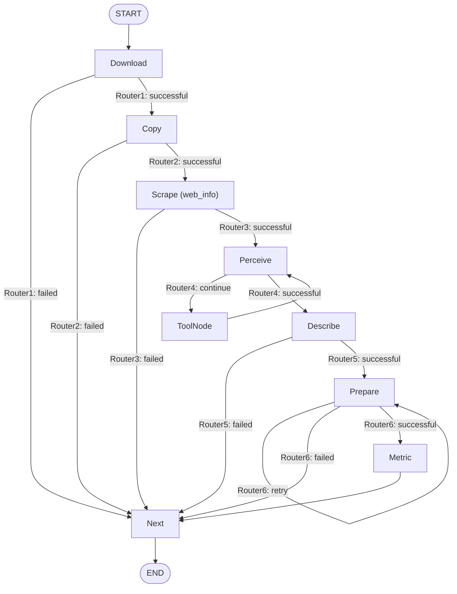

# NodeExecutor — the seven-phase OpenMLE-Gym task-builder pipeline

<!-- connect:up:begin -->
> **Cross-repo concept:** part of [verification-independence](../../../concepts/verification-independence.md) across this wiki's repos.
<!-- connect:up:end -->
## Overview
`NodeExecutor` is the machine that *manufactures* an OpenMLE-Gym task, not the machine that
solves one. Given a raw Kaggle competition id, it runs a fixed seven-phase LangGraph pipeline —
download, copy/extract, scrape metadata, perceive (an LLM tool-loop that inventories files),
describe, prepare (LLM-authored `prepare.py`), and generate a metric script — and leaves behind
exactly the artifact the paper's Gym contract expects: a `public/` tree the eventual MLE agent can
see and a `private/` tree (hidden test answers) it cannot. [`Structure`](../catalog/OpenMLE-Gym/builder_core/utils/struct.md#Structure)
encodes that directory contract; [`Graph`](../catalog/OpenMLE-Gym/builder_core/design.md#Graph)
wires the phases into a single-competition state machine; every phase but
[`Download`](../catalog/OpenMLE-Gym/builder_core/utils/nodes.md#NodeExecutor.Download) is written
to fail *without* throwing — each wraps its whole body in `try`/`except`, recording an error into
the shared `todo` dict and letting a router decide whether to continue, retry, or bail to the
terminal [`Next`](../catalog/OpenMLE-Gym/builder_core/utils/nodes.md#NodeExecutor.Next) node.
`Download`'s own body is not wrapped this way — it delegates the actual fetch to an internal helper
that catches its own errors, but code outside that helper (its initial directory creation) is
unguarded (see Design rationale below) — so in the common case a single bad competition can never
crash the batch.

## Diagram

## Design rationale (why it's built this way)
- **Most phases swallow their own exceptions — `Download` is the exception, not the rule.**
  [`Copy`](../catalog/OpenMLE-Gym/builder_core/utils/nodes.md#NodeExecutor.Copy),
  [`Scrape`](../catalog/OpenMLE-Gym/builder_core/utils/nodes.md#NodeExecutor.Scrape),
  [`Describe`](../catalog/OpenMLE-Gym/builder_core/utils/nodes.md#NodeExecutor.Describe) and
  [`Metric`](../catalog/OpenMLE-Gym/builder_core/utils/nodes.md#NodeExecutor.Metric) each wrap
  their body in `try/except`, append a message to `todo["errors"]`, and return normally — never
  let the phase raise out of the graph node.
  [`Download`](../catalog/OpenMLE-Gym/builder_core/utils/nodes.md#NodeExecutor.Download) does
  *not* follow this pattern itself: its own body — including the initial `comp_id_dir` creation —
  is not wrapped in `try/except`; it instead delegates the actual fetch to an internal `download`
  helper method that has its own internal `try/except` and always returns a `{"success": ...}`
  dict, but a failure in `Download`'s own code (e.g. its `mkdir` call) would propagate out of the
  node uncaught. In the common case this still keeps the LangGraph state machine total — every
  node returns, so the graph reaches [`Next`](../catalog/OpenMLE-Gym/builder_core/utils/nodes.md#NodeExecutor.Next)
  and writes a `task_result` even for a competition that failed at phase one — but that totality
  is not actually enforced for `Download` the way it is for the other five phases.
- **Perceive is deliberately fail-open, and says so.** Its own docstring states: *"`todo["perceive"]`
  means the tool loop has terminated. Inventory failures are recorded but deliberately degrade to
  the Describe stage."* [`Perceive`](../catalog/OpenMLE-Gym/builder_core/utils/nodes.md#NodeExecutor.Perceive)
  sets `todo["perceive"] = True` on *every* exit path — success, an LLM exception, an empty/filtered
  tool-call list, or hitting the tool-call ceiling — so a stuck or misbehaving inventory step can
  never deadlock a batch of thousands of competitions; it degrades to "best-effort inventory" instead.
  This is pinned by four tests exercising exactly those failure modes:
  [`test_llm_exception_uses_fail_open_exit`](../catalog/OpenMLE-Gym/tests/test_perceive.md#PerceiveTests.test_llm_exception_uses_fail_open_exit),
  [`test_no_tool_call_uses_fail_open_exit`](../catalog/OpenMLE-Gym/tests/test_perceive.md#PerceiveTests.test_no_tool_call_uses_fail_open_exit),
  [`test_filtered_tool_calls_use_fail_open_exit`](../catalog/OpenMLE-Gym/tests/test_perceive.md#PerceiveTests.test_filtered_tool_calls_use_fail_open_exit),
  [`test_tool_call_limit_uses_fail_open_exit`](../catalog/OpenMLE-Gym/tests/test_perceive.md#PerceiveTests.test_tool_call_limit_uses_fail_open_exit).
- **`public/` vs `private/` is not a naming convention, it is the hidden-evaluator boundary.**
  [`public_dir`](../catalog/OpenMLE-Gym/builder_core/utils/struct.md#Structure.public_dir)
  and [`private_dir`](../catalog/OpenMLE-Gym/builder_core/utils/struct.md#Structure.private_dir)
  are two distinct directories under [`data_dir`](../catalog/OpenMLE-Gym/builder_core/utils/struct.md#Structure.data_dir),
  and [`prepare_validation`](../catalog/OpenMLE-Gym/builder_core/utils/nodes.md#NodeExecutor.prepare_validation)
  checks `train.csv`/`test.csv`/`sample_submission.csv` under `public_dir` but `test_answer.csv`
  under `private_dir` — the same split the paper's task contract calls the "hidden evaluator." An
  LLM-authored `prepare.py` (built by [`Prepare`](../catalog/OpenMLE-Gym/builder_core/utils/nodes.md#NodeExecutor.Prepare))
  is handed both output directories and is trusted to route the answer key into the private one;
  nothing downstream re-checks that a competition's answers didn't leak into `public/` beyond this
  file-existence gate.
  > [!inferred] The module does not itself enforce that `private_dir`'s contents are withheld from
  > a solving agent at evaluation time — that guarantee has to come from whatever later reads
  > `public_dir`/`private_dir` outside this packet's subgraph.
- **`prepare_single_competition` has two execution strategies, and the choice is a real security/perf
  tradeoff, not an implementation detail.** With `code_execution_mode="process"` (the default),
  [`get_prepare_function`](../catalog/OpenMLE-Gym/builder_core/utils/nodes.md#NodeExecutor.get_prepare_function)
  dynamically imports the LLM-generated `prepare.py` into the builder's own Python process and calls
  it directly — fast, but the untrusted generated code runs with the builder's own privileges. With
  `code_execution_mode="isolated"`, the same step instead calls
  [`run_task_process`](../catalog/OpenMLE-Gym/openmle_gym/process_runner.md#run_task_process), which
  shells out via [`_container_command`](../catalog/OpenMLE-Gym/openmle_gym/process_runner.md#_container_command)
  to a `docker`/`podman` container with `--network none`, `--read-only`, `--cap-drop ALL`, and
  explicit CPU/memory/pid limits, mounting only the specific `readonly_paths`/`writable_paths` the
  step needs. This is the builder's own instance of the same sandboxed-execution contract the paper
  describes for evaluating submitted MLE programs, applied here to the LLM-authored `prepare.py`
  itself before it is ever trusted.
- **Only `Prepare` gets a retry loop; `Metric` does not.** [`Router6`](../catalog/OpenMLE-Gym/builder_core/utils/nodes.md#NodeExecutor.Router6)
  is the one router with a third branch (`"retry"`, decrementing `todo["retry"]` and looping back to
  `prepare`), because a broken `prepare.py` blocks every later phase (there is no data to describe a
  metric against without it). A broken `metric.py` just gets recorded as an error in `Metric` with no
  retry — the pipeline accepts a competition with data but no evaluator script rather than spend
  further LLM calls on it.

## Entry points
- [`Graph`](../catalog/OpenMLE-Gym/builder_core/design.md#Graph) — the top-level factory. Called once
  per competition to construct one `NodeExecutor`, register its methods as LangGraph nodes, and wire
  `Router1`–`Router6` as the conditional-edge selectors between them; the caller then runs the
  returned graph to actually process the competition.
- [`Download`](../catalog/OpenMLE-Gym/builder_core/utils/nodes.md#NodeExecutor.Download) — the node
  `START` unconditionally transitions to; control always reaches here first for a given competition.
- [`Perceive`](../catalog/OpenMLE-Gym/builder_core/utils/nodes.md#NodeExecutor.Perceive) — reached
  once after `Scrape` succeeds, then re-entered on every iteration of the tool loop (`tool` node loops
  back into it) until `Router4` resolves the loop.
- [`prepare_implement`](../catalog/OpenMLE-Gym/builder_core/utils/nodes.md#NodeExecutor.prepare_implement) —
  called from inside `Prepare` after an LLM-authored `prepare.py` compiles; a distinct internal entry
  point that wraps [`prepare_single_competition`](../catalog/OpenMLE-Gym/builder_core/utils/nodes.md#NodeExecutor.prepare_single_competition)
  with cleanup-on-failure via [`_cleanup_failed_competition`](../catalog/OpenMLE-Gym/builder_core/utils/nodes.md#NodeExecutor._cleanup_failed_competition).

## Mechanism (step-by-step)
1. **Construction sets up per-batch state.** `NodeExecutor.__init__` builds one
   [`structure`](../catalog/OpenMLE-Gym/builder_core/utils/nodes.md#NodeExecutor.structure) —
   a [`Structure`](../catalog/OpenMLE-Gym/builder_core/utils/struct.md#Structure) rooted at
   `base_dir/batch_name`, which eagerly creates [`TASK_DIR`](../catalog/OpenMLE-Gym/builder_core/utils/struct.md#Structure.TASK_DIR)
   and its `downloads/`/`forge/`/`data/` subdirectories — and stores the one competition this
   instance will build as [`todo`](../catalog/OpenMLE-Gym/builder_core/utils/nodes.md#NodeExecutor.todo),
   a mutable dict that every phase reads and writes for the rest of the pipeline.
2. **`Graph` wires the seven phases into a single-competition state machine.** It instantiates one
   `NodeExecutor`, registers `Download`/`Copy`/`Scrape`/`Perceive`/`Describe`/`Prepare`/`Metric`/`Next`
   as graph nodes, and connects them with `Router1`–`Router6` conditional edges — five of the six
   routers are a plain "successful → continue, failed → jump straight to `Next`" short-circuit;
   [`Router6`](../catalog/OpenMLE-Gym/builder_core/utils/nodes.md#NodeExecutor.Router6) alone adds a
   `"retry"` branch back into `Prepare`, and `Router4` alone replaces `"failed"` with `"continue"`
   (looping into the tool node rather than bailing). See [`Graph`](../catalog/OpenMLE-Gym/builder_core/design.md#Graph).
3. **`Download` and `Copy` populate the raw/data trees.** `Download` fetches the competition archive
   into `structure.DOWNLOAD_DIR`'s per-competition subfolder — a directory distinct from
   `comp_id_dir` (the `forge/` tree), which `Download` only touches to create the empty per-competition
   directory that later phases write `rawtree.txt`/`fileinfo.txt`/etc. into — and flips
   `todo["download"]`; `Copy` then creates
   every per-competition subdirectory up front —
   [`raw_dir`](../catalog/OpenMLE-Gym/builder_core/utils/struct.md#Structure.raw_dir),
   [`data_dir`](../catalog/OpenMLE-Gym/builder_core/utils/struct.md#Structure.data_dir),
   [`utils_dir`](../catalog/OpenMLE-Gym/builder_core/utils/struct.md#Structure.utils_dir),
   [`public_dir`](../catalog/OpenMLE-Gym/builder_core/utils/struct.md#Structure.public_dir),
   [`private_dir`](../catalog/OpenMLE-Gym/builder_core/utils/struct.md#Structure.private_dir) — before
   extracting the archive into `raw_dir` and writing a `rawtree.txt` directory listing that later
   phases consume as prompt context.
4. **`Scrape` (labelled `web_info` in the graph) is metadata lookup, not a live web fetch.** Despite
   printing "Fetching web information", [`Scrape`](../catalog/OpenMLE-Gym/builder_core/utils/nodes.md#NodeExecutor.Scrape)
   reads overview/dataset text out of a pre-supplied CSV keyed by competition slug and writes it to
   `webinfo.json` under [`comp_id_dir`](../catalog/OpenMLE-Gym/builder_core/utils/struct.md#Structure.comp_id_dir);
   it only fails (`Router3` → `"failed"`) when *both* fields are missing from the CSV row.
5. **`Perceive` is the one LLM-agentic phase, and it is explicitly allowed to give up.** It queries
   [`query`](../catalog/OpenMLE-Gym/builder_core/utils/chat.md#OpenAILLMProvider.query)
   with the raw-file tree and the tool-call history so far, filters the response's proposed tool calls
   down to the fixed allow-list `self.tools`, and treats a message where the *last* tool result is an
   exact-string match on `"Successfully saved to fileinfo.txt"` from the `save` tool as completion.
   Any other outcome — a filtered-to-empty tool-call list, no tool calls at all, an LLM exception, or
   exceeding `self.max_tool_call` (40) — still sets `todo["perceive"] = True` and records the reason
   in `todo["errors"]` rather than looping forever; see the fail-open tests above and
   [`comp_id_dir`](../catalog/OpenMLE-Gym/builder_core/utils/struct.md#Structure.comp_id_dir).
6. **`Describe` synthesizes `description.txt` from everything gathered so far.** It reads
   `webinfo.json`, `rawtree.txt`, and `fileinfo.txt` (whatever `Perceive` managed to produce),
   loads a worked example via [`_load_sample_file`](../catalog/OpenMLE-Gym/builder_core/utils/nodes.md#NodeExecutor._load_sample_file),
   and calls [`query`](../catalog/OpenMLE-Gym/builder_core/utils/chat.md#OpenAILLMProvider.query) on
   `llm_provider` (the non-tool-bound provider) to produce the description text, gated onward by
   `Router5`.
7. **`Prepare` is a generate → execute → validate → retry loop.** It prompts the LLM for `prepare.py`
   source, compiles it, and executes it either in-process (via
   [`get_prepare_function`](../catalog/OpenMLE-Gym/builder_core/utils/nodes.md#NodeExecutor.get_prepare_function))
   or, in isolated mode, through
   [`run_task_process`](../catalog/OpenMLE-Gym/openmle_gym/process_runner.md#run_task_process), which
   returns a non-throwing [`TaskProcessOutcome`](../catalog/OpenMLE-Gym/openmle_gym/process_runner.md#TaskProcessOutcome)
   (checked via its [`ok`](../catalog/OpenMLE-Gym/openmle_gym/process_runner.md#TaskProcessOutcome.ok)
   field) inside a locked-down container built by
   [`_container_command`](../catalog/OpenMLE-Gym/openmle_gym/process_runner.md#_container_command).
   The result is checked by [`prepare_validation`](../catalog/OpenMLE-Gym/builder_core/utils/nodes.md#NodeExecutor.prepare_validation)
   against the five required output files; success calls
   [`prepare_implement`](../catalog/OpenMLE-Gym/builder_core/utils/nodes.md#NodeExecutor.prepare_implement)
   (which cleans up via [`_cleanup_failed_competition`](../catalog/OpenMLE-Gym/builder_core/utils/nodes.md#NodeExecutor._cleanup_failed_competition)
   on failure), and failure decrements `todo["retry"]`, with `Router6` looping back into `Prepare`
   while attempts remain.
8. **`Metric` authors the evaluator script with no retry safety net.** It builds a prompt from
   `description.txt` plus small previews of `sample_submission.csv`/`test_answer.csv`, generates and
   compiles `metric.py`, and persists it with
   [`atomic_write_text`](../catalog/OpenMLE-Gym/openmle_gym/common.md#atomic_write_text) into
   [`utils_dir`](../catalog/OpenMLE-Gym/builder_core/utils/struct.md#Structure.utils_dir) — any
   failure here (unlike `Prepare`) just records an error and leaves `todo["metric"]` unset.
9. **`Next` is the terminal aggregator, not just a sink.** It ANDs all six phase flags into
   `todo["success"]`, then optionally deletes `raw_dir` — but only when *both* `delete_raw=True`
   **and** `todo["success"]` is already `True` (a competition that failed any earlier phase never
   has its `raw_dir` touched here, regardless of `delete_raw`), and even then only if
   `fileinfo.txt` is non-empty; otherwise (empty `fileinfo.txt`, with `success` already `True`) it
   explicitly keeps `raw_dir` and appends an error — writes a `prepares.json` audit trail of every `Prepare` attempt,
   and returns `{"task_result": self.todo}`. See [`Next`](../catalog/OpenMLE-Gym/builder_core/utils/nodes.md#NodeExecutor.Next),
   [`atomic_write_text`](../catalog/OpenMLE-Gym/openmle_gym/common.md#atomic_write_text),
   [`data_comp_id_dir`](../catalog/OpenMLE-Gym/builder_core/utils/struct.md#Structure.data_comp_id_dir),
   [`raw_dir`](../catalog/OpenMLE-Gym/builder_core/utils/struct.md#Structure.raw_dir), and the pinning
   test [`test_empty_fileinfo_preserves_raw_on_delete_request`](../catalog/OpenMLE-Gym/tests/test_perceive.md#PerceiveTests.test_empty_fileinfo_preserves_raw_on_delete_request).

## Key data structures
- [`Structure`](../catalog/OpenMLE-Gym/builder_core/utils/struct.md#Structure) — the directory
  contract for one batch: `TASK_DIR` (= `BASE/batch_name`) containing `DOWNLOAD_DIR`, `COMP_DIR`
  (`forge/`, one folder per competition holding `rawtree.txt`/`fileinfo.txt`/`webinfo.json`/
  `description.txt`), and `DATA_DIR` (per-competition `data/{public,private,utils}`). All accessor
  methods ([`comp_id_dir`](../catalog/OpenMLE-Gym/builder_core/utils/struct.md#Structure.comp_id_dir),
  [`data_comp_id_dir`](../catalog/OpenMLE-Gym/builder_core/utils/struct.md#Structure.data_comp_id_dir),
  [`raw_dir`](../catalog/OpenMLE-Gym/builder_core/utils/struct.md#Structure.raw_dir),
  [`data_dir`](../catalog/OpenMLE-Gym/builder_core/utils/struct.md#Structure.data_dir),
  [`utils_dir`](../catalog/OpenMLE-Gym/builder_core/utils/struct.md#Structure.utils_dir),
  [`public_dir`](../catalog/OpenMLE-Gym/builder_core/utils/struct.md#Structure.public_dir),
  [`private_dir`](../catalog/OpenMLE-Gym/builder_core/utils/struct.md#Structure.private_dir)) are
  pure path arithmetic off these four roots — no I/O beyond the constructor's `mkdir`.
- `todo` ([`todo`](../catalog/OpenMLE-Gym/builder_core/utils/nodes.md#NodeExecutor.todo))
  — the one mutable dict every phase reads and writes: `name`, boolean gates per phase
  (`download`/`copy`/`web_info`/`perceive`/`describe`/`prepare`/`metric`/`success`), `errors` (append-only
  log), `retry` (decremented by `Prepare`/`Router6`), and `prepares` (the running LLM message history
  for the `Prepare` retry loop, later flattened into `prepares.json` by `Next`).
- [`AgentState`](../catalog/OpenMLE-Gym/builder_core/utils/state.md#AgentState) — the LangGraph state
  type each node receives and returns; a `TypedDict` carrying only `messages` (accumulated via
  LangGraph's message reducer) and an optional `task_result`, which `Next` is the only node that sets.
- [`TaskProcessOutcome`](../catalog/OpenMLE-Gym/openmle_gym/process_runner.md#TaskProcessOutcome) — the
  non-throwing result envelope [`run_task_process`](../catalog/OpenMLE-Gym/openmle_gym/process_runner.md#run_task_process)
  always returns instead of letting a subprocess/container failure propagate as an exception:
  [`ok`](../catalog/OpenMLE-Gym/openmle_gym/process_runner.md#TaskProcessOutcome.ok),
  [`result`](../catalog/OpenMLE-Gym/openmle_gym/process_runner.md#TaskProcessOutcome.result),
  [`error`](../catalog/OpenMLE-Gym/openmle_gym/process_runner.md#TaskProcessOutcome.error),
  [`stdout`](../catalog/OpenMLE-Gym/openmle_gym/process_runner.md#TaskProcessOutcome.stdout),
  [`stderr`](../catalog/OpenMLE-Gym/openmle_gym/process_runner.md#TaskProcessOutcome.stderr),
  [`returncode`](../catalog/OpenMLE-Gym/openmle_gym/process_runner.md#TaskProcessOutcome.returncode) —
  the same shape `prepare_single_competition` checks in isolated mode.

## Dynamics (design intent)
The pipeline is strictly sequential and single-competition per `NodeExecutor` instance — one
[`Graph`](../catalog/OpenMLE-Gym/builder_core/design.md#Graph) call builds a state machine for one
`todo` competition dict; nothing in this module spawns concurrent phases. The only loop *within* the
graph is `Perceive` ⇄ `tool` (bounded by `self.max_tool_call = 40`, set in the constructor) and
`Prepare` ⇄ itself via `Router6`'s `"retry"` edge (bounded by `todo["retry"]` counting down to `-1`).
Both loops are designed to always terminate: `Perceive` fails open before it can spin forever, and
`Prepare`'s retry counter forces an eventual `"failed"` route. [`Router1`](../catalog/OpenMLE-Gym/builder_core/utils/nodes.md#NodeExecutor.Router1),
[`Router2`](../catalog/OpenMLE-Gym/builder_core/utils/nodes.md#NodeExecutor.Router2),
[`Router3`](../catalog/OpenMLE-Gym/builder_core/utils/nodes.md#NodeExecutor.Router3), and
[`Router5`](../catalog/OpenMLE-Gym/builder_core/utils/nodes.md#NodeExecutor.Router5) have no loop at
all — each reads its docstring name ("Route based on download/copy/web info/describe status") and
a `"failed"` result there is a one-way trip straight to `Next`, skipping every remaining phase.

> [!inferred] Nothing in this packet's subgraph shows how multiple competitions are processed
> concurrently (e.g. one process/thread per `Graph` instance across a batch); that orchestration, if
> it exists, lives outside this module.

## Edge cases
- `Perceive`'s completion check is an **exact string match** — `last_tool.content.strip() ==
  "Successfully saved to fileinfo.txt"` from a tool named `save` — not a substring or fuzzy check.
  [`test_saved_substring_from_other_tool_degrades`](../catalog/OpenMLE-Gym/tests/test_perceive.md#PerceiveTests.test_saved_substring_from_other_tool_degrades)
  pins that a *different* tool's output merely containing the word "saved" does **not** satisfy the
  check and instead falls through into a fresh LLM query (which, in that test, has no tool calls and
  degrades via the fail-open path); only [`test_only_successful_save_tool_message_completes_normally`](../catalog/OpenMLE-Gym/tests/test_perceive.md#PerceiveTests.test_only_successful_save_tool_message_completes_normally)
  exercises the true "clean" completion with an empty `errors` list.
- `Router4` is the only router whose non-terminal branch is `"continue"` rather than `"failed"` —
  reading the router table alone, it is easy to assume all six routers share the same
  `{"failed", "successful"}` vocabulary; `Router4` alone maps to `{"continue", "successful"}`.
- `Next`'s raw-data deletion is conditioned on *content*, not just the `delete_raw` flag: even with
  `delete_raw=True` and every phase flag `True` (`todo["success"] = True`), an empty `fileinfo.txt`
  causes `raw_dir` to be **preserved** and an error to be appended — a competition can therefore end
  up simultaneously "successful" and carrying an entry in `todo["errors"]`. Pinned by
  [`test_empty_fileinfo_preserves_raw_on_delete_request`](../catalog/OpenMLE-Gym/tests/test_perceive.md#PerceiveTests.test_empty_fileinfo_preserves_raw_on_delete_request).
- Isolated execution mode has hard external prerequisites: [`_container_command`](../catalog/OpenMLE-Gym/openmle_gym/process_runner.md#_container_command)
  raises if neither `docker` nor `podman` is on `PATH`, or if `OPENMLE_GYM_ISOLATED_IMAGE` is unset —
  but because this happens inside `run_task_process`'s `try/except`, it surfaces as a normal
  `TaskProcessOutcome(ok=False, error=...)` rather than an uncaught exception, so `prepare_single_competition`
  sees it as just another prepare failure to retry, not a configuration error to fix.
- `Router6`'s `"retry"` branch only fires while `todo["retry"] > -1`; the retry counter itself is
  never initialized inside this module (it is read and decremented, never set to its starting value
  here), so a caller that omits it from the initial `todo` dict would hit a `KeyError` on the first
  `Prepare` failure rather than a graceful `"failed"` route.

## Open questions
- The `Task` type referenced by `NodeExecutor.__init__`'s `todo: Task` annotation is not in this
  packet's subgraph, so its exact required keys (beyond what `Next` and the routers dereference,
  e.g. `retry`, `prepares`, `errors`) can't be confirmed from this page alone.
- How `Graph`'s per-competition state machines are driven across the full 5,758-task corpus the
  paper describes — sequentially, or fanned out across the CPU/GPU worker pool the paper's Gym
  contract mentions — is not visible in this subgraph; see
  [`run_task_process`](../catalog/OpenMLE-Gym/openmle_gym/process_runner.md#run_task_process) for the
  one process-isolation primitive that *is* grounded here.
- Whether the isolated-mode sandbox built by `_container_command` (used here only for the builder's
  own `prepare.py` validation) is the *same* execution path used later to score a submitted MLE
  program against the hidden evaluator, or a separate one, isn't settled by this packet.

## See also
- [OpenMLE-Gym openmle_gym.process_runner](../concepts/OpenMLE-Gym-openmle_gym-process_runner.md) —
  the `run_task_process`/`TaskProcessOutcome`/`_container_command` sandboxed-execution primitive this
  module's isolated `Prepare` path delegates to.
- [`wiki/concepts/verification-independence.md`](../../../concepts/verification-independence.md) —
  the cross-repo concept this module's `public_dir`/`private_dir` split instantiates.
- [`wiki/sources/frontis-ma1.md`](../../../sources/frontis-ma1.md) — the paper's OpenMLE-Gym task
  contract (§3) this pipeline builds task instances for.
