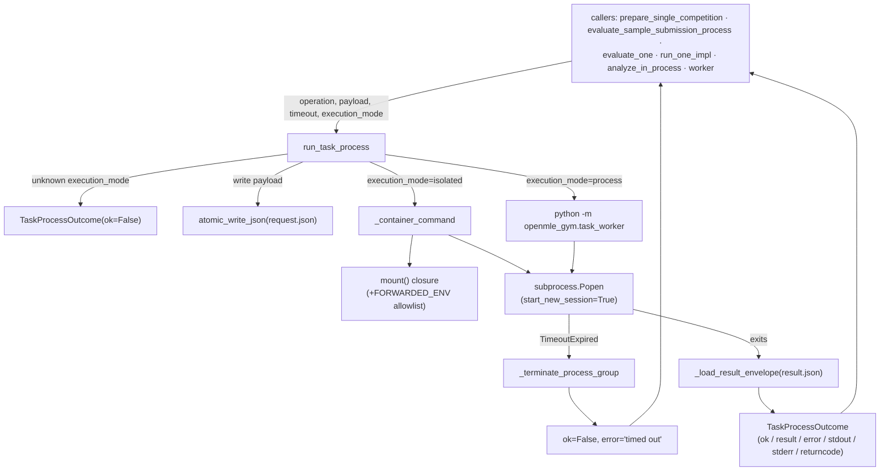

# The process runner — OpenMLE-Gym's non-throwing sandboxed task executor

<!-- connect:up:begin -->
> **Cross-repo concept:** part of [verification-independence](../../../concepts/verification-independence.md) across this wiki's repos.
<!-- connect:up:end -->
## Overview
[`run_task_process`](../catalog/OpenMLE-Gym/openmle_gym/process_runner.md#run_task_process) is the execution
primitive OpenMLE-Gym uses to run a task operation — building a competition, computing an overview row,
scoring a submission, evaluating a task end-to-end — inside a disposable process. Its docstring states the
contract plainly: *"Run one task in a disposable process and return a non-throwing outcome."* Most callers
in this codebase, whether they want to grade a submission or generate metadata, funnel through this one
function and get back the same frozen value type,
[`TaskProcessOutcome`](../catalog/OpenMLE-Gym/openmle_gym/process_runner.md#TaskProcessOutcome), instead of
a raised exception — the one exception is
[`prepare_single_competition`](../catalog/OpenMLE-Gym/builder_core/utils/nodes.md#NodeExecutor.prepare_single_competition)
(see Entry points below), which routes through `run_task_process` only when its caller opted into
`code_execution_mode="isolated"`; under the (default) `"process"` mode it calls the task's `prepare`
function directly, in-process, bypassing this module entirely. For the callers that do go through it, the
key idea is that a crash, a hang, a missing file, or malformed JSON from the child process are not
exceptional — they are just different values of `ok`/`error`/`returncode`, so a batch driver running dozens
of tasks concurrently never needs a `try/except` around any individual task attempt.

## Diagram

## Design rationale (why it's built this way)
**A frozen outcome value, not an exception, is the entire API.**
[`TaskProcessOutcome`](../catalog/OpenMLE-Gym/openmle_gym/process_runner.md#TaskProcessOutcome) is a
`@dataclass(frozen=True)` with fields
[`ok`](../catalog/OpenMLE-Gym/openmle_gym/process_runner.md#TaskProcessOutcome.ok),
[`result`](../catalog/OpenMLE-Gym/openmle_gym/process_runner.md#TaskProcessOutcome.result),
[`error`](../catalog/OpenMLE-Gym/openmle_gym/process_runner.md#TaskProcessOutcome.error),
[`stdout`](../catalog/OpenMLE-Gym/openmle_gym/process_runner.md#TaskProcessOutcome.stdout),
[`stderr`](../catalog/OpenMLE-Gym/openmle_gym/process_runner.md#TaskProcessOutcome.stderr), and
[`returncode`](../catalog/OpenMLE-Gym/openmle_gym/process_runner.md#TaskProcessOutcome.returncode). Freezing
it means a value produced inside a worker thread (the tests exercise it under `ThreadPoolExecutor`) or
returned across an `asyncio.to_thread` hop (as [`worker`](../catalog/OpenMLE-Gym/openmle_gym/build.md#_run_all.worker)
does) can be handed back to the caller without any synchronization concern — it is a snapshot, not a
mutable handle into the child process. Every failure path inside
[`run_task_process`](../catalog/OpenMLE-Gym/openmle_gym/process_runner.md#run_task_process) — an unknown
`execution_mode`, a `_container_command` construction error, a failed `Popen`, a timeout, a nonzero exit, a
missing `result.json`, an unparsable envelope, or an envelope whose own `"ok"` key isn't `True` — constructs
and *returns* a `TaskProcessOutcome(ok=False, ...)` rather than letting the exception propagate. That
uniform shape is what lets every caller (`prepare_single_competition`, `worker`, `evaluate_one`, …) treat
"the task blew up" and "the task ran but scored badly" as the same kind of value to branch on.

**Every task attempt gets its own disposable filesystem and process tree.** Inside
[`run_task_process`](../catalog/OpenMLE-Gym/openmle_gym/process_runner.md#run_task_process), a fresh
`tempfile.TemporaryDirectory` is created per call and the payload is written to it via
[`atomic_write_json`](../catalog/OpenMLE-Gym/openmle_gym/common.md#atomic_write_json) (which itself composes
[`json_safe`](../catalog/OpenMLE-Gym/openmle_gym/common.md#json_safe) to coerce scientific-Python values —
including exceptions — into JSON, and
[`atomic_write_text`](../catalog/OpenMLE-Gym/openmle_gym/common.md#atomic_write_text) /
[`ensure_parent`](../catalog/OpenMLE-Gym/openmle_gym/common.md#ensure_parent) to make the write itself
crash-safe via a temp-file-then-`os.replace` swap). Nothing about one call's request/result files is shared
with another call's — the directory is deleted on context exit regardless of outcome. That's what lets
[`test_same_dynamic_module_name_is_isolated_between_tasks`](../catalog/OpenMLE-Gym/tests/test_process_isolation.md#ProcessIsolationTests.test_same_dynamic_module_name_is_isolated_between_tasks)
pass: two tasks whose task-local metric modules share the *same* dynamic module name still evaluate to
different scores, because each ran in its own OS process with its own `sys.modules`, not because
`process_runner` did anything module-name-aware.

**"isolated" mode is a real trust boundary, not a resource limiter.** In `execution_mode="isolated"`,
[`_container_command`](../catalog/OpenMLE-Gym/openmle_gym/process_runner.md#_container_command) builds a
`docker`/`podman run` invocation that drops all capabilities, disables networking, mounts the root
filesystem read-only, and — via the local
[`mount`](../catalog/OpenMLE-Gym/openmle_gym/process_runner.md#_container_command.mount) closure (which
de-duplicates identical `(path, mode)` pairs so the same directory bound from two call sites doesn't
produce redundant `--volume` flags) — mounts read-write the per-call temp directory holding
`request.json`/`result.json`, plus the caller-declared `readonly_paths` (read-only) and `writable_paths`
(read-write); no other part of the host filesystem is exposed. Crucially, it also *withholds secrets by
default*: the container only
receives an environment variable from
[`FORWARDED_ENV`](../catalog/OpenMLE-Gym/openmle_gym/process_runner.md#FORWARDED_ENV) — a fixed allowlist of
LLM and Kaggle credentials — and even that allowlist is emptied entirely for the `"prepare"` and `"metric"`
operations (`forwarded_env = () if operation in {"prepare", "metric"} else FORWARDED_ENV`). Those two
operations are exactly the ones that run task-authored (and, per the builder pipeline, sometimes
LLM-generated) `prepare.py`/`metric.py` code, so the code most likely to be arbitrary or adversarial is the
code least likely to see an API key. This operation-conditioned secret-stripping, combined with no network
access and no source-tree mount, is a concrete instance of
[`verification-independence`](../../../concepts/verification-independence.md): the process computing a
score is denied the means to exfiltrate credentials or reach out to influence its own grading.

> [!inferred] This protection is opt-in, not default. The default `execution_mode` is `"process"`, and in
> that branch `run_task_process` passes `environment = os.environ.copy()` — the full parent environment,
> unfiltered — straight to the child via `subprocess.Popen(..., env=environment, ...)`. The `FORWARDED_ENV`
> allowlist only exists inside `_container_command`, so it only constrains what a *containerized* worker
> sees; a `"process"`-mode worker (including one running `"prepare"` or `"metric"`) inherits every
> credential the parent has. Whether that asymmetry is an accepted risk (defense only matters once you
> route untrusted code through `"isolated"`) or an oversight is not stated anywhere in source.

## Entry points
- [`prepare_single_competition`](../catalog/OpenMLE-Gym/builder_core/utils/nodes.md#NodeExecutor.prepare_single_competition) —
  reached when the builder pipeline needs to materialize a competition's public/private data; it only
  routes through `run_task_process` when `self.code_execution_mode == "isolated"` (passing
  `readonly_paths`/`writable_paths` scoped to that one competition's directories), and otherwise calls the
  task's `prepare` function directly in-process, unsandboxed — the isolation is a caller choice, not
  something `process_runner` imposes.
- [`evaluate_sample_submission_process`](../catalog/OpenMLE-Gym/openmle_gym/metric_validation.md#evaluate_sample_submission_process) —
  reached whenever a candidate's submission needs a metric score; it raises `RuntimeError` itself if the
  returned outcome is not `ok` or its `result` isn't a dict containing `"score"`, converting `process_runner`'s
  non-throwing contract back into an exception at the point where the caller can't proceed without a score.
- [`evaluate_one`](../catalog/OpenMLE-Gym/openmle_gym/local_evaluator.md#evaluate_tasks.evaluate_one) — the
  per-task unit of work inside the local evaluator's batch driver; on a bad outcome it builds a
  `_failed_task_result` for that one task instead of raising, which is what lets the surrounding batch
  continue past a single crashed task.
- [`run_one_impl`](../catalog/OpenMLE-Gym/openmle_gym/overview.md#generate_overview.run_one_impl) and
  [`analyze_in_process`](../catalog/OpenMLE-Gym/openmle_gym/overview.md#_run_metadata_pipeline.analyze_in_process) —
  the two overview-generation paths (batch-row builder vs. single-task metadata pipeline); the former
  degrades to a `_failed_overview_row` on bad output, the latter raises `RuntimeError`, showing that what
  "invalid outcome" means downstream is a per-caller decision, not something `process_runner` dictates.
- [`worker`](../catalog/OpenMLE-Gym/openmle_gym/build.md#_run_all.worker) — the async per-slug unit inside
  the batch builder; it calls `run_task_process` via `asyncio.to_thread` under a semaphore, and on a bad or
  malformed outcome returns a `{"success": False, "errors": [...]}` dict rather than letting the exception
  cancel sibling slugs' futures.

## Mechanism (step-by-step)
1. A caller assembles a JSON-serializable `payload` dict and calls
   [`run_task_process`](../catalog/OpenMLE-Gym/openmle_gym/process_runner.md#run_task_process) with an
   `operation` string, a `timeout`, and optionally `execution_mode`, `readonly_paths`, and `writable_paths`.
   If `execution_mode` isn't `"process"` or `"isolated"`, the function returns
   `TaskProcessOutcome(ok=False, error=...)` immediately — no temp directory, no subprocess.
2. A fresh `tempfile.TemporaryDirectory` is created for this call only, and the payload is serialized to
   `request.json` inside it via [`atomic_write_json`](../catalog/OpenMLE-Gym/openmle_gym/common.md#atomic_write_json),
   which atomically replaces the target file so the child process can never observe a half-written request.
3. The command to run is decided: `"process"` mode runs `python -m openmle_gym.task_worker <operation>
   <request_path> <result_path>` directly; `"isolated"` mode instead delegates to
   [`_container_command`](../catalog/OpenMLE-Gym/openmle_gym/process_runner.md#_container_command), which
   resolves the `docker`/`podman` binary, requires an `OPENMLE_GYM_ISOLATED_IMAGE`, and raises if either is
   missing — that raise is caught around this step and converted into an `ok=False` outcome, so a
   misconfigured host fails the *task*, not the calling process.
4. The child is launched with `subprocess.Popen(..., start_new_session=True)`, putting it in its own process
   group, and `process.communicate(timeout=timeout)` blocks for output. On `subprocess.TimeoutExpired`, the
   whole group is torn down by [`_terminate_process_group`](../catalog/OpenMLE-Gym/openmle_gym/process_runner.md#_terminate_process_group)
   (`SIGTERM`, then `SIGKILL` after a 5-second grace) before `run_task_process` returns an `ok=False`
   outcome tagged `"Task timed out after {timeout}s"`, still carrying whatever partial `stdout`/`stderr` had
   been captured.
5. If the process runs to completion, `run_task_process` walks a strict validation ladder before trusting
   anything: nonzero `process.returncode` → failure; no `result.json` on disk → failure; a `result.json` that
   [`_load_result_envelope`](../catalog/OpenMLE-Gym/openmle_gym/process_runner.md#_load_result_envelope)
   can't parse as a JSON object → failure; an envelope whose `"ok"` key is not literally `True` → failure
   (using the child's own `"error"` string if present). Only after all four checks pass does it read
   `envelope["result"]` and construct `TaskProcessOutcome(ok=True, result=..., stdout=..., stderr=...,
   returncode=...)`.
6. Callers uniformly re-inspect `outcome.ok` and the shape of `outcome.result` before trusting it further —
   [`evaluate_sample_submission_process`](../catalog/OpenMLE-Gym/openmle_gym/metric_validation.md#evaluate_sample_submission_process)
   additionally requires `"score"` to be a key of `outcome.result`,
   [`evaluate_one`](../catalog/OpenMLE-Gym/openmle_gym/local_evaluator.md#evaluate_tasks.evaluate_one)
   requires a specific `required_result_keys` set and `outcome.result["task_name"] == task` — so the
   envelope's `"ok": true` is necessary but never sufficient on its own; each caller layers its own shape
   check on top of the generic contract.

## Key data structures
- [`TaskProcessOutcome`](../catalog/OpenMLE-Gym/openmle_gym/process_runner.md#TaskProcessOutcome) — the
  frozen return value described above; every field except `ok` defaults to an empty/`None` value, so a
  fast-failure path (bad `execution_mode`, `_container_command` error) can construct one with only `ok` and
  `error` set.
- The `request.json` / `result.json` pair inside the per-call temp directory — the entire wire format
  between `run_task_process` and the worker: a JSON object in, a JSON object with a mandatory `"ok"` boolean
  key out, read back by [`_load_result_envelope`](../catalog/OpenMLE-Gym/openmle_gym/process_runner.md#_load_result_envelope).
- [`FORWARDED_ENV`](../catalog/OpenMLE-Gym/openmle_gym/process_runner.md#FORWARDED_ENV) — the fixed tuple of
  environment-variable names (LLM API keys, Kaggle credentials) that `_container_command` is willing to pass
  into an isolated container at all, and only when the parent process actually has them set.

## Dynamics (design intent)
`run_task_process` is a plain, blocking, stateless function — no shared state survives between calls, since
each gets its own temp directory and its own OS process — and that statelessness is what makes it safe to
call concurrently. [`worker`](../catalog/OpenMLE-Gym/openmle_gym/build.md#_run_all.worker) wraps it in
`asyncio.to_thread` under a semaphore so an async batch driver gets bounded concurrency without blocking the
event loop on a synchronous call. The test suite makes the concurrency guarantee explicit rather than
implicit:
[`test_crashed_task_does_not_break_sibling_tasks`](../catalog/OpenMLE-Gym/tests/test_process_isolation.md#ProcessIsolationTests.test_crashed_task_does_not_break_sibling_tasks)
runs a good task, a task that calls `os._exit(9)`, and another good task through a `ThreadPoolExecutor`
(via the local [`run`](../catalog/OpenMLE-Gym/tests/test_process_isolation.md#ProcessIsolationTests.run)
helper) and asserts the two good tasks still score `1.0` while the crashed one comes back `ok=False` with
`returncode == 9`.
[`test_timeout_is_local_to_one_task`](../catalog/OpenMLE-Gym/tests/test_process_isolation.md#ProcessIsolationTests.test_timeout_is_local_to_one_task)
confirms a hanging task's `timeout=0.2` failure doesn't consume or corrupt a subsequently run good task's
own `timeout=10` budget.
[`test_isolated_mode_never_falls_back`](../catalog/OpenMLE-Gym/tests/test_process_isolation.md#ProcessIsolationTests.test_isolated_mode_never_falls_back)
encodes a specific promise about mode selection: `execution_mode="isolated"` must either succeed under real
container isolation or fail with an error message referencing `docker`/`podman`/`OPENMLE_GYM_ISOLATED_IMAGE`/`exited`
— it must never silently degrade to unsandboxed `"process"` execution.
[`test_prepare_operation_uses_its_own_result_envelope`](../catalog/OpenMLE-Gym/tests/test_process_isolation.md#ProcessIsolationTests.test_prepare_operation_uses_its_own_result_envelope)
shows the same function backing an entirely different `operation` string (`"prepare"` instead of
`"metric"`), confirming `operation` is just a dispatch key threaded into the child's payload, not something
`process_runner` branches on itself.

## Edge cases
- A worker that exits `0` but never writes `result.json`, or writes a non-object/unparsable JSON document,
  is still a failure — `run_task_process` never trusts the exit code alone
  ([`_load_result_envelope`](../catalog/OpenMLE-Gym/openmle_gym/process_runner.md#_load_result_envelope) is
  what enforces "must be a JSON object").
- A worker that exits `0` and writes a syntactically valid envelope is *still* a failure unless the
  envelope's own `"ok"` key is exactly `True` — a truthy-but-not-`True` value (e.g. `1`) would not satisfy
  `envelope.get("ok") is not True`.
- Timeouts kill the whole process group, not just the direct child — necessary because `start_new_session=True`
  means any grandchildren the worker spawns share that group, and
  [`_terminate_process_group`](../catalog/OpenMLE-Gym/openmle_gym/process_runner.md#_terminate_process_group)
  escalates from `SIGTERM` to `SIGKILL` only after a 5-second grace, so a task that traps `SIGTERM` and
  cleans up quickly still gets to.
- `_container_command`'s [`mount`](../catalog/OpenMLE-Gym/openmle_gym/process_runner.md#_container_command.mount)
  closure de-duplicates identical `(resolved_path, mode)` pairs — passing the same directory as both a
  `readonly_paths` and `writable_paths` entry (or from two overlapping call sites) does not produce
  duplicate `--volume` flags for the *same* mode, but the same path can still appear mounted twice if the
  modes differ.
- `"isolated"` mode strips `FORWARDED_ENV` entirely for `"prepare"` and `"metric"` operations even when
  those variables are set in the parent's environment — but `"process"` mode applies no such filtering for
  any operation (see the inferred note in Design rationale), so choosing `execution_mode="process"` for a
  `"prepare"`/`"metric"` call silently forgoes that protection.

## Open questions
> [!inferred] The subgraph for this packet does not include `openmle_gym.task_worker`'s `main()`/`_dispatch`
> — the code on the *other side* of the `Popen` call that actually writes `result.json`'s `"ok"`/`"error"`/`"result"`
> fields. That means the mapping from OpenMLE-Gym's paper-level six feedback modes (success, runtime error,
> missing code, missing submission, scoring failure, timeout) onto concrete return values is only partly
> grounded here: `run_task_process` itself clearly produces the **timeout** mode (its own `TimeoutExpired`
> branch) and a generic **runtime error** mode (nonzero `returncode`, or an `envelope["ok"]` that is `False`
> with the worker's own error string), but distinguishing **missing code** / **missing submission** /
> **scoring failure** from one another appears to be a decision the worker's per-operation code makes
> before it ever writes the envelope — not something visible in this module. Confirming that split would
> require reading `task_worker.py` and the operation-specific modules (`metric_validation.py`,
> `local_evaluator.py`) it dispatches to, which are outside this packet's subgraph.
- Whether the `"process"` mode's lack of `FORWARDED_ENV`-style filtering for `"prepare"`/`"metric"` is an
  accepted risk (the docs/paper may treat `"isolated"` as the only mode used for untrusted or
  LLM-authored task code) or an oversight is not settled by anything in this packet's source.

## See also
- [`verification-independence`](../../../concepts/verification-independence.md) — the cross-repo concept
  this module's operation-conditioned secret-withholding and no-network/no-source-mount container hardening
  is a grounded instance of.
- [Frontis-MA1 source page](../../../sources/frontis-ma1.md) — the paper's §3 description of OpenMLE-Gym's
  task contract and its six feedback modes, which this module is the execution primitive underneath.
