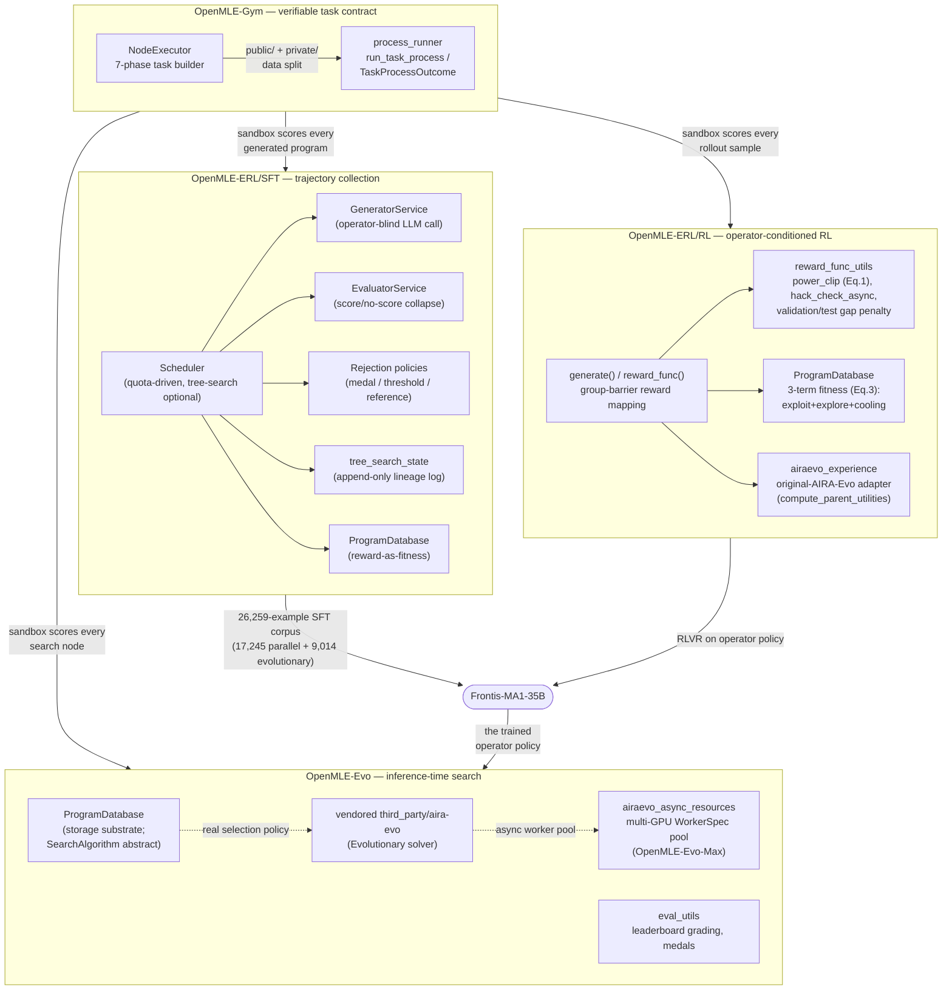

# openrsi — what it is and how it fits together

## In one paragraph
`openrsi` is Frontis.AI's code release for **OpenMLE**, the three-layer stack behind the paper
[Frontis-MA1](../../sources/frontis-ma1.md): **OpenMLE-Gym** builds and sandboxes verifiable machine-learning
engineering (MLE) tasks (a public/private hidden-evaluator split, six feedback modes), **OpenMLE-ERL**
post-trains an operator-conditioned program-generation policy on top of that sandbox via SFT and RL, and
**OpenMLE-Evo** runs that trained policy as an inference-time evolutionary search over MLE-Bench. Every layer
composes the same idea differently: a program gets generated by one of four operators (Draft / Improve /
Debug / Crossover), a sandbox scores it, and the score feeds back into either training data, a training
reward, or the next generation's parent choice. This ingest covers OpenMLE's own code — the verifiable-task
builder, the SFT trajectory-collection harness, the RL reward-shaping and rollout machinery, and the
inference-time search's storage/grading layer — and treats the vendored `OpenMLE-ERL/SFT/slime/` RL-training
runtime (THUDM/slime, Apache-2.0) as out-of-scope infrastructure, represented only by its auto-generated
catalog pages rather than a hand-written concept page.

## Core architecture

## Main concepts

**The hidden-evaluator sandbox** — [`NodeExecutor`](concepts/OpenMLE-Gym-builder_core-utils-nodes.md) runs a
seven-phase, fail-open LangGraph pipeline that turns a raw Kaggle competition into a task with a `public/`
tree (agent-visible) and a `private/` tree (the hidden test answers). Every task operation — building it,
scoring a submission, generating metadata — funnels through
[`process_runner`](concepts/OpenMLE-Gym-openmle_gym-process_runner.md)'s `run_task_process`, which never lets
a crash, hang, or malformed output escape as an exception; it always returns a frozen, non-throwing
`TaskProcessOutcome`. This pair is the concrete substrate under every "sandbox" box in the diagram above.

**RL reward shaping** — [`reward_func_utils`](concepts/OpenMLE-ERL-RL-reward_func_utils.md) is where a raw
sandbox score becomes a `[0,1]` training reward: `score2reward`'s `power_clip` mode is the paper's Eq. 1, with
an opt-in adaptive-bound path that derives `[worst, best]` from the policy's own recent scores rather than
fixed leaderboard extrema (a one-way ratchet — it can only *tighten* the interval, never widen it past the
static bound). Two integrity checks are layered on top and are effectively always-on: `hack_check_async`, an
independent judge model that runs *before* the sandbox call, and a validation/test gap penalty that discounts
reward when a self-reported score diverges from the held-out result.

**The RL rollout and its group barrier** —
[`generate()`/`reward_func()`](concepts/OpenMLE-ERL-RL-generate_mle.md) are the two async functions SLIME's
rollout engine calls per sample. The file's central idea: a sample's reward can't be finalized alone, because
the adaptive bound is a property of the whole rollout *group's* score distribution — so `reward_func` makes
every sample in a group wait on a shared `asyncio.Future` until the last one reports in, then computes one
bound for the group at once.

**Three-term parent fitness (RL)** —
[`ProgramDatabase`](concepts/OpenMLE-ERL-RL-program_database.md) recomputes, on every insert and across the
whole task population, a three-term fitness (paper Eq. 3): an exploit term (the program's own reward), an
explore term (variance of its children's rewards — is this branch still informative), and a cooling term
(deprioritize a parent that's been resampled too often). `AIRAEvoSearch` samples parents weighted by that
score, without replacement, from reward-sign-gated pools per operator.

**SFT trajectory collection** —
[`Scheduler`](concepts/OpenMLE-ERL-SFT-tts_search-services-scheduler.md) runs two decoupled async pipelines —
[`GeneratorService`](concepts/OpenMLE-ERL-SFT-tts_search-services-generator.md) (an operator-blind LLM
caller) and [`EvaluatorService`](concepts/OpenMLE-ERL-SFT-tts_search-services-evaluator.md) (which collapses
every one of the sandbox's failure modes to a single score/no-score branch, preserving the reason as text) —
gated by a pluggable [rejection policy](concepts/OpenMLE-ERL-SFT-tts_search-services-rejection.md) (medal
tier, score/reward threshold, or beat-a-reference) that decides what actually enters the 26,259-example
corpus. [`tree_search_state`](concepts/OpenMLE-ERL-SFT-tts_search-services-tree_search_state.md) durably logs
every node's parent lineage and operator label as an append-only, fsync'd event log so a crashed run resumes
exactly where it stopped; the SFT-side
[`ProgramDatabase`](concepts/OpenMLE-ERL-SFT-tts_search-program_database.md) that feeds it parents is a much
simpler sibling of the RL one — `fitness` here is just a copy of `reward`, with no population-relative
recompute.

**Inference-time search storage and grading** —
[`OpenMLE-Evo`'s `ProgramDatabase`](concepts/OpenMLE-Evo-tts_search-program_database.md) is deliberately just
a storage substrate: it defines the `Program` record and a `SearchAlgorithm` interface that is left abstract,
with no concrete selection policy in this packet's subgraph.
[`eval_utils`](concepts/OpenMLE-Evo-tts_search-eval_utils.md) is the downstream grading layer that turns a raw
submission into a Kaggle-style percentile and medal tier against a frozen external leaderboard — never the
model's own self-report — feeding the `stat.json`/`summary.csv` files the paper's result tables are built
from.

**OpenMLE-Evo-Max's async multi-GPU search** —
[`airaevo_async_resources`](concepts/OpenMLE-Evo-tts_search-airaevo_async_resources.md) is a pure
config-to-resource-plan resolver: it detects available GPUs (fail-open to CPU-only), builds one immutable
`WorkerSpec` per worker via independent round-robins over GPUs and sandbox-router URLs, and a sibling
resolver shrinks the outer per-task concurrency budget in proportion — the concrete mechanism behind the
paper's "asynchronous multi-GPU parallel search at unchanged total sandbox compute" claim.

**The original-AIRA-Evo baseline, reimplemented twice** —
[`airaevo_experience`](concepts/OpenMLE-ERL-RL-airaevo_experience.md) reimplements the *original* AIRA-Evo
selection/memory logic (the paper's explicit point of comparison, §5) on top of the RL loop's own
`ProgramDatabase`, via a `compute_parent_utilities` score/progress/novelty softmax and per-operator free-form
memory blocks. A separate, vendored copy of the same lineage — `third_party/aira-evo`'s own
`Evolutionary` solver — is what `OpenMLE-Evo`'s async worker pool above actually drives.

## Where the paper's mechanisms actually live — and where the operator vocabulary breaks down
Reading the packets against the paper's claims surfaced the single most important cross-cutting finding of
this ingest: **the paper-level Draft/Improve/Debug/Crossover vocabulary is not realized uniformly across the
shipped code.**

| Paper mechanism | Grounded in | Caveat |
|---|---|---|
| Adaptive reward bounds (Eq. 1) | [`reward_func_utils.score2reward`](concepts/OpenMLE-ERL-RL-reward_func_utils.md) | Opt-in behind `ENABLE_DYNAMIC_SCORE_BOUNDS` (default off); silently falls back to a static-bound `power_clip` when unset. |
| Entropic advantage (Eq. 2) | `adaptive_reward_advantage_utils.py` | **Not** called from `generate_mle.py`'s reward path — consumed only by a separate `ttt_reward_postprocess.py` stage outside every packet's subgraph. |
| Asynchronous rollouts | [`generate_mle`](concepts/OpenMLE-ERL-RL-generate_mle.md)'s async, poll-don't-block shape | The actual queue/worker decoupling lives in a sibling `fully_async_rollout.py`, not in this packet. |
| Three-term parent-fitness sampling | [`ProgramDatabase._recompute_task_fitness`](concepts/OpenMLE-ERL-RL-program_database.md) | Grounded directly (Eq. 3) — but only for `AIRAEvoSearch`; the module's own docstring ("top k by reward") doesn't match its actual fitness-ordered eviction. |
| Experience cards / three-factor quality-progress-novelty utility (Eq. 4) | [`airaevo_experience.compute_parent_utilities`](concepts/OpenMLE-ERL-RL-airaevo_experience.md) | Implemented in the **RL** harness as the *original*-AIRA-Evo baseline for comparison — not inside `OpenMLE-Evo`'s own `ProgramDatabase`, where no citable symbol implements Eq. 4 at all. |
| Draft/Improve/Debug/Crossover as four first-class operators | [`tree_search_state`](concepts/OpenMLE-ERL-SFT-tts_search-services-tree_search_state.md) | Only the **vendored** AIRA-Dojo `Evolutionary` solver (wrapped by `single_task_runner.py`) ever writes `"debug"`/`"crossover"` as a `generation_mode`. The primary SFT [`Scheduler`](concepts/OpenMLE-ERL-SFT-tts_search-services-scheduler.md)'s wired `GreedySearch`, and the RL [`generate_mle`](concepts/OpenMLE-ERL-RL-generate_mle.md) path this packet cites, both only ever emit `"draft"`/`"improve"` — "Debug" there is a *parent-selection heuristic* inside Improve (pick a zero/negative-reward parent), not a distinct prompt template, and Crossover doesn't appear in either wired path at all. |

Three independent readings — the SFT scheduler, its tree-search state log, and its program database — all
converged on the same fact from different angles, which is why it's presented here as a table rather than a
one-off note: **treat "the operator-conditioned policy realizes all four operators" as true of the paper's
training *data* (the vendored AIRA-Dojo path can produce Crossover examples) but not of the primary code
paths this ingest could ground**, and read any concept page's Draft/Improve/Debug/Crossover claim against
which specific module produced it.

## Map of the wiki
- **"How does the sandbox make a task's hidden test data actually hidden?"** →
  [`OpenMLE-Gym-builder_core-utils-nodes`](concepts/OpenMLE-Gym-builder_core-utils-nodes.md) +
  [`OpenMLE-Gym-openmle_gym-process_runner`](concepts/OpenMLE-Gym-openmle_gym-process_runner.md).
- **"How is a raw score turned into an RL reward?"** →
  [`OpenMLE-ERL-RL-reward_func_utils`](concepts/OpenMLE-ERL-RL-reward_func_utils.md), then
  [`OpenMLE-ERL-RL-generate_mle`](concepts/OpenMLE-ERL-RL-generate_mle.md) for how it's resolved per rollout
  group.
- **"How does a parent get chosen for Improve/Debug/Crossover?"** → compare
  [`OpenMLE-ERL-RL-program_database`](concepts/OpenMLE-ERL-RL-program_database.md) (3-term fitness, Eq. 3),
  [`OpenMLE-ERL-RL-airaevo_experience`](concepts/OpenMLE-ERL-RL-airaevo_experience.md) (quality/progress/
  novelty softmax), and [`OpenMLE-ERL-SFT-tts_search-program_database`](concepts/OpenMLE-ERL-SFT-tts_search-program_database.md)
  (the much simpler SFT-side version) — they are three different mechanisms behind one shared class name.
- **"How was the 26,259-example SFT corpus actually collected?"** →
  [`OpenMLE-ERL-SFT-tts_search-services-scheduler`](concepts/OpenMLE-ERL-SFT-tts_search-services-scheduler.md)
  is the entry point; it links out to the generator, evaluator, rejection, and tree-search-state pages.
- **"How does OpenMLE-Evo-Max parallelize search across GPUs?"** →
  [`OpenMLE-Evo-tts_search-airaevo_async_resources`](concepts/OpenMLE-Evo-tts_search-airaevo_async_resources.md).
- **"How is a finished run graded into the paper's medal/rank numbers?"** →
  [`OpenMLE-Evo-tts_search-eval_utils`](concepts/OpenMLE-Evo-tts_search-eval_utils.md) (though note: none of
  the paper's literal Table 1/9 scalars are computed in this packet's subgraph — see that page's Open
  questions).
- **Exhaustive per-module index** → [`catalog/`](catalog/) (generated for every module, including the
  vendored `slime` RL-training infra this ingest didn't deep-dive); **concept table** → [`index.md`](index.md).
- **Cross-repo view** → [`verification-independence`](../../concepts/verification-independence.md) is the
  concept this repo instantiates most often (hack-check, validation/test gap, leaderboard-file grading,
  public/private split); see also
  [`program-evolution-operators`](../../concepts/program-evolution-operators.md) for how the Draft/Improve/
  Debug/Crossover vocabulary compares across this wiki's other silos.
