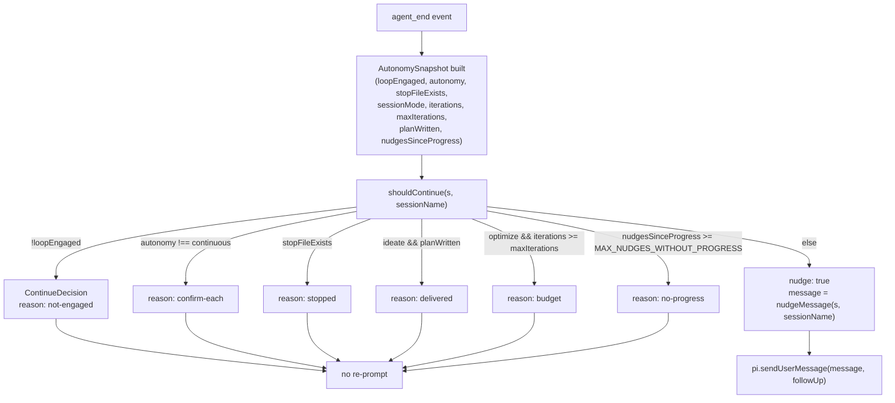

# Autonomy watchdog — the STOP-file brake and continuation nudges

Pure, unit-testable decision logic behind the `agent_end` watchdog that turns "keep looping" from a prose suggestion into a mechanical guarantee.

## Overview

Every other mechanism in this extension (recall → plan → run → log) only fires if the host agent actually keeps taking turns. Prose directives in tool output ("continue the loop") are probabilistic — the model is always free to end its turn anyway. [`shouldContinue`](../catalog/extensions/pi-autoresearch-vkf/autonomy.ts.md#shouldContinue) exists to make that contract deterministic: it is the single pure function the `agent_end` lifecycle hook consults after every turn to decide whether to forcibly re-prompt the agent. It is a small state machine over one snapshot ([`AutonomySnapshot`](../catalog/extensions/pi-autoresearch-vkf/autonomy.ts.md#AutonomySnapshot)) and one decision type ([`ContinueDecision`](../catalog/extensions/pi-autoresearch-vkf/autonomy.ts.md#ContinueDecision)), with [`nudgeMessage`](../catalog/extensions/pi-autoresearch-vkf/autonomy.ts.md#nudgeMessage) producing the actual re-prompt text. The module has no side effects and no pi-runtime imports — the watchdog's *policy* is fully separated from the *wiring* that samples the snapshot and sends the message, which lives in [`autoresearchExtension`](../catalog/extensions/pi-autoresearch-vkf/index.ts.md#autoresearchExtension).

## Diagram

## Design rationale (why it's built this way)

The module docstring is explicit about the problem this solves: prose "keep going" directives are *probabilistic* — the model can still end its turn — so the watchdog "makes the contract mechanical: when the agent goes idle mid-loop, the extension re-prompts it (`sendUserMessage` always triggers a turn)". [`shouldContinue`](../catalog/extensions/pi-autoresearch-vkf/autonomy.ts.md#shouldContinue)'s own doc comment frames it the same way: "Decide whether the watchdog should re-prompt the agent after it ended its [turn]."

The function is a strict ordered gate rather than a single boolean expression, and the order matters: `loopEngaged` is checked *before* `autonomy`, so an unrelated chat in the same repo — one that never touched the research tools this turn — is never nudged regardless of autonomy mode; `stopFileExists` is checked before the budget/progress checks, so the user's brake always wins over an in-flight iteration count. The `sessionMode === "ideate"` branch is structured as an `if`/`else if` specifically so that ideation sessions (no measurable metric, deliverable is a plan) skip the `maxIterations` check entirely and are gated only by [`planWritten`](../catalog/extensions/pi-autoresearch-vkf/autonomy.ts.md#AutonomySnapshot.planWritten) — an iteration cap makes no sense when there is no loop metric to budget against.

[`MAX_NUDGES_WITHOUT_PROGRESS`](../catalog/extensions/pi-autoresearch-vkf/autonomy.ts.md#MAX_NUDGES_WITHOUT_PROGRESS) is the module's one tunable constant, and its doc line states the reason directly: "Stop nudging after this many auto-continues that produced no new experiment." Without it, a loop that is genuinely stuck (blocked on something only the user can resolve) would ping-pong forever, since `sendUserMessage` unconditionally starts a new turn.

> [!inferred] `nudgeMessage`'s doc comment says the message is "Deliberately ~40 tokens" — read as a deliberate design constraint to keep the re-prompt cheap since it recurs in context every time the loop stalls, not a hard limit enforced anywhere in code.

## Entry points

- [`shouldContinue`](../catalog/extensions/pi-autoresearch-vkf/autonomy.ts.md#shouldContinue) — the sole decision entry point. It is called once per turn from the `agent_end` handler inside [`autoresearchExtension`](../catalog/extensions/pi-autoresearch-vkf/index.ts.md#autoresearchExtension), after that handler builds an [`AutonomySnapshot`](../catalog/extensions/pi-autoresearch-vkf/autonomy.ts.md#AutonomySnapshot) from the live session state.
- [`nudgeMessage`](../catalog/extensions/pi-autoresearch-vkf/autonomy.ts.md#nudgeMessage) — reached only from inside `shouldContinue`'s final branch (when every gate above it has passed), never called directly by the extension wiring; it renders the `ContinueDecision`'s `message` payload.

## Mechanism (step-by-step)

1. **Engagement gate.** [`shouldContinue`](../catalog/extensions/pi-autoresearch-vkf/autonomy.ts.md#shouldContinue) first checks [`loopEngaged`](../catalog/extensions/pi-autoresearch-vkf/autonomy.ts.md#AutonomySnapshot.loopEngaged): "Whether the just-ended agent run actually used the research tools." If the just-finished turn never touched a research tool, the function bails with `reason: "not-engaged"` before looking at anything else — this is what stops the watchdog from hijacking an unrelated conversation happening in the same repo/session.
2. **Autonomy-mode gate.** Next it reads [`autonomy`](../catalog/extensions/pi-autoresearch-vkf/autonomy.ts.md#AutonomySnapshot.autonomy), typed as [`AutonomyMode`](../catalog/extensions/pi-autoresearch-vkf/config.ts.md#AutonomyMode) ("Whether the loop is pre-authorized to keep iterating without checking in"). Anything other than `"continuous"` — i.e. `"confirm-each"` — short-circuits with `reason: "confirm-each"`: the watchdog only ever force-continues a session that opted into full autonomy.
3. **STOP-file brake.** [`stopFileExists`](../catalog/extensions/pi-autoresearch-vkf/autonomy.ts.md#AutonomySnapshot.stopFileExists) is checked next, ahead of the budget/progress logic, so a user-created STOP sentinel always overrides an otherwise-still-running loop, returning `reason: "stopped"`.
4. **Mode-specific completion gate.** The function branches on [`sessionMode`](../catalog/extensions/pi-autoresearch-vkf/autonomy.ts.md#AutonomySnapshot.sessionMode) ([`SessionMode`](../catalog/extensions/pi-autoresearch-vkf/config.ts.md#SessionMode)): in `"ideate"` mode it only checks [`planWritten`](../catalog/extensions/pi-autoresearch-vkf/autonomy.ts.md#AutonomySnapshot.planWritten) (`reason: "delivered"` once the deliverable exists); otherwise (an `"optimize"` session) it compares [`iterations`](../catalog/extensions/pi-autoresearch-vkf/autonomy.ts.md#AutonomySnapshot.iterations) against [`maxIterations`](../catalog/extensions/pi-autoresearch-vkf/autonomy.ts.md#AutonomySnapshot.maxIterations) — an `undefined` cap means this branch never fires, so an uncapped optimize session keeps nudging indefinitely.
5. **No-progress guard.** If none of the above stopped it, [`nudgesSinceProgress`](../catalog/extensions/pi-autoresearch-vkf/autonomy.ts.md#AutonomySnapshot.nudgesSinceProgress) is compared against [`MAX_NUDGES_WITHOUT_PROGRESS`](../catalog/extensions/pi-autoresearch-vkf/autonomy.ts.md#MAX_NUDGES_WITHOUT_PROGRESS) (`= 2`); once that many consecutive nudges produced no new experiment or plan, the loop returns `reason: "no-progress"` rather than nudging forever.
6. **Nudge construction.** Only if every gate above passes does `shouldContinue` return `{ nudge: true, message: ... }`, where the message is built by [`nudgeMessage`](../catalog/extensions/pi-autoresearch-vkf/autonomy.ts.md#nudgeMessage): it formats an `iterations`/`maxIterations` budget string, picks a spine of tool names appropriate to [`sessionMode`](../catalog/extensions/pi-autoresearch-vkf/autonomy.ts.md#AutonomySnapshot.sessionMode) (the ideation gather/synthesize spine vs. the optimize recall/plan/experiment spine), and names the session so the re-prompt is self-contained.
7. **Wiring back into the tool loop.** The caller, [`autoresearchExtension`](../catalog/extensions/pi-autoresearch-vkf/index.ts.md#autoresearchExtension), is the only place an [`AutonomySnapshot`](../catalog/extensions/pi-autoresearch-vkf/autonomy.ts.md#AutonomySnapshot) is actually constructed and the only place [`shouldContinue`](../catalog/extensions/pi-autoresearch-vkf/autonomy.ts.md#shouldContinue)'s result is consumed; on `nudge: true` it forwards the message to the agent as a follow-up turn. On `nudge: false` it never nudges, but it is not always a no-op: the first time a session gets `reason: "no-progress"` and the caller hasn't already flagged it, the wiring surfaces a one-time UI notification that the loop is stuck (tracked by its own `nudgeSuppressedNotified` flag, not by this module) before returning. Either way, this module never touches the transport itself — the decision is a pure value the caller interprets.

## Key data structures

- [`AutonomySnapshot`](../catalog/extensions/pi-autoresearch-vkf/autonomy.ts.md#AutonomySnapshot) — the one input to the whole policy: [`autonomy`](../catalog/extensions/pi-autoresearch-vkf/autonomy.ts.md#AutonomySnapshot.autonomy) mode, [`sessionMode`](../catalog/extensions/pi-autoresearch-vkf/autonomy.ts.md#AutonomySnapshot.sessionMode), [`loopEngaged`](../catalog/extensions/pi-autoresearch-vkf/autonomy.ts.md#AutonomySnapshot.loopEngaged), [`stopFileExists`](../catalog/extensions/pi-autoresearch-vkf/autonomy.ts.md#AutonomySnapshot.stopFileExists), [`iterations`](../catalog/extensions/pi-autoresearch-vkf/autonomy.ts.md#AutonomySnapshot.iterations), [`maxIterations`](../catalog/extensions/pi-autoresearch-vkf/autonomy.ts.md#AutonomySnapshot.maxIterations) (optional — its absence is itself meaningful, see Edge cases), [`planWritten`](../catalog/extensions/pi-autoresearch-vkf/autonomy.ts.md#AutonomySnapshot.planWritten), and [`nudgesSinceProgress`](../catalog/extensions/pi-autoresearch-vkf/autonomy.ts.md#AutonomySnapshot.nudgesSinceProgress). It is deliberately a flat, serializable snapshot rather than a live object reference, which is exactly what keeps [`shouldContinue`](../catalog/extensions/pi-autoresearch-vkf/autonomy.ts.md#shouldContinue) pure and testable without any pi runtime.
- [`ContinueDecision`](../catalog/extensions/pi-autoresearch-vkf/autonomy.ts.md#ContinueDecision) — a discriminated union: `{ nudge: true; message: string }` or `{ nudge: false; reason: "confirm-each" | "not-engaged" | "stopped" | "budget" | "delivered" | "no-progress" }`. The closed `reason` enum is what lets the caller distinguish "stopped because finished" from "stopped because stuck" (the latter triggers a UI notification in the wiring code, not in this module).
- [`SessionMode`](../catalog/extensions/pi-autoresearch-vkf/config.ts.md#SessionMode) / [`AutonomyMode`](../catalog/extensions/pi-autoresearch-vkf/config.ts.md#AutonomyMode) — the two orthogonal axes this module gates on: *what kind of deliverable* the session is chasing vs. *whether it's allowed to run unattended*.

## Dynamics (design intent)

`tests/autonomy.test.mjs` exercises every branch of [`shouldContinue`](../catalog/extensions/pi-autoresearch-vkf/autonomy.ts.md#shouldContinue) directly against a `base` snapshot (continuous, optimize, engaged, `iterations: 3`, `maxIterations: 10`) and confirms the gate ordering behaves independently: flipping `loopEngaged` to false yields `not-engaged` even though every other field still looks "continuable"; setting `autonomy: "confirm-each"` on the same base yields `confirm-each`; `stopFileExists: true` yields `stopped`. It also confirms the two budget edges explicitly — `iterations: 10, maxIterations: 10` *and* `iterations: 11, maxIterations: 10` both yield `budget` (the check is `>=`, not `>`), while `maxIterations: undefined` with `iterations: 1000` still nudges, i.e. an optimize session with no cap never budgets out. For ideate mode, the tests confirm `maxIterations` is ignored outright — `sessionMode: "ideate", iterations: 999, maxIterations: 1` still nudges — and that only `planWritten` flips it to `delivered`. The no-progress cap is tested at the exact boundary: `nudgesSinceProgress === MAX_NUDGES_WITHOUT_PROGRESS` stops the nudge, one less than that still nudges. [`nudgeMessage`](../catalog/extensions/pi-autoresearch-vkf/autonomy.ts.md#nudgeMessage) is tested for containing the session name, the `iterations/maxIterations` budget string, and the literal word "STOP", plus for switching its spine text to mention `draft_research_plan` in ideate mode.

## Edge cases

- **Uncapped optimize loops never stop on budget.** [`maxIterations`](../catalog/extensions/pi-autoresearch-vkf/autonomy.ts.md#AutonomySnapshot.maxIterations) is `number | undefined`; when `undefined`, the `else if` budget branch in [`shouldContinue`](../catalog/extensions/pi-autoresearch-vkf/autonomy.ts.md#shouldContinue) never evaluates true, so the only things that can end such a session are the STOP file or the no-progress guard.
- **Ideation sessions ignore `maxIterations` even when it's set.** Because the `sessionMode === "ideate"` branch is an `if` that returns early only on [`planWritten`](../catalog/extensions/pi-autoresearch-vkf/autonomy.ts.md#AutonomySnapshot.planWritten), a stray `maxIterations` value on an ideate session is simply never consulted — this could surprise a caller who assumes the cap is mode-agnostic.
- **`loopEngaged` is a per-turn flag, not a session flag.** Its own doc line warns it exists so "an unrelated chat in the same repo must not wake the loop" — it must be recomputed by the caller from *this turn's* messages, not cached from a prior turn, or a stale `true` would nudge into an unrelated conversation.
- **The no-progress counter only prevents infinite nudging — it doesn't define "progress."** [`nudgesSinceProgress`](../catalog/extensions/pi-autoresearch-vkf/autonomy.ts.md#AutonomySnapshot.nudgesSinceProgress) is read, not written, by this module; whatever resets it to zero when a new experiment or plan appears lives entirely in the caller.

## Open questions

> [!inferred] The module also exports `wantFullNote` and the constant `FULL_NOTE_EVERY` (governing whether the caller emits the long autonomy paragraph vs. a one-line brief) — these are part of the same file and directly support the "continuation nudges appended to tool output" mechanism, but neither symbol is in this packet's Subgraph, so they cannot be cited here. A reader wanting the full/brief cadence should look at the sibling `extensions-pi-autoresearch-vkf-index.ts.md` concept page (`continuationNote`) instead.
- What exactly increments/resets [`nudgesSinceProgress`](../catalog/extensions/pi-autoresearch-vkf/autonomy.ts.md#AutonomySnapshot.nudgesSinceProgress) — i.e. the precise definition of "progress" — is decided entirely outside this module; this page can only describe the threshold behavior once the counter is in hand.

## See also

- [extensions-pi-autoresearch-vkf-index.ts.md](extensions-pi-autoresearch-vkf-index.ts.md) — the `agent_end` wiring that builds each `AutonomySnapshot` and consumes `ContinueDecision`, and `continuationNote`'s full/brief cadence.
- [extensions-pi-autoresearch-vkf-config.ts.md](extensions-pi-autoresearch-vkf-config.ts.md) — `AutonomyMode` and `SessionMode`, the two config-level axes this module gates on.
