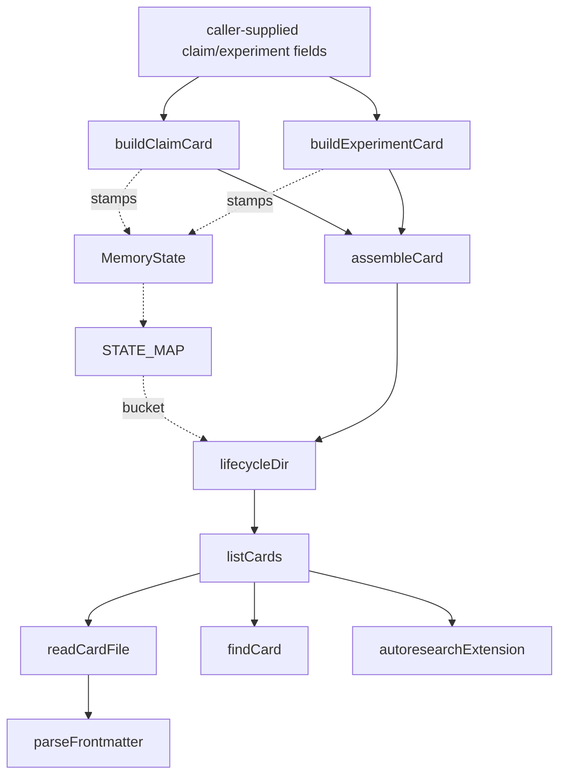

# VKF cards — the trust-lifecycle memory model

<!-- connect:up:begin -->
> **Cross-repo concept:** part of [closed-loop-experiment-design](../../../concepts/closed-loop-experiment-design.md) across this wiki's repos.
<!-- connect:up:end -->
## Overview

`cards.ts` is the durable substrate underneath the whole autoresearch loop: every research atom the loop produces — a claim distilled from a paper, or the outcome of a local experiment — is serialized as one markdown+YAML card whose frontmatter carries a memory state ([`MemoryState`](../catalog/extensions/pi-autoresearch-vkf/cards.ts.md#MemoryState)) and lives inside one of three lifecycle directories chosen by that state. [`buildClaimCard`](../catalog/extensions/pi-autoresearch-vkf/cards.ts.md#buildClaimCard) and [`buildExperimentCard`](../catalog/extensions/pi-autoresearch-vkf/cards.ts.md#buildExperimentCard) are the module's write path: they stamp a fresh card with its starting lifecycle state, a categorical confidence derived by [`confidenceLabel`](../catalog/extensions/pi-autoresearch-vkf/cards.ts.md#confidenceLabel), and — for experiments — the `parent`/claim dependency edges that let a tree view be reconstructed from card metadata alone. [`listCards`](../catalog/extensions/pi-autoresearch-vkf/cards.ts.md#listCards) and [`findCard`](../catalog/extensions/pi-autoresearch-vkf/cards.ts.md#findCard) are the single read path everything else in the extension sits on top of. This packet's Subgraph does **not** include the functions that actually move a card between trust states or append its audit-trail record (see Open questions) — what is grounded here is the shape of the lifecycle and the two chokepoints, construction and listing, through which every other tool touches memory.

## Diagram

## Design rationale (why it's built this way)

The module docstring frames the lifecycle deliberately as *not* a bespoke state machine: the vision's states map straight onto VKF's own `status` plus a physical lifecycle directory, so the external `vkf validate` CLI gates the whole bundle rather than the extension re-implementing validation. That mapping is [`STATE_MAP`](../catalog/extensions/pi-autoresearch-vkf/cards.ts.md#STATE_MAP), keyed by [`MemoryState`](../catalog/extensions/pi-autoresearch-vkf/cards.ts.md#MemoryState).

[`buildExperimentCard`](../catalog/extensions/pi-autoresearch-vkf/cards.ts.md#buildExperimentCard) always lands a freshly-built experiment at `"locally_tested"`, win or lose — its comment is explicit: "A local experiment is a verified-by-local-experiment artifact regardless of whether the idea won — a loss is a real, recorded negative result." A loss is not discarded or left untracked; it becomes a first-class, equally-trusted card, which is what lets [`outcome`](../catalog/extensions/pi-autoresearch-vkf/cards.ts.md#ExperimentInput.outcome) values other than `"win"` still feed the search history.

The same builder wires the search tree into card metadata rather than a separate structure: it depends on both the tested claim and the [`parent_id`](../catalog/extensions/pi-autoresearch-vkf/cards.ts.md#ExperimentInput.parent_id) node "so `vkf graph` renders the actual search tree (paper → claim → experiment → experiment …)" — the tree lives in `depends_on` edges on ordinary cards, not a side index. [`reproduction`](../catalog/extensions/pi-autoresearch-vkf/cards.ts.md#ExperimentInput.reproduction) is attached as a nested `verification` block specifically so the bundle can validate at VKF's strict profile 2 rather than only the governed profile 1, and [`next_suggestions`](../catalog/extensions/pi-autoresearch-vkf/cards.ts.md#ExperimentInput.next_suggestions) is documented in-line as "Structured next-step suggestions (RD-Agent-style feedback)" — the experiment card is deliberately built to be the input the *next* planning decision reads, not just a log entry.

> [!inferred] The two `verification`-named properties in this Subgraph — one on card construction, one on the (unlisted) transition path — read as intentionally distinct: the module's wider source reserves the plain word `verification` for a reproducibility record (command + expected value) and uses a separate key for the research-layer trust axis, precisely so a card can carry both without collision. The exact separation can't be cited further here since the function that writes the second one isn't in this packet's Subgraph.

## Entry points

- [`buildClaimCard`](../catalog/extensions/pi-autoresearch-vkf/cards.ts.md#buildClaimCard) — turns a proposed claim (assertion, optional [`mechanism`](../catalog/extensions/pi-autoresearch-vkf/cards.ts.md#ClaimInput.mechanism), optional [`paper_id`](../catalog/extensions/pi-autoresearch-vkf/cards.ts.md#ClaimInput.paper_id)) into a `candidate` card. Reached whenever the loop distills a new testable idea, whether sourced from literature or synthesized from existing cards ([`derived_from`](../catalog/extensions/pi-autoresearch-vkf/cards.ts.md#ClaimInput.derived_from)).
- [`buildExperimentCard`](../catalog/extensions/pi-autoresearch-vkf/cards.ts.md#buildExperimentCard) — turns one experiment run ([`metric_name`](../catalog/extensions/pi-autoresearch-vkf/cards.ts.md#ExperimentInput.metric_name), [`baseline`](../catalog/extensions/pi-autoresearch-vkf/cards.ts.md#ExperimentInput.baseline), [`value`](../catalog/extensions/pi-autoresearch-vkf/cards.ts.md#ExperimentInput.value)) into a `locally_tested` tree node. Reached at the end of every experiment iteration, regardless of [`outcome`](../catalog/extensions/pi-autoresearch-vkf/cards.ts.md#ExperimentInput.outcome).
- [`listCards`](../catalog/extensions/pi-autoresearch-vkf/cards.ts.md#listCards) / [`findCard`](../catalog/extensions/pi-autoresearch-vkf/cards.ts.md#findCard) — the shared read path. Every tool, dashboard, and staleness check reaches memory only by calling these, never by reading files directly.
- [`autoresearchExtension`](../catalog/extensions/pi-autoresearch-vkf/index.ts.md#autoresearchExtension) — the single wiring site where the pi host's `registerTool` calls sit on top of the card builders and readers, turning this module's pure functions into the loop's actual tools.

## Mechanism (step-by-step)

1. **Claim intake stamps trust and confidence.** [`buildClaimCard`](../catalog/extensions/pi-autoresearch-vkf/cards.ts.md#buildClaimCard) starts every new claim at the same low-trust point (`"candidate"`, verification `"reported_by_paper"`), defaults an unset numeric [`confidence`](../catalog/extensions/pi-autoresearch-vkf/cards.ts.md#baseFrontmatter.args-typeLiteral28.confidence) to `0.5`, and mirrors it into VKF's categorical enum through [`confidenceLabel`](../catalog/extensions/pi-autoresearch-vkf/cards.ts.md#confidenceLabel) so the card stays schema-valid even though the research layer's real signal is the numeric value. Optional [`paper_id`](../catalog/extensions/pi-autoresearch-vkf/cards.ts.md#ClaimInput.paper_id) and [`mechanism`](../catalog/extensions/pi-autoresearch-vkf/cards.ts.md#ClaimInput.mechanism) fields record where the claim came from and how it's supposed to work, for later synthesis passes to consume.
2. **Experiment intake stamps the tree edges and the reproduction block.** [`buildExperimentCard`](../catalog/extensions/pi-autoresearch-vkf/cards.ts.md#buildExperimentCard) records [`baseline`](../catalog/extensions/pi-autoresearch-vkf/cards.ts.md#ExperimentInput.baseline), [`value`](../catalog/extensions/pi-autoresearch-vkf/cards.ts.md#ExperimentInput.value) and [`outcome`](../catalog/extensions/pi-autoresearch-vkf/cards.ts.md#ExperimentInput.outcome), computes their delta, and depends on both the tested claim and [`parent_id`](../catalog/extensions/pi-autoresearch-vkf/cards.ts.md#ExperimentInput.parent_id) so the search tree is reconstructible from card dependencies alone; [`lever`](../catalog/extensions/pi-autoresearch-vkf/cards.ts.md#ExperimentInput.lever) and [`altitude`](../catalog/extensions/pi-autoresearch-vkf/cards.ts.md#ExperimentInput.altitude) tags carry forward from the tested claim for coverage bookkeeping, an optional [`reproduction`](../catalog/extensions/pi-autoresearch-vkf/cards.ts.md#ExperimentInput.reproduction) recipe becomes a profile-2 verification block, and [`next_suggestions`](../catalog/extensions/pi-autoresearch-vkf/cards.ts.md#ExperimentInput.next_suggestions) is written straight into the card body as the structured feedback the next decision reads.
3. **The memory state resolves to a concrete bucket and status.** [`STATE_MAP`](../catalog/extensions/pi-autoresearch-vkf/cards.ts.md#STATE_MAP) is consulted for every card at construction, translating the chosen [`state`](../catalog/extensions/pi-autoresearch-vkf/cards.ts.md#baseFrontmatter.args-typeLiteral28.state) into a [`status`](../catalog/extensions/pi-autoresearch-vkf/cards.ts.md#STATE_MAP.Record.typeLiteral9.status) string and a [`bucket`](../catalog/extensions/pi-autoresearch-vkf/cards.ts.md#STATE_MAP.Record.typeLiteral9.bucket) — the physical subdirectory the file will live in — alongside the [`type`](../catalog/extensions/pi-autoresearch-vkf/cards.ts.md#baseFrontmatter.args-typeLiteral28.type), [`title`](../catalog/extensions/pi-autoresearch-vkf/cards.ts.md#baseFrontmatter.args-typeLiteral28.title), [`id`](../catalog/extensions/pi-autoresearch-vkf/cards.ts.md#baseFrontmatter.args-typeLiteral28.id), and [`owner`](../catalog/extensions/pi-autoresearch-vkf/cards.ts.md#baseFrontmatter.args-typeLiteral28.owner) fields common to every card type.
4. **Serialization and path resolution are independent of card content.** [`assembleCard`](../catalog/extensions/pi-autoresearch-vkf/frontmatter.ts.md#assembleCard) turns the frontmatter map and body string into the on-disk fenced format, while [`lifecycleDir`](../catalog/extensions/pi-autoresearch-vkf/paths.ts.md#lifecycleDir) resolves the target directory for a bucket underneath [`memoryPaths`](../catalog/extensions/pi-autoresearch-vkf/paths.ts.md#memoryPaths)'s root — neither function knows or cares which card type produced the content it's handling.
5. **Reading walks all three lifecycle buckets uniformly.** [`listCards`](../catalog/extensions/pi-autoresearch-vkf/cards.ts.md#listCards) iterates every bucket directory, calling [`readCardFile`](../catalog/extensions/pi-autoresearch-vkf/cards.ts.md#readCardFile) — which itself calls [`parseFrontmatter`](../catalog/extensions/pi-autoresearch-vkf/frontmatter.ts.md#parseFrontmatter) — to rebuild a [`Card`](../catalog/extensions/pi-autoresearch-vkf/cards.ts.md#Card) ([`path`](../catalog/extensions/pi-autoresearch-vkf/cards.ts.md#Card.path), [`bucket`](../catalog/extensions/pi-autoresearch-vkf/cards.ts.md#Card.bucket), `meta`, [`body`](../catalog/extensions/pi-autoresearch-vkf/cards.ts.md#Card.body)) per file, silently skipping unparseable ones rather than failing the whole listing. [`findCard`](../catalog/extensions/pi-autoresearch-vkf/cards.ts.md#findCard) is a thin filter over the same call.
6. **Every downstream consumer sits on `listCards`, never on the filesystem.** [`autoresearchExtension`](../catalog/extensions/pi-autoresearch-vkf/index.ts.md#autoresearchExtension)'s [`toCardLike`](../catalog/extensions/pi-autoresearch-vkf/index.ts.md#toCardLike) adapter, the dashboards ([`buildDashboardPayload`](../catalog/extensions/pi-autoresearch-vkf/index.ts.md#buildDashboardPayload), [`buildFullscreenLines`](../catalog/extensions/pi-autoresearch-vkf/dashboard.ts.md#buildFullscreenLines), [`memoryCounts`](../catalog/extensions/pi-autoresearch-vkf/dashboard.ts.md#memoryCounts)), and the staleness sweep [`staleIdSet`](../catalog/extensions/pi-autoresearch-vkf/index.ts.md#staleIdSet) all call [`listCards`](../catalog/extensions/pi-autoresearch-vkf/cards.ts.md#listCards) directly — this module's read path is the only place any of them touch memory.

## Key data structures

- [`Card`](../catalog/extensions/pi-autoresearch-vkf/cards.ts.md#Card) — the in-memory shape every reader works with: [`path`](../catalog/extensions/pi-autoresearch-vkf/cards.ts.md#Card.path) (absolute, on disk), [`bucket`](../catalog/extensions/pi-autoresearch-vkf/cards.ts.md#Card.bucket) (which of the three lifecycle directories it's currently in), `meta` (the parsed [`YamlValue`](../catalog/extensions/pi-autoresearch-vkf/frontmatter.ts.md#YamlValue) frontmatter map), and [`body`](../catalog/extensions/pi-autoresearch-vkf/cards.ts.md#Card.body) (the markdown after the frontmatter fence).
- [`MemoryState`](../catalog/extensions/pi-autoresearch-vkf/cards.ts.md#MemoryState) / [`STATE_MAP`](../catalog/extensions/pi-autoresearch-vkf/cards.ts.md#STATE_MAP) — the seven-value trust lifecycle and its mapping to a VKF `status` string plus a [`LifecycleDir`](../catalog/extensions/pi-autoresearch-vkf/paths.ts.md#LifecycleDir) bucket. This is the one indirection every other structure in the module is keyed off.
- [`Verification`](../catalog/extensions/pi-autoresearch-vkf/cards.ts.md#Verification) — the closed enum describing *how* a card's content was checked (`reported_by_paper` through `contradicted_by_local_experiment`), distinct from the numeric/categorical belief pair.

## Dynamics (design intent)

`tests/cards.test.mjs`'s "built cards parse and carry research-layer fields" test constructs a claim through [`buildClaimCard`](../catalog/extensions/pi-autoresearch-vkf/cards.ts.md#buildClaimCard) with `confidence: 0.6` and a [`paper_id`](../catalog/extensions/pi-autoresearch-vkf/cards.ts.md#ClaimInput.paper_id), then re-parses the emitted card and asserts the categorical mirror lands on `"medium"` — confirming [`confidenceLabel`](../catalog/extensions/pi-autoresearch-vkf/cards.ts.md#confidenceLabel)'s thresholds are applied at construction time, not deferred.

The "experiment cards carry a profile-2 reproduction block and tree edges" test builds an experiment via [`buildExperimentCard`](../catalog/extensions/pi-autoresearch-vkf/cards.ts.md#buildExperimentCard) with an explicit [`parent_id`](../catalog/extensions/pi-autoresearch-vkf/cards.ts.md#ExperimentInput.parent_id) and a [`reproduction`](../catalog/extensions/pi-autoresearch-vkf/cards.ts.md#ExperimentInput.reproduction) command, then asserts the parsed card's dependency list contains *both* the claim id and the parent id, that the nested verification block carries the reproduction command and expected value, and that the body contains a "## Next steps" section built from [`next_suggestions`](../catalog/extensions/pi-autoresearch-vkf/cards.ts.md#ExperimentInput.next_suggestions) — confirming the tree-edge and RD-Agent-style feedback claims above are not just docstring intent but exercised behavior.

A separate lifecycle test writes two cards into the staging bucket, moves one elsewhere, and re-asserts against [`listCards`](../catalog/extensions/pi-autoresearch-vkf/cards.ts.md#listCards) filtered by [`bucket`](../catalog/extensions/pi-autoresearch-vkf/cards.ts.md#Card.bucket) and against [`findCard`](../catalog/extensions/pi-autoresearch-vkf/cards.ts.md#findCard) — confirming the read path correctly reflects a card having moved between lifecycle directories, even though the move itself is performed by a function outside this packet's Subgraph (see Open questions).

## Edge cases

- **The word `id` names three structurally distinct properties in this file.** [`baseFrontmatter`'s shared `id`](../catalog/extensions/pi-autoresearch-vkf/cards.ts.md#baseFrontmatter.args-typeLiteral28.id), [`buildClaimCard`'s return-shape `id`](../catalog/extensions/pi-autoresearch-vkf/cards.ts.md#buildClaimCard.typeLiteral55.id), and [`buildExperimentCard`'s return-shape `id`](../catalog/extensions/pi-autoresearch-vkf/cards.ts.md#buildExperimentCard.typeLiteral80.id) all follow the same `type:slug` convention minted by [`slugify`](../catalog/extensions/pi-autoresearch-vkf/cards.ts.md#slugify), but they are three separate type-literal properties, not one shared symbol — a reader grepping the catalog for `id` will find several unrelated-looking hits that are actually the same convention applied three times.
- **`listCards` swallows parse failures per-file, not per-bucket.** A single malformed card is skipped silently rather than aborting the whole [`listCards`](../catalog/extensions/pi-autoresearch-vkf/cards.ts.md#listCards) call — every other card in every other bucket is still returned, so a caller has no built-in signal that a card went missing from the result.
- **A `losses` tally is part of an evidence shape this Subgraph only partially exposes.** The [`losses`](../catalog/extensions/pi-autoresearch-vkf/cards.ts.md#transitionCard.opts-typeLiteral158.evidence.typeLiteral159.losses) property (paired with a `verification` option at the same call site) shows that some function elsewhere in the module accepts an accumulated win/loss tally and a new [`verification`](../catalog/extensions/pi-autoresearch-vkf/cards.ts.md#transitionCard.opts-typeLiteral158.verification) level together — but that function itself is not in this packet's Subgraph, so its accumulation logic can't be described further here.

## Open questions

> [!inferred] This packet's Subgraph does not include the functions that actually perform a trust-state promotion, append its audit-trail record, or convert an accumulated win/loss tally into a numeric belief (their names are visible in the wider module but not citable here: a card-transition function, a transaction-writer, a Beta-posterior belief update, a trust-gate predicate, a paper-card builder, and the bundle-scaffolding function). The `verification`/`losses` properties documented above are all that's directly groundable about that machinery from this packet; a fuller account belongs on whichever sibling concept page covers that half of the file, if this Subgraph is later widened to include it.
- Given that [`buildExperimentCard`](../catalog/extensions/pi-autoresearch-vkf/cards.ts.md#buildExperimentCard) always sets the fresh card's memory state to `"locally_tested"` regardless of [`outcome`](../catalog/extensions/pi-autoresearch-vkf/cards.ts.md#ExperimentInput.outcome), the promotion from there to `"replicated"` (independent reproduction) is decided entirely outside this module — this page can't say what triggers that upgrade.

## See also

- [extensions-pi-autoresearch-vkf-autonomy.ts.md](extensions-pi-autoresearch-vkf-autonomy.ts.md) — the watchdog that keeps the loop iterating between the card-construction points documented here.
- [extensions-pi-autoresearch-vkf-index.ts.md](extensions-pi-autoresearch-vkf-index.ts.md) — `autoresearchExtension`'s tool wiring, `toCardLike`, and the dashboard payload builders that consume `listCards`.
