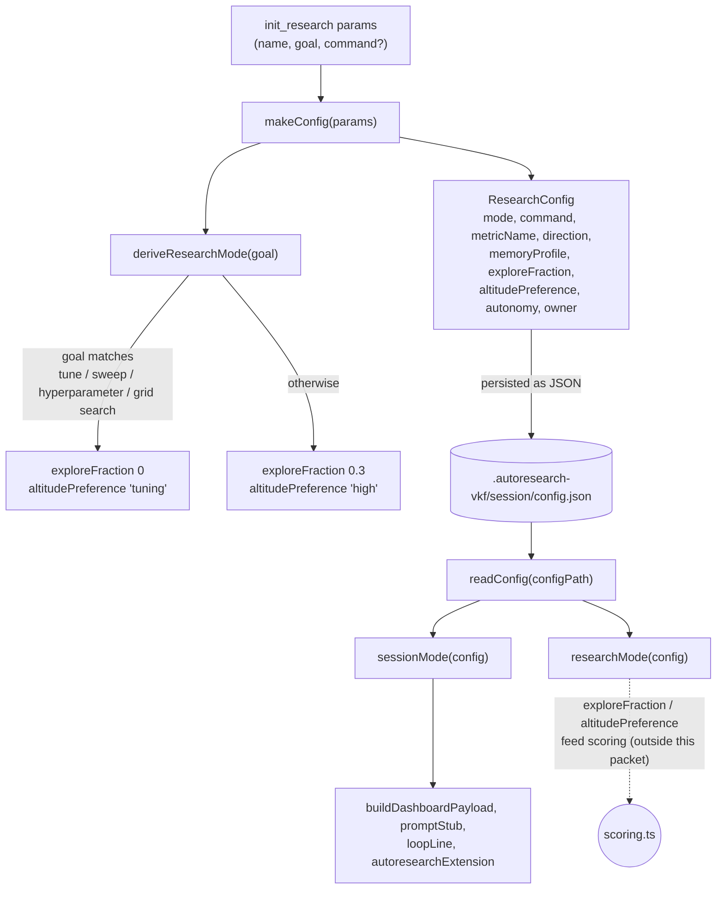

# Session config (`ResearchConfig`) — the optimize/ideate switch and explore/exploit defaults

<!-- connect:up:begin -->
> **Cross-repo concept:** part of [research-development-loop](../../../concepts/research-development-loop.md) across this wiki's repos.
<!-- connect:up:end -->
The persisted `.autoresearch-vkf/session/config.json` contract: what's being optimized, how it's measured, which direction is better, and a goal-text heuristic that derives explore/exploit defaults for the rest of the loop — all built once at [`init_research`](../catalog/extensions/pi-autoresearch-vkf/index.ts.md#autoresearchExtension) time and re-read, never mutated in place, by everything downstream.

## Overview

This module is the single source of truth for one research session. Its central design idea is that **one branching decision — whether `init_research` received a measurable `command` — cascades into everything else**: [`sessionMode`](../catalog/extensions/pi-autoresearch-vkf/config.ts.md#sessionMode) becomes `"optimize"` or `"ideate"`, changing what "done" even means for the loop (a metric delta vs. a ranked research plan); and the goal text alone (not any explicit flag) is scanned for tuning language to decide how much of the experiment budget gets reserved for exploration. The module is deliberately inert — no scoring, no side effects beyond one JSON read and one JSON write, no schema versioning — so every consumer ([`dashboard.ts`](../catalog/extensions/pi-autoresearch-vkf/dashboard.ts.md), [`runtime.ts`](../catalog/extensions/pi-autoresearch-vkf/runtime.ts.md), [`index.ts`](../catalog/extensions/pi-autoresearch-vkf/index.ts.md)) can treat [`ResearchConfig`](../catalog/extensions/pi-autoresearch-vkf/config.ts.md#ResearchConfig) as a plain serializable record and re-derive the same effective defaults from it at any time, including for sessions created before a field existed.

## Diagram

## Design rationale (why it's built this way)

The docstrings make the intent explicit rather than leaving it to be inferred. The module's own header comment (above the `config.ts` file, not attached to any one symbol) frames the split cleanly: "Describes the optimization target for the current research loop: what we are trying to improve, how to measure it, and which direction is 'better'. The durable knowledge produced along the way lives in the VKF memory bundle, not here." [`ResearchConfig`](../catalog/extensions/pi-autoresearch-vkf/config.ts.md#ResearchConfig) is this module's realization of that split: config is ephemeral per-session settings; VKF cards are the durable memory — the module never tries to be both.

[`deriveResearchMode`](../catalog/extensions/pi-autoresearch-vkf/config.ts.md#deriveResearchMode)'s doc comment states the reasoning for its regex gate directly: "An explicit tuning goal ('tune', 'sweep', 'hyperparameter', 'grid search') turns exploration off and removes the altitude bias — if the user asked for tuning, they get tuning. Otherwise reserve 30% of the budget for exploration and mildly favor altitude." This is a deliberate asymmetry: hyperparameter sweeps have a known-good shape (many small candidates, pick the best), so forcing pure priority order (`exploreFraction: 0`) is *more* useful than hedging; open-ended goals don't have that shape, so a fixed 30% carve-out for higher-altitude (less incremental) ideas is the default instead.

[`sessionMode`](../catalog/extensions/pi-autoresearch-vkf/config.ts.md#sessionMode) and [`researchMode`](../catalog/extensions/pi-autoresearch-vkf/config.ts.md#researchMode) share the same backward-compatibility pattern: both read an explicit persisted field first and fall back to a value re-derived from other fields (`config.command`/`config.goal`) only when that field is absent. Both doc comments call this out — `sessionMode`'s says "(legacy configs ⇒ optimize)", `researchMode`'s says "falling back to a goal-derived default for sessions created before these fields existed." This is what lets a `config.json` written by an older version of the extension keep working without a migration step: [`makeConfig`](../catalog/extensions/pi-autoresearch-vkf/config.ts.md#makeConfig) always writes `mode`/`exploreFraction`/`altitudePreference` explicitly going forward, but the read side never assumes they're there.

> [!inferred] The `optimize`/`ideate` split, together with the CHANGELOG's stated inspiration from RD-Agent's Research→Development cycle, reads as this module's realization of that split: `ideate` sessions produce a ranked research plan with no execution loop (the Research phase — hypothesis generation from the knowledge base), while `optimize` sessions run the metric-driven experiment loop (the Development phase — implement, measure, keep or discard). The module only encodes *which* phase a session is in; the phase-specific mechanics (tree search, plan drafting) live elsewhere.

## Entry points

- [`makeConfig`](../catalog/extensions/pi-autoresearch-vkf/config.ts.md#makeConfig) — the constructor. Reached once, from `init_research`'s handler inside [`autoresearchExtension`](../catalog/extensions/pi-autoresearch-vkf/index.ts.md#autoresearchExtension), when no session config already exists for the working directory.
- [`readConfig`](../catalog/extensions/pi-autoresearch-vkf/config.ts.md#readConfig) — the read side, reached from every tool handler and dashboard builder that needs the current session: [`buildDashboardPayload`](../catalog/extensions/pi-autoresearch-vkf/index.ts.md#buildDashboardPayload), [`resolveRoot`](../catalog/extensions/pi-autoresearch-vkf/runtime.ts.md#resolveRoot), and — directly, in [`dashboard.ts`](../catalog/extensions/pi-autoresearch-vkf/dashboard.ts.md) — [`buildWidgetLines`](../catalog/extensions/pi-autoresearch-vkf/dashboard.ts.md#buildWidgetLines), [`buildFullscreenLines`](../catalog/extensions/pi-autoresearch-vkf/dashboard.ts.md#buildFullscreenLines), and [`experimentLine`](../catalog/extensions/pi-autoresearch-vkf/dashboard.ts.md#experimentLine) (not every function in that file — [`loopLine`](../catalog/extensions/pi-autoresearch-vkf/dashboard.ts.md#loopLine), for instance, just receives the already-read config as a parameter), always before anything else that depends on config state.
- [`sessionMode`](../catalog/extensions/pi-autoresearch-vkf/config.ts.md#sessionMode) — consulted wherever behavior forks on ideation vs. optimization: [`loopLine`](../catalog/extensions/pi-autoresearch-vkf/dashboard.ts.md#loopLine)'s status line, [`promptStub`](../catalog/extensions/pi-autoresearch-vkf/index.ts.md#promptStub)'s handoff document, and [`buildDashboardPayload`](../catalog/extensions/pi-autoresearch-vkf/index.ts.md#buildDashboardPayload).
- [`researchMode`](../catalog/extensions/pi-autoresearch-vkf/config.ts.md#researchMode) — the effective explore/exploit accessor; called wherever a consumer needs the current [`exploreFraction`](../catalog/extensions/pi-autoresearch-vkf/config.ts.md#researchMode.typeLiteral7.exploreFraction)/[`altitudePreference`](../catalog/extensions/pi-autoresearch-vkf/config.ts.md#researchMode.typeLiteral7.altitudePreference) pair rather than the raw (possibly-absent) config fields directly.

## Mechanism (step-by-step)

1. **Construction from init params.** [`makeConfig`](../catalog/extensions/pi-autoresearch-vkf/config.ts.md#makeConfig) takes the `init_research` parameters — [`name`](../catalog/extensions/pi-autoresearch-vkf/config.ts.md#makeConfig.params-typeLiteral14.name), [`goal`](../catalog/extensions/pi-autoresearch-vkf/config.ts.md#makeConfig.params-typeLiteral14.goal), an optional [`command`](../catalog/extensions/pi-autoresearch-vkf/config.ts.md#makeConfig.params-typeLiteral14.command) documented "Omit (or pass empty) for an ideation session — no measurement loop" — and immediately calls [`deriveResearchMode`](../catalog/extensions/pi-autoresearch-vkf/config.ts.md#deriveResearchMode) on the goal text before touching anything else, so the mode-dependent defaults below are computed once, up front.
2. **The optimize/ideate fork is baked in at creation, not derived lazily.** `command` is coerced to `""` if omitted, and [`mode`](../catalog/extensions/pi-autoresearch-vkf/config.ts.md#ResearchConfig.mode) is set directly from `command.trim() ? "optimize" : "ideate"` inside `makeConfig` — the config object leaves the constructor already knowing which kind of session it is. [`sessionMode`](../catalog/extensions/pi-autoresearch-vkf/config.ts.md#sessionMode) exists only to cover the case where that field is missing (a config from before `mode` existed), falling back to the same `command.trim()` test against [`command`](../catalog/extensions/pi-autoresearch-vkf/config.ts.md#ResearchConfig.command).
3. **Defaults fill every optional field.** [`metricName`](../catalog/extensions/pi-autoresearch-vkf/config.ts.md#makeConfig.params-typeLiteral14.metricName) defaults to `"metric"` if a command was given or `"n/a"` otherwise; [`direction`](../catalog/extensions/pi-autoresearch-vkf/config.ts.md#makeConfig.params-typeLiteral14.direction) defaults to `"higher"`; [`memoryProfile`](../catalog/extensions/pi-autoresearch-vkf/config.ts.md#makeConfig.params-typeLiteral14.memoryProfile) defaults to [`DEFAULT_MEMORY_PROFILE`](../catalog/extensions/pi-autoresearch-vkf/config.ts.md#DEFAULT_MEMORY_PROFILE) (`1`, the governed VKF profile); [`autonomy`](../catalog/extensions/pi-autoresearch-vkf/config.ts.md#makeConfig.params-typeLiteral14.autonomy) defaults to `"continuous"`; [`owner`](../catalog/extensions/pi-autoresearch-vkf/config.ts.md#makeConfig.params-typeLiteral14.owner) defaults to [`DEFAULT_OWNER`](../catalog/extensions/pi-autoresearch-vkf/config.ts.md#DEFAULT_OWNER) (`"agent:autoresearch"`, the actor id stamped on agent-written VKF cards). [`exploreFraction`](../catalog/extensions/pi-autoresearch-vkf/config.ts.md#makeConfig.params-typeLiteral14.exploreFraction) and [`altitudePreference`](../catalog/extensions/pi-autoresearch-vkf/config.ts.md#makeConfig.params-typeLiteral14.altitudePreference) default from the `deriveResearchMode` result computed in step 1, not from a fixed constant.
4. **Goal-text heuristic picks tuning vs. open-ended.** [`deriveResearchMode`](../catalog/extensions/pi-autoresearch-vkf/config.ts.md#deriveResearchMode) runs a single case-insensitive regex over the goal string for `tune`/`tuning`/`sweep`/`hyper-parameter`/`grid search`. A match zeroes [`exploreFraction`](../catalog/extensions/pi-autoresearch-vkf/config.ts.md#deriveResearchMode.typeLiteral3.exploreFraction) and sets [`altitudePreference`](../catalog/extensions/pi-autoresearch-vkf/config.ts.md#deriveResearchMode.typeLiteral3.altitudePreference) to `"tuning"`; otherwise it reserves `0.3` and sets `"high"`. This is the only place the module inspects free text — everything else is structured fields.
5. **Persistence is a blind JSON round-trip.** [`readConfig`](../catalog/extensions/pi-autoresearch-vkf/config.ts.md#readConfig) returns `undefined` if the file doesn't exist or is empty, otherwise `JSON.parse`s it and casts the result to [`ResearchConfig`](../catalog/extensions/pi-autoresearch-vkf/config.ts.md#ResearchConfig) with no runtime schema check — every caller's "no session yet" branch is really just "`readConfig` returned `undefined`."
6. **Effective research-mode is recomputed, not just stored.** [`researchMode`](../catalog/extensions/pi-autoresearch-vkf/config.ts.md#researchMode) re-runs [`deriveResearchMode`](../catalog/extensions/pi-autoresearch-vkf/config.ts.md#deriveResearchMode) on [`config.goal`](../catalog/extensions/pi-autoresearch-vkf/config.ts.md#ResearchConfig.goal) as a fallback and prefers the persisted [`exploreFraction`](../catalog/extensions/pi-autoresearch-vkf/config.ts.md#ResearchConfig.exploreFraction)/[`altitudePreference`](../catalog/extensions/pi-autoresearch-vkf/config.ts.md#ResearchConfig.altitudePreference) via `??` when present — so a freshly-created session's mode is fixed at creation time, while an old session missing those fields gets them derived live on every read.
7. **Everything else reads config fields directly for display.** Dashboard and prompt builders don't call an accessor for most fields — [`buildFullscreenLines`](../catalog/extensions/pi-autoresearch-vkf/dashboard.ts.md#buildFullscreenLines), [`buildWidgetLines`](../catalog/extensions/pi-autoresearch-vkf/dashboard.ts.md#buildWidgetLines), [`experimentLine`](../catalog/extensions/pi-autoresearch-vkf/dashboard.ts.md#experimentLine), and [`loopLine`](../catalog/extensions/pi-autoresearch-vkf/dashboard.ts.md#loopLine) all read [`metricName`](../catalog/extensions/pi-autoresearch-vkf/config.ts.md#ResearchConfig.metricName), [`direction`](../catalog/extensions/pi-autoresearch-vkf/config.ts.md#ResearchConfig.direction), [`name`](../catalog/extensions/pi-autoresearch-vkf/config.ts.md#ResearchConfig.name), and [`maxIterations`](../catalog/extensions/pi-autoresearch-vkf/config.ts.md#ResearchConfig.maxIterations) straight off the object returned by `readConfig`, only calling [`sessionMode`](../catalog/extensions/pi-autoresearch-vkf/config.ts.md#sessionMode) where the ideate/optimize fork actually matters.
8. **`workingDir` redirects where the session even lives.** [`resolveRoot`](../catalog/extensions/pi-autoresearch-vkf/runtime.ts.md#resolveRoot) reads the config for the *current* directory and, if [`workingDir`](../catalog/extensions/pi-autoresearch-vkf/config.ts.md#ResearchConfig.workingDir) is set, returns that instead of the caller's `cwd` — every other path helper then operates on the redirected root, not the directory the tool call actually happened in.

## Key data structures

- [`ResearchConfig`](../catalog/extensions/pi-autoresearch-vkf/config.ts.md#ResearchConfig) — the whole persisted contract: identity ([`name`](../catalog/extensions/pi-autoresearch-vkf/config.ts.md#ResearchConfig.name), [`goal`](../catalog/extensions/pi-autoresearch-vkf/config.ts.md#ResearchConfig.goal), [`owner`](../catalog/extensions/pi-autoresearch-vkf/config.ts.md#ResearchConfig.owner), [`createdAt`](../catalog/extensions/pi-autoresearch-vkf/config.ts.md#ResearchConfig.createdAt)); measurement ([`command`](../catalog/extensions/pi-autoresearch-vkf/config.ts.md#ResearchConfig.command), [`metricName`](../catalog/extensions/pi-autoresearch-vkf/config.ts.md#ResearchConfig.metricName), [`direction`](../catalog/extensions/pi-autoresearch-vkf/config.ts.md#ResearchConfig.direction), [`maxIterations`](../catalog/extensions/pi-autoresearch-vkf/config.ts.md#ResearchConfig.maxIterations)); scope ([`filesInScope`](../catalog/extensions/pi-autoresearch-vkf/config.ts.md#ResearchConfig.filesInScope), [`workingDir`](../catalog/extensions/pi-autoresearch-vkf/config.ts.md#ResearchConfig.workingDir)); and mode ([`mode`](../catalog/extensions/pi-autoresearch-vkf/config.ts.md#ResearchConfig.mode), [`memoryProfile`](../catalog/extensions/pi-autoresearch-vkf/config.ts.md#ResearchConfig.memoryProfile), [`exploreFraction`](../catalog/extensions/pi-autoresearch-vkf/config.ts.md#ResearchConfig.exploreFraction), [`altitudePreference`](../catalog/extensions/pi-autoresearch-vkf/config.ts.md#ResearchConfig.altitudePreference), [`autonomy`](../catalog/extensions/pi-autoresearch-vkf/config.ts.md#ResearchConfig.autonomy)).
- [`SessionMode`](../catalog/extensions/pi-autoresearch-vkf/config.ts.md#SessionMode) — `"optimize" | "ideate"`, the deliverable-defining axis.
- [`AutonomyMode`](../catalog/extensions/pi-autoresearch-vkf/config.ts.md#AutonomyMode) / [`MetricDirection`](../catalog/extensions/pi-autoresearch-vkf/config.ts.md#MetricDirection) / [`AltitudePreference`](../catalog/extensions/pi-autoresearch-vkf/config.ts.md#AltitudePreference) — the three closed-string-union axes (`"continuous"|"confirm-each"`, `"higher"|"lower"`, `"any"|"high"|"tuning"`) that every consumer switches on instead of a free-form string.

## Dynamics (design intent)

`tests/config.test.mjs` grounds the goal-text heuristic and the legacy-fallback path directly. It confirms [`deriveResearchMode`](../catalog/extensions/pi-autoresearch-vkf/config.ts.md#deriveResearchMode) zeroes `exploreFraction` and sets `altitudePreference: "tuning"` for each of three phrasings — "Tune the batch size for lower loss", "hyperparameter sweep over learning rate", "grid search the augmentation strength" — and instead reserves `0.3`/`"high"` for an open-ended goal like "Improve CIFAR-100 accuracy under the same budget". It confirms [`makeConfig`](../catalog/extensions/pi-autoresearch-vkf/config.ts.md#makeConfig) picks up that derived mode automatically from the `goal` string alone (no separate mode parameter). Critically, it also exercises the legacy-config path for [`researchMode`](../catalog/extensions/pi-autoresearch-vkf/config.ts.md#researchMode) by constructing a plain object literal *without* `exploreFraction`/`altitudePreference` fields at all (annotated "Simulate a pre-0.8.5 config object") and asserting `researchMode` still returns `{ exploreFraction: 0, altitudePreference: "tuning" }` by re-deriving from that object's `goal`. This is the only test evidence for the backward-compatibility contract described in Design rationale, and it passes a bare object rather than a real `ResearchConfig`, which is only safe because `researchMode`'s body touches nothing but `.goal`, `.exploreFraction`, and `.altitudePreference`.

## Edge cases

- **The tuning regex matches anywhere in the goal string, case-insensitively, on word boundaries.** `\b(tune|tuning|sweep|hyper-?parameter|grid\s*search)\b` means a goal like "fine-tune the marketing copy" matches `\btune\b` (the hyphen is a non-word boundary) even though the goal has nothing to do with hyperparameters — [`deriveResearchMode`](../catalog/extensions/pi-autoresearch-vkf/config.ts.md#deriveResearchMode) has no notion of domain, only keyword presence.
- **`readConfig` treats "file exists but is empty" the same as "file doesn't exist."** Both return `undefined` rather than throwing — a truncated-but-present `config.json` looks identical to no session at all to every caller.
- **No schema validation on read.** [`readConfig`](../catalog/extensions/pi-autoresearch-vkf/config.ts.md#readConfig)'s `JSON.parse(...) as ResearchConfig` is a compile-time cast only; a `config.json` hand-edited to drop a required field (e.g. `owner`) parses successfully and only fails later, at whatever call site first dereferences the missing field.
- **`exploreFraction`/`altitudePreference` are fixed at creation for new sessions.** Because [`makeConfig`](../catalog/extensions/pi-autoresearch-vkf/config.ts.md#makeConfig) always writes both fields explicitly, editing `goal` in an existing `config.json` does *not* change the effective research mode for that session — [`researchMode`](../catalog/extensions/pi-autoresearch-vkf/config.ts.md#researchMode)'s `??` fallback only ever fires for configs that never had these fields to begin with.
- **`memoryProfile` defaults to the weaker profile.** [`DEFAULT_MEMORY_PROFILE`](../catalog/extensions/pi-autoresearch-vkf/config.ts.md#DEFAULT_MEMORY_PROFILE) is `1` (governed), not `2` (verified); a caller wanting the stricter VKF conformance profile must pass it explicitly.

## Open questions

> [!inferred] `config.ts` also exports `writeConfig` and `autonomyMode` (the write-side counterpart to `readConfig`, and an `AutonomyMode` accessor mirroring `sessionMode`) — both are visible in the actual source and are used elsewhere in the repo (e.g. `writeConfig` from `init_research`), but neither symbol is in this packet's Subgraph, so they cannot be cited or described here.
- Where the [`exploreFraction`](../catalog/extensions/pi-autoresearch-vkf/config.ts.md#ResearchConfig.exploreFraction)/[`altitudePreference`](../catalog/extensions/pi-autoresearch-vkf/config.ts.md#ResearchConfig.altitudePreference) pair actually gets consumed — `scoring.ts`'s `selectBalanced`/altitude-affinity term, per the repo's own architecture notes — is outside this packet's Subgraph and cannot be grounded from this page.

## See also

- [Autonomy watchdog](extensions-pi-autoresearch-vkf-autonomy.ts.md) — consumes this module's `SessionMode`/`AutonomyMode` types directly to decide when to force-continue the loop.
