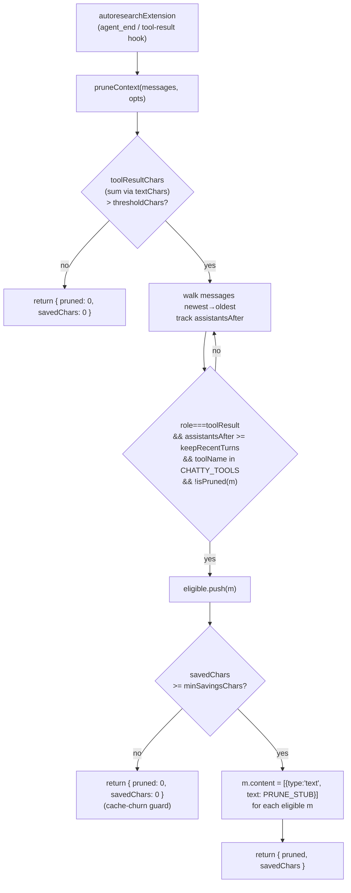

# Context pruning — stubbing stale chatty-tool output to protect the prompt cache

Pure, unit-testable batch rewrite that keeps a long VKF research loop's conversation from being dominated by stale tool-output tokens, without shredding the LLM prompt cache in the process.

## Overview

A VKF research loop can run for many iterations, and the tools that make it "self-improving" — `recall_memory`, `vkf_run_experiment`, `research_graph`, `WebSearch`/`WebFetch` — are exactly the ones that dump the most text into context (memory-card bundles, run logs, web pages, graph exports). The whole conversation is re-sent on every LLM call, so once that output is superseded by the durable on-disk state (memory cards, `experiments.json`, `research_plan.md`), keeping it in context is pure waste. [`pruneContext`](../catalog/extensions/pi-autoresearch-vkf/context_prune.ts.md#pruneContext) is the module's one exported mechanism: it walks the message list and overwrites old results from a fixed allowlist of "chatty" tools with a single fixed stub, in place. The key design tension it resolves is that rewriting *any* old message invalidates the prompt-cache prefix from that point forward — so pruning is deliberately **batched and threshold-triggered**, never per-turn, trading one cache miss for many cheaper requests afterward. The module is pure (structural types only, no pi-runtime imports), which is what makes it unit-testable in isolation.

## Diagram

## Design rationale (why it's built this way)

The module docstring states the problem directly: "Tool results live in the conversation until the host compacts, and the whole conversation is re-sent on every LLM call — so stale output from the chatty tools (web pages, run logs, memory dumps) is the dominant recurring token cost of a long loop." The fix is a stub, not deletion — `PRUNE_STUB` deliberately reads `"[pruned to save context — the durable copy lives in .autoresearch-vkf/ (memory cards, experiments.json, research_plan.md); re-query with recall_memory / research_status]"`, i.e. it re-teaches the agent where the real data still lives rather than leaving a silent gap.

The batching decision is the module's central tradeoff, and it's spelled out in the header comment: "Pruning is *batched and threshold-triggered*, not per-turn: rewriting an old message invalidates the prompt-cache prefix from that point on, so we only prune when there's a meaningful amount to reclaim — one cache miss buys many smaller requests afterwards." That single sentence explains three of [`pruneContext`](../catalog/extensions/pi-autoresearch-vkf/context_prune.ts.md#pruneContext)'s four knobs: [`thresholdChars`](../catalog/extensions/pi-autoresearch-vkf/context_prune.ts.md#PruneOptions.thresholdChars) gates whether pruning runs at all ("Only prune when tool-result text in context exceeds this"), [`keepRecentTurns`](../catalog/extensions/pi-autoresearch-vkf/context_prune.ts.md#PruneOptions.keepRecentTurns) protects results the agent is still actively reasoning about ("Results within this many assistant turns of the end are kept"), and [`minSavingsChars`](../catalog/extensions/pi-autoresearch-vkf/context_prune.ts.md#PruneOptions.minSavingsChars) is an explicit "cache-churn guard": "Skip the batch unless it reclaims at least this much." Without that last guard, a batch that barely clears the eligibility bar could still pay a full cache-invalidation cost for a trivial token saving.

[`CHATTY_TOOLS`](../catalog/extensions/pi-autoresearch-vkf/context_prune.ts.md#CHATTY_TOOLS) is an allowlist, not a size heuristic — its doc comment is precise about why: "Tools whose results go stale once their content is carded / logged to disk." That is a closed-loop property of *this* research loop specifically: `vkf_run_experiment`, `recall_memory`, `research_graph`, `research_status`, and `draft_research_plan` are chatty exactly because their output duplicates state the loop already persisted to `.autoresearch-vkf/` on the same turn, so pruning here is safe by construction rather than a lossy compression guess. `WebFetch`/`WebSearch` get the same treatment because their content, once read, has already fed whatever memory card or claim it supported.

> [!inferred] The module is kept structurally pure — [`PrunableMessage`](../catalog/extensions/pi-autoresearch-vkf/context_prune.ts.md#PrunableMessage) is explicitly documented as a "Structural slice of pi's `AgentMessage` that pruning needs" rather than importing pi's real message type — almost certainly so this file can be unit-tested (as `tests/context_prune.test.mjs` does) without constructing a real pi runtime, matching the repo-wide convention (see `CLAUDE.md`) of keeping logic modules free of pi-runtime imports.

## Entry points

- [`pruneContext`](../catalog/extensions/pi-autoresearch-vkf/context_prune.ts.md#pruneContext) — the sole entry point, a batch rewrite over `messages: PrunableMessage[]` that mutates eligible messages' [`content`](../catalog/extensions/pi-autoresearch-vkf/context_prune.ts.md#PrunableMessage.content) in place and returns `{ pruned, savedChars }`. Control reaches it from [`autoresearchExtension`](../catalog/extensions/pi-autoresearch-vkf/index.ts.md#autoresearchExtension), the extension's single registration site, which is the only caller in this packet's subgraph; its `context`-event hook destructures only [`pruned`](../catalog/extensions/pi-autoresearch-vkf/context_prune.ts.md#pruneContext.typeLiteral17.pruned) and uses it purely as a boolean gate (`if (pruned === 0) return undefined;`, otherwise it returns `{ messages: event.messages }` to tell the host the list changed) — `savedChars` is not read by this caller at all, so nothing about the reclaimed character count is reported or logged here.
- [`index.ts`](../catalog/extensions/pi-autoresearch-vkf/index.ts.md) imports [`pruneContext`](../catalog/extensions/pi-autoresearch-vkf/context_prune.ts.md#pruneContext) directly (`import { pruneContext } from "./context_prune.ts"`), making the extension's tool-registration module the only production caller — this is a leaf utility module, not something invoked from within its own file's tool handlers.

## Mechanism (step-by-step)

1. **Merge options and short-circuit on the cheap check first.** [`pruneContext`](../catalog/extensions/pi-autoresearch-vkf/context_prune.ts.md#pruneContext) merges caller-supplied [`PruneOptions`](../catalog/extensions/pi-autoresearch-vkf/context_prune.ts.md#PruneOptions) over [`DEFAULTS`](../catalog/extensions/pi-autoresearch-vkf/context_prune.ts.md#DEFAULTS) (`thresholdChars: 150_000`, `keepRecentTurns: 8`, `minSavingsChars: 20_000`), then sums [`textChars`](../catalog/extensions/pi-autoresearch-vkf/context_prune.ts.md#textChars) over every non-pruned `toolResult` message. If that total doesn't exceed [`thresholdChars`](../catalog/extensions/pi-autoresearch-vkf/context_prune.ts.md#PruneOptions.thresholdChars), the function returns `{ pruned: 0, savedChars: 0 }` immediately — the common case on most turns, since most loops never accumulate enough chatty output to be worth touching.
2. **Walk backward to find "old" eligible results.** The function iterates `messages` from the end toward the start, incrementing an `assistantsAfter` counter each time it passes an `assistant` message. A `toolResult` becomes a candidate for [`PruneOptions`](../catalog/extensions/pi-autoresearch-vkf/context_prune.ts.md#PruneOptions) once `assistantsAfter >= keepRecentTurns` — i.e. "old" is defined relative to how many assistant turns have happened *since* that result, not by absolute position or age in characters. It must also have a defined [`toolName`](../catalog/extensions/pi-autoresearch-vkf/context_prune.ts.md#PrunableMessage.toolName) present in [`CHATTY_TOOLS`](../catalog/extensions/pi-autoresearch-vkf/context_prune.ts.md#CHATTY_TOOLS) and must not already be pruned (checked via [`isPruned`](../catalog/extensions/pi-autoresearch-vkf/context_prune.ts.md#isPruned)); qualifying messages are collected into `eligible`.
3. **Compute the batch's actual savings before touching anything.** For each eligible message the function computes `stubbed(m) = max(0, textChars(m) - PRUNE_STUB.length)` — the *net* characters reclaimed, since replacing a short result with the (fairly long) [`PRUNE_STUB`](../catalog/extensions/pi-autoresearch-vkf/context_prune.ts.md#PRUNE_STUB) text can net near-zero or even negative savings for a short result. These are summed into `savedChars`, and if that total is below [`minSavingsChars`](../catalog/extensions/pi-autoresearch-vkf/context_prune.ts.md#PruneOptions.minSavingsChars), the whole batch is abandoned with `{ pruned: 0, savedChars: 0 }` — nothing is mutated, so a rejected batch costs nothing beyond the scan.
4. **Commit the rewrite in place.** Only once the batch clears every gate does the function loop over `eligible` and overwrite each message's [`content`](../catalog/extensions/pi-autoresearch-vkf/context_prune.ts.md#PrunableMessage.content) with `[{ type: "text", text: PRUNE_STUB }]`, then return `{ pruned: eligible.length, savedChars }`. Because this is a mutation of the same message objects the caller passed in (not a new array), the caller ([`autoresearchExtension`](../catalog/extensions/pi-autoresearch-vkf/index.ts.md#autoresearchExtension)) sees the effect immediately on its own reference to `messages` without needing to reassign anything.

## Key data structures

- [`PrunableMessage`](../catalog/extensions/pi-autoresearch-vkf/context_prune.ts.md#PrunableMessage) — the module's own minimal structural type (`role`, optional [`toolName`](../catalog/extensions/pi-autoresearch-vkf/context_prune.ts.md#PrunableMessage.toolName), optional [`content`](../catalog/extensions/pi-autoresearch-vkf/context_prune.ts.md#PrunableMessage.content): `unknown`), documented as "Structural slice of pi's `AgentMessage` that pruning needs" — deliberately narrower than the real host message type so this file has zero pi-runtime dependency.
- [`TextPart`](../catalog/extensions/pi-autoresearch-vkf/context_prune.ts.md#TextPart) — the shape ([`type`](../catalog/extensions/pi-autoresearch-vkf/context_prune.ts.md#TextPart.type), [`text`](../catalog/extensions/pi-autoresearch-vkf/context_prune.ts.md#TextPart.text)) that [`textParts`](../catalog/extensions/pi-autoresearch-vkf/context_prune.ts.md#textParts) filters a message's `content` array down to; everything char-counting and pruning does operates only on parts matching this shape, so non-text content parts (if any exist in a real `AgentMessage`) are silently invisible to this module.
- [`PruneOptions`](../catalog/extensions/pi-autoresearch-vkf/context_prune.ts.md#PruneOptions) / [`DEFAULTS`](../catalog/extensions/pi-autoresearch-vkf/context_prune.ts.md#DEFAULTS) — the three-knob policy surface described above, each field individually documented at its declaration.
- [`PRUNE_STUB`](../catalog/extensions/pi-autoresearch-vkf/context_prune.ts.md#PRUNE_STUB) — the single fixed replacement string, also doubling as the sentinel [`isPruned`](../catalog/extensions/pi-autoresearch-vkf/context_prune.ts.md#isPruned) checks for by exact string equality — since it's a module-level constant, every prune of every message produces byte-identical text, which is what makes idempotency detection a simple equality check rather than a marker/regex scan.

## Dynamics (design intent)

`tests/context_prune.test.mjs` exercises the batching/threshold behavior directly. It confirms nothing happens below [`thresholdChars`](../catalog/extensions/pi-autoresearch-vkf/context_prune.ts.md#PruneOptions.thresholdChars) even with old eligible messages present; that once over threshold, results are pruned to exactly [`PRUNE_STUB`](../catalog/extensions/pi-autoresearch-vkf/context_prune.ts.md#PRUNE_STUB); that trailing results with zero assistant turns after them are "never eligible" regardless of [`keepRecentTurns`](../catalog/extensions/pi-autoresearch-vkf/context_prune.ts.md#PruneOptions.keepRecentTurns); that only tool names in [`CHATTY_TOOLS`](../catalog/extensions/pi-autoresearch-vkf/context_prune.ts.md#CHATTY_TOOLS) are touched (a `vkf_log_experiment` result interleaved between two `vkf_run_experiment` results is left untouched while its neighbors are stubbed); that a batch failing to clear [`minSavingsChars`](../catalog/extensions/pi-autoresearch-vkf/context_prune.ts.md#PruneOptions.minSavingsChars) is skipped entirely (the cache-churn guard); and — the property the module depends on for safe repeated calls — that a second [`pruneContext`](../catalog/extensions/pi-autoresearch-vkf/context_prune.ts.md#pruneContext) call over an already-pruned transcript returns `{ pruned: 0, savedChars: 0 }` rather than re-counting or re-stubbing anything, because [`isPruned`](../catalog/extensions/pi-autoresearch-vkf/context_prune.ts.md#isPruned) excludes already-stubbed messages from both the threshold sum and the eligibility scan.

## Edge cases

- **A short chatty result can net negative savings.** `stubbed(m) = max(0, textChars(m) - PRUNE_STUB.length)` clamps at zero specifically because [`PRUNE_STUB`](../catalog/extensions/pi-autoresearch-vkf/context_prune.ts.md#PRUNE_STUB) itself is ~180 characters — a short tool result would otherwise register as a negative "saving," silently deflating the batch total and risking a false negative on the [`minSavingsChars`](../catalog/extensions/pi-autoresearch-vkf/context_prune.ts.md#PruneOptions.minSavingsChars) gate.
- **`keepRecentTurns` counts assistant turns, not calendar/position distance.** Because [`pruneContext`](../catalog/extensions/pi-autoresearch-vkf/context_prune.ts.md#pruneContext) walks backward incrementing `assistantsAfter` only on `role === "assistant"`, a long run of consecutive `toolResult` messages with no assistant turn between them (e.g. several tool calls in one turn) never advances the counter — they all share the same "age" for eligibility purposes.
- **Non-chatty tool results are never pruned no matter how large.** Only [`toolName`](../catalog/extensions/pi-autoresearch-vkf/context_prune.ts.md#PrunableMessage.toolName) values present in [`CHATTY_TOOLS`](../catalog/extensions/pi-autoresearch-vkf/context_prune.ts.md#CHATTY_TOOLS) are eligible; a large result from a tool outside that set contributes to `toolResultChars` (so it can push past [`thresholdChars`](../catalog/extensions/pi-autoresearch-vkf/context_prune.ts.md#PruneOptions.thresholdChars) and trigger a scan) but is never itself pruned.
- **A message with non-array or non-text `content` counts as zero characters.** [`textParts`](../catalog/extensions/pi-autoresearch-vkf/context_prune.ts.md#textParts) returns `[]` when `m.content` isn't an array, so such a message is invisible to both the threshold sum and eligibility — it can never be pruned and never counts toward triggering a prune pass.

## Open questions

> [!inferred] Neither this packet's Subgraph nor the read source shows what calls [`pruneContext`](../catalog/extensions/pi-autoresearch-vkf/context_prune.ts.md#pruneContext) inside [`autoresearchExtension`](../catalog/extensions/pi-autoresearch-vkf/index.ts.md#autoresearchExtension) — i.e. which lifecycle hook (`agent_end`, a per-tool-result hook, or something else) triggers it and with what `opts`. The subgraph only records that `index.ts` imports and references `pruneContext`; the invocation site itself is outside this packet's cited symbols, so it isn't asserted here as fact.

## See also

- [extensions-pi-autoresearch-vkf-autonomy.ts.md](extensions-pi-autoresearch-vkf-autonomy.ts.md) — the sibling context-shaping mechanism: where this module *removes* stale text from context, `autonomy.ts`'s `continuationNote`/`nudgeMessage` *adds* directive text to every tool result precisely because "tool output recurs in context; skill prose fades" — the same underlying fact (recurring tool output dominates context) motivating opposite interventions.
- [extensions-pi-autoresearch-vkf-index.ts.md](extensions-pi-autoresearch-vkf-index.ts.md) — `autoresearchExtension`, the sole caller of `pruneContext` and the tool-registration module this file's leaf utility supports.
