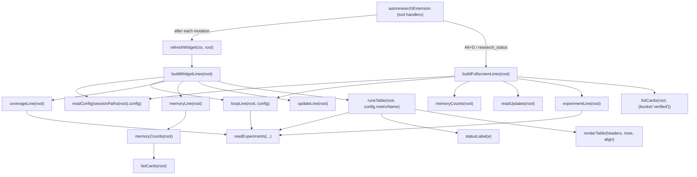

# Terminal dashboard (`dashboard.ts`) — the live widget and Alt+G fullscreen overlay

The in-terminal read-projection of a VKF research session: a compact always-on widget above the editor and a fuller Alt+G fullscreen overlay, both rendered as plain `string[]` lines from the session and memory bundle on disk.

## Overview

This module is the *visibility* layer over the loop the rest of the extension runs — it does not itself do tree search, scoring, or belief updates; it re-reads and formats the two on-disk artifacts those mechanisms leave behind. One artifact is the session's experiment trail (`experiments.json`, read via [`readExperiments`](../catalog/extensions/pi-autoresearch-vkf/experiments.ts.md#readExperiments)) — order, outcomes, and lever/altitude coverage of the best-first search. The other is the VKF memory bundle's trust-lifecycle counts (via [`listCards`](../catalog/extensions/pi-autoresearch-vkf/cards.ts.md#listCards) and [`MemoryState`](../catalog/extensions/pi-autoresearch-vkf/cards.ts.md#MemoryState)) — how much of what's been learned is still `candidate`, how much is verified, how much has been `contradicted`. The single design idea, taken straight from the module's own header comment, is to keep this "dependency-light: it reads `.autoresearch-vkf/session/` and `.autoresearch-vkf/memory/` from disk and returns `string[]`, so it works regardless of theme support" — and, per the same comment, "the two halves mirror the architecture: the *session* (what this run has tried) and the *memory* (durable knowledge by lifecycle state)."

## Diagram

## Design rationale (why it's built this way)

**Full recompute, no incremental state.** Every builder reads config, experiments, and cards fresh on each call rather than patching a previous render — there is nothing in the module to keep in sync, which is why it's safe for [`refreshWidget`](../catalog/extensions/pi-autoresearch-vkf/render.ts.md#refreshWidget) to call [`buildWidgetLines`](../catalog/extensions/pi-autoresearch-vkf/dashboard.ts.md#buildWidgetLines) after literally any state-mutating tool call in [`autoresearchExtension`](../catalog/extensions/pi-autoresearch-vkf/index.ts.md#autoresearchExtension).

**The shortcut hint is placed above the table on purpose.** [`buildWidgetLines`](../catalog/extensions/pi-autoresearch-vkf/dashboard.ts.md#buildWidgetLines)'s own comment explains an otherwise-odd layout choice: "pi truncates an over-tall widget from the bottom, so anything below the table would be the first thing cut. Keeping it up top guarantees it stays visible." The same bottom-truncation constraint is why [`runsTable`](../catalog/extensions/pi-autoresearch-vkf/dashboard.ts.md#runsTable) orders rows oldest→newest with the newest run last and keeps a `#` run-index column, documented as: "pi truncates an over-tall widget from the *bottom*... the `#` run-number column keeps every row identifiable even when older runs are dropped off the top."

**Color is applied only after layout is fixed.** [`renderTable`](../catalog/extensions/pi-autoresearch-vkf/dashboard.ts.md#renderTable)'s doc comment is explicit: "Column widths are measured on the *plain* text and padding is applied before any color, so ANSI escapes from `style` never disturb alignment." [`style`](../catalog/extensions/pi-autoresearch-vkf/style.ts.md#style) and [`wrap`](../catalog/extensions/pi-autoresearch-vkf/style.ts.md#wrap) compose from the shared [`SGR`](../catalog/extensions/pi-autoresearch-vkf/style.ts.md#SGR) code table and short-circuit to plain text on an empty string — but that guard isn't actually what protects the width math: [`renderTable`](../catalog/extensions/pi-autoresearch-vkf/dashboard.ts.md#renderTable) computes column widths from the raw row values *before* padding or the `cell` colorizer ever runs, so ANSI codes can't reach the width calculation regardless of emptiness. A missing commit, for instance, never even hits the empty-string guard — [`runsTable`](../catalog/extensions/pi-autoresearch-vkf/dashboard.ts.md#runsTable) falls back to the placeholder `"—"`, not `""`.

**The loop state, not just the run history, gets its own line.** [`loopLine`](../catalog/extensions/pi-autoresearch-vkf/dashboard.ts.md#loopLine)'s doc calls out exactly why: "session mode, autonomy, budget burn, and the user's [STOP request]... this is what makes unattended (continuous) runs legible at a glance — the UI replaces mid-loop check-ins." Because `autonomy: "continuous"` sessions run unattended, the dashboard — not a chat message — is the only place a user sees iteration count, a pending STOP, or a new-best flag.

**Agent narration is mirrored here instead of pausing the loop.** [`updateLine`](../catalog/extensions/pi-autoresearch-vkf/dashboard.ts.md#updateLine) is documented as "the in-terminal mirror of the dashboard's Research log, so continuous runs narrate here instead of pausing" — the agent posts a `research_update` headline that surfaces passively in the widget rather than as a turn the user must respond to.

**Coverage is a rut-detector, not just a tally.** [`coverageLine`](../catalog/extensions/pi-autoresearch-vkf/dashboard.ts.md#coverageLine) is documented as showing "how the experiments we've actually run spread across `lever·altitude` buckets, plus the levers never touched. One glance shows '11 tweaks to the algorithm, never touched the data or the objective.'" It deliberately surfaces [`LEVERS`](../catalog/extensions/pi-autoresearch-vkf/cards.ts.md#LEVERS) never touched by any experiment's [`lever`](../catalog/extensions/pi-autoresearch-vkf/experiments.ts.md#Experiment.lever), alongside the top 6 touched buckets — a compact signal that the search may be stuck exploring one dimension.

**Memory is collapsed to three buckets on the widget, all seven on the overlay.** [`memoryLine`](../catalog/extensions/pi-autoresearch-vkf/dashboard.ts.md#memoryLine) sums [`MEMORY_STATES`](../catalog/extensions/pi-autoresearch-vkf/cards.ts.md#MEMORY_STATES) into `candidate` / verified (`source_verified` + `locally_tested` + `replicated`) / `contradicted` for the compact widget, while [`buildFullscreenLines`](../catalog/extensions/pi-autoresearch-vkf/dashboard.ts.md#buildFullscreenLines) lists every non-zero [`MemoryState`](../catalog/extensions/pi-autoresearch-vkf/cards.ts.md#MemoryState) individually — the widget optimizes for at-a-glance trust level, the overlay for full VKF-lifecycle detail.

> [!inferred] The widget's tri-bucket grouping (candidate / verified / contradicted) reads as a deliberate simplification of the full seven-state lifecycle described in the repo's memory model, chosen because a one-line widget has no room for `deprecated`/`retired` nuance that matters less moment-to-moment than "is anything currently contradicted."

## Entry points

- [`buildWidgetLines`](../catalog/extensions/pi-autoresearch-vkf/dashboard.ts.md#buildWidgetLines) — "Compact widget shown above the editor. Returns `[]` when there is no session." Called by [`refreshWidget`](../catalog/extensions/pi-autoresearch-vkf/render.ts.md#refreshWidget) after any tool call that changes session/memory state; an empty result tells the caller to hide the widget rather than render nothing.
- [`buildFullscreenLines`](../catalog/extensions/pi-autoresearch-vkf/dashboard.ts.md#buildFullscreenLines) — "Full status for the fullscreen overlay." Reached when the user presses the configured shortcut (advertised by [`shortcutHint`](../catalog/extensions/pi-autoresearch-vkf/dashboard.ts.md#shortcutHint)) for the Alt+G / `research_status` view registered inside [`autoresearchExtension`](../catalog/extensions/pi-autoresearch-vkf/index.ts.md#autoresearchExtension).
- [`refreshWidget`](../catalog/extensions/pi-autoresearch-vkf/render.ts.md#refreshWidget) — the call site, not part of this module but the thing that turns [`buildWidgetLines`](../catalog/extensions/pi-autoresearch-vkf/dashboard.ts.md#buildWidgetLines)'s output into an actual UI update (or clears the widget when the returned array is empty).
- [`autoresearchExtension`](../catalog/extensions/pi-autoresearch-vkf/index.ts.md#autoresearchExtension) — the single tool-registration site whose handlers call [`refreshWidget`](../catalog/extensions/pi-autoresearch-vkf/render.ts.md#refreshWidget) (and, for the overlay, [`buildFullscreenLines`](../catalog/extensions/pi-autoresearch-vkf/dashboard.ts.md#buildFullscreenLines) directly) after `init_research`, `vkf_log_experiment`, `research_update`, and most other tools that change the experiment ledger or memory cards — but not every state-changing tool: `vkf_run_experiment` itself only runs the measurement command and appends to the raw log, so the widget only refreshes once `vkf_log_experiment` records the outcome; `set_research_mode` and `promote_to_global` likewise write state without calling it.

## Mechanism (step-by-step)

1. **A tool handler mutates state, then asks for a repaint.** Most tools inside [`autoresearchExtension`](../catalog/extensions/pi-autoresearch-vkf/index.ts.md#autoresearchExtension) that change what the widget renders — the experiment ledger, memory cards, or the updates log — call [`refreshWidget`](../catalog/extensions/pi-autoresearch-vkf/render.ts.md#refreshWidget) at the end of their handler (a few, like `vkf_run_experiment` and `set_research_mode`, mutate state the widget doesn't display and skip it); there is no push/subscribe model, no diffing against the previous frame — the widget is simply told to recompute.
2. **The widget bails out immediately if there's no session.** [`buildWidgetLines`](../catalog/extensions/pi-autoresearch-vkf/dashboard.ts.md#buildWidgetLines) calls [`readConfig`](../catalog/extensions/pi-autoresearch-vkf/config.ts.md#readConfig) on [`sessionPaths`](../catalog/extensions/pi-autoresearch-vkf/paths.ts.md#sessionPaths)`(root).config` first; an `undefined` config short-circuits to `[]`, which [`refreshWidget`](../catalog/extensions/pi-autoresearch-vkf/render.ts.md#refreshWidget) treats as "clear the widget," not "render nothing visible."
3. **The header stat line is a fresh summary, not a running counter.** [`summarize`](../catalog/extensions/pi-autoresearch-vkf/experiments.ts.md#summarize) re-derives `total`/`kept`/`discarded`/`inconclusive`/[`best`](../catalog/extensions/pi-autoresearch-vkf/experiments.ts.md#ExperimentSummary.best) from the whole [`readExperiments`](../catalog/extensions/pi-autoresearch-vkf/experiments.ts.md#readExperiments) array every time, respecting [`direction`](../catalog/extensions/pi-autoresearch-vkf/config.ts.md#ResearchConfig.direction) so "best" means max or min depending on the metric.
4. **Five independent line-builders are assembled underneath the header.** [`loopLine`](../catalog/extensions/pi-autoresearch-vkf/dashboard.ts.md#loopLine) reports session mode/autonomy/iteration/STOP/new-best; [`coverageLine`](../catalog/extensions/pi-autoresearch-vkf/dashboard.ts.md#coverageLine) reports lever·altitude spread (only if any experiment has been tagged); [`memoryLine`](../catalog/extensions/pi-autoresearch-vkf/dashboard.ts.md#memoryLine) reports the tri-bucket VKF trust counts; [`updateLine`](../catalog/extensions/pi-autoresearch-vkf/dashboard.ts.md#updateLine) reports the latest agent narration (only if one exists); [`shortcutHint`](../catalog/extensions/pi-autoresearch-vkf/dashboard.ts.md#shortcutHint) reports the configured key bindings. Each of the optional ones is spread into the result conditionally (`...(x ? [x] : [])`), so an unpopulated signal contributes zero lines rather than an empty one.
5. **The run history is rendered as a real table, capped and colorized.** [`runsTable`](../catalog/extensions/pi-autoresearch-vkf/dashboard.ts.md#runsTable) slices the last `WIDGET_ROWS` entries from [`readExperiments`](../catalog/extensions/pi-autoresearch-vkf/experiments.ts.md#readExperiments), converts each to metric columns via [`experimentMetrics`](../catalog/extensions/pi-autoresearch-vkf/experiments.ts.md#experimentMetrics) (capped at 5 columns total), derives a status word per row via [`statusLabel`](../catalog/extensions/pi-autoresearch-vkf/dashboard.ts.md#statusLabel), and hands headers/rows/alignment to [`renderTable`](../catalog/extensions/pi-autoresearch-vkf/dashboard.ts.md#renderTable) with a `cell` callback that tints the index, commit, primary-metric, and status columns via [`outcomeStyle`](../catalog/extensions/pi-autoresearch-vkf/style.ts.md#outcomeStyle).
6. **The fullscreen path re-derives the same state but expands every section.** [`buildFullscreenLines`](../catalog/extensions/pi-autoresearch-vkf/dashboard.ts.md#buildFullscreenLines) independently calls [`readConfig`](../catalog/extensions/pi-autoresearch-vkf/config.ts.md#readConfig), [`loopLine`](../catalog/extensions/pi-autoresearch-vkf/dashboard.ts.md#loopLine), [`readExperiments`](../catalog/extensions/pi-autoresearch-vkf/experiments.ts.md#readExperiments) (rendering the last 12 individually with [`OUTCOME_GLYPH`](../catalog/extensions/pi-autoresearch-vkf/experiments.ts.md#OUTCOME_GLYPH) and [`kept`](../catalog/extensions/pi-autoresearch-vkf/experiments.ts.md#Experiment.kept)/[`value`](../catalog/extensions/pi-autoresearch-vkf/experiments.ts.md#Experiment.value) detail rather than a table row), the last 5 research-log entries, and every non-zero [`MemoryState`](../catalog/extensions/pi-autoresearch-vkf/cards.ts.md#MemoryState) count, plus up to 8 verified claim cards pulled straight from [`listCards`](../catalog/extensions/pi-autoresearch-vkf/cards.ts.md#listCards)`(root, {bucket:"verified"})` filtered to `type === "claim"`.

## Key data structures

- [`Experiment`](../catalog/extensions/pi-autoresearch-vkf/experiments.ts.md#Experiment) — the per-run record the whole module reads, never writes: [`id`](../catalog/extensions/pi-autoresearch-vkf/experiments.ts.md#Experiment.id), [`description`](../catalog/extensions/pi-autoresearch-vkf/experiments.ts.md#Experiment.description), [`value`](../catalog/extensions/pi-autoresearch-vkf/experiments.ts.md#Experiment.value), [`outcome`](../catalog/extensions/pi-autoresearch-vkf/experiments.ts.md#Experiment.outcome), [`kept`](../catalog/extensions/pi-autoresearch-vkf/experiments.ts.md#Experiment.kept), and [`lever`](../catalog/extensions/pi-autoresearch-vkf/experiments.ts.md#Experiment.lever) are the fields the dashboard actually surfaces.
- [`ResearchConfig`](../catalog/extensions/pi-autoresearch-vkf/config.ts.md#ResearchConfig) — the session identity/measurement contract; the dashboard reads [`name`](../catalog/extensions/pi-autoresearch-vkf/config.ts.md#ResearchConfig.name), [`goal`](../catalog/extensions/pi-autoresearch-vkf/config.ts.md#ResearchConfig.goal), [`metricName`](../catalog/extensions/pi-autoresearch-vkf/config.ts.md#ResearchConfig.metricName), [`direction`](../catalog/extensions/pi-autoresearch-vkf/config.ts.md#ResearchConfig.direction), [`baseline`](../catalog/extensions/pi-autoresearch-vkf/config.ts.md#ResearchConfig.baseline), and [`maxIterations`](../catalog/extensions/pi-autoresearch-vkf/config.ts.md#ResearchConfig.maxIterations) straight off the object [`readConfig`](../catalog/extensions/pi-autoresearch-vkf/config.ts.md#readConfig) returns.
- [`Card`](../catalog/extensions/pi-autoresearch-vkf/cards.ts.md#Card) / [`MemoryState`](../catalog/extensions/pi-autoresearch-vkf/cards.ts.md#MemoryState) / [`MEMORY_STATES`](../catalog/extensions/pi-autoresearch-vkf/cards.ts.md#MEMORY_STATES) — a card's [`meta`](../catalog/extensions/pi-autoresearch-vkf/cards.ts.md#Card.meta) (a `Record<string, `[`YamlValue`](../catalog/extensions/pi-autoresearch-vkf/frontmatter.ts.md#YamlValue)`>`) carries `memory_state`, which [`memoryCounts`](../catalog/extensions/pi-autoresearch-vkf/dashboard.ts.md#memoryCounts) buckets against every declared [`MemoryState`](../catalog/extensions/pi-autoresearch-vkf/cards.ts.md#MemoryState).
- [`LogEntry`](../catalog/extensions/pi-autoresearch-vkf/jsonl.ts.md#LogEntry) — "A single log entry. `event` discriminates the kind of action"; [`readUpdates`](../catalog/extensions/pi-autoresearch-vkf/dashboard.ts.md#readUpdates) filters the updates log down to `event === "update"` entries with a `headline`.

## Dynamics (design intent)

No test file references this subgraph (the packet's own Evidence section confirms it), so this is grounded purely in static reading, not observed behavior. Every builder — [`buildWidgetLines`](../catalog/extensions/pi-autoresearch-vkf/dashboard.ts.md#buildWidgetLines), [`buildFullscreenLines`](../catalog/extensions/pi-autoresearch-vkf/dashboard.ts.md#buildFullscreenLines), [`loopLine`](../catalog/extensions/pi-autoresearch-vkf/dashboard.ts.md#loopLine), [`coverageLine`](../catalog/extensions/pi-autoresearch-vkf/dashboard.ts.md#coverageLine), [`memoryLine`](../catalog/extensions/pi-autoresearch-vkf/dashboard.ts.md#memoryLine), [`updateLine`](../catalog/extensions/pi-autoresearch-vkf/dashboard.ts.md#updateLine), [`runsTable`](../catalog/extensions/pi-autoresearch-vkf/dashboard.ts.md#runsTable) — is declared as a plain (non-`async`) function with no retained module state beyond the [`trimNum`](../catalog/extensions/pi-autoresearch-vkf/dashboard.ts.md#trimNum) formatter and small constant tables. There is no incremental diffing against a prior render: each call is a full, independent read of [`sessionPaths`](../catalog/extensions/pi-autoresearch-vkf/paths.ts.md#sessionPaths)/[`readConfig`](../catalog/extensions/pi-autoresearch-vkf/config.ts.md#readConfig)/[`readExperiments`](../catalog/extensions/pi-autoresearch-vkf/experiments.ts.md#readExperiments)/[`listCards`](../catalog/extensions/pi-autoresearch-vkf/cards.ts.md#listCards), and the *frequency* of recomputation is entirely controlled by the caller ([`refreshWidget`](../catalog/extensions/pi-autoresearch-vkf/render.ts.md#refreshWidget), or the Alt+G handler), not by this module.

## Edge cases

- **A malformed VKF card is silently dropped, not surfaced.** [`listCards`](../catalog/extensions/pi-autoresearch-vkf/cards.ts.md#listCards) wraps [`readCardFile`](../catalog/extensions/pi-autoresearch-vkf/cards.ts.md#readCardFile) in a `try`/`catch` with the comment "Skip unparseable files rather than failing the whole listing" — so one hand-edited card with broken frontmatter (per [`parseFrontmatter`](../catalog/extensions/pi-autoresearch-vkf/frontmatter.ts.md#parseFrontmatter)) quietly shrinks [`memoryCounts`](../catalog/extensions/pi-autoresearch-vkf/dashboard.ts.md#memoryCounts)'s totals and the verified-claims list in [`buildFullscreenLines`](../catalog/extensions/pi-autoresearch-vkf/dashboard.ts.md#buildFullscreenLines) with no error line anywhere in the dashboard.
- **`kept` overrides the raw outcome word.** [`statusLabel`](../catalog/extensions/pi-autoresearch-vkf/dashboard.ts.md#statusLabel) shows `"keep"`/`"discard"` when [`kept`](../catalog/extensions/pi-autoresearch-vkf/experiments.ts.md#Experiment.kept) is explicitly `true`/`false`, and only falls back to the raw [`outcome`](../catalog/extensions/pi-autoresearch-vkf/experiments.ts.md#Experiment.outcome) (`win`/`loss`/`inconclusive`) when `kept` is `undefined` — a `"win"`-outcome experiment can still display as `"discard"` if it was explicitly reverted.
- **Two independent optional lines can both disappear.** [`coverageLine`](../catalog/extensions/pi-autoresearch-vkf/dashboard.ts.md#coverageLine) returns `undefined` only until the *first* experiment is logged at all — once any experiment exists, even a completely untagged one counts toward an `untagged ×N` bucket, so the line appears whether or not a [`lever`](../catalog/extensions/pi-autoresearch-vkf/experiments.ts.md#Experiment.lever)/altitude was ever set. [`updateLine`](../catalog/extensions/pi-autoresearch-vkf/dashboard.ts.md#updateLine) returns `undefined` until at least one `research_update` has been logged; [`buildWidgetLines`](../catalog/extensions/pi-autoresearch-vkf/dashboard.ts.md#buildWidgetLines) conditionally spreads both, so a brand-new session's widget (before any experiment) is visibly shorter than a mature one.
- **Metric columns are capped, and older records fall back to a single value.** [`experimentMetrics`](../catalog/extensions/pi-autoresearch-vkf/experiments.ts.md#experimentMetrics) only synthesizes `{ [metricName]: e.value }` when an experiment has no `.metrics` map at all, and [`runsTable`](../catalog/extensions/pi-autoresearch-vkf/dashboard.ts.md#runsTable) caps the combined column set at 5 regardless of how many distinct metric names have ever been logged (the comment notes "the web page has them all").
- **`baseline` only appears once it's been measured.** [`buildFullscreenLines`](../catalog/extensions/pi-autoresearch-vkf/dashboard.ts.md#buildFullscreenLines) gates the baseline line on `config.`[`baseline`](../catalog/extensions/pi-autoresearch-vkf/config.ts.md#ResearchConfig.baseline)` !== undefined`, so a session between `init_research` and its first measured run shows no baseline line at all rather than a placeholder.

## Open questions

> [!inferred] [`memoryCounts`](../catalog/extensions/pi-autoresearch-vkf/dashboard.ts.md#memoryCounts) gates on a `hasMemory(root)` check (visible in the actual source, imported from `paths.ts`) before it iterates cards at all — but `hasMemory` is not in this packet's Subgraph, so its exact no-memory-bundle condition can't be cited or described further here.
> [!inferred] The repo's architecture notes describe a separate, self-contained web dashboard (`progress.html`, built by `progress_data.ts`/`progress_html.ts`) fed by the same session state. Whether that web view and this terminal view can ever disagree — e.g. during the moment between an experiment being logged and both renderers re-reading disk — can't be verified here, since neither `progress_data.ts` nor `progress_html.ts` is in this packet's Subgraph.
- Which specific key event wires up to the Alt+G / `research_status` path that calls [`buildFullscreenLines`](../catalog/extensions/pi-autoresearch-vkf/dashboard.ts.md#buildFullscreenLines) is only advertised as text by [`shortcutHint`](../catalog/extensions/pi-autoresearch-vkf/dashboard.ts.md#shortcutHint)/[`loadShortcuts`](../catalog/extensions/pi-autoresearch-vkf/shortcuts.ts.md#loadShortcuts); the actual UI event-binding code is outside this subgraph.

## See also

- [Session config (`ResearchConfig`)](extensions-pi-autoresearch-vkf-config.ts.md) — the `optimize`/`ideate` and metric/direction contract this module reads on every render.
- [VKF cards and the memory-state lifecycle](extensions-pi-autoresearch-vkf-cards.ts.md) — the trust lifecycle `memoryCounts`/`memoryLine`/`buildFullscreenLines` summarize into counts and a verified-claims list.
