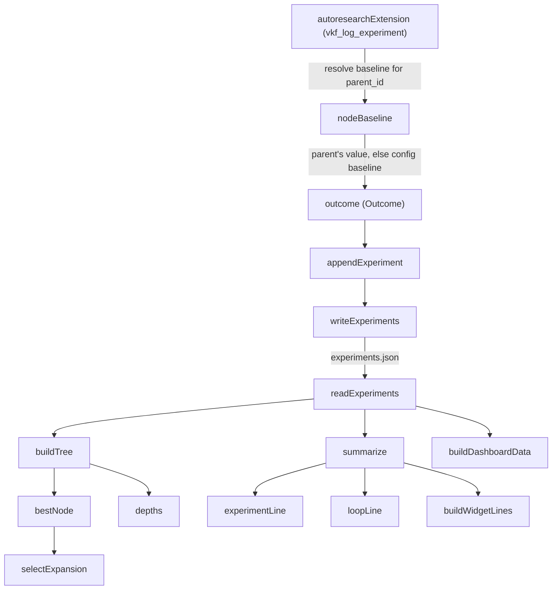

# Experiment log & parent-relative baselines

<!-- connect:up:begin -->
> **Cross-repo concept:** part of [agentic-tree-search](../../../concepts/agentic-tree-search.md) across this wiki's repos.
<!-- connect:up:end -->
## Overview
`experiments.ts` is the append-only, on-disk ledger of every run the current
research loop has attempted: a flat JSON array of [`Experiment`](../catalog/extensions/pi-autoresearch-vkf/experiments.ts.md#Experiment)
records, loaded and saved whole via [`readExperiments`](../catalog/extensions/pi-autoresearch-vkf/experiments.ts.md#readExperiments)
/ [`writeExperiments`](../catalog/extensions/pi-autoresearch-vkf/experiments.ts.md#writeExperiments) and grown one row at a
time via [`appendExperiment`](../catalog/extensions/pi-autoresearch-vkf/experiments.ts.md#appendExperiment). Its single
defining idea is [`nodeBaseline`](../catalog/extensions/pi-autoresearch-vkf/experiments.ts.md#nodeBaseline): a node's
outcome is judged against the value of its own *parent* in the search tree, not one fixed
session-wide baseline. That reframes the log from "a timeline of runs" into a substrate a
best-first tree search can act on — [`bestNode`](../catalog/extensions/pi-autoresearch-vkf/tree.ts.md#bestNode) and
[`buildTree`](../catalog/extensions/pi-autoresearch-vkf/tree.ts.md#buildTree) reconstruct the tree from it, and
[`selectExpansion`](../catalog/extensions/pi-autoresearch-vkf/tree.ts.md#selectExpansion) decides where to branch next.
[`summarize`](../catalog/extensions/pi-autoresearch-vkf/experiments.ts.md#summarize) then rolls the whole ledger into one
[`ExperimentSummary`](../catalog/extensions/pi-autoresearch-vkf/experiments.ts.md#ExperimentSummary) that both the
terminal widget and the browser dashboard render live.

## Diagram

## Design rationale (why it's built this way)
The load-bearing decision is *what a node's value gets compared to*. The
[`nodeBaseline`](../catalog/extensions/pi-autoresearch-vkf/experiments.ts.md#nodeBaseline) docstring states it directly:
"the value of its parent node in the tree. A node compares to where it branched from, not to a
single global baseline — that's what makes outcomes attributable in a branching search." In a
best-first search the log can contain several sibling branches hanging off different ancestors;
comparing every row to one fixed session baseline would make a deep, already-improved branch look
like it's "losing" relative to a shallow one it has nothing to do with. Falling back to
`configBaseline` only when there's no resolvable parent value keeps roots and pre-tree ("legacy
linear") logs behaving exactly as a single-baseline system always did — the tree-aware behavior is
additive, not a breaking change to older sessions.

The log itself is stored as a flat, replaceable array rather than a nested tree structure. The
module docstring frames this as an intentional split: "This is the ephemeral, per-run view (counts,
best metric, the dashboard). Durable results are *also* written to the VKF memory bundle as
experiment cards so future runs can recall them." Tree shape is recomputed on demand by
[`buildTree`](../catalog/extensions/pi-autoresearch-vkf/tree.ts.md#buildTree)/[`depths`](../catalog/extensions/pi-autoresearch-vkf/tree.ts.md#depths)
from each row's `parent_id`, rather than persisted redundantly — keeping this file "Pure … (only
`node:fs`)" (its own header comment) so the outcome logic stays unit-testable without booting the
pi extension host.

## Entry points
- [`readExperiments`](../catalog/extensions/pi-autoresearch-vkf/experiments.ts.md#readExperiments) — the read side of the
  ledger. `init_research` seeds an empty array via [`writeExperiments`](../catalog/extensions/pi-autoresearch-vkf/experiments.ts.md#writeExperiments),
  and every later tool call inside [`autoresearchExtension`](../catalog/extensions/pi-autoresearch-vkf/index.ts.md#autoresearchExtension)
  re-reads through this function before deciding anything — it tolerates a missing file by
  returning `[]` rather than special-casing "no session yet" at every call site.
- [`writeExperiments`](../catalog/extensions/pi-autoresearch-vkf/experiments.ts.md#writeExperiments) /
  [`appendExperiment`](../catalog/extensions/pi-autoresearch-vkf/experiments.ts.md#appendExperiment) — reached at the end
  of the `vkf_log_experiment` tool body inside [`autoresearchExtension`](../catalog/extensions/pi-autoresearch-vkf/index.ts.md#autoresearchExtension),
  right after [`nodeBaseline`](../catalog/extensions/pi-autoresearch-vkf/experiments.ts.md#nodeBaseline) has resolved what
  the new run's value should be compared against.
- [`summarize`](../catalog/extensions/pi-autoresearch-vkf/experiments.ts.md#summarize) — reached on every terminal-widget
  draw: [`experimentLine`](../catalog/extensions/pi-autoresearch-vkf/dashboard.ts.md#experimentLine),
  [`loopLine`](../catalog/extensions/pi-autoresearch-vkf/dashboard.ts.md#loopLine), and
  [`buildWidgetLines`](../catalog/extensions/pi-autoresearch-vkf/dashboard.ts.md#buildWidgetLines) all call it fresh off a
  new [`readExperiments`](../catalog/extensions/pi-autoresearch-vkf/experiments.ts.md#readExperiments), with no caching.
- [`buildDashboardData`](../catalog/extensions/pi-autoresearch-vkf/progress_data.ts.md#buildDashboardData) — reached
  whenever the browser-dashboard payload is (re)built; it walks the ledger through
  [`depths`](../catalog/extensions/pi-autoresearch-vkf/tree.ts.md#depths) and
  [`experimentMetrics`](../catalog/extensions/pi-autoresearch-vkf/experiments.ts.md#experimentMetrics) to attach tree
  position and per-metric series to each row.
- [`selectExpansion`](../catalog/extensions/pi-autoresearch-vkf/tree.ts.md#selectExpansion) — reached during
  `plan_next_step`; it calls [`bestNode`](../catalog/extensions/pi-autoresearch-vkf/tree.ts.md#bestNode) over the same
  ledger to decide which existing node the next idea should branch from.

## Mechanism (step-by-step)
1. A session starts with an empty ledger: `init_research` (inside
   [`autoresearchExtension`](../catalog/extensions/pi-autoresearch-vkf/index.ts.md#autoresearchExtension)) calls
   [`writeExperiments`](../catalog/extensions/pi-autoresearch-vkf/experiments.ts.md#writeExperiments) with `[]`, so every
   subsequent [`readExperiments`](../catalog/extensions/pi-autoresearch-vkf/experiments.ts.md#readExperiments) sees a real
   (if empty) file rather than hitting the missing-file branch.
2. When a run measures a metric, the loop must decide what to compare it to.
   [`nodeBaseline`](../catalog/extensions/pi-autoresearch-vkf/experiments.ts.md#nodeBaseline) resolves this by
   `parent_id`: if the new row names a parent and that parent already has a measured
   [`value`](../catalog/extensions/pi-autoresearch-vkf/experiments.ts.md#Experiment.value), the parent's own value is the
   baseline; only roots and unresolvable parents fall back to the session's fixed
   `configBaseline`. This is the mechanic described in Design rationale above.
3. The judgement against that baseline is stamped onto the new row's
   [`outcome`](../catalog/extensions/pi-autoresearch-vkf/experiments.ts.md#Experiment.outcome) field, one of the four
   [`Outcome`](../catalog/extensions/pi-autoresearch-vkf/experiments.ts.md#Outcome) values (win/loss/inconclusive/pending);
   together with [`id`](../catalog/extensions/pi-autoresearch-vkf/experiments.ts.md#Experiment.id),
   [`value`](../catalog/extensions/pi-autoresearch-vkf/experiments.ts.md#Experiment.value), and
   [`kept`](../catalog/extensions/pi-autoresearch-vkf/experiments.ts.md#Experiment.kept) it becomes one immutable ledger row.
4. [`appendExperiment`](../catalog/extensions/pi-autoresearch-vkf/experiments.ts.md#appendExperiment) adds that row by
   spreading it onto the existing array — never mutating in place — and
   [`writeExperiments`](../catalog/extensions/pi-autoresearch-vkf/experiments.ts.md#writeExperiments) serializes the whole
   array back to disk as pretty JSON, so the file is always a complete, replaceable snapshot rather
   than something appended to at the byte level.
5. Every downstream reader starts from the same [`readExperiments`](../catalog/extensions/pi-autoresearch-vkf/experiments.ts.md#readExperiments)
   call and reconstructs whatever view it needs on the fly: [`resolveParents`](../catalog/extensions/pi-autoresearch-vkf/tree.ts.md#resolveParents)/[`buildTree`](../catalog/extensions/pi-autoresearch-vkf/tree.ts.md#buildTree)
   turn the flat `parent_id` chain into a real forest (stitching legacy rows onto the last kept node
   or the previous row), and [`bestNode`](../catalog/extensions/pi-autoresearch-vkf/tree.ts.md#bestNode)
   walks that forest for the best-first machinery that
   [`selectExpansion`](../catalog/extensions/pi-autoresearch-vkf/tree.ts.md#selectExpansion) consumes — [`selectExpansion`](../catalog/extensions/pi-autoresearch-vkf/tree.ts.md#selectExpansion)
   itself only calls [`bestNode`](../catalog/extensions/pi-autoresearch-vkf/tree.ts.md#bestNode), not
   [`frontier`](../catalog/extensions/pi-autoresearch-vkf/tree.ts.md#frontier); `frontier` has no
   production call site and is exercised only by `tests/tree.test.mjs`.
6. [`summarize`](../catalog/extensions/pi-autoresearch-vkf/experiments.ts.md#summarize) walks the same array once,
   tallying [`outcome`](../catalog/extensions/pi-autoresearch-vkf/experiments.ts.md#Experiment.outcome) into
   [`win`](../catalog/extensions/pi-autoresearch-vkf/experiments.ts.md#ExperimentSummary.win)/[`loss`](../catalog/extensions/pi-autoresearch-vkf/experiments.ts.md#ExperimentSummary.loss)/[`inconclusive`](../catalog/extensions/pi-autoresearch-vkf/experiments.ts.md#ExperimentSummary.inconclusive)/[`pending`](../catalog/extensions/pi-autoresearch-vkf/experiments.ts.md#ExperimentSummary.pending),
   [`kept`](../catalog/extensions/pi-autoresearch-vkf/experiments.ts.md#ExperimentSummary.kept) vs
   [`discarded`](../catalog/extensions/pi-autoresearch-vkf/experiments.ts.md#ExperimentSummary.discarded), and tracking
   [`best`](../catalog/extensions/pi-autoresearch-vkf/experiments.ts.md#ExperimentSummary.best) respecting
   [`MetricDirection`](../catalog/extensions/pi-autoresearch-vkf/config.ts.md#MetricDirection) — this single
   [`ExperimentSummary`](../catalog/extensions/pi-autoresearch-vkf/experiments.ts.md#ExperimentSummary) is what
   [`buildFullscreenLines`](../catalog/extensions/pi-autoresearch-vkf/dashboard.ts.md#buildFullscreenLines) and the widget
   lines render every draw.
7. [`buildDashboardData`](../catalog/extensions/pi-autoresearch-vkf/progress_data.ts.md#buildDashboardData) takes the same
   ledger for the browser dashboard: [`experimentMetrics`](../catalog/extensions/pi-autoresearch-vkf/experiments.ts.md#experimentMetrics)
   projects each row's metrics, falling back to `{primaryMetric: `[`value`](../catalog/extensions/pi-autoresearch-vkf/experiments.ts.md#Experiment.value)`}`
   for rows recorded before per-metric tracking existed, while
   [`depths`](../catalog/extensions/pi-autoresearch-vkf/tree.ts.md#depths) attaches each row's tree position — so the
   payload carries both metric history and tree shape from one pass over
   [`experiments`](../catalog/extensions/pi-autoresearch-vkf/progress_data.ts.md#BuildDashboardInput.experiments).

## Key data structures
- [`Experiment`](../catalog/extensions/pi-autoresearch-vkf/experiments.ts.md#Experiment) — one immutable ledger row:
  [`id`](../catalog/extensions/pi-autoresearch-vkf/experiments.ts.md#Experiment.id), `parent_id`/`node_kind`/`depth` (the
  tree-search fields), [`value`](../catalog/extensions/pi-autoresearch-vkf/experiments.ts.md#Experiment.value),
  [`outcome`](../catalog/extensions/pi-autoresearch-vkf/experiments.ts.md#Experiment.outcome),
  [`kept`](../catalog/extensions/pi-autoresearch-vkf/experiments.ts.md#Experiment.kept), plus provenance fields
  (`commit`, `branch`, `memory_card`) that tie a ledger row back to its git snapshot and its VKF card.
- [`ExperimentSummary`](../catalog/extensions/pi-autoresearch-vkf/experiments.ts.md#ExperimentSummary) — the rolled-up
  view: [`total`](../catalog/extensions/pi-autoresearch-vkf/experiments.ts.md#ExperimentSummary.total),
  [`win`](../catalog/extensions/pi-autoresearch-vkf/experiments.ts.md#ExperimentSummary.win)/[`loss`](../catalog/extensions/pi-autoresearch-vkf/experiments.ts.md#ExperimentSummary.loss)/[`inconclusive`](../catalog/extensions/pi-autoresearch-vkf/experiments.ts.md#ExperimentSummary.inconclusive)/[`pending`](../catalog/extensions/pi-autoresearch-vkf/experiments.ts.md#ExperimentSummary.pending),
  [`kept`](../catalog/extensions/pi-autoresearch-vkf/experiments.ts.md#ExperimentSummary.kept)/[`discarded`](../catalog/extensions/pi-autoresearch-vkf/experiments.ts.md#ExperimentSummary.discarded),
  and [`best`](../catalog/extensions/pi-autoresearch-vkf/experiments.ts.md#ExperimentSummary.best).
- [`Outcome`](../catalog/extensions/pi-autoresearch-vkf/experiments.ts.md#Outcome) — the four-way classification
  (`win`/`loss`/`inconclusive`/`pending`) every row's [`outcome`](../catalog/extensions/pi-autoresearch-vkf/experiments.ts.md#Experiment.outcome)
  field carries.
- [`MetricDirection`](../catalog/extensions/pi-autoresearch-vkf/config.ts.md#MetricDirection) — `"higher"`/`"lower"`,
  threaded through [`nodeBaseline`](../catalog/extensions/pi-autoresearch-vkf/experiments.ts.md#nodeBaseline) (via the
  outcome it feeds), [`summarize`](../catalog/extensions/pi-autoresearch-vkf/experiments.ts.md#summarize), and
  [`bestNode`](../catalog/extensions/pi-autoresearch-vkf/tree.ts.md#bestNode)/[`bestValue`](../catalog/extensions/pi-autoresearch-vkf/progress_data.ts.md#bestValue)
  so "better" always means the same thing across the module.

## Dynamics (design intent)
`tests/experiments.test.mjs` exercises [`summarize`](../catalog/extensions/pi-autoresearch-vkf/experiments.ts.md#summarize)
directly: three experiments with `outcome: "win"/"loss"/"win"` and values `5, 3, 9` roll up to
`win: 2, loss: 1`, and `best` tracks `9` under `"higher"` but `3` under `"lower"` — confirming
`best` is direction-aware rather than always-max. The module's own header comment ("Pure module
(only `node:fs`)") is a deliberate constraint: keeping this file free of pi-runtime imports is what
lets that test call [`summarize`](../catalog/extensions/pi-autoresearch-vkf/experiments.ts.md#summarize) with plain
object literals, with no extension host to stand up. On immutability: the doc comment "experiments
are immutable once logged" is enforced structurally, not just by convention —
[`appendExperiment`](../catalog/extensions/pi-autoresearch-vkf/experiments.ts.md#appendExperiment) always spreads onto a
new array and [`writeExperiments`](../catalog/extensions/pi-autoresearch-vkf/experiments.ts.md#writeExperiments) always
rewrites the full file, so there is no code path that edits a row in place.

## Edge cases
- A missing `experiments.json`: [`readExperiments`](../catalog/extensions/pi-autoresearch-vkf/experiments.ts.md#readExperiments)
  returns `[]` rather than throwing, so a brand-new session behaves like a normal empty ledger.
- Non-array file content: this is the one place the module fails loudly —
  [`readExperiments`](../catalog/extensions/pi-autoresearch-vkf/experiments.ts.md#readExperiments) throws
  `"<path> is not a JSON array of experiments"` instead of returning something a caller might
  silently misuse.
- No parent, or a parent with no measured value yet: [`nodeBaseline`](../catalog/extensions/pi-autoresearch-vkf/experiments.ts.md#nodeBaseline)
  falls through to `configBaseline` — this covers both true roots and a branch whose parent hasn't
  finished measuring.
- No measured [`value`](../catalog/extensions/pi-autoresearch-vkf/experiments.ts.md#Experiment.value) anywhere in the
  array: [`summarize`](../catalog/extensions/pi-autoresearch-vkf/experiments.ts.md#summarize) leaves
  [`best`](../catalog/extensions/pi-autoresearch-vkf/experiments.ts.md#ExperimentSummary.best) `undefined` rather than
  initializing it to `0`, so "no data yet" stays distinguishable from "best value is `0`" for every
  consumer that reads it.

## Open questions
> [!inferred] The function that actually classifies a value against a baseline into a
> win/loss/inconclusive `Outcome` (with a noise threshold) is defined in this same file, right next
> to the symbols above, and is exercised directly by `tests/experiments.test.mjs` — but it is not
> part of this page's cited Subgraph, so this page cannot name or cite its internals per the
> synthesis rules. A reader wanting the exact classification rule should read
> `extensions/pi-autoresearch-vkf/experiments.ts` directly.
- This packet's auto-generated Evidence section reports "no tests in the configured test paths
  reference this subgraph," but `tests/experiments.test.mjs` calls
  [`summarize`](../catalog/extensions/pi-autoresearch-vkf/experiments.ts.md#summarize) directly (see Dynamics above) —
  worth checking whether the test-path configuration used to build this packet is missing that file.
- The exact call site inside `autoresearchExtension` that chains parent-baseline resolution into a
  logged row (the `vkf_log_experiment` tool body) is truncated in this packet's Source section —
  only the `init_research` handler is shown in full, so step 2–3 above are grounded in the
  `calls/refs` edges and the source file rather than a fully quoted snippet.

## See also
- [extensions-pi-autoresearch-vkf-config.ts.md](extensions-pi-autoresearch-vkf-config.ts.md) — `MetricDirection` and the rest of `ResearchConfig` this module's baseline/summary logic reads.
- [extensions-pi-autoresearch-vkf-cards.ts.md](extensions-pi-autoresearch-vkf-cards.ts.md) — the durable VKF memory bundle this ephemeral, per-run ledger is explicitly contrasted with.
- [extensions-pi-autoresearch-vkf-index.ts.md](extensions-pi-autoresearch-vkf-index.ts.md) — `autoresearchExtension`'s `vkf_log_experiment`/`plan_next_step` tool wiring that calls into this module.
