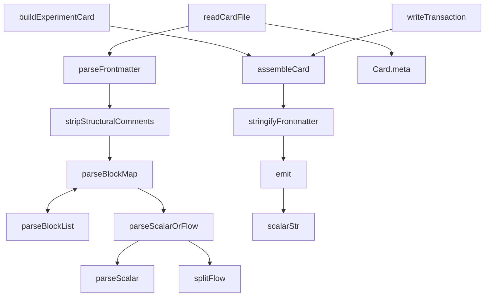

# VKF frontmatter — the hand-rolled YAML-subset reader/writer

## Overview

Every VKF card the autoresearch loop reads or writes is a markdown file whose top
is a `---`-fenced YAML block. `frontmatter.ts` is the module that owns both
directions of that fence: [`parseFrontmatter`](../catalog/extensions/pi-autoresearch-vkf/frontmatter.ts.md#parseFrontmatter)
turns card text into `{ data, body }`, and [`stringifyFrontmatter`](../catalog/extensions/pi-autoresearch-vkf/frontmatter.ts.md#stringifyFrontmatter)/[`assembleCard`](../catalog/extensions/pi-autoresearch-vkf/frontmatter.ts.md#assembleCard)
do the inverse. The key design idea is in the module's own opening comment: this
is deliberately *not* a general YAML implementation. Because the extension is the
only writer of its own cards, it only ever needs to round-trip one controlled
subset — scalars, flow lists, block lists, and nested maps — so a ~250-line
indent-driven recursive-descent parser (and its mirror-image emitter) can cover
every shape the extension itself produces, stay dependency-free, and be
unit-tested without the `pi` runtime. Anything beyond that subset — schema
validation, the typed dependency graph, staleness — is explicitly *not* this
module's job; the docstring says the extension "defer[s] to the real `vkf` CLI…
rather than trusting this parser."

## Diagram

## Design rationale (why it's built this way)

The whole module is built around one asymmetry: the extension is both the sole
producer and the sole strict consumer of these cards, so it can afford a parser
scoped to exactly what its own emitter ever writes, instead of a spec-complete
YAML library. That is why [`YamlValue`](../catalog/extensions/pi-autoresearch-vkf/frontmatter.ts.md#YamlValue) is a closed union (string, number, boolean,
null, arrays, or nested string-keyed maps) rather than an open-ended type —
every parse function returns exactly one of those shapes, and every emit branch
in [`emit`](../catalog/extensions/pi-autoresearch-vkf/frontmatter.ts.md#emit) matches on it exhaustively.

Parsing and emitting share the same structural vocabulary on purpose: both walk
maps and lists by indentation rather than by bracket-matching, and both bottom
out at [`scalarStr`](../catalog/extensions/pi-autoresearch-vkf/frontmatter.ts.md#scalarStr) / [`parseScalar`](../catalog/extensions/pi-autoresearch-vkf/frontmatter.ts.md#parseScalar) for leaf values — so a value that
round-trips through `assembleCard` → `parseFrontmatter` comes back byte-for-byte
equivalent, which is exactly what the test suite (`tests/frontmatter.test.mjs`)
checks. `scalarStr`'s quoting predicate is the sharpest expression of this: it
quotes any string that is itself the literal word `"true"`, `"false"`, `"null"`,
or `"~"` — the same tokens [`parseScalar`](../catalog/extensions/pi-autoresearch-vkf/frontmatter.ts.md#parseScalar) special-cases on read — precisely so a
title or claim body that happens to *contain* the word "null" is never
misread back as the null value.

[`findKeyColon`](../catalog/extensions/pi-autoresearch-vkf/frontmatter.ts.md#findKeyColon)'s own doc comment states its narrow purpose: "Locate the colon that
separates a key from its value (ignores `://` in URLs)." That single carve-out
exists because VKF cards routinely carry a `source_url:` field — without it,
`https://arxiv.org/...` would parse as a nested key rather than a scalar value
(exercised directly by the "preserves URLs with colons in values" test).

## Entry points

- [`parseFrontmatter`](../catalog/extensions/pi-autoresearch-vkf/frontmatter.ts.md#parseFrontmatter) — the sole deserialization entry point. Reached whenever any
  tool needs to read a card already on disk; [`readCardFile`](../catalog/extensions/pi-autoresearch-vkf/cards.ts.md#readCardFile) in `cards.ts` calls it
  directly and stores the resulting map on `Card.`[`meta`](../catalog/extensions/pi-autoresearch-vkf/cards.ts.md#Card.meta).
- [`assembleCard`](../catalog/extensions/pi-autoresearch-vkf/frontmatter.ts.md#assembleCard) — the sole serialization entry point, reached at the moment any
  card is (re)written: [`buildExperimentCard`](../catalog/extensions/pi-autoresearch-vkf/cards.ts.md#buildExperimentCard) calls it to freeze a new experiment
  node, and [`writeTransaction`](../catalog/extensions/pi-autoresearch-vkf/cards.ts.md#writeTransaction) calls it to append every audit-trail record.
- [`stringifyFrontmatter`](../catalog/extensions/pi-autoresearch-vkf/frontmatter.ts.md#stringifyFrontmatter) — exported separately from `assembleCard` so a caller (and
  the test suite) can inspect or re-parse the raw YAML block without the
  surrounding fences and body.

## Mechanism (step-by-step)

1. **Fence detection is strict and fails loudly.** [`parseFrontmatter`](../catalog/extensions/pi-autoresearch-vkf/frontmatter.ts.md#parseFrontmatter) normalizes
   line endings, requires the very first line to equal [`FENCE`](../catalog/extensions/pi-autoresearch-vkf/frontmatter.ts.md#FENCE) (`"---"`), and scans
   forward for a matching closing fence — throwing a distinct error for "no
   frontmatter" versus "unterminated," so a malformed card fails at read time
   instead of silently parsing garbage. Everything after the closing fence
   becomes [`ParsedCard.body`](../catalog/extensions/pi-autoresearch-vkf/frontmatter.ts.md#ParsedCard.body) verbatim, matching that field's own doc comment.
2. **Structural noise is filtered before the real parse begins.** [`stripStructuralComments`](../catalog/extensions/pi-autoresearch-vkf/frontmatter.ts.md#stripStructuralComments)
   drops blank lines and full-line `#` comments from the fenced lines up front,
   so the indent-driven map/list parser never has to special-case them — it only
   ever sees content lines.
3. **Maps are walked by indentation, not brackets.** [`parseBlockMap`](../catalog/extensions/pi-autoresearch-vkf/frontmatter.ts.md#parseBlockMap) compares each
   line's depth via [`indentOf`](../catalog/extensions/pi-autoresearch-vkf/frontmatter.ts.md#indentOf) against the current indent level, splits `key: value` at
   [`findKeyColon`](../catalog/extensions/pi-autoresearch-vkf/frontmatter.ts.md#findKeyColon), and — when a key's value is empty — inspects the *next* line's
   indent and its `"- "` prefix to decide whether to recurse into a nested
   `parseBlockMap` or hand off to [`parseBlockList`](../catalog/extensions/pi-autoresearch-vkf/frontmatter.ts.md#parseBlockList). Both functions return the same
   [`Cursor`](../catalog/extensions/pi-autoresearch-vkf/frontmatter.ts.md#Cursor)`<T>` shape (`{`[`value`](../catalog/extensions/pi-autoresearch-vkf/frontmatter.ts.md#Cursor.value)`,`[`next`](../catalog/extensions/pi-autoresearch-vkf/frontmatter.ts.md#Cursor.next)`}`), so the caller always resumes
   parsing at `cursor.next` regardless of which branch fired.
4. **Lists handle both plain scalars and "lists of maps."** [`parseBlockList`](../catalog/extensions/pi-autoresearch-vkf/frontmatter.ts.md#parseBlockList)
   mirrors the same indent walk, but when a dash-prefixed item itself contains a
   [`findKeyColon`](../catalog/extensions/pi-autoresearch-vkf/frontmatter.ts.md#findKeyColon) hit, it treats that item as the first field of an inline
   object whose remaining fields are continuation lines indented past the dash
   — recursively calling [`parseBlockMap`](../catalog/extensions/pi-autoresearch-vkf/frontmatter.ts.md#parseBlockMap) on just those continuation lines. This
   path exists for genuinely dash-prefixed maps (`- key: value` followed by
   deeper-indented sibling keys); a card's `access: { allowed_uses: [...] }`
   field is *not* an example of it — both the test fixture and
   [`cards.ts`](../catalog/extensions/pi-autoresearch-vkf/cards.ts.md)'s own
   writer shape `access` as a plain nested map whose values are ordinary
   scalar lists, and no test in `tests/frontmatter.test.mjs` exercises the
   list-of-maps branch at all.
5. **Leaf values are coerced to typed `YamlValue`s, not left as strings.** [`parseScalarOrFlow`](../catalog/extensions/pi-autoresearch-vkf/frontmatter.ts.md#parseScalarOrFlow)
   recognizes bracketed `[...]` flow syntax and delegates the inside to [`splitFlow`](../catalog/extensions/pi-autoresearch-vkf/frontmatter.ts.md#splitFlow)
   (which tracks quote state and bracket depth so a comma inside a quoted string
   or a nested list is never mistaken for a top-level separator) before coercing
   each piece with [`parseScalar`](../catalog/extensions/pi-autoresearch-vkf/frontmatter.ts.md#parseScalar) — mapping `~`/`null`/empty to `null`, `true`/`false`
   to booleans, quoted text to its unquoted contents, and bare integer/decimal
   patterns to `Number`, with anything else passed through as a plain string.
6. **Emission is the parser's structural mirror, run in reverse.** [`stringifyFrontmatter`](../catalog/extensions/pi-autoresearch-vkf/frontmatter.ts.md#stringifyFrontmatter)
   walks the same `Record<string,`[`YamlValue`](../catalog/extensions/pi-autoresearch-vkf/frontmatter.ts.md#YamlValue)`>` shape into [`emit`](../catalog/extensions/pi-autoresearch-vkf/frontmatter.ts.md#emit), which recurses by
   runtime type (bare `key:` for null, `key: []` for an empty array, a
   dash-then-continuation block for an array of objects, deeper `emit` calls for
   nested objects, otherwise [`scalarStr`](../catalog/extensions/pi-autoresearch-vkf/frontmatter.ts.md#scalarStr)); [`assembleCard`](../catalog/extensions/pi-autoresearch-vkf/frontmatter.ts.md#assembleCard) is the single point
   where that emitted block, [`FENCE`](../catalog/extensions/pi-autoresearch-vkf/frontmatter.ts.md#FENCE), and a trimmed body string are joined into the
   final `---\n<fm>\n---\n\n<body>\n` text every consumer expects.

## Key data structures

- [`YamlValue`](../catalog/extensions/pi-autoresearch-vkf/frontmatter.ts.md#YamlValue) — the closed union every parsed or emitted value belongs to: scalar
  (string/number/boolean/null), a `YamlValue[]`, or a nested `{ [key: string]:`
  `YamlValue }`. This is the type both directions of the module are built to
  preserve exactly.
- [`ParsedCard`](../catalog/extensions/pi-autoresearch-vkf/frontmatter.ts.md#ParsedCard) — the output of `parseFrontmatter`: [`data`](../catalog/extensions/pi-autoresearch-vkf/frontmatter.ts.md#ParsedCard.data) (the parsed frontmatter map)
  and [`body`](../catalog/extensions/pi-autoresearch-vkf/frontmatter.ts.md#ParsedCard.body) (everything after the closing fence, untouched). `cards.ts`'s [`Card.meta`](../catalog/extensions/pi-autoresearch-vkf/cards.ts.md#Card.meta)
  is exactly `ParsedCard.data` after `readCardFile` reads it off disk.
- [`Cursor`](../catalog/extensions/pi-autoresearch-vkf/frontmatter.ts.md#Cursor)`<T>` — the recursion-carrier shared by `parseBlockMap` and `parseBlockList`:
  `value` is the parsed subtree, `next` is "index of the first line not
  consumed by this block" (its own doc comment), which is what lets a parent
  call resume exactly where a nested call stopped.

## Dynamics (design intent)

Everything in this module is synchronous, single-pass, and has no concurrency
or scheduling surface — it is pure string/array processing over an in-memory
`lines` array, called once per read or once per write. The only "ordering"
property worth naming is that parsing and emission are designed to compose:
`tests/frontmatter.test.mjs`'s "round-trips through assemble + parse" test
builds a data map, runs it through `assembleCard` then straight back through
`parseFrontmatter`, and asserts the nested structure survives unchanged —
confirming the parser and emitter are kept as exact structural inverses of one
another rather than independently-evolving code paths.

## Edge cases

- Inconsistent indentation is a hard error, not a best-effort recovery: both
  `parseBlockMap` and `parseBlockList` throw `"unexpected indentation..."` the
  moment a line's indent exceeds the current block's expected level.
- A line with no colon at all inside a map body throws `"expected \"key:
  value\"..."` from `parseBlockMap` — there is no silent skip of unparseable
  lines here (contrast with `cards.ts`'s `listCards`, which *does* skip
  unparseable cards at a higher layer).
- A missing opening fence and a missing closing fence are distinguished as two
  different thrown messages from `parseFrontmatter` (two separate `throw new
  Error(...)` call sites) — but only the missing-opening-fence case is
  exercised by a test: the "throws without frontmatter" test in
  `tests/frontmatter.test.mjs` calls `parseFrontmatter("no frontmatter here")`;
  no test in the suite exercises the unterminated-fence (missing closing
  `---`) path.
- A colon that is part of a URL (`https://...`) is not treated as a key/value
  separator, because `findKeyColon` only matches a colon followed by a space or
  end-of-string — exercised by the "preserves URLs with colons in values" test.
- An empty flow list `[]` is special-cased in `parseScalarOrFlow` to return `[]`
  directly rather than calling `splitFlow` on an empty inner string (which would
  otherwise need its own empty-string guard).

## Open questions

> [!inferred] The module docstring says the extension "defer[s] to the real
> `vkf` CLI" for validation, the typed graph, and freshness rather than trusting
> this parser for anything beyond the extension's own cards — but the bridge to
> that CLI (`vkf.ts`) is not in this packet's Subgraph, so the exact boundary
> between what this parser is trusted for and what only the CLI validates can't
> be cited further here.
- The Subgraph and the read test file show only one level of "list of maps"
  nesting inside `parseBlockList`'s continuation-line handling; deeper nesting
  (a map inside a list inside a list) is reachable by the recursive calls but
  isn't exercised by any test in this packet's Evidence.

## See also

- [extensions-pi-autoresearch-vkf-cards.ts.md](extensions-pi-autoresearch-vkf-cards.ts.md) — the card-construction and
  lifecycle layer built directly on top of `parseFrontmatter`/`assembleCard`.
