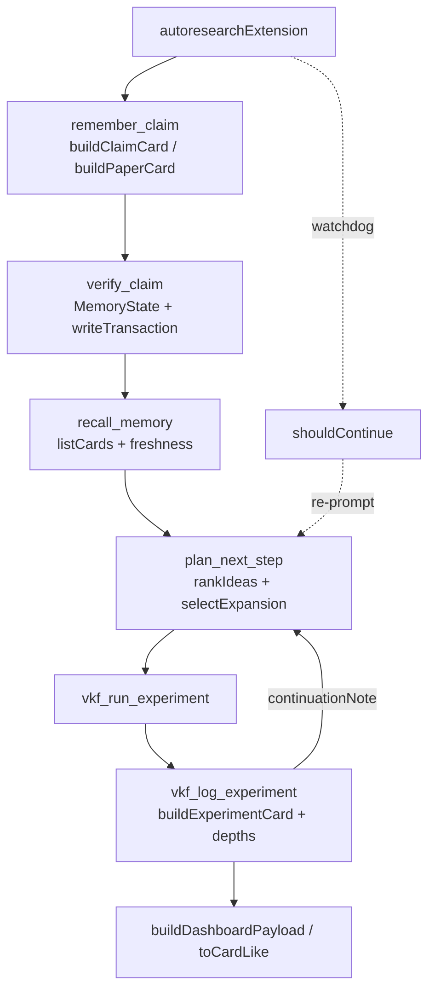

# The tool spine — autoresearchExtension and the autoresearch loop's control surface

<!-- connect:up:begin -->
> **Cross-repo concept:** part of [agentic-tree-search](../../../concepts/agentic-tree-search.md), [closed-loop-experiment-design](../../../concepts/closed-loop-experiment-design.md), [research-development-loop](../../../concepts/research-development-loop.md) across this wiki's repos.
<!-- connect:up:end -->
## Overview

`index.ts` is the whole extension's outward face: every tool the loop exposes to the host agent is a `pi.registerTool` call made inside the single exported [`autoresearchExtension`](../catalog/extensions/pi-autoresearch-vkf/index.ts.md#autoresearchExtension), and the file otherwise contains no domain knowledge of its own — its own header comment states the split plainly: "This extension is the machinery; the domain knowledge (how to search the literature, extract claims, pick the next experiment) lives in the skills." What lives here instead is *plumbing with an agenda*: each tool validates its typebox params, reads and writes the two-layer VKF workspace ([`sessionPaths`](../catalog/extensions/pi-autoresearch-vkf/paths.ts.md#sessionPaths) for the ephemeral run, [`memoryPaths`](../catalog/extensions/pi-autoresearch-vkf/paths.ts.md#memoryPaths) for the durable bundle), and delegates the actual thinking to the pure modules underneath (cards, scoring, tree, synthesis, config, vkf, autonomy). The one idea worth carrying away: the loop's shape — the header comment names it "init → remember (literature) → verify → recall → run → log (write-back)" — is enforced by which state each tool is wired to read and write, not by an external scheduler; and because a long autonomous session's skill prose decays out of context while tool *output* recurs every turn, this file smuggles its continuation contract ([`continuationNote`](../catalog/extensions/pi-autoresearch-vkf/index.ts.md#continuationNote)) and its trust audit trail ([`validationNote`](../catalog/extensions/pi-autoresearch-vkf/index.ts.md#validationNote)) into that recurring output rather than stating them once and hoping they stick.

## Diagram

## Design rationale (why it's built this way)

**Machinery vs. domain knowledge, deliberately split.** The module docstring is explicit that this file owns only the deterministic parts — validated params, disk I/O, formatted results — while "how to search the literature, extract claims, pick the next experiment" is left to the markdown skills that call these tools. That split is why [`autoresearchExtension`](../catalog/extensions/pi-autoresearch-vkf/index.ts.md#autoresearchExtension) never itself decides *what* to research; it only ever decides *how* a decision gets recorded, scored, or replayed.

**Every proposal lands untrusted; promotion is never silent.** The header comment continues: "Everything an agent proposes lands as a VKF *candidate* with a transaction record; promotion to a trusted state is an explicit, audited step — never silent." Concretely, [`buildClaimCard`](../catalog/extensions/pi-autoresearch-vkf/cards.ts.md#buildClaimCard) and [`buildPaperCard`](../catalog/extensions/pi-autoresearch-vkf/cards.ts.md#buildPaperCard) always stage new material at the lowest trust rung, and every state change anywhere in this file is paired with a [`writeTransaction`](../catalog/extensions/pi-autoresearch-vkf/cards.ts.md#writeTransaction) call — the audit trail is structural, not optional logging.

**Judged against the parent node, not one global baseline.** `vkf_log_experiment`'s own comment states the reasoning directly: "Judge against the parent node's value (the tree baseline), not a single global scalar — that's what makes a branch's outcome attributable." The tree's shape (via [`depths`](../catalog/extensions/pi-autoresearch-vkf/tree.ts.md#depths)) and best-first choice of *which* node to expand (via [`selectExpansion`](../catalog/extensions/pi-autoresearch-vkf/tree.ts.md#selectExpansion), whose own doc calls it "Best-first expansion: choose *which node to expand* and *which idea to apply*") are what let this file support branching experiments instead of one linear run — this is the AIDE/AI-Scientist-v2-style tree search the CHANGELOG cites as an influence.

> [!inferred] The tool taxonomy in this file mirrors RD-Agent's Research→Development split (per the CHANGELOG's stated inspiration, which isn't itself a symbol in this packet's Subgraph): `remember_claim`/`verify_claim`/`recall_memory`/`find_contradictions`/`find_transfers`/`find_compositions`/`draft_research_plan` all operate on claims *before* they're tested (the "Research" half), while `plan_next_step`/`vkf_run_experiment`/`vkf_log_experiment` operate on the experiment tree (the "Development" half); [`continuationNote`](../catalog/extensions/pi-autoresearch-vkf/index.ts.md#continuationNote) is the hinge that hands control back and forth between them every iteration.

**Tool output, not skill prose, carries the autonomy contract.** [`continuationNote`](../catalog/extensions/pi-autoresearch-vkf/index.ts.md#continuationNote)'s own doc line states why it lives here rather than only in a skill: "Skill text fades out of a long context; tool results recur every turn, so this line is what actually keeps the loop running unattended." It is deliberately terse most iterations and only re-expands to the full directive periodically, so its own repetition doesn't dominate the context it's trying to preserve.

**A prompted "keep going" is probabilistic; the watchdog is not.** The `agent_end` handler's comment makes the distinction explicit: "Prose ('keep going') is probabilistic — the model can still end its turn. This makes continuous autonomy mechanical: whenever the agent goes idle mid-loop, re-prompt it." [`shouldContinue`](../catalog/extensions/pi-autoresearch-vkf/autonomy.ts.md#shouldContinue) is the deterministic decision this mechanism is built on.

> [!inferred] Each experiment is also snapshotted onto a per-idea git branch before it's logged (the code names it explicitly as non-destructive to HEAD/the working tree). None of the git-snapshot helpers it calls are in this packet's Subgraph, so the exact commit/branch bookkeeping can't be cited here — see Open questions.

## Entry points

- [`autoresearchExtension`](../catalog/extensions/pi-autoresearch-vkf/index.ts.md#autoresearchExtension) — the module's only export; the pi host calls it once at load time, and every tool, shortcut, and lifecycle hook below is registered inside its closure.
- [`requireSession`](../catalog/extensions/pi-autoresearch-vkf/index.ts.md#requireSession) — the guard at the top of nearly every tool except `init_research`; throws before any memory read/write if `.autoresearch-vkf/session/` doesn't exist yet.
- [`resolveRoot`](../catalog/extensions/pi-autoresearch-vkf/runtime.ts.md#resolveRoot) — resolves the effective project root (the session's configured working dir vs. the host's cwd) that every subsequent path helper is built from.
- [`toCardLike`](../catalog/extensions/pi-autoresearch-vkf/index.ts.md#toCardLike) — the adapter reached whenever a tool needs to hand cards to the pure synthesis functions (`find_contradictions`/`find_transfers`/`find_compositions`) or to the dashboard payload.
- [`staleIdSet`](../catalog/extensions/pi-autoresearch-vkf/index.ts.md#staleIdSet) — consulted by `score_ideas`, `plan_next_step`, and `draft_research_plan` before ranking, to down-weight anything a past `valid_until` or `vkf freshness` flags.
- [`continuationNote`](../catalog/extensions/pi-autoresearch-vkf/index.ts.md#continuationNote) — appended to `plan_next_step`, `vkf_log_experiment`, and `research_update` results; the mechanism that keeps a continuous-autonomy loop moving without the agent stopping to ask.
- [`validationNote`](../catalog/extensions/pi-autoresearch-vkf/index.ts.md#validationNote) — appended after every memory-mutating tool (`remember_claim`, `verify_claim`, `vkf_log_experiment`, `promote_to_global`) to surface `vkf validate`'s verdict inline.
- [`buildDashboardPayload`](../catalog/extensions/pi-autoresearch-vkf/index.ts.md#buildDashboardPayload) — built internally by `writeProgressDashboard` (not itself citable from this packet), the function every state-changing tool actually calls, so the *browser* progress page (`progress.html`/`data.json`) never goes stale relative to the session/memory state on disk. The *terminal* widget is a separate path these same tools also call — [`refreshWidget`](../catalog/extensions/pi-autoresearch-vkf/render.ts.md#refreshWidget)/[`buildWidgetLines`](../catalog/extensions/pi-autoresearch-vkf/dashboard.ts.md#buildWidgetLines) — not a consumer of `buildDashboardPayload` (see Mechanism step 9).

## Mechanism (step-by-step)

1. **Bootstrapping the two-layer workspace.** `init_research` is idempotent: if [`readConfig`](../catalog/extensions/pi-autoresearch-vkf/config.ts.md#readConfig) finds an existing `config.json` at [`sessionPaths`](../catalog/extensions/pi-autoresearch-vkf/paths.ts.md#sessionPaths)`(root).config`, it reports the session rather than overwriting it. Otherwise [`makeConfig`](../catalog/extensions/pi-autoresearch-vkf/config.ts.md#makeConfig) derives the session's mode from whether a measure `command` was given at all — present, it's an `optimize` session; absent, it's an `ideate` session whose deliverable is `draft_research_plan` — and [`promptStub`](../catalog/extensions/pi-autoresearch-vkf/index.ts.md#promptStub) writes the structured handoff document a *fresh* agent (after a restart or context reset) is expected to resume the loop from.
2. **Literature intake, then trust transitions.** `remember_claim` calls [`buildClaimCard`](../catalog/extensions/pi-autoresearch-vkf/cards.ts.md#buildClaimCard) (and [`buildPaperCard`](../catalog/extensions/pi-autoresearch-vkf/cards.ts.md#buildPaperCard) when a source is attached) to stage a low-trust candidate, checking [`findCard`](../catalog/extensions/pi-autoresearch-vkf/cards.ts.md#findCard) first so re-running the tool doesn't duplicate an existing id. `verify_claim` then moves that card along the [`MemoryState`](../catalog/extensions/pi-autoresearch-vkf/cards.ts.md#MemoryState) lifecycle via a fixed decision→state map, and every transition — promotion or demotion alike — is paired with a [`writeTransaction`](../catalog/extensions/pi-autoresearch-vkf/cards.ts.md#writeTransaction) recording the reason the caller gave.
3. **Retrieval before deciding what to do next.** `recall_memory` is the one place the loop is told to look before acting: it partitions [`listCards`](../catalog/extensions/pi-autoresearch-vkf/cards.ts.md#listCards)'s output by [`MemoryState`](../catalog/extensions/pi-autoresearch-vkf/cards.ts.md#MemoryState) into trusted claims, unverified candidates, prior experiments (to avoid repeats), and contradictions, and separately surfaces anything [`freshness`](../catalog/extensions/pi-autoresearch-vkf/vkf.ts.md#freshness) flags as stale — the same staleness signal `plan_next_step` later folds into scoring.
4. **Ranking and best-first tree expansion.** `score_ideas` turns untested claims into `IdeaInput`s and calls [`rankIdeas`](../catalog/extensions/pi-autoresearch-vkf/scoring.ts.md#rankIdeas) (itself built on [`scoreIdea`](../catalog/extensions/pi-autoresearch-vkf/scoring.ts.md#scoreIdea)), then [`selectBalanced`](../catalog/extensions/pi-autoresearch-vkf/scoring.ts.md#selectBalanced) to reserve explore slots per the mode [`researchMode`](../catalog/extensions/pi-autoresearch-vkf/config.ts.md#researchMode) resolves. `plan_next_step` goes one step further: it feeds the same ranking into [`selectExpansion`](../catalog/extensions/pi-autoresearch-vkf/tree.ts.md#selectExpansion), which picks *both* which prior node to branch from — always `bestNode`, the best-valued node measured so far (not itself citable from this packet; see Open questions) — and which idea to test against it, turning each ranked idea's explore/exploit slot into a `branch` (explore) or `improve` (exploit) `node_kind`; this is the tool whose own description literally calls itself "Best-first search-tree expansion." [`depths`](../catalog/extensions/pi-autoresearch-vkf/tree.ts.md#depths) plays no part in this step — `selectExpansion` never calls it; it's `vkf_log_experiment` (step 7) that calls `depths`, and only afterward, once a parent is already chosen, to stamp the *new* node's actual depth.
5. **Synthesizing hypotheses, not just ranking existing ones.** `find_contradictions`, `find_transfers`, and `find_compositions` wrap [`findContradictions`](../catalog/extensions/pi-autoresearch-vkf/synthesis.ts.md#findContradictions), [`findTransfers`](../catalog/extensions/pi-autoresearch-vkf/synthesis.ts.md#findTransfers), and [`findCompositions`](../catalog/extensions/pi-autoresearch-vkf/synthesis.ts.md#findCompositions) over [`toCardLike`](../catalog/extensions/pi-autoresearch-vkf/index.ts.md#toCardLike)-adapted claims, each returning a "hypothesis seed" the calling skill is told to turn into a new `remember_claim` call. `draft_research_plan` assembles the same three views — ranked ideas, tensions, compositions — into the session's `research_plan.md`, the deliverable for an ideation session.
6. **Executing the measurement.** `vkf_run_experiment` refuses outright if `session/STOP` exists or if the session has no measure command (an ideation session); otherwise it shells out via `pi.exec` and logs the run with [`appendLog`](../catalog/extensions/pi-autoresearch-vkf/jsonl.ts.md#appendLog), returning parsed metrics without yet judging an outcome — that judgment is deferred to the next step by design, so a human or agent can inspect the raw numbers first.
7. **Recording the result as a tree node and updating belief.** `vkf_log_experiment` resolves the parent to branch from (defaulting to the current best node), computes its depth via [`depths`](../catalog/extensions/pi-autoresearch-vkf/tree.ts.md#depths), and writes a durable [`buildExperimentCard`](../catalog/extensions/pi-autoresearch-vkf/cards.ts.md#buildExperimentCard) — with a [`writeTransaction`](../catalog/extensions/pi-autoresearch-vkf/cards.ts.md#writeTransaction) alongside it — whose dependency edges are what let `vkf graph` reconstruct the whole search tree from card metadata. If a [`Experiment`](../catalog/extensions/pi-autoresearch-vkf/experiments.ts.md#Experiment)'s tested claim exists, its confidence (the same `confidence` shape [`buildClaimCard`](../catalog/extensions/pi-autoresearch-vkf/cards.ts.md#buildClaimCard) stamped it with, keyed by [`confidence`](../catalog/extensions/pi-autoresearch-vkf/cards.ts.md#baseFrontmatter.args-typeLiteral28.confidence)) is updated and the claim's [`MemoryState`](../catalog/extensions/pi-autoresearch-vkf/cards.ts.md#MemoryState) advances or reverts accordingly, before the running [`summarize`](../catalog/extensions/pi-autoresearch-vkf/experiments.ts.md#summarize) tally and [`continuationNote`](../catalog/extensions/pi-autoresearch-vkf/index.ts.md#continuationNote) close out the response.
   > [!inferred] The precise evidence-accumulation arithmetic (a win/loss tally folded into a numeric belief) is implemented by a function not in this packet's Subgraph, so its exact formula can't be cited from this page.
8. **Keeping the loop itself alive between turns.** [`continuationNote`](../catalog/extensions/pi-autoresearch-vkf/index.ts.md#continuationNote) closes out the response of the loop's three re-engagement points — `plan_next_step`, `vkf_log_experiment`, and `research_update` — not every tool call (`vkf_run_experiment`, for instance, returns its raw stdout/stderr without it); its message escalates from a one-line brief to the full autonomy contract only periodically. Independently, the `agent_end` hook builds an `AutonomySnapshot` and asks [`shouldContinue`](../catalog/extensions/pi-autoresearch-vkf/autonomy.ts.md#shouldContinue) whether to re-prompt — this is what actually resumes the loop if the agent stops early under `continuous` autonomy and the [`sessionMode`](../catalog/extensions/pi-autoresearch-vkf/config.ts.md#sessionMode)-appropriate stopping condition (budget, plan delivered, STOP file) hasn't been hit.
9. **Refreshing every human-facing view, then bounding the context.** [`buildDashboardPayload`](../catalog/extensions/pi-autoresearch-vkf/index.ts.md#buildDashboardPayload) (built on [`buildDashboardData`](../catalog/extensions/pi-autoresearch-vkf/progress_data.ts.md#buildDashboardData) and [`buildLineage`](../catalog/extensions/pi-autoresearch-vkf/progress_data.ts.md#buildLineage) for the paper→claim→experiment graph) and [`renderDashboardHtml`](../catalog/extensions/pi-autoresearch-vkf/progress_html.ts.md#renderDashboardHtml) are re-run after every mutating tool; the terminal-side views ([`refreshWidget`](../catalog/extensions/pi-autoresearch-vkf/render.ts.md#refreshWidget) built on [`buildWidgetLines`](../catalog/extensions/pi-autoresearch-vkf/dashboard.ts.md#buildWidgetLines)/[`loopLine`](../catalog/extensions/pi-autoresearch-vkf/dashboard.ts.md#loopLine), and the Alt-shortcut fullscreen overlay's [`buildFullscreenLines`](../catalog/extensions/pi-autoresearch-vkf/dashboard.ts.md#buildFullscreenLines), both styled through [`style`](../catalog/extensions/pi-autoresearch-vkf/style.ts.md#style)) update on the same triggers. Separately, a `context` hook calls [`pruneContext`](../catalog/extensions/pi-autoresearch-vkf/context_prune.ts.md#pruneContext) so a long-running loop's old chatty tool results don't grow the context window without bound.

## Key data structures

- [`Experiment`](../catalog/extensions/pi-autoresearch-vkf/experiments.ts.md#Experiment) — one search-tree node: [`id`](../catalog/extensions/pi-autoresearch-vkf/experiments.ts.md#Experiment.id), `parent_id`, `node_kind`, `depth`, the tested `claim_id`, and the [`value`](../catalog/extensions/pi-autoresearch-vkf/experiments.ts.md#Experiment.value) obtained — this is the shape `vkf_log_experiment` builds and every ranking/tree tool reads back via [`readExperiments`](../catalog/extensions/pi-autoresearch-vkf/experiments.ts.md#readExperiments).
- [`MemoryState`](../catalog/extensions/pi-autoresearch-vkf/cards.ts.md#MemoryState) — the seven-value trust lifecycle (`candidate` through `retired`) every claim/experiment card carries; `verify_claim` and `vkf_log_experiment` are the two places in this file that advance or demote it.
- [`CardLike`](../catalog/extensions/pi-autoresearch-vkf/synthesis.ts.md#CardLike) — the minimal shape [`toCardLike`](../catalog/extensions/pi-autoresearch-vkf/index.ts.md#toCardLike) projects a full memory `Card` down to (`id`, title, mechanism, context, `text`, `memory_state`, `conflicts_with`, `lever`) so the pure synthesis functions never need to know about the on-disk card format — `text` (title+context+body) and `lever` aren't cosmetic: they're what drives the similarity/novelty and lever-overlap scoring in `synthesis.ts`/`scoring.ts`; its own [`id`](../catalog/extensions/pi-autoresearch-vkf/synthesis.ts.md#CardLike.id) is a distinct property from `Experiment`'s.
- [`YamlValue`](../catalog/extensions/pi-autoresearch-vkf/frontmatter.ts.md#YamlValue) — the recursive JSON-like type every card's frontmatter is typed as; it's what lets `meta[...]` lookups throughout this file stay type-honest despite frontmatter being schema-free at the TypeScript level.
- The session config (read via [`readConfig`](../catalog/extensions/pi-autoresearch-vkf/config.ts.md#readConfig), one of whose fields is [`metricName`](../catalog/extensions/pi-autoresearch-vkf/config.ts.md#ResearchConfig.metricName)) is the other piece of state nearly every tool reads first — it's what [`sessionMode`](../catalog/extensions/pi-autoresearch-vkf/config.ts.md#sessionMode) and [`researchMode`](../catalog/extensions/pi-autoresearch-vkf/config.ts.md#researchMode) derive their answers from.

## Dynamics (design intent)

There is no dedicated test file for `index.ts` itself — it is tool-registration glue, and `tests/benchmark.test.mjs` exercises the pure modules it calls into (scoring, synthesis) rather than this file's control flow directly. What's gradable here comes from the source's own comments.

Context pruning is deliberately batched rather than continuous: the `context` hook's comment states it is "Batched, threshold-triggered: only rewrite old chatty tool results once there's a meaningful amount to reclaim, so we don't invalidate the prompt-cache prefix on every turn for a marginal saving" — [`pruneContext`](../catalog/extensions/pi-autoresearch-vkf/context_prune.ts.md#pruneContext) only fires once accumulated tool-result text crosses a threshold.

The autonomy watchdog is explicitly framed as a correction for the unreliability of prompted persistence: "Prose ('keep going') is probabilistic — the model can still end its turn. This makes continuous autonomy mechanical." [`shouldContinue`](../catalog/extensions/pi-autoresearch-vkf/autonomy.ts.md#shouldContinue) is checked only on `agent_end`, and only re-prompts if the just-ended turn actually touched one of this extension's own tools (`loopEngaged`) — guarding against waking an unrelated chat in the same repo.

## Edge cases

- **`init_research` is idempotent by design, not by accident.** A second call with an existing [`sessionPaths`](../catalog/extensions/pi-autoresearch-vkf/paths.ts.md#sessionPaths) config reports the existing session (via [`readConfig`](../catalog/extensions/pi-autoresearch-vkf/config.ts.md#readConfig)) instead of erroring or overwriting it — safe to call defensively at the start of any turn.
- **The STOP sentinel is a hard gate for exactly one tool.** `vkf_run_experiment` refuses to execute if `session/STOP` exists; `plan_next_step`, `vkf_log_experiment`, and `research_update` only *report* the stop request via [`continuationNote`](../catalog/extensions/pi-autoresearch-vkf/index.ts.md#continuationNote) and still complete normally — the actual brake on those is the watchdog declining to nudge, via [`shouldContinue`](../catalog/extensions/pi-autoresearch-vkf/autonomy.ts.md#shouldContinue)'s `stopFileExists` check, not a refusal inside the tool itself.
- **`confirm-each` autonomy is advisory from this file's perspective.** No tool in this file blocks its own execution under `confirm-each`; [`shouldContinue`](../catalog/extensions/pi-autoresearch-vkf/autonomy.ts.md#shouldContinue) simply never auto-nudges when autonomy isn't `continuous`, relying on the agent (and the user) to honor the "check in" message in [`continuationNote`](../catalog/extensions/pi-autoresearch-vkf/index.ts.md#continuationNote)'s output.
- **An ideation session cannot run experiments.** `vkf_run_experiment` checks whether the config's command is empty (the same test [`sessionMode`](../catalog/extensions/pi-autoresearch-vkf/config.ts.md#sessionMode) uses to classify the session as `ideate`) and refuses with a pointer to `draft_research_plan` instead.
- **`id` names two unrelated properties in this Subgraph.** `CardLike`'s [`id`](../catalog/extensions/pi-autoresearch-vkf/synthesis.ts.md#CardLike.id) and `Experiment`'s [`id`](../catalog/extensions/pi-autoresearch-vkf/experiments.ts.md#Experiment.id) are both cited with the same bare `id` link text but resolve to different anchors — a reader following links from this page should check which type they landed on.

## Open questions

> [!inferred] Several functions this file leans on for its most load-bearing behavior are not in this packet's Subgraph, so their exact mechanics can't be cited from this page: the parent-relative baseline resolver and outcome classifier (`experiments.ts`), the win/loss→belief update and card-transition functions (`cards.ts`), the incumbent-node selector `bestNode` (`tree.ts`), and the git snapshot helpers (`git.ts`). A fuller account of "what actually happens" in steps 6–7 above belongs on whichever concept pages cover those modules.
- **Resolved:** the module header describes "the seven tools below" implementing the loop's spine, while `OUR_TOOL_NAMES` (used only so the watchdog can tell whether the just-ended turn touched this extension at all) lists twenty registered tool names — these are two different counts, not a stale one. The project's own `CLAUDE.md` spells the seven-tool spine out explicitly: `init_research → remember_claim → verify_claim → recall_memory → plan_next_step → vkf_run_experiment → vkf_log_experiment`. The header's own arrow-chain ("init → remember → verify → recall → run → log") names six of those seven phases and silently folds `plan_next_step` in between recall and run without a separate arrow. `OUR_TOOL_NAMES`'s twenty is the unrelated, broader set of every tool this extension registers — the seven spine tools plus `score_ideas`, `set_research_mode`, `research_update`, the three synthesis tools, `promote_to_global`, `export_dashboard`, `research_status`, `research_graph`, `WebSearch`, and `WebFetch` — confirmed by counting the file's 20 `pi.registerTool` call sites, which match `OUR_TOOL_NAMES` one-for-one.
- Why the entire extension is one ~2000-line function rather than split per tool isn't stated directly; sharing closures over `toCardLike`, `staleIdSet`, and the runtime store without re-plumbing them through imports is a plausible reason but not one the source confirms.

## See also

- [extensions-pi-autoresearch-vkf-cards.ts.md](extensions-pi-autoresearch-vkf-cards.ts.md) — the card lifecycle every tool here reads and writes through `listCards`/`findCard`/`writeTransaction`.
- [extensions-pi-autoresearch-vkf-config.ts.md](extensions-pi-autoresearch-vkf-config.ts.md) — `ResearchConfig`, `sessionMode`, and `researchMode`, read at the top of nearly every tool in this file.
- [extensions-pi-autoresearch-vkf-autonomy.ts.md](extensions-pi-autoresearch-vkf-autonomy.ts.md) — `shouldContinue`, the watchdog decision this file's `agent_end` handler consults.
- [extensions-pi-autoresearch-vkf-context_prune.ts.md](extensions-pi-autoresearch-vkf-context_prune.ts.md) — `pruneContext`, wired into the `context` hook at the bottom of this file.
