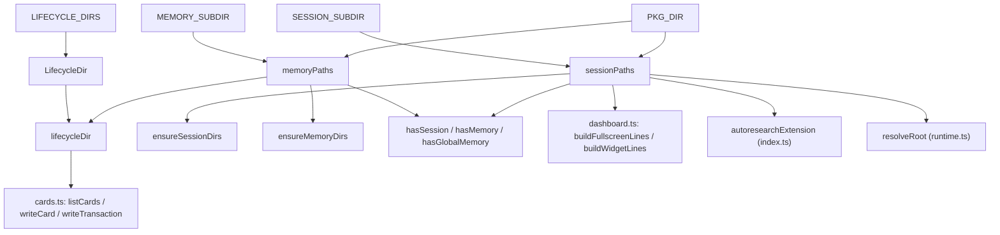

# Workspace layout — one namespaced directory, one shape for two roots

## Overview

`paths.ts` is the single seam through which every other module in the extension touches the filesystem — nothing else in the codebase calls `join(root, ...)` for the package's own files. The key idea is that it defines exactly two path "contracts" ([`sessionPaths`](../catalog/extensions/pi-autoresearch-vkf/paths.ts.md#sessionPaths) for ephemeral per-run state, [`memoryPaths`](../catalog/extensions/pi-autoresearch-vkf/paths.ts.md#memoryPaths) for the durable VKF bundle) and nearly every function in the file is either one of those two builders, a derivative of one ([`lifecycleDir`](../catalog/extensions/pi-autoresearch-vkf/paths.ts.md#lifecycleDir)), an idempotent-creation wrapper around one ([`ensureSessionDirs`](../catalog/extensions/pi-autoresearch-vkf/paths.ts.md#ensureSessionDirs), [`ensureMemoryDirs`](../catalog/extensions/pi-autoresearch-vkf/paths.ts.md#ensureMemoryDirs)), or a boolean probe over one ([`hasSession`](../catalog/extensions/pi-autoresearch-vkf/paths.ts.md#hasSession), [`hasMemory`](../catalog/extensions/pi-autoresearch-vkf/paths.ts.md#hasMemory), [`hasGlobalMemory`](../catalog/extensions/pi-autoresearch-vkf/paths.ts.md#hasGlobalMemory)) — the two exceptions are `pkgDir` (an apparently-unused convenience, see Edge cases) and `globalRoot` (which just picks the root `hasGlobalMemory` passes in). Neither builder ever reads `process.cwd()` internally — both take an explicit `root: string` — which is precisely what lets the same two functions serve both a project's local `.autoresearch-vkf/` and the global cross-project bundle: the global bundle isn't a special case with its own code path, it's `memoryPaths()` called with a different string.

## Diagram

## Design rationale (why it's built this way)

The module's own header docstring is explicit about the collision it's avoiding: everything the package owns lives under one directory "so it never collides with other tools (notably pi-autoresearch's `.auto/`) and is obvious at a glance." That single directory is then split into exactly two subdirectories with different lifetimes — session state "safe to gitignore" versus the memory bundle "meant to be committed" — a distinction [`sessionPaths`](../catalog/extensions/pi-autoresearch-vkf/paths.ts.md#sessionPaths) and [`memoryPaths`](../catalog/extensions/pi-autoresearch-vkf/paths.ts.md#memoryPaths) encode structurally rather than by convention: they are different functions returning different shapes, so a caller can't accidentally ask for a memory-bundle path through the session contract or vice versa.

The `root`-as-parameter design is the load-bearing decision for the whole cross-project-memory feature. [`hasGlobalMemory`](../catalog/extensions/pi-autoresearch-vkf/paths.ts.md#hasGlobalMemory)'s doc says only "True when the global memory bundle has been created," but the implementation resolves that bundle by calling the *same* [`memoryPaths`](../catalog/extensions/pi-autoresearch-vkf/paths.ts.md#memoryPaths) used for every project-local bundle — it just supplies a different root (the home directory, or an override). Every card/session helper elsewhere in the extension therefore already works on global memory unchanged, with no `if (isGlobal)` branch anywhere.

Both `sessionPaths` and `memoryPaths` return `as const` object literals — a fixed, readonly set of named absolute paths rather than a place callers build paths ad hoc. Several of those names carry design intent directly in an inline comment at their definition site rather than in a separate doc: the `updates` path in [`sessionPaths`](../catalog/extensions/pi-autoresearch-vkf/paths.ts.md#sessionPaths) is annotated as the target of an "append-only feed of agent research updates ... so the loop never pauses to narrate," and `stop` is annotated as the "user brake for continuous autonomy: creating this file halts the loop" — the path contract is where these behavioral roles are first declared, before any code reads or writes them.

[`ensureSessionDirs`](../catalog/extensions/pi-autoresearch-vkf/paths.ts.md#ensureSessionDirs) and [`ensureMemoryDirs`](../catalog/extensions/pi-autoresearch-vkf/paths.ts.md#ensureMemoryDirs) are typed to return exactly what [`sessionPaths`](../catalog/extensions/pi-autoresearch-vkf/paths.ts.md#sessionPaths)/[`memoryPaths`](../catalog/extensions/pi-autoresearch-vkf/paths.ts.md#memoryPaths) would return (`ReturnType<typeof sessionPaths>` / `ReturnType<typeof memoryPaths>`) — a caller that needs the directory to exist and a caller that just needs the paths use the same shape, so nothing downstream needs to know or care whether initialization already happened.

## Entry points

- [`sessionPaths`](../catalog/extensions/pi-autoresearch-vkf/paths.ts.md#sessionPaths) — the session contract. Reached whenever any tool or dashboard needs a path under `.autoresearch-vkf/session/`; [`autoresearchExtension`](../catalog/extensions/pi-autoresearch-vkf/index.ts.md#autoresearchExtension)'s `init_research` handler is the first caller in a fresh workspace.
- [`memoryPaths`](../catalog/extensions/pi-autoresearch-vkf/paths.ts.md#memoryPaths) — the durable VKF-bundle contract. Reached by [`cards.ts`](../catalog/extensions/pi-autoresearch-vkf/cards.ts.md) for every card read/write and by [`writeTransaction`](../catalog/extensions/pi-autoresearch-vkf/cards.ts.md#writeTransaction) for the audit log.
- [`lifecycleDir`](../catalog/extensions/pi-autoresearch-vkf/paths.ts.md#lifecycleDir) — resolves one specific trust bucket (staging/verified/deprecated) under a memory root. Called directly by [`listCards`](../catalog/extensions/pi-autoresearch-vkf/cards.ts.md#listCards), [`writeCard`](../catalog/extensions/pi-autoresearch-vkf/cards.ts.md#writeCard), and `transitionCard` (outside this packet's Subgraph, so not citable here) every time a card is listed, written, or moved to a new bucket — `readCardFile` itself takes an already-resolved path/bucket from its caller rather than calling `lifecycleDir`.
- [`ensureSessionDirs`](../catalog/extensions/pi-autoresearch-vkf/paths.ts.md#ensureSessionDirs) / [`ensureMemoryDirs`](../catalog/extensions/pi-autoresearch-vkf/paths.ts.md#ensureMemoryDirs) — idempotent directory creation, reached once at `init_research` time (session) and lazily whenever a card is first written (memory).
- [`hasSession`](../catalog/extensions/pi-autoresearch-vkf/paths.ts.md#hasSession) / [`hasMemory`](../catalog/extensions/pi-autoresearch-vkf/paths.ts.md#hasMemory) / [`hasGlobalMemory`](../catalog/extensions/pi-autoresearch-vkf/paths.ts.md#hasGlobalMemory) — cheap existence probes reached by tool handlers and dashboard code that need to answer "has this workspace been initialized" without paying for the full path object.
- [`resolveRoot`](../catalog/extensions/pi-autoresearch-vkf/runtime.ts.md#resolveRoot) (`runtime.ts`) — reached at the top of nearly every tool call; it reads [`sessionPaths`](../catalog/extensions/pi-autoresearch-vkf/paths.ts.md#sessionPaths)`(ctx.cwd).config` to discover whether the session was configured with a different `workingDir` than the process cwd.

## Mechanism (step-by-step)

1. **Two name constants fix the one owned namespace.** [`PKG_DIR`](../catalog/extensions/pi-autoresearch-vkf/paths.ts.md#PKG_DIR) (`.autoresearch-vkf`) is the single directory the package ever creates inside a root; [`SESSION_SUBDIR`](../catalog/extensions/pi-autoresearch-vkf/paths.ts.md#SESSION_SUBDIR) and [`MEMORY_SUBDIR`](../catalog/extensions/pi-autoresearch-vkf/paths.ts.md#MEMORY_SUBDIR) split it in two. Every other path in the file is built by joining one of these constants onto a caller-supplied `root`, never a hardcoded absolute path.
2. **`sessionPaths(root)` expands the session contract in one shot.** It joins `root/PKG_DIR/SESSION_SUBDIR` once into `dir`, then derives all thirteen session file paths (config, prompt, experiments, log, updates, measure, stop, researchPlan, checks, report, and the three dashboard artifacts) from that single directory — cite [`sessionPaths`](../catalog/extensions/pi-autoresearch-vkf/paths.ts.md#sessionPaths). No caller ever constructs one of these file paths independently.
3. **`memoryPaths(root)` expands the memory contract the same way**, deriving `bundle` (the VKF YAML file), `transactions` (the audit-trail directory), and the three lifecycle subdirectories as siblings under one `dir` — cite [`memoryPaths`](../catalog/extensions/pi-autoresearch-vkf/paths.ts.md#memoryPaths). The three lifecycle names it exposes as plain path fields (`staging`/`verified`/`deprecated`) are exactly the three values of [`LIFECYCLE_DIRS`](../catalog/extensions/pi-autoresearch-vkf/paths.ts.md#LIFECYCLE_DIRS), typed as [`LifecycleDir`](../catalog/extensions/pi-autoresearch-vkf/paths.ts.md#LifecycleDir).
4. **`lifecycleDir(root, bucket)` is the one indirection `cards.ts` uses instead of re-deriving a bucket path.** It calls [`memoryPaths`](../catalog/extensions/pi-autoresearch-vkf/paths.ts.md#memoryPaths)`(root).dir` and joins the requested [`LifecycleDir`](../catalog/extensions/pi-autoresearch-vkf/paths.ts.md#LifecycleDir) bucket onto it — cite [`lifecycleDir`](../catalog/extensions/pi-autoresearch-vkf/paths.ts.md#lifecycleDir). Because the lifecycle-directory type itself (`"staging" | "verified" | "deprecated"`) surfaces downstream in `cards.ts` as the [`bucket`](../catalog/extensions/pi-autoresearch-vkf/cards.ts.md#STATE_MAP.Record.typeLiteral9.bucket) field of `STATE_MAP` and the [`bucket`](../catalog/extensions/pi-autoresearch-vkf/cards.ts.md#Card.bucket) field of every parsed `Card`, a card's trust state and its physical location are two views of the same three-valued type.
5. **`ensureSessionDirs`/`ensureMemoryDirs` make both contracts safe to call unconditionally.** [`ensureSessionDirs`](../catalog/extensions/pi-autoresearch-vkf/paths.ts.md#ensureSessionDirs) checks existence before a single `mkdirSync({ recursive: true })` on the one session directory; [`ensureMemoryDirs`](../catalog/extensions/pi-autoresearch-vkf/paths.ts.md#ensureMemoryDirs) repeats that same existsSync-then-mkdirSync check separately for `dir` and each of the three lifecycle buckets plus `transactions` (up to five `mkdirSync` calls, not one). Both return the identical path object their non-ensuring counterpart would. `init_research`'s idempotency (a re-run is "reported, not overwritten") relies on this: creating the tree is safe to attempt every time.
6. **The three `has*` probes let callers ask "does this already exist" without materializing the full path object's side effects.** [`hasSession`](../catalog/extensions/pi-autoresearch-vkf/paths.ts.md#hasSession) checks the session directory itself; [`hasMemory`](../catalog/extensions/pi-autoresearch-vkf/paths.ts.md#hasMemory) and [`hasGlobalMemory`](../catalog/extensions/pi-autoresearch-vkf/paths.ts.md#hasGlobalMemory) both check for the `bundle` YAML file specifically (not just the directory), so a memory directory that exists but was never actually scaffolded with a bundle still reads as "no memory."
7. **`cards.ts`'s entire read/write lifecycle sits on top of `lifecycleDir`/`memoryPaths` and nothing else.** [`listCards`](../catalog/extensions/pi-autoresearch-vkf/cards.ts.md#listCards) iterates buckets via `lifecycleDir`, [`readCardFile`](../catalog/extensions/pi-autoresearch-vkf/cards.ts.md#readCardFile) opens a specific file inside one, [`writeCard`](../catalog/extensions/pi-autoresearch-vkf/cards.ts.md#writeCard) writes into one, and [`writeTransaction`](../catalog/extensions/pi-autoresearch-vkf/cards.ts.md#writeTransaction) writes into `memoryPaths(root).transactions` — none of them ever construct a memory-bundle path except through these two functions, so `paths.ts` is the one place a layout change to the memory bundle would have to be made.
8. **`dashboard.ts` mirrors the two-layer architecture — its own header docstring says as much ("The two halves mirror the architecture: the *session* ... and the *memory* ...").** The session-only helpers — [`experimentLine`](../catalog/extensions/pi-autoresearch-vkf/dashboard.ts.md#experimentLine), [`loopLine`](../catalog/extensions/pi-autoresearch-vkf/dashboard.ts.md#loopLine), [`runsTable`](../catalog/extensions/pi-autoresearch-vkf/dashboard.ts.md#runsTable), [`readUpdates`](../catalog/extensions/pi-autoresearch-vkf/dashboard.ts.md#readUpdates), and [`coverageLine`](../catalog/extensions/pi-autoresearch-vkf/dashboard.ts.md#coverageLine) — all call `sessionPaths(root)` fresh rather than threading one instance through. But the two top-level exports, [`buildFullscreenLines`](../catalog/extensions/pi-autoresearch-vkf/dashboard.ts.md#buildFullscreenLines) and [`buildWidgetLines`](../catalog/extensions/pi-autoresearch-vkf/dashboard.ts.md#buildWidgetLines), also pull in the memory half via `memoryCounts`/[`listCards`](../catalog/extensions/pi-autoresearch-vkf/cards.ts.md#listCards) (which route through `lifecycleDir`/`memoryPaths`, not `sessionPaths`) — so it is not the case that the module reads exclusively through `sessionPaths`; that is true only of its session-state helpers. The terminal widget is still read-only and stateless with respect to this module either way, so it never needs `ensureSessionDirs`.
9. **`index.ts`'s tool layer and `runtime.ts` close the loop by wiring the contract to the pi host.** [`autoresearchExtension`](../catalog/extensions/pi-autoresearch-vkf/index.ts.md#autoresearchExtension) is where `registerTool` handlers first call `sessionPaths`/`memoryPaths`/`ensureSessionDirs`/`hasSession`/`hasGlobalMemory`; [`buildDashboardPayload`](../catalog/extensions/pi-autoresearch-vkf/index.ts.md#buildDashboardPayload), [`writeProgressDashboard`](../catalog/extensions/pi-autoresearch-vkf/index.ts.md#writeProgressDashboard), [`validationNote`](../catalog/extensions/pi-autoresearch-vkf/index.ts.md#validationNote), [`continuationNote`](../catalog/extensions/pi-autoresearch-vkf/index.ts.md#continuationNote), and [`staleIdSet`](../catalog/extensions/pi-autoresearch-vkf/index.ts.md#staleIdSet) each resolve their own paths the same way rather than receiving them as arguments; and [`resolveRoot`](../catalog/extensions/pi-autoresearch-vkf/runtime.ts.md#resolveRoot) in [`runtime.ts`](../catalog/extensions/pi-autoresearch-vkf/runtime.ts.md) reads `sessionPaths(ctx.cwd).config` to let a session's own `workingDir` override the process cwd for every subsequent path resolution in that call.

## Key data structures

- The object returned by [`sessionPaths`](../catalog/extensions/pi-autoresearch-vkf/paths.ts.md#sessionPaths) — the root `dir` plus thirteen readonly absolute-path fields derived from it (`config`, `prompt`, `experiments`, `log`, `updates`, `measure`, `stop`, `researchPlan`, `checks`, `report`, `progressHtml`, `progressData`, `dashboardHtml`), fourteen fields in all, rooted at one `.autoresearch-vkf/session/` directory. This shape, not a schema file, *is* the session contract every other module codes against.
- The object returned by [`memoryPaths`](../catalog/extensions/pi-autoresearch-vkf/paths.ts.md#memoryPaths) — `dir`, `bundle`, `staging`, `verified`, `deprecated`, `transactions`, rooted at `.autoresearch-vkf/memory/`.
- [`LifecycleDir`](../catalog/extensions/pi-autoresearch-vkf/paths.ts.md#LifecycleDir) / [`LIFECYCLE_DIRS`](../catalog/extensions/pi-autoresearch-vkf/paths.ts.md#LIFECYCLE_DIRS) — the three-valued (`"staging" | "verified" | "deprecated"`) type and its backing array that [`lifecycleDir`](../catalog/extensions/pi-autoresearch-vkf/paths.ts.md#lifecycleDir) indexes into; the same type reappears in `cards.ts` as the `bucket` field on both `STATE_MAP` entries and parsed `Card`s ([`bucket`](../catalog/extensions/pi-autoresearch-vkf/cards.ts.md#Card.bucket), [`bucket`](../catalog/extensions/pi-autoresearch-vkf/cards.ts.md#listCards.filter-typeLiteral135.bucket)).

## Dynamics (design intent)

[`ensureSessionDirs`](../catalog/extensions/pi-autoresearch-vkf/paths.ts.md#ensureSessionDirs) and [`ensureMemoryDirs`](../catalog/extensions/pi-autoresearch-vkf/paths.ts.md#ensureMemoryDirs) are both built from the same synchronous check-then-create primitive — an `existsSync` gate around a `mkdirSync({ recursive: true })` call — but `ensureSessionDirs` applies it once (its one session directory) while `ensureMemoryDirs` applies it in a loop, once per sibling directory (`dir`, `staging`, `verified`, `deprecated`, `transactions`). Their docstrings promise only idempotence ("Create the ... tree if absent. Idempotent"), not safety under concurrent callers, and nothing in the file introduces a lock file or other coordination primitive.

> [!inferred] Node's `mkdirSync` with `recursive: true` does not throw on an already-existing directory, so two processes racing to call `ensureSessionDirs` for the same root should both succeed rather than one crashing — but that guarantee comes from Node's `fs` module semantics, not from anything asserted in this file, and this reasoning is not backed by a test in this repo (no test file exercises this module). Nothing here defends against a narrower race, such as one process reading `sessionPaths(root).config` while another process is mid-way through creating the directory tree.

## Edge cases

- **`lifecycleDir`'s `bucket` parameter is only checked at compile time.** [`lifecycleDir`](../catalog/extensions/pi-autoresearch-vkf/paths.ts.md#lifecycleDir) trusts its [`LifecycleDir`](../catalog/extensions/pi-autoresearch-vkf/paths.ts.md#LifecycleDir)-typed argument and does no runtime validation against [`LIFECYCLE_DIRS`](../catalog/extensions/pi-autoresearch-vkf/paths.ts.md#LIFECYCLE_DIRS); a bucket string that reaches this function after round-tripping through parsed JSON or frontmatter (bypassing TypeScript's check) would silently resolve to a plausible-looking directory that isn't one of the three real lifecycle buckets.
- **The `stop`/`researchPlan`/`report` fields `sessionPaths` returns are just path values — the module never creates, checks, or watches them.** [`sessionPaths`](../catalog/extensions/pi-autoresearch-vkf/paths.ts.md#sessionPaths)'s own inline comment marks `stop` as the file whose mere existence halts the loop, but reading or creating it is entirely the caller's responsibility elsewhere; `paths.ts` on its own gives no signal about which of these files currently exist for a given root.
- **`hasMemory`/`hasGlobalMemory` check for the `bundle` file specifically, not the memory directory.** A `.autoresearch-vkf/memory/` directory that exists (e.g., because `ensureMemoryDirs` ran) but has no `vkf.bundle.yaml` yet still reads as "no memory" to both probes.

> [!inferred] The file also exports a `pkgDir(root)` helper (`join(root, PKG_DIR)`) that neither `sessionPaths` nor `memoryPaths` calls internally — each inlines its own `join(root, PKG_DIR, SUBDIR)` instead — and a repository-wide search finds no other call site for it either. It reads as dead code or an unused convenience left over from an earlier version of the two builders; this symbol is not in this packet's Subgraph, so it can't be cited or explored further here.

## Open questions

- `globalRoot()` — the function [`hasGlobalMemory`](../catalog/extensions/pi-autoresearch-vkf/paths.ts.md#hasGlobalMemory) calls to pick the home-directory-or-override root — is not itself in this packet's Subgraph, so the exact mechanism that later *writes* into that global bundle (presumably a `promote_to_global` tool, per the project's own `CLAUDE.md`) can't be grounded from this page; only the read-side check is groundable here.
- Whether `pkgDir` (see Edge cases) is genuinely unused dead code or is meant to replace the duplicated `join(root, PKG_DIR, ...)` logic inside `sessionPaths`/`memoryPaths` isn't settled anywhere in the source this packet exposes.

## See also

- [extensions-pi-autoresearch-vkf-cards.ts.md](extensions-pi-autoresearch-vkf-cards.ts.md) — the card lifecycle built entirely on top of `lifecycleDir`/`memoryPaths`.
- [extensions-pi-autoresearch-vkf-dashboard.ts.md](extensions-pi-autoresearch-vkf-dashboard.ts.md) — the terminal widget/fullscreen views; their session-state helpers read exclusively through `sessionPaths`, while the two top-level exports also read the memory bundle via `memoryCounts`/`listCards`.
- [extensions-pi-autoresearch-vkf-index.ts.md](extensions-pi-autoresearch-vkf-index.ts.md) — `autoresearchExtension`'s tool handlers, the first callers of both path contracts in a fresh workspace.
