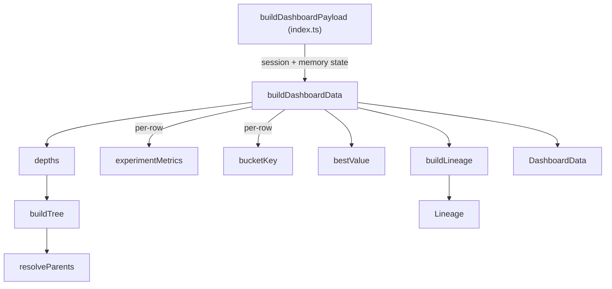

# Dashboard payload assembly

## Overview
`progress_data.ts` is the single place where everything the research loop has
learned — its tree-search position, its VKF claim memory, its per-run metrics —
gets flattened into one plain-data JSON document for the browser dashboard. It
exposes exactly one public function, [`buildDashboardData`](../catalog/extensions/pi-autoresearch-vkf/progress_data.ts.md#buildDashboardData),
which takes the loop's current session + memory state and returns a
[`DashboardData`](../catalog/extensions/pi-autoresearch-vkf/progress_data.ts.md#DashboardData) record; two private helpers,
[`bestValue`](../catalog/extensions/pi-autoresearch-vkf/progress_data.ts.md#bestValue) and
[`buildLineage`](../catalog/extensions/pi-autoresearch-vkf/progress_data.ts.md#buildLineage), do the two pieces of real
computation. This module does not itself run any search, scoring, or memory
logic — it *reads the outputs* of the tree search ([`depths`](../catalog/extensions/pi-autoresearch-vkf/tree.ts.md#depths)),
the scoring layer ([`bucketKey`](../catalog/extensions/pi-autoresearch-vkf/scoring.ts.md#bucketKey)), and the
per-run metrics helper ([`experimentMetrics`](../catalog/extensions/pi-autoresearch-vkf/experiments.ts.md#experimentMetrics))
and re-projects them into shapes a vanilla-JS dashboard client can render without any further computation.

## Diagram

## Design rationale (why it's built this way)
The module's own header comment states the split directly: "Splitting *data*
(this module) from *rendering* is what makes the page live and interactive: the
HTML shell is written once, and this payload is re-emitted as a `data.json`
sidecar on every state change... so filters/scroll/selection survive a refresh
(unlike the old whole-page `<meta refresh>`)." Keeping [`buildDashboardData`](../catalog/extensions/pi-autoresearch-vkf/progress_data.ts.md#buildDashboardData)
a "Pure module (data in, data out)" is what lets it be exercised directly with
plain object literals in tests, with no extension host — the same testability
pattern used elsewhere in this repo (e.g. `experiments.ts`'s `summarize`).

The most deliberate decision in this file is [`buildLineage`](../catalog/extensions/pi-autoresearch-vkf/progress_data.ts.md#buildLineage)'s
independence from the `vkf` CLI. Its own doc comment: "Build the idea-lineage
graph (paper → claim → experiment, plus the experiment search tree) from local
state alone — no `vkf` CLI." The [`Lineage`](../catalog/extensions/pi-autoresearch-vkf/progress_data.ts.md#Lineage)
type's docstring explains *why* this matters: "Because it rides in every
payload it survives live `data.json` refreshes, unlike the heavier `vkf graph`
output (which only the explicit export path attaches)." In other words, there
are two lineage views by design — a cheap, always-present one built here from
whatever [`claims`](../catalog/extensions/pi-autoresearch-vkf/progress_data.ts.md#BuildDashboardInput.claims)/experiments
are already in memory, and a richer, typed one (with conflict edges) computed
only when a caller explicitly asks for an export. This file only owns the
former — it is the fallback that guarantees the Knowledge tab never renders
empty just because the optional CLI isn't installed.

[`buildLineage`](../catalog/extensions/pi-autoresearch-vkf/progress_data.ts.md#buildLineage) also stitches in claims
the experiment log references but that never made it into the surfaced claim
list — see Mechanism step 6. That's a defensive choice: [`claim_id`](../catalog/extensions/pi-autoresearch-vkf/progress_data.ts.md#DashboardExperiment.claim_id)
values come from a different subsystem (the VKF memory bundle) than the
`claims`/`lineageClaims` arrays passed in, so the two can drift (a claim
demoted out of the "top 16 verified" slice a caller chose to surface, for
instance) without the graph silently dropping an edge.

## Entry points
- [`buildDashboardPayload`](../catalog/extensions/pi-autoresearch-vkf/index.ts.md#buildDashboardPayload) — the only
  production caller. It reads config, VKF claim/paper cards, and the experiment
  log, reshapes them into the input shape [`buildDashboardData`](../catalog/extensions/pi-autoresearch-vkf/progress_data.ts.md#buildDashboardData)
  expects, and calls [`buildDashboardData`](../catalog/extensions/pi-autoresearch-vkf/progress_data.ts.md#buildDashboardData)
  — reached every time `index.ts` (re)writes the dashboard's `data.json` sidecar.
- [`buildDashboardData`](../catalog/extensions/pi-autoresearch-vkf/progress_data.ts.md#buildDashboardData) — the module's
  sole exported symbol and the only way in; `tests/progress_data.test.mjs`
  (see Dynamics) calls it directly with hand-built experiment/claim arrays,
  bypassing the extension host entirely.

## Mechanism (step-by-step)
1. [`buildDashboardData`](../catalog/extensions/pi-autoresearch-vkf/progress_data.ts.md#buildDashboardData) first calls
   [`depths`](../catalog/extensions/pi-autoresearch-vkf/tree.ts.md#depths) once over the whole raw
   [`experiments`](../catalog/extensions/pi-autoresearch-vkf/progress_data.ts.md#BuildDashboardInput.experiments) array,
   producing an id→depth map up front so every row's tree position can be
   attached in a single later pass instead of walking the tree per row.
2. It then maps over the raw experiments once, and for each one calls
   [`experimentMetrics`](../catalog/extensions/pi-autoresearch-vkf/experiments.ts.md#experimentMetrics) to get that run's
   metric series (falling back to the primary metric for older rows with no
   `metrics` map), appending any newly-seen metric name to a running list so
   the primary [`metricName`](../catalog/extensions/pi-autoresearch-vkf/progress_data.ts.md#BuildDashboardInput.metricName)
   always ends up first — that ordering is what lets the client default its
   chart legend to the metric the loop actually optimizes.
3. In the same pass, whenever a row carries a [`lever`](../catalog/extensions/pi-autoresearch-vkf/experiments.ts.md#Experiment.lever)
   or [`altitude`](../catalog/extensions/pi-autoresearch-vkf/experiments.ts.md#Experiment.altitude), it computes
   [`bucketKey`](../catalog/extensions/pi-autoresearch-vkf/scoring.ts.md#bucketKey)`(lever, altitude)` and increments a
   `counts` map keyed by that string — the running tally that becomes the
   coverage grid's cell counts.
4. Each raw [`Experiment`](../catalog/extensions/pi-autoresearch-vkf/experiments.ts.md#Experiment) is reshaped into a
   [`DashboardExperiment`](../catalog/extensions/pi-autoresearch-vkf/progress_data.ts.md#DashboardExperiment) record: the
   depth just computed, the [`outcome`](../catalog/extensions/pi-autoresearch-vkf/experiments.ts.md#Experiment.outcome),
   [`kept`](../catalog/extensions/pi-autoresearch-vkf/experiments.ts.md#Experiment.kept) flag,
   [`claim_id`](../catalog/extensions/pi-autoresearch-vkf/progress_data.ts.md#DashboardExperiment.claim_id) and
   [`parent_id`](../catalog/extensions/pi-autoresearch-vkf/progress_data.ts.md#DashboardExperiment.parent_id) (the tree-search
   fields), and provenance like [`commit`](../catalog/extensions/pi-autoresearch-vkf/experiments.ts.md#Experiment.commit) are
   all carried straight through unchanged — this step is a pure re-projection,
   not a transformation of meaning.
5. Independently of the per-row map, [`bestValue`](../catalog/extensions/pi-autoresearch-vkf/progress_data.ts.md#bestValue)
   scans the *raw* experiment list for the best measured
   [`value`](../catalog/extensions/pi-autoresearch-vkf/experiments.ts.md#Experiment.value), taking `Math.max` or `Math.min`
   depending on [`direction`](../catalog/extensions/pi-autoresearch-vkf/progress_data.ts.md#BuildDashboardInput.direction)
   — it is computed once for the whole payload (the headline "best" figure),
   separately from any per-row enrichment.
6. [`buildLineage`](../catalog/extensions/pi-autoresearch-vkf/progress_data.ts.md#buildLineage) builds the
   [`Lineage`](../catalog/extensions/pi-autoresearch-vkf/progress_data.ts.md#Lineage) graph from three inputs — source
   papers, claims, and the *already-enriched* `DashboardExperiment[]` from step
   4 — using a `Map` keyed by id so a claim referenced by a
   [`claim_id`](../catalog/extensions/pi-autoresearch-vkf/progress_data.ts.md#DashboardExperiment.claim_id) but missing from
   the surfaced claim list gets synthesized as a stub node rather than leaving
   a dangling edge; edges are typed [`source`](../catalog/extensions/pi-autoresearch-vkf/progress_data.ts.md#LineageEdge.source)/[`target`](../catalog/extensions/pi-autoresearch-vkf/progress_data.ts.md#LineageEdge.target)
   pairs tagged with [`kind`](../catalog/extensions/pi-autoresearch-vkf/progress_data.ts.md#LineageEdge.kind) (`evidenced`
   for claim→paper, `tested` for experiment→claim, `parent` for
   experiment→experiment via [`parent_id`](../catalog/extensions/pi-autoresearch-vkf/experiments.ts.md#Experiment.parent_id)).
7. Finally the function assembles the [`DashboardData`](../catalog/extensions/pi-autoresearch-vkf/progress_data.ts.md#DashboardData)
   record: [`coverage`](../catalog/extensions/pi-autoresearch-vkf/progress_data.ts.md#DashboardData.coverage) pairs the
   `counts` map from step 3 with the full [`LEVERS`](../catalog/extensions/pi-autoresearch-vkf/cards.ts.md#LEVERS)/[`ALTITUDES`](../catalog/extensions/pi-autoresearch-vkf/cards.ts.md#ALTITUDES)
   axis lists (so the grid always shows every lever/altitude, not just the ones
   hit so far); [`lineage`](../catalog/extensions/pi-autoresearch-vkf/progress_data.ts.md#DashboardData.lineage) is the
   step-6 result; [`contradictions`](../catalog/extensions/pi-autoresearch-vkf/progress_data.ts.md#DashboardData.contradictions)
   and [`updates`](../catalog/extensions/pi-autoresearch-vkf/progress_data.ts.md#DashboardData.updates) pass through
   whatever the caller already ranked/limited; and
   [`refreshSeconds`](../catalog/extensions/pi-autoresearch-vkf/progress_data.ts.md#DashboardData.refreshSeconds) defaults to
   `5` when the input doesn't specify one.

## Key data structures
- [`DashboardData`](../catalog/extensions/pi-autoresearch-vkf/progress_data.ts.md#DashboardData) — the whole payload the
  client fetches: [`name`](../catalog/extensions/pi-autoresearch-vkf/progress_data.ts.md#DashboardData.name)/[`goal`](../catalog/extensions/pi-autoresearch-vkf/progress_data.ts.md#DashboardData.goal),
  metric config, the enriched [`experiments`](../catalog/extensions/pi-autoresearch-vkf/progress_data.ts.md#DashboardData.experiments)
  array, memory-lifecycle counts, [`claims`](../catalog/extensions/pi-autoresearch-vkf/progress_data.ts.md#BuildDashboardInput.claims)
  with belief, the coverage grid, and the [`lineage`](../catalog/extensions/pi-autoresearch-vkf/progress_data.ts.md#DashboardData.lineage) graph.
- [`DashboardExperiment`](../catalog/extensions/pi-autoresearch-vkf/progress_data.ts.md#DashboardExperiment) — one
  dashboard-ready run: the same identity/outcome fields as
  [`Experiment`](../catalog/extensions/pi-autoresearch-vkf/experiments.ts.md#Experiment) plus a computed, always-present
  `depth` and per-metric map, so the client never has to re-derive tree position
  itself.
- [`Lineage`](../catalog/extensions/pi-autoresearch-vkf/progress_data.ts.md#Lineage) — a flat `{`[`nodes`](../catalog/extensions/pi-autoresearch-vkf/progress_data.ts.md#Lineage.nodes)`, edges}`
  graph spanning three node kinds ([`type`](../catalog/extensions/pi-autoresearch-vkf/progress_data.ts.md#LineageNode.type):
  `"paper" | "claim" | "experiment"`) and three edge kinds
  ([`kind`](../catalog/extensions/pi-autoresearch-vkf/progress_data.ts.md#LineageEdge.kind): `evidenced`/`tested`/`parent`) —
  deliberately CLI-free, per Design rationale above.
- The coverage grid (built in Mechanism step 3/7) — a `counts` map keyed by
  [`bucketKey`](../catalog/extensions/pi-autoresearch-vkf/scoring.ts.md#bucketKey)`(`[`lever`](../catalog/extensions/pi-autoresearch-vkf/experiments.ts.md#Experiment.lever)`,`[`altitude`](../catalog/extensions/pi-autoresearch-vkf/experiments.ts.md#Experiment.altitude)`)`,
  paired with the fixed [`LEVERS`](../catalog/extensions/pi-autoresearch-vkf/cards.ts.md#LEVERS)/[`ALTITUDES`](../catalog/extensions/pi-autoresearch-vkf/cards.ts.md#ALTITUDES)
  axes so the grid's shape is stable even before every cell has data.

## Dynamics (design intent)
`tests/progress_data.test.mjs` exercises every branch of this file directly, as
plain object literals with no extension host: it confirms
[`bestValue`](../catalog/extensions/pi-autoresearch-vkf/progress_data.ts.md#bestValue) flips between `Math.max` and
`Math.min` under `"higher"` vs `"lower"` [`direction`](../catalog/extensions/pi-autoresearch-vkf/progress_data.ts.md#BuildDashboardInput.direction);
that metric-name collection puts the primary metric first even when later rows
introduce new metric keys; that the coverage grid tallies
[`lever`](../catalog/extensions/pi-autoresearch-vkf/experiments.ts.md#Experiment.lever)/[`altitude`](../catalog/extensions/pi-autoresearch-vkf/experiments.ts.md#Experiment.altitude)
pairs correctly; and — most load-bearing for
[`buildLineage`](../catalog/extensions/pi-autoresearch-vkf/progress_data.ts.md#buildLineage) — that a paper/claim/experiment
triple produces exactly the `evidenced`/`tested`/`parent` edges expected, and
that an experiment whose [`claim_id`](../catalog/extensions/pi-autoresearch-vkf/progress_data.ts.md#DashboardExperiment.claim_id)
points at no known claim still yields a stub claim node and a `tested` edge
rather than a dropped reference (the "adds a stub claim node" test). A separate
test confirms depth flows end-to-end from [`depths`](../catalog/extensions/pi-autoresearch-vkf/tree.ts.md#depths)
onto each [`DashboardExperiment`](../catalog/extensions/pi-autoresearch-vkf/progress_data.ts.md#DashboardExperiment) row
(root at `0`, a `parent_id`-linked child at `1`).

> [!inferred] This packet's auto-generated Evidence section reports "no tests in
> the configured test paths reference this subgraph," but `tests/progress_data.test.mjs`
> directly imports and calls [`buildDashboardData`](../catalog/extensions/pi-autoresearch-vkf/progress_data.ts.md#buildDashboardData)
> in every one of its nine test cases — the same discrepancy noted on the
> `experiments.ts` concept page, suggesting the packet builder's test-path
> configuration isn't picking up this file.

## Edge cases
- No experiments have a measured [`value`](../catalog/extensions/pi-autoresearch-vkf/experiments.ts.md#Experiment.value):
  [`bestValue`](../catalog/extensions/pi-autoresearch-vkf/progress_data.ts.md#bestValue) returns `undefined` rather than `0`,
  so "no data yet" stays distinguishable from "best value is zero."
- No `papers`/`lineageClaims` supplied to [`buildDashboardData`](../catalog/extensions/pi-autoresearch-vkf/progress_data.ts.md#buildDashboardData):
  [`buildLineage`](../catalog/extensions/pi-autoresearch-vkf/progress_data.ts.md#buildLineage) is called with `[]` for papers
  and falls back to the surfaced [`claims`](../catalog/extensions/pi-autoresearch-vkf/progress_data.ts.md#BuildDashboardInput.claims)
  list for claim nodes, so the lineage graph degrades to claim/experiment nodes
  only rather than failing.
- No [`contradictions`](../catalog/extensions/pi-autoresearch-vkf/progress_data.ts.md#BuildDashboardInput.contradictions) or
  [`updates`](../catalog/extensions/pi-autoresearch-vkf/progress_data.ts.md#BuildDashboardInput.updates) supplied: both are
  passed through as `undefined` rather than defaulted to `[]`, so the client can
  tell "no tensions computed yet" apart from "computed and empty."
- A [`claim_id`](../catalog/extensions/pi-autoresearch-vkf/progress_data.ts.md#DashboardExperiment.claim_id) that names no
  known claim: [`buildLineage`](../catalog/extensions/pi-autoresearch-vkf/progress_data.ts.md#buildLineage) still creates a
  claim node (titled with the raw id) so the `tested` edge always resolves to a
  real node on both ends.
- `refreshSeconds` omitted from the input: defaults to `5` rather than `0`
  (which would disable polling), so a caller has to opt out of live refresh
  explicitly rather than by omission.

## Open questions
> [!inferred] The typed, richer lineage graph the `Lineage` docstring contrasts
> against (`vkf graph`, attached via `graph` on `DashboardData`/`BuildDashboardInput`
> and populated only by the explicit export path per this repo's `CLAUDE.md`) is
> outside this packet's cited Subgraph — its assembly lives in `index.ts`'s
> export flow and `vkf.ts`, not in this file, so this page cannot trace it further.
> [!inferred] The client-side consumer of this payload (the dashboard's browser
> renderer, per this repo's `CLAUDE.md`) is not part of this packet's Subgraph, so
> how the `coverage` grid or `lineage` graph are actually drawn (colors, layout)
> can't be verified from this page alone.

## See also
- [extensions-pi-autoresearch-vkf-experiments.ts.md](extensions-pi-autoresearch-vkf-experiments.ts.md) — the `Experiment` ledger and `experimentMetrics` this module reshapes into `DashboardExperiment` rows.
- [extensions-pi-autoresearch-vkf-tree.ts.md](extensions-pi-autoresearch-vkf-tree.ts.md) — the search tree (`buildTree`/`depths`) whose depth this module attaches to every row and lineage node.
- [extensions-pi-autoresearch-vkf-scoring.ts.md](extensions-pi-autoresearch-vkf-scoring.ts.md) — `bucketKey`, the lever×altitude key the coverage grid tallies against.
- [extensions-pi-autoresearch-vkf-cards.ts.md](extensions-pi-autoresearch-vkf-cards.ts.md) — `LEVERS`/`ALTITUDES`, the fixed axes this module's coverage grid is built on.
- [extensions-pi-autoresearch-vkf-index.ts.md](extensions-pi-autoresearch-vkf-index.ts.md) — `buildDashboardPayload`, the only production caller of `buildDashboardData`.
