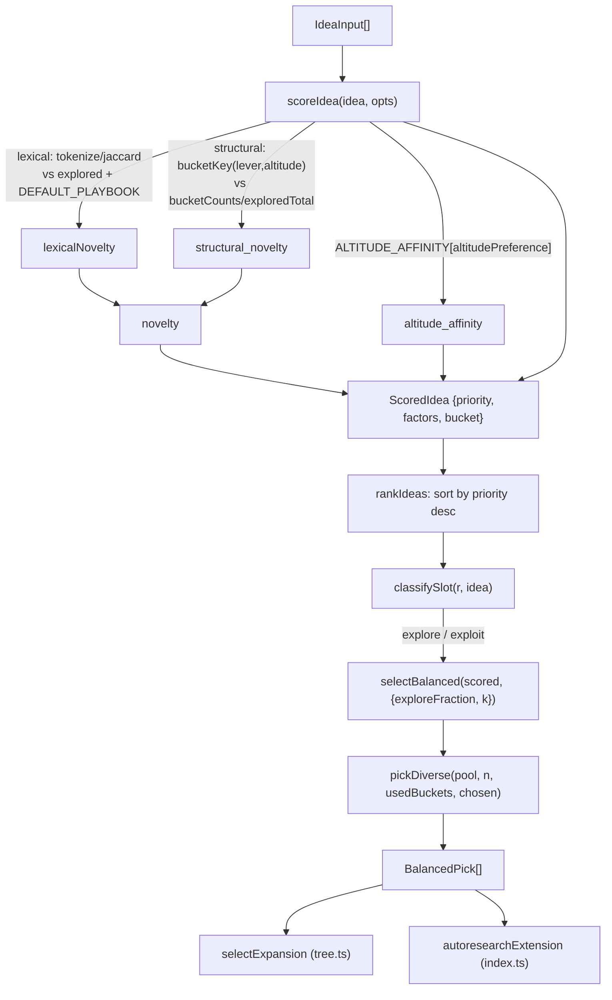

# Idea scoring & explore/exploit balancing (`scoring.ts`)

<!-- connect:up:begin -->
> **Cross-repo concept:** part of [closed-loop-experiment-design](../../../concepts/closed-loop-experiment-design.md) across this wiki's repos.
<!-- connect:up:end -->
Turns a pool of candidate ideas into a transparent priority ranking, then reserves part of the pick list for high-altitude, under-explored bets so the loop doesn't just grind on the safest tweak forever.

## Overview

This module is the decision layer between "here are some ideas" and "do this one next." Its own header comment states the goal directly: the loop "should not just retrieve nearby literature and try it. It should rank candidate ideas by a transparent priority," expressed as a product of independent [0,1]-ish factors divided by cost, so — per that same comment — "a ranking is never a black box." [`scoreIdea`](../catalog/extensions/pi-autoresearch-vkf/scoring.ts.md#scoreIdea) computes that priority for one [`IdeaInput`](../catalog/extensions/pi-autoresearch-vkf/scoring.ts.md#IdeaInput); [`rankIdeas`](../catalog/extensions/pi-autoresearch-vkf/scoring.ts.md#rankIdeas) scores and sorts a whole pool. But raw priority order alone would let a handful of safe, incremental, already-well-evidenced tweaks dominate every pick — so [`selectBalanced`](../catalog/extensions/pi-autoresearch-vkf/scoring.ts.md#selectBalanced) sits on top and reserves a fraction of the slots for [`classifySlot`](../catalog/extensions/pi-autoresearch-vkf/scoring.ts.md#classifySlot)'s "explore" bucket regardless of raw score, then uses [`pickDiverse`](../catalog/extensions/pi-autoresearch-vkf/scoring.ts.md#pickDiverse) to avoid filling those slots with near-duplicates. The whole module is a pure, dependency-free function library (no `fs`, no pi runtime), which is what makes it independently unit-testable and reusable from the real loop ([`autoresearchExtension`](../catalog/extensions/pi-autoresearch-vkf/index.ts.md#autoresearchExtension)) and from the offline benchmark ([`runOurs`](../catalog/benchmark/harness.ts.md#runOurs)) alike.

## Diagram

## Design rationale (why it's built this way)

The priority formula deliberately keeps every factor in a bounded range and combines them multiplicatively rather than as a weighted sum, so a single very weak factor (e.g. near-zero [`evidence_strength`](../catalog/extensions/pi-autoresearch-vkf/scoring.ts.md#ScoreFactors.evidence_strength) or [`feasibility`](../catalog/extensions/pi-autoresearch-vkf/scoring.ts.md#ScoreFactors.feasibility)) can veto an otherwise-attractive idea instead of being averaged away — this is implicit in [`scoreIdea`](../catalog/extensions/pi-autoresearch-vkf/scoring.ts.md#scoreIdea)'s product-of-factors construction and the returned [`factors`](../catalog/extensions/pi-autoresearch-vkf/scoring.ts.md#ScoredIdea.factors) breakdown, which exists specifically so a caller can see *why* an idea ranked low rather than trusting one opaque number.

The novelty term is split into two independent multipliers on purpose. The source comment on [`structural_novelty`](../catalog/extensions/pi-autoresearch-vkf/scoring.ts.md#ScoreFactors.structural_novelty) spells out the failure mode it exists to catch: "A 12th tweak to an already-saturated bucket is *lexically* fresh but structurally stale — this is what actually pushes the loop off tuning." Lexical novelty (Jaccard distance from [`tokenize`](../catalog/extensions/pi-autoresearch-vkf/scoring.ts.md#tokenize)d text via [`jaccard`](../catalog/extensions/pi-autoresearch-vkf/scoring.ts.md#jaccard)/[`maxSimilarity`](../catalog/extensions/pi-autoresearch-vkf/scoring.ts.md#maxSimilarity)) only detects re-wordings of the same idea; it cannot detect "yet another hyperparameter idea" once the wording changes. Structural novelty closes that gap by scoring how saturated the idea's `lever|altitude` [`bucket`](../catalog/extensions/pi-autoresearch-vkf/scoring.ts.md#ScoredIdea.bucket) already is, independent of wording.

[`ALTITUDE_AFFINITY`](../catalog/extensions/pi-autoresearch-vkf/scoring.ts.md#ALTITUDE_AFFINITY)'s doc comment explains the asymmetry across [`AltitudePreference`](../catalog/extensions/pi-autoresearch-vkf/config.ts.md#AltitudePreference) modes directly: "`high` (the default for non-tuning goals) penalizes hyperparameter-altitude ideas hard: knob tweaks are off the loop's menu unless the user explicitly asks for tuning (which switches the mode and restores them to parity)." This is a goal-gated bias, not a fixed preference — the same [`altitude`](../catalog/extensions/pi-autoresearch-vkf/scoring.ts.md#IdeaInput.altitude) value scores very differently depending on what the session is trying to do.

[`classifySlot`](../catalog/extensions/pi-autoresearch-vkf/scoring.ts.md#classifySlot)'s doc comment gives the reasoning for *not* reusing [`info_gain`](../catalog/extensions/pi-autoresearch-vkf/scoring.ts.md#ScoreFactors.info_gain) (which already peaks at uncertain belief) as an explore signal: "Outcome uncertainty already feeds `info_gain` in the priority; using it here too would mark almost every mid-belief idea 'explore' and wash out the distinction." So explore/exploit is classified on altitude and structural novelty alone, keeping it a distinct axis from priority rather than double-counting one signal.

[`selectBalanced`](../catalog/extensions/pi-autoresearch-vkf/scoring.ts.md#selectBalanced)'s doc comment frames the reserved-slot mechanism as the fix for a specific failure mode: "this is the mechanism that stops reliable small tweaks from crowding out high-variance conceptual bets." Within each slot type it further prefers distinct buckets "so the batch isn't k near-duplicates" — [`pickDiverse`](../catalog/extensions/pi-autoresearch-vkf/scoring.ts.md#pickDiverse)'s doc says the same thing from the callee side: "preferring unseen buckets, then filling the rest."

> [!inferred] The `freshness` factor (visible in source as `idea.stale ? 0.5 : 1`, halving rather than zeroing priority) is not in this packet's Subgraph and so cannot be cited by symbol, but reading the source directly shows the design choice explicitly commented: stale knowledge is down-weighted, not discarded, "it may still be worth re-verifying." This keeps a stale claim eligible for re-verification experiments instead of vanishing from consideration entirely.

## Entry points

- [`scoreIdea`](../catalog/extensions/pi-autoresearch-vkf/scoring.ts.md#scoreIdea) — scores one [`IdeaInput`](../catalog/extensions/pi-autoresearch-vkf/scoring.ts.md#IdeaInput) into a [`ScoredIdea`](../catalog/extensions/pi-autoresearch-vkf/scoring.ts.md#ScoredIdea). Reached per-idea from [`rankIdeas`](../catalog/extensions/pi-autoresearch-vkf/scoring.ts.md#rankIdeas), and directly from the benchmark's [`runOurs`](../catalog/benchmark/harness.ts.md#runOurs) via `rankIdeas` at every simulated step.
- [`rankIdeas`](../catalog/extensions/pi-autoresearch-vkf/scoring.ts.md#rankIdeas) — the batch entry point: scores and sorts a whole idea pool, highest priority first. This is what the real loop's tool surface ([`autoresearchExtension`](../catalog/extensions/pi-autoresearch-vkf/index.ts.md#autoresearchExtension) in [`index.ts`](../catalog/extensions/pi-autoresearch-vkf/index.ts.md)) calls before doing anything else with a candidate pool.
- [`selectBalanced`](../catalog/extensions/pi-autoresearch-vkf/scoring.ts.md#selectBalanced) — takes already-scored ideas and picks the next `k`, reserving explore slots. Reached both directly from `autoresearchExtension`'s scoring tool and indirectly through [`selectExpansion`](../catalog/extensions/pi-autoresearch-vkf/tree.ts.md#selectExpansion) in [`tree.ts`](../catalog/extensions/pi-autoresearch-vkf/tree.ts.md), which wraps it to also pick *which tree node* to expand.
- [`classifySlot`](../catalog/extensions/pi-autoresearch-vkf/scoring.ts.md#classifySlot) — called once per candidate inside `selectBalanced` to label it `"explore"` or `"exploit"` before the reserved-slot split happens.

## Mechanism (step-by-step)

1. **Inputs are clamped, not trusted.** [`scoreIdea`](../catalog/extensions/pi-autoresearch-vkf/scoring.ts.md#scoreIdea) reads [`belief`](../catalog/extensions/pi-autoresearch-vkf/scoring.ts.md#IdeaInput.belief) (default `0.5`), [`expected_value`](../catalog/extensions/pi-autoresearch-vkf/scoring.ts.md#IdeaInput.expected_value) (default: falls back to `belief`), and [`feasibility`](../catalog/extensions/pi-autoresearch-vkf/scoring.ts.md#IdeaInput.feasibility) (default `0.6`) off the input idea and passes each through [`clamp`](../catalog/extensions/pi-autoresearch-vkf/scoring.ts.md#clamp) to `[0,1]` — so a caller supplying an out-of-range override can't silently blow up the product downstream.
2. **Evidence strength comes from the VKF trust lifecycle, not a free-form score.** [`verification_level`](../catalog/extensions/pi-autoresearch-vkf/scoring.ts.md#IdeaInput.verification_level) (a [`Verification`](../catalog/extensions/pi-autoresearch-vkf/cards.ts.md#Verification) value) indexes into [`EVIDENCE_STRENGTH`](../catalog/extensions/pi-autoresearch-vkf/scoring.ts.md#EVIDENCE_STRENGTH); if the idea also carries a [`reliability_score`](../catalog/extensions/pi-autoresearch-vkf/scoring.ts.md#IdeaInput.reliability_score), the two are averaged into the final [`evidence_strength`](../catalog/extensions/pi-autoresearch-vkf/scoring.ts.md#ScoreFactors.evidence_strength). This ties priority directly to the card trust states the rest of the extension maintains rather than to an independent quality judgment.
3. **Lexical novelty measures distance from what's already been tried or is "standard practice."** [`maxSimilarity`](../catalog/extensions/pi-autoresearch-vkf/scoring.ts.md#maxSimilarity) tokenizes the idea's [`text`](../catalog/extensions/pi-autoresearch-vkf/scoring.ts.md#IdeaInput.text) and every string in both the `explored` corpus and [`DEFAULT_PLAYBOOK`](../catalog/extensions/pi-autoresearch-vkf/scoring.ts.md#DEFAULT_PLAYBOOK), takes the largest [`jaccard`](../catalog/extensions/pi-autoresearch-vkf/scoring.ts.md#jaccard) overlap, and the resulting `max_similarity` is inverted and lifted by [`recency_score`](../catalog/extensions/pi-autoresearch-vkf/scoring.ts.md#IdeaInput.recency_score) — recent *and* dissimilar scores highest.
4. **Structural novelty measures saturation of the idea's coverage bucket, independent of wording.** [`bucketKey`](../catalog/extensions/pi-autoresearch-vkf/scoring.ts.md#bucketKey) combines [`lever`](../catalog/extensions/pi-autoresearch-vkf/scoring.ts.md#IdeaInput.lever) and [`altitude`](../catalog/extensions/pi-autoresearch-vkf/scoring.ts.md#IdeaInput.altitude) into one string key; the caller-supplied `bucketCounts`/`exploredTotal` (in [`ScoreOptions`](../catalog/extensions/pi-autoresearch-vkf/scoring.ts.md#ScoreOptions)) give that bucket's share of all prior experiments, and `1 - saturation` becomes [`structural_novelty`](../catalog/extensions/pi-autoresearch-vkf/scoring.ts.md#ScoreFactors.structural_novelty). The final [`novelty`](../catalog/extensions/pi-autoresearch-vkf/scoring.ts.md#ScoreFactors.novelty) multiplies lexical novelty by a `0.5 + 0.5 × structural_novelty` factor, so a saturated bucket drags novelty down even when the phrasing is fresh.
5. **Altitude bias is applied as a goal-gated table lookup.** [`ALTITUDE_AFFINITY`](../catalog/extensions/pi-autoresearch-vkf/scoring.ts.md#ALTITUDE_AFFINITY), indexed by [`ScoreOptions`](../catalog/extensions/pi-autoresearch-vkf/scoring.ts.md#ScoreOptions)`.altitudePreference` and then by the idea's `altitude` (defaulting to `"component"`), produces [`altitude_affinity`](../catalog/extensions/pi-autoresearch-vkf/scoring.ts.md#ScoreFactors.altitude_affinity) — a multiplier that is neutral (`1`) under `"any"` but sharply discounts hyperparameter-altitude ideas under `"high"`.
6. **`info_gain`, `implementation_cost`, and the freshness discount finish the factor set.** [`info_gain`](../catalog/extensions/pi-autoresearch-vkf/scoring.ts.md#ScoreFactors.info_gain) defaults to `1 - |belief - 0.5| × 2` (peaking when belief is most uncertain) and [`implementation_cost`](../catalog/extensions/pi-autoresearch-vkf/scoring.ts.md#ScoreFactors.implementation_cost) defaults to `0.4`; both can be overridden per idea via [`IdeaInput`](../catalog/extensions/pi-autoresearch-vkf/scoring.ts.md#IdeaInput)'s optional [`info_gain`](../catalog/extensions/pi-autoresearch-vkf/scoring.ts.md#IdeaInput.info_gain)/[`implementation_cost`](../catalog/extensions/pi-autoresearch-vkf/scoring.ts.md#IdeaInput.implementation_cost) fields. A card flagged `stale` (not in this packet's Subgraph — see Design rationale) has its priority halved rather than zeroed before the final division by cost.
7. **The final priority and its full factor breakdown are returned together.** `scoreIdea` computes `priority` as the product of `expected_value × feasibility × evidence_strength × novelty × info_gain × altitude_affinity × freshness`, divided by `implementation_cost`, and returns a [`ScoredIdea`](../catalog/extensions/pi-autoresearch-vkf/scoring.ts.md#ScoredIdea) carrying [`id`](../catalog/extensions/pi-autoresearch-vkf/scoring.ts.md#ScoredIdea.id), [`title`](../catalog/extensions/pi-autoresearch-vkf/scoring.ts.md#ScoredIdea.title), [`priority`](../catalog/extensions/pi-autoresearch-vkf/scoring.ts.md#ScoredIdea.priority), the [`factors`](../catalog/extensions/pi-autoresearch-vkf/scoring.ts.md#ScoredIdea.factors) object, [`max_similarity`](../catalog/extensions/pi-autoresearch-vkf/scoring.ts.md#ScoredIdea.max_similarity), and [`bucket`](../catalog/extensions/pi-autoresearch-vkf/scoring.ts.md#ScoredIdea.bucket) — nothing about *why* an idea ranked where it did is discarded.
8. **`rankIdeas` is the batch wrapper the rest of the system actually calls.** It maps [`scoreIdea`](../catalog/extensions/pi-autoresearch-vkf/scoring.ts.md#scoreIdea) over every idea and sorts descending by [`priority`](../catalog/extensions/pi-autoresearch-vkf/scoring.ts.md#ScoredIdea.priority) — both [`autoresearchExtension`](../catalog/extensions/pi-autoresearch-vkf/index.ts.md#autoresearchExtension) and the benchmark's [`runOurs`](../catalog/benchmark/harness.ts.md#runOurs) go through this entry point rather than calling `scoreIdea` per-idea themselves.
9. **`classifySlot` labels each scored candidate before the reserved split.** A candidate is `"explore"` if its `altitude` is `"mechanism"`/`"reframe"`, or if [`structural_novelty`](../catalog/extensions/pi-autoresearch-vkf/scoring.ts.md#ScoreFactors.structural_novelty) exceeds `0.6`; everything else is `"exploit"`.
10. **`selectBalanced` reserves and fills slots, then re-sorts for output.** It computes `exploreSlots = ⌈exploreFraction·k⌉` and `exploitSlots = k - exploreSlots` from its [`exploreFraction`](../catalog/extensions/pi-autoresearch-vkf/scoring.ts.md#selectBalanced.opts-typeLiteral120.exploreFraction)/[`k`](../catalog/extensions/pi-autoresearch-vkf/scoring.ts.md#selectBalanced.opts-typeLiteral120.k) options, sorts all candidates into a [`Candidate`](../catalog/extensions/pi-autoresearch-vkf/scoring.ts.md#Candidate) list tagged with [`slot`](../catalog/extensions/pi-autoresearch-vkf/scoring.ts.md#BalancedPick.slot), splits into exploit/explore pools, and calls [`pickDiverse`](../catalog/extensions/pi-autoresearch-vkf/scoring.ts.md#pickDiverse) on each pool separately before backfilling any shortfall from the full ranked list and re-sorting the final [`BalancedPick`](../catalog/extensions/pi-autoresearch-vkf/scoring.ts.md#BalancedPick)`[]` by priority.
11. **`pickDiverse` fills each pool in two passes.** First pass: walk the pool in priority order, taking a candidate only if its [`r`](../catalog/extensions/pi-autoresearch-vkf/scoring.ts.md#BalancedPick.r)`.bucket` hasn't been used yet. Second pass: walk again with the bucket restriction lifted, filling any remaining slots from whatever's left (still skipping already-chosen [`idea`](../catalog/extensions/pi-autoresearch-vkf/scoring.ts.md#BalancedPick.idea)s by id). This is what turns "top-k by priority" into "top-k, but not five variations on the same bucket."
12. **Downstream, `selectBalanced` is reused rather than re-implemented.** [`selectExpansion`](../catalog/extensions/pi-autoresearch-vkf/tree.ts.md#selectExpansion) in [`tree.ts`](../catalog/extensions/pi-autoresearch-vkf/tree.ts.md) calls `selectBalanced` unchanged and only adds tree-specific fields (`parent_id`, `node_kind`) on top of each pick's [`idea`](../catalog/extensions/pi-autoresearch-vkf/tree.ts.md#ExpansionPick.idea) — this module owns the ranking and slot policy; `tree.ts` owns which node in the experiment tree that policy attaches to.

## Key data structures

- [`IdeaInput`](../catalog/extensions/pi-autoresearch-vkf/scoring.ts.md#IdeaInput) — the untested-idea contract: identity ([`id`](../catalog/extensions/pi-autoresearch-vkf/scoring.ts.md#IdeaInput.id), `title`, [`text`](../catalog/extensions/pi-autoresearch-vkf/scoring.ts.md#IdeaInput.text)), belief/evidence ([`belief`](../catalog/extensions/pi-autoresearch-vkf/scoring.ts.md#IdeaInput.belief), [`verification_level`](../catalog/extensions/pi-autoresearch-vkf/scoring.ts.md#IdeaInput.verification_level), [`reliability_score`](../catalog/extensions/pi-autoresearch-vkf/scoring.ts.md#IdeaInput.reliability_score), [`recency_score`](../catalog/extensions/pi-autoresearch-vkf/scoring.ts.md#IdeaInput.recency_score)), optional factor overrides ([`expected_value`](../catalog/extensions/pi-autoresearch-vkf/scoring.ts.md#IdeaInput.expected_value), [`feasibility`](../catalog/extensions/pi-autoresearch-vkf/scoring.ts.md#IdeaInput.feasibility), [`info_gain`](../catalog/extensions/pi-autoresearch-vkf/scoring.ts.md#IdeaInput.info_gain), [`implementation_cost`](../catalog/extensions/pi-autoresearch-vkf/scoring.ts.md#IdeaInput.implementation_cost)), and coverage tags ([`lever`](../catalog/extensions/pi-autoresearch-vkf/scoring.ts.md#IdeaInput.lever), [`altitude`](../catalog/extensions/pi-autoresearch-vkf/scoring.ts.md#IdeaInput.altitude)) that drive structural novelty and altitude bias.
- `ScoreFactors` — the full breakdown returned alongside `priority` (this interface itself isn't a separate Subgraph entry; its fields are): [`expected_value`](../catalog/extensions/pi-autoresearch-vkf/scoring.ts.md#ScoreFactors.expected_value), [`feasibility`](../catalog/extensions/pi-autoresearch-vkf/scoring.ts.md#ScoreFactors.feasibility), [`evidence_strength`](../catalog/extensions/pi-autoresearch-vkf/scoring.ts.md#ScoreFactors.evidence_strength), [`novelty`](../catalog/extensions/pi-autoresearch-vkf/scoring.ts.md#ScoreFactors.novelty), [`structural_novelty`](../catalog/extensions/pi-autoresearch-vkf/scoring.ts.md#ScoreFactors.structural_novelty), [`altitude_affinity`](../catalog/extensions/pi-autoresearch-vkf/scoring.ts.md#ScoreFactors.altitude_affinity), [`info_gain`](../catalog/extensions/pi-autoresearch-vkf/scoring.ts.md#ScoreFactors.info_gain), [`implementation_cost`](../catalog/extensions/pi-autoresearch-vkf/scoring.ts.md#ScoreFactors.implementation_cost).
- [`ScoredIdea`](../catalog/extensions/pi-autoresearch-vkf/scoring.ts.md#ScoredIdea) — one idea's scoring result: [`id`](../catalog/extensions/pi-autoresearch-vkf/scoring.ts.md#ScoredIdea.id), [`title`](../catalog/extensions/pi-autoresearch-vkf/scoring.ts.md#ScoredIdea.title), [`priority`](../catalog/extensions/pi-autoresearch-vkf/scoring.ts.md#ScoredIdea.priority), [`factors`](../catalog/extensions/pi-autoresearch-vkf/scoring.ts.md#ScoredIdea.factors), [`max_similarity`](../catalog/extensions/pi-autoresearch-vkf/scoring.ts.md#ScoredIdea.max_similarity), [`bucket`](../catalog/extensions/pi-autoresearch-vkf/scoring.ts.md#ScoredIdea.bucket).
- [`ScoreOptions`](../catalog/extensions/pi-autoresearch-vkf/scoring.ts.md#ScoreOptions) — the scoring context a caller supplies: `explored`/`playbook` corpora for lexical novelty, `bucketCounts`/`exploredTotal` for structural novelty, and `altitudePreference` (an [`AltitudePreference`](../catalog/extensions/pi-autoresearch-vkf/config.ts.md#AltitudePreference)) for the altitude gate.
- [`BalancedPick`](../catalog/extensions/pi-autoresearch-vkf/scoring.ts.md#BalancedPick) / [`Candidate`](../catalog/extensions/pi-autoresearch-vkf/scoring.ts.md#Candidate) — a [`ScoredIdea`](../catalog/extensions/pi-autoresearch-vkf/scoring.ts.md#BalancedPick.r) paired with its source [`idea`](../catalog/extensions/pi-autoresearch-vkf/scoring.ts.md#BalancedPick.idea) and assigned [`slot`](../catalog/extensions/pi-autoresearch-vkf/scoring.ts.md#BalancedPick.slot); `Candidate` is the identical shape used internally by `pickDiverse`/`selectBalanced`.
- [`Slot`](../catalog/extensions/pi-autoresearch-vkf/scoring.ts.md#Slot) — the two-valued `"explore" | "exploit"` classification produced by [`classifySlot`](../catalog/extensions/pi-autoresearch-vkf/scoring.ts.md#classifySlot).

## Dynamics (design intent)

`tests/scoring.test.mjs` grounds every stage of the pipeline directly against the real functions (no mocks). It confirms [`structural_novelty`](../catalog/extensions/pi-autoresearch-vkf/scoring.ts.md#ScoreFactors.structural_novelty) drops below `0.2` for a bucket where 9 of 10 prior experiments already landed, versus exactly `1` for a completely untouched bucket — and that this holds even when the two ideas' text is lexically identical, i.e. structural saturation can dominate lexical novelty. It confirms the `"tuning"` [`AltitudePreference`](../catalog/extensions/pi-autoresearch-vkf/config.ts.md#AltitudePreference) restores [`altitude_affinity`](../catalog/extensions/pi-autoresearch-vkf/scoring.ts.md#ScoreFactors.altitude_affinity) to exactly `1` for a hyperparameter-altitude idea (vs. a lower value under `"high"`), and that this alone raises its `priority`. It confirms [`selectBalanced`](../catalog/extensions/pi-autoresearch-vkf/scoring.ts.md#selectBalanced) reserves at least the requested explore slots for high-altitude/high-structural-novelty ideas even when a saturated bucket's raw priority would otherwise win, and that `exploreFraction: 0` yields zero explore picks. It confirms [`classifySlot`](../catalog/extensions/pi-autoresearch-vkf/scoring.ts.md#classifySlot) marks a `"reframe"`-altitude idea `"explore"` and a saturated, high-belief `"hyperparameter"` idea `"exploit"`, matching the rule stated in Design rationale. It also confirms `higher implementation_cost lowers priority, all else equal` and that `rankIdeas` sorts descending with per-idea overrides respected.

## Edge cases

- **First-ever idea in a bucket scores maximum structural novelty.** When [`ScoreOptions`](../catalog/extensions/pi-autoresearch-vkf/scoring.ts.md#ScoreOptions)`.exploredTotal` is `0` (the default), saturation is defined as `0` regardless of `bucketCounts`, so [`structural_novelty`](../catalog/extensions/pi-autoresearch-vkf/scoring.ts.md#ScoreFactors.structural_novelty) is `1` for every idea until the caller starts passing real counts.
- **The explore threshold is a hardcoded constant.** [`classifySlot`](../catalog/extensions/pi-autoresearch-vkf/scoring.ts.md#classifySlot)'s `structural_novelty > 0.6` cutoff is not configurable through [`ScoreOptions`](../catalog/extensions/pi-autoresearch-vkf/scoring.ts.md#ScoreOptions) — only the high-altitude branch (`"mechanism"`/`"reframe"`) and the explore *fraction* passed to `selectBalanced` are tunable.
- **An unrecognized `altitude` string still resolves to a number.** [`altitude`](../catalog/extensions/pi-autoresearch-vkf/scoring.ts.md#IdeaInput.altitude) is typed `Altitude | string`, so a value outside the four [`Altitude`](../catalog/extensions/pi-autoresearch-vkf/cards.ts.md#Altitude) literals falls through [`ALTITUDE_AFFINITY`](../catalog/extensions/pi-autoresearch-vkf/scoring.ts.md#ALTITUDE_AFFINITY)'s lookup to its `?? 1` neutral default rather than erroring — a typo'd altitude silently gets treated as affinity-neutral, not rejected.
- **An exploit pick and an explore pick can never collide on the same bucket, because bucket assignment already keeps the two pools disjoint.** [`selectBalanced`](../catalog/extensions/pi-autoresearch-vkf/scoring.ts.md#selectBalanced) calls [`pickDiverse`](../catalog/extensions/pi-autoresearch-vkf/scoring.ts.md#pickDiverse) once for the exploit pool and once for the explore pool with the *same* `usedBuckets`/`chosen` sets threaded through — but [`classifySlot`](../catalog/extensions/pi-autoresearch-vkf/scoring.ts.md#classifySlot)'s verdict depends only on `idea.altitude` and [`structural_novelty`](../catalog/extensions/pi-autoresearch-vkf/scoring.ts.md#ScoreFactors.structural_novelty), which is itself a pure function of the idea's `lever|altitude` [`bucket`](../catalog/extensions/pi-autoresearch-vkf/scoring.ts.md#ScoredIdea.bucket) (via the shared `bucketCounts`/`exploredTotal`) — so every candidate sharing a bucket gets the same slot, and that bucket can only ever appear in one of the two pools' candidate arrays. The shared `usedBuckets`/`chosen` sets matter only once backfill draws from the merged, unsplit list (see next bullet).
- **Backfill can reintroduce near-duplicates.** If either pool comes up short, [`selectBalanced`](../catalog/extensions/pi-autoresearch-vkf/scoring.ts.md#selectBalanced)'s final backfill draws from the *entire* ranked list with the same `chosen`/`usedBuckets` state, so it still respects diversity — but only until the pool of unused buckets is exhausted, after which repeats are allowed rather than the pick list coming up short of `k`.

## Open questions

> [!inferred] The `freshness` factor and the `stale`/`recency_score`-driven halving are visible in the real source (`idea.stale ? 0.5 : 1`) but neither `freshness` nor `stale` is a symbol in this packet's Subgraph, so this page can describe the behavior only from direct source reading, not from a citable symbol.
- Where [`ScoreOptions`](../catalog/extensions/pi-autoresearch-vkf/scoring.ts.md#ScoreOptions)`.bucketCounts`/`exploredTotal` and `explored` are actually assembled from the live VKF card store before being passed into [`rankIdeas`](../catalog/extensions/pi-autoresearch-vkf/scoring.ts.md#rankIdeas)/[`scoreIdea`](../catalog/extensions/pi-autoresearch-vkf/scoring.ts.md#scoreIdea) is not shown by any symbol in this Subgraph — [`autoresearchExtension`](../catalog/extensions/pi-autoresearch-vkf/index.ts.md#autoresearchExtension) is the caller, but the aggregation logic itself isn't cited here.
- [`DEFAULT_PLAYBOOK`](../catalog/extensions/pi-autoresearch-vkf/scoring.ts.md#DEFAULT_PLAYBOOK)'s own comment states that beyond this module's novelty penalty, "the hypothesis-loop skill blocks it outright unless the user explicitly asks" for the "just train longer" entry specifically — that skill-level enforcement lives outside this packet's Subgraph and cannot be verified from this page.

## See also

- [Cards & the VKF memory lifecycle](extensions-pi-autoresearch-vkf-cards.ts.md) — source of [`Verification`](../catalog/extensions/pi-autoresearch-vkf/cards.ts.md#Verification) and [`Altitude`](../catalog/extensions/pi-autoresearch-vkf/cards.ts.md#Altitude), the two vocabularies this module scores against.
- [Experiment tree & node outcomes](extensions-pi-autoresearch-vkf-experiments.ts.md) — the best-first tree-search side of the loop that `selectExpansion` (in `tree.ts`) layers on top of this module's `selectBalanced`.
- [Extension entry point & tool surface](extensions-pi-autoresearch-vkf-index.ts.md) — where `rankIdeas`/`selectBalanced` are wired into the loop's actual tools.
