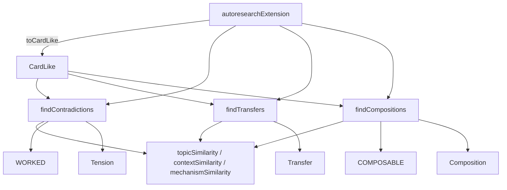

# Hypothesis synthesis — contradiction mining, transfer, and composition

<!-- connect:up:begin -->
> **Cross-repo concept:** part of [hypothesis-generation](../../../concepts/hypothesis-generation.md) across this wiki's repos.
<!-- connect:up:end -->
## Overview

This module is the one place in the loop that *proposes* untested ideas rather than ranking ideas someone else proposed (that's `scoring.ts`'s job). Its module docstring frames the bet directly: "Most agents generate ideas by copying nearby literature. The richer seeds are the tensions and analogies already latent in memory." Three pure functions mine three different signals out of the same trust-tagged memory (a list of [`CardLike`](../catalog/extensions/pi-autoresearch-vkf/synthesis.ts.md#CardLike) claims): [`findContradictions`](../catalog/extensions/pi-autoresearch-vkf/synthesis.ts.md#findContradictions) turns disagreement into a generative question, [`findTransfers`](../catalog/extensions/pi-autoresearch-vkf/synthesis.ts.md#findTransfers) turns "same mechanism, different domain" into an analogy worth adapting, and [`findCompositions`](../catalog/extensions/pi-autoresearch-vkf/synthesis.ts.md#findCompositions) turns two independently-verified, complementary claims into one hypothesis "no single source proposes." All three sit on the same lexical-overlap primitive (Jaccard similarity over token sets) applied to three different fields of a claim — text, mechanism, context — so "similar topic," "similar how," and "similar where" are three independent axes the rest of the module composes.

## Diagram

## Design rationale (why it's built this way)

The module is explicitly kept "Pure ... (reuses `./scoring.ts` tokenization) so it is fully unit-testable" — every function takes plain data ([`CardLike`](../catalog/extensions/pi-autoresearch-vkf/synthesis.ts.md#CardLike) arrays) and returns plain data, with no dependency on the pi runtime or the VKF CLI. That is what lets [`runOurs`](../catalog/benchmark/harness.ts.md#runOurs) in the benchmark harness call [`findContradictions`](../catalog/extensions/pi-autoresearch-vkf/synthesis.ts.md#findContradictions) directly against synthetic ground-truth scenarios to measure whether synthesis finds combinations a blind ranking loop cannot — the harness's own comment on its `Combo` type says a synthesized idea is "unlocked only when both parents have been tried AND the contradiction miner flags the pair — i.e. discoverable solely by synthesis."

Each of the three functions encodes a distinct, deliberately asymmetric definition of "interesting pair," visible directly in the doc comments: contradiction wants *high* topic similarity with a diverging outcome or mechanism ([`findContradictions`](../catalog/extensions/pi-autoresearch-vkf/synthesis.ts.md#findContradictions)); transfer wants *high* mechanism similarity but *low* context similarity — "same how, different where" ([`findTransfers`](../catalog/extensions/pi-autoresearch-vkf/synthesis.ts.md#findTransfers), scored by [`transfer_score`](../catalog/extensions/pi-autoresearch-vkf/synthesis.ts.md#Transfer.transfer_score) = mechanism_similarity × (1 − context_similarity)); composition wants relevance to the goal with *low* mechanism overlap between two already-trusted parents ([`findCompositions`](../catalog/extensions/pi-autoresearch-vkf/synthesis.ts.md#findCompositions)), with an explicit boost when the two parents touch different [`lever`](../catalog/extensions/pi-autoresearch-vkf/synthesis.ts.md#CardLike.lever)s — "combining a data-lever idea with an algorithm-lever idea is a real combination, not a restatement." Composition additionally gates on trust: only cards in [`COMPOSABLE`](../catalog/extensions/pi-autoresearch-vkf/synthesis.ts.md#COMPOSABLE) states can be a parent, so the module never proposes combining two still-unverified guesses.

> [!inferred] The wider repo's CHANGELOG (v0.9.0) states the project was "Inspired by agentic tree-search (AIDE, The AI Scientist v2) and RD-Agent's structured Research→Development cycle" — but that framing lives outside this packet's Subgraph (it is not in `synthesis.ts`'s own module docstring), so the specific correspondence between this module's three mining strategies and any one prior-art mechanism is my reading, not an authored citation. What the source itself grounds is narrower: the composition idea is motivated by the benchmark's global optima being combinations "no single paper states," which is the RD-Agent-flavored half of that lineage (structured recombination of vetted findings) more than the AIDE/AI-Scientist-v2 tree-search half (which lives in `tree.ts`, outside this packet).

## Entry points

- [`findContradictions`](../catalog/extensions/pi-autoresearch-vkf/synthesis.ts.md#findContradictions) — the contradiction miner. Reached whenever the host wires up the `find_contradictions` tool through [`autoresearchExtension`](../catalog/extensions/pi-autoresearch-vkf/index.ts.md#autoresearchExtension), and also called directly by the benchmark's [`runOurs`](../catalog/benchmark/harness.ts.md#runOurs) to score synthesis against ground truth.
- [`findTransfers`](../catalog/extensions/pi-autoresearch-vkf/synthesis.ts.md#findTransfers) — the cross-domain analogy finder, given one target [`CardLike`](../catalog/extensions/pi-autoresearch-vkf/synthesis.ts.md#CardLike) (a real card or a free-text problem stand-in) and the rest of memory to search. Reached through [`autoresearchExtension`](../catalog/extensions/pi-autoresearch-vkf/index.ts.md#autoresearchExtension)'s `find_transfers` wiring.
- [`findCompositions`](../catalog/extensions/pi-autoresearch-vkf/synthesis.ts.md#findCompositions) — the composition finder, given the free-text research `goal` and the full card set. Reached through [`autoresearchExtension`](../catalog/extensions/pi-autoresearch-vkf/index.ts.md#autoresearchExtension)'s `find_compositions` wiring.
- [`autoresearchExtension`](../catalog/extensions/pi-autoresearch-vkf/index.ts.md#autoresearchExtension) — the single host-side chokepoint: it adapts stored VKF cards to [`CardLike`](../catalog/extensions/pi-autoresearch-vkf/synthesis.ts.md#CardLike) via [`toCardLike`](../catalog/extensions/pi-autoresearch-vkf/index.ts.md#toCardLike) before any of the three functions above ever runs, since none of them know how to read a card file.

## Mechanism (step-by-step)

1. **Contradiction mining runs three tiers over the same card set, in strictly descending confidence.** [`findContradictions`](../catalog/extensions/pi-autoresearch-vkf/synthesis.ts.md#findContradictions) first walks every card's explicit [`conflicts_with`](../catalog/extensions/pi-autoresearch-vkf/synthesis.ts.md#CardLike.conflicts_with) list — a stated conflict always becomes a [`Tension`](../catalog/extensions/pi-autoresearch-vkf/synthesis.ts.md#Tension) with [`strength`](../catalog/extensions/pi-autoresearch-vkf/synthesis.ts.md#Tension.strength) `1`. It then scans all remaining pairs (keyed by [`id`](../catalog/extensions/pi-autoresearch-vkf/synthesis.ts.md#CardLike.id) so each unordered pair is visited once) for an **outcome flip** — topic-similar cards where one side's [`memory_state`](../catalog/extensions/pi-autoresearch-vkf/synthesis.ts.md#CardLike.memory_state) is in [`WORKED`](../catalog/extensions/pi-autoresearch-vkf/synthesis.ts.md#WORKED) and the other is `"contradicted"` — and finally, for pairs that don't flip, a **same-goal-different-mechanism** tension. Every tension carries the generative [`question`](../catalog/extensions/pi-autoresearch-vkf/synthesis.ts.md#Tension.question) and a human-readable [`detail`](../catalog/extensions/pi-autoresearch-vkf/synthesis.ts.md#Tension.detail) string, and results are returned strongest-[`strength`](../catalog/extensions/pi-autoresearch-vkf/synthesis.ts.md#Tension.strength)-first.
2. **Cross-domain transfer looks for the same mechanism working somewhere else.** [`findTransfers`](../catalog/extensions/pi-autoresearch-vkf/synthesis.ts.md#findTransfers) compares one `target` card against every other card by [`mechanismSimilarity`](../catalog/extensions/pi-autoresearch-vkf/synthesis.ts.md#mechanismSimilarity) and [`contextSimilarity`](../catalog/extensions/pi-autoresearch-vkf/synthesis.ts.md#contextSimilarity), keeping only pairs above a mechanism floor and below a context ceiling, then ranks by [`transfer_score`](../catalog/extensions/pi-autoresearch-vkf/synthesis.ts.md#Transfer.transfer_score) — "high = strong analogy" per its own doc comment — packaging each hit as a [`Transfer`](../catalog/extensions/pi-autoresearch-vkf/synthesis.ts.md#Transfer) whose [`from`](../catalog/extensions/pi-autoresearch-vkf/synthesis.ts.md#Transfer.from) card is the one to adapt.
3. **Composition only considers already-trusted, mechanism-bearing claims.** [`findCompositions`](../catalog/extensions/pi-autoresearch-vkf/synthesis.ts.md#findCompositions) first filters to cards whose [`memory_state`](../catalog/extensions/pi-autoresearch-vkf/synthesis.ts.md#CardLike.memory_state) is in [`COMPOSABLE`](../catalog/extensions/pi-autoresearch-vkf/synthesis.ts.md#COMPOSABLE) and whose [`mechanism`](../catalog/extensions/pi-autoresearch-vkf/synthesis.ts.md#CardLike.mechanism) is non-empty, then all-pairs-compares them: relevance to the free-text `goal` (min of both parents' relevance), the pair's [`mechanism_overlap`](../catalog/extensions/pi-autoresearch-vkf/synthesis.ts.md#Composition.mechanism_overlap) via [`mechanismSimilarity`](../catalog/extensions/pi-autoresearch-vkf/synthesis.ts.md#mechanismSimilarity) (must stay low), and an evidence multiplier keyed off each parent's own [`memory_state`](../catalog/extensions/pi-autoresearch-vkf/synthesis.ts.md#CardLike.memory_state). A different-[`lever`](../catalog/extensions/pi-autoresearch-vkf/synthesis.ts.md#CardLike.lever) pair earns a 1.15× multiplier before the final [`score`](../catalog/extensions/pi-autoresearch-vkf/synthesis.ts.md#Composition.score) is computed and results are sorted descending.
4. **All three similarity axes reduce to one shared primitive.** [`topicSimilarity`](../catalog/extensions/pi-autoresearch-vkf/synthesis.ts.md#topicSimilarity), [`contextSimilarity`](../catalog/extensions/pi-autoresearch-vkf/synthesis.ts.md#contextSimilarity), and [`mechanismSimilarity`](../catalog/extensions/pi-autoresearch-vkf/synthesis.ts.md#mechanismSimilarity) each call [`jaccard`](../catalog/extensions/pi-autoresearch-vkf/scoring.ts.md#jaccard) over a different tokenized field — full [`text`](../catalog/extensions/pi-autoresearch-vkf/synthesis.ts.md#CardLike.text) via [`tokenize`](../catalog/extensions/pi-autoresearch-vkf/scoring.ts.md#tokenize), [`context`](../catalog/extensions/pi-autoresearch-vkf/synthesis.ts.md#CardLike.context) via [`ctxTokens`](../catalog/extensions/pi-autoresearch-vkf/synthesis.ts.md#ctxTokens), and [`mechanism`](../catalog/extensions/pi-autoresearch-vkf/synthesis.ts.md#CardLike.mechanism) via [`mechTokens`](../catalog/extensions/pi-autoresearch-vkf/synthesis.ts.md#mechTokens) — so "similar topic," "similar mechanism," and "similar context" are three independently-tunable lenses on the exact same claim data, not three separate models.
5. **Cards only reach any of this after being adapted from storage.** [`autoresearchExtension`](../catalog/extensions/pi-autoresearch-vkf/index.ts.md#autoresearchExtension) is the only caller of all three mining functions in this packet's Subgraph; it reaches them via [`toCardLike`](../catalog/extensions/pi-autoresearch-vkf/index.ts.md#toCardLike), which maps a stored [`MemoryState`](../catalog/extensions/pi-autoresearch-vkf/cards.ts.md#MemoryState)-tagged card onto the minimal [`CardLike`](../catalog/extensions/pi-autoresearch-vkf/synthesis.ts.md#CardLike) shape these pure functions actually need.

## Key data structures

- [`CardLike`](../catalog/extensions/pi-autoresearch-vkf/synthesis.ts.md#CardLike) — the minimal claim shape every function consumes: [`id`](../catalog/extensions/pi-autoresearch-vkf/synthesis.ts.md#CardLike.id), [`title`](../catalog/extensions/pi-autoresearch-vkf/synthesis.ts.md#CardLike.title), [`text`](../catalog/extensions/pi-autoresearch-vkf/synthesis.ts.md#CardLike.text), optional [`mechanism`](../catalog/extensions/pi-autoresearch-vkf/synthesis.ts.md#CardLike.mechanism)/[`context`](../catalog/extensions/pi-autoresearch-vkf/synthesis.ts.md#CardLike.context)/[`lever`](../catalog/extensions/pi-autoresearch-vkf/synthesis.ts.md#CardLike.lever), [`memory_state`](../catalog/extensions/pi-autoresearch-vkf/synthesis.ts.md#CardLike.memory_state) ([`MemoryState`](../catalog/extensions/pi-autoresearch-vkf/cards.ts.md#MemoryState)), and [`conflicts_with`](../catalog/extensions/pi-autoresearch-vkf/synthesis.ts.md#CardLike.conflicts_with).
- [`Tension`](../catalog/extensions/pi-autoresearch-vkf/synthesis.ts.md#Tension) — one mined contradiction: [`kind`](../catalog/extensions/pi-autoresearch-vkf/synthesis.ts.md#Tension.kind), the two card ids [`a`](../catalog/extensions/pi-autoresearch-vkf/synthesis.ts.md#Tension.a)/[`b`](../catalog/extensions/pi-autoresearch-vkf/synthesis.ts.md#Tension.b), [`detail`](../catalog/extensions/pi-autoresearch-vkf/synthesis.ts.md#Tension.detail), the generative [`question`](../catalog/extensions/pi-autoresearch-vkf/synthesis.ts.md#Tension.question), and ranking [`strength`](../catalog/extensions/pi-autoresearch-vkf/synthesis.ts.md#Tension.strength).
- [`Transfer`](../catalog/extensions/pi-autoresearch-vkf/synthesis.ts.md#Transfer) — one mined analogy: the source [`from`](../catalog/extensions/pi-autoresearch-vkf/synthesis.ts.md#Transfer.from) id, [`title`](../catalog/extensions/pi-autoresearch-vkf/synthesis.ts.md#Transfer.title), [`mechanism_similarity`](../catalog/extensions/pi-autoresearch-vkf/synthesis.ts.md#Transfer.mechanism_similarity)/[`context_similarity`](../catalog/extensions/pi-autoresearch-vkf/synthesis.ts.md#Transfer.context_similarity), the combined [`transfer_score`](../catalog/extensions/pi-autoresearch-vkf/synthesis.ts.md#Transfer.transfer_score), and a canned [`suggestion`](../catalog/extensions/pi-autoresearch-vkf/synthesis.ts.md#Transfer.suggestion) string.
- [`Composition`](../catalog/extensions/pi-autoresearch-vkf/synthesis.ts.md#Composition) — one mined pairing: parent ids [`a`](../catalog/extensions/pi-autoresearch-vkf/synthesis.ts.md#Composition.a)/[`b`](../catalog/extensions/pi-autoresearch-vkf/synthesis.ts.md#Composition.b) with their [`titleA`](../catalog/extensions/pi-autoresearch-vkf/synthesis.ts.md#Composition.titleA)/[`titleB`](../catalog/extensions/pi-autoresearch-vkf/synthesis.ts.md#Composition.titleB), [`goal_relevance`](../catalog/extensions/pi-autoresearch-vkf/synthesis.ts.md#Composition.goal_relevance), [`mechanism_overlap`](../catalog/extensions/pi-autoresearch-vkf/synthesis.ts.md#Composition.mechanism_overlap), the combined [`score`](../catalog/extensions/pi-autoresearch-vkf/synthesis.ts.md#Composition.score), and [`suggestion`](../catalog/extensions/pi-autoresearch-vkf/synthesis.ts.md#Composition.suggestion).
- [`ContradictionOptions`](../catalog/extensions/pi-autoresearch-vkf/synthesis.ts.md#ContradictionOptions) ([`topicThreshold`](../catalog/extensions/pi-autoresearch-vkf/synthesis.ts.md#ContradictionOptions.topicThreshold), [`contextThreshold`](../catalog/extensions/pi-autoresearch-vkf/synthesis.ts.md#ContradictionOptions.contextThreshold), [`mechanismThreshold`](../catalog/extensions/pi-autoresearch-vkf/synthesis.ts.md#ContradictionOptions.mechanismThreshold)) and [`CompositionOptions`](../catalog/extensions/pi-autoresearch-vkf/synthesis.ts.md#CompositionOptions) ([`minGoalRelevance`](../catalog/extensions/pi-autoresearch-vkf/synthesis.ts.md#CompositionOptions.minGoalRelevance), [`maxMechanismOverlap`](../catalog/extensions/pi-autoresearch-vkf/synthesis.ts.md#CompositionOptions.maxMechanismOverlap)) — the tunable cutoffs; `findTransfers`'s options ([`minMechanismSimilarity`](../catalog/extensions/pi-autoresearch-vkf/synthesis.ts.md#findTransfers.opts-typeLiteral88.minMechanismSimilarity), [`maxContextSimilarity`](../catalog/extensions/pi-autoresearch-vkf/synthesis.ts.md#findTransfers.opts-typeLiteral88.maxContextSimilarity)) are an inline type rather than a named interface.
- [`WORKED`](../catalog/extensions/pi-autoresearch-vkf/synthesis.ts.md#WORKED) and [`COMPOSABLE`](../catalog/extensions/pi-autoresearch-vkf/synthesis.ts.md#COMPOSABLE) — two fixed `Set<`[`MemoryState`](../catalog/extensions/pi-autoresearch-vkf/cards.ts.md#MemoryState)`>` gates that encode, in one place each, which lifecycle states count as "this claim held up" and "this claim is trusted enough to build on."

## Dynamics (design intent)

All three functions are synchronous, pure, and allocation-only — there is no concurrency to reason about, only *ordering* and *precedence*, both of which `tests/synthesis.test.mjs` pins down directly. Within [`findContradictions`](../catalog/extensions/pi-autoresearch-vkf/synthesis.ts.md#findContradictions), the `seen` pair-key set is shared across all three tiers, so a pair that matches an explicit [`conflicts_with`](../catalog/extensions/pi-autoresearch-vkf/synthesis.ts.md#CardLike.conflicts_with) link is never re-examined by the outcome-flip or same-goal tiers, and within the pairwise loop an outcome-flip match short-circuits (`continue`) before the same-goal-different-mechanism check runs — so a pair produces **at most one** [`Tension`](../catalog/extensions/pi-autoresearch-vkf/synthesis.ts.md#Tension), by strict tier precedence, even if it would qualify under more than one rule. The test suite also pins the outcome-flip tension's orientation: the winner is always packed into slot `a` and the loser into `b` regardless of which one appears first in the input array ("outcome flip: similar topic, one worked, one contradicted" asserts `flip.a === "claim:win"`), and pins that a `"contradicted"` card is excluded from the same-goal-different-mechanism tier entirely, not merely deprioritized. For [`findCompositions`](../catalog/extensions/pi-autoresearch-vkf/synthesis.ts.md#findCompositions), a test with two cards sharing one `mechanism` string confirms the redundant-pair rejection is exact-overlap-driven (`mechanism_overlap` exceeding `maxMechanismOverlap` yields zero compositions), and a same-lever-vs-different-lever test confirms the 1.15× boost actually changes the returned ranking order, not just an internal score field.

## Edge cases

- Cards missing `mechanism`, `context`, or relying on empty [`text`](../catalog/extensions/pi-autoresearch-vkf/synthesis.ts.md#CardLike.text) tokenize to the empty set; [`jaccard`](../catalog/extensions/pi-autoresearch-vkf/scoring.ts.md#jaccard) explicitly returns `0` (not `NaN`) whenever either side is empty, so a sparse claim just never triggers a similarity-gated tier rather than crashing.
- [`findCompositions`](../catalog/extensions/pi-autoresearch-vkf/synthesis.ts.md#findCompositions) drops a card from consideration if [`mechanism`](../catalog/extensions/pi-autoresearch-vkf/synthesis.ts.md#CardLike.mechanism) is unset or blank after trimming, *even if* its [`memory_state`](../catalog/extensions/pi-autoresearch-vkf/synthesis.ts.md#CardLike.memory_state) is `"replicated"` — trust alone doesn't qualify a parent; it must also state how it works.
- [`findTransfers`](../catalog/extensions/pi-autoresearch-vkf/synthesis.ts.md#findTransfers) explicitly skips a card whose [`id`](../catalog/extensions/pi-autoresearch-vkf/synthesis.ts.md#CardLike.id) equals the target's own id, so a card already in the pool cannot "transfer" to itself.
- Each tier's default thresholds are independently tuned constants (contradiction: topic/context `0.34`, mechanism `0.2`; transfer: mechanism floor `0.15`, context ceiling `0.5`; composition: goal-relevance floor `0.05`, overlap ceiling `0.34`) — a caller tuning one tier's sensitivity does not affect the others.

## Open questions

> [!inferred] `CardLike`'s [`lever`](../catalog/extensions/pi-autoresearch-vkf/synthesis.ts.md#CardLike.lever) doc comment points to "`./cards.ts` LEVERS" for the actual enum of lever values, but neither `LEVERS` nor a `Lever` type is in this packet's Subgraph, so the concrete vocabulary a composition's lever-boost check compares against isn't groundable from this page.
- The exact tool-call surface for `find_contradictions`/`find_transfers`/`find_compositions` (parameter schemas, result formatting shown to the agent) isn't in this packet's source excerpt of [`autoresearchExtension`](../catalog/extensions/pi-autoresearch-vkf/index.ts.md#autoresearchExtension) — only that it imports and calls all three.
- No comment in the Subgraph explains why the five threshold pairs take the specific default values they do (`0.34`, `0.2`, `0.15`, `0.5`, `0.05`); whether these were hand-picked or calibrated against the benchmark harness isn't stated here.

## See also

- [VKF cards — the trust-lifecycle memory model](extensions-pi-autoresearch-vkf-cards.ts.md) — the [`MemoryState`](../catalog/extensions/pi-autoresearch-vkf/cards.ts.md#MemoryState) lifecycle these functions read trust from.
- [extensions-pi-autoresearch-vkf-index.ts.md](extensions-pi-autoresearch-vkf-index.ts.md) — [`autoresearchExtension`](../catalog/extensions/pi-autoresearch-vkf/index.ts.md#autoresearchExtension), the tool-registration site that wires all three mining functions to the agent.
- `scoring.ts` (ranks the ideas this module proposes, alongside ideas from any other source) and `tree.ts` (the best-first search these hypotheses feed into) are siblings not yet ingested as their own concept pages in this wiki.
