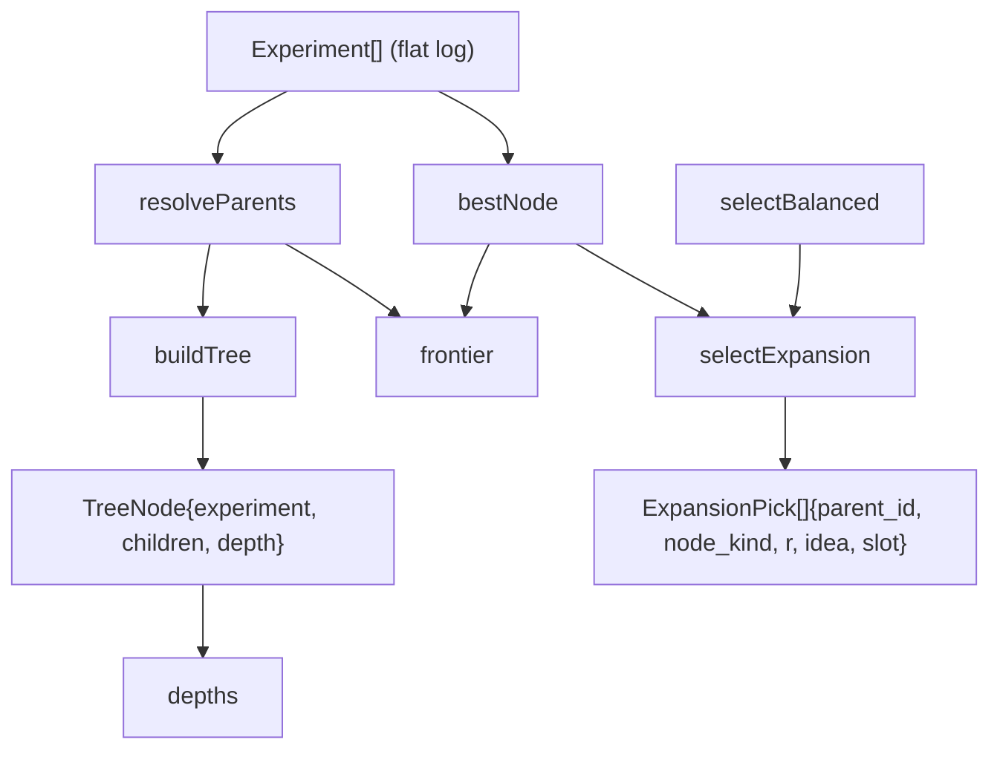

# The experiment search tree — best-first expansion over a parent-relative frontier

<!-- connect:up:begin -->
> **Cross-repo concept:** part of [agentic-tree-search](../../../concepts/agentic-tree-search.md), [closed-loop-experiment-design](../../../concepts/closed-loop-experiment-design.md) across this wiki's repos.
<!-- connect:up:end -->
Turns the flat experiment log into a tree of branching attempts and decides, each iteration, which node to expand from and which idea to apply.

## Overview
`tree.ts` is the piece that makes the loop a *search* rather than a chain of edits. Its own header
frames the contrast directly: "A blind loop keeps one scalar baseline and judges every change against
it. The strongest autoresearch systems (AIDE, The AI Scientist v2) instead treat the search as a
*tree*: each experiment is a node that branches from a parent, and the next move is chosen by
best-first expansion — build on the best node so far, but reserve budget to branch elsewhere." Two
read-side functions, [`buildTree`](../catalog/extensions/pi-autoresearch-vkf/tree.ts.md#buildTree) and
[`depths`](../catalog/extensions/pi-autoresearch-vkf/tree.ts.md#depths), reconstruct that tree from the
flat, `parent_id`-linked [`Experiment`](../catalog/extensions/pi-autoresearch-vkf/experiments.ts.md#Experiment)
array on every read; one write-side function,
[`selectExpansion`](../catalog/extensions/pi-autoresearch-vkf/tree.ts.md#selectExpansion), makes the
actual expansion decision by delegating idea-ranking to
[`selectBalanced`](../catalog/extensions/pi-autoresearch-vkf/scoring.ts.md#selectBalanced) and then
attaching every ranked pick to [`bestNode`](../catalog/extensions/pi-autoresearch-vkf/tree.ts.md#bestNode).
The whole module is pure — no filesystem, no pi runtime — so the tree logic is exercised directly by
`tests/tree.test.mjs` with plain object literals.

## Diagram

## Design rationale (why it's built this way)
The module's single defining decision is *what a node gets compared to and expanded from*, and it
answers both with the same node: [`bestNode`](../catalog/extensions/pi-autoresearch-vkf/tree.ts.md#bestNode)
— a plain linear scan honoring [`MetricDirection`](../catalog/extensions/pi-autoresearch-vkf/config.ts.md#MetricDirection)
over every [`value`](../catalog/extensions/pi-autoresearch-vkf/experiments.ts.md#Experiment.value) seen
so far. This is the parent-relative-baseline idea named in the module docstring quoted above: instead
of one fixed session baseline, the search is always judged against, and grown from, whichever node is
currently winning. [`resolveParents`](../catalog/extensions/pi-autoresearch-vkf/tree.ts.md#resolveParents)
is what makes that safe for pre-tree data — a legacy row with no explicit
[`parent_id`](../catalog/extensions/pi-autoresearch-vkf/experiments.ts.md#Experiment.parent_id) is stitched
onto the most recently [`kept`](../catalog/extensions/pi-autoresearch-vkf/experiments.ts.md#Experiment.kept)
node rather than simply the previous row, so a discarded (reverted) attempt is silently skipped as a
future parent. That is the closest thing this module has to *backtracking out of a dead end*: even
without an explicit `parent_id`, the chain never grows off a change that was thrown away.

A subtler, un-obvious point: [`selectExpansion`](../catalog/extensions/pi-autoresearch-vkf/tree.ts.md#selectExpansion)
never calls [`frontier`](../catalog/extensions/pi-autoresearch-vkf/tree.ts.md#frontier). Its own
`calls/refs` are `bestNode` and `selectBalanced` only. `frontier`'s docstring calls itself "useful for
*explaining* the frontier," i.e. a display helper (best node plus current leaves, de-duplicated) — not
a candidate set the expansion policy samples from. So this implementation's "branch elsewhere" budget
is spent on *ideas*, not on *nodes*: every pick in a round, exploit or explore, is attached to the same
single [`bestNode`](../catalog/extensions/pi-autoresearch-vkf/tree.ts.md#bestNode); only the *idea*
attached to it (via [`classifySlot`](../catalog/extensions/pi-autoresearch-vkf/scoring.ts.md#classifySlot)'s
[`altitude`](../catalog/extensions/pi-autoresearch-vkf/scoring.ts.md#IdeaInput.altitude)/[`structural_novelty`](../catalog/extensions/pi-autoresearch-vkf/scoring.ts.md#ScoreFactors.structural_novelty)
split) decides whether the resulting node is logged as `improve` or `branch`.

**Compared to the paper-side agentic tree search this wiki already documents** (AIDE, The AI
Scientist v2 — see `agentic-tree-search`): those systems expand a *set* of frontier nodes per
iteration, with an LLM/VLM judge choosing among several live candidates and a separate probability
governing whether to debug a broken node instead. This module's policy is narrower and fully
deterministic — always hill-climb from the single current best, and use the explore/exploit split
([`selectBalanced`](../catalog/extensions/pi-autoresearch-vkf/scoring.ts.md#selectBalanced)'s
[`exploreFraction`](../catalog/extensions/pi-autoresearch-vkf/scoring.ts.md#selectBalanced.opts-typeLiteral120.exploreFraction)/[`k`](../catalog/extensions/pi-autoresearch-vkf/scoring.ts.md#selectBalanced.opts-typeLiteral120.k))
purely to decide how big a swing each attached idea is, not which node to leave from. It buys the same
headline property — "backtrack out of a dead end instead of grinding forward from the latest (possibly
worse) result," per the module docstring — with a much simpler, cheaper (no judge call) mechanism,
at the cost of never trying two different *branches* of the tree in the same round.

> [!inferred] Whether `frontier` is in fact consumed elsewhere for display (e.g. the terminal widget
> or browser dashboard) can't be confirmed from this packet's subgraph, which lists no in-subgraph
> caller for it; it may simply be unused, or used only from modules outside this packet.

## Entry points
- [`selectExpansion`](../catalog/extensions/pi-autoresearch-vkf/tree.ts.md#selectExpansion) — reached
  during `plan_next_step`, the tool inside [`autoresearchExtension`](../catalog/extensions/pi-autoresearch-vkf/index.ts.md#autoresearchExtension)
  where the loop decides what to try next; this is the only place expansion decisions are made.
- [`bestNode`](../catalog/extensions/pi-autoresearch-vkf/tree.ts.md#bestNode) — called from inside
  [`selectExpansion`](../catalog/extensions/pi-autoresearch-vkf/tree.ts.md#selectExpansion) to choose the
  node to expand from, and twice more directly from [`autoresearchExtension`](../catalog/extensions/pi-autoresearch-vkf/index.ts.md#autoresearchExtension):
  once in `plan_next_step`, purely to report "Best node so far" in that tool's text output, and once in
  `vkf_log_experiment`, where its result supplies the *default* `parent_id` for the experiment being
  logged whenever the caller doesn't pass one explicitly — a second, real best-node-attachment decision
  outside `selectExpansion`, not mere status reporting.
- [`depths`](../catalog/extensions/pi-autoresearch-vkf/tree.ts.md#depths) — recomputed on every dashboard
  rebuild via [`buildDashboardData`](../catalog/extensions/pi-autoresearch-vkf/progress_data.ts.md#buildDashboardData),
  which stamps each experiment row's tree position onto the payload before it's rendered.
- [`buildTree`](../catalog/extensions/pi-autoresearch-vkf/tree.ts.md#buildTree) — the single place the
  flat [`Experiment`](../catalog/extensions/pi-autoresearch-vkf/experiments.ts.md#Experiment) array is
  turned into real [`TreeNode`](../catalog/extensions/pi-autoresearch-vkf/tree.ts.md#TreeNode) objects;
  [`depths`](../catalog/extensions/pi-autoresearch-vkf/tree.ts.md#depths) is reached through it on every call.

## Mechanism (step-by-step)
1. [`resolveParents`](../catalog/extensions/pi-autoresearch-vkf/tree.ts.md#resolveParents) walks the
   flat log once, tracking `prevId` and `lastKeptId`. An explicit
   [`parent_id`](../catalog/extensions/pi-autoresearch-vkf/experiments.ts.md#Experiment.parent_id) wins
   outright if it names a real, distinct, earlier row; otherwise (no `parent_id` at all — a legacy row)
   the parent is `lastKeptId ?? prevId`, so the chain always hangs off the last change that was actually
   [`kept`](../catalog/extensions/pi-autoresearch-vkf/experiments.ts.md#Experiment.kept) when one exists.
2. [`buildTree`](../catalog/extensions/pi-autoresearch-vkf/tree.ts.md#buildTree) turns that parent map
   into real [`TreeNode`](../catalog/extensions/pi-autoresearch-vkf/tree.ts.md#TreeNode) objects — one
   per [`experiment`](../catalog/extensions/pi-autoresearch-vkf/tree.ts.md#TreeNode.experiment), each
   starting with an empty [`children`](../catalog/extensions/pi-autoresearch-vkf/tree.ts.md#TreeNode.children)
   array — links each into its parent's `children`, and collects the ones with no resolved parent as
   roots. [`depth`](../catalog/extensions/pi-autoresearch-vkf/tree.ts.md#TreeNode.depth) is then assigned
   by a BFS from those roots that tracks a `seen` set, so a self- or mutually-referential `parent_id`
   (already screened out by step 1 for the direct self case) still can't loop the walk forever.
3. [`depths`](../catalog/extensions/pi-autoresearch-vkf/tree.ts.md#depths) is a thin flatten over that
   same structure: a DFS over the forest [`buildTree`](../catalog/extensions/pi-autoresearch-vkf/tree.ts.md#buildTree)
   returns, collecting `id → depth` into one `Map` so callers that just need "how deep is this node"
   don't have to walk `children` themselves.
4. [`bestNode`](../catalog/extensions/pi-autoresearch-vkf/tree.ts.md#bestNode) makes one linear pass over
   every experiment with a measured [`value`](../catalog/extensions/pi-autoresearch-vkf/experiments.ts.md#Experiment.value),
   keeping whichever is better under [`MetricDirection`](../catalog/extensions/pi-autoresearch-vkf/config.ts.md#MetricDirection)
   (`"higher"` or `"lower"`); with nothing measured yet it returns `undefined`, which is what later lets
   [`selectExpansion`](../catalog/extensions/pi-autoresearch-vkf/tree.ts.md#selectExpansion) distinguish
   "no tree yet" from "expand the winner."
5. [`frontier`](../catalog/extensions/pi-autoresearch-vkf/tree.ts.md#frontier) builds a display list —
   [`bestNode`](../catalog/extensions/pi-autoresearch-vkf/tree.ts.md#bestNode) first, then every leaf (an
   id that never appears as a value in [`resolveParents`](../catalog/extensions/pi-autoresearch-vkf/tree.ts.md#resolveParents)'s
   map), de-duplicated by `id` — but as covered in Design rationale, this list is not itself consumed by
   the expansion decision below.
6. [`selectExpansion`](../catalog/extensions/pi-autoresearch-vkf/tree.ts.md#selectExpansion) is where the
   move actually gets chosen. It first hands the scored idea pool straight to
   [`selectBalanced`](../catalog/extensions/pi-autoresearch-vkf/scoring.ts.md#selectBalanced) with its own
   [`exploreFraction`](../catalog/extensions/pi-autoresearch-vkf/tree.ts.md#selectExpansion.opts-typeLiteral110.exploreFraction)/[`k`](../catalog/extensions/pi-autoresearch-vkf/tree.ts.md#selectExpansion.opts-typeLiteral110.k)
   forwarded through unchanged — idea ranking and the explore/exploit split are entirely `scoring.ts`'s
   job, not re-implemented here. It separately calls
   [`bestNode`](../catalog/extensions/pi-autoresearch-vkf/tree.ts.md#bestNode) using its own
   [`direction`](../catalog/extensions/pi-autoresearch-vkf/tree.ts.md#selectExpansion.opts-typeLiteral110.direction).
   Each returned [`BalancedPick`](../catalog/extensions/pi-autoresearch-vkf/scoring.ts.md#BalancedPick)
   (its [`r`](../catalog/extensions/pi-autoresearch-vkf/scoring.ts.md#BalancedPick.r),
   [`idea`](../catalog/extensions/pi-autoresearch-vkf/scoring.ts.md#BalancedPick.idea), and
   [`slot`](../catalog/extensions/pi-autoresearch-vkf/scoring.ts.md#BalancedPick.slot) carried through
   unchanged) is then stamped into an
   [`ExpansionPick`](../catalog/extensions/pi-autoresearch-vkf/tree.ts.md#ExpansionPick): `parent_id` is
   the best node's `id` (or `undefined`), and the move is classified `"draft"` if there's no best node
   yet, else `"branch"` for an explore slot or `"improve"` for an exploit slot.

## Key data structures
- [`TreeNode`](../catalog/extensions/pi-autoresearch-vkf/tree.ts.md#TreeNode) — the reconstructed-tree
  unit: the underlying [`experiment`](../catalog/extensions/pi-autoresearch-vkf/tree.ts.md#TreeNode.experiment),
  its [`children`](../catalog/extensions/pi-autoresearch-vkf/tree.ts.md#TreeNode.children), and its
  [`depth`](../catalog/extensions/pi-autoresearch-vkf/tree.ts.md#TreeNode.depth) from the nearest root.
  Never persisted — rebuilt fresh from the flat log by
  [`buildTree`](../catalog/extensions/pi-autoresearch-vkf/tree.ts.md#buildTree) on every call.
- [`ExpansionPick`](../catalog/extensions/pi-autoresearch-vkf/tree.ts.md#ExpansionPick) — the output of a
  single expansion decision: a `parent_id` to branch from (`undefined` = fresh root, mirroring
  [`Experiment`](../catalog/extensions/pi-autoresearch-vkf/experiments.ts.md#Experiment)'s own
  [`parent_id`](../catalog/extensions/pi-autoresearch-vkf/experiments.ts.md#Experiment.parent_id)), a
  `node_kind` classification, and the
  [`r`](../catalog/extensions/pi-autoresearch-vkf/scoring.ts.md#BalancedPick.r)/[`idea`](../catalog/extensions/pi-autoresearch-vkf/scoring.ts.md#BalancedPick.idea)/[`slot`](../catalog/extensions/pi-autoresearch-vkf/scoring.ts.md#BalancedPick.slot)
  carried straight through from [`selectBalanced`](../catalog/extensions/pi-autoresearch-vkf/scoring.ts.md#selectBalanced).
- [`Experiment`](../catalog/extensions/pi-autoresearch-vkf/experiments.ts.md#Experiment) fields this
  module reads: [`id`](../catalog/extensions/pi-autoresearch-vkf/experiments.ts.md#Experiment.id),
  [`value`](../catalog/extensions/pi-autoresearch-vkf/experiments.ts.md#Experiment.value),
  [`parent_id`](../catalog/extensions/pi-autoresearch-vkf/experiments.ts.md#Experiment.parent_id), and
  [`kept`](../catalog/extensions/pi-autoresearch-vkf/experiments.ts.md#Experiment.kept) — everything the
  tree needs to reconstruct shape and pick a winner, with no other field touched.
- [`MetricDirection`](../catalog/extensions/pi-autoresearch-vkf/config.ts.md#MetricDirection) — the
  `"higher"`/`"lower"` flag threaded through [`bestNode`](../catalog/extensions/pi-autoresearch-vkf/tree.ts.md#bestNode),
  [`frontier`](../catalog/extensions/pi-autoresearch-vkf/tree.ts.md#frontier), and
  [`selectExpansion`](../catalog/extensions/pi-autoresearch-vkf/tree.ts.md#selectExpansion)'s own
  [`direction`](../catalog/extensions/pi-autoresearch-vkf/tree.ts.md#selectExpansion.opts-typeLiteral110.direction)
  option, so "better" means the same thing everywhere in the module.

## Dynamics (design intent)
`tests/tree.test.mjs` is the ground truth for how branching and backtracking actually behave.
"`resolveParents` honors explicit `parent_id`" confirms step 1's fast path: a row naming a real earlier
`parent_id` is never re-chained. The kept-aware test is the sharper one: three rows `a`(kept)→`b`(not
kept)→`c`(not kept), none with explicit `parent_id`s, resolve to `c`'s parent being `a`, *not* `b` —
"still hangs off the last kept (a), not b." That is
[`resolveParents`](../catalog/extensions/pi-autoresearch-vkf/tree.ts.md#resolveParents)'s
backtrack-out-of-a-dead-end behavior made concrete: a reverted attempt (`b`) is never silently built on
by a later legacy row, even though it was the most recent one tried. The cycle-safety test —
self-`parent_id` on `a`, plus a second row parented to `a` — asserts
[`buildTree`](../catalog/extensions/pi-autoresearch-vkf/tree.ts.md#buildTree) "must not infinite-loop"
and produces at least one root, exercising the `seen`-set BFS from step 2 directly.
[`bestNode`](../catalog/extensions/pi-autoresearch-vkf/tree.ts.md#bestNode)'s direction test and
[`frontier`](../catalog/extensions/pi-autoresearch-vkf/tree.ts.md#frontier)'s "best first" test both
confirm the ordering guarantees step 4–5 describe. The
[`selectExpansion`](../catalog/extensions/pi-autoresearch-vkf/tree.ts.md#selectExpansion) test is the one
that pins down the branching contract end to end: with an empty experiment list every pick comes back
`node_kind: "draft"` with `parent_id: undefined` (a fresh root for each), and with one measured node
`a`, *every* pick's `parent_id` becomes `"a"` while `node_kind` is `"branch"` exactly when
[`slot`](../catalog/extensions/pi-autoresearch-vkf/scoring.ts.md#BalancedPick.slot) is `"explore"` and
`"improve"` otherwise — the deterministic mapping described in Design rationale, verified directly.

## Edge cases
- No experiments measured yet: [`bestNode`](../catalog/extensions/pi-autoresearch-vkf/tree.ts.md#bestNode)
  returns `undefined`, so [`selectExpansion`](../catalog/extensions/pi-autoresearch-vkf/tree.ts.md#selectExpansion)
  marks every pick `"draft"` with no `parent_id` — the loop's first move is always treated as planting
  fresh roots, never a branch.
- A row whose own [`parent_id`](../catalog/extensions/pi-autoresearch-vkf/experiments.ts.md#Experiment.parent_id)
  equals its own [`id`](../catalog/extensions/pi-autoresearch-vkf/experiments.ts.md#Experiment.id):
  [`resolveParents`](../catalog/extensions/pi-autoresearch-vkf/tree.ts.md#resolveParents)'s explicit
  `e.parent_id !== e.id` check discards it as a root rather than as a self-loop.
- A `parent_id` naming an id not present in the log at all: also falls through
  [`resolveParents`](../catalog/extensions/pi-autoresearch-vkf/tree.ts.md#resolveParents)'s `byId.has(...)`
  guard, so a dangling reference is treated as a root, never as a crash.
- No row ever [`kept`](../catalog/extensions/pi-autoresearch-vkf/experiments.ts.md#Experiment.kept): the
  legacy-chain fallback in [`resolveParents`](../catalog/extensions/pi-autoresearch-vkf/tree.ts.md#resolveParents)
  degrades to `prevId`, i.e. a strictly linear chain — identical to pre-tree behavior.

## Open questions
> [!inferred] [`selectExpansion`](../catalog/extensions/pi-autoresearch-vkf/tree.ts.md#selectExpansion)
> anchors every pick in a round to the single [`bestNode`](../catalog/extensions/pi-autoresearch-vkf/tree.ts.md#bestNode),
> never to a wider candidate set like the one [`frontier`](../catalog/extensions/pi-autoresearch-vkf/tree.ts.md#frontier)
> exposes. Whether that's a deliberate simplification (cheaper, no judge needed) or a planned future
> enhancement toward a fuller multi-node frontier search isn't stated anywhere in the source.
- The `node_kind` value stamped onto each [`ExpansionPick`](../catalog/extensions/pi-autoresearch-vkf/tree.ts.md#ExpansionPick)
  is a `NodeKind` (`"draft"`/`"improve"`/`"debug"`/`"branch"`), but `NodeKind` itself is not part of this
  packet's Subgraph, so it can't be cited or linked from this page.
- This packet's Evidence section reports no tests reference this subgraph, but `tests/tree.test.mjs`
  clearly exercises every exported function directly (see Dynamics above) — the test-path configuration
  used to build this packet may simply be missing that file.
- No caller of [`frontier`](../catalog/extensions/pi-autoresearch-vkf/tree.ts.md#frontier) appears in this
  subgraph at all; where (if anywhere) it's actually rendered is not something this page can confirm.

## See also
- [Experiment log & parent-relative baselines](extensions-pi-autoresearch-vkf-experiments.ts.md) — the
  flat ledger and `nodeBaseline` outcome logic this module reconstructs a tree from.
- [extensions-pi-autoresearch-vkf-index.ts.md](extensions-pi-autoresearch-vkf-index.ts.md) — `autoresearchExtension`'s `plan_next_step`/`vkf_log_experiment` wiring that calls into this module.
- [Agentic tree search (paper-side concept)](../../../concepts/agentic-tree-search.md) — AIDE / The AI
  Scientist v2's fuller multi-node, judge-mediated tree search this module's docstring explicitly names
  as its inspiration, and the point of comparison in Design rationale above.
- [Closed-loop experiment design](../../../concepts/closed-loop-experiment-design.md) — the general
  pattern this module instantiates: each node's outcome (via `bestNode`) feeds directly into the next
  expansion decision.
