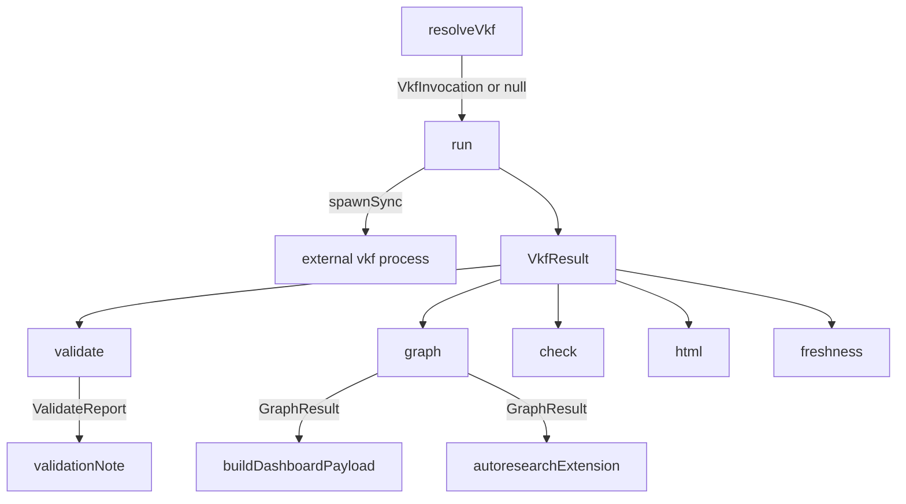

# The vkf CLI bridge — optional, degrading trust validation

## Overview

`vkf.ts` is the extension's only seam onto an external process: everywhere else in the loop, memory cards are markdown+YAML the extension reads and writes itself, but four operations — trust validation, the typed idea-lineage graph, staleness/freshness checking, and permission checks on memory writes — are deliberately delegated to the reference `vkf` Python CLI rather than reimplemented. The module's own header states the rationale plainly: "we shell out to the real CLI for the things that need the reference implementation... and read/write the bundle's markdown ourselves." Every public function ([`validate`](../catalog/extensions/pi-autoresearch-vkf/vkf.ts.md#validate), [`graph`](../catalog/extensions/pi-autoresearch-vkf/vkf.ts.md#graph), [`check`](../catalog/extensions/pi-autoresearch-vkf/vkf.ts.md#check), [`html`](../catalog/extensions/pi-autoresearch-vkf/vkf.ts.md#html), [`freshness`](../catalog/extensions/pi-autoresearch-vkf/vkf.ts.md#freshness)) funnels through one internal chokepoint, [`run`](../catalog/extensions/pi-autoresearch-vkf/vkf.ts.md#run), which in turn depends on [`resolveVkf`](../catalog/extensions/pi-autoresearch-vkf/vkf.ts.md#resolveVkf) locating the binary. The whole bridge is optional by design: VKF being uninstalled is treated as an ordinary, expected condition, not an error path, so the rest of the loop keeps working with validation simply switched off.

## Diagram

## Design rationale (why it's built this way)

The resolution strategy in [`resolveVkf`](../catalog/extensions/pi-autoresearch-vkf/vkf.ts.md#resolveVkf) is a deliberately ordered fallback, not a single lookup: an explicit `$PI_AUTORESEARCH_VKF` path wins outright, then a set of hardcoded conda-root candidates (`miniconda3`, `anaconda3`, `.conda`, `miniforge3`) under the named env ([`condaEnv`](../catalog/extensions/pi-autoresearch-vkf/vkf.ts.md#condaEnv), default `"VKF"`) are probed for an existing file, and only if none exist does it fall back to invoking through `conda run -n <env> vkf` and hoping `conda` is on `PATH`. This order trades a slower last resort (spawning `conda` itself) for correctness in the common case where `vkf` was `pip install`-ed inside a named conda env but isn't symlinked onto the user's shell `PATH`. The result is memoized in module-level [`cached`](../catalog/extensions/pi-autoresearch-vkf/vkf.ts.md#cached) so the (up to four) filesystem probes happen at most once per process, not once per tool call.

Every typed wrapper follows the same two-layer error handling shape: [`run`](../catalog/extensions/pi-autoresearch-vkf/vkf.ts.md#run) distinguishes "the CLI could not be located or spawned at all" ([`unavailable`](../catalog/extensions/pi-autoresearch-vkf/vkf.ts.md#VkfResult.unavailable), detected via `ENOENT` or a thrown exception) from "the CLI ran but exited non-zero or wrote something the wrapper couldn't parse as JSON." The `unavailable` docstring is explicit about the distinction: "Set when the CLI could not be located/spawned at all." Callers like [`validate`](../catalog/extensions/pi-autoresearch-vkf/vkf.ts.md#validate) check `unavailable` first and short-circuit to an `available: false` report before ever attempting `JSON.parse` — so a missing binary never reaches the parse-failure branch, and a parse failure (malformed JSON from a CLI that *did* run) never gets mistaken for the binary being absent. This separation is what lets [`validationNote`](../catalog/extensions/pi-autoresearch-vkf/index.ts.md#validationNote) print a genuinely different message for "not installed" versus "ran and found errors."

> [!inferred] `run`'s doc comment for `graph`/`html`/`freshness` describes each as producing JSON to stdout, yet each typed wrapper still wraps its `JSON.parse` in a `try/catch` that falls back to an "available but empty/unparsed" shape rather than throwing. Read together with the module header's framing of VKF as optional infrastructure, this looks like the same graceful-degradation philosophy applied one level deeper: not just "CLI absent" but also "CLI present but its output shape didn't match expectations" is treated as a soft-fail rather than a hard error, so a version mismatch between the bridge and an installed `vkf` binary degrades rather than crashes a tool call.

## Entry points

- [`validate`](../catalog/extensions/pi-autoresearch-vkf/vkf.ts.md#validate) — runs `vkf validate <dir> --profile N --format json` and returns a [`ValidateReport`](../catalog/extensions/pi-autoresearch-vkf/vkf.ts.md#ValidateReport). Reached by [`validationNote`](../catalog/extensions/pi-autoresearch-vkf/index.ts.md#validationNote) after every memory write, which is how trust-gating gets surfaced in tool output.
- [`graph`](../catalog/extensions/pi-autoresearch-vkf/vkf.ts.md#graph) — runs `vkf graph <dir>` for the typed node/edge view of the memory bundle. Reached by [`autoresearchExtension`](../catalog/extensions/pi-autoresearch-vkf/index.ts.md#autoresearchExtension)'s `research_graph` tool and by [`buildDashboardPayload`](../catalog/extensions/pi-autoresearch-vkf/index.ts.md#buildDashboardPayload) when `includeGraph` is requested.
- [`check`](../catalog/extensions/pi-autoresearch-vkf/vkf.ts.md#check) — runs `vkf check <file> --use <ctx> [--role <role>] --format json`, a permission/allowlist gate on a specific memory file for a specific intended use.
- [`html`](../catalog/extensions/pi-autoresearch-vkf/vkf.ts.md#html) — runs `vkf html <dir> --out <path>` to export a self-contained interactive lineage graph visualizer.
- [`freshness`](../catalog/extensions/pi-autoresearch-vkf/vkf.ts.md#freshness) — runs `vkf freshness <dir>` to surface staleness on cards.
- [`isAvailable`](../catalog/extensions/pi-autoresearch-vkf/vkf.ts.md#isAvailable) — a cheap `vkf --version` probe that returns just a boolean, for a caller that needs availability without a full report. A repo-wide search finds no call site for it anywhere outside its own definition in this file — as shipped at this commit it is exported but unused, like [`check`](../catalog/extensions/pi-autoresearch-vkf/vkf.ts.md#check) below.

## Mechanism (step-by-step)

1. **Resolution happens once, lazily, and is cached.** [`resolveVkf`](../catalog/extensions/pi-autoresearch-vkf/vkf.ts.md#resolveVkf) checks module-level [`cached`](../catalog/extensions/pi-autoresearch-vkf/vkf.ts.md#cached) first; on a cache miss it checks `$PI_AUTORESEARCH_VKF`, then probes the conda-root candidates for a `vkf` binary under [`condaEnv`](../catalog/extensions/pi-autoresearch-vkf/vkf.ts.md#condaEnv), and only as a last resort commits to invoking through `conda run`. Whatever it decides — including the `null`-equivalent "found nothing but will still try `conda run`" case — is written back to `cached` so every subsequent call in the process reuses it without re-touching the filesystem.
2. **Every CLI invocation funnels through one spawn point.** [`run`](../catalog/extensions/pi-autoresearch-vkf/vkf.ts.md#run) calls `resolveVkf`, and if no invocation is resolvable at all, returns immediately with [`unavailable`](../catalog/extensions/pi-autoresearch-vkf/vkf.ts.md#VkfResult.unavailable) set and no process spawned. If an invocation was resolved, it spawns synchronously (`spawnSync`, a 32MB output buffer) and inspects `proc.error` to tell an `ENOENT` (binary genuinely missing, even after `resolveVkf` picked a candidate) apart from other spawn failures, mapping the former to `unavailable` too. This is the single place [`stdout`](../catalog/extensions/pi-autoresearch-vkf/vkf.ts.md#VkfResult.stdout)/[`stderr`](../catalog/extensions/pi-autoresearch-vkf/vkf.ts.md#VkfResult.stderr)/[`code`](../catalog/extensions/pi-autoresearch-vkf/vkf.ts.md#VkfResult.code)/[`ok`](../catalog/extensions/pi-autoresearch-vkf/vkf.ts.md#VkfResult.ok) are populated as a [`VkfResult`](../catalog/extensions/pi-autoresearch-vkf/vkf.ts.md#VkfResult).
3. **Each typed wrapper checks unavailability before attempting to parse.** [`validate`](../catalog/extensions/pi-autoresearch-vkf/vkf.ts.md#validate) calls `run(["validate", memoryDir, "--profile", ..., "--format", "json"])`; if the result is `unavailable`, it returns `{ available: false, passed: false, raw: stderr }` without touching `JSON.parse` at all — this is the exact path that lets the rest of the loop treat "no vkf installed" as "validation skipped," never as a thrown error.
4. **A successful run is still defensively parsed.** Still inside `validate`, a successful process result is `JSON.parse`d inside a `try`; on parse failure the `catch` falls back to `{ available: true, passed: res.ok, raw: ... }` — so a `vkf` binary that ran but emitted something other than the expected JSON schema degrades to "available, pass/fail inferred from exit code" rather than crashing the caller. [`graph`](../catalog/extensions/pi-autoresearch-vkf/vkf.ts.md#graph) and [`freshness`](../catalog/extensions/pi-autoresearch-vkf/vkf.ts.md#freshness) apply the identical unavailable-check-then-defensive-parse shape around their own JSON payloads ([`nodes`](../catalog/extensions/pi-autoresearch-vkf/vkf.ts.md#GraphResult.nodes)/[`edges`](../catalog/extensions/pi-autoresearch-vkf/vkf.ts.md#GraphResult.edges)).
5. **`check` inverts the fail-safe default.** [`check`](../catalog/extensions/pi-autoresearch-vkf/vkf.ts.md#check) is the one wrapper where "vkf missing" does not mean "skip silently" — its unavailable branch returns `{ available: false, allowed: true, requiresReview: false, reason: "vkf unavailable", ... }`, i.e. it fails *open* (permits the write) rather than blocking a memory operation just because the optional trust layer isn't installed, consistent with the module's stated philosophy that VKF absence should never break the loop's basic function.
6. **The graph feeds both a tool result and a dashboard payload.** [`graph`](../catalog/extensions/pi-autoresearch-vkf/vkf.ts.md#graph)'s [`GraphResult`](../catalog/extensions/pi-autoresearch-vkf/vkf.ts.md#GraphResult) ([`available`](../catalog/extensions/pi-autoresearch-vkf/vkf.ts.md#GraphResult.available), [`nodes`](../catalog/extensions/pi-autoresearch-vkf/vkf.ts.md#GraphResult.nodes), [`edges`](../catalog/extensions/pi-autoresearch-vkf/vkf.ts.md#GraphResult.edges), [`raw`](../catalog/extensions/pi-autoresearch-vkf/vkf.ts.md#GraphResult.raw)) is consumed directly by [`autoresearchExtension`](../catalog/extensions/pi-autoresearch-vkf/index.ts.md#autoresearchExtension)'s `research_graph` tool and, conditionally (`includeGraph`), by [`buildDashboardPayload`](../catalog/extensions/pi-autoresearch-vkf/index.ts.md#buildDashboardPayload) — the same typed-graph call path serves both a direct agent-facing tool and the in-terminal/HTML dashboards.

## Key data structures

- [`VkfInvocation`](../catalog/extensions/pi-autoresearch-vkf/vkf.ts.md#VkfInvocation) — the resolved way to invoke the CLI: [`file`](../catalog/extensions/pi-autoresearch-vkf/vkf.ts.md#VkfInvocation.file) (the executable, which may itself be `conda`) and [`prefixArgs`](../catalog/extensions/pi-autoresearch-vkf/vkf.ts.md#VkfInvocation.prefixArgs) (empty for a direct path, `["run", "-n", env, "vkf"]` for the conda-run fallback).
- [`VkfResult`](../catalog/extensions/pi-autoresearch-vkf/vkf.ts.md#VkfResult) — the untyped raw process outcome every wrapper starts from: [`ok`](../catalog/extensions/pi-autoresearch-vkf/vkf.ts.md#VkfResult.ok), [`code`](../catalog/extensions/pi-autoresearch-vkf/vkf.ts.md#VkfResult.code), [`stdout`](../catalog/extensions/pi-autoresearch-vkf/vkf.ts.md#VkfResult.stdout), [`stderr`](../catalog/extensions/pi-autoresearch-vkf/vkf.ts.md#VkfResult.stderr), and the load-bearing optional [`unavailable`](../catalog/extensions/pi-autoresearch-vkf/vkf.ts.md#VkfResult.unavailable) flag every wrapper branches on first.
- [`ValidateReport`](../catalog/extensions/pi-autoresearch-vkf/vkf.ts.md#ValidateReport) — [`available`](../catalog/extensions/pi-autoresearch-vkf/vkf.ts.md#ValidateReport.available), [`passed`](../catalog/extensions/pi-autoresearch-vkf/vkf.ts.md#ValidateReport.passed), [`profile`](../catalog/extensions/pi-autoresearch-vkf/vkf.ts.md#ValidateReport.profile), [`summary`](../catalog/extensions/pi-autoresearch-vkf/vkf.ts.md#ValidateReport.summary) (ERROR/WARNING/INFO counts), and [`issues`](../catalog/extensions/pi-autoresearch-vkf/vkf.ts.md#ValidateReport.issues) (per-issue level/path/message) — the shape [`validationNote`](../catalog/extensions/pi-autoresearch-vkf/index.ts.md#validationNote) formats into human-readable tool output.
- [`GraphResult`](../catalog/extensions/pi-autoresearch-vkf/vkf.ts.md#GraphResult) — [`available`](../catalog/extensions/pi-autoresearch-vkf/vkf.ts.md#GraphResult.available), [`nodes`](../catalog/extensions/pi-autoresearch-vkf/vkf.ts.md#GraphResult.nodes), [`edges`](../catalog/extensions/pi-autoresearch-vkf/vkf.ts.md#GraphResult.edges) (both left as `unknown[]` — this module doesn't type the graph's internal schema, only whether it succeeded), [`raw`](../catalog/extensions/pi-autoresearch-vkf/vkf.ts.md#GraphResult.raw).
- [`CheckResult`](../catalog/extensions/pi-autoresearch-vkf/vkf.ts.md#CheckResult) — [`available`](../catalog/extensions/pi-autoresearch-vkf/vkf.ts.md#CheckResult.available), [`allowed`](../catalog/extensions/pi-autoresearch-vkf/vkf.ts.md#CheckResult.allowed), [`requiresReview`](../catalog/extensions/pi-autoresearch-vkf/vkf.ts.md#CheckResult.requiresReview), [`reason`](../catalog/extensions/pi-autoresearch-vkf/vkf.ts.md#CheckResult.reason), [`raw`](../catalog/extensions/pi-autoresearch-vkf/vkf.ts.md#CheckResult.raw) — the only report whose unavailable case sets `allowed: true` rather than `false`.

## Dynamics (design intent)

No unit tests in the configured test paths reference this subgraph (per the packet's Evidence section). All behavior described above — the resolution order, the cache, the unavailable/parse-failure split, and `check`'s fail-open default — is grounded directly in `vkf.ts`'s source and its own doc comments, not in observed test runs.

## Edge cases

- **`resolveVkf` never actually returns `null` in the code as written.** Its declared return type is `VkfInvocation | null` and its doc comment says "Returns `null` when nothing usable is found," but every branch — including the fallback with no candidate found on disk — ends by assigning a non-null [`VkfInvocation`](../catalog/extensions/pi-autoresearch-vkf/vkf.ts.md#VkfInvocation) (the `conda run` invocation) to [`cached`](../catalog/extensions/pi-autoresearch-vkf/vkf.ts.md#cached) and returning it. `run`'s own `if (!inv) return ...unavailable` guard is therefore dead code for the current implementation of `resolveVkf` — unavailability in practice is discovered later, when `spawnSync` actually fails to find `conda` (or the resolved binary) at exec time, not by `resolveVkf` predicting it in advance.
- **The conda-root probe list is a fixed, non-configurable set.** Only `miniconda3`, `anaconda3`, `.conda`, and `miniforge3` under `homedir()` are checked; an install under a custom conda root that isn't one of these four names, or a system-wide (non-per-user) conda install, is invisible to the probe and falls straight through to the `conda run` last resort.
- **A parse failure and a missing binary produce visually similar `{ available: true, ... }`-vs-`{ available: false, ... }` shapes**, but callers must check `unavailable` specifically rather than assuming any falsy/error-shaped result means "not installed" — `check`'s fail-open default in particular depends on that distinction being made correctly by every caller.

## Open questions

> [!inferred] `resolveVkf`'s dead-`null`-branch (see Edge cases) means the module's own doc comment ("Returns `null` when nothing usable is found") no longer matches the current implementation exactly — whether that's a stale comment or a signal that a disabling code path was intentionally removed can't be settled from this file alone.
- [`html`](../catalog/extensions/pi-autoresearch-vkf/vkf.ts.md#html)'s caller is in fact traceable outside
  this packet: `index.ts`'s `export_dashboard` tool calls it to build the lineage graph. [`check`](../catalog/extensions/pi-autoresearch-vkf/vkf.ts.md#check)
  is the sharper gap — a repo-wide search turns up **no caller anywhere** in this repo's source outside its
  own definition here, so the permission/allowlist gate the README lists among VKF's trust-gating features
  is wired into the CLI bridge but never actually invoked by the extension as shipped at this commit.

## See also

- [extensions-pi-autoresearch-vkf-index.ts.md](extensions-pi-autoresearch-vkf-index.ts.md) — `autoresearchExtension`'s tool wiring, `validationNote`, and `buildDashboardPayload`, the three call sites that consume this bridge's reports.
- [extensions-pi-autoresearch-vkf-cards.ts.md](extensions-pi-autoresearch-vkf-cards.ts.md) — the markdown+YAML card format this bridge validates and graphs, but never writes itself.
