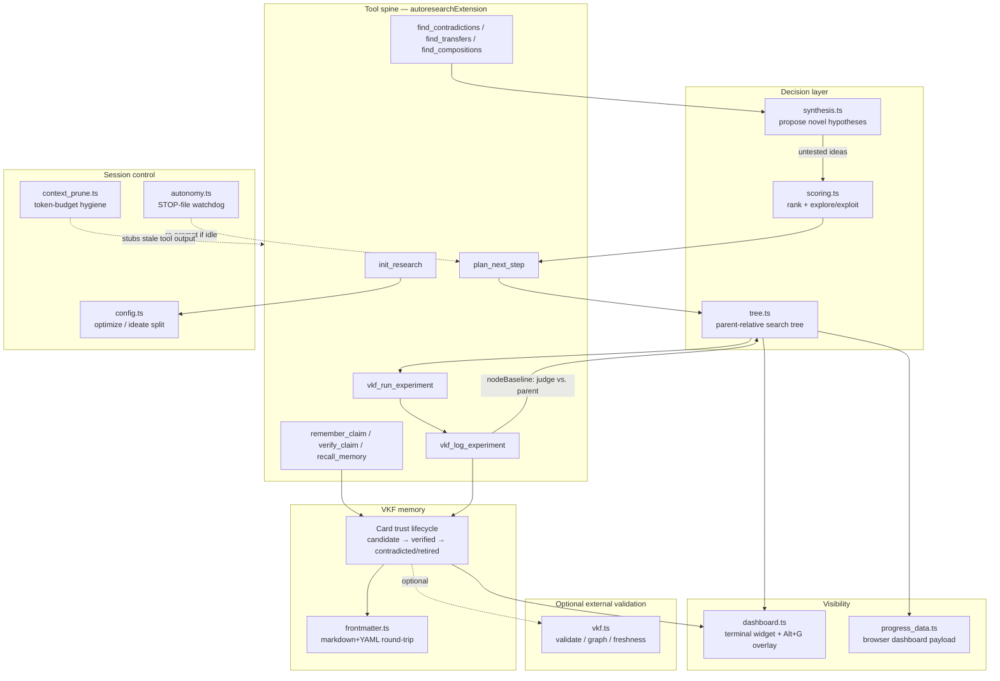

# pi-autoresearch-vkf — what it is and how it fits together

> Grounded code wiki for [EricJahns/pi-autoresearch-vkf](https://github.com/EricJahns/pi-autoresearch-vkf),
> pinned @ `cd8085d` (`v0.10.0-9-gcd8085d`). There is no paper companion for this repo — it is a
> [`pi`](https://pi.dev) coding-agent extension, not a research artifact — but its own CHANGELOG (v0.9.0)
> states its lineage explicitly: "Inspired by agentic tree-search (AIDE, The AI Scientist v2) and RD-Agent's
> structured Research→Development cycle." All three are already in this wiki: see
> [`agentic-tree-search`](../../concepts/agentic-tree-search.md), the
> [ai-scientist-v2 overview](../ai-scientist-v2/overview.md), [`research-development-loop`](../../concepts/research-development-loop.md),
> and the [rd-agent overview](../rd-agent/overview.md). This repo reads as the fourth silo's synthesis of that
> lineage plus this wiki's own [`karpathy/autoresearch`](../autoresearch/overview.md) ratchet pattern (a fixed
> unit of experiment, keep/discard on a metric) — generalized here into a per-node, parent-relative baseline
> instead of one global one.

## In one paragraph
`pi-autoresearch-vkf` turns a blind optimization loop into a self-improving researcher by adding **verifiable
long-term memory**. The loop's stated workflow — "retrieve → extract claims → verify → store → hypothesize →
test → update belief → avoid repeated failures" — is implemented as one `pi` extension:
[`autoresearchExtension`](concepts/extensions-pi-autoresearch-vkf-index.ts.md) registers every tool the host
agent calls, backed by a durable **VKF** (Verifiable Knowledge Format) memory bundle of trust-lifecycle cards
([`cards.ts`](concepts/extensions-pi-autoresearch-vkf-cards.ts.md)) and an **experiment search tree**
([`tree.ts`](concepts/extensions-pi-autoresearch-vkf-tree.ts.md)) that judges each new experiment against its
own parent node rather than one fixed session baseline. A scoring layer ranks candidate ideas transparently
and reserves explore slots for high-altitude bets
([`scoring.ts`](concepts/extensions-pi-autoresearch-vkf-scoring.ts.md)); a separate synthesis layer *proposes*
genuinely novel hypotheses from contradictions, cross-domain transfers, and compositions of already-trusted
claims ([`synthesis.ts`](concepts/extensions-pi-autoresearch-vkf-synthesis.ts.md)) rather than only reranking
ideas someone else supplied. An autonomy watchdog keeps the loop running unattended until a user-created STOP
file or a no-progress cap intervenes, and two dashboards (terminal + browser) make an otherwise-silent
continuous run legible at a glance.

## Core architecture

## Main concepts

### The tool spine — machinery, not domain knowledge
[`index.ts`](concepts/extensions-pi-autoresearch-vkf-index.ts.md) is the extension's single entry point: every
tool the loop exposes is a `pi.registerTool` call inside `autoresearchExtension`, and the file's own header
comment states the split it enforces — "the extension is the machinery; the skills are the domain knowledge."
The loop's shape (init → remember → verify → recall → plan → run → log) is enforced by which state each tool
reads and writes, not by an external scheduler, and a `continuationNote` smuggles the autonomy contract into
every tool result because skill prose fades from context but tool output recurs.

### VKF memory — a trust lifecycle, not a flat store
[`cards.ts`](concepts/extensions-pi-autoresearch-vkf-cards.ts.md) is the durable substrate: every claim or
experiment is a markdown+YAML card whose `MemoryState` (candidate → source_verified/locally_tested/replicated
→ contradicted/retired) picks which of three lifecycle directories it lives in, with every promotion paired to
a transaction record — "never silent." [`frontmatter.ts`](concepts/extensions-pi-autoresearch-vkf-frontmatter.ts.md)
is the hand-rolled parser/emitter underneath it, scoped deliberately to only the YAML subset the extension
itself ever writes.

### The experiment search tree — parent-relative, not one global baseline
[`tree.ts`](concepts/extensions-pi-autoresearch-vkf-tree.ts.md) and
[`experiments.ts`](concepts/extensions-pi-autoresearch-vkf-experiments.ts.md) are this repo's realization of
the CHANGELOG's stated AIDE/AI-Scientist-v2 inspiration: each experiment is a node that branches from a
`parent_id`, and `nodeBaseline` judges it against *that parent's* value, not a single session-wide scalar —
"what makes outcomes attributable in a branching search." `selectExpansion` always attaches its picks to the
single current `bestNode` (it never calls the display-only `frontier`), so unlike the paper-side systems'
multi-node frontier expansion with an LLM/VLM judge, this is a simpler, deterministic hill-climb whose
explore/exploit budget governs which *idea* gets attached, not which *node* is left from.

### Scoring — a transparent, multiplicative priority
[`scoring.ts`](concepts/extensions-pi-autoresearch-vkf-scoring.ts.md) ranks candidate ideas as a product of
bounded factors (expected value, feasibility, evidence, novelty, info gain, altitude affinity, freshness)
divided by cost, "so a ranking is never a black box." Novelty is split into lexical (wording) and *structural*
(how saturated the idea's lever·altitude bucket already is) components specifically so a reworded 12th
hyperparameter tweak can't masquerade as fresh; `selectBalanced` then reserves slots for high-altitude
"explore" bets so safe incremental tweaks can't crowd out conceptual ones.

### Synthesis — proposing hypotheses, not just ranking them
[`synthesis.ts`](concepts/extensions-pi-autoresearch-vkf-synthesis.ts.md) is the one module that generates
genuinely novel, untested claims rather than reranking existing ones: contradiction mining (high topic
similarity, diverging outcome), cross-domain transfer (same mechanism, different context), and composition
(two independently-verified, low-overlap claims combined into one hypothesis "no single source proposes").
The repo's own benchmark harness (`benchmark/`) is built to measure exactly this — ideas discoverable only by
synthesis, not by ranking alone.

### Session control — optimize vs. ideate, and an unattended-safe watchdog
[`config.ts`](concepts/extensions-pi-autoresearch-vkf-config.ts.md) cascades one branching decision (did
`init_research` get a measurable command?) into everything downstream: `sessionMode` becomes `optimize` (a
metric-driven experiment loop) or `ideate` (a ranked research plan with no execution loop) — the module's own
framing reads as this repo's version of the RD-Agent-inspired Research/Development split.
[`autonomy.ts`](concepts/extensions-pi-autoresearch-vkf-autonomy.ts.md) is what makes `optimize`'s continuous
mode safe to leave unattended: a prompted "keep going" is probabilistic, so `shouldContinue` is a deterministic
gate (engagement → autonomy mode → user's STOP file → mode-specific completion → no-progress cap) the
`agent_end` hook consults every turn. [`context_prune.ts`](concepts/extensions-pi-autoresearch-vkf-context_prune.ts.md)
keeps a long unattended run's context small by stubbing stale chatty-tool output in batched,
threshold-triggered passes (never per-turn, to protect the prompt-cache prefix).

### Visibility — because continuous runs are otherwise silent
[`dashboard.ts`](concepts/extensions-pi-autoresearch-vkf-dashboard.ts.md) (an always-on terminal widget plus an
Alt+G fullscreen overlay) and [`progress_data.ts`](concepts/extensions-pi-autoresearch-vkf-progress_data.ts.md)
(the browser dashboard's `data.json` payload, including a CLI-free paper→claim→experiment lineage graph) are
both pure read-projections over the same two on-disk artifacts — the experiment log and the VKF card store —
recomputed fresh on every call rather than patched incrementally.

### Workspace layout and the optional `vkf` CLI bridge
[`paths.ts`](concepts/extensions-pi-autoresearch-vkf-paths.ts.md) is the one seam through which every module
touches the filesystem, built around two root-parameterized contracts (session vs. memory) so the global
cross-project memory bundle is "just another root," not a special case.
[`vkf.ts`](concepts/extensions-pi-autoresearch-vkf-vkf.ts.md) is the extension's only external-process seam:
validation, the typed lineage graph, and freshness checks delegate to the reference `vkf` Python CLI when
present, and degrade cleanly ("memory works, validation skipped") when it isn't.

## How a loop iteration flows
`init_research` picks [`optimize` or `ideate`](concepts/extensions-pi-autoresearch-vkf-config.ts.md). In
`optimize` mode: `find_contradictions`/`find_transfers`/`find_compositions`
([synthesis](concepts/extensions-pi-autoresearch-vkf-synthesis.ts.md)) propose candidate ideas, `plan_next_step`
[ranks and picks one](concepts/extensions-pi-autoresearch-vkf-scoring.ts.md) and
[attaches it to the current best node](concepts/extensions-pi-autoresearch-vkf-tree.ts.md), `vkf_run_experiment`
executes it, and `vkf_log_experiment` judges the result against
[the parent node's value](concepts/extensions-pi-autoresearch-vkf-experiments.ts.md), writes a
[VKF experiment card](concepts/extensions-pi-autoresearch-vkf-cards.ts.md), and refreshes both
[dashboards](concepts/extensions-pi-autoresearch-vkf-dashboard.ts.md). The
[autonomy watchdog](concepts/extensions-pi-autoresearch-vkf-autonomy.ts.md) re-prompts the agent to keep this
cycle going unattended until the metric budget, a no-progress cap, or the user's STOP file ends it.

## Map of the wiki
- *"What tools does the loop expose, and in what order do they fire?"* → [the tool spine](concepts/extensions-pi-autoresearch-vkf-index.ts.md)
- *"How does a claim/experiment become trusted (or get retired)?"* → [VKF cards](concepts/extensions-pi-autoresearch-vkf-cards.ts.md) and [the frontmatter format](concepts/extensions-pi-autoresearch-vkf-frontmatter.ts.md)
- *"How is the next experiment chosen, and what does it compare against?"* → [the search tree](concepts/extensions-pi-autoresearch-vkf-tree.ts.md) and [the experiment log](concepts/extensions-pi-autoresearch-vkf-experiments.ts.md)
- *"How are candidate ideas ranked?"* → [scoring](concepts/extensions-pi-autoresearch-vkf-scoring.ts.md)
- *"Where do genuinely new hypotheses come from?"* → [synthesis](concepts/extensions-pi-autoresearch-vkf-synthesis.ts.md)
- *"What's the optimize/ideate split, and how does the loop stay running unattended?"* → [session config](concepts/extensions-pi-autoresearch-vkf-config.ts.md) and [the autonomy watchdog](concepts/extensions-pi-autoresearch-vkf-autonomy.ts.md)
- *"How does a long run avoid blowing its context budget?"* → [context pruning](concepts/extensions-pi-autoresearch-vkf-context_prune.ts.md)
- *"How do I see what a continuous run is doing?"* → [the terminal dashboard](concepts/extensions-pi-autoresearch-vkf-dashboard.ts.md) and [the browser dashboard payload](concepts/extensions-pi-autoresearch-vkf-progress_data.ts.md)
- *"Where does state live on disk, and what's optional?"* → [workspace layout](concepts/extensions-pi-autoresearch-vkf-paths.ts.md) and [the `vkf` CLI bridge](concepts/extensions-pi-autoresearch-vkf-vkf.ts.md)
- *"What is `<symbol>` exactly (signature, source line, callers)?"* → the per-module catalogs under [`catalog/`](catalog/)
- *"What's the full concept table for this repo?"* → [index.md](index.md)
- *"How does this compare to AIDE / The AI Scientist v2's tree search, or RD-Agent's Research→Development split?"* → [`agentic-tree-search`](../../concepts/agentic-tree-search.md) and [`research-development-loop`](../../concepts/research-development-loop.md)
