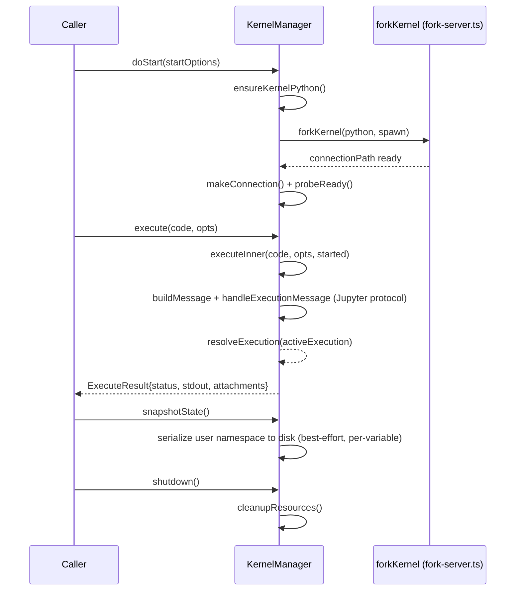

# KernelManager — a forked, snapshotted Jupyter kernel as the RLM execution substrate

## Overview

`KernelManager` is Prime Agent's RLM execution substrate: a real Jupyter-protocol kernel the model's
generated code runs in, reached via [`execute`](../catalog/packages/coding-agent/src/core/kernel/index.ts.md#KernelManager.execute).
Two design choices distinguish it from a bare subprocess exec — kernels are **forked** from a shared
template rather than cold-started, and kernel state can be **snapshotted to disk** — both aimed at making
repeated, cheap kernel spin-up practical for a system that spawns child RLM sessions on demand (the
`rlm(...)` sub-agent calls the [prime-agent-launch.md](../../../sources/prime-agent-launch.md) source page
describes).

## Diagram

## Design rationale (why it's built this way)

**Kernels fork from a shared template instead of cold-starting.** [`forkKernel`](../catalog/packages/coding-agent/src/core/kernel/fork-server.ts.md#forkKernel) —
*"Fork a kernel onto `spawn.connectionPath` from the shared template for this..."* — is called from
[`doStart`](../catalog/packages/coding-agent/src/core/kernel/index.ts.md#KernelManager.doStart) rather than
launching a fresh interpreter process each time; this is the practical answer to the cost RLM's own paper
flags (spawning a child RLM session per sub-call needs a cheap kernel, not a multi-second cold Python
start).

**State is snapshotted per-variable, best-effort, not as an all-or-nothing dump.**
[`snapshotState`](../catalog/packages/coding-agent/src/core/kernel/index.ts.md#KernelManager.snapshotState) —
*"Serialize the user namespace to disk (best-effort, per-variable). No-op when..."* — degrades gracefully
per variable rather than failing the whole snapshot if one object in the namespace can't be serialized,
which matters because a REPL namespace holding arbitrary model-generated objects will routinely contain
things that don't serialize cleanly.

**Execution goes through the real Jupyter wire protocol, not a custom RPC.** [`handleExecutionMessage`](../catalog/packages/coding-agent/src/core/kernel/index.ts.md#KernelManager.handleExecutionMessage)
takes a `JupyterMessage`, and [`buildMessage`](../catalog/packages/coding-agent/src/core/kernel/index.ts.md#buildMessage)
constructs outgoing ones — using the standard protocol (rather than inventing a bespoke one) is what lets
this kernel manager talk to an ordinary IPython kernel process rather than requiring a custom kernel
implementation.

## Entry points
- [`KernelManager.execute`](../catalog/packages/coding-agent/src/core/kernel/index.ts.md#KernelManager.execute) —
  the public entry point; queues via `enqueueExecute` and schedules a snapshot.
- [`KernelManager.doStart`](../catalog/packages/coding-agent/src/core/kernel/index.ts.md#KernelManager.doStart) —
  provisions Python, forks the kernel, establishes the connection, and probes readiness before the manager
  is usable.
- [`KernelManager.shutdown`](../catalog/packages/coding-agent/src/core/kernel/index.ts.md#KernelManager.shutdown) —
  clean teardown, optionally snapshotting state first.

## Mechanism (step-by-step)
1. [`doStart`](../catalog/packages/coding-agent/src/core/kernel/index.ts.md#KernelManager.doStart) calls
   [`ensureKernelPython`](../catalog/packages/coding-agent/src/core/kernel/bootstrap.ts.md#ensureKernelPython)
   to guarantee a usable Python is available, then
   [`forkKernel`](../catalog/packages/coding-agent/src/core/kernel/fork-server.ts.md#forkKernel) to spin up
   the actual kernel process from the shared template.
2. [`makeConnection`](../catalog/packages/coding-agent/src/core/kernel/index.ts.md#makeConnection) and
   [`probeReady`](../catalog/packages/coding-agent/src/core/kernel/index.ts.md#KernelManager.probeReady)
   establish and verify the connection before any code execution is accepted.
3. [`execute`](../catalog/packages/coding-agent/src/core/kernel/index.ts.md#KernelManager.execute) queues a
   code string; [`executeInner`](../catalog/packages/coding-agent/src/core/kernel/index.ts.md#KernelManager.executeInner)
   builds and sends the Jupyter execute-request message and awaits the corresponding reply via
   [`handleExecutionMessage`](../catalog/packages/coding-agent/src/core/kernel/index.ts.md#KernelManager.handleExecutionMessage).
4. [`resolveExecution`](../catalog/packages/coding-agent/src/core/kernel/index.ts.md#KernelManager.resolveExecution)
   finalizes the pending execution into an `ExecuteResult` (`status`, `stdout`, `attachments`).
5. On shutdown, [`cleanupResources`](../catalog/packages/coding-agent/src/core/kernel/index.ts.md#KernelManager.cleanupResources)
   tears down the forked process, optionally preceded by a
   [`snapshotState`](../catalog/packages/coding-agent/src/core/kernel/index.ts.md#KernelManager.snapshotState) call.

## Key data structures
- `ExecuteResult` — [`status`](../catalog/packages/coding-agent/src/core/kernel/index.ts.md#ExecuteResult.status)
  (`"error" | "aborted" | "ok"`), [`stdout`](../catalog/packages/coding-agent/src/core/kernel/index.ts.md#ExecuteResult.stdout),
  and attachments — the uniform per-execution result shape.

## See also
- [`packages-coding-agent-src-core-refinement-refinement.ts`](packages-coding-agent-src-core-refinement-refinement.ts.md) —
  Prime Agent's other core abstraction (Continual Harness), operating independently of this kernel.
- [`rlm-core-rlm`](../../rlm/concepts/rlm-core-rlm.md) — the Python reference implementation of the same RLM
  paradigm, using IPython/subprocess kernels directly rather than a forked-template Jupyter kernel manager.
