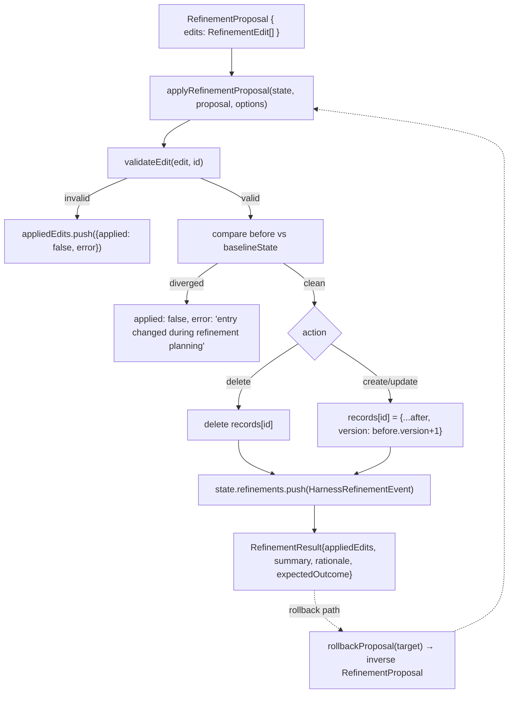

# refinement.ts — /refine's CRUD engine with optimistic concurrency and rollback

<!-- connect:up:begin -->
> **Cross-repo concept:** part of [self-referential-code-rewriting](../../../concepts/self-referential-code-rewriting.md) across this wiki's repos.
<!-- connect:up:end -->
## Overview

`refinement.ts` is Prime Agent's TypeScript implementation of the same mechanism
[continual-harness](../../continual-harness/concepts/agents-utils-harness_evolver.md)'s Python
`HarnessEvolver` implements — a `RefinementKind` type of exactly `"prompt" | "memory" | "skill" |
"subagent"`, and `applyRefinementProposal` applying a batch of `create`/`update`/`delete` edits against a
persisted `HarnessState`. It goes further than the Python original in two ways worth noting: it detects
concurrent modification before applying an edit, and it can construct the *inverse* of any applied
refinement for rollback.

## Diagram

## Design rationale (why it's built this way)

**Optimistic concurrency, not a lock.** Before applying any `update`/`delete`, `applyRefinementProposal`
compares the entry's current state against a caller-supplied `baselineState` snapshot; if they've diverged
and this edit's key wasn't itself modified earlier in the same batch, the edit is rejected with `"entry
changed during refinement planning"` rather than silently overwriting a change made since the proposal was
formed. This defends against the same class of problem [continual-harness](../../continual-harness/overview.md)'s
Python CRUD (a bare `store.update(sid, **fields)`) does not check for.

**Every entry is versioned, and history is append-only, not overwrite-only.** `after.version = before ?
before.version + 1 : 1` — every applied edit bumps a monotonic version counter, and every refinement
(whether it succeeded, partially succeeded, or was entirely rejected) is logged as a
`HarnessRefinementEvent` (`trigger`, `changes`, `evidence`, `outcome`) appended to `state.refinements`, not
replacing prior history.

**Rollback is a derived inverse proposal, not a stored snapshot restore.** `rollbackProposal` walks a prior
`RefinementResult`'s `appliedEdits` in reverse and synthesizes the opposite edits (an applied `update`
becomes an `update` restoring the prior `before` content; an applied `create` becomes a `delete`) — then
feeds that synthesized proposal back through the *same* `applyRefinementProposal` path. Rollback is not a
special code path with its own risk of drifting from forward-apply semantics; it's the same function
called with inverted input.

**A create/update is validated against the wire format before it's ever applied**, separately from the
concurrency check — malformed or incomplete edits (e.g. a skill edit missing a callable or call pattern) are
rejected with a specific error message per edit, and each rejection is still recorded in `appliedEdits`
with `applied: false` rather than aborting the whole batch, matching the same
[per-item-not-per-pass fault isolation](../../continual-harness/concepts/agents-utils-harness_evolver.md)
philosophy the Python `HarnessEvolver` uses.

## Key data structures
- `HarnessEntry` — `id`, `kind` (one of the four `RefinementKind`s), `title`, `content`, `path`, `scope`
  (`"local" | "global"`), `version`, `created_at`/`updated_at` — the persisted unit every CRUD edit targets.
- `RefinementProposal` — `edits: RefinementEdit[]` plus `summary`/`rationale`/`expectedOutcome` — the model's
  structured self-edit plan, directly analogous to
  [continual-harness](../../continual-harness/concepts/agents-utils-harness_evolver.md)'s
  `create`/`update`/`retire` JSON response shape.
- `HarnessState` — the full persisted harness, `entries` keyed by kind, plus the append-only `refinements`
  event log.

## Edge cases
- A `create` targeting an `id` that already exists, or an `update`/`delete` targeting one that doesn't,
  both fail with a specific error (`"entry already exists"` / `"entry not found"`) rather than silently
  succeeding or silently no-op-ing.
- Scope defaults to `"local"` only when neither the edit nor the existing entry nor the caller's `options`
  specify one — a three-level fallback chain (`before?.scope ?? options.scope ?? "local"`).

## See also
- [`agents-utils-harness_evolver`](../../continual-harness/concepts/agents-utils-harness_evolver.md) — the
  Python implementation of the same paper mechanism, in the repo the paper's own reference code lives in;
  this page is the product (TypeScript) reimplementation.
- [`packages-coding-agent-src-core-kernel-index.ts`](packages-coding-agent-src-core-kernel-index.ts.md) —
  the RLM half of Prime Agent's two core abstractions.
