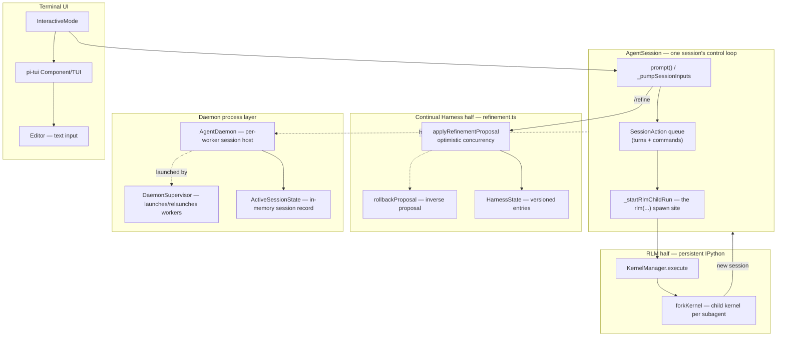

# prime-agent — what it is and how it fits together

> Grounded code wiki for [PrimeIntellect-ai/prime-agent](https://github.com/PrimeIntellect-ai/prime-agent),
> pinned @ `a3b3e75349`. This is the *implementation* companion to the launch-post summary in
> [`../../sources/prime-agent-launch.md`](../../sources/prime-agent-launch.md), and the TypeScript
> reimplementation of two mechanisms this wiki already grounds elsewhere:
> [`rlm`](../rlm/overview.md) (Recursive Language Models — [`sources/recursive-language-models.md`](../../sources/recursive-language-models.md))
> and [`continual-harness`](../continual-harness/overview.md) (the Refiner —
> [`sources/continual-harness.md`](../../sources/continual-harness.md)). Read those for *what each mechanism
> claims and why it matters*; read this for *how the shipped product composes both into one coding agent*.
> Built on `earendil-works/pi` (confirmed from the README's own Acknowledgements — not `badlogic/pi-mono`,
> despite that repo appearing in the README's header link row).

## In one paragraph
Prime Agent composes two independently-grounded mechanisms into one coding/research agent. RLM's
`rlm(...)` becomes a real spawn against a persistent IPython process
([`KernelManager`](concepts/packages-coding-agent-src-core-kernel-index.ts.md)), dispatched from
[`AgentSession._startRlmChildRun`](concepts/packages-coding-agent-src-core-agent-session.ts.md) — the
context-as-REPL-variable design reimplemented as a coding agent's own kernel/tool boundary, not a port of
the Python REPL-variable substitution directly. Continual Harness's evidence-backed `/refine` becomes
[`refinement.ts`](concepts/packages-coding-agent-src-core-refinement-refinement.ts.md)'s
`applyRefinementProposal` — a CRUD engine over `HarnessEntry` records that goes further than the Python
original by detecting concurrent modification via optimistic concurrency before applying an edit, and by
deriving rollback as an *inverse proposal* rather than a stored snapshot restore. Wrapping both mechanisms
is a daemon-process layer ([`AgentDaemon`](concepts/packages-coding-agent-src-modes-daemon-daemon-mode.ts.md),
[`DaemonSupervisor`](concepts/packages-coding-agent-src-modes-daemon-daemon-supervisor.ts.md)) that keeps
sessions — including RLM subagents — running across terminal disconnects and process crashes, plus a
terminal UI ([`InteractiveMode`](concepts/packages-coding-agent-src-modes-interactive-interactive-mode.ts.md),
built on [`pi-tui`](concepts/packages-tui-src-tui.ts.md)) for interactive use.

## Core architecture

## Main concepts
- **The RLM half.** [`kernel/index.ts`](concepts/packages-coding-agent-src-core-kernel-index.ts.md)'s
  `KernelManager` owns the persistent IPython process every session's code execution runs against, and
  [`agent-session.ts`](concepts/packages-coding-agent-src-core-agent-session.ts.md)'s `_startRlmChildRun` is
  the concrete spawn site where an `rlm(...)` call becomes a new child session.
- **The Continual Harness half.** [`refinement.ts`](concepts/packages-coding-agent-src-core-refinement-refinement.ts.md)
  is the full `/refine` CRUD engine — optimistic concurrency, versioned entries, append-only refinement
  history, and inverse-proposal rollback. See
  [`rlm-continual-harness-composition`](doc-concepts/rlm-continual-harness-composition.md) for the detailed
  compare against the Python `HarnessEvolver`.
- **Cross-session messaging.** [`agent-messages.ts`](concepts/packages-coding-agent-src-core-agent-messages.ts.md)'s
  `AgentSessionMessage` is the addressing layer beneath cross-session RLM communication — how a parent and
  an RLM child (or two named agents) exchange messages outside the in-process `rlm(...)` call.
- **The queued-action model.** [`session-action-store.ts`](concepts/packages-coding-agent-src-core-session-action-store.ts.md)'s
  `SessionAction` (turn vs. command, with lifecycle state) is what `AgentSession._pumpSessionInputs` selects
  from on every loop iteration.
- **Session persistence.** [`session-manager.ts`](concepts/packages-coding-agent-src-core-session-manager.ts.md)
  stores the append-only conversation tree; [`messages.ts`](concepts/packages-coding-agent-src-core-messages.ts.md)
  and [`pi-agent-core`'s base types](concepts/packages-agent-src-types.ts.md) /
  [`pi-ai`'s model types](concepts/packages-ai-src-types.ts.md) define what a message/model actually is.
- **The daemon process layer.** [`daemon-mode.ts`](concepts/packages-coding-agent-src-modes-daemon-daemon-mode.ts.md)
  hosts sessions per worker process; [`daemon-supervisor.ts`](concepts/packages-coding-agent-src-modes-daemon-daemon-supervisor.ts.md)
  launches and relaunches those workers; [`active-session-state.ts`](concepts/packages-coding-agent-src-modes-daemon-active-session-state.ts.md)
  and [`daemon-session-list.ts`](concepts/packages-coding-agent-src-modes-daemon-daemon-session-list.ts.md)
  are the in-memory record and its client-facing projection; [`cron-jobs.ts`](concepts/packages-coding-agent-src-core-cron-jobs.ts.md)
  backs heartbeats and schedules. See
  [`long-running-agent-continuity`](doc-concepts/long-running-agent-continuity.md).
- **Extensibility.** [`extensions-types.ts`](concepts/packages-coding-agent-src-core-extensions-types.ts.md)
  is the extension API surface; [`package-manager.ts`](concepts/packages-coding-agent-src-core-package-manager.ts.md)
  resolves skills/extensions/prompts/themes from git/npm/local sources.
- **Auth and settings.** [`auth-storage.ts`](concepts/packages-coding-agent-src-core-auth-storage.ts.md) and
  [`settings-manager.ts`](concepts/packages-coding-agent-src-core-settings-manager.ts.md) are the
  provider-credential and general-config layers, orthogonal to the two core mechanisms.
- **Terminal UI.** [`interactive-mode.ts`](concepts/packages-coding-agent-src-modes-interactive-interactive-mode.ts.md)
  drives the chat TUI on [`pi-tui`'s `Component`/`TUI`](concepts/packages-tui-src-tui.ts.md) framework, using
  [`Editor`](concepts/packages-tui-src-components-editor.ts.md) for text input and
  [`theme.ts`](concepts/packages-coding-agent-src-modes-interactive-theme-theme.ts.md) for styling.
  [`agents-view-mode.ts`](concepts/packages-coding-agent-src-modes-agents-view-agents-view-mode.ts.md) is
  the multi-session dashboard variant. [`agent-connection-types.ts`](concepts/packages-coding-agent-src-modes-agent-connection-types.ts.md)
  and [`daemon-protocol.ts`](concepts/packages-coding-agent-src-modes-daemon-daemon-protocol.ts.md) define
  the client↔daemon wire contract both UIs speak.

## How a run flows
`prime-agent` starts [`InteractiveMode`](concepts/packages-coding-agent-src-modes-interactive-interactive-mode.ts.md)
(or attaches to a running [`AgentDaemon`](concepts/packages-coding-agent-src-modes-daemon-daemon-mode.ts.md)
worker via [`daemon-protocol.ts`](concepts/packages-coding-agent-src-modes-daemon-daemon-protocol.ts.md)),
which drives an [`AgentSession`](concepts/packages-coding-agent-src-core-agent-session.ts.md). A user prompt
becomes a [`SessionAction`](concepts/packages-coding-agent-src-core-session-action-store.ts.md) the pump
selects and executes; model-generated code runs against the session's persistent
[`KernelManager`](concepts/packages-coding-agent-src-core-kernel-index.ts.md) IPython process, and any
`rlm(...)` call inside that code triggers `_startRlmChildRun`, which either spawns an in-process child
session or, via [`AgentDaemon.createRlmSubagentRuntime`](concepts/packages-coding-agent-src-modes-daemon-daemon-mode.ts.md),
a fully independent daemon-hosted one. A `/refine` command instead routes to
[`refinement.ts`](concepts/packages-coding-agent-src-core-refinement-refinement.ts.md), which validates and
applies a proposed batch of harness edits against the versioned `HarnessState`, logging the result whether
it succeeded or was rejected. Across all of this, [`DaemonSupervisor`](concepts/packages-coding-agent-src-modes-daemon-daemon-supervisor.ts.md)
keeps the worker process alive (and relaunches it on crash) so a detached terminal can reattach later and
find the same session, RLM children included, exactly where it left off.

## Map of the wiki
- *"How do the two core abstractions compose?"* → [`rlm-continual-harness-composition`](doc-concepts/rlm-continual-harness-composition.md).
- *"How does `/refine` actually work?"* → [`refinement.ts`](concepts/packages-coding-agent-src-core-refinement-refinement.ts.md).
- *"How does `rlm(...)` spawn a child agent?"* → [`kernel/index.ts`](concepts/packages-coding-agent-src-core-kernel-index.ts.md),
  [`agent-session.ts`](concepts/packages-coding-agent-src-core-agent-session.ts.md).
- *"How do sessions survive terminal disconnects?"* → [`long-running-agent-continuity`](doc-concepts/long-running-agent-continuity.md).
- *"What's the security/trust model?"* → [`prime-agent-trust-model`](doc-concepts/prime-agent-trust-model.md).
- *Exhaustive per-module symbol index* → [`catalog/`](catalog/); *concept table + coverage* →
  [`index.md`](index.md).

## Cross-repo concepts
[`refinement.ts`](concepts/packages-coding-agent-src-core-refinement-refinement.ts.md) is tagged
[`self-referential-code-rewriting`](../../concepts/self-referential-code-rewriting.md) — the same class of
self-modification target ([`continual-harness`](../continual-harness/overview.md)'s `HarnessEvolver`) that
concept page already tracks, now with a second, independently-engineered implementation to compare against.
No other page in this silo carries an explicit vocabulary tag — the daemon/kernel/UI infrastructure is
product engineering supporting the two tagged mechanisms, not a distinct instance of anything in this
wiki's cross-paper concept set.

**Not a vocabulary concept, but a direct dependency worth naming:**
[`pi-autoresearch-vkf`](../pi-autoresearch-vkf/overview.md) — already in this wiki — is "a `pi` coding-agent
extension" registering tools "the host agent calls," i.e. it targets exactly the
[`ExtensionAPI`](concepts/packages-coding-agent-src-core-extensions-types.ts.md)/[package-manager](concepts/packages-coding-agent-src-core-package-manager.ts.md)
surface this silo implements. It is not a fork of prime-agent (it has its own upstream, `EricJahns/pi-autoresearch-vkf`,
against the same `pi` CLI framework prime-agent ships), but it is loadable *into* a `pi`-family agent like
prime-agent through this exact mechanism — the two silos are extension and host, not parent and derivative.
