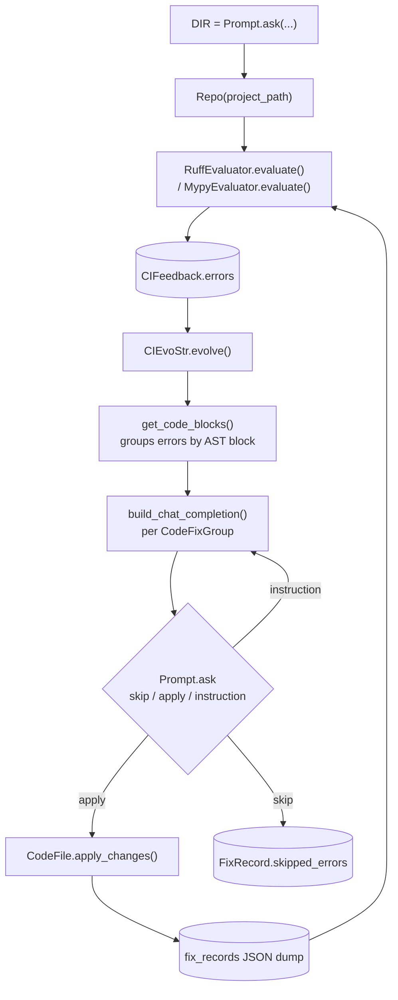

# rdagent/app/CI/run.py — the evolving-agent framework turned on lint errors

## Overview
This module is not a cloud CI pipeline — it is an interactive, human-supervised script a developer runs
locally (it prompts for a project directory on import; there is no `main()`) that repurposes RD-Agent's own
core evolving-agent abstractions — the same `Evaluator`/`EvolvingStrategy`/`EvoStep` base classes the
Co-STEER coding agent builds on to write ML pipeline code — to fix `ruff`/`mypy` findings in an arbitrary
Python repository, one AST-derived code block at a time, with a human approving (skip / apply / free-text
instruction) every proposed edit before anything touches disk. It is best read as the minimal possible
instantiation of the framework's generic "propose a fix → evaluate → feed back" shape: one `Evaluator`, one
`EvolvingStrategy`, no hypothesis generation, no multi-component pipeline.

## Diagram

## Design rationale (why it's built this way)
The script reuses [`Feedback`](../catalog/rdagent/core/evaluation.md#Feedback), the abstract `Evaluator`
class's own [`evaluate`](../catalog/rdagent/core/evaluation.md#Evaluator.evaluate) contract, and
[`EvolvableSubjects`](../catalog/rdagent/core/evolving_framework.md#EvolvableSubjects) directly rather than a
bespoke lint-fixing loop: [`CIFeedback`](../catalog/rdagent/app/CI/run.md#CIFeedback) **is-a** `Feedback` in
the exact same class family as [`CoSTEERSingleFeedback`](../catalog/rdagent/components/coder/CoSTEER/evaluators.md#CoSTEERSingleFeedback),
[`CoSTEERSingleFeedbackDeprecated`](../catalog/rdagent/components/coder/CoSTEER/evaluators.md#CoSTEERSingleFeedbackDeprecated),
[`ExperimentFeedback`](../catalog/rdagent/core/proposal.md#ExperimentFeedback) and
[`HypothesisFeedback`](../catalog/rdagent/core/proposal.md#HypothesisFeedback); and
[`Repo`](../catalog/rdagent/app/CI/run.md#Repo) **is-a** `EvolvableSubjects` in the same family as
[`EvolvingItem`](../catalog/rdagent/components/coder/CoSTEER/evolvable_subjects.md#EvolvingItem), the DS/FT
coding agents' own evolving subject. This is a real, cited class relationship, not just a naming
coincidence — the exact same evolve/evaluate/feedback protocol that drives an autonomous multi-day MLE-Bench
run also drives this single-purpose lint-fixing tool.

> [!inferred] Given the module lives under `rdagent/app/CI/` and its closing comment tells the user to
> `git add -u && git commit --no-verify` directly, its evident purpose is to run this loop against
> RD-Agent's *own* source tree as a hygiene step before committing. That would make it a case of the
> framework editing its own host repository's code with its own agent abstractions — but the code itself
> prompts interactively for an arbitrary project directory and is not hard-wired to RD-Agent's own path, so
> nothing here actually restricts it to that use. Despite the superficial resemblance, this does **not**
> meet the bar for this wiki's [`self-referential-code-rewriting`](../../../concepts/self-referential-code-rewriting.md)
> concept, which specifically requires the edited code to be the agent's *own problem-solving apparatus* in
> a way that changes its ability to make its *next* edit — here the target is always someone else's (or the
> author's own, but generic) lint findings, and the `Evaluator`/`EvolvingStrategy` classes doing the editing
> are never themselves in scope for editing. It is a self-*application* of the framework's classes, not
> self-referential rewriting in that stricter sense — worth naming so the resemblance isn't mistaken for it.

Grouping errors by AST-derived code blocks ([`get_code_blocks`](../catalog/rdagent/app/CI/run.md#CodeFile.get_code_blocks),
default `max_lines=30`) rather than by individual finding or whole file is a context-budget decision: each
LLM chat session is seeded with the entire file once and then repeatedly asked to patch one bounded block —
keeping per-turn context small while letting the model see the whole file's context up front.

Every proposed fix is staged, diffed, and requires an explicit human decision
(`skip`/`apply`/free-text instruction) before [`apply_changes`](../catalog/rdagent/app/CI/run.md#CodeFile.apply_changes)
ever touches a file — full autonomy is *not* the default here, unlike the Data-Science/Finetune applications'
`SkipInteractor` default (see [`rdagent-app-data_science-conf`](rdagent-app-data_science-conf.md)). This is
the most heavily human-supervised instantiation of the evolving-agent pattern in the repo.

The [`fix_records`](../catalog/rdagent/app/CI/run.md#fix_records) dict maintains its own bespoke, per-round
JSON audit trail — one record per file, splitting
[skipped](../catalog/rdagent/app/CI/run.md#FixRecord.skipped_errors) vs.
[directly-fixed](../catalog/rdagent/app/CI/run.md#FixRecord.directly_fixed_errors) vs.
[manually-fixed](../catalog/rdagent/app/CI/run.md#FixRecord.manually_fixed_errors) errors — but that is not
the *only* record of what happened. Every `build_chat_completion` call the script
makes transitively goes through [`build_chat_completion`](../catalog/rdagent/oai/backend/base.md#ChatSession.build_chat_completion),
which unconditionally calls [`log_object`](../catalog/rdagent/log/logger.md#RDAgentLog.log_object) tagged
`"debug_llm"` under the current session's [`tag`](../catalog/rdagent/log/logger.md#RDAgentLog.tag) context —
writing every prompt/response pair into the exact same
[`FileStorage`](../catalog/rdagent/log/storage.md#FileStorage)/[`RDAgentLog`](../catalog/rdagent/log/logger.md#RDAgentLog)
tree the Data-Science and Finetune loops use for their own logging, via the same
[`storage`](../catalog/rdagent/log/logger.md#RDAgentLog.storage) and
[`other_storages`](../catalog/rdagent/log/logger.md#RDAgentLog.other_storages) machinery
(`refresh_storages_from_settings`, [cite](../catalog/rdagent/log/logger.md#RDAgentLog.refresh_storages_from_settings)).
A CI-fixing session therefore leaves two independent trails: the script's own human-readable JSON
`fix_records`, and an invisible, fully generic LLM-conversation log that would render in the same Streamlit
log viewers the rest of the repo uses — including the (superseded) one described in
[`rdagent-log-ui-web`](rdagent-log-ui-web.md), if pointed at this session's log folder.

## Entry points
- **The module top level itself** is the true entry point (`python -m rdagent.app.CI.run`) — there is no
  `main()`. From `DIR = Prompt.ask(...)` it repeatedly prompts for a project directory, constructs a
  [`Repo`](../catalog/rdagent/app/CI/run.md#Repo), and drives rounds of `multistep_evolve` until the human
  answers "n" to "Start next round?".
- [`evaluate`](../catalog/rdagent/app/CI/run.md#RuffEvaluator.evaluate) /
  [`evaluate`](../catalog/rdagent/app/CI/run.md#MypyEvaluator.evaluate) — the two concrete `Evaluator`
  implementations; the script currently instantiates only `RuffEvaluator()` by default, with the
  `MultiEvaluator(MypyEvaluator(), RuffEvaluator())` combination present in source but commented out — mypy
  checking is wired in but disabled by a code comment, not a config flag.

## Mechanism (step-by-step)
1. [`Repo`](../catalog/rdagent/app/CI/run.md#Repo)'s constructor walks `project_path`, excludes anything
   `git status --ignored` reports plus caller-supplied excludes, and indexes every remaining `.py` file as a
   `CodeFile`, storing the result in [`files`](../catalog/rdagent/app/CI/run.md#Repo.files). This file set is
   captured once, at construction — it defines the fixed universe every evaluator and fix round can see for
   the remainder of the session (see Edge cases).

2. [`evaluate`](../catalog/rdagent/app/CI/run.md#RuffEvaluator.evaluate)/[`evaluate`](../catalog/rdagent/app/CI/run.md#MypyEvaluator.evaluate)
   shell out to `ruff`/`mypy`, regex-parse each tool's own human-readable stdout back into structured
   [`CIError`](../catalog/rdagent/app/CI/run.md#CIError) records (`code`, `msg`, `line`, `column` all cited),
   and silently drop any error whose file isn't in `evo.files` — a defensive filter in case the underlying
   tool's scope is wider than the `Repo`'s own excludes.

3. `CIEvoStr.evolve` — the `EvolvingStrategy` — groups each file's errors by
   [`get_code_blocks`](../catalog/rdagent/app/CI/run.md#CodeFile.get_code_blocks), then opens **one** LLM
   chat session per group: it calls `APIBackend()` — which in this module resolves to the module-level alias
   [`APIBackend`](../catalog/rdagent/oai/llm_utils.md#APIBackend) (`= get_api_backend`, a *function*, not the
   ABC of the same name) — so `api = APIBackend()` is really invoking
   [`get_api_backend`](../catalog/rdagent/oai/llm_utils.md#get_api_backend), which itself uses
   [`import_class`](../catalog/rdagent/core/utils.md#import_class) to dynamically resolve whichever concrete
   backend [`LLM_SETTINGS`](../catalog/rdagent/oai/llm_conf.md#LLM_SETTINGS) names. Reading `APIBackend()` as
   "construct the `APIBackend` class" is the wrong mental model here — it's a factory call through one layer
   of indirection.

4. Each group's session is seeded once with the whole file
   ([`build_chat_completion`](../catalog/rdagent/oai/backend/base.md#ChatSession.build_chat_completion) via
   [`build_chat_session`](../catalog/rdagent/oai/backend/base.md#APIBackend.build_chat_session)), then asked
   to fix that block's errors specifically; the model's response text accumulates in
   [`responses`](../catalog/rdagent/app/CI/run.md#CIEvoStr.evolve.CodeFixGroup.responses) — a locally-scoped
   dataclass field, not a top-level structure, so it exists only for the lifetime of one `evolve()` call.

5. For each group the human is shown a diff and asked to `skip`/`apply`/give a free-text instruction:
   `apply` extracts the model's fenced Python code block, and — using the model's own accompanying JSON
   list of which specific `line:column` positions it claims to have fixed — splits the group's errors into
   [`directly_fixed_errors`](../catalog/rdagent/app/CI/run.md#FixRecord.directly_fixed_errors) (no JSON
   given) or [`manually_fixed_errors`](../catalog/rdagent/app/CI/run.md#FixRecord.manually_fixed_errors)
   /[`skipped_errors`](../catalog/rdagent/app/CI/run.md#FixRecord.skipped_errors) depending on whether that
   specific position appears in the model's claim; a free-text instruction re-prompts the *same* session
   rather than starting a new one, so the conversation's history persists across correction rounds.

6. [`apply_changes`](../catalog/rdagent/app/CI/run.md#CodeFile.apply_changes) applies every accepted
   `(start, end, new_code)` edit to one file in a single pass, tracking a running line-count `offset` so
   edits earlier in the file don't shift the positions of edits later in the same file, then reloads the
   file so the *next* group in the same round sees up-to-date line numbers via
   [`get`](../catalog/rdagent/app/CI/run.md#CodeFile.get).

7. The top-level `while True` loop re-`evaluate`s the whole `Repo` after every round, appends an `EvoStep`
   ([`feedback`](../catalog/rdagent/core/evolving_framework.md#EvoStep.feedback) cited) to the evolving
   trace, and dumps [`fix_records`](../catalog/rdagent/app/CI/run.md#fix_records) to a fresh timestamped JSON
   file — until the human declines another round, printing a per-checker skipped/directly-fixed/manually-fixed
   statistics table (via [`CIFeedback.statistics`](../catalog/rdagent/app/CI/run.md#CIFeedback.statistics)) on
   the way.

## Key data structures
- [`CIError`](../catalog/rdagent/app/CI/run.md#CIError) / [`CIFeedback`](../catalog/rdagent/app/CI/run.md#CIFeedback)
  (its `errors` dict cited) — one dataclass per lint finding, grouped per file.
- [`FixRecord`](../catalog/rdagent/app/CI/run.md#FixRecord.skipped_errors) — the per-round audit trail (its
  skipped/directly-fixed/manually-fixed lists), rebuilt fresh every call to `evolve()` (see Edge cases), not
  accumulated across rounds.
- The locally-defined `CodeFixGroup` dataclass (`responses` cited) — an ephemeral, per-code-block record
  (line range, errors, chat session id, accumulated LLM responses) that exists only for one `evolve()` call
  and is never persisted.

## Dynamics (design intent)
Single-threaded, synchronous, and human-paced: there is no concurrency anywhere in this module, and the tool
intentionally blocks on `Prompt.ask` for every single fix group, so wall-clock time is dominated by human
review rather than by the evolving loop itself. This is the opposite dynamic from the Data-Science/Finetune
applications' async, budget-driven `async_gen` router (see
[`rdagent-app-data_science-conf`](rdagent-app-data_science-conf.md)) — both build on the same core
interfaces, but one is designed to run for hours unattended and the other is designed to be watched turn by
turn.

## Edge cases
- [`files`](../catalog/rdagent/app/CI/run.md#Repo.files) is captured once at `Repo` construction; a file
  created fresh mid-session would never be picked up by any subsequent evaluate/evolve round, only files
  that existed when `Repo()` was built.
- `fix_records` is rebuilt as an empty `defaultdict` at the top of every `evolve()` call and is only
  populated at all `if len(evolving_trace) > 0` (i.e. it's entirely skipped on the very first round) — the
  JSON dumped after round *N* reflects only round *N*'s decisions, not a cumulative history across rounds.
- `FA100`/`FA102` findings (missing `from __future__ import annotations`) are handled by unconditionally
  prepending the import at line 1 on any occurrence, without checking for an existing module docstring or
  shebang line that must precede it — a plausible source of malformed output on files where that import
  can't legally go first.

## Open questions
- Whether the free-text "manual instruction" loop reliably terminates if the model never returns a
  well-formed fenced code block isn't fully resolved by this packet — the code-extraction `re.search` is
  guarded but the surrounding control flow for that failure path extends beyond what's in the Subgraph here.
- Whether this script is genuinely used as part of a CI workflow (despite its `app/CI` location) or is
  purely a local developer tool isn't settled by the source alone.

## See also
- [`rdagent-app-data_science-conf`](rdagent-app-data_science-conf.md) — the fully-autonomous, async,
  budget-driven counterpart built on the same core `Evaluator`/evolving-agent interfaces.
- [`rdagent-log-ui-web`](rdagent-log-ui-web.md) — where this session's transitively-logged LLM
  conversations would surface if replayed through a log viewer.
- [`../../../concepts/self-referential-code-rewriting.md`](../../../concepts/self-referential-code-rewriting.md) —
  the stricter concept this module resembles but, per the reasoning above, does not instantiate.
