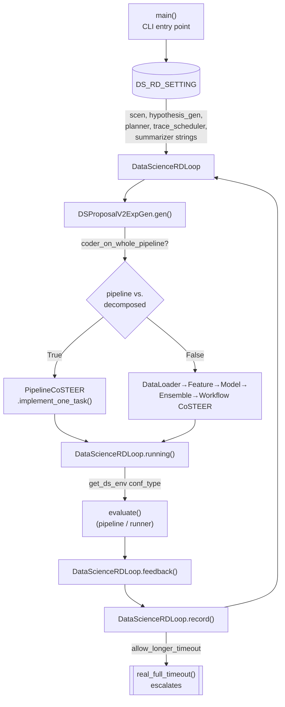

# DS_RD_SETTING — the Data-Science / MLE-Bench application config

## Overview
[`DS_RD_SETTING`](../catalog/rdagent/app/data_science/conf.md#DS_RD_SETTING) is a single pydantic-settings
singleton (`DataScienceBasePropSetting`) that wires the generic Research→Development loop to the concrete
Kaggle / MLE-Bench "data science" application: which `Scenario`, planner, hypothesis-generation router and
trace-scheduler classes implement Research; which summarizer implements feedback; and a long tail of
budget, threshold and feature-flag fields that the loop reads at dozens of call sites (the Subgraph alone
shows ~60 distinct call sites for this one object). It is not a passive record of defaults — several fields
are live control-flow switches read fresh on every loop iteration, and at least one (`coder_on_whole_pipeline`)
is the single fork that decides whether an entire competition is solved as one monolithic script or as five
separately-developed pipeline stages.

## Diagram

## Design rationale (why it's built this way)
`DataScienceBasePropSetting` extends `KaggleBasePropSetting`, not the other way around — the class itself
carries a `# TODO: Kaggle Setting should be the subclass of DataScience` comment, i.e. the authors already
know the inheritance direction is historically backwards: the Data-Science/MLE-Bench application grew out of
an older, Kaggle-specific config and was never re-rooted. This matters for anyone reading `DS_RD_SETTING`
cold: fields like `evolving_n`, `template_path` or `local_data_path` are inherited from the Kaggle era, not
designed for MLE-Bench.

That inheritance also has a live effect on configuration, via [`ExtendedBaseSettings`](../catalog/rdagent/core/conf.md#ExtendedBaseSettings):
its `settings_customise_sources` classmethod walks every ancestor that is itself an `ExtendedBaseSettings`
subclass and builds one additional `EnvSettingsSource` per ancestor, each using *that ancestor's own*
`env_prefix`. Concretely this means `DS_RD_SETTING` accepts both `DS_`-prefixed env vars (its own prefix) and
`KG_`-prefixed env vars (inherited from `KaggleBasePropSetting`) for any field the two classes share — a
detail that is easy to miss by reading `DataScienceBasePropSetting` alone.

The most consequential single field is [`coder_on_whole_pipeline`](../catalog/rdagent/app/data_science/conf.md#DataScienceBasePropSetting.coder_on_whole_pipeline)
(default `True`). It is read inside [`gen`](../catalog/rdagent/scenarios/data_science/proposal/exp_gen/proposal.md#DSProposalV2ExpGen.gen)
to decide whether Research proposes one whole-pipeline task or falls back to a per-component draft path
(`gen` on `DSDraftExpGen`/`DSDraftV2ExpGen`, both cited below), inside
[`record`](../catalog/rdagent/scenarios/data_science/loop.md#DataScienceRDLoop.record) to decide whether a
run of consecutive coding failures triggers an LLM-driven re-analysis of the competition description, and
inside [`interact`](../catalog/rdagent/scenarios/data_science/interactor/__init__.md#DSInteractor.interact)
to decide how much prior trace history is assembled for a human-in-the-loop check. One boolean therefore
reaches into proposal, coding *and* the optional interaction step — flipping it changes the shape of the
whole loop, not just the coder.

The scenario is deliberately transparent with the LLM about its own compute budget rather than the harness
silently killing it: [`get_scenario_all_desc`](../catalog/rdagent/scenarios/data_science/scen/__init__.md#DataScienceScen.get_scenario_all_desc)
embeds `real_full_timeout()` (converted to hours) directly into the prompt whenever `show_hard_limit` is
true, plus a *softer* "recommended" pace derived separately when `sample_data_by_LLM` is true.
[`real_full_timeout`](../catalog/rdagent/scenarios/data_science/scen/__init__.md#DataScienceScen.real_full_timeout)
itself is not a static number: it escalates by a bounded multiplier as `timeout_increase_count` grows (driven
from `record`, see Mechanism step 4), and can additionally widen automatically once the remaining-time ratio
drops below `ratio_merge_or_ensemble`. This whole apparatus exists to operate the paper's benchmark
constraint honestly — MLE-Bench evaluation in
[`wiki/sources/rd-agent.md`](../../../sources/rd-agent.md) runs under a **12-hour budget on a single V100**
(harder than the standard 24h/multi-GPU setup), and the "prototype on sampled data before promoting to
full-scale runs" debug discipline that page describes as one of RD-Agent's six components is exactly what
`sample_data_by_LLM` (Mechanism step 3) implements at the config level.

> [!inferred] Telling the LLM its own time budget, rather than only enforcing it externally, reads as a
> deliberate choice to let the model reason about pacing (e.g. stop refining and submit before the clock
> runs out) — the source doesn't state this motivation explicitly, but the prompt wiring makes little sense
> otherwise.

## Entry points
- [`main`](../catalog/rdagent/app/data_science/loop.md#main) — the CLI entry point
  (`python rdagent/app/data_science/loop.py --competition ...`, or the `rdagent kaggle` command its own
  docstring recommends). It sets `DS_RD_SETTING.competition`, then either constructs a fresh
  `DataScienceRDLoop` or resumes one via `load`, and finally drives the async loop to completion or a
  step/loop/time budget.
- [`load`](../catalog/rdagent/scenarios/data_science/loop.md#DataScienceRDLoop.load) — the classmethod that
  resumes a previous session from a `$LOG_PATH/__session__/<loop>/<step>` checkpoint; it re-logs
  `DS_RD_SETTING.competition` on every resume because, per its own inline `NOTE`, doing so is "necessary to
  make `mle_summary` work" — a concrete example of config state that has to be re-asserted on resume, not
  just read once at startup.
- [`run`](../catalog/rdagent/app/utils/ws.md#run) — a standalone debug utility ("Launch the data-science
  environment for a specific competition...") that builds the exact same environment `get_ds_env` and
  `sample_data_by_LLM` would construct for a real loop, without running any proposal/coding/evaluation —
  useful for manually poking at a competition's Docker/conda environment in isolation.

## Mechanism (step-by-step)
1. **Config activation.** [`main`](../catalog/rdagent/app/data_science/loop.md#main) is the process's single
   entry into this config: it mutates the process-wide [`DS_RD_SETTING`](../catalog/rdagent/app/data_science/conf.md#DS_RD_SETTING)
   singleton (setting `.competition`) before any loop object exists, so every downstream class that later
   reads `DS_RD_SETTING.<field>` — not just the ones constructed with it as an argument — observes that
   mutation implicitly through the shared global.

2. **The pipeline/decomposition fork.** [`gen`](../catalog/rdagent/scenarios/data_science/proposal/exp_gen/proposal.md#DSProposalV2ExpGen.gen)
   reads [`coder_on_whole_pipeline`](../catalog/rdagent/app/data_science/conf.md#DataScienceBasePropSetting.coder_on_whole_pipeline)
   first thing: if true it renders a *pipeline*-flavored component description and proposes one whole-script
   task; if false it may return early via a per-component draft path instead
   ([`gen`](../catalog/rdagent/scenarios/data_science/proposal/exp_gen/draft/draft.md#DSDraftExpGen.gen) /
   [`gen`](../catalog/rdagent/scenarios/data_science/proposal/exp_gen/draft/draft.md#DSDraftV2ExpGen.gen)).
   Downstream, Development mirrors the same fork: with the flag true, coding collapses to a single
   [`implement_one_task`](../catalog/rdagent/components/coder/data_science/pipeline/__init__.md#PipelineMultiProcessEvolvingStrategy.implement_one_task)
   on `PipelineTask`; with it false, the loop instead calls a *sequence* of dedicated `implement_one_task`
   overrides — data loader, feature, model, ensemble and workflow — each a separately-evolved CoSTEER
   developer with its own evaluator.

3. **Debug-before-full execution.** [`sample_data_by_LLM`](../catalog/rdagent/app/data_science/conf.md#DataScienceBasePropSetting.sample_data_by_LLM)
   (default `True`) gates whether [`evaluate`](../catalog/rdagent/components/coder/data_science/pipeline/eval.md#PipelineCoSTEEREvaluator.evaluate)
   runs the candidate script once against sampled/debug data (`--debug` flag, faster) before the loop ever
   commits to a full-data run through [`evaluate`](../catalog/rdagent/scenarios/data_science/dev/runner/eval.md#DSRunnerEvaluator.evaluate),
   which instead calls [`get_ds_env`](../catalog/rdagent/components/coder/data_science/conf.md#get_ds_env)
   with `self.scen.real_full_timeout()` as the timeout. This two-phase structure is exactly what protects the
   12-hour MLE-Bench budget from being burned validating code that fails trivially on full data.

4. **Environment selection by benchmark family.** [`get_ds_env`](../catalog/rdagent/components/coder/data_science/conf.md#get_ds_env) accepts a `conf_type` of `"kaggle"` or
   `"mlebench"` and constructs a different Docker (or conda) environment configuration accordingly, with
   `running_timeout_period` defaulting to `DS_RD_SETTING.debug_timeout` — the same function backs both a
   generic Kaggle competition and the paper's MLE-Bench harness; only the environment image and later the
   `real_full_timeout`/`real_debug_timeout` values passed in differ.

5. **Failure-driven escalation and trace resets.** [`record`](../catalog/rdagent/scenarios/data_science/loop.md#DataScienceRDLoop.record)
   is where several thresholds converge: on a timeout-caused `CoderError`, if
   `allow_longer_timeout` is set, it calls the scenario's timeout-increase hook, which feeds back into
   `real_full_timeout`'s escalating multiplier next time it's read; after `coding_fail_reanalyze_threshold`
   consecutive whole-pipeline failures it triggers an LLM re-analysis of the competition description; and —
   only in the legacy (non-whole-pipeline) path — after `consecutive_errors` failures with no success it
   discards the entire `DSTrace` and starts a fresh one. Notably, that reset keeps the *same* scenario object
   (`DSTrace(scen=self.trace.scen, ...)`), so the escalated timeout state living on `scen` survives a trace
   wipe even though the exploration history does not (see Edge cases).

6. **Optional human-in-the-loop checkpoint.** The default `interactor` is `SkipInteractor` — full autonomy —
   but the same config slot can be swapped for `DSInteractor`, whose
   [`interact`](../catalog/rdagent/scenarios/data_science/interactor/__init__.md#DSInteractor.interact) can
   pause the loop and hand off to
   [`dump_and_wait_for_user_input`](../catalog/rdagent/scenarios/data_science/interactor/__init__.md#FBDSInteractor.dump_and_wait_for_user_input),
   which writes state under [`user_interaction_mid_folder`](../catalog/rdagent/app/data_science/conf.md#DataScienceBasePropSetting.user_interaction_mid_folder)
   (a `git_ignore_folder/` path by default, signalling it's a local scratch seam rather than a pinned
   artifact) for a human to inspect before the loop resumes.

7. **Choosing what to submit.** Even after many traces have run, something has to pick the final answer:
   [`evaluate_one_trace`](../catalog/rdagent/scenarios/data_science/proposal/exp_gen/select/submit.md#evaluate_one_trace),
   [`_prepare_validation_scripts`](../catalog/rdagent/scenarios/data_science/proposal/exp_gen/select/submit.md#ValidationSelector._prepare_validation_scripts)
   and [`process_experiment`](../catalog/rdagent/scenarios/data_science/proposal/exp_gen/select/submit.md#process_experiment)
   implement a second, independent validation pipeline: an LLM generates a competition-specific `data.py` and
   `grade.py`, which are then used to score every candidate experiment in an isolated sandbox before a
   `sota_exp_selector`-configured strategy picks the winner. This is the "cross-branch re-validation" layer
   the paper's evaluation-strategy component describes, implemented as its own config-selected class rather
   than folded into the coding evaluators.

## Key data structures
- `DataScienceBasePropSetting` (the class of `DS_RD_SETTING`) — a pydantic-settings model where every field
  is simultaneously a Python default, an `DS_<FIELD>` env var, and (through the ancestor chain) a
  `KG_<FIELD>` env var for inherited fields.
- The dotted-path string fields (`scen`, `hypothesis_gen`, `planner`, `trace_scheduler`, `summarizer`,
  `selector_name`, `sota_exp_selector_name`, `diversity_injection_strategy`) are the actual pluggable
  "Research" strategy slots: each is `import_class`-resolved and instantiated exactly once, at
  `DataScienceRDLoop` construction, and never re-read afterward — swapping a strategy means restarting the
  process with a different string, not a runtime toggle.

## Dynamics (design intent)
[`async_gen`](../catalog/rdagent/scenarios/data_science/proposal/exp_gen/router/__init__.md#ParallelMultiTraceExpGen.async_gen)
is the concurrency seam: it gates each new proposal on `RD_AGENT_SETTINGS.get_max_parallel()` unfinished
loops, and — while `merge_hours` worth of wall-clock time still remains — asks the configured
`trace_scheduler` which parent trace to expand next. Once the timer's remaining time drops *below*
`merge_hours`, the same method stops calling the scheduler and instead deterministically walks the trace's
current leaves toward the branch containing `sota_exp_to_submit`, forcing every remaining loop iteration
into a merge/consolidation posture. The last slice of the compute budget is therefore reallocated from
*explore* to *converge* automatically, without a human deciding when to stop branching.

## Edge cases
- A trace reset inside `record` (see Mechanism step 5) is **not** a full reset: `timeout_increase_count`
  lives on the scenario object, and the new `DSTrace` reuses that same scenario instance, so escalated
  timeouts persist across a wipe even though `hist`/`dag_parent` do not.
- `get_ds_env`'s `running_timeout_period` parameter defaults to `DS_RD_SETTING.debug_timeout` evaluated
  **once, at function-definition/import time** — later runtime changes to `DS_RD_SETTING.debug_timeout`
  only reach callers that pass a timeout explicitly (e.g. via `self.scen.real_debug_timeout()`), not callers
  relying on the bare default.
- `enable_cross_trace_diversity` and `llm_select_hypothesis` cannot both be true: the config module asserts
  this at import time, so a misconfiguration crashes the process at startup rather than surfacing as a
  runtime warning later.

## Open questions
- The concrete selection logic inside the `sota_exp_selector`/`ckp_selector` classes
  (`GlobalSOTASelector`, `LatestCKPSelector`) that `record`/`gen` delegate to is outside this packet's
  Subgraph — how they actually weigh sibling traces isn't covered here.
- Whether `enable_planner` changes hypothesis quality meaningfully — `plan` is cited, but its algorithm
  content is only visible as "generate a plan for the experiment based on the trace," not what that plan
  contains.

## See also
- [`rdagent-app-finetune-llm-conf`](rdagent-app-finetune-llm-conf.md) — the sibling application: same
  `RDLoop` skeleton, a scenario that directly subclasses `DataScienceScen`, but a from-scratch config class.
- [`../../../sources/rd-agent.md`](../../../sources/rd-agent.md) — the paper this application benchmarks
  against (MLE-Bench, 12h/single-V100 budget, the debug-before-full-data discipline).
- [`../../../concepts/research-development-loop.md`](../../../concepts/research-development-loop.md) — the
  general six-component Research/Development mechanism this config wires concrete classes into.
- [`../../../concepts/closed-loop-experiment-design.md`](../../../concepts/closed-loop-experiment-design.md) —
  the feedback loop that `record`/`trace_scheduler`/`sota_exp_selector` close.
