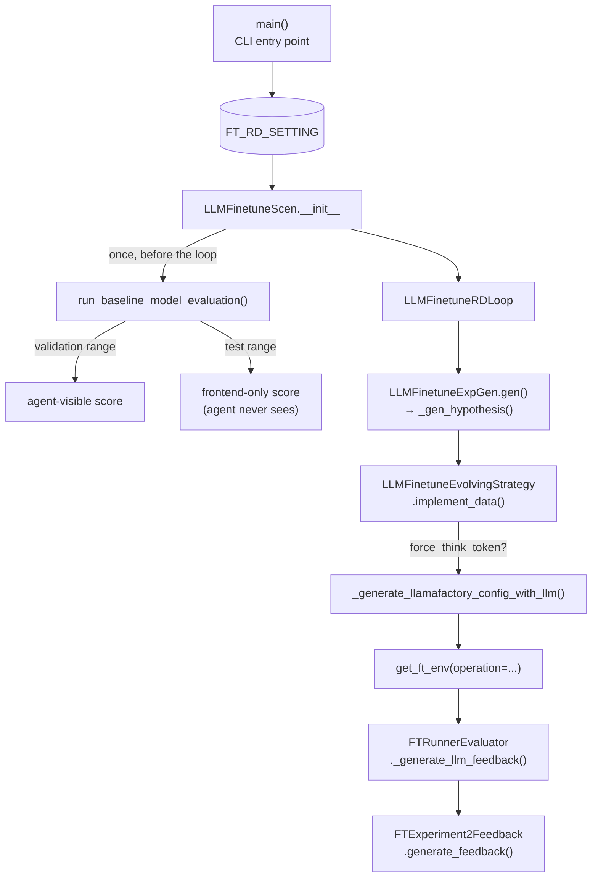

# FT_RD_SETTING — the LLM fine-tuning application config

## Overview
[`FT_RD_SETTING`](../catalog/rdagent/app/finetune/llm/conf.md#FT_RD_SETTING) (`LLMFinetunePropSetting`) is
the sibling application config to
[`DS_RD_SETTING`](rdagent-app-data_science-conf.md): it wires the same generic Research→Development loop
skeleton to a different concrete task — instead of writing a Kaggle-style ML pipeline, Development here
produces a LlamaFactory training config plus a data-processing script, and "the experiment" is measured by
actually running a fine-tuning job and then an OpenCompass-style benchmark, not a Kaggle submission score.
Unlike `DataScienceBasePropSetting`, this settings class does **not** inherit through the legacy
Kaggle/`BasePropSetting` chain — it is a flat, from-scratch `ExtendedBaseSettings` subclass with its own
`FT_` env prefix — even though its `Scenario` class (`LLMFinetuneScen`) directly subclasses `DataScienceScen`
for timeout/description plumbing. Config inheritance and scenario inheritance are independent axes here,
which is easy to assume otherwise.

## Diagram

## Design rationale (why it's built this way)
`LLMFinetunePropSetting` bypasses `BasePropSetting`/`KaggleBasePropSetting` entirely and extends
[`ExtendedBaseSettings`](../catalog/rdagent/core/conf.md#ExtendedBaseSettings) directly — a clean break from
the Kaggle-descended chain that `DataScienceBasePropSetting` (packet:
[`rdagent-app-data_science-conf`](rdagent-app-data_science-conf.md)) still carries. That break is deliberate
at the config layer, but not mirrored at the scenario layer: `LLMFinetuneScen` chooses to subclass
`DataScienceScen` for its timeout/description machinery rather than reinvent it. So the two applications
share scenario plumbing while owning entirely separate settings classes — a reader who assumes "same base
scenario ⇒ same base config" would be wrong here.

Several designed-for features are gated by hard `assert`s in [`main`](../catalog/rdagent/app/finetune/llm/loop.md#main)
rather than a graceful fallback: `user_target_scenario` is asserted to be `None` ("not yet supported, please
specify via benchmark and benchmark_description"), and
[`base_model`](../catalog/rdagent/app/finetune/llm/conf.md#LLMFinetunePropSetting.base_model) is asserted
non-`None` ("Base model auto selection not yet supported, please specify via `--base-model`"). Both fields
exist in the settings schema and are documented as real features — these are known-incomplete capabilities
failing loudly, not capabilities that were removed.

The scenario enforces a held-out evaluation discipline *before* the loop even starts:
[`run_baseline_model_evaluation`](../catalog/rdagent/scenarios/finetune/scen/scenario.md#LLMFinetuneScen.run_baseline_model_evaluation)
calls [`run_benchmark`](../catalog/rdagent/scenarios/finetune/benchmark/benchmark.md#run_benchmark) twice —
once over a validation range the agent is allowed to see, once over a test range the source comments mark
explicitly as "Test score is for frontend display only" and never exposed to the agent. This mirrors the
"aggregated evaluation strategy... standardized train/val/test splits" component
[`wiki/sources/rd-agent.md`](../../../sources/rd-agent.md) attributes to RD-Agent generally, instantiated
here specifically to stop the autonomous loop from directly optimizing against its own grading metric.

[`force_think_token`](../catalog/rdagent/app/finetune/llm/conf.md#LLMFinetunePropSetting.force_think_token)
is a single flag that simultaneously changes the *training-data* contract and the *benchmark postprocessing*
contract: when true, training examples must be wrapped in `<think>...</think>`, and benchmark evaluation runs
an "extract-non-reasoning-content" postprocessor so only the final answer (not the visible reasoning) is
graded; when false, chain-of-thought is still required but the format is flexible and no postprocessor runs.
Coupling both sides in one flag keeps them from drifting apart — but the flag is read live at five separate
call sites (`_gen_hypothesis`, `implement_data`, both `_generate_llm_feedback` evaluators, and
`_generate_llamafactory_config_with_llm`) rather than snapshotted once into experiment state, so flipping it
mid-trace is a real footgun (see Edge cases).

Compared to the Data-Science application's two timeouts (`debug_timeout`/`full_timeout`), this config exposes
four (`data_processing_timeout`, `debug_data_processing_timeout`, `micro_batch_timeout`, `full_timeout`) plus
a separate, independently-zero-able `benchmark_timeout`. That finer partition reflects a genuinely different
task shape: fine-tuning has a data-generation phase (LLM API calls), a cheap micro-batch smoke test before
committing GPU-hours, the real training run, and then a benchmark pass — four distinct failure surfaces a
Kaggle notebook run doesn't have.

## Entry points
- [`main`](../catalog/rdagent/app/finetune/llm/loop.md#main) — the CLI entry point; validates the
  `(user_target_scenario) xor (target_benchmark and benchmark_description)` precondition and the
  `base_model is not None` precondition described above before constructing or resuming an
  `LLMFinetuneRDLoop`.
- [`run_baseline_model_evaluation`](../catalog/rdagent/scenarios/finetune/scen/scenario.md#LLMFinetuneScen.run_baseline_model_evaluation) —
  reached exactly once, synchronously, during scenario construction, before any loop iteration exists; its
  result (`baseline_benchmark_score` / `baseline_benchmark_score_test`) is what every subsequent hypothesis
  is implicitly judged against.
- [`ensure_ft_assets_exist`](../catalog/rdagent/scenarios/finetune/utils.md#ensure_ft_assets_exist) — reached
  both from scenario setup (`_validate_and_prepare_environment`) and again from
  `_gen_hypothesis`, so a hypothesis is never proposed against a dataset/model that isn't actually present on
  disk under `file_path`.

## Mechanism (step-by-step)
1. **CLI-boundary validation.** [`main`](../catalog/rdagent/app/finetune/llm/loop.md#main) writes
   `benchmark`/`benchmark_description`/`dataset`/[`base_model`](../catalog/rdagent/app/finetune/llm/conf.md#LLMFinetunePropSetting.base_model)
   onto [`FT_RD_SETTING`](../catalog/rdagent/app/finetune/llm/conf.md#FT_RD_SETTING) before anything else
   runs, then enforces the two assertions from Design rationale — so a malformed invocation fails at process
   start, not partway through an expensive scenario build.

2. **Baseline-before-loop gate.** During `LLMFinetuneScen` construction,
   [`run_baseline_model_evaluation`](../catalog/rdagent/scenarios/finetune/scen/scenario.md#LLMFinetuneScen.run_baseline_model_evaluation)
   runs [`run_benchmark`](../catalog/rdagent/scenarios/finetune/benchmark/benchmark.md#run_benchmark) against
   the *unmodified* base model on both a validation and a test range, using
   [`file_path`](../catalog/rdagent/app/finetune/llm/conf.md#LLMFinetunePropSetting.file_path) to locate the
   copied model weights. Only the validation number becomes part of the scenario description an LLM ever
   reads; the test number is computed purely for a human-facing dashboard.

3. **Hypothesis generation grounded in the target framework's own schema.**
   [`_gen_hypothesis`](../catalog/rdagent/scenarios/finetune/proposal/proposal.md#LLMFinetuneExpGen._gen_hypothesis)
   first calls [`ensure_ft_assets_exist`](../catalog/rdagent/scenarios/finetune/utils.md#ensure_ft_assets_exist)
   to guarantee the dataset/model exist, then builds its system prompt from the LlamaFactory manager's live
   method/parameter listing and `force_think_token` — the LLM proposing a fine-tuning configuration is shown
   the actual set of trainable methods and hyperparameters available, not asked to invent one from scratch.

4. **Data-generation short-circuiting.** [`implement_data`](../catalog/rdagent/components/coder/finetune/__init__.md#LLMFinetuneEvolvingStrategy.implement_data)
   checks two independent skip conditions before generating anything: a `skip_data_processing` flag set by
   the proposal step (reuse the SOTA's existing data script), and whether the previous `FTDataEvaluator`
   feedback already passed. Only if both checks fall through does it actually re-generate
   `process_data.py`, using `force_think_token` to decide the required CoT wrapping.

5. **Config generation and environment construction.**
   [`_generate_llamafactory_config_with_llm`](../catalog/rdagent/components/coder/finetune/__init__.md#LLMFinetuneEvolvingStrategy._generate_llamafactory_config_with_llm)
   assembles the training YAML from the same LlamaFactory shared/method-specific parameter schema plus
   `force_think_token`, while [`get_ft_env`](../catalog/rdagent/components/coder/finetune/conf.md#get_ft_env)
   picks one of the four operation-keyed timeouts and mounts standard `models`/`datasets`/`output` volumes —
   the environment construction is entirely determined by an `operation` string tag, not by which caller
   invoked it.

6. **Benchmark timeout as a magic zero.** [`get_benchmark_env`](../catalog/rdagent/components/coder/finetune/conf.md#get_benchmark_env)
   treats `benchmark_timeout <= 0` as "no timeout" but implements that by substituting a practical 7-day
   (`86400 * 7`) value rather than actually disabling enforcement — a convention a new caller could easily
   get backwards.

7. **Feedback that prefers structured signal over raw errors.**
   [`generate_feedback`](../catalog/rdagent/scenarios/finetune/dev/feedback.md#FTExperiment2Feedback.generate_feedback)
   branches on whether an `exception` was passed: on failure it first tries to recover the structured
   `execution`/`return_checking`/`code` fields a prior
   [`_generate_llm_feedback`](../catalog/rdagent/scenarios/finetune/train/eval.md#FTRunnerEvaluator._generate_llm_feedback)
   already attached to the workspace, and only falls back to the bare exception string if that's unavailable
   — the failure-analysis path deliberately prefers a previous evaluator's structured read over re-deriving
   one from scratch.

## Key data structures
- [`LLMFinetunePropSetting`](../catalog/rdagent/app/finetune/llm/conf.md#LLMFinetunePropSetting) — the flat
  `ExtendedBaseSettings` subclass described above; a peer of, not a descendant of, `DataScienceBasePropSetting`.
- `FTPathConfig`'s [`datasets`](../catalog/rdagent/components/coder/finetune/conf.md#FTPathConfig.datasets)
  and [`models`](../catalog/rdagent/components/coder/finetune/conf.md#FTPathConfig.models) properties — small
  derived-path helpers, all keyed off the single
  [`file_path`](../catalog/rdagent/app/finetune/llm/conf.md#LLMFinetunePropSetting.file_path) root, that
  several independent functions (`ensure_ft_assets_exist`, `describe_model`, `_get_dataset_info`,
  `download_financeiq_dataset`, `download_model`) assume without re-validating.

## Dynamics (design intent)
[`run_baseline_model_evaluation`](../catalog/rdagent/scenarios/finetune/scen/scenario.md#LLMFinetuneScen.run_baseline_model_evaluation)
and [`describe_dataset_folder`](../catalog/rdagent/scenarios/finetune/scen/utils.md#FinetuneDatasetDescriptor.describe_dataset_folder)
are both `@cache_with_pickle`-memoized (by model/benchmark name and by dataset path hash respectively), so
repeated scenario construction against the same model+benchmark pair skips re-running the (expensive)
baseline benchmark or re-describing a dataset folder already scanned. Unlike the Data-Science application,
[`run_benchmark`](../catalog/rdagent/scenarios/finetune/benchmark/benchmark.md#run_benchmark) is explicitly
GPU-count-aware — `gpu_count` is threaded from `scen.device_info` through to control tensor-parallel sizing
— a hardware-topology concern the Kaggle/MLE-Bench app's Docker-container-level environment config doesn't
have to reason about.

## Edge cases
- `main`'s assertions mean a partially-specified CLI invocation always fails at startup today (e.g. omitting
  `--base-model` fails regardless of how complete the rest of the configuration is) rather than falling back
  to any default.
- `benchmark_timeout: int = 0` reads as "disabled" in the settings schema but is implemented as "use 7 days,"
  not as "wait forever" — a caller reasoning from the field alone would guess wrong.
- `force_think_token`'s effects span the coder, two different evaluators, and benchmark postprocessing;
  nothing in this Subgraph prevents it from being changed between the coding and running phases of the same
  trace, which would desynchronize the data format from the evaluation postprocessor's expectation.

## Open questions
- How `LLaMAFactory_manager.get_info()`/`.models`/`.methods` actually introspect the underlying LlamaFactory
  installation isn't in this packet's Subgraph — step 3's "grounded in the framework's own schema" claim is
  about the *effect* observed in `_gen_hypothesis`'s prompt construction, not the manager's own mechanism.
- `LLMFinetuneScen.real_full_timeout` is a flat `return FT_RD_SETTING.full_timeout` with no escalation,
  unlike its `DataScienceScen` counterpart's multi-stage multiplier (see
  [`rdagent-app-data_science-conf`](rdagent-app-data_science-conf.md)). Whether that's a deliberate
  simplification for this application or an unfinished port of the parent class's behavior isn't stated in
  source.

## See also
- [`rdagent-app-data_science-conf`](rdagent-app-data_science-conf.md) — the sibling application: same
  `RDLoop` skeleton and a `DataScienceScen`-derived scenario, but a config class that does *not* share this
  one's inheritance root.
- [`../../../sources/rd-agent.md`](../../../sources/rd-agent.md) — the paper's aggregated
  train/val/test-split evaluation-strategy component, which `run_baseline_model_evaluation`'s
  validation/test split instantiates for this application.
- [`../../../concepts/research-development-loop.md`](../../../concepts/research-development-loop.md) — the
  general Research/Development split this config's `hypothesis_gen`/`coder`/`runner`/`summarizer` strings
  wire concrete classes into.
