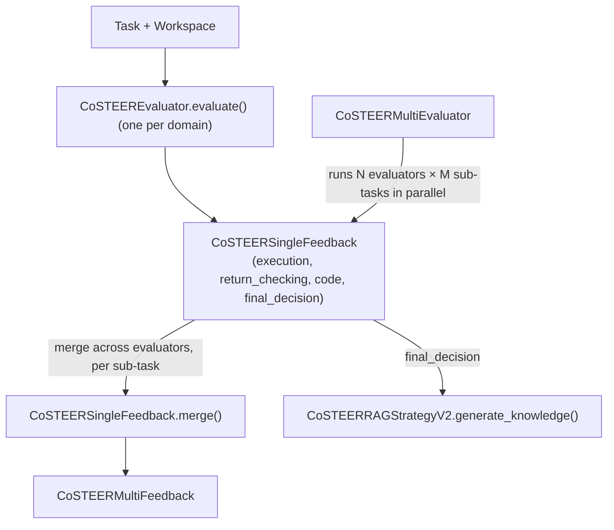

# Co-STEER Evaluators — grading generated code down to one bool

<!-- connect:up:begin -->
> **Cross-repo concept:** part of [closed-loop-experiment-design](../../../concepts/closed-loop-experiment-design.md), [research-development-loop](../../../concepts/research-development-loop.md) across this wiki's repos.
<!-- connect:up:end -->
## Overview

Co-STEER's evaluators are the concrete implementation of the **FC-Evaluation Strategy** half of the
Development phase described in [the RD-Agent paper](../../../sources/rd-agent.md): every domain-specific
coder (data loader, feature engineering, model, ensemble, workflow, factor, RL, LLM fine-tuning) supplies
its own `evaluate()`, and each of those wildly different implementations — one shells out to a subprocess
and greps stdout, another asks an LLM to judge a diff, another just checks a score file exists — is forced
through the same narrow output shape, `CoSTEERSingleFeedback`. That shape has exactly four load-bearing
fields mirroring the four things a generated program can fail at (did it run, did it return the right
thing, is the code itself acceptable, and — collapsing all of that — one boolean). Collapsing everything
to a single `final_decision` bool is what lets everything *downstream* of evaluation (the retry loop, the
knowledge base, the multi-evaluator merge logic) stay completely generic to which of the ~15 `evaluate()`
implementations actually ran.

## Diagram

## Design rationale (why it's built this way)

The abstract base [`CoSTEEREvaluator`](../catalog/rdagent/components/coder/CoSTEER/evaluators.md#CoSTEEREvaluator)
carries almost nothing — just a [`scen`](../catalog/rdagent/components/coder/CoSTEER/evaluators.md#CoSTEEREvaluator.scen)
(`Scenario`) — and its abstract [`evaluate`](../catalog/rdagent/components/coder/CoSTEER/evaluators.md#CoSTEEREvaluator.evaluate)
method takes `**kwargs`. That's deliberate: a data-science pipeline evaluator needs a live Docker environment and
an EDA output; a factor evaluator needs a ground-truth `Workspace` to diff against; a fine-tuning evaluator
needs a training-specific timeout. Rather than growing one bloated shared signature, the base class commits
to nothing but the return type, `CoSTEERSingleFeedback`. That return type is where the real discipline
lives — the docstring on [`CoSTEERSingleFeedback`](../catalog/rdagent/components/coder/CoSTEER/evaluators.md#CoSTEERSingleFeedback)
spells out its four fields as a pipeline: "Execution → Return Value → Code → Final Decision," and the class
overrides `__bool__` to return `final_decision` directly, so any caller anywhere in the codebase can write
`if not feedback:` as a universal retry check without knowing which domain produced the feedback.

The codebase never migrated its older, five-field feedback format (`execution_feedback` /
`shape_feedback` / `code_feedback` / `value_feedback` / `final_feedback`) to the new three-field
(`execution` / `return_checking` / `code`) contract. Instead,
[`CoSTEERSingleFeedbackDeprecated`](../catalog/rdagent/components/coder/CoSTEER/evaluators.md#CoSTEERSingleFeedbackDeprecated)
subclasses the modern `CoSTEERSingleFeedback` and re-exposes `execution`/`return_checking`/`code` as
computed properties over the old fields — e.g. `return_checking` is synthesized on the fly from
`value_feedback` plus `shape_feedback` only when a value was actually generated. This is an adapter, not a
migration: every evaluator still emitting the old five-field shape is automatically speaking the new
contract to any generic consumer (merge, the knowledge base) without its own code changing.

> [!inferred] Why keep both shapes alive rather than pick one? The inline `# TODO: (xiao)` comments in
> source ("it should be more general class for FBWorkspaceExeFeedback... A better name of it may be
> NormalFeedback") read like an in-progress refactor the deprecated adapter was built to make safe to defer
> indefinitely, rather than a design anyone actually wants kept long-term.

## Entry points

- `CoSTEEREvaluator`'s abstract [`evaluate`](../catalog/rdagent/components/coder/CoSTEER/evaluators.md#CoSTEEREvaluator.evaluate) —
  the abstract slot every domain-specific coder fills in; control reaches a concrete override every time
  Co-STEER's evolving strategy needs to score one generated implementation against one task.
- [`CoSTEERMultiEvaluator`](../catalog/rdagent/components/coder/CoSTEER/evaluators.md#CoSTEERMultiEvaluator) —
  the orchestration entry when an experiment has multiple sub-tasks and/or more than one evaluator needs to
  judge each one; this is what a scenario actually instantiates and calls, not the single-task
  `CoSTEEREvaluator` directly.

## Mechanism (step-by-step)

1. **The abstract contract.** [`CoSTEEREvaluator`](../catalog/rdagent/components/coder/CoSTEER/evaluators.md#CoSTEEREvaluator)
   stores only `scen` and requires every subclass to implement
   [`evaluate`](../catalog/rdagent/components/coder/CoSTEER/evaluators.md#CoSTEEREvaluator.evaluate)`(target_task,
   implementation, gt_implementation, **kwargs) -> CoSTEERSingleFeedback`. The open `**kwargs` is what lets
   ~15 unrelated domains share one abstract signature without a common superset of parameters.

2. **Concrete evaluators gate on memory before doing real work.**
   `PipelineCoSTEEREvaluator`'s [`evaluate`](../catalog/rdagent/components/coder/data_science/pipeline/eval.md#PipelineCoSTEEREvaluator.evaluate)
   and
   `WorkflowGeneralCaseSpecEvaluator`'s [`evaluate`](../catalog/rdagent/components/coder/data_science/workflow/eval.md#WorkflowGeneralCaseSpecEvaluator.evaluate)
   both check `queried_knowledge.success_task_to_knowledge_dict` and `.failed_task_info_set` *first* and
   return a cached feedback (or an immediate `final_decision=False` "failed too many times, skip
   implementation" feedback) without re-executing anything — the evaluator doubles as the enforcement point
   for the knowledge base's fail-trial limit (see the knowledge_management concept page for where that limit
   is set).

3. **When execution does happen, it converges on the same shape.**
   `DSRunnerEvaluator`'s [`evaluate`](../catalog/rdagent/scenarios/data_science/dev/runner/eval.md#DSRunnerEvaluator.evaluate)
   runs the workflow in a Docker environment and parses stdout/score files;
   `FactorEvaluatorForCoder`'s [`evaluate`](../catalog/rdagent/components/coder/factor_coder/evaluators.md#FactorEvaluatorForCoder.evaluate)
   instead delegates to a
   [`code_evaluator`](../catalog/rdagent/components/coder/factor_coder/evaluators.md#FactorEvaluatorForCoder.code_evaluator)
   that independently checks execution, code quality, and value correctness. Regardless of domain, the
   output is one [`CoSTEERSingleFeedback`](../catalog/rdagent/components/coder/CoSTEER/evaluators.md#CoSTEERSingleFeedback).

4. **`final_decision` is the only field every generic consumer reads.**
   [`final_decision`](../catalog/rdagent/components/coder/CoSTEER/evaluators.md#CoSTEERSingleFeedback.final_decision)
   is a plain optional bool, but `CoSTEERSingleFeedback.__bool__` returns it directly — so `if not
   feedback:` is a valid, domain-agnostic retry check anywhere downstream, regardless of which `evaluate()`
   produced the object.

5. **The deprecated shape stays interoperable via properties, not a rewrite.**
   [`CoSTEERSingleFeedbackDeprecated`](../catalog/rdagent/components/coder/CoSTEER/evaluators.md#CoSTEERSingleFeedbackDeprecated)
   subclasses `CoSTEERSingleFeedback` but stores the old five fields (`execution_feedback`,
   `shape_feedback`, `code_feedback`,
   [`value_feedback`](../catalog/rdagent/components/coder/CoSTEER/evaluators.md#CoSTEERSingleFeedbackDeprecated.value_feedback),
   [`code_feedback`](../catalog/rdagent/components/coder/CoSTEER/evaluators.md#CoSTEERSingleFeedbackDeprecated.code_feedback))
   and computes `execution`/`return_checking`/`code` from them on read — old evaluators speak the new
   contract for free.

6. **Aggregating across multiple evaluators per sub-task.** When a scenario registers more than one
   evaluator, [`CoSTEERMultiEvaluator`](../catalog/rdagent/components/coder/CoSTEER/evaluators.md#CoSTEERMultiEvaluator)
   runs every evaluator against every sub-task (in parallel), collects one
   [`CoSTEERMultiFeedback`](../catalog/rdagent/components/coder/CoSTEER/evaluators.md#CoSTEERMultiFeedback)
   per evaluator, then folds the per-evaluator feedbacks for a given sub-task into one via
   `CoSTEERSingleFeedback`'s [`merge`](../catalog/rdagent/components/coder/CoSTEER/evaluators.md#CoSTEERSingleFeedback.merge) —
   ANDing `final_decision` across all of them, string-concatenating the text fields, and unioning
   `source_feedback` so provenance survives the merge. A feedback subclass with extra fields, like
   `DSCoderFeedback`'s own [`merge`](../catalog/rdagent/components/coder/data_science/pipeline/eval.md#DSCoderFeedback.merge),
   must override `merge` itself or those extra fields are silently dropped, since the base implementation
   only knows about the four common attributes.

7. **Feed-forward into memory.** Once a sub-task's `final_decision` is settled, the consumer on the other
   side is
   `CoSTEERRAGStrategyV2`'s [`generate_knowledge`](../catalog/rdagent/components/coder/CoSTEER/knowledge_management.md#CoSTEERRAGStrategyV2.generate_knowledge) —
   it reads exactly `final_decision`/`execution`/`return_checking` off the feedback object to decide whether
   to record the implementation as a success node in the knowledge graph or run error analysis on the
   failure (see [the knowledge_management concept page](rdagent-components-coder-CoSTEER-knowledge_management.md)
   for the far side of this handoff).

## Key data structures

- [`CoSTEERSingleFeedback`](../catalog/rdagent/components/coder/CoSTEER/evaluators.md#CoSTEERSingleFeedback) —
  `execution` (str), `return_checking` (str | None), `code` (str),
  [`final_decision`](../catalog/rdagent/components/coder/CoSTEER/evaluators.md#CoSTEERSingleFeedback.final_decision)
  (bool | None), `raw_execution` (full stdout for UI display), and `source_feedback` (a `dict[str, bool]`
  tracking which evaluator tag contributed which decision — needed precisely because `merge` can combine
  several).
- [`CoSTEERSingleFeedbackDeprecated`](../catalog/rdagent/components/coder/CoSTEER/evaluators.md#CoSTEERSingleFeedbackDeprecated) —
  the legacy five-field shape (`execution_feedback`, `shape_feedback`,
  [`code_feedback`](../catalog/rdagent/components/coder/CoSTEER/evaluators.md#CoSTEERSingleFeedbackDeprecated.code_feedback),
  [`value_feedback`](../catalog/rdagent/components/coder/CoSTEER/evaluators.md#CoSTEERSingleFeedbackDeprecated.value_feedback),
  `final_feedback`) adapted onto the modern one.
- [`CoSTEERMultiFeedback`](../catalog/rdagent/components/coder/CoSTEER/evaluators.md#CoSTEERMultiFeedback) —
  a thin list wrapper (`feedback_list`) with `is_acceptable()`/`finished()`/`__bool__` helpers that
  aggregate across every sub-task's feedback in one call.

## Dynamics (design intent)

`CoSTEERMultiEvaluator`'s evaluation loop is generator-based: it first yields an empty
[`CoSTEERMultiFeedback`](../catalog/rdagent/components/coder/CoSTEER/evaluators.md#CoSTEERMultiFeedback)
purely to receive the `evo` object being iterated on (the same two-way generator protocol used throughout
Co-STEER's evolving strategy), then, for each registered evaluator in turn, runs every sub-task's
`evaluate()` in parallel via a multiprocessing helper bounded by a configurable worker count, yielding the
per-evaluator `CoSTEERMultiFeedback` and allowing the caller to interrupt early by sending back `None`. Only
after every evaluator has run does it merge per sub-task, log how many sub-tasks got a `True` final
decision, and — for backward compatibility with the factor coder's legacy bookkeeping — flip
`sub_tasks[i].factor_implementation = True` for every accepted sub-task.

## Edge cases

- `final_decision` arriving from an LLM-authored JSON blob as the string `"true"`/`"false"` rather than a
  real bool is coerced during feedback construction; anything else raises rather than silently defaulting.
- `merge` only knows [`CoSTEERSingleFeedback`](../catalog/rdagent/components/coder/CoSTEER/evaluators.md#CoSTEERSingleFeedback)'s
  own four attributes — richer subclasses lose their extra fields on merge unless they override it (see
  `DSCoderFeedback`'s [`merge`](../catalog/rdagent/components/coder/data_science/pipeline/eval.md#DSCoderFeedback.merge)
  for the one that does).
- [`CoSTEERMultiFeedback`](../catalog/rdagent/components/coder/CoSTEER/evaluators.md#CoSTEERMultiFeedback)'s
  `finished()` and `__bool__` disagree on purpose: `finished()` treats a `None` feedback entry (a skipped
  sub-task) as vacuously fine, while `__bool__` requires every entry's `final_decision` to be truthy — a
  single failing sub-task fails the whole set even if every other sub-task finished.

## Open questions

- Nothing in this packet's subgraph explains why several evaluators (e.g. the factor coder's) still emit
  [`CoSTEERSingleFeedbackDeprecated`](../catalog/rdagent/components/coder/CoSTEER/evaluators.md#CoSTEERSingleFeedbackDeprecated)-shaped
  feedback rather than the modern three-field contract directly — only the adapter mechanism that makes it
  safe to leave as-is is visible here.
- The exact criteria individual `evaluate()` implementations use to populate `return_checking` (which
  value/shape comparisons, what tolerance) live inside each domain's own evaluator and are out of scope for
  this shared-contract page.

## See also

- [Co-STEER knowledge management](rdagent-components-coder-CoSTEER-knowledge_management.md) — what happens
  to a `CoSTEERSingleFeedback` once `final_decision` is settled.
- [Factor coder](rdagent-components-coder-factor_coder-factor.md) — a concrete `Workspace.execute()` whose
  output this evaluator's `evaluate()` wraps into feedback.
- [RD-Agent paper summary](../../../sources/rd-agent.md) — Co-STEER's evaluation strategy as one half of
  the Development phase.
- [`research-development-loop`](../../../concepts/research-development-loop.md),
  [`closed-loop-experiment-design`](../../../concepts/closed-loop-experiment-design.md) — cross-repo
  concept pages this page connects to.
