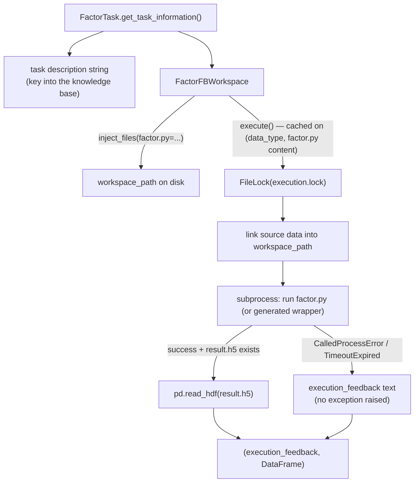

# Factor coder — turning a factor hypothesis into an executed value

<!-- connect:up:begin -->
> **Cross-repo concept:** part of [research-development-loop](../../../concepts/research-development-loop.md) across this wiki's repos.
<!-- connect:up:end -->
## Overview

`FactorTask`/`FactorFBWorkspace` is the quant-finance specialization of Co-STEER's generic `Task`/`Workspace`
pair — the concrete leaf underneath the FC-Coding Workflow half of
[the RD-Agent paper](../../../sources/rd-agent.md)'s Development phase, and the object
[Co-STEER's evaluators](rdagent-components-coder-CoSTEER-evaluators.md) and
[knowledge management](rdagent-components-coder-CoSTEER-knowledge_management.md) pages describe only
abstractly. A factor hypothesis (a named, described, mathematically formulated feature over market data)
becomes a `factor.py` file; `FactorFBWorkspace.execute()` is where that file actually runs against real
data and turns into a pandas `DataFrame` of factor values, with a cached, subprocess-isolated, feedback-not-
exception failure mode designed to be called repeatedly by an evaluator without either re-running expensive
work or crashing the loop on a bad LLM-generated candidate.

## Diagram

## Design rationale (why it's built this way)

`FactorTask` carries `factor_name`, `factor_formulation`, and `variables` as first-class fields rather than
folding everything into `Task.description`, because
[`get_task_information`](../catalog/rdagent/components/coder/factor_coder/factor.md#FactorTask.get_task_information)'s
rendered string is not cosmetic — it's the literal dictionary key
[Co-STEER's knowledge management](rdagent-components-coder-CoSTEER-knowledge_management.md) uses across
`task_to_similar_task_successful_knowledge`, `task_to_former_failed_traces`, and every other retrieval
structure. Two factor tasks are "the same task" for retrieval purposes exactly when this string matches.

[`execute`](../catalog/rdagent/components/coder/factor_coder/factor.md#FactorFBWorkspace.execute) is
decorated with [`cache_with_pickle`](../catalog/rdagent/core/utils.md#cache_with_pickle) keyed on
`(data_type, factor.py content)`, because a factor's evaluator (see
[Co-STEER evaluators](rdagent-components-coder-CoSTEER-evaluators.md)) may call `implementation.execute()`
more than once against the same generated file; without the cache each call would re-run a real subprocess
against real market data. Failures inside `execute()` are captured as plain feedback text rather than
propagated as exceptions whenever `raise_exception` is `False` — a broken LLM-generated `factor.py` produces
a string an evaluator can read and hand back into the next generation prompt, not a crash that kills the
evolving loop.

`execute()` branches on `target_task.version`: version 1 reads from a fixed
[`FACTOR_COSTEER_SETTINGS`](../catalog/rdagent/components/coder/factor_coder/config.md#FACTOR_COSTEER_SETTINGS)
data folder and runs `factor.py` directly; version 2 instead resolves the data path from
[`KAGGLE_IMPLEMENT_SETTING`](../catalog/rdagent/app/kaggle/conf.md#KAGGLE_IMPLEMENT_SETTING)'s
[`local_data_path`](../catalog/rdagent/app/kaggle/conf.md#KaggleBasePropSetting.local_data_path) and
[`competition`](../catalog/rdagent/app/kaggle/conf.md#KaggleBasePropSetting.competition), and runs a
generated wrapper script that imports `factor.py` instead of executing it directly.

> [!inferred] The two `version` branches read as "serve two different data-loading conventions from one
> class" — a Qlib-style fixed dataset (version 1) versus a Kaggle-competition-scoped dataset (version 2) —
> rather than a documented strategy pattern; nothing in this packet's subgraph states the rationale for
> exactly two hardcoded versions instead of a pluggable data-source abstraction.

## Entry points

- `FactorTask`'s [`get_task_information`](../catalog/rdagent/components/coder/factor_coder/factor.md#FactorTask.get_task_information) —
  the canonical serialization of a factor hypothesis into the string every downstream cache/knowledge/prompt
  keys off; overrides the generic `Task`'s
  [`get_task_information`](../catalog/rdagent/core/experiment.md#Task.get_task_information).
- `FactorFBWorkspace`'s [`execute`](../catalog/rdagent/components/coder/factor_coder/factor.md#FactorFBWorkspace.execute) —
  where a candidate `factor.py` actually runs and produces (or fails to produce) a value; reached from every
  factor evaluator and from the Kaggle pipeline's runner.
- `KGFactorRunner`'s [`develop`](../catalog/rdagent/scenarios/kaggle/developer/runner.md#KGFactorRunner.develop) —
  the Kaggle pipeline's entry point that calls `execute()` on every sub-workspace in an experiment to
  assemble the accepted factors into a feature set.

## Mechanism (step-by-step)

1. **A hypothesis becomes a task.** [`FactorTask`](../catalog/rdagent/components/coder/factor_coder/factor.md#FactorTask)
   is a thin subclass of [`CoSTEERTask`](../catalog/rdagent/components/coder/CoSTEER/task.md#CoSTEERTask)
   (itself a [`Task`](../catalog/rdagent/core/experiment.md#Task)) adding `factor_name`,
   `factor_formulation`, and `variables`;
   [`get_task_information`](../catalog/rdagent/components/coder/factor_coder/factor.md#FactorTask.get_task_information)
   renders all of them into one description string.

2. **Generated code lands in a workspace.** The candidate `factor.py` is held in a
   [`FactorFBWorkspace`](../catalog/rdagent/components/coder/factor_coder/factor.md#FactorFBWorkspace), a
   specialization of the generic [`FBWorkspace`](../catalog/rdagent/core/experiment.md#FBWorkspace) whose
   [`file_dict`](../catalog/rdagent/core/experiment.md#FBWorkspace.file_dict) holds the source and whose
   [`workspace_path`](../catalog/rdagent/core/experiment.md#FBWorkspace.workspace_path) is a fresh,
   UUID-named directory; [`inject_files`](../catalog/rdagent/core/experiment.md#FBWorkspace.inject_files) is
   what writes that source to disk before execution.

3. **Execution is cached at the file-content level.** `FactorFBWorkspace`'s
   [`execute`](../catalog/rdagent/components/coder/factor_coder/factor.md#FactorFBWorkspace.execute)
   is wrapped with `@`[`cache_with_pickle`](../catalog/rdagent/core/utils.md#cache_with_pickle)`(hash_func)`,
   hashing on `data_type` plus the live `factor.py` content — calling `execute()` twice on an unchanged file
   replays the previous `(execution_feedback, DataFrame)` result rather than re-running the subprocess.

4. **Data resolution and isolation.** Inside the uncached path, a `FileLock` on
   `workspace_path/execution.lock` serializes concurrent access to the same workspace; the source data
   location is resolved by
   [`target_task`](../catalog/rdagent/core/experiment.md#Workspace.target_task)`.version` (see Design
   rationale for the two branches), symlinked into the workspace, and `factor.py` (or, for version 2, a
   generated wrapper) is run as a subprocess under a hard timeout.

5. **Failures become feedback text, not exceptions.** Still inside
   [`execute`](../catalog/rdagent/components/coder/factor_coder/factor.md#FactorFBWorkspace.execute), a
   `CalledProcessError` or a `TimeoutExpired` from the subprocess is folded into an `execution_feedback`
   string (local paths scrubbed, long output truncated to head + tail) instead of propagating, whenever
   `raise_exception` is `False` — a broken implementation produces a string for the evaluator to read, not
   a stack trace that kills the run.

6. **Only a real output file yields a real value.** On a clean subprocess exit, `execute()` looks for
   `result.h5` in the workspace and reads it with `pd.read_hdf`; only if that file exists *and* the
   subprocess reported success does it return an actual `DataFrame` — any other combination returns `None`
   for the value alongside whatever `execution_feedback` text explains why. This is exactly the
   `(execution_feedback, gen_df)` tuple `FactorEvaluatorForCoder`'s
   [`evaluate`](../catalog/rdagent/components/coder/factor_coder/evaluators.md#FactorEvaluatorForCoder.evaluate)
   (see [Co-STEER evaluators](rdagent-components-coder-CoSTEER-evaluators.md)) unpacks first.

7. **Assembling accepted factors into a feature set.** `KGFactorRunner`'s
   [`develop`](../catalog/rdagent/scenarios/kaggle/developer/runner.md#KGFactorRunner.develop)
   calls `execute()` on every non-empty sub-workspace of an experiment, and only for the ones that produced
   a real `DataFrame` does it [`inject_files`](../catalog/rdagent/core/experiment.md#FBWorkspace.inject_files)
   the accepted `factor.py` into the parent experiment workspace as a numbered `feature_XXXXX.py` — a factor
   that fails to execute simply never becomes part of the final feature file, with no separate accept/reject
   step beyond "did `execute()` return a `DataFrame`."

## Key data structures

- [`FactorTask`](../catalog/rdagent/components/coder/factor_coder/factor.md#FactorTask) fields:
  `factor_name`, `factor_description` (a property aliasing `description`), `factor_formulation`,
  `variables`, `factor_resources`, and `factor_implementation` (a legacy bool flag toggled by the multi-
  evaluator aggregation described on the evaluators page).
- [`FactorFBWorkspace`](../catalog/rdagent/components/coder/factor_coder/factor.md#FactorFBWorkspace) —
  class-level `FB_*` string constants used as canned `execution_feedback` text (success, missing code,
  output file found/not found), and a `raise_exception` flag switching between "raise on failure" and
  "return failure as a feedback string" modes.

## Dynamics (design intent)

The `FileLock` on `execution.lock` means two calls into `execute()` against the same `FactorFBWorkspace`
instance (e.g. a manual debug run racing an evaluator's call) serialize rather than corrupt each other's
`result.h5`. The `version` branch is a static dispatch decided once at task construction — it is not
re-evaluated per call to `execute()`.

## Edge cases

- If `file_dict` has no `"factor.py"` at all, `execute()` short-circuits before touching the filesystem:
  it raises [`CoderError`](../catalog/rdagent/core/exception.md#CoderError)'s sibling `CodeFormatError` if
  `raise_exception` is set, otherwise returns `(FB_CODE_NOT_SET, None)` — a total generation failure (no
  code at all) is handled identically to any other failure path, just via an earlier return.
- `execution_feedback` text longer than 2000 characters is truncated to its first and last 1000 characters
  with a "...hidden long error message..." marker in between — no evaluator or LLM judge downstream ever
  sees an arbitrarily large stack trace.
- The cache's hash function returns `None` whenever `raise_exception` is `True` or `"factor.py"` isn't set
  yet.

  > [!inferred] `cache_with_pickle`'s own cache-hit/miss handling for a `None` hash isn't in this packet's
  > subgraph; reading only this file, it's reasonable to assume a `None` hash disables caching for that
  > call, but that behavior is defined inside `cache_with_pickle` itself, not here.

## Open questions

- Whether cache invalidation for `execute()` ever accounts for changes to the *upstream data* (not just
  `factor.py`'s own content) is not visible in this packet — the hash function only reads `data_type` and
  the code string.
- `FactorExperiment`/`FeatureExperiment` are defined at the bottom of this file as plain aliases of the
  generic experiment base class — not itself a symbol in this packet's subgraph — so their exact role
  beyond naming is out of scope here.

## See also

- [Co-STEER evaluators](rdagent-components-coder-CoSTEER-evaluators.md) —
  `FactorEvaluatorForCoder.evaluate` consumes this page's `execute()` output directly.
- [Co-STEER knowledge management](rdagent-components-coder-CoSTEER-knowledge_management.md) —
  `FactorTask.get_task_information()`'s output string is the key into that page's retrieval structures.
- [Experiment, Workspace, and Task](rdagent-core-experiment.md) — the generic `Task`/`FBWorkspace` currency
  this page specializes.
- [RD-Agent paper summary](../../../sources/rd-agent.md) — the FC-Coding Workflow component this page
  implements for the quant-factor domain.
- [`research-development-loop`](../../../concepts/research-development-loop.md) — the cross-repo concept
  page this page connects to.
